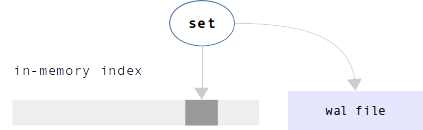
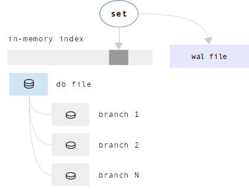
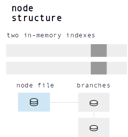
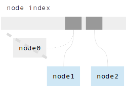
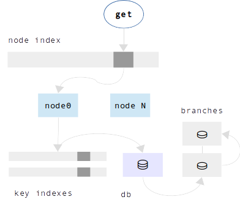
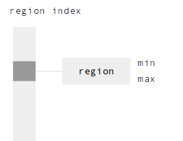

.. _index-two_storage_engines:

A storage engine is a set of very-low-level routines which actually store and
retrieve tuple values. Tarantool offers a choice of two storage engines:

* memtx (the in-memory storage engine) is the default and was the first to
  arrive.

* vinyl (the on-disk storage engine) is a working key-value engine and will
  especially appeal to users who like to see data go directly to disk, so that
  recovery time might be shorter and database size might be larger. On the other
  hand, vinyl lacks some functions and options that are available with memtx.
  Where that is the case, the relevant description in this manual will contain
  a note beginning with the words "Note re storage engine". See also a coverage
  for all :ref:`the differences between memtx and vinyl <vinyl_diff>` further
  on this page.

To specify that the engine should be vinyl, add the clause ``engine = 'vinyl'``
when creating a space, for example:
``space = box.schema.space.create('name', {engine='vinyl'})``.

.. _vinyl_diff:

--------------------------------------------------------------------------------
        Differences between memtx and vinyl storage engines
--------------------------------------------------------------------------------

The primary difference between memtx and vinyl is that memtx is an "in-memory"
engine while vinyl is an "on-disk" engine. An in-memory storage engine is
generally faster, and the memtx engine is justifiably the default for Tarantool,
but there are two situations where an on-disk engine such as vinyl would be
preferable:

1. when the database is larger than the available memory and adding more
   memory is not a realistic option;
2. when the server frequently goes down due to errors or a simple desire to
   save power -- bringing the server back up and restoring a memtx database
   into memory takes time.

Here are behavior differences which affect programmers. All of these differences
have been noted elsewhere in sentences that begin with the words
"Note re storage engine: vinyl".

* | With memtx, the index type can be TREE or HASH or :ref:`RTREE <box_index-rtree>` or BITSET.
  | With vinyl, the only index type is TREE.

* | With memtx, :ref:`create_index <box_space-create_index>` can be done at any time.
  | With vinyl, secondary indexes must be created before tuples are inserted.

* | With memtx, for index searches, ``nil`` may be allowed within a search key.
  | With vinyl, ``nil`` is only allowed at the end of a search key.

* | With memtx, temporary spaces are supported.
  | With vinyl, they are not.

* | With memtx, the :ref:`alter() <box_index-alter>` and :ref:`len() <box_space-len>`
    and :ref:`random() <box_index-random>` functions are supported.
  | With vinyl, they are not.

* | With memtx, the :ref:`count() <box_index-count>` function takes a constant
    amount of time.
  | With vinyl, it takes a variable amount of time depending on index size.

* | With memtx, delete will return deleted tuple, if any.
  | With vinyl, delete will always return nil.

It was explained :ref:`earlier <index-yields_must_happen>` that memtx does not
"yield" on a select request, it yields only on data-change requests. However,
vinyl does yield on a select request, or on an equivalent such as ``get()`` or
``pairs()``. This has significance for
:ref:`cooperative multitasking <atomic-cooperative_multitasking>`.

--------------------------------------------------------------------------------
Vinyl features
--------------------------------------------------------------------------------

* Full ACID compliance
* Multi-Version Concurrency Control (MVCC)
* Pure Append-Only
* Multi-threaded (Client access and Engine scalability)
* Multi-databases support (Single environment and WAL)
* Multi-Statement and Single-Statement Transactions (Snapshot Isolation (SI),
  multi-databases)
* Asynchronous or synchronous transaction execution (Callback triggered versus
  blocking)
* Separate storage formats: key-value (Default), or document (Keys are part of
  value)
* Update without read
* Consistent Cursors
* Prefix search
* Point-in-Time Snapshots
* Versional database creation and asynchronous shutdown/drop
* Asynchronous Online/Hot Backup
* Compression (Per region, both lz4 and zstd are supported)
* Metadata Compression (By default)
* Key Compression (Compress key duplicates, including suffixes)
* Easy to use (Minimalist API)
* Easy to integrate (Native support of using as storage engine)
* Easy to write bindings (Very FFI-friendly, API designed to be stable in future)
* Easy to build in (Amalgamated, compiles into two C files)
* Event loop friendly
* Zero-Configuration (Tuned by default)
* Implemented as a small library **written in C** with zero dependencies
* BSD Licensed
* Zstandard compression for all data files

It is appropriate for databases that cannot fit in memory, where access via
secondary keys is not required.

In vinyl terminology:

* There is one **Environment**.
* An Environment has N **Databases** - a vinyl database is like a Tarantool `space`.
* A Database has N **Ranges**.
* A Range has one **Range File**.
* A Range File has N **Runs**.
* A Run has N **Regions** - a vinyl Region is like a B-tree `page`.
* A Region has **keys** and **values** - a vinyl key-value is like a Tarantool `tuple`.

A key and its associated value are together, so when one accesses a key one gets
the whole tuple. In other words, in vinyl the data is stored in the index. There
are up to two in-memory copies of an index, as well as the copy in the Range File.

For operations that insert or update tuples - called Set operations in vinyl -
vinyl makes changes to in-memory copies of the index, and writes to Tarantool's
Write-ahead Log. A scheduler assigns tasks to multiple background threads for
transferring index data from memory to disk, and for reorganizing Runs. To
support transactions, Set operations can be delayed until an explicit commit. If
multiple users access the same tuples simultaneously, the concurrency control
method is `MVCC`_ and the isolation level is `Snapshot`_.

.. _MVCC: https://en.wikipedia.org/wiki/Multiversion_concurrency_control
.. _Snapshot: https://en.wikipedia.org/wiki/Snapshot_isolation

Formally, in terms of disk accesses, vinyl has the following algorithmic complexity:

* **Set** - the worst case is O(*1*) append-only key writes to the Write-Ahead
  Log + in-memory Range index searches + in-memory index inserts
* **Delete** - the worst case is O(*1*) key writes and in-memory index inserts
  (the same as **Set**)
* **Get** - the worst case is `amortized`_ O(*max\_run\_count\_per\_node*)
  random Region reads from a single Range file, which itself does in-memory index
  search + in-memory Region search
* **Range** - queries, the worst case of full Database scan is amortized
  O(*total\_Region\_count*) + in-memory key-index searches for each Range

.. _amortized: https://en.wikipedia.org/wiki/Amortized_analysis

--------------------------------------------------------------------------------
                    Under the hood
--------------------------------------------------------------------------------

In this section, to illustrate internals, we will discuss this example:

1. filling an empty database with one million tuples (we'll call them "keys" to
   emphasize the indexed nature)
2. reading all stored tuples in the original order.

~~~~~~~~~~~~~~~~~~~~~~~~~~~~~~~~~~
 Inserting the first 200.000 keys
~~~~~~~~~~~~~~~~~~~~~~~~~~~~~~~~~~

During the first 200,000 Set operations, inserted keys first go to the
in-memory index. To maintain persistence, information about each Set
operation is written to Tarantool's Write-ahead Log.

At this point, we have keys in an in-memory index and records in the Write-ahead Log.

~~~~~~~~~~~~~~~~~~~~~~~~~~~~~~~~~~~
  Inserting the next 300.000 keys
~~~~~~~~~~~~~~~~~~~~~~~~~~~~~~~~~~~

As the in-memory index becomes too large for available memory, the index must be
copied from memory to disk. The on-disk copy of the in-memory index is called a
Run. To save the Run, a new file is created, the Range File. We will call
it **db file** for this example.

The scheduler wakes a worker thread in the background, a Run Creation Thread.
The thread creates a second in-memory index. If there are Set operations taking
place while the thread is working, their contention effect will be small because
they will operate on the second in-memory index.

When the Run Creation Thread finishes the task, the first in-memory index is
freed.

~~~~~~~~~~~~~~~~~~~~~~~~~~~~~~~~~~~
  Inserting the next 200.000 keys
~~~~~~~~~~~~~~~~~~~~~~~~~~~~~~~~~~~

Several times, the in-memory index becomes too large and a Run Creation
Thread transfers the keys to a Run. The Runs have been appended to the
end of db file. The number of created Runs becomes large.

There is a user-settable maximum number of Runs per Range. When the number of
Runs reaches this maximum, the vinyl scheduler wakes a **Compaction Thread**
for the db file. The Compaction Thread merges the keys in all the Runs, and
creates one or more new db files.

Now there are multiple pairs of in-memory indexes, and each pair has an
associated db file. The combination of the in-memory indexes and the db file is
called a **Range**, and the db file is called a **Range File**.

Thus the contents of a Range are: a range of sorted key values, stored in Runs
of a Range File and (when necessary) in memory. Since the ranges do not overlap,
each Range can be handled independently. Therefore, while one of the background
threads is working on Range 1, another background thread can be working on Range 2,
without contention. That means that all the background operations (Run Creation,
Compaction, Garbage Collection, and Backup) can take place in parallel on multiple
threads.

The foregoing explanation will now be repeated with different wording.

Before the Compaction there was one Range, which was created automatically when
the Database was initialized. The Range had:

a. an in-memory index with some keys in it,
b. a Range File with several Runs,
c. a Write-Ahead Log file recording the Set operations, in the order they happened.

The number of Runs became too big, so the vinyl scheduler starts the
Compaction Thread and creates two new Ranges.

.. image:: vinyl/i7.png
    :align: center
    :alt: i7.png

So, each of the two new Range Files contains half of the keys that were in the
original Range. The Range's in-memory indexes are split in the same way.

After the splitting, vinyl must take into account that: while the Compaction
was going on in the background, there might have been more Set operations taking
place in parallel. These Set operations would have changed one of the in-memory
indexes, and these changes too will be merged.

When the Compaction Thread finishes, the original Range is deleted, and
information about the new Ranges is inserted into an in-memory **Range Index**.

This Range Index is used for all Set operations and all searches. Since the Range
Index has the minimum and maximum key values that are in each Range, it is
straightforward to scan it to find what Range would contain a particular key value.

.. image:: vinyl/i9.png
    :align: center
    :alt: i9.png

~~~~~~~~~~~~~~~~~~~~~~~~~~~~~~~~~~~
  Inserting the last 300.000 keys
~~~~~~~~~~~~~~~~~~~~~~~~~~~~~~~~~~~

The final 300,000 Set operations take place; the background threads continue to
create new Runs and do more Compactions. After the millionth insertion, the
Database has four Ranges.

The inserting is done. Now, because the words "memory" and "disk" have appeared
in this explanation several times, here are a few words about how vinyl is
designed to use these resources most efficiently:

* If there is more memory available, then Run Creation and Compaction will be
  less frequent, and there will be fewer disk accesses.
* The best vinyl performance will occur if there is no setting of a memory limit,
  but this must be balanced against other considerations, such as requirements
  for the memtx storage engine. If there is a setting of a memory limit, the
  vinyl scheduler will give priority to the Ranges that have the largest
  in-memory indexes, so that the largest memory blocks are freed first.
* To make the most of hard drives and Flash, vinyl will delay operations that
  require disk access (except the writing of the Write-ahead Log which is
  specially tunable), so that the accesses are done in large sequential blocks.
* Overwriting does not occur; vinyl is an "append-only" engine.

~~~~~~~~~~~~~~~~~~~~~~~~~~~~~~~~~~~
       Reading million keys
~~~~~~~~~~~~~~~~~~~~~~~~~~~~~~~~~~~

We will now start to read the million rows in the order that they were inserted,
which was random.

During the Get (search), vinyl first finds the correct Range by looking in the
Range Index. Then it searches the Range's first in-memory index, and/or the Range's
second in-memory index, and/or each Run of the Range, starting from the end of
the Range File.

Remember that a Run is divided into Regions, which are like what would be
called "pages" or "blocks" in a B-tree. For each Run, there is a list of the
Regions and their minimum/maximum key values - the Region Index - as well as
some metadata.

Region Indexes are loaded into memory when the Database is opened. Since the
Database's Range Index and the Region Indexes are normally in-memory, searching
and retrieving a tuple might require only zero or one disk accesses. However,
when memory is limited and there are many Runs, search time may rise.
For each additional Run there is a possible additional disk access during a
search. Also, it is impossible to maintain memory limits without doing a Run
Creation process, because new Set operations might occur more quickly than the
Compaction process can run.

.. image:: vinyl/i14.png
    :align: center
    :alt: i14.png

Vinyl is read optimized. It is very likely that the most recently created
Runs (hot data) will be in the file system cache. The scheduler will give
priority to the Ranges which have the largest in-memory indexes and the most
Runs.

The scheduler may also try to arrange that a Range will have only one Run,
which will ensure the average number of disk seeks for each search is O(*1*).

