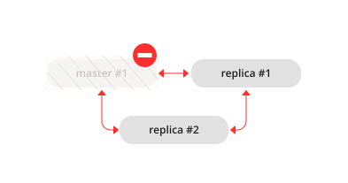

.. _replication-recover:

================================================================================
Recovering from a degraded state
================================================================================

"Degraded state" is a situation when the master becomes unavailable -- due to
hardware or network failure, or due to a programming bug.

In a master-replica set, if a master disappears, error messages appear on the
replicas stating that the connection is lost:

.. code-block:: console

   $ # messages from a replica's log
   2017-06-14 16:23:10.993 [19153] main/105/applier/replicator@192.168.0. I> can't read row
   2017-06-14 16:23:10.993 [19153] main/105/applier/replicator@192.168.0. coio.cc:349 !> SystemError
   unexpected EOF when reading from socket, called on fd 17, aka 192.168.0.101:57815,
   peer of 192.168.0.101:3301: Broken pipe
   2017-06-14 16:23:10.993 [19153] main/105/applier/replicator@192.168.0. I> will retry every 1 second
   2017-06-14 16:23:10.993 [19153] relay/[::ffff:192.168.0.101]:/101/main I> the replica has closed its socket, exiting
   2017-06-14 16:23:10.993 [19153] relay/[::ffff:192.168.0.101]:/101/main C> exiting the relay loop

... and the master's status is reported as "disconnected":

.. code-block:: tarantoolsession

   # report from replica #1
   tarantool> box.info.replication
   ---
   - 1:
       id: 1
       uuid: 70e8e9dc-e38d-4046-99e5-d25419267229
       lsn: 542
       upstream:
         peer: replicator@192.168.0.101:3301
         lag: 0.00026607513427734
         status: disconnected
         idle: 182.36929893494
         message: connect, called on fd 13, aka 192.168.0.101:58244
     2:
       id: 2
       uuid: fb252ac7-5c34-4459-84d0-54d248b8c87e
       lsn: 0
     3:
       id: 3
       uuid: fd7681d8-255f-4237-b8bb-c4fb9d99024d
       lsn: 0
       downstream:
         vclock: {1: 542}
   ...

.. code-block:: tarantoolsession

   # report from replica #2
   tarantool> box.info.replication
   ---
   - 1:
       id: 1
       uuid: 70e8e9dc-e38d-4046-99e5-d25419267229
       lsn: 542
       upstream:
         peer: replicator@192.168.0.101:3301
         lag: 0.00027203559875488
         status: disconnected
         idle: 186.76988101006
         message: connect, called on fd 13, aka 192.168.0.101:58253
     2:
       id: 2
       uuid: fb252ac7-5c34-4459-84d0-54d248b8c87e
       lsn: 0
       upstream:
         status: follow
         idle: 186.76960110664
         peer: replicator@192.168.0.102:3301
         lag: 0.00020599365234375
     3:
       id: 3
       uuid: fd7681d8-255f-4237-b8bb-c4fb9d99024d
       lsn: 0
   ...

To declare that one of the replicas must now take over as a new master:

1. Make sure that the old master is gone for good:

   * change network routing rules to avoid any more packets being delivered to
     the master, or
   * shut down the master instance, if you have access to the machine, or
   * power off the container or the machine.

2. Say ``box.cfg{read_only=false, listen=URI}`` on the replica, and
   ``box.cfg{replication=URI}`` on the other replicas in the set.

.. NOTE::

   If there are updates on the old master that were not propagated before the
   old master went down,
   :ref:`re-apply them manually <admin-disaster_recovery-master_replica>` to the
   new master using ``tarantoolctl cat`` and ``tarantoolctl play`` commands.

There is no automatic way for a replica to detect that the master is gone
forever, since sources of failure and replication environments vary
significantly. So the detection of degraded state requires an external observer.
