REFERENCE GUIDE
===============

The Reference Guide contains descriptions of all the SQL statements and
major clauses.

ALTER TABLE Statement
~~~~~~~~~~~~~~~~~~~~~

ALTER TABLE table-name RENAME TO new-table-name;

or

ALTER TABLE table-name ADD [COLUMN] column definition;

ALTER is used to either change a table's name or to add new columns.

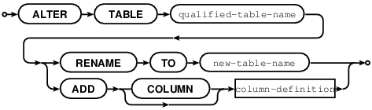

Known flaws: (Issue#2349)

ALTER does not work well. It is not legal to add a column at time of
writing.

Newly added:

ALTER TABLE table-name ADD CONSTRAINT constraint-name
foreign-key-constraint-definition;

(See "Foreign key Constraint definition" for syntax of
foreign-constraint-definition.)

This is only legal if the table is empty.

ALTER TABLE table-name DROP CONSTRAINT constraint-name;

It is not possible to say "CREATE TABLE table\_a ... REFERENCES table\_b
..." if table b does not exist yet. This is a situation where ALTER
TABLE is handy -- users can :CREATE TABLE table\_a" without the foreign
key, then "CREATE TABLE table\_b", then ALTER TABLE table\_a ...
REFERENCES table\_b ...".

CREATE TABLE Statement
~~~~~~~~~~~~~~~~~~~~~~

CREATE TABLE [IF NOT EXISTS] table-name (column-definition list
[,table-constraint list]);

or

CREATE TABLE [IF NOT EXISTS] table-name AS subquery-clause;

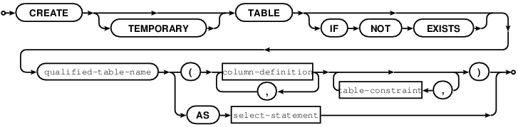

Create a new base table, usually called a "table".

The table-name must be an identifier which is valid according to the
rules for identifiers, and must not be the name of an already existing
base table or view or index.

The column-definition list is a comma-separated list of column
definitions.

The optional table-constraint list is a comma-separated list of table
constraints.

Column definitions must come before table constraint definitions.

A table-element-list must be a comma-separated list of table elements;
each table element may be either a column definition or a table
constraint definition.

A subquery-clause must be a clause which has the same format as a SELECT
statement.

Rules:

If there is a subquery-clause:

Tarantool calculates column-definitions based

on the names and data types of the items in

the subquery's select-list.

The subquery-clause should not be used.

A primary key is necessary; it can be specified with a table constraint
PRIMARY KEY ...

There must be at least one column.

The maximum number of columns is 2000.

The maximum length of a row depends on the memtx\_max\_tuple\_size
configuration option.

If IF NOT EXISTS is specified, and there is already a table with the
same name, the statement is ignored.

Actions:

1 Tarantool evaluates each definition in column-definition-list,

and returns an error if any of the rules is violated.

2 Tarantool makes a new definition in the schema.

3 Tarantool makes new indexes for PRIMARY KEY or UNIQUE constraints.

4 Tarantool effectively executes a COMMIT statement.

Examples:

-- the simplest form, with one column and one constraint

CREATE TABLE t1 (s1 INTEGER, PRIMARY KEY (s1));

-- variation of the simplest form, with delimited identifiers and an
inline comment

CREATE TABLE "t1" ("s1" INT /\* abbreviation of INTEGER \*/, PRIMARY KEY
("s1"));

-- two columns, one named constraint

CREATE TABLE t1 (s1 INTEGER, s2 TEXT, CONSTRAINT c1 PRIMARY KEY (s1,
s2));

Known flaws: (Issue#2350)

-  It is mandatory to supply a PRIMARY KEY clause. (Issue#2284)

-  It is okay if two constraints have the same name.

-  The requirement, that column definitions must come before

table constraint definitions, is not standard.

Column Definition
~~~~~~~~~~~~~~~~~

column-name [data-type] [column-constraint [, column-constraint ...]

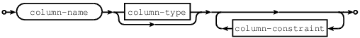

column-type:

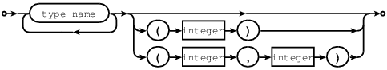

column-constraint:

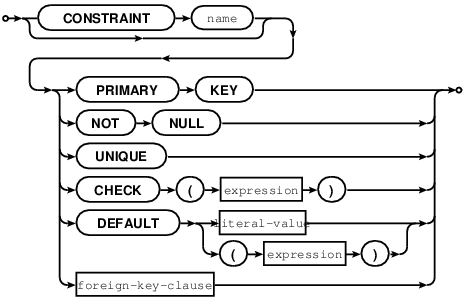
    

Define a column, which is a table-element used in a CREATE TABLE
statement.

The column-name must be an identifier which is valid according to the
rules for identifiers.

Each column-name must be unique within a table.

These are the possible data types, their affinities (what they can be
automatically converted to or compared with), and their equivalent types
in Tarantool/NOSQL:

+----------+-----------+------------+
| SQL TYPE | CANONICAL | FIELD TYPE |
+==========+===========+============+
| FLOAT    | REAL      | NUMBER     |
+----------+-----------+------------+
| REAL     | REAL      | NUMBER     |
+----------+-----------+------------+
| DOUBLE   | REAL      | NUMBER     |
+----------+-----------+------------+
| NUMERIC  | REAL      | NUMBER     | 
+----------+-----------+------------+
| DECIMAL  | REAL      | NUMBER     |
+----------+-----------+------------+
| INTEGER  | INTEGER   | INTEGER    | 
+----------+-----------+------------+
| TEXT     | TEXT      | STRING     |
+----------+-----------+------------+
| VARCHAR  | TEXT      | STRING     |
+----------+-----------+------------+
| CHAR     | TEXT      | STRING     |
+----------+-----------+------------+
| BLOB     | BLOB      | SCALAR     |
+----------+-----------+------------+
| DATETIME | REAL      | NUMBER     |
+----------+-----------+------------+
| DATE     | REAL      | NUMBER     |
+----------+-----------+------------+
| TIME     | REAL      | NUMBER     | 
+----------+-----------+------------+

Abbreviation = NUM
Abbreviation = INT
not yet working
CHAR and VARCHAR must be followed by a length in parentheses, for
example VARCHAR(44). NUMERIC and DECIMAL may be followed by precision in
parentheses, or precision, scale in parentheses, for example DECIMAL(4)
or DECIMAL(4,2).

The data-type may be followed by [COLLATE collation-name]; for details
see section COLLATE clause.

The column-constraint may be NOT NULL, or PRIMARY KEY, or UNIQUE, or
CHECK (expression), or DEFAULT literal-value \| (expression), or
REFERENCES foreign-key-clause. NOT NULL means "it is illegal to assign a
NULL to this column". PRIMARY KEY and UNIQUE and CHECK are explained in
the later section "Constraint definition". DEFAULT
literal-value\|(expression) means "if INSERT does not assign to this
column then assign literal-value or expression result to this column" --
if there is no DEFAULT clause then DEFAULT NULL is assumed.

The maximum number of columns is 2000.

Rules:

1 If data-type is integer, then values in this column should be signed
integers between -9,223,372,036,854,775,808 and
9,223,372,036,854,775,807.

2 If data-type is real or float or double or numeric or decimal, then
values in this column should be numbers in the 8-byte IEEE
floating-point range.

3 If data-type is text or varchar or char, then values in this column
should be character strings.

4 If data-type is blob, then values in this column should be binary
strings.

5 If column-constraint is PRIMARY KEY, this is a shorthand for a
separate table-constraint definition: "PRIMARY KEY (column-name)".

6 If column-constraint is UNIQUE, this is a shorthand for a separate
table-constraint definition: "UNIQUE (column-name)".

7 If column-constraint is NOT NULL, then data in the column cannot be
NULL.

Columns defined with PRIMARY KEY are automatically NOT NULL.

8 If column-constraint is DEFAULT literal-value, then the column will
get that value

if nothing is explicitly assigned to it.

Examples (assume these are parts of a CREATE TABLE statement)

-- the simple form with column-name and data-type

column1 INTEGER

-- with column-name and data-type and column-constraint

column1 TEXT PRIMARY KEY

Known flaws: (Issue#2351): size limits are not enforced for CHAR or
VARCHAR

Column Definition -- Relation to NoSQL
~~~~~~~~~~~~~~~~~~~~~~~~~~~~~~~~~~~~~~

When you specify a data type, that affects the storage which must be
compatible with data types in Tarantool's NoSQL. Ultimately the
constraints that affect the underlying NoSQL data type have an effect on
the SQL data types as well.

See the chart in the previous section to see what an underlying
data-type is.

For example, suppose a table is created with CREATE TABLE t (s1 FLOAT
PRIMARY KEY, s2 REAL, s3 DOUBLE, s4 NUMERIC, s5 DECIMAL); and it
contains one row, and none of the values is NULL. Then, since all those
data types have underlying data type = real, SELECT TYPEOF(s1),
TYPEOF(s2), TYPEOF(s3), TYPEOF(s4), TYPEOF(s5); should return 'real',
'real', 'real', 'real', 'real'.

If two items have SQL data types that have the same underlying type,
then they are compatible for all assignment or comparison purposes.

If two items have SQL data types that have different underlying types,
then these rules may apply:

\*\* Implicit cast (assignment of a type-X value to a type-Y target)

In the following, [1] is shorthand for "value 1 inside a column of a
declared type", not necessarily literal value 1.

Assign to INT:

From REAL: Truncation (not founding) occurs. For example: if "SET
int\_column = [1.9]", int\_column beomes 1.

::

            Too-large values become big negatives. For example: if "SET int_column = [INF]", int_colmn becomes -2147483648

From BLOB: nothing is allowed except NULL

From CHAR: If it can be converted to a number, it is allowed. Otherwise
it is illegal.

Assign to REAL:

From INT: always allowed

From BLOB: nothing is allowed except NULL

From CHAR: If it can be converted to a number, it is allowed. Exception:
'Inf' is not allowed

Assign to CHAR:

From INT: any number is allowed

From REAL: any number is allowed. INF becomes 'Inf'

From BLOB: nothing is allowed except NULL, for example "SET char\_column
= [X'44']" is illegal.

Assign to BLOB:

From INT: any number is allowed

From REAL: any number is allowed. INF becomes 'INF' (sic. not 'Inf')

From CHAR: any string is allowed

\*\* Explicit cast (for example CAST('5' as BLOB)

Anything allowed with implicit cast is allowed.

Plus: cast from BLOB is allowed.

\*\* Comparison

When comparing INT to CHAR or BLOB: if the CHAR or BLOB can be converted
to a number X, then it is X

Conversion is done before comparison.

Example: if FLOAT column contains INF, and BLOB column contains '1e555',
they are equal.

If the conversion is not possible, then the number is always less than
the char or blob.

Example: 1e55 < '' is TRUE.

When comparing FLOAT TO FLOAT: INF=INF.

When comparing CHAR to BLOB: CHAR is always less than BLOB, except that
blank strings are equal.

Additionally the data type specification affects the underlying storage,
which is in a NoSQL space. The table in the previous section shows the
normal way that Tarantool/NOSQL will store SQL values, except that
Tarantool/NoSQL will store NULL values as a separate data type for
everything except 'scalar'.

To enforce some restrictions that Tarantool does not enforce
automatically, add CHECK clauses, like

CREATE TABLE t ("smallint" INTEGER PRIMARY KEY, CHECK ("smallint" <=
32767 AND "smallint" >= -32768));

CREATE TABLE t ("shorttext" CHAR(10) PRIMARY KEY, CHECK
(length("shorttext") <= 10));

but this may not be reliable and may cause inserts or updates to be
slow.

Known Flaws: (Issue#2352)

-  Some 'affinity rules' exist. The affinity rules are being replaced by
   more standard rules, but it takes time.

For example: If an underlying type is integer, then Tarantool will
convert strings to integers -- for example

UPDATE t SET integer\_column = '3';

will put the integer 3 in, not the string '3'. This behavior is
temporary.

Constraint Definition
~~~~~~~~~~~~~~~~~~~~~

[CONSTRAINT constraint-name]

primary-key-constraint \| unique-constraint \| check-constraint \|
foreign-key-constraint

.. image:: image_5.png
    

    

Define a constraint, which is a table-element used in a CREATE TABLE
statement.

The constraint-name must be an identifier which is valid according to
the rules for identifiers.

PRIMARY KEY constraints look like this:

PRIMARY KEY (column-name [, column-name...])

There is a shorthand: specifying PRIMARY KEY in a column definition.

Every table must have one and only one primary key.

Primary-key columns are automatically NOT NULL.

Primary-key columns are automatically indexed.

Primary-key columns are unique, that is, it is illegal to have two rows
which have the same values for the columns specified in the constraint.

Examples:

-- this is a table with a one-column primary-key constraint

CREATE TABLE t1 (s1 int, PRIMARY KEY (s1));

-- this is the column-definition shorthand for the same thing:

CREATE TABLE t1 (s1 int PRIMARY KEY);

-- this is a table with a two-column primary-key constraint

CREATE TABLE t2 (s1 INT, s2 INT, PRIMARY KEY (s1, s2));

-- this is an example of an attempted primary-key violation

-- (the third INSERT will fail because 55, 'a' is a duplicate)

CREATE TABLE t3 (s1 INT, s2 CHAR(10), PRIMARY KEY (s1, s2));

INSERT INTO t3 VALUES (55, 'a');

INSERT INTO t3 VALUES (55, 'b');

INSERT INTO t3 VALUES (55, 'a');

PRIMARY KEY AUTOINCREMENT constraints look like this:

PRIMARY KEY (column-name AUTOINCREMENT)

Column-names may be followed by [COLLATE clause] [ ASC\|DESC].

There is a shorthand: specifying PRIMARY KEY in a column definition.

column-name INTEGER PRIMARY KEY

When autoincrement is specified, there can be only one primary-key
column and it must be an integer.

As the name suggests, values in this column are automatically
incremented.

That is: if a user inserts NULL in the column, then the stored value
will be the smallest non-negative integer that has not already been used

UNIQUE constraints look like this:

UNIQUE (column-name [, column-name...])

There is a shorthand: specifying UNIQUE in a column definition.

Column-names may be followed by [COLLATE clause] [ ASC\|DESC].

Unique constraints are similar to primary-key constraints, except that:
every table must have exactly one primary key, but may have zero or one
or any other number of unique keys.

Also, unlike primary keys, unique keys are not automatically NOT NULL.

Unique columns are automatically indexed.

Unique columns are unique, that is, it is illegal to have two rows with
the same values.

Examples:

-- this is a table with a one-column primary-key constraint

-- and a one-column unique constraint

CREATE TABLE t1 (s1 INT, s2 INT, PRIMARY KEY (s1), UNIQUE (s2));

-- this is the column-definition shorthand for the same thing:

CREATE TABLE t1 (s1 INT PRIMARY KEY, s2 INT UNIQUE);

-- this is a table with a two-column unique constraint

CREATE TABLE t2 (s1 INT PRIMARY KEY, s2 INT, UNIQUE (s2, s1));

-- this is an example of an attempted unique-key violation

-- (the third INSERT will not fail because NULL is not a duplicate)

-- (the fourth INSERT will fail because 'a' is a duplicate)

CREATE TABLE t3 (s1 INT PRIMARY KEY, s2 CHAR(10), UNIQUE (s2));

INSERT INTO t3 VALUES (1, 'a');

INSERT INTO t3 VALUES (2, NULL);

INSERT INTO t3 VALUES (3, NULL);

INSERT INTO t3 VALUES (4, 'a');

CHECK constraints look like this:

CHECK (expression)

There is a shorthand: specifying CHECK in a column definition.

The expression may be anything that returns a boolean result = true or
false or unknown.

The expression may not contain a subquery.

If the expression contains a column name, the column must exist in the
table.

If a CHECK constraint is specified, the table must not contain rows
where the expression is false. (The table may contain rows where the
expression is either true or unknown.)

Examples:

-- this is a table with a one-column primary-key constraint

-- and a check constraint

CREATE TABLE t1 (s1 INT PRIMARY KEY, s2 INT, CHECK (s2 <> s1));

-- this is an attempt to violate the constraint, it will fail

INSERT INTO t1 VALUES (1, 1);

-- this is okay because comparison with NULL won't return false

INSERT INTO t1 VALUES (1, NULL);

-- a constraint that makes it difficult to insert lower case

CHECK (s1 = UPPER(s1))

Known flaws:

-  The constraint name is not stored and duplicate constraint names are
   allowed (except for foreign keys).

-  Try:

CREATE TABLE t99 (s1 INT,UNIQUE(s1,s1),PRIMARY KEY(s1));

The statement causes no error message, although (s1,s1) is probably a
user error.

-  There are no ALTER statements to drop a constraint,

or to add a constraint, after the table is created (except for foreign
keys).

Constraint Definition for foreign keys

FOREIGN KEY constraints look like this:

FOREIGN KEY (referencing-column-name [, referencing-column-name...])

REFERENCES referenced-table-name [(referenced-column-name [,
referenced-column-name...]])

[MATCH FULL] [update-or-delete-rules]

There is a shorthand: specifying REFERENCES in a column definition.

The referencing column names must be defined in the table that is being
created. The referenced table name must refer to a table that already
exists, or to the table that is being created. The referenced column
names must be defined in the referenced table, and have similar data
types. There must be a PRIMARY KEY or UNIQUE constraint or UNIQUE index
on the referenced column names.

The words MATCH FULL are optional and have no effect.

If a foreign-key constraint exists and foreign-key checking is enabled,
then the values in the referencing columns must equal values in the
referenced columns of the referenced table, or at least one of the
referencing columns must contain NULL.

Examples:

-- A foreign key referencing a primary key in the same table

CREATE TABLE t1 (s1 INT PRIMARY KEY, s2 INT, FOREIGN KEY (s2) REFERENCES
t1 (s1));

-- The same thing with column shorthand

CREATE TABLE t1 (s1 INT PRIMARY KEY, s2 REFERENCES t1(s1));

-- An attempt to violate the constraint -- this will fail

INSERT INTO t1 VALUES (1,2);

-- A NULL in the referencing column -- this will succeed

INSERT INTO t1 VALUES (1,NULL);

-- A reference to a primary key that now exists -- this will succeed

INSERT INTO t1 VALUES (2,1);

The optional update-or-delete rules look like this:

ON {UPDATE\|DELETE} { CASCADE \| SET DEFAULT \| SET NULL}

and the idea is: if something changes the referenced key, then one of
three possible "referential actions" takes place:

CASCADE: the change that is applied for the referenced key is applied
for the referencing key

SET DEFAULT: the referencing key is set to its default value

SET NULL: the referencing key is set to NULL.

For example:

CREATE TABLE f1 (ordinal INT PRIMARY KEY, referenced\_planet CHAR(10)
UNIQUE NOT NULL);

CREATE TABLE f2 (ordinal INT PRIMARY KEY,

::

                referring_planet CHAR(10) DEFAULT 'Earth',

                FOREIGN KEY (referring_planet) REFERENCES f1 (referenced_planet)

                ON UPDATE SET DEFAULT

                ON DELETE CASCADE);

INSERT INTO f1 VALUES (1,'Mercury'),(2,'Venus'),(3,'Earth');

INSERT INTO f2 VALUES (1,'Mercury'),(2,'Mercury');

UPDATE f1 SET referenced\_planet = 'Mars' WHERE referenced\_planet =
'Mercury';

SELECT \* FROM f2;

DELETE FROM f1 WHERE referenced\_planet = 'Earth';

SELECT \* FROM f2;

... In this example, the UPDATE statement changes the referenced key,
and he clause is ON UPDATE SET DEFAULT, therefore both of the rows in f2
have referring\_planet set to their default value, which is 'Earth'. The
DELETE statement deletes the row that has 'Earth', and the clause is ON
DELETE CASCADE, therefore both of the rows in f2 are deleted.

Known flaws:

-  Foreign keys can have a MATCH clause (issue#3455).

Constraint Conflict Clauses
~~~~~~~~~~~~~~~~~~~~~~~~~~~

In a CREATE TABLE statement:

CREATE TABLE ... constraint-definition ON CONFLICT {ABORT \| FAIL \|
IGNORE \| REPLACE \| ROLLBACK} ...;

In an INSERT or UPDATE statement:

{INSERT\|UPDATE} OR {ABORT \| FAIL \| IGNORE \| REPLACE \| ROLLBACK}
...;

The standard way to handle a constraint violation is "statement
rollback" -- all rows affected by the statement are restored to their
original values -- and an error is returned. However, Tarantool allows
the user to specify non-standard ways to handle PRIMARY KEY, UNIQUE,
CHECK, and NOT NULL constraint violations.

ABORT -- do statement rollback and return an error. This is the default
and is recommended, so a user's best strategy is to never use constraint
conflict clauses.

FAIL -- return an error but do not do statement rollback.

IGNORE -- do not insert or update the row whose update would cause an
error, but do not do statement rollback and do not return an error. Due
to optimizations related to NoSQL, handling with IGNORE may be slightly
faster than handling with ABORT.

REPLACE -- (for a UNIQUE or PRIMARY KEY constraint) -- instead of
inserting a new row, delete the old row before putting in the new one;
(for a NOT NULL constraint for a column that has a non-NULL default
value) replace the NULL value with the column's default value; (for a
NOT NULL constraint for a column that has a NULL default value) do
statement rollback and return an error; (for a CHECK constraint) -- do
statement rollback and return an error. If REPLACE action causes a row
to be deleted, and if PRAGMA recursive\_triggers was specified earlier,
then delete triggers (if any) are activated.

ROLLBACK -- do transaction rollback and return an error.

The order of constraint evaluation is described in section Order of
Execution in Data-Change Statements.

For example, suppose a new table t has one column and the column has a
unique constraint.

A transaction starts with START TRANSACTION.

The first statement in the transaction is INSERT INTO t VALUES (1),(2);

i.e. "insert 1, then insert 2" -- Tarantool processes the new rows in
order.

This statement always succeeds, there are no constraint violations.

The second SQL statement is INSERT INTO t VALUES (3),(2),(5);

i.e. "insert 3, then insert 2".

Inserting 3 is not a problem, but inserting 2 is a problem -- it would
violate the UNIQUE constraint.

If behavior is ABORT: the second statement is rolled back, there is an
error message. The table now contains (1),(2).

If behavior is FAIL: the second statement is not rolled back, there is
an error message. The table now contains (1),(2),(3).

If behavior is IGNORE: the second statement is not rolled back, the (2)
is not inserted, there is no error message. The table now contains
(1),(2),(3),(5).

If behavior is REPLACE: the second statement is not rolled back, the
first (2) is replaced by the second (2), there is no error message. The
table now contains (1),(2),(3),(5).

If behavior is ROLLBACK: the statement is rolled back, and the first
statement is rolled back,

and there is an error message. The table now contains nothing.

There are two ways to specify the behavior: at the end of the CREATE
TABLE statement constraint clause, or as an extra clause in an INSERT or
UPDATE statement. Specification in the INSERT or UPDATE statement takes
precedence.

Another example:

DROP TABLE t1;

CREATE TABLE t1 (s1 INTEGER PRIMARY KEY ON CONFLICT REPLACE, s2
INTEGER);

INSERT INTO t1 VALUES (1, NULL); -- now t1 contains (1,NULL)

INSERT INTO t1 VALUES (1, 1); -- now t1 contains (1,1)

INSERT OR ABORT INTO t1 VALUES (1,2); -- now t1 contains (1,1)

INSERT OR IGNORE INTO t1 VALUES (1,2),(3,4); -- now t1 contains
(1,1),(3,4)

PRAGMA recursive\_triggers(true);

CREATE TRIGGER t1d

AFTER DELETE ON t1 FOR EACH ROW

BEGIN

INSERT INTO t1 VALUES (18,25);

END;

INSERT INTO t1 VALUES (1,4); -- now t1 contains (1,4),(3,4),(18,35)

COLLATE clause
~~~~~~~~~~~~~~

COLLATE collation-name

The collation-name must identify an existing collation.

The COLLATE clause will be allowed:

() in CREATE INDEX

Example: CREATE INDEX i ON mb (s1 COLLATE "unicode");

() in CREATE TABLE as part of column definition

Example: CREATE TABLE mb (s1 CHAR(5) COLLATE "unicode");

() in CREATE TABLE as part of UNIQUE definition

Example: CREATE TABLE mb (a CHAR(5), b CHAR(10), PRIMARY KEY(a),
UNIQUE(b COLLATE "unicode\_ci" DESC));

() in string expressions

Example: SELECT 'a' = 'b' COLLATE "unicode"

::

            FROM t

            WHERE s1 = 'b' COLLATE "unicode"

            ORDER BY s1 COLLATE "unicode";

The list of collations can be seen with: PRAGMA collation\_list;

The collation rules comply completely with the Unicode Technical
Standard #10 "Unicode Collation Algorithm"
http://unicode.org/reports/tr10/ and the default character order is as
in the *Default Unicode Collation Element Table (DUCET).* The four
permanent collations are:

"none" (not applicable)

"unicode" (characters are in DUCET order with all weights considered)

"unicode\_ci" (characters are in DUCET order with only primary weight
considered)

"binary" (characters are in code point order)

These identifiers must be quoted and in lower case because they are in
lower case in Tarantool/NoSQL.

If one says COLLATE "binary", this is equivalent to asking for what is
sometimes called "code point order" because, if the contents are in the
UTF-8 character set, characters with larger code points will appear
after characters with lower code points.

If one makes a new collation with Tarantool/NoSQL thus:

box.internal.collation.create('SWEDISH\_S1', 'ICU', 'sv\_SE',
{strength='primary'});

later in the same session one can say COLLATE swedish\_s1.

In an expression, COLLATE is an operator with higher precedence than
anything except '~'. This is fine because there are no other useful
operators except \|\| and comparison.

After \|\|, collation is preserved.

In an expression with more than one COLLATE clause, the first COLLATE
clause has higher precedence (there is no error). Therefore

SELECT 'ÄÄ' = 'Ę' COLLATE "unicode\_ci" \|\| 'Ę' COLLATE swedish\_s1;

returns false but

SELECT 'ÄÄ' = 'Ę' COLLATE swedish\_s1 \|\| 'Ę' COLLATE "unicode\_ci";

returns true.

In an expression with no COLLATE clauses, literals have collation
"binary", columns have the collation specified by CREATE TABLE.

In other words, to pick a collation, we use:

the first COLLATE clause in an expression

else the the column's COLLATE clause if it was specified

else "binary".

However, for searches and sometimes for sorting, the collation may be an
index's collation, so all non-index COLLATE clauses are ignored.

EXPLAIN will not show the name of what collation was used, but will show
the collation's characteristics.

Known flaws:

-  It is not an error to apply a COLLATE clause to a non-string column
   or expression, but it means nothing. (Issue#3804)

-  LIKE does not follow exactly the same rules as = for collations
   (Issue#3589)

DROP TABLE Statement
~~~~~~~~~~~~~~~~~~~~

DROP TABLE [IF EXISTS] table-name;

.. image:: image_6.png
    

    

Drop a table.

The table-name must identify a table that was created earlier with the
CREATE TABLE statement.

Rules:

If there is a view that references the table, the drop will fail.

If there is a foreign key that references the table, the drop will fail.

Actions:

1 Tarantool returns an error if the table does not exist.

2 The table and all its data are dropped.

3 All indexes for the table are dropped.

4 All triggers for the table are dropped.

5 Tarantool effectively executes a COMMIT statement.

Examples:

-- the simple case

DROP TABLE t31;

-- with an IF EXISTS clause

DROP TABLE IF EXISTS t31;

See also: DROP VIEW

CREATE VIEW Statement
~~~~~~~~~~~~~~~~~~~~~

CREATE VIEW [IF NOT EXISTS] view-name [(column-list)] AS subquery;

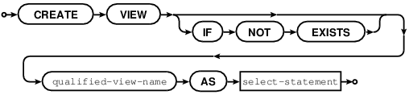
    

    

Create a new viewed table, usually called a "view".

The view-name must be valid according to the rules for identifiers.

The optional column-list must be a comma-separated list of names of
columns in the view.

The syntax of the subquery must be the same as the syntax of a SELECT
statement, or of a VALUES clause.

Rules:

There must not already be a base table or view with the same name as
view-name.

If column-list is specified, the number of columns in column-list must
be the same as the number of columns in the select-list of the subquery.

Actions:

1 Tarantool will throw an error if a rule is violated.

2 Tarantool will create a new persistent object with column-names equal
to the names in the column-list or the names in the subquery's
select-list.

3 Tarantool effectively executes a COMMIT statement.

Examples:

-- the simple case

CREATE VIEW v AS SELECT column1, column2 FROM t;

-- with a column-list

CREATE VIEW v (a,b) AS SELECT column1, column2 FROM t;

Known flaws:

-  It is not possible to insert or update or delete from a view,
   although sometimes a possible substitution is to create an INSTEAD OF
   trigger.

DROP VIEW Statement
~~~~~~~~~~~~~~~~~~~

DROP VIEW [IF EXISTS] view-name;

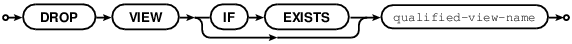
    

    

Drop a view.

The view-name must identify a view that was created earlier with the
CREATE VIEW statement.

Rules:

None.

Actions:

1 Tarantool returns an error if the view does not exist.

2 The view is dropped.

3 All triggers for the view are dropped.

4 Tarantool effectively executes a COMMIT statement.

Examples:

-- the simple case

DROP VIEW v31;

-- with an IF EXISTS clause

DROP VIEW IF EXISTS v31;

See also: DROP TABLE

CREATE TRIGGER Statement
~~~~~~~~~~~~~~~~~~~~~~~~

CREATE TRIGGER [IF NOT EXISTS] trigger-name

BEFORE\|AFTER\|INSTEAD OF

INSERT\|UPDATE\|DELETE ON table-name

[FOR EACH ROW]

[WHEN (search-condition)]

BEGIN

update-statement \| insert-statement \| delete-statement \|
select-statement;

[update-statement \| insert-statement \| delete-statement \|
select-statement; ...]

END;

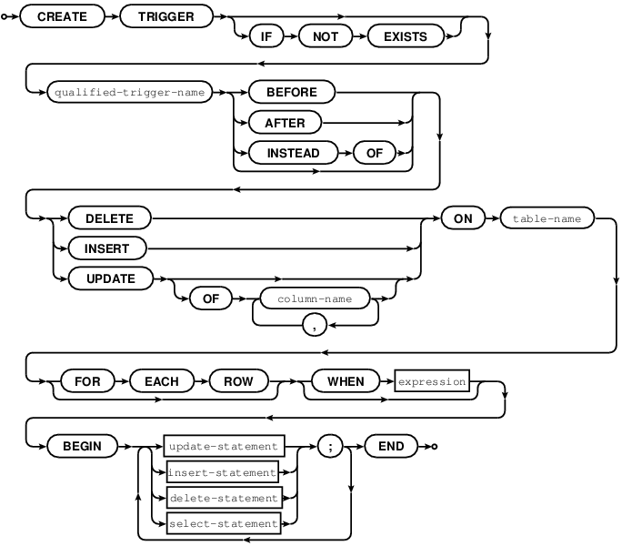
    

    

The trigger-name must be valid according to the rules for identifiers.

If the trigger action time is BEFORE or AFTER, then the table-name must
refer to an existing base table.

If the trigger action time is INSTEAD OF, then the table-name must refer
to an existing view

Rules:

There must not already be a trigger with the same name as trigger-name.

The statements between BEGIN and END should not refer to the table-name
mentioned in the ON clause.

The statements between BEGIN and END should not contain an INDEXED BY
clause.

Actions:

1 Tarantool will throw an error if a rule is violated.

2 Tarantool will create a new trigger.

3 Tarantool effectively executes a COMMIT statement.

Examples:

-- the simple case

CREATE TRIGGER tr BEFORE INSERT ON t1 BEGIN DELETE FROM t2; END;

-- with IF NOT EXISTS clause

CREATE TRIGGER IF NOT EXISTS tr BEFORE INSERT ON t1 BEGIN DELETE FROM
t2; END;

-- with FOR EACH ROW and WHEN clauses

CREATE TRIGGER tr BEFORE INSERT ON t1 FOR EACH ROW WHEN a=5 BEGIN DELETE
FROM t2; END;

-- with multiple statements between BEGIN and END

CREATE TRIGGER tr BEFORE INSERT ON t1 BEGIN DELETE FROM t2; INSERT INTO
t3 VALUES (1); END;

See also Trigger Extra Clauses and Trigger Activation.

Trigger Extra Clauses
~~~~~~~~~~~~~~~~~~~~~

UPDATE OF column-list

After BEFORE\|AFTER UPDATE it is optional to add

OF column-list

If any of the columns in column-list is affected at the time the row is
processed, then the trigger will be activated for that row.

For example,

CREATE TRIGGER trigger\_on\_table1

BEFORE UPDATE OF column1, column2 ON table1

FOR EACH ROW

BEGIN UPDATE table2 SET column1 = column1 + 1; END;

UPDATE table1 SET column3 = column3 + 1; -- Trigger will not be
activated

UPDATE table1 SET column2 = column2 + 0; -- Trigger will be activated

WHEN

After table-name [FOR EACH ROW] it is optional to add

[WHEN expression]

If the expression is true at the time the row is processed, then the
trigger will be activated for that row.

For example,

CREATE TRIGGER trigger\_on\_table1 BEFORE UPDATE ON table1 FOR EACH ROW

WHEN TIME('now') > '20:00:00'

BEGIN UPDATE table2 SET column1 = column1 + 1; END;

This trigger will not be activated unless it is after 20:00:00.

Warning: triggers that depend on time-of-day calculations are not
dependable.

OLD and NEW

The keywords OLD and NEW have special meaning in the context of trigger
action:

OLD.column-name refers to the value of column-name before the change.

NEW.column-name refers to the value of column-name after the change.

For example,

CREATE TABLE table1 (column1 CHAR(15) PRIMARY KEY);

CREATE TABLE table2 (column1 CHAR(15) PRIMARY KEY, column2 CHAR(15));

INSERT INTO table1 VALUES ('old value');

INSERT INTO table2 VALUES ('', '');

CREATE TRIGGER trigger\_on\_table1 BEFORE UPDATE ON table1 FOR EACH ROW

BEGIN UPDATE table2 SET column1 = old.column1, column2 = new.column1;
END;

UPDATE table1 SET column1 = 'new value';

SELECT \* FROM table2;

At the beginning of the UPDATE for the single row of table1, the value
in column1 is 'old value' -- so that is what is seen as "old.column1".

At the end of the UPDATE for the single row of table1, the value in
column1 is 'new value' -- so that is what is seen as "new.column1".

(OLD and NEW are qualifiers for table1, not table2.)

Therefore, SELECT \* FROM table2; returns

--  ['old value', 'new value']

OLD.column-name does not exist for an INSERT trigger.

NEW.column-name does not exist for a DELETE trigger.

OLD and NEW are read-only; you cannot change their values.

Deprecated or illegal statements

It is legal for the trigger action to include a SELECT statement or a
REPLACE statement, but not recommended.

It is illegal for the trigger action to include a qualified column
reference other than OLD.column-name or NEW.column-name. For example,
CREATE TRIGGER ... BEGIN UPDATE table1 SET table1.column1=5; END; is
illegal.

It is illegal for the trigger action to include statements that include
a WITH clause, a DEFAULT VALUES clause, or an INDEXED BY clause.

It is usually not a good idea to have a trigger on table1 which causes a
change on table2, and at the same time have a trigger on table2 which
causes a change on table1.

For example,

CREATE TRIGGER trigger\_on\_table1

BEFORE UPDATE ON table1

FOR EACH ROW

BEGIN UPDATE table2 SET column1 = column1 + 1; END;

CREATE TRIGGER trigger\_on\_table2

BEFORE UPDATE ON table2

FOR EACH ROW

BEGIN UPDATE table1 SET column1 = column1 + 1; END;

Luckily UPDATE table1 ... will not cause an infinite loop, because
Tarantool recognizes when it has already updated so it will stop.
However, not every DBMS acts this way.

Known flaws (issue#2505)

-  Triggered WHEN clauses can't have column names

Trigger Activation
~~~~~~~~~~~~~~~~~~

These are remarks concerning trigger activation.

Standard Terminology:

"trigger action time" = BEFORE or AFTER or INSTEAD OF

"trigger event" = INSERT or DELETE or UPDATE

"triggered statement" = BEGIN ... INSERT\|DELETE\|UPDATE ... END

"triggered when clause" = WHEN (search condition)

"activate" = execute a triggered statement

Some vendors use the word "fire" instead of "activate".

If there is more than one trigger for the same trigger event, Tarantool
may execute the triggers in any order.

It is possible for a triggered statement to cause activation of another
triggered statement. For example, this is legal:

CREATE TRIGGER on\_t1 BEFORE DELETE ON t1 BEGIN DELETE FROM t2; END;

CREATE TRIGGER on\_t2 BEFORE DELETE ON t2 BEGIN DELETE FROM t3; END;

Activation occurs FOR EACH ROW, not FOR EACH STATEMENT. Therefore, if no
rows are candidates for insert or update or delete, then no triggers are
activated. It is recommended to say FOR EACH ROW explicitly, although
currently it is not a mandatory clause.

The BEFORE trigger is activated even if the trigger event fails.

If an UPDATE trigger event does not make a change, the trigger is
activated anyway. For example, if row 1 column1 contains 'a', and the
trigger event is "UPDATE ... SET column1 = 'a';", the trigger is
activated.

The triggered statement may refer to a function

RAISE(FAIL, error-message)

If a triggered statement invokes a RAISE(FAIL, error-message) function,
or if a triggered statement causes an error, then execution stops
immediately.

The triggered statement may refer to column values within the rows being
changed. The row "as of before" the change is called the "old" row
(which makes sense only for UPDATE and DELETE statements); the row "as
of after" the change is called the "new" row (which makes sense only for
UPDATE and INSERT statements). This example shows how an INSERT can be
done to a view by referring to the "new" row ...

CREATE TABLE t (s1 INT PRIMARY KEY, s2 INT);

CREATE VIEW v AS SELECT s1, s2 FROM t;

CREATE TRIGGER tv INSTEAD OF INSERT ON v

BEGIN INSERT INTO t VALUES (new.s1, new.s2); END;

INSERT INTO v VALUES (1,2);

Ordinarily saying INSERT INTO view\_name ... is illegal

in Tarantool, so this is a workaround.

When INSERT or UPDATE or DELETE occurs for table X, Tarantool usually
operates in this order described by section "Order of Execution in
Data-change statements". Ignoring the details there, one can think of
the basic scheme like this:

For each row

Perform constraint checks

For each BEFORE trigger that refers to table X

::

    Check that the trigger's WHEN condition is true.

    Execute what is in the trigger's BEGIN|END block.

Insert or update or delete the row in table X.

Perform more constraint checks

For each AFTER trigger that refers to table X

::

    Check that the trigger's WHEN condition is true.

    Execute what is in the trigger's BEGIN|END block.

However, Tarantool does not guarantee execution order when there are
multiple constraints, or multiple triggers for the same event (including
NoSQL on\_replace triggers or SQL INSTEAD OF triggers that affect a view
of table X).

The maximum number of trigger activations per statement is 32.

INSTEAD OF Triggers
~~~~~~~~~~~~~~~~~~~

A trigger which is created with the clause

INSTEAD OF {INSERT\|UPDATE\|DELETE} ON view-name

is an INSTEAD OF trigger. For each affected row, the trigger action is
performed "instead of" the INSERT or UPDATE or DELETE statement that
causes trigger activation.

For example:

Ordinarily it is illegal to INSERT rows in a view, but it is legal to
create a trigger which intercepts attempts to INSERT, and puts rows in
the underlying base table:

CREATE TABLE t1 (column1 INT PRIMARY KEY, column2 INT);

CREATE VIEW v1 AS SELECT column1, column2 FROM t1;

CREATE TRIGGER t1 INSTEAD OF INSERT ON v1 FOR EACH ROW BEGIN

INSERT INTO t1 VALUES (NEW.column1, NEW.column2); END;

INSERT INTO v1 VALUES (1, 1);

... The result will be: table t1 will contain a new row.

INSTEAD OF triggers are only legal for views.

BEFORE or AFTER triggers are not legal for views.

It is legal to create INSTEAD OF triggers with triggered WHEN clauses.

Known flaws:

-  It is legal to create INSTEAD OF triggers with UPDATE OF column-list
   clauses, but they are not standard SQL. Example: CREATE TRIGGER et1
   INSTEAD OF UPDATE OF column2,column1 ON ev1 FOR EACH ROW BEGIN INSERT
   INTO et2 VALUES (NEW.column1, NEW.column2); END;

DROP TRIGGER Statement
~~~~~~~~~~~~~~~~~~~~~~

DROP TRIGGER [IF EXISTS] trigger-name;

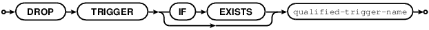
    

    

Drop a trigger.

The trigger-name must identify a trigger that was created earlier with
the CREATE TRIGGER statement.

Rules:

None.

Actions:

1 Tarantool returns an error if the trigger does not exist.

2 The trigger is dropped.

3 Tarantool effectively executes a COMMIT statement.

Examples:

-- the simple case

DROP TRIGGER tr;

-- with an IF EXISTS clause

DROP TRIGGER IF EXISTS tr;

CREATE INDEX Statement
~~~~~~~~~~~~~~~~~~~~~~

CREATE [UNIQUE] INDEX [IF NOT EXISTS] index-name

ON table-name

(column-list);

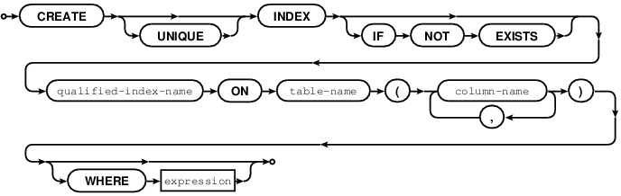
    

    

Create an index.

The index-name must be valid according to the rules for identifiers.

The table-name must refer to an existing table.

The column-list must be a comma-separated list of names of columns in
the table.

Each column name may be followed by "[COLLATE clause] [ ASC\|DESC]".

Rules:

There must not already be an index or table with the same name as
index-name.

The maximum number of indexes per table is 128.

Actions:

1 Tarantool will throw an error if a rule is violated.

2 If the new index is UNIQUE, Tarantool will throw an error if any row
exists with columns that have duplicate values.

3 Tarantool will create a new index.

4 Tarantool effectively executes a COMMIT statement.

Automatic indexes:

Indexes may be created automatically for columns mentioned in the
PRIMARY KEY or UNIQUE clauses of a CREATE TABLE statement. If an index
was created automatically, then the index-name is based on three items:

(1) "pk" if this is for a PRIMARY KEY clause, "unique" if this is for a
    UNIQUE clause

(2) "*unnamed*"

(3) the name of the table

(4) "\_" and an ordinal number, the first index is 1, the second index
    is 2, and so on.

For example, after CREATE TABLE t (s1 INT PRIMARY KEY, s2 INT, UNIQUE
(s2)); there are two indexes named pk\_unnamed\_T\_1 and
unique\_unnamed\_T\_2. You can confirm this by saying SELECT \* FROM
"\_index"; which will list all indexes on all tables.

There is no need to say CREATE INDEX for columns that already have
automatic indexes..

Examples:

-- the simple case

CREATE INDEX i ON t (column1);

-- with IF NOT EXISTS clause

CREATE INDEX IF NOT EXISTS i ON t (column1);

-- with UNIQUE specifier and more than one column

CREATE UNIQUE INDEX i ON t (column1, column2);

Known flaws: (Issue#2357)

-  There is an optional CREATE INDEX ... WHERE clause

for filtered indexes, it is now illegal but the issue is not closed.

-  It is legal to add ASC\|DESC after the column name,

but there is no effect.

-  It is legal to add COLLATE collation-name after the column name.

DROP INDEX Statement
~~~~~~~~~~~~~~~~~~~~

DROP INDEX [IF EXISTS] index-name ON table-name;

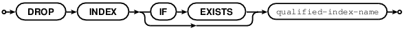
    

    

The index-name must be the name of an existing index, which was created
with CREATE INDEX.

Rules:

It is not legal to drop an index that was created automatically due to a
PRIMARY KEY or UNIQUE clause in the CREATE TABLE statement.

Actions:

1 Tarantool throws an error if the index does not exist, or is an
automatically created index.

2 Tarantool will drop the index.

3 Tarantool effectively executes a COMMIT statement.

Examples:

-- the simplest form

DROP INDEX i ON t;

INSERT Statement
~~~~~~~~~~~~~~~~

INSERT INTO table-name [(column-list)] VALUES (expression-list) [,
(expression-list)];

or

INSERT INTO table-name [(column-list)] select-statement;

or

INSERT INTO table-name DEFAULT VALUES;

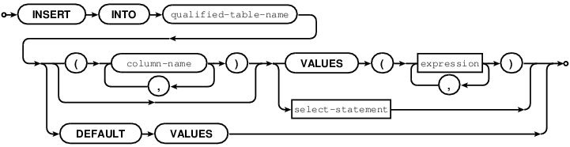
    

    

Insert one or more new rows into a table.

The table-name must be a name of a table defined earlier with CREATE
TABLE. The optional column-list must be a comma-separated list of names
of columns in the table. The expression-list must be a comma-separated
list of expressions; each expression may contain literals and operators
and subqueries and function invocations.

Rules:

The values in the expression-list are evaluated from left to right.

The order of the values in the expression-list must correspond to the
order of the columns in the table, or (if a column-list is specified) to
the order of the columns in the column-list.

The data type of the value should correspond to the data type of the
column, that is, the data type that was specified with CREATE TABLE.

If a column-list is not specified, then the number of expressions must
be the same as the number of columns in the table.

If a column-list is specified, then some columns may be omitted; omitted
columns will get default values.

The parenthesized expression-list may be repeated --
"(expression-list),(expression-list),..." -- for multiple rows.

Actions:

1 Tarantool evaluates each expression in expression-list, and returns an
error if any of the rules is violated. Tarantool creates zero or more
new rows containing values based on the values in the VALUES list or
based on the results of the select-expression or based on the default
values.

2 Tarantool executes constraint checks and trigger actions and the
actual insertion, in the order described by section Order of Execution
in Data-Change Statements.

Examples:

-- the simplest form

INSERT INTO table1 VALUES (1, 'A');

-- with a column list

INSERT INTO table1 (column1, column2) VALUES (2, 'B');

-- with an arithmetic operator in the first expression

INSERT INTO table1 VALUES (2 + 1, 'C');

-- put two rows in the table

INSERT INTO table1 VALUES (4, 'D'), (5, 'E');

See also: REPLACE statement

UPDATE Statement
~~~~~~~~~~~~~~~~

UPDATE table-name

SET column-name = expression [, column-name = expression ...]

[WHERE search-condition];

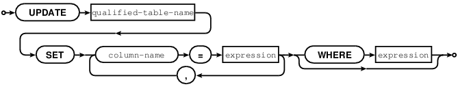
    

    

Update zero or more existing rows in a table.

The table-name must be a name of a table defined earlier with CREATE
TABLE or CREATE VIEW.

The column-name must be an updatable column in the table.

The expression may contain literals and operators and subqueries and
function invocations and column names.

Rules:

The values in the SET clause are evaluated from left to right.

The data type of the value should correspond to the data type of the
column, that is, the data type that was specified with CREATE TABLE.

If a search-condition is not specified, then all rows in the table will
be updated; otherwise only those rows which match the search-condition
will be updated.

Actions:

1 Tarantool evaluates each expression in the SET clause, and returns an
error if any of the rules is violated. For each row that is found by the
WHERE clause, a temporary new row is formed based on the original
contents and the modifications caused by the SET clause.

2 Tarantool executes constraint checks and trigger actions and the
actual update, in the order described by section Order of Execution in
Data-Change Statements.

Examples:

-- the simplest form

UPDATE t SET column1 = 1;

-- with more than one assignment in the SET clause

UPDATE t SET column1 = 1, column2 = 2;

-- with a WHERE clause

UPDATE t SET column1 = 5 WHERE column2 = 6;

Special cases:

It is legal to say SET (list of columns) = (list of values). For
example:

UPDATE t SET (column1, column2, column3) = (1,2,3);

It is not legal to assign to a column more than once. For example:

INSERT INTO t (column1) VALUES (0);

UPDATE t SET column1 = column1 + 1, column1 = column1 + 1;

... The result is an error: "duplicate column name".

It is legal to assign to a primary-key column. This is disallowed with
Tarantool/NoSQL, but it is possible with Tarantool/SQL because an SQL
UPDATE statement is effectively split into two Tarantool/NoSQL requests:
space\_object:delete() followed by space\_object:insert().

Known flaws: (Issue#3566)

There are some optional clauses (UPDATE OR IGNORE, UPDATE OR FAIL,
UPDATE OR REPLACE, etc.) which cause unexpectable results.

DELETE Statement
~~~~~~~~~~~~~~~~

DELETE FROM table-name [WHERE search-condition];

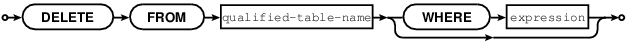
    

    

Delete zero or more existing rows in a table.

The table-name must be a name of a table defined earlier with CREATE
TABLE or CREATE VIEW.

The search-condition may contain literals and operators and subqueries
and function invocations and column names.

Rules:

If a search-condition is not specified, then all rows in the table will
be deleted; otherwise only those rows which match the search-condition
will be deleted.

Actions:

1 Tarantool evaluates each expression in the search-condition, and
returns an error if any of the rules is violated. Tarantool finds the
set of rows that are to be deleted.

2 Tarantool executes constraint checks and trigger actions and the
actual deletion, in the order described by section Order of Execution in
Data-Change Statements.

Examples:

-- the simplest form

DELETE FROM t;

-- with a WHERE clause

DELETE FROM t WHERE column2 = 6;

REPLACE Statement
~~~~~~~~~~~~~~~~~

REPLACE INTO table-name [(column-list)] VALUES (expression-list) [,
(expression-list)];

or

REPLACE INTO table-name [(column-list)] select-statement;

or

REPLACE INTO table-name DEFAULT VALUES;

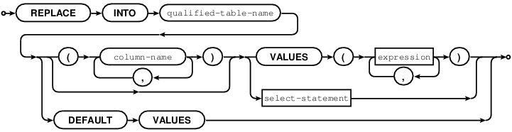
    

    

Insert one or more new rows into a table, or update existing rows.

If a row already exists (as determined by the primary key or any unique
key), then the action is delete + insert, and the rules are the same as
for a DELETE statement followed by an INSERT statement.

Otherwise the action is insert, and the rules are the same as for the
INSERT statement.

Examples:

-- the simplest form

REPLACE INTO table1 VALUES (1, 'A');

-- with a column list

REPLACE INTO table1 (column1, column2) VALUES (2, 'B');

-- with an arithmetic operator in the first expression

REPLACE INTO table1 VALUES (2 + 1, 'C');

-- put two rows in the table

REPLACE INTO table1 VALUES (4, 'D'), (5, 'E');

See also: INSERT Statement, UPDATE Statement, and Order of Execution in
Data-Change Statements.

Order of Execution In Data-Change Statements
~~~~~~~~~~~~~~~~~~~~~~~~~~~~~~~~~~~~~~~~~~~~

This is the general order in which Tarantool performs checks and
triggered actions for data-change (INSERT or UPDATE or DELETE)
statements, Notice that one action can cause another action, as is the
case for triggers (see "CREATE TRIGGER Statement"), or as is the case
for REPLACE (which can cause either INSERT or DELETE plus INSERT).

In this description, the words "constraint ... would be violated" mean
"table would contain a value that would not be allowed (due to the
constraint) if the operation was permitted to continue"..The word
"behavior" refers to one of the possible behaviors described in section
"Constraint Conflict Clauses". If two or more constraints are relevant
at the same time, for example UNIQUE (s2), CHECK (s2 <> 5), Tarantool
may elect to check them in any order. If Tarantool determines that a
step is not necessary, it does not perform it.

Known flaw (documentation only): The description here is not currently
correct.

For each row ...

1. If statement is INSERT\|UPDATE: If a value was not specified or is
   NULL for a column defined with INTEGER PRIMARY KEY AUTOINCREMENT, set
   the value to the next available integer.

2. If statement is INSERT\|UPDATE: for each NOT NULL constraint that
   would be violated:... If behavior is "REPLACE (for a NOT NULL
   constraint for a column that has a non-NULL default value)", then
   replace NULL with the default value.

3. If statement is INSERT\|UPDATE: for each UNIQUE or PRIMARY KEY
   constraint that would be violated ... If behavior is "REPLACE", then
   delete the old row and insert the new row.

4. For each FOREIGN KEY constraint that would be violated ... do
   statement rollback and return an error.

5. If statement is INSERT, then activate the table's BEFORE INSERT
   triggers.If statement is UPDATE, then activate the table's BEFORE
   UPDATE triggers. If statement is DELETE, then activate the table's
   BEFORE DELETE triggers.

6. If statement is INSERT\|UPDATE: for each NOT NULL constraint that
   would be violated ... If behavior is "ABORT" or "REPLACE (for a NOT
   NULL constraint that has a NULL default value)", do statement
   rollback and return an error. If behavior is "IGNORE", then skip this
   and all following steps (i.e. skip this row). If behavior is "FAIL",
   then return an error. If behavior is "ROLLBACK", then do transaction
   rollback and return an error.

7. If statement is INSERT\|UPDATE: for each CHECK or UNIQUE or PRIMARY
   KEY constraint that would be violated ... If behavior is "IGNORE",
   then skip this row. If behavior is "FAIL", return an error. If
   behavior is "ROLLBACK", then do transaction rollback and return an
   error. If behavior is "ABORT" or "REPLACE": do statement rollback and
   return an error. This means that UNIQUE or PRIMARY KEY constraints
   are checked twice, in step 2 and in this step. This is necessary
   because execution of an earlier step might cause a new conflict.

8. If statement is INSERT, then activate the table's AFTER INSERT
   triggers.If statement is UPDATE, then activate the table's AFTER
   UPDATE triggers. If statement is DELETE, then activate the table's
   AFTER DELETE triggers.

If all rows were processed without an error that caused statement
rollback or transaction rollback, the data-change can be committed.
Ordinarily, unless processing is within a transaction that began with
START TRANSACTION, there will be an automatic COMMIT.

Finish the data-change by calling the low-level Tarantool routines. Thus
new rows (new "tuples" in Tarantool's NoSQL terminology) are added to
the table (the "space" in Tarantool's NoSQL terminology), or row sare
removed from the table, and indexes are updated.

TRUNCATE Statement
~~~~~~~~~~~~~~~~~~

TRUNCATE TABLE table-name;

Remove all rows in the table.

TRUNCATE is considered to be a schema-change rather than a data-change
statement, so it does not work within transactions (it cannot be rolled
back).

Rules:

It is illegal to truncate a table which is referenced by a foreign key.

It is illegal to truncate a table which is also a system space, such as
"\_space".

The table must be a base table rather than a view.

Actions:

All rows in the table are removed. Usually this is faster than DELETE
FROM table-name;.

If the table has an autoincrement primary key, its sequence is reset to
zero.

There is no effect for any triggers associated with the table.

There is no effect on the counts for the row\_count() function.

Only one action is written to the write-ahead log (with "DELETE FROM
table-name;" there would be one action for each deleted row).

Example:

TRUNCATE TABLE t;

SELECT Statement
~~~~~~~~~~~~~~~~

SELECT [ALL\|DISTINCT]

select-list

`from clause <#from-clause>`__

`where clause <#where-clause>`__

[group-by clause `having clause <#having-clause>`__]

[order-by clause];

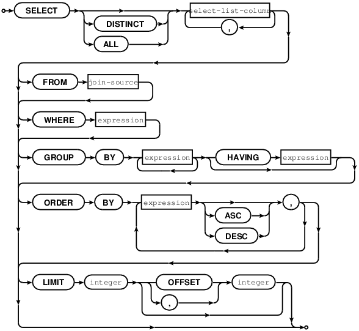
    

    

Select zero or more rows.

The clauses of the SELECT statement are discussed in the following five
sections.

Select-list
~~~~~~~~~~~

select-list-column [, select-list-column ...]

select-list-column:

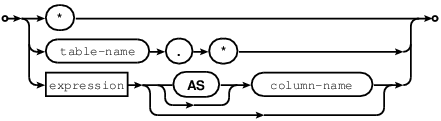
    

    

Define what will be in a result set; this is a clause in a SELECT
statement.

The select-list is a comma-delimited list of expressions, with the
addition of the \* "asterisk" shorthand and the [AS [column-name]]
clause.

The \* "asterisk" shorthand is valid if and only if the SELECT statement
also contains a FROM clause which specifies the table or tables (details
about the FROM clause are in the next section). The simple form is

-  

which means "all columns" -- for example, if the select is done for a
table which contains three columns s1 s2 s3, then "SELECT \* ..." is
equivalent to

"SELECT s1, s2, s3 ...".

The qualified form is table-name.\* or correlation-name.\* which means
"all columns in the specified table or correlation", which again must be
a result of the FROM clause -- for example, if the table is named
table1, then "table1.\*" is equivalent to a list of the columns of
table1.

The [AS [column-name]] clause determines the column name.

The column name is useful for two reasons:

-  in a tabular display, the column names are the headings

-  if the results of the SELECT are used in

CREATE TABLE new-table-name ... AS SELECT select-list ..., then

the column names in the new table will be the column names in the
select-list.

If [AS [column-name]] is missing, Tarantool makes a name equal to the
expression, for example "SELECT 5\ *88" will cause the column name to be
"5*\ 88", but such names may be ambiguous or illegal in other contexts,
so it is better to say, for example, "SELECT 5 \* 88 AS column1".

Examples:

-- the simple form

SELECT 5;

-- with multiple expressions including operators

SELECT 1, 2 \* 2, 'Three' \|\| 'Four';

-- with [[AS] column-name] clause

SELECT 5 AS column1;

-- \* which must be eventually followed by a FROM clause

SELECT \* FROM table1;

-- as a list

SELECT 1 AS a, 2 AS b, table1.\* FROM table1;

FROM Clause
~~~~~~~~~~~

FROM table-reference [, table-reference ...]

table-reference:

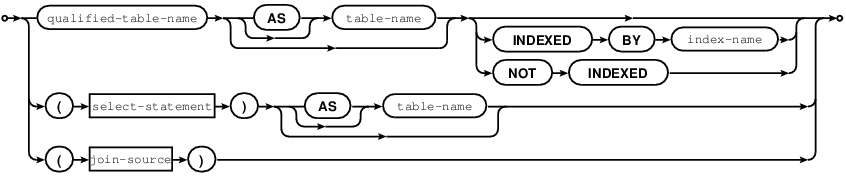
    

    

Specify the table or tables for the source of a SELECT statement.

The table-reference must be a name of an existing table, or a subquery,
or a joined table.

A joined table looks like

table-reference-or-joined-table join-operator
table-reference-or-joined-table [join-specification]

A join-operator must be any of:

[NATURAL] LEFT [OUTER] JOIN, [NATURAL] INNER JOIN, or CROSS JOIN.

A join-specification must be any of:

ON expression, or USING (column-name [, column-name ...]).

Parentheses are allowed, and [[AS] correlation-name] is allowed.

The maximum number of joins in a FROM clause is 64.

Examples:

-- the simplest form

SELECT \* FROM t;

-- with two tables, making a Cartesian join

SELECT \* FROM t1, t2;

-- with one table joined to itself, requiring correlation names

SELECT a.\ *, b.* FROM t1 AS a, t1 AS b;

-- with a left outer join

SELECT \* FROM t1 LEFT JOIN t2;

Known flaws: (Issue#2361) (Issue#2362) (Issue#2363)

-  It's good that the first row in the result set is not a header any
   more,

but we do still need to see what the column names are. This will be
fixed in version 1.8.2 (issue#2620).

...

WHERE Clause
~~~~~~~~~~~~

WHERE condition;

.. image:: image_20.png
    

    

Specify the condition for filtering rows from a table; this is a clause
in a SELECT or UPDATE or DELETE statement.

The condition may contain any expression that returns a boolean
(true\|false\|unknown) value, or returns a value that can be interpreted
as boolean (for example 1 or 0).

For each row in the table: if the condition is true, then the row is
kept, if the condition is false or unknown, then the row is ignored. In
effect, WHERE condition takes a table with n rows and returns a table
with n or fewer rows.

Examples:

-- with a simple condition

SELECT 1 FROM t WHERE column1 = 5;

-- with a condition that contains AND and OR and parentheses

SELECT 1 FROM t WHERE column1 = 5 AND (x > 1 OR y < 1);

GROUP BY Clause
~~~~~~~~~~~~~~~

GROUP BY expression [, expression ...]

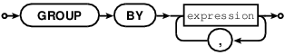
    

    

Make a grouped table; this is a clause in a SELECT statement.

The expressions should be column names in the table, and each column
should be specified only once.

In effect, GROUP BY clause takes a table with rows that may have
matching values, combines rows that have matching values into single
rows, and returns a table which, because it is the result of GROUP BY,
is called a grouped table.

Thus, if the input is a table

+---+-----+-----+
| a |  b  |  c  |
+---+-----+-----+
| 1 | 'a' | 'b' |
+---+-----+-----+
| 1 | 'b' | 'b' |
+---+-----+-----+
| 2 | 'a' | 'b' |
+---+-----+-----+
| 3 | 'a' | 'b' |
+---+-----+-----+
| 1 | 'b' | 'b' |
+---+-----+-----+

then GROUP BY a, b will produce a grouped table

+---+-----+-----+
| a |  b  |  c  |
+---+-----+-----+
| 1 | 'a' | 'b' |
+---+-----+-----+
| 1 | 'b' | 'b' |
+---+-----+-----+
| 2 | 'a' | 'b' |
+---+-----+-----+
| 3 | 'a' | 'b' |
+---+-----+-----+

The rows where column a and column b have the same value have been
merged; column c has been preserved but its value should not be depended
on -- if the rows were not all 'b', Tarantool could pick any value.

It is useful to envisage a grouped table as having hidden extra columns
for the aggregation of the values, for example:

+---+---+---+-------------+--------+--------+
| a | b | c |    COUNT(a) | SUM(a) | MIN(c) |
+---+---+---+-------------+--------+--------+
|1  |'a'|'b'|      2      |  2     |   'b'  |
+---+---+---+-------------+--------+--------+
|1  |'b'|'b'|      1      |  1     |   'b'  |
+---+---+---+-------------+--------+--------+
|2  |'a'|'b'|      1      |  2     | 'b'    |
+---+---+---+-------------+--------+--------+
|3  |'a'|'b'|      1      |  3     | 'b'    |
+---+---+---+-------------+--------+--------+

These extra columns are what aggregate functions are for.

Examples:

-- with a single column

SELECT 1 FROM t GROUP BY column1;

-- with two columns

SELECT 1 FROM t GROUP BY column1, column2;

Known flaws: (Issue#2364)

-  SELECT s1,s2 FROM t GROUP BY s1; is legal

-  SELECT s1 AS q FROM t GROUP BY q; is legal

-  SELECT s1 FROM t GROUP by 1; is legal

Aggregate Functions
~~~~~~~~~~~~~~~~~~~

function-name (one or more expressions)

Apply a built-in aggregate function to one or more expressions and
return a scalar value.

Aggregate functions are only legal in certain clauses

of SELECT for grouped tables. A table is a grouped

table if a GROUP BY clause is done. Also, if

an aggregate function is used in a select-list and

GROUP BY clause is omitted, then Tarantool assumes

SELECT ... GROUP BY [all columns];

NULLs are ignored for all aggregate functions except COUNT(\*).

AVG([DISTINCT] expression)

::

        -- return the average value of expression

            Example: AVG(column1)

COUNT([DISTINCT] expression)

::

        -- return the number of occurrences of expression

            Example: COUNT(column1)

COUNT(\*)

::

        -- return the number of occurrences of a row

            Example: COUNT(*)

GROUP\_CONCAT(expression-1 [, expression-2])

::

        -- return a list of expression-1 values, separated

            by commas if expression-2 is omitted, separated

            by the expression-2 value if expression-2 is

            not omitted

            Example: GROUP_CONCAT(column1)

MAX([DISTINCT] expression)

::

        -- return the maximum value of expression

            Example: MAX(column1)

MIN([DISTINCT] expression)

::

        -- return the minimum value of expression

            Example: MIN(column1)

SUM([DISTINCT] expression)

::

        -- return the sum of values of expression

            Example: SUM(column1)

TOTAL([DISTINCT] expression)

::

        -- return the sum of values of expression

            Example: TOTAL(column1)

See also: Functions

HAVING Clause
~~~~~~~~~~~~~

HAVING condition;

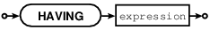
    

    

Specify the condition for filtering rows from a grouped table; this is a
clause in a SELECT statement.

The clause preceding the HAVING clause must be a GROUP BY clause. HAVING
operates on the table that the GROUP BY produces, which may contain
grouped columns and aggregates.

For each row in the table: if the condition is true, then the row is
kept, if the condition is false or unknown, then the row is ignored. In
effect, HAVING condition takes a table with n rows and returns a table
with n or fewer rows.

Examples:

-- with a simple condition

SELECT 1 FROM t GROUP BY column1 HAVING column2 > 5;

-- with a more complicated condition

SELECT 1 FROM t GROUP BY column1 HAVING column2 > 5 OR column2 < 5;

-- with an aggregate

SELECT x, SUM(y) FROM t GROUP BY x HAVING SUM(y) > 0;

Known flaws: (Issue#2364) (closed as "won't fix")

-  HAVING is not legal without GROUP BY

ORDER BY Clause
~~~~~~~~~~~~~~~

ORDER BY expression [ASC\|DESC] [, expression [ASC\|DESC] ...]

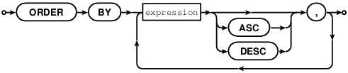
    

    

Put rows in order; this is a clause in a SELECT statement.

An ORDER BY expression has one of three types which are checked in
order:

1 expression is a positive integer, representing the ordinal position of
the column in the select list. For example, in the statement

SELECT x, y, z FROM t ORDER BY 2;

ORDER BY 2 means "order by the second column in the select list", which
is y.

or

2 expression is a name of a column in the select list, which is
determined by an AS clause.

For example, in the statement

SELECT x, y AS x, z FROM t ORDER BY x;

ORDER BY x means "order by the column explicitly named x in the select
list", which is the second column.

or

3 expression contains a name of a column in a table of the FROM clause.

For example, in the statement

SELECT x, y FROM t1 JOIN t2 ORDER BY z;

ORDER BY z means "order by a column named z which is expected to be in
table t1 or table t2". If both tables contain a column named z, then
Tarantool will choose the first column that it finds.

The expression may also contain operators and function names and
literals.

For example, in the statement

SELECT x, y FROM t ORDER BY UPPER(z);

ORDER BY UPPER(z) means "order by the uppercase form of column t.z",

which may be similar to doing ordering in a case-insensitive manner.

Type 3 is illegal if the SELECT statement contains UNION or EXCEPT or
INTERSECT.

If an ORDER BY clause contains multiple expressions, then expressions on
the left are processed first and expressions on the right are processed
only if necessary for tie-breaking.

For example, in the statement

SELECT x, y FROM t ORDER BY x, y;

if there are two rows which both have the same values for column x, then
an additional check is made to see which row has a greater value for
column y.

In effect, ORDER BY clause takes a table with rows that may be out of
order, and returns a table with rows in order.

The default order is ASC (ascending), the optional order is DESC
(descending).

NULLs come first, then numbers, then text strings, then blob strings.
Within text strings, ordering is according to collation. Collation may
be specified within the ORDER BY column-list, or may be default.

Examples:

-- with a single column

SELECT 1 FROM t ORDER BY column1;

-- with two columns

SELECT 1 FROM t ORDER BY column1, column2;

-- With a variety of data

CREATE TABLE h (s1 INT PRIMARY KEY, s2 INT);

INSERT INTO h VALUES (7,'A'),(4,'A '),(-4,'AZ'),(17,17),(23,NULL);

INSERT INTO h VALUES (17.5,'Д'),(1e+300,'a'),(0,''),(-1,'');

SELECT \* FROM h ORDER BY s2, s1;

The result of the above SELECT will be:

*  [23, null]

*  [17, 17]

*  [-1, '']

*  [0, '']

*  [7, 'A']

*  [4, 'A ']

*  [-4, 'AZ']

*  [1e+300, 'a']

*  [17.5, 'Д']

...

Known flaws: (Issue#2365)

-  ORDER BY 1 is legal. This is common but is not standard SQL nowadays.

LIMIT Clause
~~~~~~~~~~~~

LIMIT limit-expression [OFFSET offset-expression]

or

LIMIT offset-expression, limit-expression

Warning: the above is not a typo. offset-expression and limit-expression
are in reverse order if a comma is used.

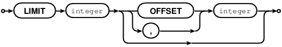
    

    

Specify a maximum number of rows and a start row; this is a clause in a
SELECT statement.

Expressions may contain integers and arithmetic operators or functions,
for example ABS(-3/1). However, in practice, expressions are almost
always positive integers.

If the result of an expression is null or negative or not a positive
integer, it is ignored.

Usually the LIMIT clause follows an ORDER BY clause, because otherwise
Tarantool does not guarantee that rows are in order.

Examples:

-- simple case

SELECT \* FROM t LIMIT 3;

-- both limit and order

SELECT \* FROM t LIMIT 3 OFFSET 1;

-- applied to a UNIONed result (LIMIT clause must be the final clause)

SELECT column1 FROM table1 UNION SELECT column1 FROM table2 ORDER BY 1
LIMIT 1;

Known flaws: (Issue#2365) (closed)

-  LIMIT without ORDER BY is legal

VALUES Statement
~~~~~~~~~~~~~~~~

VALUES (expression [, expression ...]) [, (expression [, expression
...])

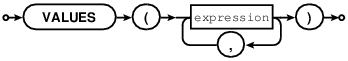
    

    

Select one or more rows.

VALUES has the same effect as SELECT, that is, it returns a result set,
but VALUES statements may not have FROM or GROUP or ORDER BY or LIMIT
clauses.

VALUES may be used wherever SELECT may be used, for example in
subqueries.

Examples:

-- simple case

VALUES (1);

-- equivalent to SELECT 1, 2, 3

VALUES (1, 2, 3);

-- two rows

VALUES (1, 2, 3), (4, 5, 6);

Subquery
~~~~~~~~

SELECT-statement syntax

or

VALUES-statement syntax

A subquery is a SELECT statement or VALUES statement embedded inside
another statement.

(The SELECT and VALUES statements are called "queries" because they
return answers, in the form of result sets.)

Subqueries are not statements, so they do not end with semicolons.

Subqueries may be the second part of INSERT statements.

Example:

INSERT INTO t2 SELECT a,b,c FROM t1;

Subqueries may be in the FROM clause of SELECT statements.

Subqueries may be expressions, or be inside expressions. In this case
they must be parenthesized, and usually the number of rows must be 1.

Example:

SELECT 1, (SELECT 5), 3 FROM t WHERE c1 \* (SELECT COUNT(\*) FROM t2) >
5;

Subqueries may be expressions on the right side of certain comparison
operators, and in this unusual case the number of rows may be greater
than 1. The comparison operators are: [NOT] EXISTS and [NOT] IN.

Example:

DELETE FROM t WHERE s1 NOT IN (SELECT s2 FROM t);

Subqueries may refer to values in the outer query. In this case, the
subquery is called a "correlated subquery".

Subqueries may refer to rows which are being updated or deleted by the
main query. In that case, he subquery finds the matching rows first,
before starting to update or delete. For example, after

CREATE TABLE t (s1 INT PRIMARY KEY, s2 INT);

INSERT INTO t VALUES (1,3),(2,1);

DELETE FROM t WHERE s2 NOT IN (SELECT s1 FROM t);

only one of the rows is deleted, not both rows.

WITH clause (Common Table Expression)
~~~~~~~~~~~~~~~~~~~~~~~~~~~~~~~~~~~~~

WITH temporary-table-name AS (subquery.)

[, temporary-table-name AS (subquery)

SELECT statement \| INSERT statement \| DELETE statement \| UPDATE
statement\|REPLACE statement;

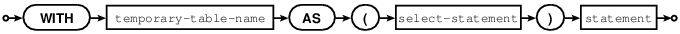
    

    

WITH v AS (SELECT \* FROM t) SELECT \* FROM v;

is equivalent to creating a view and selecting from it:

CREATE VIEW v AS SELECT \* FROM t;

SELECT \* FROM v;

The difference is that a WITH-clause "view" is temporary and only

useful within the same statement. No CREATE privilege is required.

The WITH-clause can also be thought of as a subquery that has a name.

This is useful when the same subquery is being repeated. For example:

SELECT \* FROM t WHERE a < (SELECT s1 FROM x) AND b < (SELECT s1 FROM
x);

can be replaced with

WITH S AS (SELECT s1 FROM x) SELECT \* FROM t WHERE a < S AND b < S;

This "factoring out" of a repeated expression is regarded as good
practice.

Examples:

WITH cte AS (VALUES (7,'') INSERT INTO j SELECT \* FROM cte;

WITH cte AS (SELECT s1 AS x FROM k) SELECT \* FROM cte;

WITH cte AS (SELECT COUNT(\*) FROM k WHERE s2 < 'x' GROUP BY s3)

UPDATE j SET s2 = 5

WHERE s1 = (SELECT s1 FROM cte) OR s3 = (SELECT s1 FROM cte);

WITH can only be used at the beginning of a statement, therefore it
cannot be used at the beginning of a subquery or after a set operator or
inside a CREATE statement.

A WITH-clause "view" is read-only because Tarantool does not support
updatable views.

WITH RECURSIVE clause (Iterative Common Table Expression)
~~~~~~~~~~~~~~~~~~~~~~~~~~~~~~~~~~~~~~~~~~~~~~~~~~~~~~~~~

The real power of WITH lies in the WITH RECURSIVE clause, which is
useful when it is combined with UNION or UNION ALL:

WITH RECURSIVE recursive-table-name AS

(SELECT ...FROM non-recursive-table-name ...

UNION ALL

SELECT ... FROM recursive-table-name ...)

SELECT ... FROM recursive-table-name;

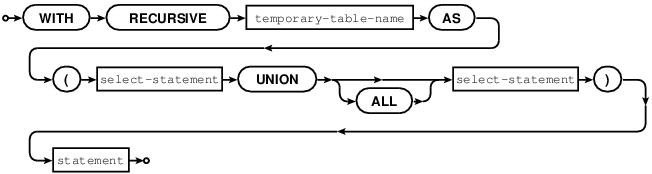
    

    

In non-SQL this can be read as: starting with a seed value from a
non-recursive table, produce a recursive viewed table, UNION that with
itself, UNION that with itself, UNION that with itself ... forever, or
until a condition in the WHERE clause says "stop".

For example:

CREATE TABLE ts (s1 INT PRIMARY KEY);

INSERT INTO ts VALUES (1);

WITH RECURSIVE w AS (

SELECT s1 FROM ts

UNION ALL

SELECT s1+1 FROM w WHERE s1 < 4)

SELECT \* FROM w;

First, table w is seeded from t1, so it has one row: [1]. Then, UNION
ALL (SELECT s1+1 FROM w) takes the row from w -- which contains [1] --
adds 1 because the select list says "s1+1", and so it has one row: [2].

Then, UNION ALL (SELECT s1+1 FROM w) takes the row from w -- which
contains [2] -- adds 1 because the select list says "s1+1", and so it
has one row: [3].

Then, UNION ALL (SELECT s1+1 FROM w) takes the row from w -- which
contains [3] -- adds 1 because the select list says "s1+1", and so it
has one row: [4].

Then, UNION ALL (SELECT s1+1 FROM w) takes the row from w -- which
contains [4] -- and now the importance of the WHERE clause becomes
evident, because "s1 < 4" is false for this row, and therefore we have
reached the "stop" condition.

So, before the "stop", table w got 4 rows: [1], [2], [3], [4].

So the result of the statement looks like:

"

tarantool> WITH RECURSIVE w AS (

        >   SELECT s1 FROM ts

        >   UNION ALL

        >   SELECT s1+1 FROM w WHERE s1 < 4)

        > SELECT * FROM w;

*  [1]

*  [2]

*  [3]

*  [4]

...

"

In other words, this WITH RECURSIVE ... SELECT produces a table of

auto-incrementing values.

INDEXED BY clause
~~~~~~~~~~~~~~~~~

INDEXED BY index-name

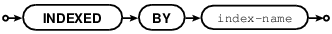
    

    

The INDEXED BY clause may be used in a SELECT, DELETE, or UPDATE
statement, immediately after the table-name. For example:

DELETE FROM table7 INDEXED BY index7 WHERE column1 = 'a';

In this case the search for 'a' will take place within index7.

For example:

SELECT \* FROM table7 NOT INDEXED WHERE column1 = 'a';

In this case the search for 'a' will be done via a search of the whole
table, what is sometimes called a "full table scan", even if there is an
index for column1.

Ordinarily Tarantool chooses the appropriate index or lookup method
depending on a complex set of "optimizer" rules; the INDEXED BY clause
overrides the optimizer choice.

Example

Suppose a table has two columns.The first column is the primary key and
therefore it has an automatic index named pk\_unnamed\_T\_1. The second
column has an index created by the user. The user selects with INDEXED
BY the-index-on-column1, then selects with INDEXED BY
the-index-on-column-2.

CREATE TABLE t (column1 INT PRIMARY KEY, column2 INT);

CREATE INDEX i ON t (column2);

INSERT INTO t VALUES (1,2),(2,1);

SELECT \* FROM t INDEXED BY "pk\_unnamed\_T\_1";

SELECT \* FROM t INDEXED BY i;

Result for the first select: (1,2),(2,1)

Result for the second select: (2,1),(1,2).

UNION, EXCEPT, and INTERSECT clauses
~~~~~~~~~~~~~~~~~~~~~~~~~~~~~~~~~~~~

select-statement UNION [ALL] select-statement `ORDER BY
clause <#limit-clause>`__;

select-statement EXCEPT select-statement `ORDER BY
clause <#limit-clause>`__;

select-statement INTERSECT select-statement `ORDER BY
clause <#limit-clause>`__;

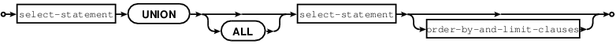

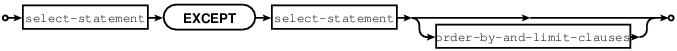

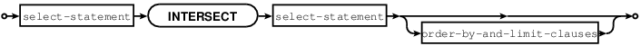

UNION, EXCEPT, and INTERSECT are collectively called "set operators" or
"table operators".

a UNION b means "take rows which occur in a OR b".

a EXCEPT b means "take rows which occur in a AND NOT b".

a INTERSECT b means "take rows which occur in a AND b".

Duplicate rows are eliminated unless ALL is specified.

The select-statements may be chained: SELECT ... SELECT ... SELECT ...;

Each select-statement must result in the same number of columns.

The select-statements may be replaced with VALUES statements.

The maximum number of set operations is 50.

Example:

CREATE TABLE t1 (s1 INT PRIMARY KEY, s2 VARCHAR(1));

CREATE TABLE t2 (s1 INT PRIMARY KEY, s2 VARCHAR(1));

INSERT INTO t1 VALUES (1,'A'),(2,'B'),(3,NULL);

INSERT INTO t2 VALUES (1,'A'),(2,'C'),(3,NULL);

SELECT s2 FROM t1 UNION SELECT s2 FROM t2;

SELECT s2 FROM t1 UNION ALL SELECT s2 FROM t2 ORDER BY s2;

SELECT s2 FROM t1 EXCEPT SELECT s2 FROM t2;

SELECT s2 FROM t1 INTERSECT SELECT s2 FROM t2;

The UNION query returns 4 rows: NULL, 'A', 'B', 'C'.

The UNION ALL query returns 6 rows: NULL, NULL, 'A', 'A', 'B', 'C'.

The EXCEPT query returns 1 row: 'B'.

The INTERSECT query returns 2 rows: NULL, 'A'.

Known flaws:

-  Parentheses are not allowed.

-  ORDER BY expression is usually not allowed.

-  Evaluation is left to right, INTERSECT does not have precedence.
   Example:

CREATE TABLE t01 (s1 INT PRIMARY KEY, s2 VARCHAR(1));

CREATE TABLE t02 (s1 INT PRIMARY KEY, s2 VARCHAR(1));

CREATE TABLE t03 (s1 INT PRIMARY KEY, s2 VARCHAR(1));

INSERT INTO t01 VALUES (1,'A');

INSERT INTO t02 VALUES (1,'B');

INSERT INTO t03 VALUES (1,'A');

SELECT s2 FROM t01 INTERSECT SELECT s2 FROM t03 UNION SELECT s2 FROM
t02;

SELECT s2 FROM t03 UNION SELECT s2 FROM t02 INTERSECT SELECT s2 FROM
t03;

... results are different.

START TRANSACTION Statement
~~~~~~~~~~~~~~~~~~~~~~~~~~~

START TRANSACTION;

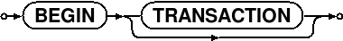

Start a transaction. After START TRANSACTION; a transaction is "active".
If a transaction is already active, then START TRANSACTION; is illegal.

Transactions should be active for fairly short periods of time, to avoid
concurrency issues. To end a transaction, say COMMIT or ROLLBACK.

All statements between START TRANSACTION; and COMMIT; or ROLLBACK;
inclusive, must be sent as a single batch. In order to ensure this, you
should:

-  Decide in advance what all the transaction's SQL statements will be,
   from the starting START TRANSACTION statement to the ending COMMIT or
   ROLLBACK statement.

-  Enclose each separate SQL statement in a box.sql.execute() function.

-  Pass all the box.sql.execute() functions to the server in a single
   message. If you are using a console, you can do this by writing
   everything on a single line. If you are using net.box, you can do
   this by putting all the function calls in a single string and calling
   eval(string).

Example:

START TRANSACTION;

Example of a whole transaction sent to a server on localhost:3301 with
eval(string):

net\_box = require('net.box') conn = net\_box.new('localhost', 3301) s =
'box.sql.execute([[START TRANSACTION; ]]) ' s = s ..
'box.sql.execute([[INSERT INTO t VALUES (1); ]]) ' s = s ..
'box.sql.execute([[ROLLBACK; ]]) ' conn:eval(s)

COMMIT Statement
~~~~~~~~~~~~~~~~

COMMIT;

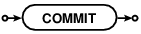
    

    

Commit an active transaction, so all changes are made permanent.

Example:

COMMIT;

Known flaws:

-  Auto-commit is on, so COMMIT has no effect unless START TRANSACTION
   has been done.

SAVEPOINT Statement
~~~~~~~~~~~~~~~~~~~

SAVEPOINT savepoint-name;

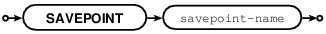
    

    

Set a savepoint, so that ROLLBACK TO savepoint-name is possible.

Example:

SAVEPOINT x;

Known flaws (issue#2656)

-  Savepoints do not work.

RELEASE SAVEPOINT Statement
~~~~~~~~~~~~~~~~~~~~~~~~~~~

RELEASE SAVEPOINT savepoint-name;

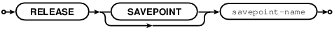
    

    

Release (destroy) a savepoint created by SAVEPOINT statement.

Example:

RELEASE SAVEPOINT x;

Known flaws (issue#2656):

-  Savepoints do not work.

ROLLBACK Statement
~~~~~~~~~~~~~~~~~~

ROLLBACK [TO [SAVEPOINT] savepoint-name];

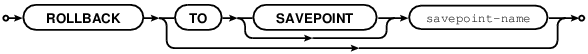
    

    

Rollback an active transaction, so all changes are cancelled.

Example:

-- the simple form

ROLLBACK;

-- the form so changes before a savepoint are not cancelled.

ROLLBACK TO SAVEPOINT x;

Known flaws:

-  ROLLBACK TO SAVEPOINT does not work (issue#2656).

EXPLAIN Statement
~~~~~~~~~~~~~~~~~

EXPLAIN explainable-statement

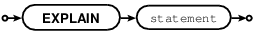
    

    

EXPLAIN will show what steps Tarantool would take if it executed
explainable-statement.

This is primarily a debugging and optimization aid for the Tarantool
team.

Example:

EXPLAIN DELETE FROM m; returns:

 

*  [0, 'Init', 0, 3, 0, '', '00', 'Start at 3']

*  [1, 'Clear', 16416, 0, 0, '', '00', '']	

*  [2, 'Halt', 0, 0, 0, '', '00', '']

*  [3, 'Transaction', 0, 1, 1, '0', '01', 'usesStmtJournal=0']

*  [4, 'Goto', 0, 1, 0, '', '00', '']

Variation: EXPLAIN QUERY PLAN statement;

ANALYZE Statement
~~~~~~~~~~~~~~~~~

ANALYZE [table\_name]

.. image :: image_38.png

ANALYZE will collect statistics about a table and put the results in
system tables named \_sql\_stat1 and \_sql\_stat4.

Example:

ANALYZE t;

SELECT \* FROM "\_sql\_stat1", "\_sql\_stat4";

+-----+-----+------+-----+-----+-----+-----+------+
| tbl | idx | stat | tbl | idx | neq | nlt | ndlt |
+=====+=====+======+=====+=====+=====+=====+======+
| T   | T   | 2 1  | T   | T   | 1   | 0   | 0    |
+-----+-----+------+-----+-----+-----+-----+------+
| T   | T   | 2 1  | T   | T   | 1   | 1   | 1    |
+-----+-----+------+-----+-----+-----+-----+------+

PRAGMA Statement
~~~~~~~~~~~~~~~~

PRAGMA pragma-name = pragma-value [, = pragma value ...];

or

PRAGMA pragma-name (pragma-value [, pragma-value ...);

or (rarely)

PRAGMA pragma-name;

or (once)

PRAGMA;

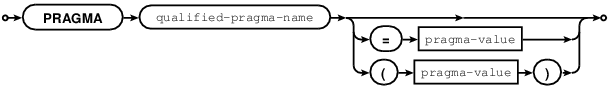
    

    

Some PRAGMA statements will change DBMS behavior. Others will give
rudimentary information about table 'metadata', although it is better to
get such information via System Tables.

We recommend: always use pragma-name(pragma-value) rather than
pragma-name=pragma-value.

Often pragma values are boolean, and can be specified with any of: true
\| on \| 1 \| yes \| 'true' \| 'on' \| 'yes' ... false \| off \| 0 \| no
\| 'false' \| 'off' \| 'no'. We recommend always use true or false.

Less commonly pragma values are strings and can be specified with any
of: inside "" double quotes, inside '' single quotes, or without quotes.
We recommend: always use single quotes.

When a string is used for searching, results must match according to a
binary collation.

PRAGMA; -- returns a list of pragmas and their current values.

PRAGMA busy\_timeout (number); /\* rather than this, prefer
Tarantool/NoSQL timeouts \*/

PRAGMA case\_sensitive\_like (boolean); /\* default = false \*/

PRAGMA collation\_list; -- returns a list of supported collations.

The result is 'unicode' and 'unicode\_ci' unless users have added their
own collations.

PRAGMA count\_changes (boolean); /\* default = false \*/

PRAGMA defer\_foreign\_keys (boolean); /\* default = false

PRAGMA foreign\_key\_list;

PRAGMA full\_column\_names (boolean); /\* default = false \*/

PRAGMA index\_info ('table-name.index-name'); -- a list of the columns
in an index

PRAGMA index\_list (table-name); -- a list of the table's indexes

PRAGMA index\_xinfo (index-name);

PRAGMA parser\_trace;

PRAGMA query\_only (boolean); /\* default = false \*/ -- do not use
this, use box.cfg{read\_only} instead

PRAGMA read\_uncommitted (boolean); /\* default = false \*/

PRAGMA recursive\_triggers (boolean); /\* whether a triggered statement
can activate a trigger \*/

PRAGMA reverse\_unordered\_selects (boolean);

PRAGMA select\_trace (boolean); /\* default = false \*/

PRAGMA short\_column\_names (boolean); /\* default = true \*/

PRAGMA sql\_default\_engine (engine-name); -- after this CREATE TABLE
will create using the specified engine-name. The choices are 'memtx' and
'vinyl'. The default default is 'memtx'.

PRAGMA sql\_trace (boolean); /\* default = false \*/

PRAGMA stats; /\* statistics for users with performance concerns \*/

PRAGMA table\_info(table-name) -- a list of the column descriptors

PRAGMA vdbe\_addoptrace (boolean); /\* default = false \*/ -- for use by
Tarantool's developers

PRAGMA vdbe\_debug (boolean); /\* default = false \*/ -- for use by
Tarantool's developers

PRAGMA vdbe\_eqp (boolean); /\* default = false \*/ -- for use by
Tarantool's developers

PRAGMA vdbe\_listing (boolean); /\* default = false \*/ -- for use by
Tarantool's developers

PRAGMA vdbe\_trace (boolean); /\* default = false \*/ -- for use by
Tarantool's developers

PRAGMA where\_trace(boolean); /\* default = false \*/ -- for use by
Tarantool's developers

Example:

tarantool> box.sql.execute([[PRAGMA table\_info('T')]])

*  [0, 's1', 'INT', 1, null, 1]

*  [1, 's2', 'INT', 0, null, 0]

...

Known flaws: PRAGMA can change behavior for all sessions, not just the
session where it is executed.

