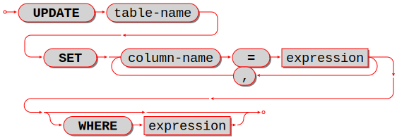
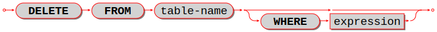
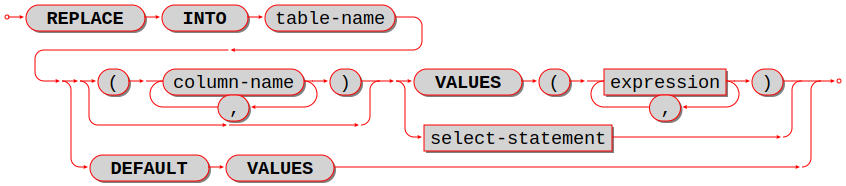

--------------------------------------------------------------------------------
SQL statements and clauses
--------------------------------------------------------------------------------

.. _sql_alter_table:

~~~~~~~~~~~~~~~~~~~~~~~~~~~~~~~~~~~~~~~~~~~~~~~~~~~~~~~~~~~~~~~~~~~~~~~~~~~~~~~~
ALTER TABLE
~~~~~~~~~~~~~~~~~~~~~~~~~~~~~~~~~~~~~~~~~~~~~~~~~~~~~~~~~~~~~~~~~~~~~~~~~~~~~~~~

Syntax:

* :samp:`ALTER TABLE {table-name} RENAME TO {new-table-name};`
* :samp:`ALTER TABLE {table-name} ADD CONSTRAINT {constraint-name} {constraint-definition};`
* :samp:`ALTER TABLE {table-name} DROP CONSTRAINT {constraint-name};`

|br|

.. image:: alter_table.svg
    :align: left

|br|

ALTER is used to either change a table's name or to add new constraints.

Examples:

.. code-block:: sql

   -- renaming a table:
   ALTER TABLE t1 RENAME TO t2;

For ``ALTER ... RENAME``, the *old-table* must exist, the *new-table* must not
exist.

.. code-block:: sql

   -- adding a foreign-key constraint definition:
   ALTER TABLE t1 ADD CONSTRAINT c FOREIGN KEY (s1) REFERENCES t1;

For ``ALTER ... ADD CONSTRAINT``, the table must exist, the constraint type must
be foreign-key or PRIMARY or UNIQUE (not CHECK), the constraint name must not
already exist for the table.

It is not possible to say ``CREATE TABLE table_a ... REFERENCES table_b ...``
if table ``b`` does not exist yet. This is a situation where ``ALTER TABLE`` is
handy -- users can ``CREATE TABLE table_a`` without the foreign key, then
``CREATE TABLE table_b``, then ``ALTER TABLE table_a ... REFERENCES table_b ...``.
This is only legal if the table is empty.

.. code-block:: sql

   -- adding a primary-key constraint definition:
   ALTER TABLE t1 ADD CONSTRAINT primary_key PRIMARY KEY (s1);

.. // See "Constraint Definition for foreign keys" foreign-constraint-definition.

.. code-block:: sql

   -- adding a unique-constraint definition:
   ALTER TABLE t1 ADD CONSTRAINT unique_key UNIQUE (s1);

This is unusual because primary keys are created automatically and it is illegal
to have two primary keys for the same table. However, it is possible to drop
a primary-key index, and this is a way to restore the primary key if that happens.
Alternatively, you can say ``CREATE UNIQUE INDEX unique_key ON t1 (s1);``.

.. _sql_alter_table_drop_constraint:

.. code-block:: sql

   -- dropping a constraint:
   ALTER TABLE t1 DROP CONSTRAINT c;

It is only legal to drop a named constraint, and only foreign-key constraints
can have names. (Tarantool generates the constraint names automatically if the
user does not provide them.)

To remove a unique constraint, use DROP INDEX, which will drop the constraint
as well.

Limitations:

* It is not possible to add or drop a column.
* It is not possible to modify NOT NULL constraints or column properties DEFAULT
  and data type.
  However, it is possible to modify them with Tarantool/NOSQL, for example by
  calling :ref:`space_object:format() <box_space-format>` with a different
  ``is_nullable`` value.

.. _sql_create_table:

~~~~~~~~~~~~~~~~~~~~~~~~~~~~~~~~~~~~~~~~~~~~~~~~~~~~~~~~~~~~~~~~~~~~~~~~~~~~~~~~
CREATE TABLE
~~~~~~~~~~~~~~~~~~~~~~~~~~~~~~~~~~~~~~~~~~~~~~~~~~~~~~~~~~~~~~~~~~~~~~~~~~~~~~~~

Syntax:

:samp:`CREATE TABLE [IF NOT EXISTS] {table-name} ((column-definition or table-constraint list);`

|br|

.. image:: create_table.svg
    :align: left

|br|

Create a new base table, usually called a "table".

.. NOTE::

   A table is a *base table* if is created with CREATE TABLE and contains
   data in persistent storage.

   A table is a *viewed table*, or just "view", if it is created with
   CREATE VIEW and gets its data from other views or from base tables.

The *table-name* must be an identifier which is valid according to the rules for
identifiers, and must not be the name of an already existing base table or view.

The *column-definition* or *table-constraint* list is a comma-separated list
of column definitions or table constraints.

A *table-element-list* must be a comma-separated list of table elements;
each table element may be either a column definition or a table constraint
definition.

Rules:

* A primary key is necessary; it can be specified with a table constraint
  PRIMARY KEY.
* There must be at least one column.
* When IF NOT EXISTS is specified, and there is already a table with the same
  name, the statement is ignored.

Actions:

#. Tarantool evaluates each column definition and *table-constraint*,
   and returns an error if any of the rules is violated.
#. Tarantool makes a new definition in the schema.
#. Tarantool makes new indexes for PRIMARY KEY or UNIQUE constraints.
   A unique index name is created automatically.
#. Tarantool effectively executes a ``COMMIT`` statement.

Examples:

.. code-block:: sql

   -- the simplest form, with one column and one constraint:
   CREATE TABLE t1 (s1 INTEGER, PRIMARY KEY (s1));

   -- you can see the effect of the statement by querying
   -- Tarantool system spaces:
   SELECT * FROM "_space" WHERE "name" = 'T1';
   SELECT * FROM "_index" JOIN "_space" ON "_index"."id" = "_space"."id"
            WHERE "_space"."name" = 'T1';

   -- variation of the simplest form, with delimited identifiers
   -- and an inline comment:
   CREATE TABLE "t1" ("s1" INT /* synonym of INTEGER */, PRIMARY KEY ("s1"));

   -- two columns, one named constraint
   CREATE TABLE t1 (s1 INTEGER, s2 TEXT, CONSTRAINT c1 PRIMARY KEY (s1, s2));

Limitations:

* The maximum number of columns is 2000.
* The maximum length of a row depends on the
  :ref:`memtx_max_tuple_size <cfg_storage-memtx_max_tuple_size>` or
  :ref:`vinyl_max_tuple_size  <cfg_storage-memtx_max_tuple_size>`
  configuration option.

.. _sql_drop_table:

~~~~~~~~~~~~~~~~~~~~~~~~~~~~~~~~~~~~~~~~~~~~~~~~~~~~~~~~~~~~~~~~~~~~~~~~~~~~~~~~
DROP TABLE
~~~~~~~~~~~~~~~~~~~~~~~~~~~~~~~~~~~~~~~~~~~~~~~~~~~~~~~~~~~~~~~~~~~~~~~~~~~~~~~~

Syntax:

:samp:`DROP TABLE [IF EXISTS] {table-name};`

|br|

.. image:: drop_table.svg
    :align: left

|br|

Drop a table.

The *table-name* must identify a table that was created earlier with the
:ref:`CREATE TABLE statement <sql_create_table>`.

Rules:

* If there is a view that references the table, the drop will fail.
  Please drop the referencing view with DROP VIEW first.
* If there is a foreign key that references the table, the drop will fail.
  Please drop the referencing constraint with
  :ref:`ALTER TABLE ... DROP <sql_alter_table_drop_constraint>` first.

Actions:

#. Tarantool returns an error if the table does not exist.
#. The table and all its data are dropped.
#. All indexes for the table are dropped.
#. All triggers for the table are dropped.
#. Tarantool effectively executes a COMMIT statement.

Examples:

.. code-block:: sql

   -- the simple case:
   DROP TABLE t31;
   -- with an IF EXISTS clause:
   DROP TABLE IF EXISTS t31;

See also: :ref:`DROP VIEW <sql_drop_view>`.

.. _sql_create_view:

~~~~~~~~~~~~~~~~~~~~~~~~~~~~~~~~~~~~~~~~~~~~~~~~~~~~~~~~~~~~~~~~~~~~~~~~~~~~~~~~
CREATE VIEW
~~~~~~~~~~~~~~~~~~~~~~~~~~~~~~~~~~~~~~~~~~~~~~~~~~~~~~~~~~~~~~~~~~~~~~~~~~~~~~~~

Syntax:

:samp:`CREATE VIEW [IF NOT EXISTS] {view-name} [(column-list)] AS subquery;`

|br|

.. image:: create_view.svg
    :align: left

|br|

Create a new viewed table, usually called a "view".

The *view-name* must be valid according to the rules for identifiers.

The optional *column-list* must be a comma-separated list of names of columns
in the view.

The syntax of the subquery must be the same as the syntax of a SELECT statement,
or of a VALUES clause.

Rules:

* There must not already be a base table or view with the same name as
  *view-name*.
* If *column-list* is specified, the number of columns in *column-list* must be
  the same as the number of columns in the *select-list* of the subquery.

Actions:

#. Tarantool will throw an error if a rule is violated.
#. Tarantool will create a new persistent object with *column-names* equal to
   the names in the *column-list* or the names in the subquery's *select-list*.
#. Tarantool effectively executes a COMMIT statement.

Examples:

.. code-block:: sql

   -- the simple case:
   CREATE VIEW v AS SELECT column1, column2 FROM t;
   -- with a column-list:
   CREATE VIEW v (a,b) AS SELECT column1, column2 FROM t;

Limitations:

* It is not possible to insert or update or delete from a view, although
  sometimes a possible substitution is to create an INSTEAD OF trigger.

.. _sql_drop_view:

~~~~~~~~~~~~~~~~~~~~~~~~~~~~~~~~~~~~~~~~~~~~~~~~~~~~~~~~~~~~~~~~~~~~~~~~~~~~~~~~
DROP VIEW
~~~~~~~~~~~~~~~~~~~~~~~~~~~~~~~~~~~~~~~~~~~~~~~~~~~~~~~~~~~~~~~~~~~~~~~~~~~~~~~~

Syntax:

:samp:`DROP VIEW [IF EXISTS] {view-name};`

|br|

.. image:: drop_view.svg
    :align: left

|br|

Drop a view.

The *view-name* must identify a view that was created earlier with the
:ref:`CREATE VIEW statement <sql_create_view>`.

Rules: none

Actions:

#. Tarantool returns an error if the view does not exist.
#. The view is dropped.
#. All triggers for the view are dropped.
#. Tarantool effectively executes a COMMIT statement.

Examples:

.. code-block:: sql

   -- the simple case:
   DROP VIEW v31;
   -- with an IF EXISTS clause:
   DROP VIEW IF EXISTS v31;

See also: :ref:`DROP TABLE <sql_drop_table>`.

.. _sql_create_index:

~~~~~~~~~~~~~~~~~~~~~~~~~~~~~~~~~~~~~~~~~~~~~~~~~~~~~~~~~~~~~~~~~~~~~~~~~~~~~~~~
CREATE INDEX
~~~~~~~~~~~~~~~~~~~~~~~~~~~~~~~~~~~~~~~~~~~~~~~~~~~~~~~~~~~~~~~~~~~~~~~~~~~~~~~~

Syntax:

:samp:`CREATE [UNIQUE] INDEX [IF NOT EXISTS] {index-name} ON {table-name} (column-list);`

|br|

.. image:: create_index.svg
    :align: left

|br|

Create an index.

The *index-name* must be valid according to the rules for identifiers.

The *table-name* must refer to an existing table.

The *column-list* must be a comma-separated list of names of columns in the
table.

Rules:

* There must not already be, for the same table, an index with the same name as
  *index-name*.
* An index name is local to the table the index is defined on.
* The maximum number of indexes per table is 128.

Actions:

#. Tarantool will throw an error if a rule is violated.
#. If the new index is UNIQUE, Tarantool will throw an error if any row exists
   with columns that have duplicate values.
#. Tarantool will create a new index.
#. Tarantool effectively executes a COMMIT statement.

Automatic indexes:

Indexes may be created automatically for columns mentioned in the PRIMARY KEY
or UNIQUE clauses of a CREATE TABLE statement.
If an index was created automatically, then the *index-name* is based on four
items:

#. ``pk`` if this is for a PRIMARY KEY clause, ``unique`` if this is for
   a UNIQUE clause;
#. ``_unnamed_``;
#. the name of the table;
#. ``_`` and an ordinal number; the first index is 1, the second index is 2,
   and so on.

For example, after ``CREATE TABLE t (s1 INT PRIMARY KEY, s2 INT, UNIQUE (s2));``
there are two indexes named ``pk_unnamed_T_1`` and ``unique_unnamed_T_2``.
You can confirm this by saying ``SELECT * FROM "_index";`` which will list all
indexes on all tables.
There is no need to say ``CREATE INDEX`` for columns that already have
automatic indexes.

Examples:

.. code-block:: sql

   -- the simple case
   CREATE INDEX i ON t (column1);
   -- with IF NOT EXISTS clause
   CREATE INDEX IF NOT EXISTS i ON t (column1);
   -- with UNIQUE specifier and more than one column
   CREATE UNIQUE INDEX i ON t (column1, column2);

Dropping an automatic index created for a unique constraint will drop
the unique constraint as well.

.. _sql_drop_index:

~~~~~~~~~~~~~~~~~~~~~~~~~~~~~~~~~~~~~~~~~~~~~~~~~~~~~~~~~~~~~~~~~~~~~~~~~~~~~~~~
DROP INDEX
~~~~~~~~~~~~~~~~~~~~~~~~~~~~~~~~~~~~~~~~~~~~~~~~~~~~~~~~~~~~~~~~~~~~~~~~~~~~~~~~

Syntax:

:samp:`DROP INDEX [IF EXISTS] index-name ON {table-name};`

|br|

.. image:: drop_index.svg
    :align: left

|br|

The *index-name* must be the name of an existing index, which was created with
CREATE INDEX.
Or, the *index-name* must be the name of an index that was created automatically
due to a PRIMARY KEY or UNIQUE clause in the CREATE TABLE statement.
To see what a table's indexes are, use ``PRAGMA index_list (table-name)``.

Rules: none

Actions:

#. Tarantool throws an error if the index does not exist, or is an automatically
   created index.
#. Tarantool will drop the index.
#. Tarantool effectively executes a COMMIT statement.

Example:

.. code-block:: sql

   -- the simplest form
   DROP INDEX i ON t;

.. _sql_insert:

~~~~~~~~~~~~~~~~~~~~~~~~~~~~~~~~~~~~~~~~~~~~~~~~~~~~~~~~~~~~~~~~~~~~~~~~~~~~~~~~
INSERT
~~~~~~~~~~~~~~~~~~~~~~~~~~~~~~~~~~~~~~~~~~~~~~~~~~~~~~~~~~~~~~~~~~~~~~~~~~~~~~~~

Syntax:

* :samp:`INSERT INTO {table-name} [(column-list)] VALUES (expression-list) [, (expression-list)];`
* :samp:`INSERT INTO {table-name} [(column-list)]  select-statement;`
* :samp:`INSERT INTO {table-name} DEFAULT VALUES;`

|br|

.. image:: insert.svg
    :align: left

|br|

Insert one or more new rows into a table.

The *table-name* must be a name of a table defined earlier with CREATE TABLE.

The optional *column-list* must be a comma-separated list of names of columns
in the table.

The *expression-list* must be a comma-separated list of expressions; each
expression may contain literals and operators and subqueries and function invocations.

Rules:

* The values in the *expression-list* are evaluated from left to right.
* The order of the values in the *expression-list* must correspond to the order
  of the columns in the table, or (if a *column-list* is specified) to the order
  of the columns in the *column-list*.
* The data type of the value should correspond to the data type of the column,
  that is, the data type that was specified with CREATE TABLE.
* If a *column-list* is not specified, then the number of expressions must be
  the same as the number of columns in the table.
* If a *column-list* is specified, then some columns may be omitted; omitted
  columns will get default values.
* The parenthesized *expression-list* may be repeated --
  ``(expression-list),(expression-list),...`` -- for multiple rows.

Actions:

#. Tarantool evaluates each expression in *expression-list*, and returns an
   error if any of the rules is violated.
#. Tarantool creates zero or more new rows containing values based on the values
   in the VALUES list or based on the results of the *select-expression* or
   based on the default values.
#. Tarantool executes constraint checks and trigger actions and the actual insertion.
#. Tarantool inserts values into the table.

.. //  append to 3: in the order described by section "Order of Execution in Data-Change Statements"

Examples:

.. code-block:: sql

   -- the simplest form
   INSERT INTO table1 VALUES (1, 'A');
   -- with a column list
   INSERT INTO table1 (column1, column2) VALUES (2, 'B');
   -- with an arithmetic operator in the first expression
   INSERT INTO table1 VALUES (2 + 1, 'C');
   -- put two rows in the table
   INSERT INTO table1 VALUES (4, 'D'), (5, 'E');

See also: :ref:`REPLACE statement <sql_replace>`.

.. _sql_update:

~~~~~~~~~~~~~~~~~~~~~~~~~~~~~~~~~~~~~~~~~~~~~~~~~~~~~~~~~~~~~~~~~~~~~~~~~~~~~~~~
UPDATE
~~~~~~~~~~~~~~~~~~~~~~~~~~~~~~~~~~~~~~~~~~~~~~~~~~~~~~~~~~~~~~~~~~~~~~~~~~~~~~~~

Syntax:

:samp:`UPDATE {table-name}
SET column-name = expression [, column-name = expression ...]
[WHERE search-condition];`

|br|

|br|

Update zero or more existing rows in a table.

The *table-name* must be a name of a table defined earlier with
CREATE TABLE or CREATE VIEW.

The *column-name* must be an updatable column in the table.

The *expression* may contain literals and operators and subqueries and function
invocations and column names.

Rules:

* The values in the SET clause are evaluated from left to right.
* The data type of the value should correspond to the data type of the column,
  that is, the data type that was specified with CREATE TABLE.
* If a *search-condition* is not specified, then all rows in the table will be
  updated; otherwise only those rows which match the *search-condition* will be
  updated.

Actions:

#. Tarantool evaluates each expression in the SET clause, and returns an error
   if any of the rules is violated.
   For each row that is found by the WHERE clause, a temporary new row is formed
   based on the original contents and the modifications caused by the SET clause.
#. Tarantool executes constraint checks and trigger actions and the actual update.

.. // append to 2: in the order described by section Order of Execution in Data-Change Statements.

Examples:

.. code-block:: sql

   -- the simplest form
   UPDATE t SET column1 = 1;
   -- with more than one assignment in the SET clause
   UPDATE t SET column1 = 1, column2 = 2;
   -- with a WHERE clause
   UPDATE t SET column1 = 5 WHERE column2 = 6;

Special cases:

It is legal to say SET (list of columns) = (list of values). For example:

.. code-block:: sql

   UPDATE t SET (column1, column2, column3) = (1,2,3);

It is not legal to assign to a column more than once. For example:

.. code-block:: sql

   INSERT INTO t (column1) VALUES (0);
   UPDATE t SET column1 = column1 + 1, column1 = column1 + 1;

The result is an error: "duplicate column name".

It is not legal to assign to a primary-key column.

.. _sql_delete:

~~~~~~~~~~~~~~~~~~~~~~~~~~~~~~~~~~~~~~~~~~~~~~~~~~~~~~~~~~~~~~~~~~~~~~~~~~~~~~~~
DELETE
~~~~~~~~~~~~~~~~~~~~~~~~~~~~~~~~~~~~~~~~~~~~~~~~~~~~~~~~~~~~~~~~~~~~~~~~~~~~~~~~

Syntax:

:samp:`DELETE FROM {table-name} [WHERE search-condition];`

|br|

|br|

Delete zero or more existing rows in a table.

The *table-name* must be a name of a table defined earlier with
CREATE TABLE or CREATE VIEW.

The *search-condition* may contain literals and operators and subqueries and
function invocations and column names.

Rules:

* If a search-condition is not specified, then all rows in the table will be
  deleted; otherwise only those rows which match the *search-condition* will be
  deleted.

Actions:

#. Tarantool evaluates each expression in the *search-condition*, and returns
   an error if any of the rules is violated.
#. Tarantool finds the set of rows that are to be deleted.
#. Tarantool executes constraint checks and trigger actions and the actual deletion.
#. Tarantool deletes the set of matching rows from the table.

.. // append to 3: in the order described by section Order of Execution in Data-Change Statements.

Examples:

.. code-block:: sql

   -- the simplest form
   DELETE FROM t;
   -- with a WHERE clause
   DELETE FROM t WHERE column2 = 6;

.. _sql_replace:

~~~~~~~~~~~~~~~~~~~~~~~~~~~~~~~~~~~~~~~~~~~~~~~~~~~~~~~~~~~~~~~~~~~~~~~~~~~~~~~~
REPLACE
~~~~~~~~~~~~~~~~~~~~~~~~~~~~~~~~~~~~~~~~~~~~~~~~~~~~~~~~~~~~~~~~~~~~~~~~~~~~~~~~

Syntax:

* :samp:`REPLACE INTO {table-name} [(column-list)] VALUES (expression-list) [, (expression-list)];`
* :samp:`REPLACE INTO {table-name} [(column-list)] select-statement;`
* :samp:`REPLACE INTO {table-name} DEFAULT VALUES;`

|br|

|br|

Insert one or more new rows into a table, or update existing rows.

If a row already exists (as determined by the primary key or any unique key),
then the action is delete + insert, and the rules are the same as for a
DELETE statement followed by an INSERT statement.
Otherwise the action is insert, and the rules are the same as for the
INSERT statement.

Examples:

.. code-block:: sql

   -- the simplest form
   REPLACE INTO table1 VALUES (1, 'A');
   -- with a column list
   REPLACE INTO table1 (column1, column2) VALUES (2, 'B');
   -- with an arithmetic operator in the first expression
   REPLACE INTO table1 VALUES (2 + 1, 'C');
   -- put two rows in the table
   REPLACE INTO table1 VALUES (4, 'D'), (5, 'E');

See also: :ref:`INSERT Statement <sql_insert>`, :ref:`UPDATE Statement <sql_update>`.

.. // and Order of Execution in Data-Change Statements.
