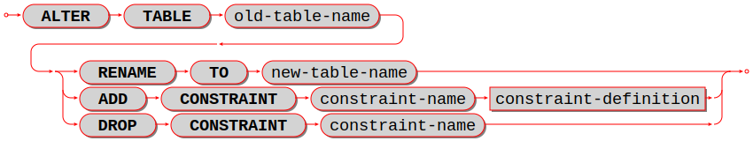
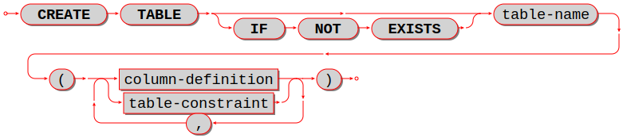
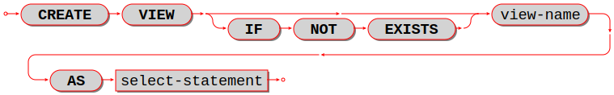
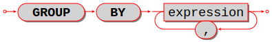
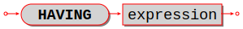
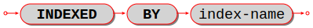

--------------------------------------------------------------------------------
SQL statements and clauses
--------------------------------------------------------------------------------

.. _sql_alter_table:

~~~~~~~~~~~~~~~~~~~~~~~~~~~~~~~~~~~~~~~~~~~~~~~~~~~~~~~~~~~~~~~~~~~~~~~~~~~~~~~~
ALTER TABLE
~~~~~~~~~~~~~~~~~~~~~~~~~~~~~~~~~~~~~~~~~~~~~~~~~~~~~~~~~~~~~~~~~~~~~~~~~~~~~~~~

Syntax:

* :samp:`ALTER TABLE {table-name} RENAME TO {new-table-name};`
* :samp:`ALTER TABLE {table-name} ADD CONSTRAINT {constraint-name} {constraint-definition};`
* :samp:`ALTER TABLE {table-name} DROP CONSTRAINT {constraint-name};`

|br|

|br|

ALTER is used to change a table's name or to add new constraints
or to drop old constraints.

Examples:

.. code-block:: sql

   -- renaming a table:
   ALTER TABLE t1 RENAME TO t2;

For ``ALTER ... RENAME``, the *old-table* must exist, the *new-table* must not
exist.

.. code-block:: sql

   -- adding a foreign-key constraint definition:
   ALTER TABLE t1 ADD CONSTRAINT c FOREIGN KEY (s1) REFERENCES t1;

For ``ALTER ... ADD CONSTRAINT``, the table must exist, table must be empty,
the constraint name must not already exist for the table.

It is not possible to say ``CREATE TABLE table_a ... REFERENCES table_b ...``
if table ``b`` does not exist yet. This is a situation where ``ALTER TABLE`` is
handy -- users can ``CREATE TABLE table_a`` without the foreign key, then
``CREATE TABLE table_b``, then ``ALTER TABLE table_a ... REFERENCES table_b ...``.

.. code-block:: sql

   -- adding a primary-key constraint definition:
   -- This is unusual because primary keys are created automatically
   -- and it is illegal to have two primary keys for the same table.
   -- However, it is possible to drop a primary-key index, and this
   -- is a way to restore the primary key if that happens.
   ALTER TABLE t1 ADD CONSTRAINT primary_key PRIMARY KEY (s1);

   -- adding a unique-constraint definition:
   -- Alternatively, you can say CREATE UNIQUE INDEX unique_key ON t1 (s1);
   ALTER TABLE t1 ADD CONSTRAINT unique_key UNIQUE (s1);

   -- Adding a check-constraint definition:
   ALTER TABLE t1 ADD CONSTRAINT check_ CHECK (s1 > 0);

.. _sql_alter_table_drop_constraint:

For ``ALTER ... DROP CONSTRAINT``, it is only legal to drop a named constraint,
and Tarantool only looks for names of foreign-key constraints. (Tarantool generates the
constraint names automatically if the user does not provide them.)

To remove a unique constraint, use DROP INDEX, which will drop the constraint
as well.

.. code-block:: sql

   -- dropping a constraint:
   ALTER TABLE t1 DROP CONSTRAINT c;

Limitations:

* It is not possible to add or drop a column.
* It is not possible to modify NOT NULL constraints or column properties DEFAULT
  and data type.
  However, it is possible to modify them with Tarantool/NOSQL, for example by
  calling :ref:`space_object:format() <box_space-format>` with a different
  ``is_nullable`` value.

.. _sql_create_table:

~~~~~~~~~~~~~~~~~~~~~~~~~~~~~~~~~~~~~~~~~~~~~~~~~~~~~~~~~~~~~~~~~~~~~~~~~~~~~~~~
CREATE TABLE
~~~~~~~~~~~~~~~~~~~~~~~~~~~~~~~~~~~~~~~~~~~~~~~~~~~~~~~~~~~~~~~~~~~~~~~~~~~~~~~~

Syntax:

:samp:`CREATE TABLE [IF NOT EXISTS] {table-name} ((column-definition or table-constraint list);`

|br|

|br|

Create a new base table, usually called a "table".

.. NOTE::

   A table is a *base table* if it is created with CREATE TABLE and contains
   data in persistent storage.

   A table is a *viewed table*, or just "view", if it is created with
   CREATE VIEW and gets its data from other views or from base tables.

The *table-name* must be an identifier which is valid according to the rules for
identifiers, and must not be the name of an already existing base table or view.

The *column-definition* or *table-constraint* list is a comma-separated list
of column definitions or table constraints.

A *table-element-list* must be a comma-separated list of table elements;
each table element may be either a column definition or a table constraint
definition.

Rules:

* A primary key is necessary; it can be specified with a table constraint
  PRIMARY KEY.
* There must be at least one column.
* When IF NOT EXISTS is specified, and there is already a table with the same
  name, the statement is ignored.

Actions:

#. Tarantool evaluates each column definition and *table-constraint*,
   and returns an error if any of the rules is violated.
#. Tarantool makes a new definition in the schema.
#. Tarantool makes new indexes for PRIMARY KEY or UNIQUE constraints.
   A unique index name is created automatically.
#. Tarantool effectively executes a ``COMMIT`` statement.

Examples:

.. code-block:: sql

   -- the simplest form, with one column and one constraint:
   CREATE TABLE t1 (s1 INTEGER, PRIMARY KEY (s1));

   -- you can see the effect of the statement by querying
   -- Tarantool system spaces:
   SELECT * FROM "_space" WHERE "name" = 'T1';
   SELECT * FROM "_index" JOIN "_space" ON "_index"."id" = "_space"."id"
            WHERE "_space"."name" = 'T1';

   -- variation of the simplest form, with delimited identifiers
   -- and an inline comment:
   CREATE TABLE "T1" ("S1" INT /* synonym of INTEGER */, PRIMARY KEY ("S1"));

   -- two columns, one named constraint
   CREATE TABLE t1 (s1 INTEGER, s2 STRING, CONSTRAINT c1 PRIMARY KEY (s1, s2));

Limitations:

* The maximum number of columns is 2000.
* The maximum length of a row depends on the
  :ref:`memtx_max_tuple_size <cfg_storage-memtx_max_tuple_size>` or
  :ref:`vinyl_max_tuple_size  <cfg_storage-memtx_max_tuple_size>`
  configuration option.

.. _sql_column_def:

***********************************************
Column definition
***********************************************

Syntax:

:samp:`column-name data-type [, column-constraint]`

Define a column, which is a table-element used in a CREATE TABLE statement.

The ``column-name`` must be an identifier which is valid according to the rules
for identifiers.

Each ``column-name`` must be unique within a table.

.. _sql_column_def_data_type:

***********************************************
Column definition -- data type
***********************************************

.. image:: data_type.svg
    :align: left

|br|

Every operand has a data type.

For literals, the data type is usually determined by the format.

For identifiers, the data type is usually determined by the definition.

The usual determination may change because of context or because of explicit casting.

For some SQL data type names there are *aliases*.
An alias may be used for data definition.
For example VARCHAR(5) and TEXT are aliases of STRING and may appear in
`CREATE TABLE table_name (column_name VARCHAR(5) PRIMARY KEY);` but Tarantool,
if asked, will report that the data type of `column_name` is STRING.

For every SQL data type there is a corresponding NoSQL type, for example
an SQL STRING is stored in a NoSQL space as type = 'string'.

To avoid confusion in this manual, all references to SQL data type names are
in upper case and all similar words which refer to NoSQL types or to other kinds
of object are in lower case, for example:

* STRING is a data type name, but string is a general term;
* NUMBER is a data type name, but number is a general term.

Although it is common to say that a VARBINARY value is a "binary string",
this manual will not use that term and will instead say "byte sequence".

Here are all the SQL data types, their corresponding NoSQL types, their aliases,
and minimum / maximum literal examples.

.. container:: table

    **Data types**

    .. rst-class:: left-align-column-1
    .. rst-class:: left-align-column-2
    .. rst-class:: left-align-column-3
    .. rst-class:: left-align-column-4

    +-----------+------------+------------+----------------------+----------------------+
    | SQL type  | NoSQL type | Aliases    | Minimum              | Maximum              |
    +===========+============+============+======================+======================+
    | BOOLEAN   | boolean    | BOOL       | FALSE                | TRUE                 |
    +-----------+------------+------------+----------------------+----------------------+
    | INTEGER   | integer    | INT        | -9223372036854775808 | 18446744073709551615 |
    +-----------+------------+------------+----------------------+----------------------+
    | UNSIGNED  | unsigned   | (none)     | 0                    | 18446744073709551615 |
    +-----------+------------+------------+----------------------+----------------------+
    | NUMBER    | number     | (none)     | -1.79769e308         | 1.79769e308          |
    +-----------+------------+------------+----------------------+----------------------+
    | STRING    | string     | TEXT,      |  ''                  | 'many-characters'    |
    |           |            | VARCHAR(n) |                      |                      |
    +-----------+------------+------------+----------------------+----------------------+
    | VARBINARY | varbinary  | (none)     | X''                  | 'X'many-hex-digits'  |
    +-----------+------------+------------+----------------------+----------------------+
    | SCALAR    | scalar     | (none)     | FALSE                | X'many-hex-digits'   |
    +-----------+------------+------------+----------------------+----------------------+

BOOLEAN values are FALSE, TRUE, and UNKNOWN (which is the same as NULL).
FALSE is less than TRUE.

INTEGER values are numbers that do not contain decimal points and are
not expressed with exponential notation. The range of possible values is
between -2^63 and +2^64, or NULL.

UNSIGNED values are numbers that do not contain decimal points and are not
expressed with exponential notation. The range of possible values is
between 0 and +2^64, or NULL.

NUMBER values are numbers that do contain decimal points (for example 0.5) or
are expressed with exponential notation (for example 5E-1).
The range of possible values is the same as for the IEEE 754 floating-point
standard, or NULL. Numbers outside the range of NUMBER literals may be displayed
as -inf or inf.

STRING values are any sequence of zero or more characters encoded with UTF-8,
or NULL. The possible character values are the same as for the Unicode standard.
Byte sequences which are not valid UTF-8 characters are allowed but not recommended.
STRING literal values are enclosed within single quotes, for example 'literal'.
If the VARCHAR alias is used for column definition, it must include a maximum
length, for example column_1 VARCHAR(40). However, the maximum length is ignored.
The data-type may be followed by ``[COLLATE collation-name]``.
.. // see section COLLATE clause.

VARBINARY values are any sequence of zero or more octets (bytes), or NULL.
VARBINARY literal values are expressed as X followed by pairs of hexadecimal
digits enclosed within single quotes, for example X'0044'.
VARBINARYs NoSQL equivalent is 'varbinary' but not character string -- the
MessagePack storage is MP_BIN (MsgPack binary).

SCALAR can be used for column definitions but the individual column values have
one of the preceding types -- BOOLEAN, INTEGER, UNSIGNED, NUMBER, STRING, or VARBINARY.
See more about SCALAR in the next section.
The data-type may be followed by ``[COLLATE collation-name]``.
.. // see section COLLATE clause.

Any value of any data type may be NULL. Ordinarily NULL will be cast to the
data type of any operand it is being compared to or to the data type of the
column it is in. If the data type of NULL cannot be determined from context,
it is BOOLEAN.

********************************************************
Column definition -- the rules for the SCALAR data type
********************************************************

SCALAR is a "complex" data type, unlike all the other data types which are "primitive".
Two column values in a SCALAR column can have two different primitive data types.

#. Any item defined as SCALAR has an underlying primitive type. For example, here:

   .. code-block:: sql

      CREATE TABLE t (s1 SCALAR PRIMARY KEY);
      INSERT INTO t VALUES (55),('41');

   the underlying primitive type of the item in the first row is INTEGER
   because literal 55 has data type INTEGER, and the underlying primitive type
   in the second row is STRING (the data type of a literal is always clear from
   its format).

   An item's primitive type is far more important than its defined type.
   Incidentally Tarantool might find the primitive type by looking at the way
   MsgPack stores it, but that is an implementation detail.

#. A SCALAR definition may not include a maximum length, as there is no suggested
   restriction.
#. A SCALAR definition may include a COLLATE clause, which affects any items
   whose primitive data type is STRING. The default collation is "binary".
#. Some assignments are illegal when data types differ, but legal when the
   target is a SCALAR item. For example ``UPDATE ... SET column1 = 'a'``
   is illegal if ``column1`` is defined as INTEGER, but is legal if ``column1``
   is defined as SCALAR -- values which happen to be INTEGER will be changed
   so their data type is STRING.
#. There is no literal syntax which implies data type SCALAR.
#. TYPEOF(x) is never SCALAR, it is always the underlying data type.
   This is true even if ``x`` is null (in that case the data type is BOOLEAN).
   In fact there is no function that is guaranteed to return the defined data type.
   For example, ``TYPEOF(CAST(1 AS SCALAR));`` returns INTEGER, not SCALAR.
#. For any operation that requires implicit casting from an item defined as SCALAR,
   the syntax is legal but the operation may fail at runtime.
   At runtime, Tarantool detects the underlying primitive data type and applies
   the rules for that. For example, if a definition is:

   .. code-block:: sql

      CREATE TABLE t (s1 SCALAR PRIMARY KEY, s2 INTEGER);

   and within any row ``s1 = 'a'``, that is, its underlying primitive type is
   STRING to indicate character strings, then ``UPDATE t SET s2 = s1;`` is illegal.
   Tarantool usually does not know that in advance.
#. For any dyadic operation that requires implicit casting for comparison, the
   syntax is legal and the operation will not fail at runtime.
   Take this situation: comparison with a primitive type VARBINARY and
   a primitive type STRING.

   .. code-block:: sql

      CREATE TABLE t (s1 SCALAR PRIMARY KEY);
      INSERT INTO t VALUES (X'41');
      SELECT * FROM t WHERE s1 > 'a';

   The comparison is valid, because Tarantool knows the ordering of X'41' and 'a'
   in Tarantool/NoSQL 'scalar'. This would be true even if ``s1`` was not defined
   as SCALAR.
#. The result data type of min/max operation on a column defined as SCALAR
   is the data type of the minimum/maximum operand, unless the result value
   is NULL. For example:

   .. code-block:: sql

      CREATE TABLE t (s1 INT, s2 SCALAR PRIMARY KEY);
      INSERT INTO t VALUES (1,X'44'),(2,11),(3,1E4),(4,'a');
      SELECT MIN(s2), HEX(MAX(s2)) FROM t;

   The result is: ``- - [11, '44',]``

   That is only possible with Tarantool/NoSQL scalar rules, but ``SELECT SUM(s2)``
   would not be legal because addition would in this case require implicit casting
   from VARBINARY to integer, which is not sensible.
#. The result data type of a primitive combination is never SCALAR because we
   in effect use TYPEOF(item) not the defined data type.
   (Here we use the word "combination" in the way that the standard document
   uses it for section "Result of data type combinations".) Therefore for
   ``MAX(1E308, 'a', 0, X'00')`` the result is X'00'.

********************************************
Column definition -- relation to NoSQL
********************************************

All the SQL data types correspond to
:ref:`Tarantool/NoSQL types with the same name <box_space-index_field_types>`.
For example an SQL STRING is stored in a NoSQL space as type = 'string'.

Therefore specifying an SQL data type X determines that the storage will be
in a space with a format column saying that the NoSQL type is 'x'.

The rules for that NoSQL type are applicable to the SQL data type.

If two items have SQL data types that have the same underlying type, then they
are compatible for all assignment or comparison purposes.

If two items have SQL data types that have different underlying types, then the
rules for explicit casts, or implicit (assignment) casts, or implicit (comparison)
casts, apply.

There is one floating-point value which is not handled by SQL: -nan is seen as NULL.

There are also some Tarantool/NoSQL data types which have no corresponding
SQL data types. For example, ``SELECT "flags" FROM "_space";`` will return
a column whose data type is 'map'. Such columns can only be manipulated in SQL
by invoking Lua functions.

**********************************************************
Column definition -- column-constraint or default clause
**********************************************************

The column-constraint or default clause may be as follows:

.. container:: table

    **Data types**

    .. rst-class:: left-align-column-1
    .. rst-class:: left-align-column-2

    +--------------------+---------------------------------------------------+
    | Type               | Comment                                           |
    +====================+===================================================+
    | NOT NULL           | means                                             |
    |                    | "it is illegal to assign a NULL to this column"   |
    +--------------------+---------------------------------------------------+
    | PRIMARY KEY        | explained in the later section                    |
    |                    | "Constraint definition"                           |
    +--------------------+---------------------------------------------------+
    | UNIQUE             | explained in the later section                    |
    |                    | "Constraint definition"                           |
    +--------------------+---------------------------------------------------+
    | CHECK (expression) | explained in the later section                    |
    |                    | "Constraint definition"                           |
    +--------------------+---------------------------------------------------+
    | DEFAULT expression | means                                             |
    |                    | "if INSERT does not assign to this column         |
    |                    | then assign expression result to this column" --  |
    |                    | if there is no DEFAULT clause then DEFAULT NULL   |
    |                    | is assumed.                                       |
    +--------------------+---------------------------------------------------+

If column-constraint is PRIMARY KEY, this is a shorthand for a separate
table-constraint definition: "PRIMARY KEY (column-name)".

If column-constraint is UNIQUE, this is a shorthand for a separate
table-constraint definition: "UNIQUE (column-name)".

Columns defined with PRIMARY KEY are automatically NOT NULL.

To enforce some restrictions that Tarantool does not enforce automatically,
add CHECK clauses, like these:

.. code-block:: sql

   CREATE TABLE t ("smallint" INTEGER PRIMARY KEY, CHECK ("smallint" <= 32767 AND "smallint" >= -32768));
   CREATE TABLE t ("shorttext" CHAR(10) PRIMARY KEY, CHECK (length("shorttext") <= 10));

but this may cause inserts or updates to be slow.

*******************************
Column definition -- examples
*******************************

These are shown within CREATE TABLE statements.
Data types may also appear in CAST functions.

.. code-block:: sql

   -- the simple form with column-name and data-type
   CREATE TABLE t (column1 INTEGER ...);
   -- with column-name and data-type and column-constraint
   CREATE TABLE t (column1 STRING PRIMARY KEY ...);
   -- with column-name and data-type and collate-clause and two column-constraints
   CREATE TABLE t (column1 SCALAR COLLATE "unicode" ...);

.. code-block:: sql

   -- with all possible data types and aliases
   CREATE TABLE t
   (column1 BOOLEAN, column2 BOOL,
    column3 INT PRIMARY KEY, column4 INTEGER,
    column4 NUMBER,
    column7 STRING, column8 STRING COLLATE "unicode",
    column9 TEXT, columna TEXT COLLATE "unicode_sv_s1",
    columnb VARCHAR(0), columnc VARCHAR(100000) COLLATE "binary",
    columnd VARBINARY,
    columne SCALAR, columnf SCALAR COLLATE "unicode_uk_s2");

.. code-block:: sql

   -- with all possible column constraints and a default clause
   CREATE TABLE t
   (column1 INT PRIMARY KEY,
    column2 INT UNIQUE,
    column3 INT CHECK (column3 > column2),
    column4 INT REFERENCES t,
    column6 INT DEFAULT NULL);

.. _sql_drop_table:

~~~~~~~~~~~~~~~~~~~~~~~~~~~~~~~~~~~~~~~~~~~~~~~~~~~~~~~~~~~~~~~~~~~~~~~~~~~~~~~~
DROP TABLE
~~~~~~~~~~~~~~~~~~~~~~~~~~~~~~~~~~~~~~~~~~~~~~~~~~~~~~~~~~~~~~~~~~~~~~~~~~~~~~~~

Syntax:

:samp:`DROP TABLE [IF EXISTS] {table-name};`

|br|

.. image:: drop_table.svg
    :align: left

|br|

Drop a table.

The *table-name* must identify a table that was created earlier with the
:ref:`CREATE TABLE statement <sql_create_table>`.

Rules:

* If there is a view that references the table, the drop will fail.
  Please drop the referencing view with DROP VIEW first.
* If there is a foreign key that references the table, the drop will fail.
  Please drop the referencing constraint with
  :ref:`ALTER TABLE ... DROP <sql_alter_table_drop_constraint>` first.

Actions:

#. Tarantool returns an error if the table does not exist.
#. The table and all its data are dropped.
#. All indexes for the table are dropped.
#. All triggers for the table are dropped.
#. Tarantool effectively executes a COMMIT statement.

Examples:

.. code-block:: sql

   -- the simple case:
   DROP TABLE t31;
   -- with an IF EXISTS clause:
   DROP TABLE IF EXISTS t31;

See also: :ref:`DROP VIEW <sql_drop_view>`.

.. _sql_create_view:

~~~~~~~~~~~~~~~~~~~~~~~~~~~~~~~~~~~~~~~~~~~~~~~~~~~~~~~~~~~~~~~~~~~~~~~~~~~~~~~~
CREATE VIEW
~~~~~~~~~~~~~~~~~~~~~~~~~~~~~~~~~~~~~~~~~~~~~~~~~~~~~~~~~~~~~~~~~~~~~~~~~~~~~~~~

Syntax:

:samp:`CREATE VIEW [IF NOT EXISTS] {view-name} [(column-list)] AS subquery;`

|br|

|br|

Create a new viewed table, usually called a "view".

The *view-name* must be valid according to the rules for identifiers.

The optional *column-list* must be a comma-separated list of names of columns
in the view.

The syntax of the subquery must be the same as the syntax of a SELECT statement,
or of a VALUES clause.

Rules:

* There must not already be a base table or view with the same name as
  *view-name*.
* If *column-list* is specified, the number of columns in *column-list* must be
  the same as the number of columns in the *select-list* of the subquery.

Actions:

#. Tarantool will throw an error if a rule is violated.
#. Tarantool will create a new persistent object with *column-names* equal to
   the names in the *column-list* or the names in the subquery's *select-list*.
#. Tarantool effectively executes a COMMIT statement.

Examples:

.. code-block:: sql

   -- the simple case:
   CREATE VIEW v AS SELECT column1, column2 FROM t;
   -- with a column-list:
   CREATE VIEW v (a,b) AS SELECT column1, column2 FROM t;

Limitations:

* It is not possible to insert or update or delete from a view, although
  sometimes a possible substitution is to create an INSTEAD OF trigger.

.. _sql_drop_view:

~~~~~~~~~~~~~~~~~~~~~~~~~~~~~~~~~~~~~~~~~~~~~~~~~~~~~~~~~~~~~~~~~~~~~~~~~~~~~~~~
DROP VIEW
~~~~~~~~~~~~~~~~~~~~~~~~~~~~~~~~~~~~~~~~~~~~~~~~~~~~~~~~~~~~~~~~~~~~~~~~~~~~~~~~

Syntax:

:samp:`DROP VIEW [IF EXISTS] {view-name};`

|br|

.. image:: drop_view.svg
    :align: left

|br|

Drop a view.

The *view-name* must identify a view that was created earlier with the
:ref:`CREATE VIEW statement <sql_create_view>`.

Rules: none

Actions:

#. Tarantool returns an error if the view does not exist.
#. The view is dropped.
#. All triggers for the view are dropped.
#. Tarantool effectively executes a COMMIT statement.

Examples:

.. code-block:: sql

   -- the simple case:
   DROP VIEW v31;
   -- with an IF EXISTS clause:
   DROP VIEW IF EXISTS v31;

See also: :ref:`DROP TABLE <sql_drop_table>`.

.. _sql_create_index:

~~~~~~~~~~~~~~~~~~~~~~~~~~~~~~~~~~~~~~~~~~~~~~~~~~~~~~~~~~~~~~~~~~~~~~~~~~~~~~~~
CREATE INDEX
~~~~~~~~~~~~~~~~~~~~~~~~~~~~~~~~~~~~~~~~~~~~~~~~~~~~~~~~~~~~~~~~~~~~~~~~~~~~~~~~

Syntax:

:samp:`CREATE [UNIQUE] INDEX [IF NOT EXISTS] {index-name} ON {table-name} (column-list);`

|br|

.. image:: create_index.svg
    :align: left

|br|

Create an index.

The *index-name* must be valid according to the rules for identifiers.

The *table-name* must refer to an existing table.

The *column-list* must be a comma-separated list of names of columns in the
table.

Rules:

* There must not already be, for the same table, an index with the same name as
  *index-name*.
* An index name is local to the table the index is defined on.
* The maximum number of indexes per table is 128.

Actions:

#. Tarantool will throw an error if a rule is violated.
#. If the new index is UNIQUE, Tarantool will throw an error if any row exists
   with columns that have duplicate values.
#. Tarantool will create a new index.
#. Tarantool effectively executes a COMMIT statement.

Automatic indexes:

Indexes may be created automatically for columns mentioned in the PRIMARY KEY
or UNIQUE clauses of a CREATE TABLE statement.
If an index was created automatically, then the *index-name* is based on four
items:

#. ``pk`` if this is for a PRIMARY KEY clause, ``unique`` if this is for
   a UNIQUE clause;
#. ``_unnamed_``;
#. the name of the table;
#. ``_`` and an ordinal number; the first index is 1, the second index is 2,
   and so on.

For example, after ``CREATE TABLE t (s1 INT PRIMARY KEY, s2 INT, UNIQUE (s2));``
there are two indexes named ``pk_unnamed_T_1`` and ``unique_unnamed_T_2``.
You can confirm this by saying ``SELECT * FROM "_index";`` which will list all
indexes on all tables.
There is no need to say ``CREATE INDEX`` for columns that already have
automatic indexes.

Examples:

.. code-block:: sql

   -- the simple case
   CREATE INDEX i ON t (column1);
   -- with IF NOT EXISTS clause
   CREATE INDEX IF NOT EXISTS i ON t (column1);
   -- with UNIQUE specifier and more than one column
   CREATE UNIQUE INDEX i ON t (column1, column2);

Dropping an automatic index created for a unique constraint will drop
the unique constraint as well.

.. _sql_drop_index:

~~~~~~~~~~~~~~~~~~~~~~~~~~~~~~~~~~~~~~~~~~~~~~~~~~~~~~~~~~~~~~~~~~~~~~~~~~~~~~~~
DROP INDEX
~~~~~~~~~~~~~~~~~~~~~~~~~~~~~~~~~~~~~~~~~~~~~~~~~~~~~~~~~~~~~~~~~~~~~~~~~~~~~~~~

Syntax:

:samp:`DROP INDEX [IF EXISTS] index-name ON {table-name};`

|br|

.. image:: drop_index.svg
    :align: left

|br|

The *index-name* must be the name of an existing index, which was created with
CREATE INDEX.
Or, the *index-name* must be the name of an index that was created automatically
due to a PRIMARY KEY or UNIQUE clause in the CREATE TABLE statement.
To see what a table's indexes are, use ``PRAGMA index_list (table-name)``.

Rules: none

Actions:

#. Tarantool throws an error if the index does not exist, or is an automatically
   created index.
#. Tarantool will drop the index.
#. Tarantool effectively executes a COMMIT statement.

Example:

.. code-block:: sql

   -- the simplest form:
   DROP INDEX i ON t;

.. _sql_insert:

~~~~~~~~~~~~~~~~~~~~~~~~~~~~~~~~~~~~~~~~~~~~~~~~~~~~~~~~~~~~~~~~~~~~~~~~~~~~~~~~
INSERT
~~~~~~~~~~~~~~~~~~~~~~~~~~~~~~~~~~~~~~~~~~~~~~~~~~~~~~~~~~~~~~~~~~~~~~~~~~~~~~~~

Syntax:

* :samp:`INSERT INTO {table-name} [(column-list)] VALUES (expression-list) [, (expression-list)];`
* :samp:`INSERT INTO {table-name} [(column-list)]  select-statement;`
* :samp:`INSERT INTO {table-name} DEFAULT VALUES;`

|br|

.. image:: insert.svg
    :align: left

|br|

Insert one or more new rows into a table.

The *table-name* must be a name of a table defined earlier with CREATE TABLE.

The optional *column-list* must be a comma-separated list of names of columns
in the table.

The *expression-list* must be a comma-separated list of expressions; each
expression may contain literals and operators and subqueries and function invocations.

Rules:

* The values in the *expression-list* are evaluated from left to right.
* The order of the values in the *expression-list* must correspond to the order
  of the columns in the table, or (if a *column-list* is specified) to the order
  of the columns in the *column-list*.
* The data type of the value should correspond to the data type of the column,
  that is, the data type that was specified with CREATE TABLE.
* If a *column-list* is not specified, then the number of expressions must be
  the same as the number of columns in the table.
* If a *column-list* is specified, then some columns may be omitted; omitted
  columns will get default values.
* The parenthesized *expression-list* may be repeated --
  ``(expression-list),(expression-list),...`` -- for multiple rows.

Actions:

#. Tarantool evaluates each expression in *expression-list*, and returns an
   error if any of the rules is violated.
#. Tarantool creates zero or more new rows containing values based on the values
   in the VALUES list or based on the results of the *select-expression* or
   based on the default values.
#. Tarantool executes constraint checks and trigger actions and the actual insertion.
#. Tarantool inserts values into the table.

.. //  append to 3: in the order described by section "Order of Execution in Data-Change Statements"

Examples:

.. code-block:: sql

   -- the simplest form:
   INSERT INTO table1 VALUES (1, 'A');
   -- with a column list:
   INSERT INTO table1 (column1, column2) VALUES (2, 'B');
   -- with an arithmetic operator in the first expression:
   INSERT INTO table1 VALUES (2 + 1, 'C');
   -- put two rows in the table:
   INSERT INTO table1 VALUES (4, 'D'), (5, 'E');

See also: :ref:`REPLACE statement <sql_replace>`.

.. _sql_update:

~~~~~~~~~~~~~~~~~~~~~~~~~~~~~~~~~~~~~~~~~~~~~~~~~~~~~~~~~~~~~~~~~~~~~~~~~~~~~~~~
UPDATE
~~~~~~~~~~~~~~~~~~~~~~~~~~~~~~~~~~~~~~~~~~~~~~~~~~~~~~~~~~~~~~~~~~~~~~~~~~~~~~~~

Syntax:

:samp:`UPDATE {table-name}
SET column-name = expression [, column-name = expression ...]
[WHERE search-condition];`

|br|

.. image:: update.svg
    :align: left

|br|

Update zero or more existing rows in a table.

The *table-name* must be a name of a table defined earlier with
CREATE TABLE or CREATE VIEW.

The *column-name* must be an updatable column in the table.

The *expression* may contain literals and operators and subqueries and function
invocations and column names.

Rules:

* The values in the SET clause are evaluated from left to right.
* The data type of the value should correspond to the data type of the column,
  that is, the data type that was specified with CREATE TABLE.
* If a *search-condition* is not specified, then all rows in the table will be
  updated; otherwise only those rows which match the *search-condition* will be
  updated.

Actions:

#. Tarantool evaluates each expression in the SET clause, and returns an error
   if any of the rules is violated.
   For each row that is found by the WHERE clause, a temporary new row is formed
   based on the original contents and the modifications caused by the SET clause.
#. Tarantool executes constraint checks and trigger actions and the actual update.

.. // append to 2: in the order described by section Order of Execution in Data-Change Statements.

Examples:

.. code-block:: sql

   -- the simplest form:
   UPDATE t SET column1 = 1;
   -- with more than one assignment in the SET clause:
   UPDATE t SET column1 = 1, column2 = 2;
   -- with a WHERE clause:
   UPDATE t SET column1 = 5 WHERE column2 = 6;

Special cases:

It is legal to say SET (list of columns) = (list of values). For example:

.. code-block:: sql

   UPDATE t SET (column1, column2, column3) = (1,2,3);

It is not legal to assign to a column more than once. For example:

.. code-block:: sql

   INSERT INTO t (column1) VALUES (0);
   UPDATE t SET column1 = column1 + 1, column1 = column1 + 1;

The result is an error: "duplicate column name".

It is not legal to assign to a primary-key column.

.. _sql_delete:

~~~~~~~~~~~~~~~~~~~~~~~~~~~~~~~~~~~~~~~~~~~~~~~~~~~~~~~~~~~~~~~~~~~~~~~~~~~~~~~~
DELETE
~~~~~~~~~~~~~~~~~~~~~~~~~~~~~~~~~~~~~~~~~~~~~~~~~~~~~~~~~~~~~~~~~~~~~~~~~~~~~~~~

Syntax:

:samp:`DELETE FROM {table-name} [WHERE search-condition];`

|br|

.. image:: delete.svg
    :align: left

|br|

Delete zero or more existing rows in a table.

The *table-name* must be a name of a table defined earlier with
CREATE TABLE or CREATE VIEW.

The *search-condition* may contain literals and operators and subqueries and
function invocations and column names.

Rules:

* If a search-condition is not specified, then all rows in the table will be
  deleted; otherwise only those rows which match the *search-condition* will be
  deleted.

Actions:

#. Tarantool evaluates each expression in the *search-condition*, and returns
   an error if any of the rules is violated.
#. Tarantool finds the set of rows that are to be deleted.
#. Tarantool executes constraint checks and trigger actions and the actual deletion.
#. Tarantool deletes the set of matching rows from the table.

.. // append to 3: in the order described by section Order of Execution in Data-Change Statements.

Examples:

.. code-block:: sql

   -- the simplest form:
   DELETE FROM t;
   -- with a WHERE clause:
   DELETE FROM t WHERE column2 = 6;

.. _sql_replace:

~~~~~~~~~~~~~~~~~~~~~~~~~~~~~~~~~~~~~~~~~~~~~~~~~~~~~~~~~~~~~~~~~~~~~~~~~~~~~~~~
REPLACE
~~~~~~~~~~~~~~~~~~~~~~~~~~~~~~~~~~~~~~~~~~~~~~~~~~~~~~~~~~~~~~~~~~~~~~~~~~~~~~~~

Syntax:

* :samp:`REPLACE INTO {table-name} [(column-list)] VALUES (expression-list) [, (expression-list)];`
* :samp:`REPLACE INTO {table-name} [(column-list)] select-statement;`
* :samp:`REPLACE INTO {table-name} DEFAULT VALUES;`

|br|

.. image:: replace.svg
    :align: left

|br|

Insert one or more new rows into a table, or update existing rows.

If a row already exists (as determined by the primary key or any unique key),
then the action is delete + insert, and the rules are the same as for a
DELETE statement followed by an INSERT statement.
Otherwise the action is insert, and the rules are the same as for the
INSERT statement.

Examples:

.. code-block:: sql

   -- the simplest form:
   REPLACE INTO table1 VALUES (1, 'A');
   -- with a column list:
   REPLACE INTO table1 (column1, column2) VALUES (2, 'B');
   -- with an arithmetic operator in the first expression:
   REPLACE INTO table1 VALUES (2 + 1, 'C');
   -- put two rows in the table:
   REPLACE INTO table1 VALUES (4, 'D'), (5, 'E');

See also: :ref:`INSERT Statement <sql_insert>`, :ref:`UPDATE Statement <sql_update>`.

.. // and Order of Execution in Data-Change Statements.

.. _sql_create_trigger:

~~~~~~~~~~~~~~~~~~~~~~~~~~~~~~~~~~~~~~~~~~~~~~~~~~~~~~~~~~~~~~~~~~~~~~~~~~~~~~~~
CREATE TRIGGER
~~~~~~~~~~~~~~~~~~~~~~~~~~~~~~~~~~~~~~~~~~~~~~~~~~~~~~~~~~~~~~~~~~~~~~~~~~~~~~~~

Syntax:

:samp:`CREATE TRIGGER [IF NOT EXISTS] {trigger-name}` |br|
:samp:`BEFORE|AFTER|INSTEAD OF` |br|
:samp:`INSERT|UPDATE|DELETE ON {table-name}` |br|
:samp:`FOR EACH ROW` |br|
:samp:`[WHEN (search-condition)]` |br|
:samp:`BEGIN` |br|
:samp:`update-statement | insert-statement | delete-statement | select-statement;` |br|
:samp:`[update-statement | insert-statement | delete-statement | select-statement; ...]` |br|
:samp:`END;`

|br|

.. image:: create_trigger.svg
    :align: left

|br|

The *trigger-name* must be valid according to the rules for identifiers.

If the trigger action time is BEFORE or AFTER, then the *table-name* must refer
to an existing base table.

If the trigger action time is INSTEAD OF, then the *table-name* must refer to an
existing view.

Rules:

* There must not already be a trigger with the same name as *trigger-name*.
* Triggers on different tables or views share the same namespace.
* The statements between BEGIN and END should not refer to the *table-name*
  mentioned in the ON clause.
* The statements between BEGIN and END should not contain an INDEXED BY clause.

SQL triggers are not fired upon Tarantool/NoSQL requests.
This will change in version 2.2.

On a replica, effects of trigger execution are applied, and the SQL triggers
themselves are not fired upon replication events.

NoSQL triggers are fired both on replica and master, thus if you have a NoSQL
trigger on replica, it is fired when applying effects of an SQL trigger.

Actions:

#. Tarantool will throw an error if a rule is violated.
#. Tarantool will create a new trigger.
#. Tarantool effectively executes a COMMIT statement.

Examples:

.. code-block:: sql

   -- the simple case:
   CREATE TRIGGER delete_if_insert BEFORE INSERT ON stores FOR EACH ROW
     BEGIN DELETE FROM warehouses; END;
   -- with IF NOT EXISTS clause:
   CREATE TRIGGER IF NOT EXISTS delete_if_insert BEFORE INSERT ON stores FOR EACH ROW
     BEGIN DELETE FROM warehouses; END;
   -- with FOR EACH ROW and WHEN clauses:
   CREATE TRIGGER delete_if_insert BEFORE INSERT ON stores FOR EACH ROW WHEN a=5
     BEGIN DELETE FROM warehouses; END;
   -- with multiple statements between BEGIN and END:
   CREATE TRIGGER delete_if_insert BEFORE INSERT ON stores FOR EACH ROW
     BEGIN DELETE FROM warehouses; INSERT INTO inventories VALUES (1); END;

.. _sql_trigger_extra:

***********************************************
Trigger extra clauses
***********************************************

* :samp:`UPDATE OF column-list`

  After BEFORE|AFTER UPDATE it is optional to add ``OF column-list``.
  If any of the columns in *column-list* is affected at the time the row is
  processed, then the trigger will be activated for that row. For example:

  .. code-block:: sql

     CREATE TRIGGER trigger_on_table1
      BEFORE UPDATE  OF column1, column2 ON table1
      FOR EACH ROW
      BEGIN UPDATE table2 SET column1 = column1 + 1; END;
     UPDATE table1 SET column3 = column3 + 1; -- Trigger will not be activated
     UPDATE table1 SET column2 = column2 + 0; -- Trigger will be activated

* :samp:`WHEN`

  After *table-name* FOR EACH ROW it is optional to add [``WHEN expression``].
  If the expression is true at the time the row is processed, only then the
  trigger will be activated for that row. For example:

  .. code-block:: sql

     CREATE TRIGGER trigger_on_table1 BEFORE UPDATE ON table1 FOR EACH ROW
      WHEN (SELECT COUNT(*) FROM table1) > 1
      BEGIN UPDATE table2 SET column1 = column1 + 1; END;

  This trigger will not be activated unless there is more than one row in
  ``table1``.

* :samp:`OLD and NEW`

  The keywords OLD and NEW have special meaning in the context of trigger action:

  * OLD.column-name refers to the value of *column-name* before the change.
  * NEW.column-name refers to the value of *column-name* after the change.

  For example:

  .. code-block:: sql

     CREATE TABLE table1 (column1 VARCHAR(15), column2 INT PRIMARY KEY);
     CREATE TABLE table2 (column1 VARCHAR(15), column2 VARCHAR(15), column3 INT PRIMARY KEY);
     INSERT INTO table1 VALUES ('old value', 1);
     INSERT INTO table2 VALUES ('', '', 1);
     CREATE TRIGGER trigger_on_table1 BEFORE UPDATE ON table1 FOR EACH ROW
      BEGIN UPDATE table2 SET column1 = old.column1, column2 = new.column1; END;
     UPDATE table1 SET column1 = 'new value';
     SELECT * FROM table2;

  At the beginning of the UPDATE for the single row of ``table1``, the value in
  ``column1`` is 'old value' -- so that is what is seen as ``old.column1``.

  At the end of the UPDATE for the single row of ``table1``, the value in
  ``column1`` is 'new value' -- so that is what is seen as ``new.column1``.
  (OLD and NEW are qualifiers for ``table1``, not ``table2.``)

  Therefore, ``SELECT * FROM table2;`` returns ``['old value', 'new value']``.

  ``OLD.column-name`` does not exist for an INSERT trigger.

  ``NEW.column-name`` does not exist for a DELETE trigger.

  OLD and NEW are read-only; you cannot change their values.

* Deprecated or illegal statements:

  It is legal for the trigger action to include a SELECT statement or a REPLACE
  statement, but not recommended.

  It is illegal for the trigger action to include a qualified column reference
  other than ``OLD.column-name`` or ``NEW.column-name``. For example,
  ``CREATE TRIGGER ... BEGIN UPDATE table1 SET table1.column1=5; END;``
  is illegal.

  It is illegal for the trigger action to include statements that include a WITH
  clause, a DEFAULT VALUES clause, or an INDEXED BY clause.

  It is usually not a good idea to have a trigger on ``table1`` which causes
  a change on ``table2``, and at the same time have a trigger on ``table2``
  which causes a change on ``table1``. For example:

  .. code-block:: none

     CREATE TRIGGER trigger_on_table1
      BEFORE UPDATE ON table1
      FOR EACH ROW
      BEGIN UPDATE table2 SET column1 = column1 + 1; END;
     CREATE TRIGGER trigger_on_table2
      BEFORE UPDATE ON table2
      FOR EACH ROW
      BEGIN UPDATE table1 SET column1 = column1 + 1; END;

  Luckily ``UPDATE table1 ...`` will not cause an infinite loop, because
  Tarantool recognizes when it has already updated so it will stop.
  However, not every DBMS acts this way.

.. _sql_trigger_activation:

***********************************************
Trigger activation
***********************************************

These are remarks concerning trigger activation.

Standard terminology:

* "trigger action time" = BEFORE or AFTER or INSTEAD OF
* "trigger event" = INSERT or DELETE or UPDATE
* "triggered statement" = BEGIN ... INSERT|DELETE|UPDATE ... END
* "triggered when clause" = WHEN (search condition)
* "activate" = execute a triggered statement
* some vendors use the word "fire" instead of "activate"

If there is more than one trigger for the same trigger event, Tarantool may
execute the triggers in any order.

It is possible for a triggered statement to cause activation of another
triggered statement. For example, this is legal:

.. code-block:: sql

   CREATE TRIGGER on_t1 BEFORE DELETE ON t1 BEGIN DELETE FROM t2; END;
   CREATE TRIGGER on_t2 BEFORE DELETE ON t2 BEGIN DELETE FROM t3; END;

Activation occurs FOR EACH ROW, not FOR EACH STATEMENT. Therefore, if no rows
are candidates for insert or update or delete, then no triggers are activated.

The BEFORE trigger is activated even if the trigger event fails.

If an UPDATE trigger event does not make a change, the trigger is activated
anyway. For example, if row 1 ``column1`` contains 'a', and the trigger event
is ``UPDATE ... SET column1 = 'a';``, the trigger is activated.

The triggered statement may refer to a function:
``RAISE(FAIL, error-message)``.
If a triggered statement invokes a ``RAISE(FAIL, error-message)`` function, or
if a triggered statement causes an error, then statement execution stops
immediately.

The triggered statement may refer to column values within the rows being changed.
in this case:

* The row "as of before" the change is called the "old" row (which makes sense
  only for UPDATE and DELETE statements).
* The row "as of after" the change is called the "new" row (which makes sense
  only for UPDATE and INSERT statements).

This example shows how an INSERT can be done to a view by referring to the
"new" row:

.. code-block:: sql

   CREATE TABLE t (s1 INT PRIMARY KEY, s2 INT);
   CREATE VIEW v AS SELECT s1, s2 FROM t;
   CREATE TRIGGER tv INSTEAD OF INSERT ON v
     FOR EACH ROW
     BEGIN INSERT INTO t VALUES (new.s1, new.s2); END;
   INSERT INTO v VALUES (1,2);

Ordinarily saying ``INSERT INTO view_name ...`` is illegal in Tarantool,
so this is a workaround.

It is possible to generalize this so that all data-change statements
on views will change the base tables, provided that the view contains
all the columns of the base table, and provided that the triggers
refer to those columns when necessary, as in this example:

.. code-block:: sql

   CREATE TABLE base_table (primary_key_column INT PRIMARY KEY, value_column INT);
   CREATE VIEW viewed_table AS SELECT primary_key_column, value_column FROM base_table;
   CREATE TRIGGER viewed_insert INSTEAD OF INSERT ON viewed_table FOR EACH ROW
     BEGIN
       INSERT INTO base_table VALUES (new.primary_key_column, new.value_column);
     END;
   CREATE TRIGGER viewed_update INSTEAD OF UPDATE ON viewed_table FOR EACH ROW
     BEGIN
       UPDATE base_table
       SET primary_key_column = new.primary_key_column, value_column = new.value_column
       WHERE primary_key_column = old.primary_key_column;
     END;
   CREATE TRIGGER viewed_delete INSTEAD OF DELETE ON viewed_table FOR EACH ROW
     BEGIN
       DELETE FROM base_table WHERE primary_key_column = old.primary_key_column;
     END;

When INSERT or UPDATE or DELETE occurs for table ``X``, Tarantool usually
operates in this order (a basic scheme):

.. code-block:: none

   For each row
     Perform constraint checks
     For each BEFORE trigger that refers to table X
       Check that the trigger's WHEN condition is true.
       Execute what is in the trigger's BEGIN|END block.
     Insert or update or delete the row in table X.
     Perform more constraint checks
     For each AFTER trigger that refers to table X
       Check that the trigger's WHEN condition is true.
       Execute what is in the trigger's BEGIN|END block.

.. // For details, see "Order of Execution in Data-change statements".

However, Tarantool does not guarantee execution order when there are multiple
constraints, or multiple triggers for the same event (including NoSQL
``on_replace`` triggers or SQL INSTEAD OF triggers that affect a view of table
``X``).

The maximum number of trigger activations per statement is 32.

.. _sql_instead_of_triggers:

***********************************************
INSTEAD OF triggers
***********************************************

A trigger which is created with the clause |br|
:samp:`INSTEAD OF {INSERT|UPDATE|DELETE} ON {view-name}` |br|
is an INSTEAD OF trigger. For each affected row, the trigger action is performed
"instead of" the INSERT or UPDATE or DELETE statement that causes trigger
activation.

For example, ordinarily it is illegal to INSERT rows in a view, but it is legal
to create a trigger which intercepts attempts to INSERT, and puts rows in the
underlying base table:

.. code-block:: sql

   CREATE TABLE t1 (column1 INT PRIMARY KEY, column2 INT);
   CREATE VIEW v1 AS SELECT column1, column2 FROM t1;
   CREATE TRIGGER t1 INSTEAD OF INSERT ON v1 FOR EACH ROW BEGIN
    INSERT INTO t1 VALUES (NEW.column1, NEW.column2); END;
   INSERT INTO v1 VALUES (1, 1);
   -- ... The result will be: table t1 will contain a new row.

INSTEAD OF triggers are only legal for views, while
BEFORE or AFTER triggers are not legal for views.

It is legal to create INSTEAD OF triggers with triggered WHEN clauses.

Limitations:

* It is legal to create INSTEAD OF triggers with UPDATE OF *column-list* clauses,
  but they are not standard SQL.

  Example:

.. code-block:: sql

   CREATE TRIGGER et1
     INSTEAD OF UPDATE OF column2,column1 ON ev1
     FOR EACH ROW BEGIN
     INSERT INTO et2 VALUES (NEW.column1, NEW.column2); END;

.. _sql_drop_trigger:

~~~~~~~~~~~~~~~~~~~~~~~~~~~~~~~~~~~~~~~~~~~~~~~~~~~~~~~~~~~~~~~~~~~~~~~~~~~~~~~~
DROP TRIGGER
~~~~~~~~~~~~~~~~~~~~~~~~~~~~~~~~~~~~~~~~~~~~~~~~~~~~~~~~~~~~~~~~~~~~~~~~~~~~~~~~

Syntax:

:samp:`DROP TRIGGER [IF EXISTS] {trigger-name};`

|br|

.. image:: drop_trigger.svg
    :align: left

|br|

Drop a trigger.

The *trigger-name* must identify a trigger that was created earlier with the
CREATE TRIGGER statement.

Rules: none

Actions:

#. Tarantool returns an error if the trigger does not exist.
#. The trigger is dropped.
#. Tarantool effectively executes a COMMIT statement.

Examples:

.. code-block:: sql

   -- the simple case:
   DROP TRIGGER tr;
   -- with an IF EXISTS clause:
   DROP TRIGGER IF EXISTS tr;

.. _sql_truncate:

~~~~~~~~~~~~~~~~~~~~~~~~~~~~~~~~~~~~~~~~~~~~~~~~~~~~~~~~~~~~~~~~~~~~~~~~~~~~~~~~
TRUNCATE
~~~~~~~~~~~~~~~~~~~~~~~~~~~~~~~~~~~~~~~~~~~~~~~~~~~~~~~~~~~~~~~~~~~~~~~~~~~~~~~~

Syntax:

:samp:`TRUNCATE TABLE {table-name};`

|br|

.. image:: truncate.svg
    :align: left

|br|

Remove all rows in the table.

TRUNCATE is considered to be a schema-change rather than a data-change statement,
so it does not work within transactions (it cannot be rolled back).

Rules:

* It is illegal to truncate a table which is referenced by a foreign key.
* It is illegal to truncate a table which is also a system space, such as
  ``_space``.
* The table must be a base table rather than a view.

Actions:

#. All rows in the table are removed. Usually this is faster than
   ``DELETE FROM table-name;``.
#. If the table has an autoincrement primary key, its sequence is reset to zero.
#. There is no effect for any triggers associated with the table.
#. There is no effect on the counts for the ``row_count()`` function.
#. Only one action is written to the write-ahead log
   (with ``DELETE FROM table-name;`` there would be one action for each deleted
   row).

Example:

.. code-block:: sql

   TRUNCATE TABLE t;

.. _sql_select:

~~~~~~~~~~~~~~~~~~~~~~~~~~~~~~~~~~~~~~~~~~~~~~~~~~~~~~~~~~~~~~~~~~~~~~~~~~~~~~~~
SELECT
~~~~~~~~~~~~~~~~~~~~~~~~~~~~~~~~~~~~~~~~~~~~~~~~~~~~~~~~~~~~~~~~~~~~~~~~~~~~~~~~

Syntax:

:samp:`SELECT [ALL|DISTINCT]
select-list
[from clause]
[where clause]
[group-by clause] [having clause]
[order-by clause];`

|br|

.. image:: select.svg
    :align: left

|br|

Select zero or more rows.

The clauses of the SELECT statement are discussed in the following five sections.

.. _sql_select_list:

***********************************************
Select-list
***********************************************

Syntax:

:samp:`select-list-column [, select-list-column ...]
select-list-column:`

|br|

.. image:: select_list.svg
    :align: left

|br|

Define what will be in a result set; this is a clause in a SELECT statement.

The *select-list* is a comma-delimited list of expressions, or ``*`` (asterisk).
An expression can have an alias provided with ``[AS [column-name]]`` clause.

The ``*`` "asterisk" shorthand is valid if and only if the SELECT statement also
contains a FROM clause which specifies the table or tables
(details about the FROM clause are in the next section). The simple form is
``*``
which means "all columns" -- for example, if the select is done for a table
which contains three columns ``s1`` ``s2`` ``s3``, then ``SELECT * ...``
is equivalent to ``SELECT s1, s2, s3 ...``.
The qualified form is ``table-name.*`` which means "all columns in the specified
table", which again must be a result of the FROM clause -- for example, if the
table is named ``table1``, then ``table1.*`` is equivalent to a list of the
columns of ``table1``.

The ``[AS [column-name]]`` clause determines the column name.
The column name is useful for two reasons:

* in a tabular display, the column names are the headings
* if the results of the SELECT are used in
  ``CREATE TABLE new-table-name ... AS SELECT select-list ...``, then
  the column names in the new table will be the column names in the *select-list*.

If ``[AS [column-name]]`` is missing, Tarantool makes a name equal to the
expression, for example ``SELECT 5*88`` will cause the column name to be
``5*88``, but such names may be ambiguous or illegal in other contexts,
so it is better to say, for example, ``SELECT 5 * 88 AS column1``.

Examples:

.. code-block:: sql

   -- the simple form:
   SELECT 5;
   -- with multiple expressions including operators:
   SELECT 1, 2 * 2, 'Three' || 'Four';
   -- with [[AS] column-name] clause:
   SELECT 5 AS column1;
   -- * which must be eventually followed by a FROM clause:
   SELECT * FROM table1;
   -- as a list:
   SELECT 1 AS a, 2 AS b, table1.* FROM table1;

.. _sql_from:

***********************************************
FROM clause
***********************************************

Syntax:

:samp:`FROM table-reference [, table-reference ...]`

|br|

.. image:: from.svg
    :align: left

|br|

Specify the table or tables for the source of a SELECT statement.

The *table-reference* must be a name of an existing table, or a subquery, or
a joined table.

A joined table looks like this:

:samp:`table-reference-or-joined-table join-operator table-reference-or-joined-table [join-specification]`

A *join-operator* must be any of
`the standard types <https://en.wikipedia.org/wiki/Join_(SQL)>`_:

* [NATURAL] LEFT [OUTER] JOIN,
* [NATURAL] INNER JOIN, or
* CROSS JOIN

A *join-specification* must be any of:

* ON expression, or
* USING (column-name [, column-name ...])

Parentheses are allowed, and ``[[AS] correlation-name]`` is allowed.

The maximum number of joins in a FROM clause is 64.

Examples:

.. code-block:: sql

   -- the simplest form:
   SELECT * FROM t;
   -- with two tables, making a Cartesian join:
   SELECT * FROM t1, t2;
   -- with one table joined to itself, requiring correlation names:
   SELECT a.*, b.* FROM t1 AS a, t1 AS b;
   -- with a left outer join:
   SELECT * FROM t1 LEFT JOIN t2;

.. _sql_where:

***********************************************
WHERE clause
***********************************************

Syntax:

:samp:`WHERE condition;`

|br|

.. image:: where.svg
    :align: left

|br|

Specify the condition for filtering rows from a table; this is a clause in
a SELECT or UPDATE or DELETE statement.

The condition may contain any expression that returns a BOOLEAN
(TRUE or FALSE or UNKNOWN) value.

For each row in the table:

* if the condition is true, then the row is kept;
* if the condition is false or unknown, then the row is ignored.

In effect, WHERE condition takes a table with n rows and returns a table with
n or fewer rows.

Examples:

.. code-block:: sql

   -- with a simple condition:
   SELECT 1 FROM t WHERE column1 = 5;
   -- with a condition that contains AND and OR and parentheses:
   SELECT 1 FROM t WHERE column1 = 5 AND (x > 1 OR y < 1);

.. _sql_group_by:

***********************************************
GROUP BY clause
***********************************************

Syntax:

:samp:`GROUP BY expression [, expression ...]`

|br|

|br|

Make a grouped table; this is a clause in a SELECT statement.

The expressions should be column names in the table, and each column should be
specified only once.

In effect, GROUP BY clause takes a table with rows that may have matching values,
combines rows that have matching values into single rows,
and returns a table which, because it is the result of GROUP BY,
is called a grouped table.

Thus, if the input is a table:

.. code-block:: none

   a    b      c
   -    -      -
   1    'a'   'b
   1    'b'   'b'
   2    'a'   'b'
   3    'a'   'b'
   1    'b'   'b'

then ``GROUP BY a, b`` will produce a grouped table:

.. code-block:: none

   a    b      c
   -    -      -
   1    'a'   'b'
   1    'b'   'b'
   2    'a'   'b'
   3    'a'   'b'

The rows where column ``a`` and column ``b`` have the same value have been
merged; column ``c`` has been preserved but its value should not be depended
on -- if the rows were not all 'b', Tarantool could pick any value.

It is useful to envisage a grouped table as having hidden extra columns for
the aggregation of the values, for example:

.. code-block:: none

   a    b      c    COUNT(a) SUM(a) MIN(c)
   -    -      -    -------- ------ ------
   1    'a'  'b'         2      2    'b'
   1    'b'  'b'         1      1    'b'
   2    'a'  'b'         1      2    'b'
        'a'  'b'         1      3    'b'

These extra columns are what :ref:`aggregate functions <sql_aggregate>` are for.

Examples:

.. code-block:: sql

   -- with a single column:
   SELECT 1 FROM t GROUP BY column1;
   -- with two columns:
   SELECT 1 FROM t GROUP BY column1, column2;

Limitations:

* ``SELECT s1,s2 FROM t GROUP BY s1;`` is legal.
* ``SELECT s1 AS q FROM t GROUP BY q;`` is legal.
* ``SELECT s1 FROM t GROUP by 1;`` is legal.

.. // (Issue#2364)

.. _sql_aggregate:

***********************************************
Aggregate functions
***********************************************

Syntax:

:samp:`function-name (one or more expressions)`

Apply a built-in aggregate function to one or more expressions and return
a scalar value.

Aggregate functions are only legal in certain clauses
of SELECT for grouped tables. (A table is a grouped
table if a GROUP BY clause is present.) Also, if
an aggregate function is used in a select-list and
GROUP BY clause is omitted, then Tarantool assumes
``SELECT ... GROUP BY [all columns];``.

NULLs are ignored for all aggregate functions except COUNT(*).

``AVG([DISTINCT] expression)``
             Return the average value of expression.

             Example: :samp:`AVG({column1})`

``COUNT([DISTINCT] expression)``
             Return the number of occurrences of expression.

             Example: :samp:`COUNT({column1})`

``COUNT(*)``
             Return the number of occurrences of a row.

             Example: :samp:`COUNT(*)`

``GROUP_CONCAT(expression-1 [, expression-2])``
             Return a list of *expression-1* values, separated
             by commas if *expression-2* is omitted, or separated
             by the *expression-2* value if *expression-2* is
             not omitted.

             Example: :samp:`GROUP_CONCAT({column1})`

``MAX([DISTINCT] expression)``
             Return the maximum value of expression.

             Example: :samp:`MAX({column1})`

``MIN([DISTINCT] expression)``
             Return the minimum value of expression.

             Example: :samp:`MIN({column1})`

``SUM([DISTINCT] expression)``
             Return the sum of values of expression.

             Example: :samp:`SUM({column1})`

``TOTAL([DISTINCT] expression)``
             Return the sum of values of expression.

             Example: :samp:`TOTAL({column1})`

.. // See also: :ref:`Functions <sql_functions>`.

.. _sql_having:

***********************************************
HAVING clause
***********************************************

Syntax:

:samp:`HAVING condition;`

|br|

|br|

Specify the condition for filtering rows from a grouped table;
this is a clause in a SELECT statement.

The clause preceding the HAVING clause may be a GROUP BY clause.
HAVING operates on the table that the GROUP BY produces,
which may contain grouped columns and aggregates.

If the preceding clause is not a GROUP BY clause,
then there is only one group and the HAVING clause may only contain
aggregate functions or literals.

For each row in the table:

* if the condition is true, then the row is kept;
* if the condition is false or unknown, then the row is ignored.

In effect, HAVING condition takes a table with n rows and returns a table
with n or fewer rows.

Examples:

.. code-block:: sql

   -- with a simple condition:
   SELECT 1 FROM t GROUP BY column1 HAVING column2 > 5;
   -- with a more complicated condition:
   SELECT 1 FROM t GROUP BY column1 HAVING column2 > 5 OR column2 < 5;
   -- with an aggregate:
   SELECT x, SUM(y) FROM t GROUP BY x HAVING SUM(y) > 0;
   -- with no GROUP BY and an aggregate:
   SELECT SUM(y) FROM t GROUP BY x HAVING MIN(y) < MAX(y);

Limitations:

* HAVING without GROUP BY is not supported for multiple tables.

.. _sql_order_by:

***********************************************
ORDER BY clause
***********************************************

Syntax:

:samp:`ORDER BY expression [ASC|DESC] [, expression [ASC|DESC] ...]`

|br|

.. image:: order_by.svg
    :align: left

|br|

Put rows in order; this is a clause in a SELECT statement.

An ORDER BY expression has one of three types which are checked in order:

#. Expression is a positive integer, representing the ordinal position of the
   column in the select list. For example, in the statement |br|
   ``SELECT x, y, z FROM t ORDER BY 2;`` |br|
   ``ORDER BY 2`` means "order by the second column in the select list",
   which is ``y``.
#. Expression is a name of a column in the select list, which is determined
   by an AS clause. For example, in the statement |br|
   ``SELECT x, y AS x, z FROM t ORDER BY x;`` |br|
   ``ORDER BY x`` means "order by the column explicitly named ``x`` in the
   select list", which is the second column.
#. Expression contains a name of a column in a table of the FROM clause.
   For example, in the statement |br|
   ``SELECT x, y FROM t1 JOIN t2 ORDER BY z;`` |br|
   ``ORDER BY z`` means "order by a column named ``z`` which is expected to be
   in table ``t1`` or table ``t2``".

If both tables contain a column named ``z``, then Tarantool will choose
the first column that it finds.

The expression may also contain operators and function names and literals.
For example, in the statement |br|
``SELECT x, y FROM t ORDER BY UPPER(z);`` |br|
``ORDER BY UPPER(z)`` means "order by the uppercase form of column ``t.z``",
which may be similar to doing ordering in a case-insensitive manner.

Type 3 is illegal if the SELECT statement contains UNION or EXCEPT or INTERSECT.

If an ORDER BY clause contains multiple expressions, then expressions on the
left are processed first and expressions on the right are processed only if
necessary for tie-breaking.
For example, in the statement |br|
``SELECT x, y FROM t ORDER BY x, y;``
if there are two rows which both have the same values for column ``x``,
then an additional check is made to see which row has a greater value
for column ``y``.

In effect, ORDER BY clause takes a table with rows that may be out of order,
and returns a table with rows in order.

Sorting order:

* The default order is ASC (ascending), the optional order is DESC (descending).
* NULLs come first, then numbers (INTEGER or NUMBER), then STRINGs, then VARBINARYs.
* Within STRINGs, ordering is according to collation.
* Collation may be specified within the ORDER BY column-list, or may be default.

Examples:

.. code-block:: sql

   -- with a single column:
   SELECT 1 FROM t ORDER BY column1;
   -- with two columns:
   SELECT 1 FROM t ORDER BY column1, column2;
   -- with a variety of data:
   CREATE TABLE h (s1 INT PRIMARY KEY, s2 INT);
   INSERT INTO h VALUES (7,'A'),(4,'A '),(-4,'AZ'),(17,17),(23,NULL);
   INSERT INTO h VALUES (17.5,'Д'),(1e+300,'a'),(0,''),(-1,'');
   SELECT * FROM h ORDER BY s2, s1;
   -- The result of the above SELECT will be:
   - - [23, null]
     - [17, 17]
     - [-1, '']
     - [0, '']
     - [7, 'A']
     - [4, 'A ']
     - [-4, 'AZ']
     - [1e+300, 'a']
     - [17.5, 'Д']
   ...

Limitations:

* ORDER BY 1 is legal. This is common but is not standard SQL nowadays.

.. // (Issue#2365)

.. _sql_limit:

***********************************************
LIMIT clause
***********************************************

Syntax:

* :samp:`LIMIT limit-expression [OFFSET offset-expression]`
* :samp:`LIMIT offset-expression, limit-expression`

.. NOTE::

   The above is not a typo: *offset-expression* and *limit-expression* are
   in reverse order if a comma is used.

|br|

.. image:: limit.svg
    :align: left

|br|

Specify a maximum number of rows and a start row; this is a clause in
a SELECT statement.

Expressions may contain integers and arithmetic operators or functions,
for example ``ABS(-3/1)``.
However, the result must be an integer value greater than or equal to zero.

Usually the LIMIT clause follows an ORDER BY clause, because otherwise
Tarantool does not guarantee that rows are in order.

Examples:

.. code-block:: sql

   -- simple case:
   SELECT * FROM t LIMIT 3;
   -- both limit and order:
   SELECT * FROM t LIMIT 3 OFFSET 1;
   -- applied to a UNIONed result (LIMIT clause must be the final clause):
   SELECT column1 FROM table1 UNION SELECT column1 FROM table2 ORDER BY 1 LIMIT 1;

Limitations:

* If ORDER BY ... LIMIT is used, then all order-by columns must be
  ASC or all must be DESC.

.. // (Issue#4038)

.. _sql_values:

***********************************************
VALUES
***********************************************

Syntax:

:samp:`VALUES (expression [, expression ...]) [, (expression [, expression ...])`

|br|

.. image:: values.svg
    :align: left

|br|

Select one or more rows.

VALUES has the same effect as SELECT, that is, it returns a result set,
but VALUES statements may not have FROM or GROUP or ORDER BY or LIMIT clauses.

VALUES may be used wherever SELECT may be used, for example in subqueries.

Examples:

.. code-block:: sql

   -- simple case:
   VALUES (1);
   -- equivalent to SELECT 1, 2, 3:
   VALUES (1, 2, 3);
   -- two rows:
   VALUES (1, 2, 3), (4, 5, 6);

.. _sql_subquery:

***********************************************
Subquery
***********************************************

Syntax:

* :ref:`SELECT-statement <sql_select>` syntax
* :ref:`VALUES-statement <sql_values>` syntax

A subquery has the same syntax as a SELECT statement or VALUES statement
embedded inside a main statement.

.. NOTE::

   The SELECT and VALUES statements are called "queries" because they
   return answers, in the form of result sets.

Subqueries may be the second part of INSERT statements. For example:

.. code-block:: sql

   INSERT INTO t2 SELECT a,b,c FROM t1;

Subqueries may be in the FROM clause of SELECT statements.

Subqueries may be expressions, or be inside expressions.
In this case they must be parenthesized, and usually the number of rows
must be 1. For example:

.. code-block:: sql

   SELECT 1, (SELECT 5), 3 FROM t WHERE c1 * (SELECT COUNT(*) FROM t2) > 5;

Subqueries may be expressions on the right side of certain comparison operators,
and in this unusual case the number of rows may be greater than 1.
The comparison operators are: [NOT] EXISTS and [NOT] IN. For example:

.. code-block:: sql

   DELETE FROM t WHERE s1 NOT IN (SELECT s2 FROM t);

Subqueries may refer to values in the outer query.
In this case, the subquery is called a "correlated subquery".

Subqueries may refer to rows which are being updated or deleted by the main query.
In that case, the subquery finds the matching rows first, before starting to
update or delete. For example, after:

.. code-block:: sql

   CREATE TABLE t (s1 INT PRIMARY KEY, s2 INT);
   INSERT INTO t VALUES (1,3),(2,1);
   DELETE FROM t WHERE s2 NOT IN (SELECT s1 FROM t);

only one of the rows is deleted, not both rows.

.. _sql_with:

***********************************************
WITH clause
***********************************************

**WITH clause (common table expression)**

Syntax:

:samp:`WITH {temporary-table-name} AS (subquery)` |br|
:samp:`[, {temporary-table-name} AS (subquery)]` |br|
:samp:`SELECT statement | INSERT statement | DELETE statement | UPDATE statement | REPLACE statement;`

|br|

.. image:: with.svg
    :align: left

|br|

.. code-block:: sql

   WITH v AS (SELECT * FROM t) SELECT * FROM v;

is equivalent to creating a view and selecting from it:

.. code-block:: sql

   CREATE VIEW v AS SELECT * FROM t;
   SELECT * FROM v;

The difference is that a WITH-clause "view" is temporary and only
useful within the same statement. No CREATE privilege is required.

The WITH-clause can also be thought of as a subquery that has a name.
This is useful when the same subquery is being repeated. For example:

.. code-block:: sql

   SELECT * FROM t WHERE a < (SELECT s1 FROM x) AND b < (SELECT s1 FROM x);

can be replaced with:

.. code-block:: sql

   WITH S AS (SELECT s1 FROM x) SELECT * FROM t,S WHERE a < S.s1 AND b < S.s1;

This "factoring out" of a repeated expression is regarded as good practice.

Examples:

.. code-block:: sql

   WITH cte AS (VALUES (7,'') INSERT INTO j SELECT * FROM cte;
   WITH cte AS (SELECT s1 AS x FROM k) SELECT * FROM cte;
   WITH cte AS (SELECT COUNT(*) FROM k WHERE s2 < 'x' GROUP BY s3)
     UPDATE j SET s2 = 5
     WHERE s1 = (SELECT s1 FROM cte) OR s3 = (SELECT s1 FROM cte);

WITH can only be used at the beginning of a statement, therefore it cannot
be used at the beginning of a subquery or after a set operator or inside
a CREATE statement.

A WITH-clause "view" is read-only because Tarantool does not support
updatable views.

.. _sql_with_recursive:

*********************************************************
WITH RECURSIVE
*********************************************************

**WITH RECURSIVE clause (iterative common table expression)**

The real power of WITH lies in the WITH RECURSIVE clause, which is useful when
it is combined with UNION or UNION ALL:

:samp:`WITH RECURSIVE recursive-table-name AS` |br|
:samp:`(SELECT ... FROM non-recursive-table-name ...` |br|
:samp:`UNION [ALL]` |br|
:samp:`SELECT ... FROM recursive-table-name ...)` |br|
:samp:`statement-that-uses-recursive-table-name;` |br|

|br|

.. image:: with_recursive.svg
    :align: left

|br|

In non-SQL this can be read as: starting with a seed value from
a non-recursive table, produce a recursive viewed table, UNION that with itself,
UNION that with itself, UNION that with itself ... forever, or until a condition
in the WHERE clause says "stop".

For example:

.. code-block:: sql

   CREATE TABLE ts (s1 INT PRIMARY KEY);
   INSERT INTO ts VALUES (1);
   WITH RECURSIVE w AS (
     SELECT s1 FROM ts
     UNION ALL
     SELECT s1+1 FROM w WHERE s1 < 4)
   SELECT * FROM w;

First, table ``w`` is seeded from ``t1``, so it has one row: [1].

Then, ``UNION ALL (SELECT s1+1 FROM w)`` takes the row from ``w`` -- which
contains [1] -- adds 1 because the select list says "s1+1", and so it has
one row: [2].

Then, ``UNION ALL (SELECT s1+1 FROM w)`` takes the row from ``w`` -- which
contains [2] -- adds 1 because the select list says "s1+1", and so it has
one row: [3].

Then, ``UNION ALL (SELECT s1+1 FROM w)`` takes the row from ``w`` -- which
contains [3] -- adds 1 because the select list says "s1+1", and so it has
one row: [4].

Then, ``UNION ALL (SELECT s1+1 FROM w)`` takes the row from ``w`` -- which
contains [4] -- and now the importance of the WHERE clause becomes evident,
because "s1 < 4" is false for this row, and therefore we have reached the
"stop" condition.

So, before the "stop", table ``w`` got 4 rows -- [1], [2], [3], [4] -- and
the result of the statement looks like:

.. code-block:: tarantoolsession

   tarantool> WITH RECURSIVE w AS (
            >   SELECT s1 FROM ts
            >   UNION ALL
            >   SELECT s1+1 FROM w WHERE s1 < 4)
            > SELECT * FROM w;
   ---
   - - [1]
     - [2]
     - [3]
     - [4]
   ...

In other words, this ``WITH RECURSIVE ... SELECT`` produces a table of
auto-incrementing values.

.. _sql_union:

*********************************************************
UNION, EXCEPT, and INTERSECT clauses
*********************************************************

Syntax:

* :samp:`select-statement UNION [ALL] select-statement [ORDER BY clause] [LIMIT clause];`
* :samp:`select-statement EXCEPT select-statement [ORDER BY clause] [LIMIT clause];`
* :samp:`select-statement INTERSECT select-statement [ORDER BY clause] [LIMIT clause];`

|br|

.. image:: union.svg
    :align: left

|br|

.. image:: except.svg
    :align: left

|br|

.. image:: intersect.svg
    :align: left

|br|

UNION, EXCEPT, and INTERSECT are collectively called "set operators" or "table operators".
In particular:

* ``a UNION b`` means "take rows which occur in a OR b".
* ``a EXCEPT b`` means "take rows which occur in a AND NOT b".
* ``a INTERSECT b`` means "take rows which occur in a AND b".

Duplicate rows are eliminated unless ALL is specified.

The *select-statements* may be chained: ``SELECT ... SELECT ... SELECT ...;``

Each *select-statement* must result in the same number of columns.

The *select-statements* may be replaced with VALUES statements.

The maximum number of set operations is 50.

Example:

.. code-block:: sql

   CREATE TABLE t1 (s1 INT PRIMARY KEY, s2 VARCHAR(1));
   CREATE TABLE t2 (s1 INT PRIMARY KEY, s2 VARCHAR(1));
   INSERT INTO t1 VALUES (1,'A'),(2,'B'),(3,NULL);
   INSERT INTO t2 VALUES (1,'A'),(2,'C'),(3,NULL);
   SELECT s2 FROM t1 UNION SELECT s2 FROM t2;
   SELECT s2 FROM t1 UNION ALL SELECT s2 FROM t2 ORDER BY s2;
   SELECT s2 FROM t1 EXCEPT SELECT s2 FROM t2;
   SELECT s2 FROM t1 INTERSECT SELECT s2 FROM t2;

In this example:

* The UNION query returns 4 rows: NULL, 'A', 'B', 'C'.
* The UNION ALL query returns 6 rows: NULL, NULL, 'A', 'A', 'B', 'C'.
* The EXCEPT query returns 1 row: 'B'.
* The INTERSECT query returns 2 rows: NULL, 'A'.

Limitations:

* Parentheses are not allowed.
* Evaluation is left to right, INTERSECT does not have precedence.

Example:

.. code-block:: sql

   CREATE TABLE t01 (s1 INT PRIMARY KEY, s2 VARCHAR(1));
   CREATE TABLE t02 (s1 INT PRIMARY KEY, s2 VARCHAR(1));
   CREATE TABLE t03 (s1 INT PRIMARY KEY, s2 VARCHAR(1));
   INSERT INTO t01 VALUES (1,'A');
   INSERT INTO t02 VALUES (1,'B');
   INSERT INTO t03 VALUES (1,'A');
   SELECT s2 FROM t01 INTERSECT SELECT s2 FROM t03 UNION SELECT s2 FROM t02;
   SELECT s2 FROM t03 UNION SELECT s2 FROM t02 INTERSECT SELECT s2 FROM t03;
   -- ... results are different.

.. _sql_indexed_by:

***********************************************
INDEXED BY clause
***********************************************

Syntax:

:samp:`INDEXED BY {index-name}`

|br|

|br|

The INDEXED BY clause may be used in a SELECT, DELETE, or UPDATE statement,
immediately after the *table-name*. For example:

.. code-block:: sql

   DELETE FROM table7 INDEXED BY index7 WHERE column1 = 'a';

In this case the search for 'a' will take place within ``index7``. For example:

.. code-block:: sql

   SELECT * FROM table7 NOT INDEXED WHERE column1 = 'a';

In this case the search for 'a' will be done via a search of the whole table,
what is sometimes called a "full table scan", even if there is an index for
``column1``.

Ordinarily Tarantool chooses the appropriate index or lookup method depending
on a complex set of "optimizer" rules; the INDEXED BY clause overrides the
optimizer choice.

Example:

Suppose a table has two columns:

* The first column is the primary key and
  therefore it has an automatic index named ``pk_unnamed_T_1``.
* The second column has an index created by the user.

The user selects with ``INDEXED BY the-index-on-column1``,
then selects with ``INDEXED BY the-index-on-column-2``.

.. code-block:: sql

   CREATE TABLE t (column1 INT PRIMARY KEY, column2 INT);
   CREATE INDEX i ON t (column2);
   INSERT INTO t VALUES (1,2),(2,1);
   SELECT * FROM t INDEXED BY "pk_unnamed_T_1";
   SELECT * FROM t INDEXED BY i;
   -- Result for the first select: (1,2),(2,1)
   -- Result for the second select: (2,1),(1,2).

.. _sql_transactions:

~~~~~~~~~~~~~~~~~~~~~~~~~~~~~~~~~~~~~~~~~~~~~~~~~~~~~~~~~~~~~~~~~~~~~~~~~~~~~~~~
Transactions
~~~~~~~~~~~~~~~~~~~~~~~~~~~~~~~~~~~~~~~~~~~~~~~~~~~~~~~~~~~~~~~~~~~~~~~~~~~~~~~~

.. _sql_start_transaction:

***********************************************
START TRANSACTION
***********************************************

Syntax:

:samp:`START TRANSACTION;`

|br|

.. image:: start.svg
    :align: left

|br|

Start a transaction. After ``START TRANSACTION;``, a transaction is "active".
If a transaction is already active, then ``START TRANSACTION;`` is illegal.

Transactions should be active for fairly short periods of time, to avoid
concurrency issues. To end a transaction, say ``COMMIT;`` or ``ROLLBACK;``.

Just like in NoSQL, transaction control statements are subject to limitations
set by the storage engine involved:

* For memtx storage engine, if a yield happens
  within an active transaction, the transaction is rolled back.
* For vinyl engine, yields are allowed.

However,transaction control statements still may not work as you expect when
run over a network connection:
a transaction is associated with a fiber, not a network connection, and
different transaction control statements sent via the same network connection
may be executed by different fibers from the fiber pool.

In order to ensure that all statements are part of the intended transaction,
put all of them between ``START TRANSACTION;`` and ``COMMIT;`` or ``ROLLBACK;``
then send as a single batch. For example:

* Enclose each separate SQL statement in a
  :ref:`box.execute() <box-sql_box_execute>` function.
* Pass all the ``box.execute()`` functions to the server in a single message.

  If you are using a console, you can do this by writing everything on a single
  line.

  If you are using :ref:`net.box <net_box-module>`, you can do this by putting
  all the function calls in a single string and calling
  :ref:`eval(string) <net_box-eval>`.

Example:

.. code-block:: sql

   START TRANSACTION;

Example of a whole transaction sent to a server on ``localhost:3301`` with
``eval(string)``:

.. code-block:: lua

   net_box = require('net.box')
   conn = net_box.new('localhost', 3301)
   s = 'box.execute([[START TRANSACTION; ]]) '
   s = s .. 'box.execute([[INSERT INTO t VALUES (1); ]]) '
   s = s .. 'box.execute([[ROLLBACK; ]]) '
   conn:eval(s)

.. _sql_commit:

***********************************************
COMMIT
***********************************************

Syntax:

:samp:`COMMIT;`

|br|

.. image:: commit.svg
    :align: left

|br|

Commit an active transaction, so all changes are made permanent
and the transaction ends.

COMMIT is illegal unless a transaction is active.
If a transaction is not active then SQL statements are committed automatically.

Example:

.. code-block:: sql

   COMMIT;

.. _sql_savepoint:

***********************************************
SAVEPOINT
***********************************************

Syntax:

:samp:`SAVEPOINT {savepoint-name};`

|br|

.. image:: savepoint.svg
    :align: left

|br|

Set a savepoint, so that ROLLBACK TO *savepoint-name* is possible.

SAVEPOINT is illegal unless a transaction is active.

If a savepoint with the same name already exists, it is released
before the new savepoint is set.

Example:

.. code-block:: sql

   SAVEPOINT x;

.. _sql_release_savepoint:

***********************************************
RELEASE SAVEPOINT
***********************************************

Syntax:

:samp:`RELEASE SAVEPOINT {savepoint-name};`

|br|

.. image:: release.svg
    :align: left

|br|

Release (destroy) a savepoint created by SAVEPOINT statement.

RELEASE is illegal unless a transaction is active.

Savepoints are released automatically when a transaction ends.

Example:

.. code-block:: sql

   RELEASE SAVEPOINT x;

.. _sql_rollback:

***********************************************
ROLLBACK
***********************************************

Syntax:

:samp:`ROLLBACK [TO [SAVEPOINT] {savepoint-name}];`

|br|

.. image:: rollback.svg
    :align: left

|br|

If ROLLBACK does not specify a *savepoint-name*,
rollback an active transaction, so all changes
since START TRANSACTION are cancelled,
and the transaction ends.

If ROLLBACK does specify a *savepoint-name*,
rollback an active transaction, so all changes
since *savepoint-name* are cancelled,
and the transaction does not end.

ROLLBACK is illegal unless a transaction is active.

Examples:

.. code-block:: sql

   -- the simple form:
   ROLLBACK;
   -- the form so changes before a savepoint are not cancelled:
   ROLLBACK TO SAVEPOINT x;

.. code-block:: lua

   -- An example of a Lua function that will do a transaction
   -- containing savepoint and rollback to savepoint.
   function f()
   box.execute([[DROP TABLE IF EXISTS t;]]) -- commits automatically
   box.execute([[CREATE TABLE t (s1 VARCHAR(20) PRIMARY KEY);]]) -- commits automatically
   box.execute([[START TRANSACTION;]]) -- after this succeeds, a transaction is active
   box.execute([[INSERT INTO t VALUES ('Data change #1');]])
   box.execute([[SAVEPOINT "1";]])
   box.execute([[INSERT INTO t VALUES ('Data change #2');]])
   box.execute([[ROLLBACK TO SAVEPOINT "1";]]) -- rollback Data change #2
   box.execute([[ROLLBACK TO SAVEPOINt "1";]]) -- this is legal but does nothing
   box.execute([[COMMIT;]]) -- make Data change #1 permanent, end the transaction
   end

.. _sql_functions:

~~~~~~~~~~~~~~~~~~~~~~~~~~~~~~~~~~~~~~~~~~~~~~~~~~~~~~~~~~~~~~~~~~~~~~~~~~~~~~~~
Functions
~~~~~~~~~~~~~~~~~~~~~~~~~~~~~~~~~~~~~~~~~~~~~~~~~~~~~~~~~~~~~~~~~~~~~~~~~~~~~~~~

Syntax:

:samp:`function-name (one or more expressions)`

Apply a built-in function to one or more expressions and return a scalar value.

Tarantool supports 32 built-in functions.

.. _sql_function_char:

***********************************************
CHAR
***********************************************

Syntax:

:samp:`CHAR([numeric-expression [,numeric-expression...])`

Return the characters whose Unicode code point values are equal
to the numeric expressions.

Short example:

The first 128 Unicode characters are the "ASCII" characters,
so CHAR(65,66,67) is 'ABC'.

Long example:

For the current list of Unicode characters,
in order by code point, see
`www.unicode.org/Public/UCD/latest/ucd/UnicodeData.txt
<http://www.unicode.org/Public/UCD/latest/ucd/UnicodeData.txt>`_.
In that list, there is a line for a Linear B ideogram

``100CC;LINEAR B IDEOGRAM B240 WHEELED CHARIOT ...``

Therefore, for a string with a chariot in the middle,
use the concatenation operator ``||`` and the CHAR function

``'start of string ' || CHAR(0X100CC) || ' end of string'``.

.. _sql_function_coalesce:

***********************************************
COALESCE
***********************************************

Syntax:

:samp:`COALESCE(expression, expression [, expression ...])`

Return the value of the first non-NULL expression, or, if all
expression values are NULL, return NULL.

Example:
  ``COALESCE(NULL, 17, 32)`` is 17.

.. _sql_function_hex:

***********************************************
HEX
***********************************************

Syntax:

:samp:`HEX(expression)`

Return the hexadecimal code for each byte in **expression**,
which may be either a string or a byte sequence.
For ASCII characters, this
is straightforward because the encoding is
the same as the code point value. For
non-ASCII characters, since character strings
are usually encoded in UTF-8, each character
will require two or more bytes.

Examples:

  * ``HEX('A')`` will return ``41``.
  * ``HEX('Д')`` will return ``D094``.

.. _sql_function_ifnull:

***********************************************
IFNULL
***********************************************

Syntax:

:samp:`IFNULL(expression, expression)`

Return the value of the first non-NULL expression, or, if both
expression values are NULL, return NULL. Thus
``IFNULL(expression, expression)`` is the same as
``COALESCE(expression, expression)``.

Example:
  ``IFNULL(NULL, 17)`` is 17

.. _sql_function_length:

***********************************************
LENGTH
***********************************************

Syntax:

:samp:`LENGTH(expression)`

Return the number of characters in the **expression**,
or the number of bytes in the **expression**.
It depends on the data type:
strings with data type STRING are counted in characters,
byte sequences with data type VARBINARY
are counted in bytes and are not ended by the nul character.
There are two aliases for ``LENGTH(expression)`` -- ``CHAR_LENGTH(expression)``
and ``CHARACTER_LENGTH(expression)`` do the same thing.

Examples:

  * ``LENGTH('ДД')`` is 2, the string has 2 characters.
  * ``LENGTH(CAST('ДД' AS VARBINARY))`` is 4, the string has 4 bytes.
  * ``LENGTH(CHAR(0,65))`` is 2, '\0' does not mean 'end of string'.
  * ``LENGTH(X'410041')`` is 3, X'...' byte sequences have type VARBINARY.

.. _sql_function_nullif:

***********************************************
NULLIF
***********************************************

Syntax:

:samp:`NULLIF(expression-1, expression-2)`

Return *expression-1* if *expression-1* <> *expression-2*,
otherwise return NULL.

Examples:

  * ``NULLIF('a','A')`` is 'a'.
  * ``NULLIF(1.00, 1)`` is NULL.

.. _sql_function_printf:

***********************************************
PRINTF
***********************************************

Syntax:

:samp:`PRINTF(string-expression [, expression ...])`

Return a string formatted according to the rules of the C
``sprintf()`` function, where ``%d%s`` means the next two arguments
are a number and a string, etc.

If an argument is missing or is NULL, it becomes:

  * '0' if the format requires an integer,
  * '0.0' if the format requires a number with a decimal point,
  * '' if the format requires a string.

Example: ``PRINTF('%da', 5)`` is '5a'.

.. _sql_function_quote:

***********************************************
QUOTE
***********************************************

Syntax:

:samp:`QUOTE(string-literal)`

Return a string with enclosing quotes if necessary,
and with quotes inside the enclosing quotes if necessary.
This function is useful for creating strings
which are part of SQL statements, because of SQL's rules that
string literals are enclosed by single quotes, and single quotes
inside such strings are shown as two single quotes in a row.

Example: ``QUOTE('a')`` is ``'a'``.

.. _sql_function_soundex:

***********************************************
SOUNDEX
***********************************************

Syntax:

:samp:`SOUNDEX(string-expression)`

Return a four-character string which represents the sound
of ``string-expression``. Often words and names which have
different spellings will have the same Soundex representation
if they are pronounced similarly,
so it is possible to search by what they sound like.
The algorithm works with characters in the Latin alphabet
and works best with English words.

Example: ``SOUNDEX('Crater')`` and ``SOUNDEX('Creature')`` both return ``C636``.

.. _sql_function_unicode:

***********************************************
UNICODE
***********************************************

Syntax:

:samp:`UNICODE(string-expression)`

Return the Unicode code point value of the first character of **string-expression**.
If *string-expression* is empty, the return is NULL.
This is the reverse of CHAR(integer).

Example: ``UNICODE('Щ')`` is 1065 (hexadecimal 0429).

.. _sql_function_upper:

***********************************************
UPPER
***********************************************

Syntax:

:samp:`UPPER(string-expression)`

Return the expression, with lower-case characters converted to upper case.
This is the reverse of LOWER(string-expression).

Example: ``UPPER('-4щl')`` is '-4ЩL'.

.. _sql_function_version:

***********************************************
VERSION
***********************************************

Syntax:

:samp:`VERSION()`

Return the Tarantool version.

Example: for a March 2019 build VERSION() is ``2.1.1-374-g27283debc``.
