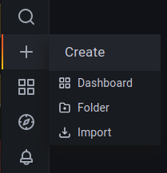

.. _monitoring-grafana_dashboard-page:

Grafana dashboard
=================

After :ref:`enabling and configuring metrics <monitoring-getting_started>`, you can visualise them using Tarantool Grafana dashboards.
These dashboards are available as part of
`Grafana official & community-built dashboards <https://grafana.com/grafana/dashboards>`_:

..  container:: table

    ..  list-table::
        :widths: 50 50
        :header-rows: 0

        *   -   Tarantool 3
            -   `Prometheus <https://grafana.com/grafana/dashboards/21474>`_, `InfluxDB <https://grafana.com/grafana/dashboards/21484>`_

        *   -   Tarantool Cartridge and Tarantool 1.10—2.x
            -   `Prometheus <https://grafana.com/grafana/dashboards/13054>`_, `InfluxDB <https://grafana.com/grafana/dashboards/12567>`_

        *   -   Tarantool Data Grid 2
            -   `Prometheus <https://grafana.com/grafana/dashboards/16406>`_, `InfluxDB <https://grafana.com/grafana/dashboards/16405>`_

The Tarantool Grafana dashboard is a ready for import template with basic memory,
space operations, and HTTP load panels, based on default `metrics <https://github.com/tarantool/metrics>`_
package functionality.

.. image:: images/Prometheus_dashboard_1.png
   :width: 30%

.. image:: images/Prometheus_dashboard_2.png
   :width: 30%

.. image:: images/Prometheus_dashboard_3.png
   :width: 30%

.. _monitoring-grafana_dashboard-monitoring_stack:

Prepare a monitoring stack
--------------------------

Since there are Prometheus and InfluxDB data source Grafana dashboards,
you can use one of the following:

- `Telegraf <https://www.influxdata.com/time-series-platform/telegraf/>`_
  as a server agent for collecting metrics, `InfluxDB <https://www.influxdata.com/>`_
  as a time series database for storing metrics, and `Grafana <https://grafana.com/>`_
  as a visualization platform.
- `Prometheus <https://prometheus.io/>`_ as both a server agent for collecting metrics
  and a time series database for storing metrics, and `Grafana <https://grafana.com/>`_
  as a visualization platform.

For issues related to setting up Prometheus, Telegraf, InfluxDB, or Grafana instances, refer to the corresponding project's documentation.

.. _monitoring-grafana_dashboard-collect_metrics:

Collect metrics with server agents
----------------------------------

.. _monitoring-grafana_dashboard-collect_metrics_prometheus:

Prometheus
~~~~~~~~~~

To collect metrics for Prometheus, first set up metrics output with ``prometheus`` format.
You can use the :ref:`roles.metrics-export <monitoring_exposing_metrics>` configuration or set up the :ref:`Prometheus plugin <metrics-prometheus-api_reference>` manually.
To start collecting metrics, `add a job <https://prometheus.io/docs/prometheus/latest/getting_started/#configure-prometheus-to-monitor-the-sample-targets>`_
to Prometheus configuration with each Tarantool instance URI as a target and
metrics path as it was configured on Tarantool instances:

..  literalinclude:: /code_snippets/snippets/sharding/instances.enabled/sharded_cluster_crud_metrics/prometheus/prometheus.yml
    :language: yaml
    :dedent:

.. _monitoring-grafana_dashboard-collect_metrics_influxdb:

InfluxDB
~~~~~~~~

To collect metrics for InfluxDB, use the Telegraf agent.
First off, configure Tarantool metrics output in ``json`` format
with :ref:`roles.metrics-export <monitoring_exposing_metrics>` configuration or corresponding :ref:`JSON plugin <metrics-json-api_reference>`.
To start collecting metrics, add `http input <https://github.com/influxdata/telegraf/blob/master/plugins/inputs/http/README.md>`_
to Telegraf configuration including each Tarantool instance metrics URL:

..  code-block:: toml

    [[inputs.http]]
        urls = [
            "http://example_project:8081/metrics/json",
            "http://example_project:8082/metrics/json",
            "http://example_project:8083/metrics/json",
            "http://example_project:8084/metrics/json",
            "http://example_project:8085/metrics/json"
        ]
        timeout = "30s"
        tag_keys = [
            "metric_name",
            "label_pairs_alias",
            "label_pairs_quantile",
            "label_pairs_path",
            "label_pairs_method",
            "label_pairs_status",
            "label_pairs_operation",
            "label_pairs_level",
            "label_pairs_id",
            "label_pairs_engine",
            "label_pairs_name",
            "label_pairs_index_name",
            "label_pairs_delta",
            "label_pairs_stream",
            "label_pairs_thread",
            "label_pairs_kind"
        ]
        insecure_skip_verify = true
        interval = "10s"
        data_format = "json"
        name_prefix = "tarantool_"
        fieldpass = ["value"]

Be sure to include each label key as ``label_pairs_<key>`` to extract it
with the plugin.
For example, if you use :code:`{ state = 'ready' }` labels somewhere in metric collectors, add ``label_pairs_state`` tag key.

.. _monitoring-grafana_dashboard-import:

Import the dashboard
--------------------

Open Grafana import menu.

To import a specific dashboard, choose one of the following options:

- paste the dashboard id (``21474`` for Prometheus dashboard, ``21484`` for InfluxDB dashboard)
- paste a link to the dashboard (https://grafana.com/grafana/dashboards/21474 for Prometheus dashboard, https://grafana.com/grafana/dashboards/21484 for InfluxDB dashboard)
- paste the dashboard JSON file contents
- upload the dashboard JSON file

Set dashboard name, folder and uid (if needed).

..  image:: images/grafana_import_setup.png
    :align: left

You can choose the data source and data source variables after import.

..  image:: images/grafana_variables_setup.png
    :align: left

.. _monitoring-grafana_dashboard-troubleshooting:

Troubleshooting
---------------

-   If there are no data on the graphs, make sure that you picked datasource and job/measurement correctly.

-   If there are no data on the graphs, make sure that you have ``info`` group of Tarantool metrics
    (in particular, ``tnt_info_uptime``).

-   If some Prometheus graphs show no data because of ``parse error: missing unit character in duration``,
    ensure that you use Grafana 7.2 or newer.

-   If some Prometheus graphs display ``parse error: bad duration syntax "1m0"`` or similar error, you need
    to update your Prometheus version. See
    `grafana/grafana#44542 <https://github.com/grafana/grafana/issues/44542>`_ for more details.
