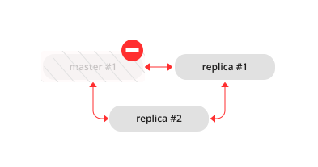

.. _replication-recover:

Recovering from a degraded state
================================

"Degraded state" is a situation when the master becomes unavailable -- due to
hardware or network failure, or due to a programming bug.

-   In a master-replica set with :ref:`manual failover <replication-master_replica_bootstrap>`, if a master disappears, error messages appear on the
    replicas stating that the connection is lost:

    .. code-block:: console

        2023-12-04 13:19:04.724 [16755] main/110/applier/replicator@127.0.0.1:3301 I> can't read row
        2023-12-04 13:19:04.724 [16755] main/110/applier/replicator@127.0.0.1:3301 coio.c:349 E> SocketError: unexpected EOF when reading from socket, called on fd 19, aka 127.0.0.1:55932, peer of 127.0.0.1:3301: Broken pipe
        2023-12-04 13:19:04.724 [16755] main/110/applier/replicator@127.0.0.1:3301 I> will retry every 1.00 second
        2023-12-04 13:19:04.724 [16755] relay/127.0.0.1:55940/101/main coio.c:349 E> SocketError: unexpected EOF when reading from socket, called on fd 23, aka 127.0.0.1:3302, peer of 127.0.0.1:55940: Broken pipe
        2023-12-04 13:19:04.724 [16755] relay/127.0.0.1:55940/101/main I> exiting the relay loop

-   In a master-replica set with :ref:`automated failover <replication-bootstrap-auto>`, a log also includes Raft messages showing the process of a new master's election:

    .. code-block:: console

        2023-12-04 13:16:56.340 [16615] main/111/applier/replicator@127.0.0.1:3302 I> can't read row
        2023-12-04 13:16:56.340 [16615] main/111/applier/replicator@127.0.0.1:3302 coio.c:349 E> SocketError: unexpected EOF when reading from socket, called on fd 24, aka 127.0.0.1:55687, peer of 127.0.0.1:3302: Broken pipe
        2023-12-04 13:16:56.340 [16615] main/111/applier/replicator@127.0.0.1:3302 I> will retry every 1.00 second
        2023-12-04 13:16:56.340 [16615] relay/127.0.0.1:55695/101/main coio.c:349 E> SocketError: unexpected EOF when reading from socket, called on fd 25, aka 127.0.0.1:3301, peer of 127.0.0.1:55695: Broken pipe
        2023-12-04 13:16:56.340 [16615] relay/127.0.0.1:55695/101/main I> exiting the relay loop
        2023-12-04 13:16:59.690 [16615] main/112/applier/replicator@127.0.0.1:3303 I> RAFT: message {term: 3, vote: 2, state: candidate, vclock: {1: 9}} from 2
        2023-12-04 13:16:59.690 [16615] main/112/applier/replicator@127.0.0.1:3303 I> RAFT: received a newer term from 2
        2023-12-04 13:16:59.690 [16615] main/112/applier/replicator@127.0.0.1:3303 I> RAFT: bump term to 3, follow
        2023-12-04 13:16:59.690 [16615] main/112/applier/replicator@127.0.0.1:3303 I> RAFT: vote for 2, follow
        2023-12-04 13:16:59.691 [16615] main/119/raft_worker I> RAFT: persisted state {term: 3}
        2023-12-04 13:16:59.691 [16615] main/119/raft_worker I> RAFT: persisted state {term: 3, vote: 2}
        2023-12-04 13:16:59.691 [16615] main/112/applier/replicator@127.0.0.1:3303 I> RAFT: message {term: 3, vote: 2, leader: 2, state: leader} from 2
        2023-12-04 13:16:59.691 [16615] main/112/applier/replicator@127.0.0.1:3303 I> RAFT: vote request is skipped - this is a notification about a vote for a third node, not a request
        2023-12-04 13:16:59.691 [16615] main/112/applier/replicator@127.0.0.1:3303 I> RAFT: leader is 2, follow

The master's upstream status is reported as ``disconnected`` when executing :ref:`box.info.replication <replication-monitoring>` on a replica:

..  include:: /platform/replication/replication_tutorials/repl_bootstrap.rst
    :start-after: box_info_replication_auto_leader_disconnected_start
    :end-before: box_info_replication_auto_leader_disconnected_end

To learn how to perform manual failover in a master-replica set, see the :ref:`Performing manual failover <replication-controlled_failover>` section.

In a master-replica configuration with automated failover, a new master should be elected :ref:`automatically <replication-automated-failover-testing>`.
