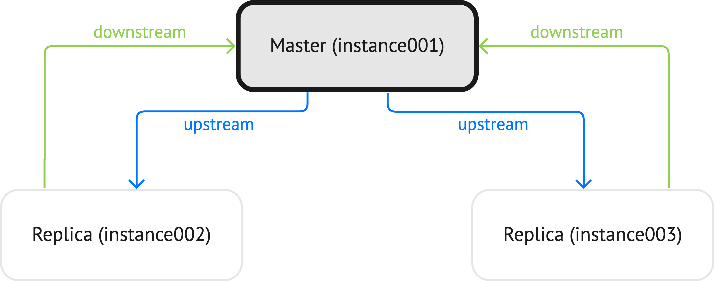

.. _replication-monitoring:

Monitoring a replica set
========================

To learn what instances belong to the replica set and obtain statistics for all
these instances, execute a :ref:`box.info.replication <box_info_replication>` request.
The output below shows the replication status for a replica set containing one :ref:`master and two replicas <replication-master_replica_bootstrap>`:

..  include:: /how-to/replication/repl_bootstrap.rst
    :start-after: box_info_replication_manual_leader_start
    :end-before: box_info_replication_manual_leader_end

The following diagram illustrates the ``upstream`` and ``downstream`` connections if ``box.info.replication`` executed at the master instance (``instance001``):

If ``box.info.replication`` is executed on ``instance002``, the ``upstream`` and ``downstream`` connections look as follows:

This means that statistics for replicas are given in regard to the instance on which ``box.info.replication`` is executed.

The primary indicators of replication health are:

..  _heartbeat:

*   :ref:`idle <box_info_replication_upstream_idle>`: the time (in seconds) since
    the instance received the last event from a master.

    If the master has no updates to send to the replicas, it sends heartbeat messages
    every :ref:`replication_timeout <cfg_replication-replication_timeout>` seconds. The master
    is programmed to disconnect if it does not see acknowledgments of the heartbeat messages
    within ``replication_timeout`` * 4 seconds.

    Therefore, in a healthy replication setup, ``idle`` should never exceed
    ``replication_timeout``: if it does, either the replication is lagging
    seriously behind, because the master is running ahead of the replica, or the
    network link between the instances is down.

*   :ref:`lag <box_info_replication_upstream_lag>`: the time difference between
    the local time at the instance, recorded when the event was received, and the
    local time at another master recorded when the event was written to the
    :ref:`write-ahead log <internals-wal>` on that master.

    Since the ``lag`` calculation uses the operating system clocks from two different
    machines, do not be surprised if it’s negative: a time drift may lead to the
    remote master clock being consistently behind the local instance's clock.

    For a :ref:`master-master <replication-bootstrap-master-master>` configuration, ``lag`` is the maximal lag.
