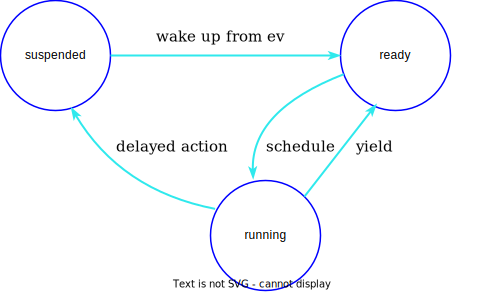

..  _app-yields:

Yields
======

Any live fiber can be in one of three states: ``running``, ``suspended``, and 
``ready``. After a fiber dies, the ``dead`` status returns. By observing 
fibers from the outside, you can only see ``running`` (for the current fiber) 
and ``suspended`` for any other fiber waiting for an event from eventloop (``ev``) 
for execution.

Yield is an action that occurs in a :ref:`cooperative <app-cooperative_multitasking>` environment that 
transfers control of the thread from the current fiber to another fiber that is ready to execute.

After yield has occurred, the next ``ready`` fiber is taken from the queue and executed. 
When there are no more ``ready`` fibers, execution is transferred to the event loop.

After a fiber has yielded and regained control, it immediately issues :ref:`testcancel <fiber-testcancel>`.

There are :ref:`explicit <app-explicit-yields>` and :ref:`implicit <app-implicit-yields>` yields.

..  _app-explicit-yields:

Explicit yields
---------------

**Explicit yield** is clearly visible from the invoking code. There are only two 
explicit yields: :ref:`fiber.yield() <fiber-yield>` and :ref:`fiber.sleep(t) <fiber-sleep>`

:ref:`fiber.yield() <fiber-yield>` yields execution to another ``ready`` fiber while putting itself in the ``ready`` state, 
meaning that it will be executed again as soon as possible while being polite to other fibers 
waiting for execution.

:ref:`fiber.sleep(n) <fiber-sleep>` yields execution to another ``ready`` fiber and puts itself in the ``suspended`` 
state for time ``t`` until time pass and the event loop wakes up that fiber to the ``ready`` state.

In general, it is good behavior for long-running cpu-intensive tasks to yield periodically to 
be :ref:`cooperative <app-cooperative_multitasking>` to other waiting fibers.

..  _app-implicit-yields:

Implicit yields
---------------

On the other hand, there are many operations, such as operations with sockets, file system, 
and disk I/O, which imply some waiting for the current fiber while others can be 
executed. When such an operation occurs, a possible blocking operation would be passed into the 
event loop and the fiber would be suspended until the resource is ready to 
continue fiber execution.

Here is the list of implicitly yielding operations:

*   Connection establishment (:ref:`socket <socket-module>`).

*   Socket read and write (:ref:`socket <socket-module>`).

*   Filesystem operations (from :ref:`fio <fio-section>`).

*   Channel data transfer (:ref:`fiber.channel <fiber-channel>`).

*   File input/output (from :ref:`fio <fio-section>`).

*   Console operations (since console is a socket).

*   HTTP requests (since HTTP is a socket operation).

*   Database modifications (if they imply a disk write).

*   Database reading for the :ref:`vinyl <engines-chapter>` engine.

*   Invocation of another process (:ref:`popen <popen-module>`).

..  note::

    Please note that all operations of ``os`` mosule are non-cooperative and 
    exclusively block the whole tx thread.

For :ref:`memtx <engines-chapter>`, since all data is in memory, there is no yielding for a read requests 
(like ``:select``, ``:pairs``, ``:get``).

For :ref:`vinyl <engines-chapter>`, since some data may not be in memory, there may be disk I/O for a 
read (to fetch data from disk) or write (because a stall may occur while waiting for memory to be freed).

For both :ref:`memtx <engines-chapter>` and :ref:`vinyl <engines-chapter>`, since data change requests 
must be recorded in the :ref:`WAL <internals-wal>`, there is normally a :doc:`/reference/reference_lua/box_txn_management/commit`.

With the default ``autocommit`` mode the following operations are yielding:

*   :ref:`space:alter <box_space-alter>`.

*   :ref:`space:drop <box_space-drop>`.

*   :ref:`space:create_index <box_space-create_index>`.

*   :ref:`space:truncate <box_space-truncate>`.

*   :ref:`space:insert <box_space-insert>`.

*   :ref:`space:replace <box_space-replace>`.

*   :ref:`space:update <box_space-update>`.

*   :ref:`space:upserts <box_space-upsert>`.

*   :ref:`space:delete <box_space-delete>`.

*   :ref:`index:update <box_index-update>`.

*   :ref:`index:delete <box_index-delete>`.

*   :ref:`index:alter <box_index-alter>`.

*   :ref:`index:drop <box_index-drop>`.

*   :ref:`index:rename <box_index-rename>`.

*   :ref:`box.commit <box-commit>` (*if there were some modifications within the transaction*).

To provide atomicity for transactions in transaction mode, some changes are applied to the 
modification operations for the :ref:`memtx <engines-chapter>` engine. After executing
:ref:`box.begin <box-begin>` or within a :ref:`box.atomic <box-atomic>`
call, any modification operation will not yield, and yield will occur only on :ref:`box.commit <box-commit>` or upon return 
from :ref:`box.atomic <box-atomic>`. Meanwhile, :ref:`box.rollback <box-rollback>` does not yield.

That is why executing separate commands like ``select()``, ``insert()``, ``update()`` in the console inside a 
transaction without MVCC will cause it to an abort. This is due to implicit yield after each 
chunk of code is executed in the console.

**Example #1**

*   Engine = memtx.

..  code-block:: memtx

    space:get()
    space:insert()

The sequence has one yield, at the end of the insert, caused by implicit commit; 
``get()`` has nothing to write to the :ref:`WAL <internals-wal>` and so does not yield.

*   Engine = memtx.

..  code-block:: memtx

    box.begin()
    space1:get()
    space1:insert()
    space2:get()
    space2:insert()
    box.commit()

The sequence has one yield, at the end of the ``box.commit``, none of the inserts are yielding.

*   Engine = vinyl.

..  code-block:: vinyl

    space:get()
    space:insert()

The sequence has one to three yields, since ``get()`` may yield if the data is not in the cache, 
``insert()`` may yield if it waits for available memory, and there is an implicit yield 
at commit.

*   Engine = vinyl.

..  code-block:: vinyl

    box.begin()
    space1:get()
    space1:insert()
    space2:get()
    space2:insert()
    box.commit()

The sequence may yield from 1 to 5 times.

**Example #2**

Assume that there are tuples in the :ref:`memtx <engines-chapter>` space ``tester`` where the third field
represents a positive dollar amount. 

Let's start a transaction, withdraw from tuple#1, deposit in tuple#2, and end 
the transaction, making its effects permanent.

..  code-block:: tarantoolsession

    tarantool> function txn_example(from, to, amount_of_money)
             >   box.atomic(function()
             >     box.space.tester:update(from, {{'-', 3, amount_of_money}})
             >     box.space.tester:update(to,   {{'+', 3, amount_of_money}})
             >   end)
             >   return "ok"
             > end
    
    Result:
    ---
    ...
    tarantool> txn_example({999}, {1000}, 1.00)
    ---
    - "ok"
    ...

If :ref:`wal_mode <cfg_binary_logging_snapshots-wal_mode>` = ``none``, then
there is no implicit yielding at the commit time because there are
no writes to the :ref:`WAL <internals-wal>`.

If a request if performed via network connector such as :ref:`net.box <net_box-module>` and implies
sending requests to the server and receiving responses, then it involves network 
I/O and thus implicit yielding. Even if the request that is sent to the server 
has no implicit yield. Therefore, the following sequence causes yields 
three times sequentially when sending requests to the network and awaiting the results.

..  cssclass:: highlight
..  parsed-literal::

    conn.space.test:get{1}
    conn.space.test:get{2}
    conn.space.test:get{3}

..  _app-cooperative_multitasking:

Cooperative multitasking
------------------------

Cooperative multitasking means that unless a running fiber deliberately yields
control, it is not preempted by some other fiber. But a running fiber will
deliberately yield when it encounters a “yield point”: a transaction commit,
an operating system call, or an explicit "yield" request.
Any system call which can block will be performed asynchronously, and any running
fiber which must wait for a system call will be preempted, so that another
ready-to-run fiber takes its place and becomes the new running fiber.

This model makes all programmatic locks unnecessary: cooperative multitasking
ensures that there will be no concurrency around a resource, no race conditions,
and no memory consistency issues. The way to achieve this is simple:
Use no yields, explicit or implicit in critical sections, and no one can 
interfere with code execution.

For small requests, such as simple UPDATE or INSERT or DELETE or 
SELECT, fiber scheduling is fair: it takes little time to process the 
request, schedule a disk write, and yield to a fiber serving the next client.

However, a function may perform complex calculations or be written in
such a way that yields take a long time to occur. This can lead to
unfair scheduling when a single client throttles the rest of the system, or to
apparent stalls in processing requests. It is the responsibility of the function 
author to avoid this situation.