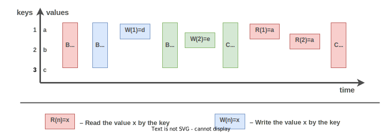

.. _transaction_model:

Transaction model
=================

The transaction model of Tarantool corresponds to the properties ACID 
(atomicity, consistency, isolation, durability).
It allows to use transactions with multiple statements to provide 
**isolation**: each transaction executes in fibers on a single thread, sees consistent database state, 
and commits all changes atomically. Without transactions, any function containing yield points can see 
changes in database state caused by fibers that trigger a preempt.

First important isolation criterion -- *serializable*.
At the :doc:`commit </reference/reference_lua/box_txn_management/commit>` time, all transaction 
changes are written to the WAL (:ref:`Write Ahead Log <internals-wal>`) in a single batch in a 
specific order. Therefore, in Tarantool the 
`transaction isolation level <https://en.wikipedia.org/wiki/Isolation_(database_systems)#Isolation_levels>`_ 
is *serializable* with the clause "if no failure during writing to the WAL". 
In case of such failure, which can occur, for example, when disk space is over, 
the isolation level of the transaction is set to *read uncommitted*.

The use of other transaction modes provides additional levels of transaction isolation.

.. _transaction_model-modes:

Transaction modes
-----------------

Tarantool has 2 modes of transaction behavior:

*   :ref:`Default <txn_mode-default>` -- yields are blocked, there are no parallel transactions and no conflicts.

*   :ref:`MVCC  <txn_mode_transaction-manager>` -- enable the transaction manager, provides parallel transactions, 
    conflicts may happen. You can use this mode on the :ref:`memtx <engines-chapter>` storage engine. 
    The :ref:`vinyl <engines-chapter>` storage engine also supports MVCC mode, but has a different realization.

..  note::

    You can’t mix storage engines in a transaction today.

Using MVСС mode has one more important isolation criterion -- *read committed*.

*Read committed* means that the red transaction cannot see the blue one (value d) 
because it is not yet committed. The red one can see the green one (the value of e), 
because the green transaction is completed.

MVСС can look at the transactions independently and determine the level of isolation, 
or it can do the user itself when the transactions start.

