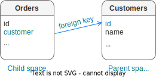

..  _box_data_model:

Data model
==========

This section describes how Tarantool stores values and what operations with data
it supports.

If you tried to create a database as suggested in our
:ref:`"Getting started" exercises <getting_started_db>`,
then your test database now looks like this:

..  image:: data_model.png

..  _index-box_tuple:

Tuples
------

Tarantool operates data in the form of tuples.

..  glossary::

    tuple
        A tuple is a group of data values in Tarantool's memory.
        Think of it as a "database record" or a "row".
        The data values in the tuple are called :term:`fields <field>`.

        When Tarantool returns a tuple value in the console,
        by default, it uses :ref:`YAML <interactive_console>` format,
        for example: ``[3, 'Ace of Base', 1993]``.

        Internally, Tarantool stores tuples as
        `MsgPack <https://en.wikipedia.org/wiki/MessagePack>`_ arrays.

    field
        Fields are distinct data values, contained in a tuple.
        They play the same role as "row columns" or "record fields" in relational databases,
        with a few improvements:

        *   fields can be composite structures, such as arrays or maps,
        *   fields don't need to have names.

        A given tuple may have any number of fields, and the fields may be of
        different :ref:`types <index-box_data-types>`.

        The field's number is the identifier of the field.
        Numbers are counted from base 1 in Lua and other 1-based languages,
        or from base 0 in languages like PHP or C/C++.
        So, ``1`` or ``0`` can be used in some contexts to refer to the first
        field of a tuple.

..  _index-box_space:

Spaces
------

Tarantool stores tuples in containers called spaces.
In the example above, there's a space called ``tester``.

..  glossary::

    space
        In Tarantool, a space is a primary container that stores data.
        It is analogous to tables in relational databases.
        Spaces contain :term:`tuples <tuple>` -- the Tarantool name for
        database records.
        The number of tuples in a space is unlimited.

        At least one space is required to store data with Tarantool.
        Each space has the following attributes:

        *   a unique **name** specified by the user,
        *   a unique **numeric identifier** which can be specified by
            the user, but usually is assigned automatically by Tarantool,
        *   an **engine**: *memtx* (default) --- in-memory engine,
            fast but limited in size, or *vinyl* --- on-disk engine for huge data sets.

        To be functional, a space also needs to have a :ref:`primary index <index-box_index>`.
        It can also have secondary indexes.

..  _index-box_index:

Indexes
-------

Read the full information about indexes on page :doc:`Indexes </book/box/indexes>`.

An **index** is a group of key values and pointers.

As with spaces, you should specify the index **name** and let Tarantool
come up with a unique **numeric identifier** ("index id").

An index always has a **type**. The default index type is :ref:`TREE <indexes-tree>`.
TREE indexes are provided by all Tarantool engines, can index unique and
non-unique values, support partial key searches, comparisons, and ordered results.
Additionally, the memtx engine supports :ref:`HASH <indexes-hash>`,
:ref:`RTREE <indexes-rtree>` and :ref:`BITSET <indexes-bitset>` indexes.

An index may be **multi-part**, that is, you can declare that an index key value
is composed of two or more fields in the tuple, in any order.
For example, for an ordinary TREE index, the maximum number of parts is 255.

An index may be **unique**, that is, you can declare that it would be illegal
to have the same key value twice.

The first index defined on a space is called the **primary key index**,
and it must be unique. All other indexes are called **secondary indexes**,
and they may be non-unique.

..  _index-box_data-types:

Data types
----------

Tarantool is both a database manager and an application server.
Therefore a developer often deals with two type sets:
the types of the programming language (such as Lua) and
the types of the Tarantool storage format (MsgPack).

..  _index-box_lua-vs-msgpack:

Lua versus MsgPack
~~~~~~~~~~~~~~~~~~

..  container:: table

    ..  list-table::
        :widths: 15 30 15 40
        :header-rows: 1

        *   -   Scalar / compound
            -   MsgPack type
            -   Lua type
            -   Example value
        *   -   scalar
            -   nil
            -   `nil`_
            -   ``nil``
        *   -   scalar
            -   boolean
            -   `boolean`_
            -   ``true``
        *   -   scalar
            -   string
            -   `string`_
            -   ``'A B C'``
        *   -   scalar
            -   integer
            -   `number`_
            -   ``12345``
        *   -   scalar
            -   integer
            -   `cdata`_
            -   ``12345``
        *   -   scalar
            -   float64 (double)
            -   `number`_
            -   ``1.2345``
        *   -   scalar
            -   float64 (double)
            -   `cdata`_
            -   ``1.2345``
        *   -   scalar
            -   binary
            -   `cdata`_
            -   ``[!!binary 3t7e]``
        *   -   scalar
            -   ext (for Tarantool ``decimal``)
            -   `cdata`_
            -   ``1.2``
        *   -   scalar
            -   ext (for Tarantool ``datetime``)
            -   `cdata`_
            -   ``'2021-08-20T16:21:25.122999906 Europe/Berlin'``
        *   -   scalar
            -   ext (for Tarantool ``interval``)
            -   `cdata`_
            -   ``+1 months, 1 days``
        *   -   scalar
            -   ext (for Tarantool ``uuid``)
            -   `cdata`_
            -   ``12a34b5c-de67-8f90-123g-h4567ab8901``
        *   -   compound
            -   map
            -   `table`_ (with string keys)
            -   ``{'a': 5, 'b': 6}``
        *   -   compound
            -   array
            -   `table`_ (with integer keys)
            -   ``[1, 2, 3, 4, 5]``
        *   -   compound
            -   array
            -   tuple (`cdata`_)
            -   ``[12345, 'A B C']``

..  note::

    MsgPack values have variable lengths.
    So, for example, the smallest number requires only one byte, but the largest number
    requires nine bytes.

..  _nil: http://www.lua.org/pil/2.1.html
..  _boolean: http://www.lua.org/pil/2.2.html
..  _string: http://www.lua.org/pil/2.4.html
..  _number: http://www.lua.org/pil/2.3.html
..  _table: http://www.lua.org/pil/2.5.html
..  _cdata: http://luajit.org/ext_ffi.html#call

..  _index_box_field_type_details:

Field type details
~~~~~~~~~~~~~~~~~~

..  _index-box_nil:

**nil**. In Lua, the nil type has only one possible value, also called ``nil``.
Tarantool displays it as ``null`` when using the default
:ref:`YAML <interactive_console>` format.
Nil may be compared to values of any types with == (is-equal)
or ~= (is-not-equal), but other comparison operations will not work.
Nil may not be used in Lua tables; the workaround is to use
:ref:`box.NULL <box-null>` because ``nil == box.NULL`` is true.
Example: ``nil``.

..  _index-box_boolean:

**boolean**. A boolean is either ``true`` or ``false``.
Example: ``true``.

..  _index-box_integer:

**integer**. The Tarantool integer type is for integers between
-9223372036854775808 and 18446744073709551615, which is about 18 quintillion.
This type corresponds to the number type in Lua and to the integer type in MsgPack.
Example: ``-2^63``.

..  _index-box_unsigned:

**unsigned**. The Tarantool unsigned type is for integers between
0 and 18446744073709551615. So it is a subset of integer.
Example: ``123456``.

..  _index-box_double:

**double**. The double field type exists
mainly to be equivalent to Tarantool/SQL's
:ref:`DOUBLE data type <sql_data_type_double>`.
In `msgpuck.h <https://github.com/rtsisyk/msgpuck>`_ (Tarantool's interface to MsgPack),
the storage type is ``MP_DOUBLE`` and the size of the encoded value is always 9 bytes.
In Lua, fields of the double type can only contain non-integer numeric values and
cdata values with double floating-point numbers.
Examples: ``1.234``, ``-44``, ``1.447e+44``.

To avoid using the wrong kind of values inadvertently, use
``ffi.cast()`` when searching or changing ``double`` fields.
For example, instead of
:samp:`{space_object}:insert`:code:`{`:samp:`{value}`:code:`}`
use
``ffi = require('ffi') ...``
:samp:`{space_object}:insert`:code:`({ffi.cast('double',`:samp:`{value}`:code:`)})`.
Example:

..  code-block:: tarantoolsession

    s = box.schema.space.create('s', {format = {{'d', 'double'}}})
    s:create_index('ii')
    s:insert({1.1})
    ffi = require('ffi')
    s:insert({ffi.cast('double', 1)})
    s:insert({ffi.cast('double', tonumber('123'))})
    s:select(1.1)
    s:select({ffi.cast('double', 1)})

Arithmetic with cdata ``double`` will not work reliably, so
for Lua, it is better to use the ``number`` type.
This warning does not apply for Tarantool/SQL because
Tarantool/SQL does
:ref:`implicit casting <sql_data_type_conversion>`.

..  _index-box_number:

**number**. The Tarantool number field may have both
integer and floating-point values, although in Lua a ``number``
is a double-precision floating-point.

Tarantool will try to store a Lua number as
floating-point if the value contains a decimal point or is very large
(greater than 100 trillion = 1e14), otherwise Tarantool will store it as an integer.
To ensure that even very large numbers are stored as integers, use the
:ref:`tonumber64 <other-tonumber64>` function, or the LL (Long Long) suffix,
or the ULL (Unsigned Long Long) suffix.
Here are examples of numbers using regular notation, exponential notation,
the ULL suffix and the ``tonumber64`` function:
``-55``, ``-2.7e+20``, ``100000000000000ULL``, ``tonumber64('18446744073709551615')``.

You can also use the ``ffi`` module to specify a C type to cast the number to.
In this case, the number will be stored as `cdata`_.

..  _index-box_decimal:

**decimal**. The Tarantool decimal type is stored as a MsgPack ext (Extension).
Values with the decimal type are not floating-point values although
they may contain decimal points.
They are exact with up to 38 digits of precision.
Example: a value returned by a function in the :ref:`decimal <decimal>` module.

..  _index-box_datetime:

**datetime**. Introduced in :tarantool-release:`2.10.0`.
The Tarantool ``datetime`` type facilitates operations with date and time,
accounting for leap years or the varying number of days in a month.
It is stored as a MsgPack ext (Extension).
Operations with this data type use code from `c-dt <https://github.com/tarantool/c-dt>`_, a third-party library.

For more information, see :doc:`Module datetime </reference/reference_lua/datetime>`.

..  _index-box_interval:

**interval**. Introduced in :tarantool-release:`2.10.0`.
The Tarantool ``interval`` type represents periods of time.
They can be added to or subtracted from ``datetime`` values or each other.
Operations with this data type use code from `c-dt <https://github.com/tarantool/c-dt>`_, a third-party library.

For more information, see :doc:`Module datetime </reference/reference_lua/datetime>`.

..  _index-box_string:

**string**. A string is a variable-length sequence of bytes, usually represented with
alphanumeric characters inside single quotes. In both Lua and MsgPack, strings
are treated as binary data, with no attempts to determine a string's
character set or to perform any string conversion -- unless there is an optional
:ref:`collation <index-collation>`.
So, usually, string sorting and comparison are done byte-by-byte, without any special
collation rules applied.
For example, numbers are ordered by their point on the number line, so 2345 is
greater than 500; meanwhile, strings are ordered by the encoding of the first
byte, then the encoding of the second byte, and so on, so ``'2345'`` is less than ``'500'``.
Example: ``'A, B, C'``.

..  _index-box_bin:

**bin**. A bin (binary) value is not directly supported by Lua but there is
a Tarantool type ``varbinary`` which is encoded as MsgPack binary.
For an (advanced) example showing how to insert varbinary into a database,
see the Cookbook Recipe for :ref:`ffi_varbinary_insert <cookbook-ffi_varbinary_insert>`.
Example: ``"\65 \66 \67"``.

..  _index-box_uuid:

**uuid**. The Tarantool uuid type is used for
:ref:`Universally Unique Identifiers <uuid-module>`.
Since version :doc:`2.4.1 </release/2.4.1>` Tarantool stores
``uuid`` values as a MsgPack ext (Extension).

Example: ``64d22e4d-ac92-4a23-899a-e5934af5479``.

..  _index-box_array:

**array**. An array is represented in Lua with ``{...}`` (`braces <https://www.lua.org/pil/11.1.html>`_).
Examples: lists of numbers representing points in geometric figures:
``{10, 11}``, ``{3, 5, 9, 10}``.

**table**. Lua tables with string keys are stored as MsgPack maps;
Lua tables with integer keys starting with 1 are stored as MsgPack arrays.
Nils may not be used in Lua tables; the workaround is to use
:ref:`box.NULL <box-null>`.
Example: a ``box.space.tester:select()`` request will return a Lua table.

**tuple**. A tuple is a light reference to a MsgPack array stored in the database.
It is a special type (cdata) to avoid conversion to a Lua table on retrieval.
A few functions may return tables with multiple tuples. For tuple examples,
see :ref:`box.tuple <box_tuple>`.

..  _index-box_scalar:

**scalar**. Values in a scalar field can be boolean, integer, unsigned, double,
number, decimal, string, uuid, or varbinary; but not array, map, or tuple.
Examples: ``true``, ``1``, ``'xxx'``.

..  _index-box_any:

**any**. Values in a field of this type can be boolean, integer, unsigned, double,
number, decimal, string, uuid, varbinary, array, map, or tuple.
Examples: ``true``, ``1``, ``'xxx'``, ``{box.NULL, 0}``.

Examples of insert requests with different field types:

..  code-block:: tarantoolsession

    tarantool> box.space.K:insert{1,nil,true,'A B C',12345,1.2345}
    ---
    - [1, null, true, 'A B C', 12345, 1.2345]
    ...
    tarantool> box.space.K:insert{2,{['a']=5,['b']=6}}
    ---
    - [2, {'a': 5, 'b': 6}]
    ...
    tarantool> box.space.K:insert{3,{1,2,3,4,5}}
    ---
    - [3, [1, 2, 3, 4, 5]]
    ...

..  _index-box_indexed-field-types:

Indexed field types
~~~~~~~~~~~~~~~~~~~

Indexes restrict values that Tarantool can store with MsgPack.
This is why, for example, ``'unsigned'`` and ``'integer'`` are different field types,
although in MsgPack they are both stored as integer values.
An ``'unsigned'`` index contains only *non-negative* integer values,
while an ``‘integer’`` index contains *any* integer values.

Here again are the field types described in
:ref:`Field type details <index_box_field_type_details>`, and the index types they can fit in.
The default field type is ``'unsigned'`` and the default index type is TREE.
Although ``'nil'`` is not a legal indexed field type, indexes may contain `nil`
:ref:`as a non-default option <box_space-is_nullable>`.
Full information is in section
:ref:`Details about index field types <details_about_index_field_types>`.

..  container:: table

    ..  list-table::
        :header-rows: 1
        :widths: 34 33 33

        *   -   Field type name string
            -   Field type
            -   Index type
        *   -   ``'boolean'``
            -   :ref:`boolean <index-box_boolean>`
            -   :ref:`boolean <index-box_boolean>`
        *   -   ``'integer'`` (may also be called ``'int'``)
            -   :ref:`integer <index-box_integer>`, which may include unsigned values
            -   TREE or HASH
        *   -   ``'unsigned'`` (may also be called ``'uint'`` or ``'num'``, but ``'num'`` is deprecated)
            -   :ref:`unsigned <index-box_unsigned>`
            -   TREE, BITSET, or HASH
        *   -   ``'double'``
            -   :ref:`double <index-box_double>`
            -   TREE or HASH
        *   -   ``'number'``
            -   :ref:`number <index-box_number>`, which may include
                :ref:`integer <index-box_integer>` or :ref:`double <index-box_double>` values
            -   TREE or HASH
        *   -   ``'decimal'``
            -   :ref:`decimal <index-box_decimal>`
            -   TREE or HASH
        *   -   ``'string'`` (may also be called ``'str'``)
            -   :ref:`string <index-box_string>` 
            -   TREE, BITSET, or HASH
        *   -   ``'varbinary'``
            -   :ref:`varbinary <index-box_bin>`
            -   TREE, HASH, or BITSET (since version 2.7)
        *   -   ``'uuid'``
            -   :ref:`uuid <index-box_uuid>`
            -   TREE or HASH
        *   -   ``datetime``
            -   :ref:`datetime <index-box_datetime>`
            -   TREE
        *   -   ``'array'``
            -   :ref:`array <index-box_array>`
            -   :ref:`RTREE <box_index-rtree>`
        *   -   ``'scalar'``
            -   may include :ref:`nil <index-box_nil>`,
                :ref:`boolean <index-box_boolean>`,       
                :ref:`integer <index-box_integer>`,      
                :ref:`unsigned <index-box_unsigned>`,   
                :ref:`number <index-box_number>`,       
                :ref:`decimal <index-box_decimal>`,     
                :ref:`string <index-box_string>`,      
                :ref:`varbinary <index-box_bin>`,       
                or :ref:`uuid <index-box_uuid>` values                                     |
                |br|
                When a scalar field contains values of   
                different underlying types, the key order 
                is: nils, then booleans, then numbers,  
                then strings, then varbinaries, then   
                uuids.                              
            -   TREE or HASH
     
..  _index-collation:

Collations
----------

By default, when Tarantool compares strings, it uses the so-called
**binary collation**.
It only considers the numeric value of each byte in a string.
For example, the encoding of ``'A'`` (what used to be called the "ASCII value") is 65,
the encoding of ``'B'`` is 66, and the encoding of ``'a'`` is 98.
Therefore, if the string is encoded with ASCII or UTF-8, then ``'A' < 'B' < 'a'``.

Binary collation is the best choice for fast deterministic simple maintenance and searching
with Tarantool indexes.

But if you want the ordering that you see in phone books and dictionaries,
then you need Tarantool's optional collations, such as ``unicode`` and
``unicode_ci``, which allow for ``'a' < 'A' < 'B'`` and ``'a' == 'A' < 'B'``
respectively.

**The unicode and unicode_ci optional collations** use the ordering according to the
`Default Unicode Collation Element Table (DUCET) <http://unicode.org/reports/tr10/#Default_Unicode_Collation_Element_Table>`_
and the rules described in
`Unicode® Technical Standard #10 Unicode Collation Algorithm (UTS #10 UCA) <http://unicode.org/reports/tr10>`_.
The only difference between the two collations is about
`weights <https://unicode.org/reports/tr10/#Weight_Level_Defn>`_:

*   ``unicode`` collation observes L1, L2, and L3 weights (strength = 'tertiary');
*   ``unicode_ci`` collation observes only L1 weights (strength = 'primary'), so for example ``'a' == 'A' == 'á' == 'Á'``.

As an example, take some Russian words:

..  code-block:: text

    'ЕЛЕ'
    'елейный'
    'ёлка'
    'еловый'
    'елозить'
    'Ёлочка'
    'ёлочный'
    'ЕЛь'
    'ель'

...and show the difference in ordering and selecting by index:

*   with ``unicode`` collation:

    ..  code-block:: tarantoolsession

        tarantool> box.space.T:create_index('I', {parts = {{field = 1, type = 'str', collation='unicode'}}})
        ...
        tarantool> box.space.T.index.I:select()
        ---
        - - ['ЕЛЕ']
          - ['елейный']
          - ['ёлка']
          - ['еловый']
          - ['елозить']
          - ['Ёлочка']
          - ['ёлочный']
          - ['ель']
          - ['ЕЛь']
        ...
        tarantool> box.space.T.index.I:select{'ЁлКа'}
        ---
        - []
        ...

*   with ``unicode_ci`` collation:

    ..  code-block:: tarantoolsession

        tarantool> box.space.T:create_index('I', {parts = {{field = 1, type ='str', collation='unicode_ci'}}})
        ...
        tarantool> box.space.T.index.I:select()
        ---
        - - ['ЕЛЕ']
          - ['елейный']
          - ['ёлка']
          - ['еловый']
          - ['елозить']
          - ['Ёлочка']
          - ['ёлочный']
          - ['ЕЛь']
        ...
        tarantool> box.space.T.index.I:select{'ЁлКа'}
        ---
        - - ['ёлка']
        ...

In all, collation involves much more than these simple examples of
upper case / lower case and accented / unaccented equivalence in alphabets.
We also consider variations of the same character, non-alphabetic writing systems,
and special rules that apply for combinations of characters.

For English, Russian, and most other languages and use cases, use the "unicode" and "unicode_ci" collations.
If you need Cyrillic letters 'Е' and 'Ё' to have the same level-1 weights,
try the Kyrgyz collation.

**The tailored optional collations**: for other languages, Tarantool supplies tailored collations for every
modern language that has more than a million native speakers, and
for specialized situations such as the difference between dictionary
order and telephone book order.
Run ``box.space._collation:select()`` to see the complete list.

The tailored collation names have the form
``unicode_[language code]_[strength]``, where language code is a standard
2-character or 3-character language abbreviation, and strength is ``s1``
for "primary strength" (level-1 weights), ``s2`` for "secondary", ``s3`` for "tertiary".
Tarantool uses the same language codes as the ones in the "list of tailorable locales" on man pages of
`Ubuntu <http://manpages.ubuntu.com/manpages/bionic/man3/Unicode::Collate::Locale.3perl.html>`_ and
`Fedora <http://www.polarhome.com/service/man/?qf=Unicode%3A%3ACollate%3A%3ALocale&af=0&tf=2&of=Fedora>`_.
Charts explaining the precise differences from DUCET order are
in the
`Common Language Data Repository <https://unicode.org/cldr/charts/30/collation>`_.

..  _index-constraints:

Constraints
-----------

For better control over stored data, Tarantool supports **constraints** – user-defined
limitations on the values of certain fields or entire tuples. Together with data types,
constraints allow limiting the ranges of available field values both syntactically and semantically.

For example, the field ``age`` typically has the ``number`` type, so it cannot store
strings or boolean values. However, it can still have values that don't make sense,
such as negative numbers. This is where constraints come to help.

..  _index-constraint_types:

Constraint types
~~~~~~~~~~~~~~~~

There are two types of constraints in Tarantool:

*   *Field constraints* check that the value being assigned to a field
    satisfies a given condition. For example, ``age`` must be non-negative.

*   *Tuple constraints* check complex conditions that can involve all fields of
    a tuple. For example, a tuple contains a date in three fields:
    ``year``, ``month``, and ``day``. You can validate ``day`` values based on
    the ``month`` value (and even ``year`` if you consider leap years).

Field constraints work faster, while tuple constraints allow implementing
a wider range of limitations.

..  _index-constraint_functions:

Constraint functions
~~~~~~~~~~~~~~~~~~~~

Constraints use stored Lua functions, which must return ``true`` when the constraint
is satisfied. Other return values (including ``nil``) and exceptions make the
check fail and prevent tuple insertion or modification.

To create a constraint function, use :ref:`func.create with function body <box_schema-func_create_with-body>`.

Constraint functions take two parameters:

*   The field value and the constraint name for field constraints.

    ..  code-block:: tarantoolsession

        tarantool> box.schema.func.create('check_age',
                 > {language = 'LUA', is_deterministic = true, body = 'function(f, c) return (f >= 0 and f < 150) end'})
        ---
        ...

*   The tuple and the constraint name for tuple constraints.

    ..  code-block:: tarantoolsession

        tarantool> box.schema.func.create('check_person',
                 > {language = 'LUA', is_deterministic = true, body = 'function(t, c) return (t.age >= 0 and #(t.name) > 3) end'})
        ---
        ...

..  warning::

    Tarantool doesn't check field names used in tuple constraint functions.
    If a field referenced in a tuple constraint gets renamed, this constraint will break
    and prevent further insertions and modifications in the space.

..  _index-constraint_apply:

Creating constraints
~~~~~~~~~~~~~~~~~~~~

To create a constraint in a space, specify the corresponding function's name
in the ``constraint`` parameter:

*   Field constraints: when setting up the space format:

    ..  code-block:: tarantoolsession

        tarantool> box.space.person:format({
                 > {name = 'id',   type = 'number'},
                 > {name = 'name', type = 'string'},
                 > {name = 'age',  type = 'number', constraint = 'check_age'},
                 > })

*   Tuple constraints: when creating or altering a space:

    ..  code-block:: tarantoolsession

        tarantool> box.schema.space.create('person', { engine = 'memtx', constraint = 'check_tuple'})

In both cases, ``constraint`` can contain multiple function names passed as a tuple.
Each constraint can have an optional name:

..  code-block:: lua

    constraint = {'age_constraint' = 'check_age', 'name_constraint' = 'check_name'}

..  note::

    When adding a constraint to an existing space with data, Tarantool checks it
    against the stored data. If there are fields or tuples that don't satisfy
    the constraint, it won't be applied to the space.

..  _index-box_foreign_keys:

Foreign keys
------------

**Foreign keys** provide links between related spaces, therefore maintaining the
`referential integrity <https://en.wikipedia.org/wiki/Referential_integrity>`_
of the database.

Some fields can only contain values present in other spaces. For example,
shop orders always belong to existing customers. Hence, all values of the ``customer``
field of the ``orders`` space must exist in the ``customers`` space. In this case,
``customers`` is a **parent space** for ``orders`` (its **child space**). When two
spaces are linked with a foreign key, each time a tuple is inserted or modified
in the child space, Tarantool checks that a corresponding value is present in
the parent space.

Foreign key types
~~~~~~~~~~~~~~~~~

There are two types of foreign keys in Tarantool:

*   *Field foreign keys* check that the value being assigned to a field
    is present in a particular field of another space. For example, the ``customer``
    value in a tuple from the ``orders`` space must match an ``id`` stored in the ``customers`` space.

*   *Tuple foreign keys* check that multiple fields of a tuple have a match in
    another space. For example, if the ``orders`` space has fields ``customer_id``
    and ``customer_name``, a tuple foreign key can check that the ``customers`` space
    contains a tuple with both these values in the corresponding fields.

Field foreign keys work faster while tuple foreign keys allow implementing
more strict references.

Creating foreign keys
~~~~~~~~~~~~~~~~~~~~~

..  important::

    For each foreign key, there must exist an index that includes all its fields.

To create a foreign key in a space, specify the parent space and linked fields in the ``foreign_key`` parameter.
Fields can be referenced by name or by number:

*   Field foreign keys: when setting up the space format.

    ..  code-block:: tarantoolsession

        tarantool> box.space.orders:format({
                 > {name = 'id',   type = 'number'},
                 > {name = 'customer_id', foreign_key = {space = 'customers', field = 'id'}}, -- or field = 1
                 > {name = 'price_total',  type = 'number'},
                 > })

*   Tuple foreign keys: when creating or altering a space. Note that for foreign
    keys with multiple fields there must exist an index that includes all these fields.

  ..  code-block:: tarantoolsession

      tarantool> box.schema.space.create("orders", {foreign_key={space='customers', field={customer_id='id', customer_name='name'}}})
      ---
      ...
      tarantool> box.space.orders:format({
               > {name = "id", type = "number"},
               > {name = "customer_id" },
               > {name = "customer_name"},
               > {name = "price_total",    type = "number"},
               > })

..  note::

    Type can be omitted for foreign key fields because it's
    defined in the parent space.

Foreign keys can have an optional name.

..  code-block:: lua

    foreign_key = {customer = {space = '...', field = {...}}}

A space can have multiple tuple foreign keys. In this case, they all must have names.

..  code-block:: lua

    foreign_key = {customer = {space = '...', field = {...} }, item = { space = '...', field = {...}}}

Tarantool performs integrity checks upon data modifications in parent spaces.
If you try to remove a tuple referenced by a foreign key or an entire parent space,
you will get an error.

..  important::

    Renaming parent spaces or referenced fields may break the corresponding foreign
    keys and prevent further insertions or modifications in the child spaces.

..  _index-box_sequence:

Sequences
---------

A **sequence** is a generator of ordered integer values.

As with spaces and indexes, you should specify the sequence **name** and let
Tarantool generate a unique numeric identifier (sequence ID).

As well, you can specify several options when creating a new sequence.
The options determine what value will be generated whenever the sequence is used.

..  _index-box_sequence-options:

Options for box.schema.sequence.create()
~~~~~~~~~~~~~~~~~~~~~~~~~~~~~~~~~~~~~~~~

..  container:: table

    ..  list-table::
        :widths: 20 40 15 25
        :header-rows: 1

        *   -   Option name
            -   Type and meaning
            -   Default
            -   Examples
        *   -   ``start``
            -   Integer. The value to generate the first time a sequence is used
            -   1
            -   ``start=0``
        *   -   ``min``
            -   Integer. Values smaller than this cannot be generated
            -   1
            -   ``min=-1000``
        *   -   ``max``
            -   Integer. Values larger than this cannot be generated
            -   9223372036854775807
            -   ``max=0``
        *   -   ``cycle``
            -   Boolean. Whether to start again when values cannot be generated
            -   false
            -   ``cycle=true``
        *   -   ``cache``
            -   Integer. The number of values to store in a cache
            -   0
            -   ``cache=0``
        *   -   ``step``
            -   Integer. What to add to the previous generated value, when generating a new value
            -   1
            -   ``step=-1``
        *   -   ``if_not_exists``
            -   Boolean. If this is true and a sequence with this name exists already,
                ignore other options and use the existing values
            -   ``false``
            -   ``if_not_exists=true``

Once a sequence exists, it can be altered, dropped, reset, forced to generate
the next value, or associated with an index.

For an initial example, we generate a sequence named 'S'.

..  code-block:: tarantoolsession

    tarantool> box.schema.sequence.create('S',{min=5, start=5})
    ---
    - step: 1
      id: 5
      min: 5
      cache: 0
      uid: 1
      max: 9223372036854775807
      cycle: false
      name: S
      start: 5
    ...

The result shows that the new sequence has all default values,
except for the two that were specified, ``min`` and ``start``.

Then we get the next value, with the ``next()`` function.

..  code-block:: tarantoolsession

    tarantool> box.sequence.S:next()
    ---
    - 5
    ...

The result is the same as the start value. If we called ``next()``
again, we would get 6 (because the previous value plus the
step value is 6), and so on.

Then we create a new table and specify that its primary key should be
generated from the sequence.

..  code-block:: tarantoolsession

    tarantool> s=box.schema.space.create('T')
    ---
    ...
    tarantool> s:create_index('I',{sequence='S'})
    ---
    - parts:
      - type: unsigned
        is_nullable: false
        fieldno: 1
      sequence_id: 1
      id: 0
      space_id: 520
      unique: true
      type: TREE
      sequence_fieldno: 1
      name: I
    ...
    ---
    ...

Then we insert a tuple without specifying a value for the primary key.

..  code-block:: tarantoolsession

     tarantool> box.space.T:insert{nil,'other stuff'}
     ---
     - [6, 'other stuff']
     ...

The result is a new tuple where the first field has a value of 6.
This arrangement, where the system automatically generates the
values for a primary key, is sometimes called "auto-incrementing"
or "identity".

For syntax and implementation details, see the reference for
:doc:`box.schema.sequence </reference/reference_lua/box_schema_sequence>`.

..  _index-box_persistence:

Persistence
-----------

To ensure data persistence, Tarantool records updates to the database in the so-called
:ref:`write-ahead log (WAL) <internals-wal>` files.
When a power outage occurs or the Tarantool instance is killed incidentally,
the in-memory database is lost.
In such case, Tarantool restores the data from WAL files
by reading them and redoing the requests.
This is called the "recovery process".
You can change the timing of the WAL writer or turn it off by setting
the :ref:`wal_mode <cfg_binary_logging_snapshots-wal_mode>`.

Tarantool also maintains a set of :ref:`snapshot files <internals-snapshot>`.
These files contain an on-disk copy of the entire data set for a given moment.
Instead of reading every WAL file since the databases were created, the recovery
process can load the latest snapshot file and then read the WAL files,
produced after the snapshot file was made.
After creating a new snapshot, the earlier WAL files can be removed to free up space.

To force immediate creation of a snapshot file, use the
:doc:`box.snapshot() </reference/reference_lua/box_snapshot>` function.
To enable the automatic creation of snapshot files, use Tarantool's
:ref:`checkpoint daemon <book_cfg_checkpoint_daemon>`.
The checkpoint daemon sets intervals for forced checkpoints. It makes sure that the states
of both memtx and vinyl storage engines are synchronized and saved to disk,
and automatically removes earlier WAL files.

Snapshot files can be created even if there is no WAL file.

..  NOTE::

     The memtx engine makes only regular checkpoints with the interval set in
     :ref:`checkpoint daemon <book_cfg_checkpoint_daemon>` configuration.

     The vinyl engine runs checkpointing in the background at all times.

See the :ref:`Internals <internals-data_persistence>` section for more details
about the WAL writer and the recovery process.

.. _index-box_operations:

Operations
----------

.. _index-box_data-operations:

Data operations
~~~~~~~~~~~~~~~

The basic data operations supported in Tarantool are:

*   five data-manipulation operations (INSERT, UPDATE, UPSERT, DELETE, REPLACE), and
*   one data-retrieval operation (SELECT).

All of them are implemented as functions in :ref:`box.space <box_space>` submodule.

**Examples:**

*   :ref:`INSERT <box_space-insert>`: Add a new tuple to space 'tester'.

    The first field, field[1], will be 999 (MsgPack type is `integer`).

    The second field, field[2], will be 'Taranto' (MsgPack type is `string`).

    ..  code-block:: tarantoolsession

        tarantool> box.space.tester:insert{999, 'Taranto'}

*   :ref:`UPDATE <box_space-update>`: Update the tuple, changing field field[2].

    The clause "{999}", which has the value to look up in the index of the tuple's
    primary-key field, is mandatory, because ``update()`` requests must always have
    a clause that specifies a unique key, which in this case is field[1].

    The clause "{{'=', 2, 'Tarantino'}}" specifies that assignment will happen to
    field[2] with the new value.

    ..  code-block:: tarantoolsession

        tarantool> box.space.tester:update({999}, {{'=', 2, 'Tarantino'}})

*   :ref:`UPSERT <box_space-upsert>`: Upsert the tuple, changing field field[2]
    again.

    The syntax of ``upsert()`` is similar to the syntax of ``update()``. However,
    the execution logic of these two requests is different.
    UPSERT is either UPDATE or INSERT, depending on the database's state.
    Also, UPSERT execution is postponed until after transaction commit, so, unlike
    ``update()``, ``upsert()`` doesn't return data back.

    ..  code-block:: tarantoolsession

        tarantool> box.space.tester:upsert({999, 'Taranted'}, {{'=', 2, 'Tarantism'}})

*   :ref:`REPLACE <box_space-replace>`: Replace the tuple, adding a new field.

    This is also possible with the ``update()`` request, but the ``update()``
    request is usually more complicated.

    ..  code-block:: tarantoolsession

        tarantool> box.space.tester:replace{999, 'Tarantella', 'Tarantula'}

*   :ref:`SELECT <box_space-select>`: Retrieve the tuple.

    The clause "{999}" is still mandatory, although it does not have to mention
    the primary key.

    ..  code-block:: tarantoolsession

        tarantool> box.space.tester:select{999}

*   :ref:`DELETE <box_space-delete>`: Delete the tuple.

    In this example, we identify the primary-key field.

    ..  code-block:: tarantoolsession

        tarantool> box.space.tester:delete{999}

Summarizing the examples:

*   Functions ``insert`` and ``replace`` accept a tuple
    (where a primary key comes as part of the tuple).
*   Function ``upsert`` accepts a tuple
    (where a primary key comes as part of the tuple),
    and also the update operations to execute.
*   Function ``delete`` accepts a full key of any unique index
    (primary or secondary).
*   Function ``update`` accepts a full key of any unique index
    (primary or secondary),
    and also the operations to execute.
*   Function ``select`` accepts any key: primary/secondary, unique/non-unique,
    full/partial.

See reference on ``box.space`` for more
:ref:`details on using data operations <box_space-operations-detailed-examples>`.

..  NOTE::

    Besides Lua, you can use
    :ref:`Perl, PHP, Python or other programming language connectors <index-box_connectors>`.
    The client server protocol is open and documented.
    See this :ref:`annotated BNF <box_protocol-iproto_protocol>`.

..  _index-box_complexity-factors:

Complexity factors
~~~~~~~~~~~~~~~~~~

In reference for :ref:`box.space <box_space>` and
:doc:`/reference/reference_lua/box_index`
submodules, there are notes about which complexity factors might affect the
resource usage of each function.

..  container:: table

    ..  list-table::
        :widths: 20 80
        :header-rows: 1

        *   -   Complexity factor
            -   Effect
        *   -   Index size
            -   The number of index keys is the same as the number    
                of tuples in the data set. For a TREE index, if       
                there are more keys, then the lookup time will be     
                greater, although, of course, the effect is not       
                linear. For a HASH index, if there are more keys,     
                then there is more RAM used, but the number of        
                low-level steps tends to remain constant.             
        *   -   Index type
            -   Typically, a HASH index is faster than a TREE index      
                if the number of tuples in the space is greater          
                than one.                                                
        *   -   Number of indexes accessed
            -   Ordinarily, only one index is accessed to retrieve       
                one tuple. But to update the tuple, there must be N      
                accesses if the space has N different indexes.           
                |br|                                                     
                Note regarding storage engine: Vinyl optimizes away such 
                accesses if secondary index fields are unchanged by      
                the update. So, this complexity factor applies only to  
                memtx, since it always makes a full-tuple copy on every  
                update.
        *   -   Number of tuples accessed
            -   A few requests, for example, SELECT, can retrieve        
                multiple tuples. This factor is usually less             
                important than the others.      
        *   -   WAL settings
            -   The important setting for the write-ahead log is         
                :ref:`wal_mode <cfg_binary_logging_snapshots-wal_mode>`. 
                If the setting causes no writing or                      
                delayed writing, this factor is unimportant. If the      
                setting causes every data-change request to wait         
                for writing to finish on a slow device, this factor      
                is more important than all the others.                   
    

Data schema description
-----------------------

In Tarantool, the use of a data schema is optional.

When creating a :term:`space <space>`, you do not have to define a data schema. In this case,
the tuples store random data. This rule does not apply to indexed fields.
Such fields must contain data of the same type.

You can define a data schema when creating a space. Read more in the description of the
:doc:`/reference/reference_lua/box_schema/space_create` function.
If you have already created a space without specifying a data schema, you can do it later using
:doc:`/reference/reference_lua/box_space/format`.

After the data schema is defined, all the data is validated by type. Before any insert or update,
you will get an error if the data types do not match.

We recommend using a data schema because it helps avoid mistakes.

In Tarantool, you can define a data schema in two different ways.

Data schema description in a code file
~~~~~~~~~~~~~~~~~~~~~~~~~~~~~~~~~~~~~~

The code file is usually called ``init.lua`` and contains the following schema description:

..  code:: lua

    box.cfg()

    users = box.schema.create_space('users', { if_not_exists = true })
    users:format({{ name = 'user_id', type = 'number'}, { name = 'fullname', type = 'string'}})

    users:create_index('pk', { parts = { { field = 'user_id', type = 'number'}}})

This is quite simple: when you run tarantool, it executes this code and creates
a data schema. To run this file, use:

..  code:: bash

    tarantool init.lua

However, it may seem complicated if you do not plan to dive deep into the Lua language and its syntax.

Possible difficulty: the snippet above has a function call with a colon: ``users:format``.
It is used to pass the ``users`` variable as the first argument
of the ``format`` function.
This is similar to ``self`` in object-based languages.

So it might be more convenient for you to describe the data schema with YAML.

..  _data-schema-ddl:

Data schema description using the DDL module
~~~~~~~~~~~~~~~~~~~~~~~~~~~~~~~~~~~~~~~~~~~~

The `DDL module <https://github.com/tarantool/ddl>`_ allows you to describe a data schema
in the YAML format in a declarative way.

The schema would look something like this:

..  code:: yaml

    spaces:
        users:
          engine: memtx
          is_local: false
          temporary: false
          format:
          - {name: user_id, type: uuid, is_nullable: false}
          - {name: fullname, type: string,  is_nullable: false}
          indexes:
          - name: user_id
            unique: true
            parts: [{path: user_id, type: uuid, is_nullable: false}]
            type: HASH

This alternative is simpler to use, and you do not have to dive deep into Lua.

``DDL`` is a built-in 
:doc:`Cartridge </book/cartridge/index>` module.
Cartridge is a cluster solution for Tarantool. In its WebUI, there is a separate tab
called "Schema". On this tab, you can define the schema, check its correctness,
and apply it to the whole cluster.

If you do not use Cartridge, you can still use the DDL module: 
put the following Lua code into the file that you use to run Tarantool.
This file is usually called ``init.lua``.

..  code:: lua

    local yaml = require('yaml')
    local ddl = require('ddl')

    box.cfg{}

    local fh = io.open('ddl.yml', 'r')
    local schema = yaml.decode(fh:read('*all'))
    fh:close()
    local ok, err = ddl.check_schema(schema)
    if not ok then
        print(err)
    end
    local ok, err = ddl.set_schema(schema)
    if not ok then
        print(err)
    end

..  WARNING::

    It is forbidden to modify the data schema in DDL after it has been applied.
    For migration, there are different scenarios described below.

..  _migrations:

Migrations
----------

**Migration** refers to any change in a data schema: adding/removing a field,
creating/dropping an index, changing a field format, etc.

In Tarantool, there are two types of schema migration
that do not require data migration:

-   adding a field to the end of a space

-   creating an index

..  note::

    Check the `Upgrading space schema <https://www.tarantool.io/en/enterprise_doc/space_upgrade/>`__
    section in the Enterprise version. With the help of ``space:upgrade()`` feature,
    you can enable compression and migrate, including already created tuples.

Adding a field to the end of a space
~~~~~~~~~~~~~~~~~~~~~~~~~~~~~~~~~~~~

You can add a field as follows:

..  code:: lua

    local users = box.space.users
    local fmt = users:format()

    table.insert(fmt, { name = 'age', type = 'number', is_nullable = true })
    users:format(fmt)

Note that the field must have the ``is_nullable`` parameter. Otherwise,
an error will occur.

After creating a new field, you probably want to fill it with data.
The `tarantool/moonwalker <https://github.com/tarantool/moonwalker>`_
module is useful for this task.
The README file describes how to work with this module.

Creating an index
~~~~~~~~~~~~~~~~~

Index creation is described in the
:doc:`/reference/reference_lua/box_space/create_index` method.

..  _other-migrations:

Other types of migrations
~~~~~~~~~~~~~~~~~~~~~~~~~

Other types of migrations are also allowed, but it would be more difficult to
maintain data consistency.

Migrations are possible in two cases:

-   When Tarantool starts, and no client uses the database yet

-   During request processing, when active clients are already using the database

For the first case, it is enough to write and test the migration code.
The most difficult task is to migrate data when there are active clients.
You should keep it in mind when you initially design the data schema.

We identify the following problems if there are active clients:

-   Associated data can change atomically.

-   The system should be able to transfer data using both the new schema and the old one.

-   When data is being transferred to a new space, data access should consider
    that the data might be in one space or another.

-   Write requests must not interfere with the migration.
    A common approach is to write according to the new data schema.

These issues may or may not be relevant depending on your application and
its availability requirements.

What you need to know when writing complex migrations
~~~~~~~~~~~~~~~~~~~~~~~~~~~~~~~~~~~~~~~~~~~~~~~~~~~~~

Tarantool has a transaction mechanism. It is useful when writing a migration,
because it allows you to work with the data atomically. But before using
the transaction mechanism, you should explore its limitations.

For details, see the section about :doc:`transactions </book/box/atomic>`.

How you can apply migration
~~~~~~~~~~~~~~~~~~~~~~~~~~~

The migration code is executed on a running Tarantool instance.
Important: no method guarantees you transactional application of migrations
on the whole cluster.

**Method 1**: include migrations in the application code

This is quite simple: when you reload the code, the data is migrated at the right moment,
and the database schema is updated.
However, this method may not work for everyone.
You may not be able to restart Tarantool or update the code using the hot-reload mechanism.

**Method 2**: tarantool/migrations (only for a Tarantool Cartridge cluster)

This method is described in the README file of the
`tarantool/migrations <https://github.com/tarantool/migrations>`_ module.

..  note::

    There are also two other methods that we **do not recommend**,
    but you may find them useful for one reason or another.

    **Method 3**: the ``tarantoolctl`` utility

    The ``tarantoolctl`` utility ships with Tarantool.
    Connect to the necessary instance using ``tarantoolctl connect``.

    ..  code:: console

        $ tarantoolctl connect admin:password@localhost:3301

    -   If your migration is written in a Lua file, you can execute it
        using ``dofile()``. Call this function and specify the path to the
        migration file as the first argument. It looks like this:

        ..  code-block:: tarantoolsession

            tarantool> dofile('0001-delete-space.lua')
            ---
            ...

    -   (or) Copy the migration script code,
        paste it into the console, and run it.

    **Method 4**: applying migration with Ansible

    If you use the `Ansible role  <https://github.com/tarantool/ansible-cartridge>`_
    to deploy a Tarantool cluster, you can use ``eval``.
    You can find more information about it
    `in the Ansible role documentation <https://github.com/tarantool/ansible-cartridge/blob/master/doc/eval.md>`_.
