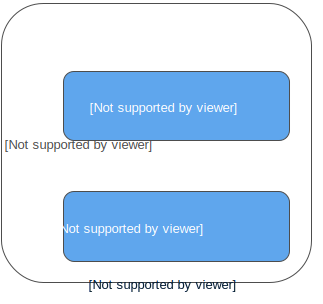

.. _box_data_model:

================================================================================
Data model
================================================================================

This section describes how Tarantool stores values and what operations with data
it supports.

If you tried out the 
:ref:`Starting Tarantool and making your first database <user_guide_getting_started-first_database>`
exercise from "Getting Started", then your database looks like this:

.. _index-box_space:

--------------------------------------------------------------------------------
Space
--------------------------------------------------------------------------------

A **space** -- 'tester' in our example -- is a container.

When Tarantool is being used to store data, there is always at least one space.
Each space has a unique **name** specified by the user.
Besides, each space has a unique **numeric identifier** which can be specified by
the user, but usually is assigned automatically by Tarantool.
Finally, a space always has an **engine**: *memtx* (default) -- in-memory engine,
fast but limited in size, or *vinyl* -- on-disk engine for huge data sets.

A space is a container for :ref:`tuples <index-box_tuple>`.
To be functional, it needs to have a :ref:`primary index <index-box_index>`.
It can also have secondary indexes.

.. _index-box_tuple:

--------------------------------------------------------------------------------
Tuple
--------------------------------------------------------------------------------

A **tuple** plays the same role as a “row” or a “record”, and the components of
a tuple (which we call “fields”) play the same role as a “row column” or
“record field”, except that:

* fields can be composite structures, such as arrays or maps, and
* fields don't need to have names.

Any given tuple may have any number of fields, and the fields may be of
different :ref:`types <index-box_data-types>`.
The identifier of a field is the field's number, base 1
(in Lua and other 1-based languages) or base 0 (in PHP or C/C++).
For example, “1” or "0" can be used in some contexts to refer to the first
field of a tuple.

Tuples in Tarantool are stored as
`MsgPack <https://en.wikipedia.org/wiki/MessagePack>`_ arrays.

When Tarantool returns a tuple value in console, it uses the 
`YAML <https://en.wikipedia.org/wiki/YAML>`_ format,
for example: ``[3, 'Ace of Base', 1993]``.

.. _index-box_index:

--------------------------------------------------------------------------------
Index
--------------------------------------------------------------------------------

An **index** is a group of key values and pointers.

As with spaces, you should specify the index **name**, and let Tarantool
come up with a unique **numeric identifier** ("index id").

An index always has a **type**. The default index type is 'TREE'.
TREE indexes are provided by all Tarantool engines, can index unique and
non-unique values, support partial key searches, comparisons and ordered results.
Additionally, memtx engine supports HASH, RTREE and BITSET indexes.

An index may be **multi-part**, that is, you can declare that an index key value
is composed of two or more fields in the tuple, in any order.
For example, for an ordinary TREE index, the maximum number of parts is 255.

An index may be **unique**, that is, you can declare that it would be illegal
to have the same key value twice.

The first index defined on a space is called the **primary key index**,
and it must be unique. All other indexes are called **secondary indexes**,
and they may be non-unique.

An index definition may include identifiers of tuple fields and their expected
**types** (see allowed :ref:`indexed field types <index-box_indexed-field-types>`
below).

In our example, we first defined the primary index (named 'primary') based on
field #1 of each tuple:

.. code-block:: tarantoolsession

   tarantool> i = s:create_index('primary', {type = 'hash', parts = {1, 'unsigned'}})

The effect is that, for all tuples in space 'tester', field #1 must exist and
must contain an unsigned integer.
The index type is 'hash', so values in field #1 must be unique, because keys
in HASH indexes are unique.

After that, we defined a secondary index (named 'secondary') based on field #2
of each tuple:

.. code-block:: tarantoolsession

   tarantool> i = s:create_index('secondary', {type = 'tree', parts = {2, 'string'}})

The effect is that, for all tuples in space 'tester', field #2 must exist and
must contain a string.
The index type is 'tree', so values in field #2 must not be unique, because keys
in TREE indexes may be non-unique.

.. NOTE::

  Space definitions and index definitions are stored permanently in Tarantool's
  system spaces :ref:`_space <box_space-space>` and :ref:`_index <box_space-index>`
  (for details, see reference on :ref:`box.space <box_space>` submodule).
  
  You can add, drop, or alter the definitions at runtime, with some restrictions.
  See syntax details in reference on :ref:`box <index-box_library>` module.

.. _index-box_data-types:

--------------------------------------------------------------------------------
Data types
--------------------------------------------------------------------------------

Tarantool is both a database and an application server.
Hence a developer often deals with two type sets:
the programming language types (e.g. Lua) and
the types of the Tarantool storage format (MsgPack).

.. _index-box_lua-vs-msgpack:

~~~~~~~~~~~~~~~~~~~~~~~~~~~~~~~~~~~~~~~~~~~~~~~~~~~~~~~~
Lua vs MsgPack
~~~~~~~~~~~~~~~~~~~~~~~~~~~~~~~~~~~~~~~~~~~~~~~~~~~~~~~~

.. container:: table

    .. rst-class:: right-align-column-1
    .. rst-class:: left-align-column-2
    .. rst-class:: left-align-column-3
    .. rst-class:: left-align-column-4

    +-------------------+----------------------+--------------------------------+----------------------------+
    | Scalar / compound | MsgPack |nbsp| type  | Lua type                       | Example value              |
    +===================+======================+================================+============================+
    | scalar            | nil                  | "`nil`_"                       | msgpack.NULL               |
    +-------------------+----------------------+--------------------------------+----------------------------+
    | scalar            | boolean              | "`boolean`_"                   | true                       |
    +-------------------+----------------------+--------------------------------+----------------------------+
    | scalar            | string               | "`string`_"                    | 'A B C'                    |
    +-------------------+----------------------+--------------------------------+----------------------------+
    | scalar            | integer              | "`number`_"                    | 12345                      |
    +-------------------+----------------------+--------------------------------+----------------------------+
    | scalar            | double               | "`number`_"                    | 1,2345                     |
    +-------------------+----------------------+--------------------------------+----------------------------+
    | compound          | map                  | "`table`_" (with string keys)  | table: 0x410f8b10          |
    +-------------------+----------------------+--------------------------------+----------------------------+
    | compound          | array                | "`table`_" (with integer keys) | [1, 2, 3, 4, 5]            |
    +-------------------+----------------------+--------------------------------+----------------------------+
    | compound          | array                | tuple ("`cdata`_")             | [12345, 'A B C']           |
    +-------------------+----------------------+--------------------------------+----------------------------+

.. _nil: http://www.lua.org/pil/2.1.html
.. _boolean: http://www.lua.org/pil/2.2.html
.. _string: http://www.lua.org/pil/2.4.html
.. _number: http://www.lua.org/pil/2.3.html
.. _table: http://www.lua.org/pil/2.5.html
.. _cdata: http://luajit.org/ext_ffi.html#call

In Lua, a **nil** type has only one possible value, also called *nil*
(displayed as **null** on Tarantool's command line, since the output is in the
YAML format).
Nils may be compared to values of any types with == (is-equal)
or ~= (is-not-equal), but other operations will not work.
Nils may not be used in Lua tables; the workaround is to use 
`msgpack.NULL <https://tarantool.org/doc/reference/reference_lua/msgpack.html#msgpack-null>`_.

A **boolean** is either ``true`` or ``false``.

A **string** is a variable-length sequence of bytes, usually represented with
alphanumeric characters inside single quotes. In both Lua and MsgPack, strings
are treated as binary data, with no attempts to determine a string's
character set or to perform any string conversion.
So, string sorting and comparison are done byte-by-byte, without any special
collation rules applied.
(Example: numbers are ordered by their point on the number line, so 2345 is
greater than 500; meanwhile, strings are ordered by the encoding of the first
byte, then the encoding of the second byte, and so on, so '2345' is less than '500'.)

In Lua, a **number** is double-precision floating-point, but Tarantool allows both
integer and floating-point values. Tarantool will try to store a Lua number as
floating-point if the value contains a decimal point or is very large
(greater than 100 billion = 1e14), otherwise Tarantool will store it as an integer.
To ensure that even very large numbers are stored as integers, use the
:ref:`tonumber64 <other-tonumber64>` function, or the LL (Long Long) suffix,
or the ULL (Unsigned Long Long) suffix.
Here are examples of numbers using regular notation, exponential notation,
the ULL suffix and the ``tonumber64`` function:
``-55``, ``-2.7e+20``, ``100000000000000ULL``, ``tonumber64('18446744073709551615')``.

Lua **tables** with string keys are stored as MsgPack maps;
Lua tables with integer keys starting with 1 -- as MsgPack arrays.
Nils may not be used in Lua tables; the workaround is to use
`msgpack.NULL <https://tarantool.org/doc/reference/reference_lua/msgpack.html#msgpack-null>`_.
 
A **tuple** is a light reference to a MsgPack array stored in the database.
It is a special type (cdata) to avoid conversion to a Lua table on retrieval.
A few functions may return tables with multiple tuples. For more tuple examples,
see :ref:`box.tuple <box_tuple>`.

.. NOTE::

   Tarantool uses the MsgPack format for database storage, which is variable-length.
   So, for example, the smallest number requires only one byte, but the largest number
   requires nine bytes.

.. _index-box_indexed-field-types:

~~~~~~~~~~~~~~~~~~~~~~~~~~~~~~~~~~~~~~~~~~~~~~~~~~~~~~~~
Indexed field types
~~~~~~~~~~~~~~~~~~~~~~~~~~~~~~~~~~~~~~~~~~~~~~~~~~~~~~~~

Indexes restrict values which Tarantool's MsgPack may contain. This is why,
for example, 'unsigned' is a separate **indexed field type**, compared to ‘integer’
data type in MsgPack: they both store ‘integer’ values, but an 'unsigned' index
contains only *non-negative* integer values and an ‘integer’ index contains *all*
integer values.

Here's how Tarantool indexed field types correspond to MsgPack data types.

.. container:: table

    .. rst-class:: left-align-column-1
    .. rst-class:: left-align-column-2
    .. rst-class:: left-align-column-3
    .. rst-class:: left-align-column-4
    .. rst-class:: top-align-column-1
              
    +----------------------------+----------------------------------+----------------------+--------------------+
    | Indexed field type         | MsgPack data type |br|           | Index type           | Examples           |
    |                            | (and possible values)            |                      |                    |
    +============================+==================================+======================+====================+
    | **unsigned**               | **integer**                      | TREE, BITSET or HASH | 123456             |
    | (may also be called ‘uint’ | (integer between 0 and           |                      |                    |
    | or ‘num’, but ‘num’ is     | 18446744073709551615, i.e.       |                      |                    |
    | deprecated)                | about 18 quintillion)            |                      |                    |
    +----------------------------+----------------------------------+----------------------+--------------------+
    | **integer**                | **integer**                      | TREE or HASH         | -2^63              |
    | (may also be called ‘int’) | (integer between                 |                      |                    |
    |                            | -9223372036854775808 and         |                      |                    |
    |                            | 18446744073709551615)            |                      |                    |
    +----------------------------+----------------------------------+----------------------+--------------------+
    | **number**                 | **integer**                      | TREE or HASH         | 1.234              |
    |                            | (integer between                 |                      |                    |
    |                            | -9223372036854775808 and         |                      | -44                |
    |                            | 18446744073709551615)            |                      |                    |
    |                            |                                  |                      | 1.447e+44          |
    |                            | **double**                       |                      |                    |
    |                            | (single-precision floating       |                      |                    |
    |                            | point number or double-precision |                      |                    |
    |                            | floating point number)           |                      |                    |
    +----------------------------+----------------------------------+----------------------+--------------------+
    | **string**                 | **string**                       | TREE or HASH         | ‘A B C’            |
    | (may also be called ‘str’) | (any set of octets,              |                      |                    |
    |                            | up to the maximum length)        |                      | ‘\65 \66 \67’      |
    +----------------------------+----------------------------------+----------------------+--------------------+
    | **array**                  | **array**                        | RTREE                | {10, 11}           |
    |                            | (arrays of integers between      |                      |                    |
    |                            | -9223372036854775808 and         |                      | {3, 5, 9, 10}      |
    |                            | 9223372036854775807)             |                      |                    |
    +----------------------------+----------------------------------+----------------------+--------------------+
    | **scalar**                 | **boolean**                      | TREE or HASH         | true               |
    |                            | (true or false)                  |                      |                    |
    |                            |                                  |                      | -1                 |
    |                            | **integer**                      |                      |                    |
    |                            | (integer between                 |                      | 1.234              |
    |                            | -9223372036854775808 and         |                      |                    |
    |                            | 18446744073709551615)            |                      | ‘’                 |
    |                            |                                  |                      |                    |
    |                            | **double**                       |                      | ‘ру’               |
    |                            | (single-precision floating       |                      |                    |
    |                            | point number or double-precision |                      |                    |
    |                            | floating point number)           |                      |                    |
    |                            |                                  |                      |                    |
    |                            | Note:                            |                      |                    |
    |                            | When there is a mix of types,    |                      |                    |
    |                            | the key order is: booleans,      |                      |                    |
    |                            | then numbers, then strings.      |                      |                    |
    +----------------------------+----------------------------------+----------------------+--------------------+

--------------------------------------------------------------------------------
Persistence
--------------------------------------------------------------------------------

In Tarantool, updates to the database are recorded in the so-called
**write ahead log (WAL)** files. This ensures data persistence.
When a power outage occurs or the server is killed incidentally,
the in-memory database is lost. In this situation, WAL files are used
to restore the data. Namely, Tarantool reads the WAL files and redoes
the requests (this is called the "recovery process"). You can change
the timing of the WAL writer, or turn it off, by setting
:ref:`wal_mode <cfg_binary_logging_snapshots-wal_mode>`.

Tarantool also maintains a set of **checkpoint files**. These files contain
an on-disk copy of the entire data set for a given moment. Instead of reading
every WAL file since the databases were created, the recovery process can load
the latest checkpoint file and then read only those WAL files that were produced
after the checkpoint file was made. After checkpointing, old WAL files can be
removed to free up space.

To force immediate creation of a checkpoint, you can use Tarantool's
:ref:`box.snapshot() <admin-snapshot>` request. To enable automatic creation
of checkpoint files, you can use Tarantool's
:ref:`snapshot daemon <book_cfg_snapshot_daemon>`. The snapshot
daemon sets intervals for forced checkpoints. It makes sure that the states
of both memtx and vinyl storage engines are synchronized and saved to disk,
and automatically removes old WAL files.

Checkpoint files can be created even if there is no WAL file.

.. NOTE::

   | The memtx engine makes only forced checkpoints.
   | The vinyl engine runs checkpointing in background at all times.

See the :ref:`Internals <internals-data_persistence>` section for more details
about the WAL writer and the recovery process.

--------------------------------------------------------------------------------
Operations
--------------------------------------------------------------------------------

.. _index-box_data-operations:

~~~~~~~~~~~~~~~~~~~~~~~~~~~~~~~~~~~~~~~~~~~~~~~~~~~~~~~~
Data operations
~~~~~~~~~~~~~~~~~~~~~~~~~~~~~~~~~~~~~~~~~~~~~~~~~~~~~~~~

The basic data operations supported in Tarantool are:

* one data-retrieval operation (SELECT), and
* five data-manipulation operations (INSERT, UPDATE, UPSERT, DELETE, REPLACE).

All of them are implemented as functions in :ref:`box.space <box_space>` submodule.

**Examples**

* INSERT: Add a new tuple to space 'tester'.

  The first field, field[1], will be 999 (MsgPack type is `integer`).
  
  The second field, field[2], will be 'Taranto' (MsgPack type is `string`).

  .. code-block:: tarantoolsession

     tarantool> box.space.tester:insert{999, 'Taranto'}

* UPDATE: Update the tuple, changing field field[2].
  
  The clause "{999}", which has the value to look up in the index of the tuple's
  primary-key field, is mandatory, because ``update()`` requests must always have
  a clause that specifies a unique key, which in this case is field[1].
  
  The clause "{{'=', 2, 'Tarantino'}}" specifies that assignment will happen to
  field[2] with the new value.

  .. code-block:: tarantoolsession
  
     tarantool> box.space.tester:update({999}, {{'=', 2, 'Tarantino'}})

* UPSERT: Upsert the tuple, changing field field[2] again.

  The syntax of ``upsert()`` is similar to the syntax of ``update()``. However,
  the execution logic of these two requests is different.
  UPSERT is either UPDATE or INSERT, depending on the database's state.
  Also, UPSERT execution is postponed after transaction commit, so, unlike
  ``update()``, ``upsert()`` doesn't return data back.

  .. code-block:: tarantoolsession

     tarantool> box.space.tester:upsert({999}, {{'=', 2, 'Tarantism'}})
     
* REPLACE: Replace the tuple, adding a new field.

  This is also possible with the ``update()`` request, but the ``update()``
  request is usually more complicated.

  .. code-block:: tarantoolsession
  
     tarantool> box.space.tester:replace{999, 'Tarantella', 'Tarantula'}

* SELECT: Retrieve the tuple.

  The clause "{999}" is still mandatory, although it does not have to mention the primary key.

  .. code-block:: tarantoolsession
  
     tarantool> box.space.tester:select{999}
* DELETE: Delete the tuple.

  In this example, we identify the primary-key field.

  .. code-block:: tarantoolsession
  
     tarantool> box.space.tester:delete{999}

All the functions operate on tuples and accept only unique key values. So,
the number of tuples in the space is always 0 or 1, since the keys are unique.

Functions ``insert()``, ``upsert()`` and ``replace()`` accept only primary-key values.
Functions ``select()``, ``delete()`` and ``update()`` may accept either a primary-key
value or a secondary-key value.

.. NOTE::

   Besides Lua, you can use 
   :ref:`Perl, PHP, Python or other programming language connectors <index-box_connectors>`.
   The client server protocol is open and documented.
   See this :ref:`annotated BNF <box_protocol-iproto_protocol>`.

~~~~~~~~~~~~~~~~~~~~~~~~~~~~~~~~~~~~~~~~~~~~~~~~~~~~~~~~
Index operations
~~~~~~~~~~~~~~~~~~~~~~~~~~~~~~~~~~~~~~~~~~~~~~~~~~~~~~~~

Index operations are automatic: if a data-manipulation request changes a tuple,
then it also changes the index keys defined for the tuple.

The simple index-creation operation that we've illustrated before is:

.. cssclass:: highlight
.. parsed-literal::

    :samp:`box.space.{space-name}:create_index('{index-name}')`

This creates a unique TREE index on the first field of all tuples
(often called "Field#1"), which is assumed to be numeric.

The simple SELECT request that we've illustrated before is:

.. cssclass:: highlight
.. parsed-literal::

    :extsamp:`box.space.{*{space-name}*}:select({*{value}*})`

This looks for a single tuple via the first index. Since the first index
is always unique, the maximum number of returned tuples will be: one.

The following SELECT variations exist:

1. The search can use comparisons other than equality.

   .. cssclass:: highlight
   .. parsed-literal::

       :extsamp:`box.space.{*{space-name}*}:select(value, {iterator = 'GT'})`

   The comparison operators are LT, LE, EQ, REQ, GE, GT 
   (for "less than", "less than or equal", "equal", "reversed equal",
   "greater than or equal", "greater than" respectively).
   Comparisons make sense if and only if the index type is ‘TREE'.
   
   This type of search may return more than one tuple; if so, the tuples will be
   in descending order by key when the comparison operator is LT or LE or REQ,
   otherwise in ascending order.

2. The search can use a secondary index.

   .. cssclass:: highlight
   .. parsed-literal::

       :extsamp:`box.space.{*{space-name}*}.index.{*{index-name}*}:select(value)`

   For a primary-key search, it is optional to specify an index name.
   For a secondary-key search, it is mandatory.

3. The search may be for some or all key parts.

   .. cssclass:: highlight
   .. parsed-literal::

        -- Suppose an index has two parts
        :samp:`tarantool> box.space.{space-name}.index.{index-name}.parts`
        ---
        - - type: unsigned
            fieldno: 1
          - type: string
            fieldno: 2
        ...
        -- Suppose the space has three tuples
        :samp:`box.space.{space-name}:select()`
        ---
        - - [1, 'A']
          - [1, 'B']
          - [2, '']
        ...

4. The search may be for all fields, using a table for the value:

   .. cssclass:: highlight
   .. parsed-literal::

       :extsamp:`box.space.{*{space-name}*}:select({1, 'A'})`

   or the search can be for one field, using a table or a scalar:

   .. cssclass:: highlight
   .. parsed-literal::

       :samp:`box.space.{space-name}:select(1)`

   In the second case, the result will be two tuples:
   ``{1, 'A'}`` and ``{1, 'B'}``.
   
   You can specify even zero fields, causing all three tuples to be 
   returned. (Notice that partial key searches are available only in TREE indexes.)

**Examples**

* BITSET example:

   .. code-block:: tarantoolsession

      tarantool> box.schema.space.create('bitset_example')
      tarantool> box.space.bitset_example:create_index('primary')
      tarantool> box.space.bitset_example:create_index('bitset',{unique=false,type='BITSET', parts={2,'unsigned'}})
      tarantool> box.space.bitset_example:insert{1,1}
      tarantool> box.space.bitset_example:insert{2,4}
      tarantool> box.space.bitset_example:insert{3,7}
      tarantool> box.space.bitset_example:insert{4,3}
      tarantool> box.space.bitset_example.index.bitset:select(2, {iterator='BITS_ANY_SET'})

   The result will be:

   .. code-block:: tarantoolsession

      ---
      - - [3, 7]
        - [4, 3]
      ...

   because (7 AND 2) is not equal to 0, and (3 AND 2) is not equal to 0.

* RTREE example:

   .. code-block:: tarantoolsession

      tarantool> box.schema.space.create('rtree_example')
      tarantool> box.space.rtree_example:create_index('primary')
      tarantool> box.space.rtree_example:create_index('rtree',{unique=false,type='RTREE', parts={2,'ARRAY'}})
      tarantool> box.space.rtree_example:insert{1, {3, 5, 9, 10}}
      tarantool> box.space.rtree_example:insert{2, {10, 11}}
      tarantool> box.space.rtree_example.index.rtree:select({4, 7, 5, 9}, {iterator = 'GT'})

   The result will be:

   .. code-block:: tarantoolsession

      ---
      - - [1, [3, 5, 9, 10]]
      ...

   because a rectangle whose corners are at coordinates ``4,7,5,9`` is entirely
   within a rectangle whose corners are at coordinates ``3,5,9,10``.

Additionally, there exist :ref:`index iterator operations <box_index-index_pairs>`.
They can only be used with code in Lua and C/C++. Index iterators are for
traversing indexes one key at a time, taking advantage of features that are
specific to an index type, for example evaluating Boolean expressions when
traversing BITSET indexes, or going in descending order when traversing TREE indexes.

See also other index operations like :ref:`alter() <box_index-alter>` and
:ref:`drop() <box_index-drop>` in reference for :ref:`box.index <box_index>` submodule.

~~~~~~~~~~~~~~~~~~~~~~~~~~~~~~~~~~~~~~~~~~~~~~~~~~~~~~~~
Complexity factors
~~~~~~~~~~~~~~~~~~~~~~~~~~~~~~~~~~~~~~~~~~~~~~~~~~~~~~~~

In reference for :ref:`box.space <box_space>` and :ref:`box.index <box_index>`
submodules, there are notes about which complexity factors might affect the
resource usage of each function.

.. container:: table

    .. rst-class:: left-align-column-1
    .. rst-class:: left-align-column-2

    +-------------------+----------------------------------------------------------+
    | Complexity        | Effect                                                   |
    | factor            |                                                          |
    +===================+==========================================================+
    | Index size        | The number of index keys is the same as the number       |
    |                   | of tuples in the data set. For a TREE index, if          |
    |                   | there are more keys, then the lookup time will be        |
    |                   | greater, although of course the effect is not            |
    |                   | linear. For a HASH index, if there are more keys,        |
    |                   | then there is more RAM used, but the number of           |
    |                   | low-level steps tends to remain constant.                |
    +-------------------+----------------------------------------------------------+
    | Index type        | Typically, a HASH index is faster than a TREE index      |
    |                   | if the number of tuples in the space is greater          |
    |                   | than one.                                                |
    +-------------------+----------------------------------------------------------+
    | Number of indexes | Ordinarily, only one index is accessed to retrieve       |
    | accessed          | one tuple. But to update the tuple, there must be N      |
    |                   | accesses if the space has N different indexes.           |
    |                   |                                                          |
    |                   | Note re storage engine: Vinyl optimizes away such        |
    |                   | accesses if secondary index fields are unchanged by      |
    |                   | the update. So, this complexity factor applies only to   |
    |                   | memtx, since it always makes a full-tuple copy on every  |
    |                   | update.                                                  |    
    +-------------------+----------------------------------------------------------+
    | Number of tuples  | A few requests, for example SELECT, can retrieve         |
    | accessed          | multiple tuples. This factor is usually less             |
    |                   | important than the others.                               |
    +-------------------+----------------------------------------------------------+
    | WAL settings      | The important setting for the write-ahead log is         |
    |                   | :ref:`wal_mode <cfg_binary_logging_snapshots-wal_mode>`. |
    |                   | If the setting causes no writing or                      |
    |                   | delayed writing, this factor is unimportant. If the      |
    |                   | setting causes every data-change request to wait         |
    |                   | for writing to finish on a slow device, this factor      |
    |                   | is more important than all the others.                   |
    +-------------------+----------------------------------------------------------+
