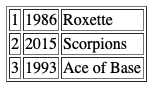

.. _getting_started-using_binary:

================================================================================
Using a binary package
================================================================================

--------------------------------------------------------------------------------
Pre-requisites
--------------------------------------------------------------------------------

The only pre-requisite is to install Tarantool.

We recommend taking an official binary package.
At our `download page <https://www.tarantool.io/en/download/>`_, you'll find
command-line instructions for all supported operating systems.
To download and install the package for your OS, just copy and paste the
instructions to your terminal shell.

.. _getting_started-using_binary_database:

--------------------------------------------------------------------------------
Lesson 1. Your first Tarantool database
--------------------------------------------------------------------------------

~~~~~~~~~~~~~~~~~~~~~~~~~~~~~~~~~~~~~~~~~~~~~~~~~~~~~~~~~~~~~~~~~~~~~~~~~~~~~~~~
Starting Tarantool
~~~~~~~~~~~~~~~~~~~~~~~~~~~~~~~~~~~~~~~~~~~~~~~~~~~~~~~~~~~~~~~~~~~~~~~~~~~~~~~~

To start a Tarantool instance, say this:

.. code-block:: console

    $ # if you downloaded a binary with apt-get or yum, say this:
    $ /usr/bin/tarantool
    $ # if you downloaded and untarred a binary tarball to ~/tarantool, say this:
    $ ~/tarantool/bin/tarantool

Tarantool starts in the interactive mode and displays a prompt:

.. code-block:: tarantoolsession

    tarantool>

Now you can enter requests on the command line.

.. NOTE::

    On production machines, Tarantool's interactive mode is for system
    administration only. But we use it for most examples in this manual,
    because the interactive mode is convenient for learning.

.. _getting_started-using_binary_database_create:

~~~~~~~~~~~~~~~~~~~~~~~~~~~~~~~~~~~~~~~~~~~~~~~~~~~~~~~~~~~~~~~~~~~~~~~~~~~~~~~~
Creating a database
~~~~~~~~~~~~~~~~~~~~~~~~~~~~~~~~~~~~~~~~~~~~~~~~~~~~~~~~~~~~~~~~~~~~~~~~~~~~~~~~

Here is how to create a simple test database after installation.

#. To let Tarantool store data in a separate place, create a new directory
   dedicated for tests:

   .. code-block:: console

      $ mkdir ~/tarantool_sandbox
      $ cd ~/tarantool_sandbox

   You can delete the directory when the tests are over.

#. Check if the default port the database instance will listen to is vacant.

   Depending on the release, during installation Tarantool may start a
   demonstrative global ``example.lua`` instance that listens to the
   ``3301`` port by default. The ``example.lua`` file showcases basic
   configuration and can be found in the ``/etc/tarantool/instances.enabled``
   or ``/etc/tarantool/instances.available`` directories.

   However, we encourage you to perform the instance startup manually, so you
   can learn.

   Make sure the default port is vacant:

   #. To check if the demonstrative instance is running, say:

      .. code-block:: console

         $ lsof -i :3301
         COMMAND    PID USER   FD   TYPE DEVICE SIZE/OFF NODE NAME
         tarantool 6851 root   12u  IPv4  40827      0t0  TCP *:3301 (LISTEN)

   #. If it does, kill the corresponding process. In this example:

      .. code-block:: console

         $ kill 6851

#. To start Tarantool's database module and make the instance accept TCP requests
   on port ``3301``, say:

   .. code-block:: tarantoolsession

      tarantool> box.cfg{listen = 3301}

#. Create the first :ref:`space <index-box_space>` (named ``tester``):

   .. code-block:: tarantoolsession

      tarantool> s = box.schema.space.create('tester')

#. Format the created space by specifying field names and types:

   .. code-block:: tarantoolsession

      tarantool> s:format({
               > {name = 'id', type = 'unsigned'},
               > {name = 'band_name', type = 'string'},
               > {name = 'year', type = 'unsigned'}
               > })

#. Create the first :ref:`index <index-box_index>` (named ``primary``):

   .. code-block:: tarantoolsession

      tarantool> s:create_index('primary', {
               > type = 'hash',
               > parts = {'id'}
               > })

   This is a primary index based on the ``id`` field of each tuple.

#. Insert three :ref:`tuples <index-box_tuple>` (our name for records)
   into the space:

   .. code-block:: tarantoolsession

      tarantool> s:insert{1, 'Roxette', 1986}
      tarantool> s:insert{2, 'Scorpions', 2015}
      tarantool> s:insert{3, 'Ace of Base', 1993}

#. To select a tuple using the ``primary`` index, say:

   .. code-block:: tarantoolsession

      tarantool> s:select{3}

   The terminal screen now looks like this:

   .. code-block:: tarantoolsession

      tarantool> s = box.schema.space.create('tester')
      ---
      ...
      tarantool> s:format({
               > {name = 'id', type = 'unsigned'},
               > {name = 'band_name', type = 'string'},
               > {name = 'year', type = 'unsigned'}
               > })
      ---
      ...
      tarantool> s:create_index('primary', {
               > type = 'hash',
               > parts = {'id'}
               > })
      ---
      - unique: true
        parts:
        - type: unsigned
          is_nullable: false
          fieldno: 1
        id: 0
        space_id: 512
        name: primary
        type: HASH
      ...
      tarantool> s:insert{1, 'Roxette', 1986}
      ---
      - [1, 'Roxette', 1986]
      ...
      tarantool> s:insert{2, 'Scorpions', 2015}
      ---
      - [2, 'Scorpions', 2015]
      ...
      tarantool> s:insert{3, 'Ace of Base', 1993}
      ---
      - [3, 'Ace of Base', 1993]
      ...
      tarantool> s:select{3}
      ---
      - - [3, 'Ace of Base', 1993]
      ...

#. To add a secondary index based on the ``band_name`` field, say:

   .. code-block:: tarantoolsession

      tarantool> s:create_index('secondary', {
               > type = 'hash',
               > parts = {'band_name'}
               > })

#. To select tuples using the ``secondary`` index, say:

   .. code-block:: tarantoolsession

      tarantool> s.index.secondary:select{'Scorpions'}
      ---
      - - [2, 'Scorpions', 2015]
      ...

#. Now, to prepare for the example in the next section, try this:

   .. code-block:: tarantoolsession

      tarantool> box.schema.user.grant('guest', 'read,write,execute', 'universe')

.. _connecting-remotely:

~~~~~~~~~~~~~~~~~~~~~~~~~~~~~~~~~~~~~~~~~~~~~~~~~~~~~~~~~~~~~~~~~~~~~~~~~~~~~~~~
Connecting remotely
~~~~~~~~~~~~~~~~~~~~~~~~~~~~~~~~~~~~~~~~~~~~~~~~~~~~~~~~~~~~~~~~~~~~~~~~~~~~~~~~

In the request ``box.cfg{listen = 3301}`` that we made earlier, the ``listen``
value can be any form of a :ref:`URI <index-uri>` (uniform resource identifier).
In this case, it’s just a local port: port ``3301``. You can send requests to the
listen URI via:

(1) ``telnet``,
(2) a :ref:`connector <index-box_connectors>`,
(3) another instance of Tarantool (using the :ref:`console <console-module>` module), or
(4) :ref:`tarantoolctl <tarantoolctl>` utility.

Let’s try (4).

Switch to another terminal. On Linux, for example, this means starting another
instance of a Bash shell. You can switch to any working directory in the new
terminal, not necessarily to ``~/tarantool_sandbox``.

Start the ``tarantoolctl`` utility:

.. code-block:: console

    $ tarantoolctl connect '3301'

This means "use ``tarantoolctl connect`` to connect to the Tarantool instance
that’s listening on ``localhost:3301``".

Try this request:

.. code-block:: tarantoolsession

    localhost:3301> box.space.tester:select{2}

This means "send a request to that Tarantool instance, and display the result".
The result in this case is one of the tuples that was inserted earlier.
Your terminal screen should now look like this:

.. code-block:: tarantoolsession

    $ tarantoolctl connect 3301
    /usr/local/bin/tarantoolctl: connected to localhost:3301
    localhost:3301> box.space.tester:select{2}
    ---
    - - [2, 'Scorpions', 2015]
    ...

You can repeat ``box.space...:insert{}`` and ``box.space...:select{}``
indefinitely, on either Tarantool instance.

When the testing is over:

* To drop the space: ``s:drop()``
* To stop ``tarantoolctl``: Ctrl+C or Ctrl+D
* To stop Tarantool (an alternative): the standard Lua function
  `os.exit() <http://www.lua.org/manual/5.1/manual.html#pdf-os.exit>`_
* To stop Tarantool (from another terminal): ``sudo pkill -f tarantool``
* To destroy the test: ``rm -r ~/tarantool_sandbox``

--------------------------------------------------------------------------------
Lesson 2. Your first Tarantool application
--------------------------------------------------------------------------------

In this guide, we will develop a simple `Hello world!`
application for Tarantool using the Lua language.

Let’s get started!

Create a project directory:

.. code-block:: console

    $ mkdir myproject
    $ cd myproject

All commands from this tutorial will be executed in this directory.

Install dependencies for our web application:

.. code-block:: console

    $ tarantoolctl rocks install http

Create an empty ``app.lua`` file in the project directory:

.. code-block:: text

    .
    └── myproject
        ├── .rocks
        └── app.lua

The ``.rocks`` folder contains project-specific modules installed with
``tarantoolctl rocks install <module_name>``.

The ``app.lua`` file is an entry point for the application. It will be used for
launching the project with ``tarantool app.lua``

~~~~~~~~~~~~~~~~~~~~~~~~~~~~~~~~~~~~~~~~~~~~~~~~~~~~~~~~~~~~~~~~~~~~~~~~~~~~~~~~
Creating the application
~~~~~~~~~~~~~~~~~~~~~~~~~~~~~~~~~~~~~~~~~~~~~~~~~~~~~~~~~~~~~~~~~~~~~~~~~~~~~~~~

Let's write some Lua code in ``app.lua``.

First, add a shebang line and ``box.cfg{}`` with no parameters for applying
default Tarantool settings:

.. code-block:: lua

    #!/usr/bin/env tarantool

    box.cfg{}

Import and initiate the ``http.server`` and ``http.router`` modules. These two modules
are responsible for serving HTTP requests and routing them to the appropriate handlers.

``httpd:set_router(router)`` connects the router and the server together.

.. code-block:: lua

    #!/usr/bin/env tarantool

    box.cfg{}

    local httpd = require('http.server').new('127.0.0.1', 8080)
    local router = require('http.router').new()
    httpd:set_router(router)

Add ``hello_world_handler`` -- a function which receives a request variable
as argument and returns a text response saying ``Hello world!``.

The ``router:route()`` method connects the URL path to the corresponding handler.
Finally, run the HTTP server with ``httpd:start()``.

.. code-block:: lua

    #!/usr/bin/env tarantool

    box.cfg{}

    local httpd = require('http.server').new('127.0.0.1', 8080)
    local router = require('http.router').new()
    httpd:set_router(router)

    local hello_world_handler = function(req)
        return req:render({text = "Hello world!"})
    end

    router:route({ path = '/', method = 'GET' }, hello_world_handler)

    httpd:start()

~~~~~~~~~~~~~~~~~~~~~~~~~~~~~~~~~~~~~~~~~~~~~~~~~~~~~~~~~~~~~~~~~~~~~~~~~~~~~~~~
Launching the application
~~~~~~~~~~~~~~~~~~~~~~~~~~~~~~~~~~~~~~~~~~~~~~~~~~~~~~~~~~~~~~~~~~~~~~~~~~~~~~~~

Say:

.. code-block:: console

    $ tarantool app.lua

Alternatively, make ``app.lua`` executable:

.. code-block:: console

    $ chmod +x app.lua

and run it:

.. code-block:: console

    $ ./app.lua

After running the application, you will see a similar output:

.. code-block:: console

    2020-01-24 13:45:17.403 [9539] main/102/myapp.lua C> Tarantool 2.3.1-1-g4137134
    2020-01-24 13:45:17.403 [9539] main/102/myapp.lua C> log level 5
    2020-01-24 13:45:17.403 [9539] main/102/myapp.lua I> mapping 268435456 bytes for memtx tuple arena...
    2020-01-24 13:45:17.403 [9539] main/102/myapp.lua I> mapping 134217728 bytes for vinyl tuple arena...
    2020-01-24 13:45:17.404 [9539] main/102/myapp.lua I> instance uuid d816bcf8-c45a-482b-a1ff-1f52b8bad410
    2020-01-24 13:45:17.404 [9539] iproto/101/main I> binary: bound to [::]:3313
    2020-01-24 13:45:17.405 [9539] main/102/myapp.lua I> initializing an empty data directory
    2020-01-24 13:45:17.418 [9539] main/102/myapp.lua I> assigned id 1 to replica d816bcf8-c45a-482b-a1ff-1f52b8bad410
    2020-01-24 13:45:17.418 [9539] main/102/myapp.lua I> cluster uuid 91bd7053-10b3-494f-b04c-37899c569629
    2020-01-24 13:45:17.418 [9539] snapshot/101/main I> saving snapshot `./00000000000000000000.snap.inprogress'
    2020-01-24 13:45:17.420 [9539] snapshot/101/main I> done
    2020-01-24 13:45:17.421 [9539] main/102/myapp.lua I> ready to accept requests
    2020-01-24 13:45:17.421 [9539] main/104/checkpoint_daemon I> scheduled next checkpoint for Fri Jan 24 15:37:33 2020
    2020-01-24 13:45:17.421 [9539] main/102/myapp.lua I> set 'listen' configuration option to "3313"
    2020-01-24 13:45:17.423 [9539] main C> entering the event loop

The last string in the output says that the HTTP server was started successfully.
Now you can bowse to http://127.0.0.1:8080 and see the canonic
``Hello world!`` there.

~~~~~~~~~~~~~~~~~~~~~~~~~~~~~~~~~~~~~~~~~~~~~~~~~~~~~~~~~~~~~~~~~~~~~~~~~~~~~~~~
Pre-populating the database
~~~~~~~~~~~~~~~~~~~~~~~~~~~~~~~~~~~~~~~~~~~~~~~~~~~~~~~~~~~~~~~~~~~~~~~~~~~~~~~~

Let's pre-populate our database with the data from the
:ref:`previous lesson <getting_started-using_binary_database_create>`
so that our web application could use it.
We'll use ``box.once()`` which executes a function only once over your Tarantool
instance life.

Add the following code after ``box.cfg{}`` in ``app.lua``:

.. code-block:: lua

    box.once("bootstrap", function()
         box.schema.space.create('tester')
         box.space.tester:format({
            {name = 'id', type = 'unsigned'},
            {name = 'band_name', type = 'string'},
            {name = 'year', type = 'unsigned'}
        })
        box.space.tester:create_index('primary', {
            type = 'hash',
            parts = {'id'}
        })
        box.space.tester:insert{1, 'Roxette', 1986}
        box.space.tester:insert{2, 'Scorpions', 2015}
        box.space.tester:insert{3, 'Ace of Base', 1993}
    end)

You also need to add a **handler** which will return the music bands from our
pre-populated database, and a corresponding **route**.

.. code-block:: lua

    local function bands_json_handler(req)
        return req:render{ json = {["bands"] = box.space.tester:select{}} }
    end

    router:route({ path = '/bands', method = 'GET' }, bands_json_handler)

Now our application can return pre-populated bands in the JSON format.

Run ``tarantool app.lua`` again and check what's on http://127.0.0.1:8080/bands
-- you'll see this output in your browser:

.. code-block:: console

    {"bands":[[1,"Roxette",1986],[2,"Scorpions",2015],[3,"Ace of Base",1993]]}

Not too human readable. Let's add an HTML template.
Paste this code into ``templates/template.html.lua``:

.. code-block:: lua

    <html>
    <body>
        <table border="1">
            % for i,v in pairs(bands) do
            <tr>
                <td><%= i %></td>
                <td><%= v.year %></td>
                <td><%= v.band_name %></td>
            </tr>
            % end
        </table>
    </body>
    </html>

Then add an appropriate handler and route:

.. code-block:: lua

    local function bands_handler(req)
       return req:render({ bands = box.space.tester:select{} })
    end

    router:route({ path = '/bands_html', method = 'GET', file = 'template.html.lua' }, bands_handler)

~~~~~~~~~~~~~~~~~~~~~~~~~~~~~~~~~~~~~~~~~~~~~~~~~~~~~~~~~~~~~~~~~~~~~~~~~~~~~~~~
Results
~~~~~~~~~~~~~~~~~~~~~~~~~~~~~~~~~~~~~~~~~~~~~~~~~~~~~~~~~~~~~~~~~~~~~~~~~~~~~~~~

As a result, your ``app.lua`` file must contain this code:

.. code-block:: lua

    #!/usr/bin/env tarantool

    box.cfg{}

    box.once("bootstrap", function()
        box.schema.space.create('tester')
        box.space.tester:format({
          {name = 'id', type = 'unsigned'},
          {name = 'band_name', type = 'string'},
          {name = 'year', type = 'unsigned'}
       })
       box.space.tester:create_index('primary', {
          type = 'hash',
          parts = {'id'}
       })
       box.space.tester:insert{1, 'Roxette', 1986}
       box.space.tester:insert{2, 'Scorpions', 2015}
       box.space.tester:insert{3, 'Ace of Base', 1993}
    end)

    local httpd = require('http.server').new('127.0.0.1', 8080)
    local router = require('http.router').new()
    httpd:set_router(router)

    local function hello_world_handler(req)
       return req:render({text = "Hello world!"})
    end

    local function bands_json_handler(req)
        return req:render{ json = {["bands"] = box.space.tester:select{}} }
    end

    local function bands_html_handler(req)
       return req:render({ bands = box.space.tester:select{} })
    end

    router:route({ path = '/', method = 'GET' }, hello_world_handler)
    router:route({ path = '/bands', method = 'GET' }, bands_json_handler)
    router:route({ path = '/bands_html', method = 'GET', file = 'template.html.lua' }, bands_html_handler)

    httpd:start()

If you browse to http://127.0.0.1/bands_html, you'll see the following content:

For more code samples, visit our :ref:`cookbook page <cookbook>`.
