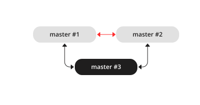

.. _replication-add_instances:

================================================================================
Adding instances
================================================================================

.. _replication-add_replica:

--------------------------------------------------------------------------------
Adding a replica
--------------------------------------------------------------------------------

.. image:: mr-1m-2r-mesh-add.svg
    :align: center

To add a second **replica** instance to the **master-replica** set from our
:ref:`bootstrapping example <replication-master_replica_bootstrap>`, we need an
analog of the instance file that we created for the first replica in that set:

.. code-block:: lua

   -- instance file for replica #2
   box.cfg{
     listen = 3301,
     replication = {'replicator:password@192.168.0.101:3301',  -- master URI
                    'replicator:password@192.168.0.102:3301',  -- replica #1 URI
                    'replicator:password@192.168.0.103:3301'}, -- replica #2 URI
     read_only = true
   }
   box.once("schema", function()
      box.schema.user.create('replicator', {password = 'password'})
      box.schema.user.grant('replicator', 'replication') -- grant replication role
      box.schema.space.create("test")
      box.space.test:create_index("primary")
      print('box.once executed on replica #2')
   end)

Here we add the URI of replica #2 to the :ref:`replication <cfg_replication-replication>`
parameter, so now it contains three URIs.

After we launch the new replica instance, it gets connected to the master
instance and retrieves the master's write-ahead-log and snapshot files:

.. code-block:: console

   $ # launching replica #2
   $ tarantool replica2.lua
   2017-06-14 14:54:33.927 [46945] main/101/replica2.lua C> version 1.7.4-52-g980d30092
   2017-06-14 14:54:33.927 [46945] main/101/replica2.lua C> log level 5
   2017-06-14 14:54:33.928 [46945] main/101/replica2.lua I> mapping 268435456 bytes for tuple arena...
   2017-06-14 14:54:33.930 [46945] main/104/applier/replicator@192.168.0.10 I> remote master is 1.7.4 at 192.168.0.101:3301
   2017-06-14 14:54:33.930 [46945] main/104/applier/replicator@192.168.0.10 I> authenticated
   2017-06-14 14:54:33.930 [46945] main/101/replica2.lua I> bootstrapping replica from 192.168.0.101:3301
   2017-06-14 14:54:33.933 [46945] main/104/applier/replicator@192.168.0.10 I> initial data received
   2017-06-14 14:54:33.933 [46945] main/104/applier/replicator@192.168.0.10 I> final data received
   2017-06-14 14:54:33.934 [46945] snapshot/101/main I> saving snapshot `/var/lib/tarantool/replica2/00000000000000000010.snap.inprogress'
   2017-06-14 14:54:33.934 [46945] snapshot/101/main I> done
   2017-06-14 14:54:33.935 [46945] main/101/replica2.lua I> vinyl checkpoint done
   2017-06-14 14:54:33.935 [46945] main/101/replica2.lua I> ready to accept requests
   2017-06-14 14:54:33.935 [46945] main/101/replica2.lua I> set 'read_only' configuration option to true
   2017-06-14 14:54:33.936 [46945] main C> entering the event loop

Since we are adding a read-only instance, there is no need to dynamically
update the ``replication`` parameter on the other running instances. This update
would be required if we :ref:`added a master instance <replication-add_master>`.

However, we recommend specifying the URI of replica #3 in all instance files of the
replica set. This will keep all the files consistent with each other and with
the current replication topology, and so will help to avoid configuration errors
in case of further configuration updates and replica set restart.

.. _replication-add_master:

--------------------------------------------------------------------------------
Adding a master
--------------------------------------------------------------------------------

To add a third master instance to the **master-master** set from our
:ref:`bootstrapping example <replication-master_master_bootstrap>`, we need an
analog of the instance files that we created to bootstrap the other master
instances in that set:

.. code-block:: lua

   -- instance file for master #3
   box.cfg{
     listen      = 3301,
     replication = {'replicator:password@192.168.0.101:3301',  -- master#1 URI
                    'replicator:password@192.168.0.102:3301',  -- master#2 URI
                    'replicator:password@192.168.0.103:3301'}, -- master#3 URI
     read_only   = true, -- temporarily read-only
   }
   box.once("schema", function()
      box.schema.user.create('replicator', {password = 'password'})
      box.schema.user.grant('replicator', 'replication') -- grant replication role
      box.schema.space.create("test")
      box.space.test:create_index("primary")
   end)

Here we make the following changes:

* Add the URI of master #3 to the :ref:`replication <cfg_replication-replication>`
  parameter.
* Temporarily specify :ref:`read_only=true <cfg_basic-read_only>` to disable
  data-change operations on the instance. After launch, master #3 will act as a
  replica until it retrieves all data from the other masters in the replica set.

After we launch master #3, it gets connected to the other master
instances and retrieves their write-ahead-log and snapshot files:

.. code-block:: console

   $ # launching master #3
   $ tarantool master3.lua
   2017-06-14 17:10:00.556 [47121] main/101/master3.lua C> version 1.7.4-52-g980d30092
   2017-06-14 17:10:00.557 [47121] main/101/master3.lua C> log level 5
   2017-06-14 17:10:00.557 [47121] main/101/master3.lua I> mapping 268435456 bytes for tuple arena...
   2017-06-14 17:10:00.559 [47121] iproto/101/main I> binary: bound to [::]:3301
   2017-06-14 17:10:00.559 [47121] main/104/applier/replicator@192.168.0.10 I> remote master is 1.7.4 at 192.168.0.101:3301
   2017-06-14 17:10:00.559 [47121] main/105/applier/replicator@192.168.0.10 I> remote master is 1.7.4 at 192.168.0.102:3301
   2017-06-14 17:10:00.559 [47121] main/106/applier/replicator@192.168.0.10 I> remote master is 1.7.4 at 192.168.0.103:3301
   2017-06-14 17:10:00.559 [47121] main/105/applier/replicator@192.168.0.10 I> authenticated
   2017-06-14 17:10:00.559 [47121] main/101/master3.lua I> bootstrapping replica from 192.168.0.102:3301
   2017-06-14 17:10:00.562 [47121] main/105/applier/replicator@192.168.0.10 I> initial data received
   2017-06-14 17:10:00.562 [47121] main/105/applier/replicator@192.168.0.10 I> final data received
   2017-06-14 17:10:00.562 [47121] snapshot/101/main I> saving snapshot `/Users/e.shebunyaeva/work/tarantool-test-repl/master3_dir/00000000000000000009.snap.inprogress'
   2017-06-14 17:10:00.562 [47121] snapshot/101/main I> done
   2017-06-14 17:10:00.564 [47121] main/101/master3.lua I> vinyl checkpoint done
   2017-06-14 17:10:00.564 [47121] main/101/master3.lua I> ready to accept requests
   2017-06-14 17:10:00.565 [47121] main/101/master3.lua I> set 'read_only' configuration option to true
   2017-06-14 17:10:00.565 [47121] main C> entering the event loop
   2017-06-14 17:10:00.565 [47121] main/104/applier/replicator@192.168.0.10 I> authenticated

Next, we add the URI of master #3 to the ``replication`` parameter on the existing two
masters. Replication-related parameters are dynamic, so we only need to make a
``box.cfg{}`` request on each of the running instances:

.. code-block:: tarantoolsession

   # adding master #3 URI to replication sources
   tarantool> box.cfg{replication =
            > {'replicator:password@192.168.0.101:3301',
            > 'replicator:password@192.168.0.102:3301',
            > 'replicator:password@192.168.0.103:3301'}}
   ---
   ...

When master #3 catches up with the other masters' state, we can disable
read-only mode for this instance:

.. code-block:: tarantoolsession

   # making master #3 a real master
   tarantool> box.cfg{read_only=false}
   ---
   ...

We also recommend to specify master #3 URI in all instance files in order to
keep all the files consistent with each other and with the current replication
topology.

.. _replication-orphan_status:

--------------------------------------------------------------------------------
Orphan status
--------------------------------------------------------------------------------

Starting with Tarantool version 1.9, there is a change to the
procedure when an instance joins a replica set.
During ``box.cfg()`` the instance will try to join all masters listed
in :ref:`box.cfg.replication <cfg_replication-replication>`.
If the instance does not succeed with at least
the number of masters specified in
:ref:`replication_connect_quorum <cfg_replication-replication_connect_quorum>`,
then it will switch to **orphan status**.
While an instance is in orphan status, it is read-only.

To "join" a master, a replica instance must "connect" to the
master node and then "sync".

"Connect" means contact the master over the physical network
and receive acknowledgment. If there is no acknowledgment after
:ref:`box.replication_connect_timeout <cfg_replication-replication_connect_timeout>`
seconds (usually 4 seconds), and retries fail, then the connect step fails.

"Sync" means receive updates
from the master in order to make a local database copy.
Syncing is complete when the replica has received all the
updates, or at least has received enough updates that the replica's lag
(see
:ref:`replication.upstream.lag <box_info_replication_upstream_lag>`
in ``box.info()``)
is less than or equal to the number of seconds specified in
:ref:`box.cfg.replication_sync_lag <cfg_replication-replication_sync_lag>`.
If ``replication_sync_lag`` is unset (nil) or set to TIMEOUT_INFINITY, then
the replica skips the "sync" state and switches to "follow" immediately.

In order to leave orphan mode you need to sync with a sufficient number
(:ref:`replication_connect_quorum <cfg_replication-replication_connect_quorum>`) of
instances. To do so, you may either:

* Set :ref:`replication_connect_quorum <cfg_replication-replication_connect_quorum>`
  to a lower value.
* Reset ``box.cfg.replication`` to exclude instances that cannot be reached
  or synced with.
* Set ``box.cfg.replication`` to ``""`` (empty string).

The following situations are possible.

.. _replication-leader:

**Situation 1: bootstrap**

Here ``box.cfg{}`` is being called for the first time.
A replica is joining but no replica set exists yet.

    1. Set status to 'orphan'.
    2. Try to connect to all nodes from ``box.cfg.replication``,
       or to the number of nodes required by
       :ref:`replication_connect_quorum <cfg_replication-replication_connect_quorum>`.
       Retrying up to 3 times in 30 seconds is possible because this is bootstrap,
       :ref:`replication_connect_timeout <cfg_replication-replication_connect_timeout>`
       is overridden.

    3. Abort and throw an error if not connected to all nodes in ``box.cfg.replication`` or
       :ref:`replication_connect_quorum <cfg_replication-replication_connect_quorum>`.

    4. This instance might be elected as the replica set 'leader'.
       Criteria for electing a leader include vclock value (largest is best),
       and whether it is read-only or read-write (read-write is best unless there is no other choice).
       The leader is the master that other instances must join.
       The leader is the master that executes :ref:`box_once() <box-once>` functions.

    5. If this instance is elected as the replica set leader,
       then
       perform an "automatic bootstrap":

       a. Set status to 'running'.
       b. Return from ``box.cfg{}``.

       Otherwise this instance will be a replica joining an existing replica set,
       so:

       a. Bootstrap from the leader.
          See examples in section :ref:`Bootstrapping a replica set <replication-bootstrap>`.
       b. In background, sync with all the other nodes in the replication set.

**Situation 2: recovery**

Here ``box.cfg{}`` is not being called for the first time.
It is being called again in order to perform recovery.

    1. Perform :ref:`recovery <internals-recovery_process>` from the last local
       snapshot and the WAL files.

    2. Connect to at least
       :ref:`replication_connect_quorum <cfg_replication-replication_connect_quorum>`
       nodes. If failed -- set status to 'orphan'.
       (Attempts to sync will continue in the background and when/if they succeed
       then 'orphan' will be changed to 'connected'.)

    3. If connected - sync with all connected nodes, until the difference is not more than
       :ref:`replication_sync_lag <cfg_replication-replication_sync_lag>` seconds.

.. _replication-configuration_update:

**Situation 3: configuration update**

Here ``box.cfg{}`` is not being called for the first time.
It is being called again because some replication parameter
or something in the replica set has changed.

    1. Try to connect to all nodes from ``box.cfg.replication``,
       or to the number of nodes required by
       :ref:`replication_connect_quorum <cfg_replication-replication_connect_quorum>`,
       within the time period specified in
       :ref:`replication_connect_timeout <cfg_replication-replication_connect_timeout>`.

    2. Try to sync with the connected nodes,
       within the time period specified in
       :ref:`replication_sync_timeout <cfg_replication-replication_sync_timeout>`.

    3. If earlier steps fail, change status to 'orphan'.
       (Attempts to sync will continue in the background and when/if they succeed
       then 'orphan' status will end.)

    4. If earlier steps succeed, set status to 'running' (master) or 'follow' (replica).

.. _replication-configuration_rebootstrap:

**Situation 4: rebootstrap**

Here ``box.cfg{}`` is not being called. The replica connected successfully
at some point in the past, and is now ready for an update from the master.
But the master cannot provide an update.
This can happen by accident, or more likely can happen because the replica
is slow (its :ref:`lag <cfg_replication-replication_sync_lag>` is large),
and the WAL (.xlog) files containing the
updates have been deleted. This is not crippling. The replica can discard
what it received earlier, and then ask for the master's latest snapshot
(.snap) file contents. Since it is effectively going through the bootstrap
process a second time, this is called "rebootstrapping". However, there has
to be one difference from an ordinary bootstrap -- the replica's
:ref:`replica id <replication-replica-id>` will remain the same.
If it changed, then the master would think that the replica is a
new addition to the cluster, and would maintain a record of an
instance ID of a replica that has ceased to exist. Rebootstrapping was
introduced in Tarantool version 1.10.2 and is completely automatic.

.. _replication-server_startup:

--------------------------------------------------------------------------------
Server startup with replication
--------------------------------------------------------------------------------

In addition to the recovery process described in the
section :ref:`Recovery process <internals-recovery_process>`, the server must take
additional steps and precautions if :ref:`replication <replication>` is enabled.

Once again the startup procedure is initiated by the ``box.cfg{}`` request.
One of the ``box.cfg`` parameters may be
:ref:`replication <cfg_replication-replication>` which specifies replication
source(-s). We will refer to this replica, which is starting up due to ``box.cfg``,
as the "local" replica to distinguish it from the other replicas in a replica set,
which we will refer to as "distant" replicas.

*If there is no snapshot .snap file and the* ``replication`` *parameter is empty*: |br|
then the local replica assumes it is an unreplicated "standalone" instance, or is
the first replica of a new replica set. It will generate new UUIDs for
itself and for the replica set. The replica UUID is stored in the ``_cluster`` space; the
replica set UUID is stored in the ``_schema`` space. Since a snapshot contains all the
data in all the spaces, that means the local replica's snapshot will contain the
replica UUID and the replica set UUID. Therefore, when the local replica restarts on
later occasions, it will be able to recover these UUIDs when it reads the .snap
file.

*If there is no snapshot .snap file and the* ``replication`` *parameter is not empty
and the* ``_cluster`` *space contains no other replica UUIDs*: |br|
then the local replica assumes it is not a standalone instance, but is not yet part
of a replica set. It must now join the replica set. It will send its replica UUID to the
first distant replica which is listed in ``replication`` and which will act as a
master. This is called the "join request". When a distant replica receives a join
request, it will send back:

(1) the distant replica's replica set UUID,
(2) the contents of the distant replica's .snap file. |br|
    When the local replica receives this information, it puts the replica set UUID in
    its ``_schema`` space, puts the distant replica's UUID and connection information
    in its ``_cluster`` space, and makes a snapshot containing all the data sent by
    the distant replica. Then, if the local replica has data in its WAL .xlog
    files, it sends that data to the distant replica. The distant replica will
    receive this and update its own copy of the data, and add the local replica's
    UUID to its ``_cluster`` space.

*If there is no snapshot .snap file and the* ``replication`` *parameter is not empty
and the* ``_cluster`` *space contains other replica UUIDs*: |br|
then the local replica assumes it is not a standalone instance, and is already part
of a replica set. It will send its replica UUID and replica set UUID to all the distant
replicas which are listed in ``replication``. This is called the "on-connect
handshake". When a distant replica receives an on-connect handshake: |br|

(1) the distant replica compares its own copy of the replica set UUID to the one in
    the on-connect handshake. If there is no match, then the handshake fails and
    the local replica will display an error.
(2) the distant replica looks for a record of the connecting instance in its
    ``_cluster`` space. If there is none, then the handshake fails. |br|
    Otherwise the handshake is successful. The distant replica will read any new
    information from its own .snap and .xlog files, and send the new requests to
    the local replica.

In the end, the local replica knows what replica set it belongs to, the distant
replica knows that the local replica is a member of the replica set, and both
replicas have the same database contents.

.. _replication-vector:

*If there is a snapshot file and replication source is not empty*: |br|
first the local replica goes through the recovery process described in the
previous section, using its own .snap and .xlog files. Then it sends a
"subscribe" request to all the other replicas of the replica set. The subscribe
request contains the server vector clock. The vector clock has a collection of
pairs 'server id, lsn' for every replica in the ``_cluster`` system space. Each
distant replica, upon receiving a subscribe request, will read its .xlog files'
requests and send them to the local replica if (lsn of .xlog file request) is
greater than (lsn of the vector clock in the subscribe request). After all the
other replicas of the replica set have responded to the local replica's subscribe
request, the replica startup is complete.

The following temporary limitations applied for Tarantool versions earlier than
1.7.7:

* The URIs in the ``replication`` parameter should all be in the same order on all replicas.
  This is not mandatory but is an aid to consistency.
* The replicas of a replica set should be started up at slightly different times.
  This is not mandatory but prevents a situation where each replica is waiting
  for the other replica to be ready.

The following limitation still applies for the current Tarantool version:

* The maximum number of entries in the ``_cluster`` space is
  :ref:`32 <limitations_replicas>`. Tuples for
  out-of-date replicas are not automatically re-used, so if this 32-replica
  limit is reached, users may have to reorganize the ``_cluster`` space manually.
