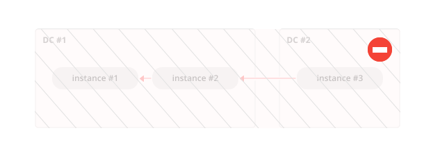
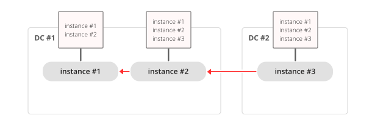

.. _replication-architecture:

================================================================================
Replication architecture
================================================================================

.. _replication-mechanism:

--------------------------------------------------------------------------------
Replication mechanism
--------------------------------------------------------------------------------

A pack of instances which operate on copies of the same databases make up a
**replica set**. Each instance in a replica set has a role, **master** or
**replica**.

A replica gets all updates from the master by continuously fetching and applying
its :ref:`write ahead log (WAL)<internals-wal>`. Each record in the WAL represents a single
Tarantool data-change request such as :ref:`INSERT<box_space-insert>`,
:ref:`UPDATE<box_space-update>` or :ref:`DELETE<box_space-delete>`, and is assigned
a monotonically growing log sequence number (**LSN**). In essence, Tarantool
replication is **row-based**: each data-change request is fully deterministic
and operates on a single :ref:`tuple<index-box_tuple>`. However, unlike a classical row-based log, which
contains entire copies of the changed rows, Tarantool's WAL contains copies of the requests.
For example, for UPDATE requests, Tarantool only stores the primary key of the row and
the update operations, to save space.

Invocations of **stored programs** are not written to the WAL. Instead, records
of the actual **data-change requests, performed by the Lua code**, are
written to the WAL. This ensures that possible non-determinism of Lua does not
cause replication to go out of sync.

Data definition operations on **temporary spaces**, such as creating/dropping, adding
indexes, truncating, etc., are written to the WAL, since information about
temporary spaces is stored in non-temporary
system spaces, such as :ref:`box.space._space <box_space-space>`. Data change
operations on temporary spaces are not written to the WAL and are not replicated.

.. _replication-local:

Data change operations on **replication-local** spaces
(spaces :ref:`created <box_schema-space_create>` with ``is_local = true``)
are written to the WAL but are not replicated.

To create a valid initial state, to which WAL changes can be applied, every
instance of a replica set requires a start set of
:ref:`checkpoint files <index-box_persistence>`, such as .snap files for memtx
and .run files for vinyl. A replica joining an existing replica set, chooses an
existing master and automatically downloads the initial state from it. This is
called an **initial join**.

When an entire replica set is bootstrapped for the first time, there is no
master which could provide the initial checkpoint. In such a case, replicas
connect to each other and elect a master, which then creates the starting set of
checkpoint files, and distributes it to all the other replicas. This is called
an **automatic bootstrap** of a replica set.

When a replica contacts a master (there can be many masters) for the first time,
it becomes part of a replica set. On subsequent occasions, it should always
contact a master in the same replica set. Once connected to the master, the
replica requests all changes that happened after the latest local LSN (there
can be many LSNs -- each master has its own LSN).

Each replica set is identified by a globally unique identifier, called the
**replica set UUID**. The identifier is created by the master which creates the
very first checkpoint, and is part of the checkpoint file. It is stored in
system space :ref:`box.space._schema <box_space-schema>`. For example:

.. code-block:: tarantoolsession

    tarantool> box.space._schema:select{'cluster'}
    ---
    - - ['cluster', '6308acb9-9788-42fa-8101-2e0cb9d3c9a0']
    ...

.. _replication-replica-id:

Additionally, each instance in a replica set is assigned its own UUID, when it
joins the replica set. It is called an **instance UUID** and is a globally unique
identifier. The instance UUID is checked to ensure that instances do not join a different
replica set, e.g. because of a configuration error. A unique instance identifier
is also necessary to apply rows originating from different masters only once,
that is, to implement multi-master replication. This is why each row in the write
ahead log, in addition to its log sequence number, stores the instance identifier
of the instance on which it was created. But using a UUID as such an identifier
would take too much space in the write ahead log, thus a shorter integer number
is assigned to the instance when it joins a replica set. This number is then
used to refer to the instance in the write ahead log. It is called
**instance id**. All identifiers are stored in system space
:ref:`box.space._cluster <box_space-cluster>`. For example:

.. code-block:: tarantoolsession

    tarantool> box.space._cluster:select{}
    ---
    - - [1, '88580b5c-4474-43ab-bd2b-2409a9af80d2']
    ...

Here the instance ID is ``1`` (unique within the replica set), and the instance
UUID is ``88580b5c-4474-43ab-bd2b-2409a9af80d2`` (globally unique).

Using instance IDs is also handy for tracking the state of the entire
replica set. For example, :ref:`box.info.vclock <box_introspection-box_info>`
describes the state of replication in regard to each connected peer.

.. code-block:: tarantoolsession

    tarantool> box.info.vclock
    ---
    - {1: 827, 2: 584}
    ...

Here ``vclock`` contains log sequence numbers (827 and 584) for instances with
instance IDs 1 and 2.

Starting in Tarantool 1.7.7, it is possible for administrators to assign
the instance UUID and the replica set UUID values, rather than let the system
generate them -- see the description of the
:ref:`replicaset_uuid <cfg_replication-replicaset_uuid>` configuration parameter.

.. _replication-setup:

--------------------------------------------------------------------------------
Replication setup
--------------------------------------------------------------------------------

To enable replication, you need to specify two parameters in a ``box.cfg{}``
request:

* :ref:`replication <cfg_replication-replication>` which defines the
  replication source(s), and
* :ref:`read_only <cfg_basic-read_only>` which is ``true`` for a
  replica and ``false`` for a master.

Both these parameters are "dynamic". This allows a replica to become a master
and vice versa on the fly with the help of a ``box.cfg{}`` request.

Later we will give a detailed example of
:ref:`bootstrapping a replica set <replication-bootstrap>`.

.. _replication-roles:

--------------------------------------------------------------------------------
Replication roles: master and replica
--------------------------------------------------------------------------------

The replication role (master or replica) is set by the
:ref:`read_only <cfg_basic-read_only>` configuration parameter. The recommended
role is "read_only" (replica) for all but one instance in the replica set.

In a master-replica configuration, every change that happens on the master will
be visible on the replicas, but not vice versa.

.. image:: mr-1m-2r-oneway.svg
    :align: center

A simple two-instance replica set with the master on one machine and the replica
on a different machine provides two benefits:

* **failover**, because if the master goes down then the replica can take over,
  and
* **load balancing**, because clients can connect to either the master or the
  replica for read requests.

In a **master-master** configuration (also called "multi-master"), every change
that happens on either instance will be visible on the other one.

.. image:: mm-3m-mesh.svg
    :align: center

The failover benefit in this case is still present, and the load-balancing
benefit is enhanced, because any instance can handle both read and write
requests. Meanwhile, for multi-master configurations, it is necessary to
understand the **replication guarantees** provided by the asynchronous protocol
that Tarantool implements.

Tarantool multi-master replication guarantees that each change on each master is
propagated to all instances and is applied only once. Changes from the same
instance are applied in the same order as on the originating instance. Changes
from different instances, however, can be mixed and applied in a different order on
different instances. This may lead to replication going out of sync in certain
cases.

For example, assuming the database is only appended to (i.e. it contains only
insertions), a multi-master configuration is safe. If there are also
deletions, but it is not mission critical that deletion happens in the same
order on all replicas (e.g. the DELETE is used to prune expired data),
a master-master configuration is also safe.

UPDATE operations, however, can easily go out of sync. For example, assignment
and increment are not commutative, and may yield different results if applied
in different order on different instances.

More generally, it is only safe to use Tarantool master-master replication if
all database changes are **commutative**: the end result does not depend on the
order in which the changes are applied. You can start learning more about
conflict-free replicated data types
`here <https://en.wikipedia.org/wiki/Conflict-free_replicated_data_type>`_.

.. _replication-topologies:

--------------------------------------------------------------------------------
Replication topologies: cascade, ring and full mesh
--------------------------------------------------------------------------------

Replication topology is set by the :ref:`replication <cfg_replication-replication>`
configuration parameter. The recommended topology is a **full mesh**, because it
makes potential failover easy.

Some database products offer **cascading replication** topologies: creating a
replica on a replica. Tarantool does not recommend such setup.

The problem with a cascading replica set is that some instances have no
connection to other instances and may not receive changes from them. One
essential change that must be propagated across all instances in a replica set
is an entry in ``box.space._cluster`` system space with the replica set UUID.
Without knowing the replica set UUID, a master refuses to accept connections from
such instances when replication topology changes. Here is how this can happen:

We have a chain of three instances. Instance #1 contains entries for instances
#1 and #2 in its ``_cluster`` space. Instances #2 and #3 contain entries for
instances #1, #2 and #3 in their ``_cluster`` spaces.

.. image:: cascade-problem-2.svg
    :align: center

Now instance #2 is faulty. Instance #3 tries connecting to instance #1 as its
new master, but the master refuses the connection since it has no entry for
instance #3.

**Ring replication** topology is, however, supported:

.. image:: cascade-to-ring.svg
    :align: center

So, if you need a cascading topology, you may first create a ring to ensure all
instances know each other’s UUID, and then disconnect the chain in the place you
desire.

A stock recommendation for a master-master replication topology, however, is a
**full mesh**:

.. image:: mm-3m-mesh.svg
    :align: center

You then can decide where to locate instances of the mesh -- within the same
data center, or spread across a few data centers. Tarantool will automatically
ensure that each row is applied only once on each instance. To remove a degraded
instance from a mesh, simply change the ``replication`` configuration parameter.

This ensures full cluster availability in case of a local failure, e.g. one of
the instances failing in one of the data centers, as well as in case of an
entire data center failure.

The maximal number of replicas in a mesh is 32.
