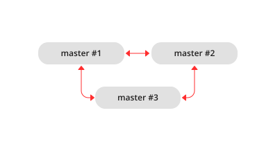

.. _replication-monitoring:

================================================================================
Monitoring a replica set
================================================================================

To learn what instances belong in the replica set, and obtain statistics for all
these instances, issue a :ref:`box.info.replication <box_info_replication>` request:

.. code-block:: tarantoolsession

    tarantool> box.info.replication
    ---
      replication:
        1:
          id: 1
          uuid: b8a7db60-745f-41b3-bf68-5fcce7a1e019
          lsn: 88
        2:
          id: 2
          uuid: cd3c7da2-a638-4c5d-ae63-e7767c3a6896
          lsn: 31
          upstream:
            status: follow
            idle: 43.187747001648
            peer: replicator@192.168.0.102:3301
            lag: 0
          downstream:
            vclock: {1: 31}
        3:
          id: 3
          uuid: e38ef895-5804-43b9-81ac-9f2cd872b9c4
          lsn: 54
          upstream:
            status: follow
            idle: 43.187621831894
            peer: replicator@192.168.0.103:3301
            lag: 2
          downstream:
            vclock: {1: 54}
    ...

This report is for a master-master replica set of three instances, each having
its own instance id, UUID and log sequence number.

The request was issued at master #1, and the reply includes statistics for the
other two masters, given in regard to master #1.

The primary indicators of replication health are:

.. _heartbeat:

* :ref:`idle <box_info_replication_upstream_idle>`, the time (in seconds) since
  the instance received the last event from a master.

  A replica sends heartbeat messages to the master every second, and the master
  is programmed to reconnect automatically if it does not see heartbeat messages
  within :ref:`replication_timeout <cfg_replication-replication_timeout>`
  seconds.

  Therefore, in a healthy replication setup, ``idle`` should never exceed
  ``replication_timeout``: if it does, either the replication is lagging
  seriously behind, because the master is running ahead of the replica, or the
  network link between the instances is down.

* :ref:`lag <box_info_replication_upstream_lag>`, the time difference between
  the local time at the instance, recorded when the event was received, and the
  local time at another master recorded when the event was written to the
  :ref:`write ahead log <internals-wal>` on that master.

  Since the ``lag`` calculation uses the operating system clocks from two different
  machines, do not be surprised if it’s negative: a time drift may lead to the
  remote master clock being consistently behind the local instance's clock.

  For multi-master configurations, ``lag`` is the maximal lag.
