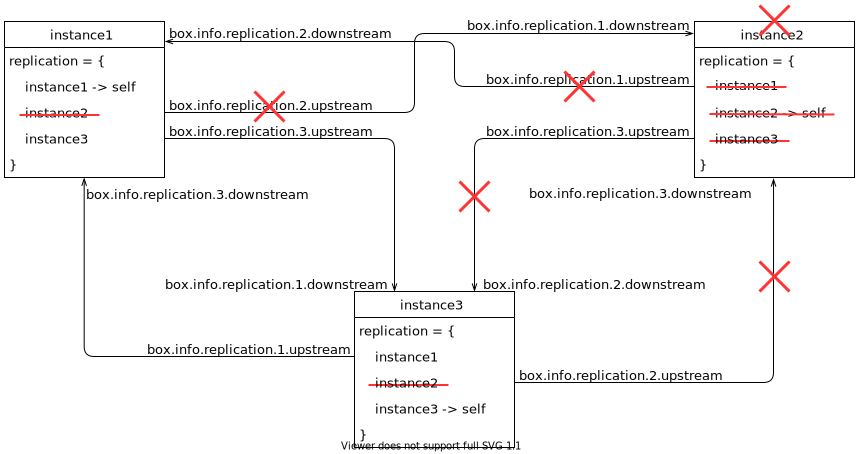

.. _replication-remove_instances:

================================================================================
Removing instances
================================================================================

Let's assume that we have the following configured replica set with 3 instances
(*instance1*, *instance2* and *instance3*) and we want to remove *instance2*.

To remove it politely, follow these steps:

1. Disconnect *instance2* from the cluster.
2. Disconnect the cluster from *instance2*.
3. Remove *instance2* from the ``_cluster`` space.

**Step 1: disconnecting an instance from the cluster**

On the disconnecting instance *instance2*, run ``box.cfg{}``
with a blank replication source:

.. code-block:: tarantoolsession
   
   tarantool> box.cfg{replication=''}

Then check that it was disconnected. Take a look at ``box.info.replication``
on *instance2* (notice that ``replication.{1,3}.upstream`` is absent):

.. code-block:: tarantoolsession
   
   tarantool> box.info.replication
   ---
   - 1:
      id: 1
      uuid: db89978f-7115-4537-8417-9982bb5a256f
      lsn: 9
   -- upstream is absent
      downstream:
         status: follow
         idle: 0.93983899999876
         vclock: {1: 9}
   2:
      id: 2
      uuid: 0a756d14-e437-4296-85b0-d27a0621613e
      lsn: 0
   3:
      id: 3
      uuid: bb362584-c265-4e53-aeb6-450ae818bf59
      lsn: 0
   -- upstream is absent
      downstream:
         status: follow
         idle: 0.26624799999991
         vclock: {1: 9}
   ...

Check *instance1* and *instance3* as well
(notice that the status of ``replication.2.downstream`` is ``stopped``):

.. code-block:: tarantoolsession

   -- instance1
   tarantool> box.info.replication
   ---
   - 1:
      id: 1
      uuid: db89978f-7115-4537-8417-9982bb5a256f
      lsn: 9
   2:
      id: 2
      uuid: 0a756d14-e437-4296-85b0-d27a0621613e
      lsn: 0
      upstream:
         status: follow
         idle: 0.3533439999992
         peer: replicator@localhost:3302
         lag: 0.0001220703125
      downstream:
         status: stopped     -- status has changed:
         message: unexpected EOF when reading from socket, called on fd 13, aka [::1]:3301,
         peer of [::1]:53776
         system_message: Broken pipe
   3:
      id: 3
      uuid: bb362584-c265-4e53-aeb6-450ae818bf59
      lsn: 0
      upstream:
         status: follow
         idle: 0.35327999999936
         peer: replicator@localhost:3303
         lag: 0.00018095970153809
      downstream:
         status: follow
         idle: 0.68685100000221
         vclock: {1: 9}
   ...

**Step 2: disconnecting the cluster from the decommissioned instance**

On every other instance in the cluster remove *instance2* from 
the ``box.cfg{ replication }`` list and call an appropriate
``box.cfg{ replication = {instance1, instance3} }``:

.. code-block:: tarantoolsession

   tarantool> box.cfg{ replication = { 'instance1-uri', 'instance3-uri' } }

Take a look at ``box.info.replication`` on *instance2* to check that *instance1* and *instance3* were
disconnected
(notice that the status of ``replication.{1,3}.downstream`` is ``stopped``):

.. code-block:: tarantoolsession

   tarantool> box.info.replication
   ---
   - 1:
      id: 1
      uuid: db89978f-7115-4537-8417-9982bb5a256f
      lsn: 9
      downstream:
         status: stopped    -- status has changed
         message: unexpected EOF when reading from socket, called on fd 16, aka [::1]:3302,
         peer of [::1]:53832
         system_message: Broken pipe
   2:
      id: 2
      uuid: 0a756d14-e437-4296-85b0-d27a0621613e
      lsn: 0
   3:
      id: 3
      uuid: bb362584-c265-4e53-aeb6-450ae818bf59
      lsn: 0
      downstream:
         status: stopped    -- status has changed
         message: unexpected EOF when reading from socket, called on fd 18, aka [::1]:3302,
         peer of [::1]:53825
         system_message: Broken pipe
   ...

Check *instance1* and *instance3* as well 
(notice that the status of ``replication.2.upstream`` is ``stopped``):

.. code-block:: tarantoolsession

   -- instance1
   tarantool> box.info.replication
   ---
   - 1:
      id: 1
      uuid: db89978f-7115-4537-8417-9982bb5a256f
      lsn: 9
   2:
      id: 2
      uuid: 0a756d14-e437-4296-85b0-d27a0621613e
      lsn: 0
      downstream:
         status: stopped   -- status has changed
         message: unexpected EOF when reading from socket, called on fd 13, aka [::1]:3301,
         peer of [::1]:53776
         system_message: Broken pipe
   3:
      id: 3
      uuid: bb362584-c265-4e53-aeb6-450ae818bf59
      lsn: 0
      upstream:
         status: follow
         idle: 0.50240100000156
         peer: replicator@localhost:3303
         lag: 0.00015711784362793
      downstream:
         status: follow
         idle: 0.14237199999843
         vclock: {1: 9}
   ...

**Step 3: persistent removal**

If a removed instance rejoins later, it will receive all the updates made
by the other instances while it was disconnected.

If an instance is decommissioned forever, we should clean up the ``_cluster`` space.
First, discover the ``id`` and ``uuid`` of the instance. 
On *instance2*, call ``return box.info.id, box.info.uuid``:

.. code-block:: tarantoolsession

   tarantool> return box.info.id, box.info.uuid
   ---
   - 2
   - '0a756d14-e437-4296-85b0-d27a0621613e'
   ...

Take a note of ``id`` and ``uuid``.

Now choose any master from the remaining cluster and perform the following actions on it
(let's assume that we chose *instance1*):

1. Select all records from the ``_cluster`` space:

.. code-block:: tarantoolsession

   tarantool> box.space._cluster:select{}
   ---
   - - [1, 'db89978f-7115-4537-8417-9982bb5a256f']
   - [2, '0a756d14-e437-4296-85b0-d27a0621613e']
   - [3, 'bb362584-c265-4e53-aeb6-450ae818bf59']
   ...

2. Check if the ``id`` and ``uuid`` of *instance2* are correct and remove them
from the cluster:

.. code-block:: tarantoolsession

   tarantool> box.space._cluster:delete(2)
   ---
   - [2, '0a756d14-e437-4296-85b0-d27a0621613e']
   ...

**Final ckecks**

After all modifications, say ``box.info.replication`` to check the health status.
