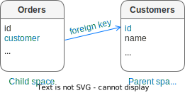

Data storage
============

..  _index-box_tuple:

Tuples
------

Tarantool operates data in the form of tuples.

..  glossary::

    tuple
        A tuple is a group of data values in Tarantool's memory.
        Think of it as a "database record" or a "row".
        The data values in the tuple are called :term:`fields <field>`.

        When Tarantool returns a tuple value in the console,
        by default, it uses :ref:`YAML <interactive_console>` format,
        for example: ``[3, 'Ace of Base', 1993]``.

        Internally, Tarantool stores tuples as
        `MsgPack <https://en.wikipedia.org/wiki/MessagePack>`_ arrays.

    field
        Fields are distinct data values, contained in a tuple.
        They play the same role as "row columns" or "record fields" in relational databases,
        with a few improvements:

        *   fields can be composite structures, such as arrays or maps,
        *   fields don't need to have names.

        A given tuple may have any number of fields, and the fields may be of
        different :ref:`types <index-box_data-types>`.

        The field's number is the identifier of the field.
        Numbers are counted from base 1 in Lua and other 1-based languages,
        or from base 0 in languages like PHP or C/C++.
        So, ``1`` or ``0`` can be used in some contexts to refer to the first
        field of a tuple.

..  _index-box_space:

Spaces
------

Tarantool stores tuples in containers called spaces.

..  glossary::

    space
        In Tarantool, a space is a primary container that stores data.
        It is analogous to tables in relational databases.
        Spaces contain :term:`tuples <tuple>` -- the Tarantool name for
        database records.
        The number of tuples in a space is unlimited.

        At least one space is required to store data with Tarantool.
        Each space has the following attributes:

        *   a unique **name** specified by the user,
        *   a unique **numeric identifier** which can be specified by
            the user, but usually is assigned automatically by Tarantool,
        *   an **engine**: *memtx* (default) --- in-memory engine,
            fast but limited in size, or *vinyl* --- on-disk engine for huge data sets.

        To be functional, a space also needs to have a :ref:`primary index <index-box_index>`.
        It can also have secondary indexes.

..  _index-box_data-types:

Data types
----------

Tarantool is both a database manager and an application server.
Therefore a developer often deals with two type sets:
the types of the programming language (such as Lua) and
the types of the Tarantool storage format (MsgPack).

..  _index-box_lua-vs-msgpack:

Lua versus MsgPack
~~~~~~~~~~~~~~~~~~

..  container:: table

    ..  list-table::
        :widths: 15 30 15 40
        :header-rows: 1

        *   -   Scalar / compound
            -   MsgPack type
            -   Lua type
            -   Example value
        *   -   scalar
            -   nil
            -   `cdata`_
            -   :ref:`box.NULL <box-null>`
        *   -   scalar
            -   boolean
            -   `boolean`_
            -   ``true``
        *   -   scalar
            -   string
            -   `string`_
            -   ``'A B C'``
        *   -   scalar
            -   integer
            -   `number`_
            -   ``12345``
        *   -   scalar
            -   integer
            -   `cdata`_
            -   ``12345``
        *   -   scalar
            -   float64 (double)
            -   `number`_
            -   ``1.2345``
        *   -   scalar
            -   float64 (double)
            -   `cdata`_
            -   ``1.2345``
        *   -   scalar
            -   binary
            -   `cdata`_
            -   ``[!!binary 3t7e]``
        *   -   scalar
            -   ext (for Tarantool ``decimal``)
            -   `cdata`_
            -   ``1.2``
        *   -   scalar
            -   ext (for Tarantool ``datetime``)
            -   `cdata`_
            -   ``'2021-08-20T16:21:25.122999906 Europe/Berlin'``
        *   -   scalar
            -   ext (for Tarantool ``interval``)
            -   `cdata`_
            -   ``+1 months, 1 days``
        *   -   scalar
            -   ext (for Tarantool ``uuid``)
            -   `cdata`_
            -   ``12a34b5c-de67-8f90-123g-h4567ab8901``
        *   -   compound
            -   map
            -   `table`_ (with string keys)
            -   ``{'a': 5, 'b': 6}``
        *   -   compound
            -   array
            -   `table`_ (with integer keys)
            -   ``[1, 2, 3, 4, 5]``
        *   -   compound
            -   array
            -   tuple (`cdata`_)
            -   ``[12345, 'A B C']``

..  _boolean: http://www.lua.org/pil/2.2.html
..  _string: http://www.lua.org/pil/2.4.html
..  _number: http://www.lua.org/pil/2.3.html
..  _table: http://www.lua.org/pil/2.5.html
..  _cdata: http://luajit.org/ext_ffi.html#call

..  note::

    MsgPack values have variable lengths.
    So, for example, the smallest number requires only one byte, but the largest number
    requires nine bytes.

..  note::
    
    The Lua `nil <http://www.lua.org/pil/2.1.html>`_ type is encoded as MsgPack ``nil`` but
    decoded as :ref:`msgpack.NULL <box-null>`.

..  _index_box_field_type_details:

Field type details
~~~~~~~~~~~~~~~~~~

..  _index-box_nil:

nil
***

In Lua, the nil type has only one possible value, also called ``nil``.
Tarantool displays it as ``null`` when using the default
:ref:`YAML <interactive_console>` format.
Nil may be compared to values of any types with == (is-equal)
or ~= (is-not-equal), but other comparison operations will not work.
Nil may not be used in Lua tables; the workaround is to use
:ref:`box.NULL <box-null>` because ``nil == box.NULL`` is true.
**Example:** ``nil``.

..  _index-box_boolean:

boolean
*******

A boolean is either ``true`` or ``false``.

**Example:** ``true``.

..  _index-box_integer:

integer
*******

The Tarantool integer type is for integers between
-9223372036854775808 and 18446744073709551615, which is about 18 quintillion.
This type corresponds to the number type in Lua and to the integer type in MsgPack.

**Example:** ``-2^63``.

..  _index-box_unsigned:

unsigned
********

The Tarantool unsigned type is for integers between
0 and 18446744073709551615. So it is a subset of integer.

**Example:** ``123456``.

..  _index-box_double:

double
******

The double field type exists
mainly to be equivalent to Tarantool/SQL's
:ref:`DOUBLE data type <sql_data_type_double>`.
In `msgpuck.h <https://github.com/rtsisyk/msgpuck>`_ (Tarantool's interface to MsgPack),
the storage type is ``MP_DOUBLE`` and the size of the encoded value is always 9 bytes.
In Lua, fields of the double type can only contain non-integer numeric values and
cdata values with double floating-point numbers.

**Examples:** ``1.234``, ``-44``, ``1.447e+44``.

To avoid using the wrong kind of values inadvertently, use
``ffi.cast()`` when searching or changing ``double`` fields.
For example, instead of
:samp:`{space_object}:insert`:code:`{`:samp:`{value}`:code:`}`
use
``ffi = require('ffi') ...``
:samp:`{space_object}:insert`:code:`({ffi.cast('double',`:samp:`{value}`:code:`)})`.

**Example:**

..  code-block:: tarantoolsession

    s = box.schema.space.create('s', {format = {{'d', 'double'}}})
    s:create_index('ii')
    s:insert({1.1})
    ffi = require('ffi')
    s:insert({ffi.cast('double', 1)})
    s:insert({ffi.cast('double', tonumber('123'))})
    s:select(1.1)
    s:select({ffi.cast('double', 1)})

Arithmetic with cdata ``double`` will not work reliably, so
for Lua, it is better to use the ``number`` type.
This warning does not apply for Tarantool/SQL because
Tarantool/SQL does
:ref:`implicit casting <sql_data_type_conversion>`.

..  _index-box_number:

number
******

The Tarantool number field may have both
integer and floating-point values, although in Lua a ``number``
is a double-precision floating-point.

Tarantool will try to store a Lua number as
floating-point if the value contains a decimal point or is very large
(greater than 100 trillion = 1e14), otherwise Tarantool will store it as an integer.
To ensure that even very large numbers are stored as integers, use the
:ref:`tonumber64 <other-tonumber64>` function, or the LL (Long Long) suffix,
or the ULL (Unsigned Long Long) suffix.
Here are examples of numbers using regular notation, exponential notation,
the ULL suffix and the ``tonumber64`` function:
``-55``, ``-2.7e+20``, ``100000000000000ULL``, ``tonumber64('18446744073709551615')``.

You can also use the ``ffi`` module to specify a C type to cast the number to.
In this case, the number will be stored as `cdata`_.

..  _index-box_decimal:

decimal
*******

The Tarantool decimal type is stored as a :ref:`MsgPack ext <msgpack_ext-decimal>` (Extension).
Values with the decimal type are not floating-point values although
they may contain decimal points.
They are exact with up to 38 digits of precision.

**Example:** a value returned by a function in the :ref:`decimal <decimal>` module.

..  _index-box_datetime:

datetime
********

Introduced in :tarantool-release:`2.10.0`.
The Tarantool ``datetime`` type facilitates operations with date and time,
accounting for leap years or the varying number of days in a month.
It is stored as a :ref:`MsgPack ext <msgpack_ext-datetime>` (Extension).
Operations with this data type use code from `c-dt <https://github.com/tarantool/c-dt>`_, a third-party library.

For more information, see :doc:`Module datetime </reference/reference_lua/datetime>`.

..  _index-box_interval:

interval
********

**Since:** :tarantool-release:`2.10.0`

The Tarantool ``interval`` type represents periods of time.
They can be added to or subtracted from ``datetime`` values or each other.
Operations with this data type use code from `c-dt <https://github.com/tarantool/c-dt>`_, a third-party library.
The type is stored as a :ref:`MsgPack ext <msgpack_ext-interval>` (Extension).
For more information, see :doc:`Module datetime </reference/reference_lua/datetime>`.

..  _index-box_string:

string
******

A string is a variable-length sequence of bytes, usually represented with
alphanumeric characters inside single quotes. In both Lua and MsgPack, strings
are treated as binary data, with no attempts to determine a string's
character set or to perform any string conversion -- unless there is an optional
:ref:`collation <index-collation>`.
So, usually, string sorting and comparison are done byte-by-byte, without any special
collation rules applied.
For example, numbers are ordered by their point on the number line, so 2345 is
greater than 500; meanwhile, strings are ordered by the encoding of the first
byte, then the encoding of the second byte, and so on, so ``'2345'`` is less than ``'500'``.

**Example:** ``'A, B, C'``.

..  _index-box_bin:

bin
***

A bin (binary) value is not directly supported by Lua but there is
a Tarantool type ``varbinary`` which is encoded as MsgPack binary.
For an (advanced) example showing how to insert varbinary into a database,
see the Cookbook Recipe for :ref:`ffi_varbinary_insert <cookbook-ffi_varbinary_insert>`.

**Example:** ``"\65 \66 \67"``.

..  _index-box_uuid:

uuid
****

The Tarantool uuid type is used for
:ref:`Universally Unique Identifiers <uuid-module>`.
Since version :doc:`2.4.1 </release/2.4.1>` Tarantool stores
``uuid`` values as a :ref:`MsgPack ext <msgpack_ext-uuid>` (Extension).

**Example:** ``64d22e4d-ac92-4a23-899a-e5934af5479``.

..  _index-box_array:

array
*****

An array is represented in Lua with ``{...}`` (`braces <https://www.lua.org/pil/11.1.html>`_).

**Examples:** lists of numbers representing points in geometric figures:
``{10, 11}``, ``{3, 5, 9, 10}``.

..  _index-box_table:

table
*****

Lua tables with string keys are stored as MsgPack maps;
Lua tables with integer keys starting with 1 are stored as MsgPack arrays.
Nils may not be used in Lua tables; the workaround is to use
:ref:`box.NULL <box-null>`.

**Example:** a ``box.space.tester:select()`` request will return a Lua table.

..  _index-box_tuple_ref:

tuple
*****

A tuple is a light reference to a MsgPack array stored in the database.
It is a special type (cdata) to avoid conversion to a Lua table on retrieval.
A few functions may return tables with multiple tuples. For tuple examples,
see :ref:`box.tuple <box_tuple>`.

..  _index-box_scalar:

scalar
******

Values in a scalar field can be boolean, integer, unsigned, double,
number, decimal, string, uuid, or varbinary; but not array, map, or tuple.

**Examples:** ``true``, ``1``, ``'xxx'``.

..  _index-box_any:

any
***

Values in a field of this type can be boolean, integer, unsigned, double,
number, decimal, string, uuid, varbinary, array, map, or tuple.

**Examples:** ``true``, ``1``, ``'xxx'``, ``{box.NULL, 0}``.

.. _examples_different_field_types:

Examples
********

Examples of insert requests with different field types:

..  code-block:: tarantoolsession

    tarantool> box.space.K:insert{1,nil,true,'A B C',12345,1.2345}
    ---
    - [1, null, true, 'A B C', 12345, 1.2345]
    ...
    tarantool> box.space.K:insert{2,{['a']=5,['b']=6}}
    ---
    - [2, {'a': 5, 'b': 6}]
    ...
    tarantool> box.space.K:insert{3,{1,2,3,4,5}}
    ---
    - [3, [1, 2, 3, 4, 5]]
    ...

Indexed field types
~~~~~~~~~~~~~~~~~~~

To learn more about what values can be stored in indexed fields, read the
:ref:`Indexes <index-box_indexed-field-types>` section.

..  _index-collation:

Collations
----------

By default, when Tarantool compares strings, it uses the so-called
**binary collation**.
It only considers the numeric value of each byte in a string.
For example, the encoding of ``'A'`` (what used to be called the "ASCII value") is 65,
the encoding of ``'B'`` is 66, and the encoding of ``'a'`` is 98.
Therefore, if the string is encoded with ASCII or UTF-8, then ``'A' < 'B' < 'a'``.

Binary collation is the best choice for fast deterministic simple maintenance and searching
with Tarantool indexes.

But if you want the ordering that you see in phone books and dictionaries,
then you need Tarantool's optional collations, such as ``unicode`` and
``unicode_ci``, which allow for ``'a' < 'A' < 'B'`` and ``'a' == 'A' < 'B'``
respectively.

**The unicode and unicode_ci optional collations** use the ordering according to the
`Default Unicode Collation Element Table (DUCET) <http://unicode.org/reports/tr10/#Default_Unicode_Collation_Element_Table>`_
and the rules described in
`Unicode® Technical Standard #10 Unicode Collation Algorithm (UTS #10 UCA) <http://unicode.org/reports/tr10>`_.
The only difference between the two collations is about
`weights <https://unicode.org/reports/tr10/#Weight_Level_Defn>`_:

*   ``unicode`` collation observes L1, L2, and L3 weights (strength = 'tertiary');
*   ``unicode_ci`` collation observes only L1 weights (strength = 'primary'), so for example ``'a' == 'A' == 'á' == 'Á'``.

As an example, take some Russian words:

..  code-block:: text

    'ЕЛЕ'
    'елейный'
    'ёлка'
    'еловый'
    'елозить'
    'Ёлочка'
    'ёлочный'
    'ЕЛь'
    'ель'

...and show the difference in ordering and selecting by index:

*   with ``unicode`` collation:

    ..  code-block:: tarantoolsession

        tarantool> box.space.T:create_index('I', {parts = {{field = 1, type = 'str', collation='unicode'}}})
        ...
        tarantool> box.space.T.index.I:select()
        ---
        - - ['ЕЛЕ']
          - ['елейный']
          - ['ёлка']
          - ['еловый']
          - ['елозить']
          - ['Ёлочка']
          - ['ёлочный']
          - ['ель']
          - ['ЕЛь']
        ...
        tarantool> box.space.T.index.I:select{'ЁлКа'}
        ---
        - []
        ...

*   with ``unicode_ci`` collation:

    ..  code-block:: tarantoolsession

        tarantool> box.space.T:create_index('I', {parts = {{field = 1, type ='str', collation='unicode_ci'}}})
        ...
        tarantool> box.space.T.index.I:select()
        ---
        - - ['ЕЛЕ']
          - ['елейный']
          - ['ёлка']
          - ['еловый']
          - ['елозить']
          - ['Ёлочка']
          - ['ёлочный']
          - ['ЕЛь']
        ...
        tarantool> box.space.T.index.I:select{'ЁлКа'}
        ---
        - - ['ёлка']
        ...

In all, collation involves much more than these simple examples of
upper case / lower case and accented / unaccented equivalence in alphabets.
We also consider variations of the same character, non-alphabetic writing systems,
and special rules that apply for combinations of characters.

For English, Russian, and most other languages and use cases, use the "unicode" and "unicode_ci" collations.
If you need Cyrillic letters 'Е' and 'Ё' to have the same level-1 weights,
try the Kyrgyz collation.

**The tailored optional collations**: for other languages, Tarantool supplies tailored collations for every
modern language that has more than a million native speakers, and
for specialized situations such as the difference between dictionary
order and telephone book order.
Run ``box.space._collation:select()`` to see the complete list.

The tailored collation names have the form
``unicode_[language code]_[strength]``, where language code is a standard
2-character or 3-character language abbreviation, and strength is ``s1``
for "primary strength" (level-1 weights), ``s2`` for "secondary", ``s3`` for "tertiary".
Tarantool uses the same language codes as the ones in the "list of tailorable locales" on man pages of
`Ubuntu <http://manpages.ubuntu.com/manpages/bionic/man3/Unicode::Collate::Locale.3perl.html>`_ and
`Fedora <http://www.polarhome.com/service/man/?qf=Unicode%3A%3ACollate%3A%3ALocale&af=0&tf=2&of=Fedora>`_.
Charts explaining the precise differences from DUCET order are
in the
`Common Language Data Repository <https://unicode.org/cldr/charts/30/collation>`_.

..  _index-constraints:

Constraints
-----------

For better control over stored data, Tarantool supports **constraints** – user-defined
limitations on the values of certain fields or entire tuples. Together with data types,
constraints allow limiting the ranges of available field values both syntactically and semantically.

For example, the field ``age`` typically has the ``number`` type, so it cannot store
strings or boolean values. However, it can still have values that don't make sense,
such as negative numbers. This is where constraints come to help.

..  _index-constraint_types:

Constraint types
~~~~~~~~~~~~~~~~

There are two types of constraints in Tarantool:

*   *Field constraints* check that the value being assigned to a field
    satisfies a given condition. For example, ``age`` must be non-negative.

*   *Tuple constraints* check complex conditions that can involve all fields of
    a tuple. For example, a tuple contains a date in three fields:
    ``year``, ``month``, and ``day``. You can validate ``day`` values based on
    the ``month`` value (and even ``year`` if you consider leap years).

Field constraints work faster, while tuple constraints allow implementing
a wider range of limitations.

..  _index-constraint_functions:

Constraint functions
~~~~~~~~~~~~~~~~~~~~

Constraints use stored Lua functions, which must return ``true`` when the constraint
is satisfied. Other return values (including ``nil``) and exceptions make the
check fail and prevent tuple insertion or modification.

To create a constraint function, use :ref:`func.create with function body <box_schema-func_create_with-body>`.

Constraint functions take two parameters:

*   The tuple and the constraint name for tuple constraints.

    ..  literalinclude:: /code_snippets/test/constraints/constraint_test.lua
        :language: lua
        :lines: 21-23
        :dedent:

*   The field value and the constraint name for field constraints.

    ..  literalinclude:: /code_snippets/test/constraints/constraint_test.lua
        :language: lua
        :lines: 28-30
        :dedent:

..  warning::

    Tarantool doesn't check field names used in tuple constraint functions.
    If a field referenced in a tuple constraint gets renamed, this constraint will break
    and prevent further insertions and modifications in the space.

..  _index-constraint_apply:

Creating constraints
~~~~~~~~~~~~~~~~~~~~

To create a constraint in a space, specify the corresponding function's name
in the ``constraint`` parameter:

*   Tuple constraints: when creating or altering a space:

    ..  literalinclude:: /code_snippets/test/constraints/constraint_test.lua
        :language: lua
        :lines: 25-26
        :dedent:

*   Field constraints: when setting up the space format:

    ..  literalinclude:: /code_snippets/test/constraints/constraint_test.lua
        :language: lua
        :lines: 32-37
        :dedent:

In both cases, ``constraint`` can contain multiple function names passed as a tuple.
Each constraint can have an optional name:

..  literalinclude:: /code_snippets/test/constraints/constraint_test.lua
    :language: lua
    :lines: 54-57
    :dedent:

..  note::

    When adding a constraint to an existing space with data, Tarantool checks it
    against the stored data. If there are fields or tuples that don't satisfy
    the constraint, it won't be applied to the space.

..  _index-box_foreign_keys:

Foreign keys
------------

**Foreign keys** provide links between related fields, therefore maintaining the
`referential integrity <https://en.wikipedia.org/wiki/Referential_integrity>`_
of the database.

Some fields can only contain values that exist in other fields. For example,
a shop order always belongs to a customer. Hence, all values of the ``customer``
field of the ``orders`` space must also exist in the ``id`` field of the ``customers``
space. In this case, ``customers`` is a **parent space** for ``orders`` (its **child space**).
When two spaces are linked with a foreign key, each time a tuple is inserted or
modified in the child space, Tarantool checks that a corresponding value is present
in the parent space.

.. note::

    A foreign key can link a field to another field in the same space. In this case,
    the child field must be nullable. Otherwise, it will be impossible to insert
    the first tuple in such a space because there is no parent tuple to which
    it can link.

Foreign key types
~~~~~~~~~~~~~~~~~

There are two types of foreign keys in Tarantool:

*   *Field foreign keys* check that the value being assigned to a field
    is present in a particular field of another space. For example, the ``customer``
    value in a tuple from the ``orders`` space must match an ``id`` stored in the ``customers`` space.

*   *Tuple foreign keys* check that multiple fields of a tuple have a match in
    another space. For example, if the ``orders`` space has fields ``customer_id``
    and ``customer_name``, a tuple foreign key can check that the ``customers`` space
    contains a tuple with both these values in the corresponding fields.

Field foreign keys work faster while tuple foreign keys allow implementing
more strict references.

Creating foreign keys
~~~~~~~~~~~~~~~~~~~~~

..  important::

    For each foreign key, there must exist an index that includes all its fields.

To create a foreign key in a space, specify the parent space and linked fields in the ``foreign_key`` parameter.
Parent spaces can be referenced by name or by id. When linking to the same space, the space can be omitted.
Fields can be referenced by name or by number:

*   Field foreign keys: when setting up the space format.

    ..  literalinclude:: /code_snippets/test/foreign_keys/field_foreign_key_test.lua
        :language: lua
        :lines: 34-41
        :dedent:

*   Tuple foreign keys: when creating or altering a space. Note that for foreign
    keys with multiple fields there must exist an index that includes all these fields.

    ..  literalinclude:: /code_snippets/test/foreign_keys/tuple_foreign_key_test.lua
        :language: lua
        :lines: 34-46
        :dedent:

..  note::

    Type can be omitted for foreign key fields because it's
    defined in the parent space.

Foreign keys can have an optional name.

    ..  literalinclude:: /code_snippets/test/foreign_keys/tuple_foreign_key_test.lua
        :language: lua
        :lines: 60-63
        :dedent:

A space can have multiple tuple foreign keys. In this case, they all must have names.

    ..  literalinclude:: /code_snippets/test/foreign_keys/tuple_foreign_key_test.lua
        :language: lua
        :lines: 78-82
        :dedent:

Tarantool performs integrity checks upon data modifications in parent spaces.
If you try to remove a tuple referenced by a foreign key or an entire parent space,
you will get an error.

..  important::

    Renaming parent spaces or referenced fields may break the corresponding foreign
    keys and prevent further insertions or modifications in the child spaces.
