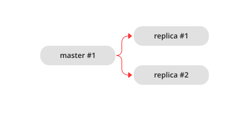
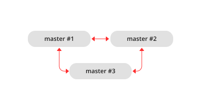
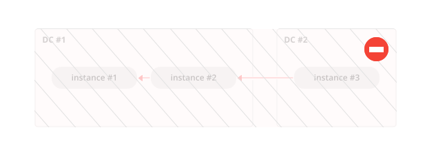
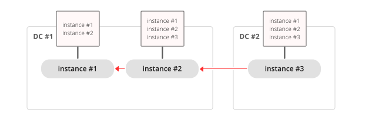
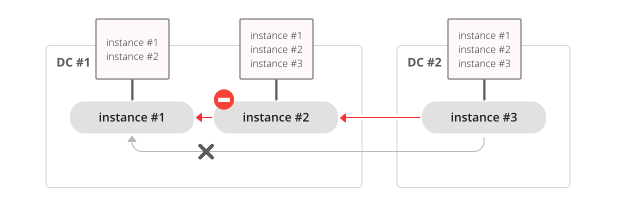
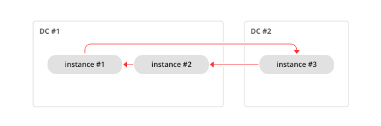

..  _replication-architecture:

Replication architecture
========================

..  _replication-mechanism:

Replication mechanism
---------------------

.. _replication_overview:

Overview
~~~~~~~~

A pack of instances that operate on copies of the same databases makes up a **replica set**.
Each instance in a replica set has a role: **master** or **replica**.

A replica gets all updates from the master by continuously fetching and applying
its :ref:`write-ahead log (WAL) <internals-wal>`. Each record in the WAL represents a single
Tarantool data-change request such as :ref:`INSERT <box_space-insert>`,
:ref:`UPDATE <box_space-update>`, or :ref:`DELETE <box_space-delete>`, and is assigned
a monotonically growing log sequence number (**LSN**). In essence, Tarantool
replication is **row-based**: each data-change request is fully deterministic
and operates on a single :ref:`tuple <index-box_tuple>`. However, unlike a classical row-based log, which
contains entire copies of the changed rows, Tarantool's WAL contains copies of the requests.
For example, for UPDATE requests, Tarantool only stores the primary key of the row and
the update operations to save space.

.. NOTE::

    `WAL extensions <https://www.tarantool.io/en/enterprise_doc/wal_extensions/>`_ available in Tarantool Enterprise enable you to add auxiliary information to each write-ahead log record.
    This information might be helpful for implementing a CDC (Change Data Capture) utility that transforms a data replication stream.

The following are specifics of adding different types of information to the WAL:

*   Invocations of **stored programs** are not written to the WAL.
    Instead, records of the actual **data-change requests, performed by the Lua code**, are written to the WAL.
    This ensures that the possible non-determinism of Lua does not cause replication to go out of sync.

*   Data definition operations on **temporary spaces** (:doc:`created </reference/reference_lua/box_schema/space_create>` with ``temporary = true``), such as creating/dropping, adding indexes, and truncating, are written to the WAL, since information about temporary spaces is stored in non-temporary system spaces, such as :ref:`box.space._space <box_space-space>`.

*   Data change operations on temporary spaces are not written to the WAL and are not replicated.

..  _replication-local:

*    Data change operations on **replication-local** spaces (:doc:`created </reference/reference_lua/box_schema/space_create>` with ``is_local = true``) are written to the WAL but are not replicated.

To learn how to enable replication, check the :ref:`Bootstrapping a replica set <replication-setup>` guide.

.. _replication_stages:

Replication stages
~~~~~~~~~~~~~~~~~~

To create a valid initial state, to which WAL changes can be applied, every instance of a replica set requires a start set of :ref:`checkpoint files <index-box_persistence>`, such as ``.snap`` files for memtx and ``.run`` files for vinyl.
A replica goes through the following stages:

1.  **Bootstrap** (optional)

    When an entire replica set is bootstrapped for the first time, there is no master that could provide the initial checkpoint.
    In such a case, replicas connect to each other and elect a master.
    The master creates the starting set of checkpoint files and distributes them to all the other replicas.
    This is called an **automatic bootstrap** of a replica set.

2.  **Join**

    At this stage, a replica downloads the initial state from the master.
    The master register this replica in the :ref:`box.space._cluster <box_space-cluster>` space.
    If join fails with a non-critical :ref:`error <error_codes>`, for example, ``ER_READONLY``, ``ER_ACCESS_DENIED``, or a network-related issue, an instance tries to find a new master to join.

    .. NOTE::

        On subsequent connections, a replica downloads all changes happened after the latest local LSN (there can be many LSNs – each master has its own LSN).

3.  **Follow**

    At this stage, a replica fetches and applies updates from the master's write-ahead log.

You can use the :ref:`box.info.replication[n].upstream.status <box_info_replication>` property to monitor the status of a replica.

.. _replication_uuid:

Replica set and instance UUIDs
~~~~~~~~~~~~~~~~~~~~~~~~~~~~~~

Each replica set is identified by a globally unique identifier, called the **replica set UUID**.
The identifier is created by the master, which creates the very first checkpoint and is part of the checkpoint file. It is stored in the :ref:`box.space._schema <box_space-schema>` system space, for example:

..  code-block:: tarantoolsession

    tarantool> box.space._schema:select{'cluster'}
    ---
    - - ['cluster', '6308acb9-9788-42fa-8101-2e0cb9d3c9a0']
    ...

..  _replication-replica-id:

Additionally, each instance in a replica set is assigned its own UUID, when it
joins the replica set. It is called an **instance UUID** and is a globally unique
identifier. The instance UUID is checked to ensure that instances do not join a different
replica set, e.g. because of a configuration error. A unique instance identifier
is also necessary to apply rows originating from different masters only once,
that is, to implement multi-master replication. This is why each row in the write-ahead log,
in addition to its log sequence number, stores the instance identifier
of the instance on which it was created. But using a UUID as such an identifier
would take too much space in the write-ahead log, thus a shorter integer number
is assigned to the instance when it joins a replica set. This number is then
used to refer to the instance in the write-ahead log. It is called
**instance ID**. All identifiers are stored in the system space
:ref:`box.space._cluster <box_space-cluster>`, for example:

..  code-block:: tarantoolsession

    tarantool> box.space._cluster:select{}
    ---
    - - [1, '88580b5c-4474-43ab-bd2b-2409a9af80d2']
    ...

Here the instance ID is ``1`` (unique within the replica set), and the instance
UUID is ``88580b5c-4474-43ab-bd2b-2409a9af80d2`` (globally unique).

Using instance IDs is also handy for tracking the state of the entire
replica set. For example, :ref:`box.info.vclock <box_introspection-box_info>`
describes the state of replication in regard to each connected peer.

..  code-block:: tarantoolsession

    tarantool> box.info.vclock
    ---
    - {1: 827, 2: 584}
    ...

Here ``vclock`` contains log sequence numbers (827 and 584) for instances with
instance IDs ``1`` and ``2``.

If required, you can explicitly specify the instance and the replica set UUID values rather than letting Tarantool generate them.
To learn more, see the :ref:`replicaset_uuid <cfg_replication-replicaset_uuid>` configuration parameter description.

..  _replication-roles:

Replication roles: master and replica
-------------------------------------

The replication role (master or replica) is set by the
:ref:`read_only <cfg_basic-read_only>` configuration parameter. The recommended
role is "read_only" (replica) for all but one instance in the replica set.

In a master-replica configuration, every change that happens on the master will
be visible on the replicas, but not vice versa.

A simple two-instance replica set with the master on one machine and the replica
on a different machine provides two benefits:

*   **failover**, because if the master goes down, then the replica can take over,
    and
*   **load balancing**, because clients can connect to either the master or the
    replica for read requests.

In a **master-master** configuration (also called "multi-master"), every change
that happens on either instance will be visible on the other one.

The failover benefit in this case is still present, and the load-balancing
benefit is enhanced, because any instance can handle both read and write
requests. Meanwhile, for multi-master configurations, it is necessary to
understand the **replication guarantees** provided by the asynchronous protocol
that Tarantool implements.

Tarantool multi-master replication guarantees that each change on each master is
propagated to all instances and is applied only once. Changes from the same
instance are applied in the same order as on the originating instance. Changes
from different instances, however, can be mixed and applied in a different order on
different instances. This may lead to replication going out of sync in certain
cases.

For example, assuming the database is only appended to (i.e. it contains only
insertions), a multi-master configuration is safe. If there are also
deletions, but it is not mission critical that deletion happens in the same
order on all replicas (e.g. the DELETE is used to prune expired data),
a master-master configuration is also safe.

UPDATE operations, however, can easily go out of sync. For example, assignment
and increment are not commutative and may yield different results if applied
in a different order on different instances.

More generally, it is only safe to use Tarantool master-master replication if
all database changes are **commutative**: the end result does not depend on the
order in which the changes are applied. You can start learning more about
conflict-free replicated data types
`here <https://en.wikipedia.org/wiki/Conflict-free_replicated_data_type>`_.

..  _replication-topologies:

Replication topologies: cascade, ring, and full mesh
----------------------------------------------------

Replication topology is set by the :ref:`replication <cfg_replication-replication>`
configuration parameter. The recommended topology is a **full mesh** because it
makes potential failover easy.

Some database products offer **cascading replication** topologies: creating a
replica on a replica. Tarantool does not recommend such a setup.

The problem with a cascading replica set is that some instances have no
connection to other instances and may not receive changes from them. One
essential change that must be propagated across all instances in a replica set
is an entry in ``box.space._cluster`` system space with the replica set UUID.
Without knowing the replica set UUID, a master refuses to accept connections from
such instances when replication topology changes. Here is how this can happen:

We have a chain of three instances. Instance #1 contains entries for instances
#1 and #2 in its ``_cluster`` space. Instances #2 and #3 contain entries for
instances #1, #2, and #3 in their ``_cluster`` spaces.

Now instance #2 is faulty. Instance #3 tries connecting to instance #1 as its
new master, but the master refuses the connection since it has no entry, for
example, #3.

**Ring replication** topology is, however, supported:

So, if you need a cascading topology, you may first create a ring to ensure all
instances know each other’s UUID, and then disconnect the chain in the place you
desire.

A stock recommendation for a master-master replication topology, however, is a
**full mesh**:

You then can decide where to locate instances of the mesh -- within the same
data center, or spread across a few data centers. Tarantool will automatically
ensure that each row is applied only once on each instance. To remove a degraded
instance from a mesh, simply change the ``replication`` configuration parameter.

This ensures full cluster availability in case of a local failure, e.g. one of
the instances failing in one of the data centers, as well as in case of an
entire data center failure.

The maximal number of replicas in a mesh is 32.

Orphan status
-------------

During ``box.cfg()``, an instance tries to join all nodes listed
in :ref:`box.cfg.replication <cfg_replication-replication>`.
If the instance does not succeed in connecting to the required number of nodes
(see :ref:`bootstrap_strategy <cfg_replication-bootstrap_strategy>`),
it switches to the :ref:`orphan status <internals-replication-orphan_status>`.
