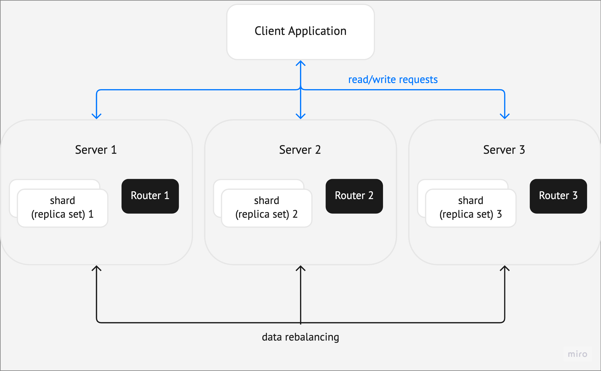

Images
======

Images are useful in explanations of concepts and structures.
When you introduce a term or describe a structure of multiple interconnected parts
(such as a cluster), consider illustrating it with a diagram.

Note that illustrations should complement the text, not replace it. Even with an image,
the text should be enough for readers to understand the topic.

Diagrams
--------

There is a basic set of diagram elements – blocks, arrows, and other – to use in Tarantool docs.
It is stored in `this Miro board <https://miro.com/app/board/uXjVPbCIj_g=/>`_. It also provides
basic rules for creating diagrams.

Size
~~~~

* The diagrams should have the same width. Examples in the Miro board have the
right width. Copy them and place your diagram without changing the frame width.

* The image height should not exceed the size of a small laptop screen.

Exporting
---------

To save the diagram to PNG, select all its elements together with the frame and
click **Copy as image** in the context menu (under the three dots). The image will
be copied to the clipboard.

Markup
------

..  code-block:: rst
    ..  image:: images/example_diagram.png
        :align: center

Result:

