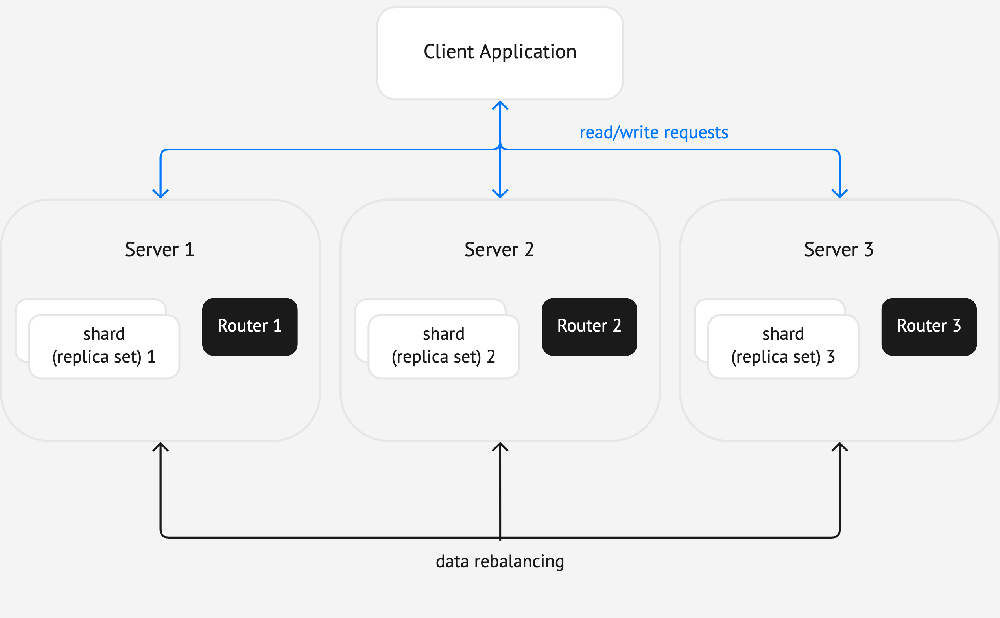

Images
======

Images are useful in explanations of concepts and structures.
When you introduce a term or describe a structure of multiple interconnected parts
(such as a cluster), consider illustrating it with a diagram. If you explain how to
use a GUI, check if a screenshot can make the doc clearer.

Note that illustrations should complement the text, not replace it. Even with an image,
the text should be enough for readers to understand the topic.

Don't overuse images: they are harder to support than text. Use them only if the profit
is obvious.

Diagrams
--------

There is a basic set of diagram elements – blocks, arrows, and other – to use in Tarantool docs.
It is stored in `this Miro board <https://miro.com/app/board/uXjVPbCIj_g=/>`_. It also provides
basic rules for creating diagrams.

Size
~~~~

There are two sizes of diagram elements:

*   **M** with bigger blocks. Use it for diagrams with small number of elements.
*   **S** with smaller blocks. Use it for diagrams with big number of elements.

The diagrams should have the same width. This guarantees that the diagram blocks have the same
size. The examples in the Miro board have frames of the right width. Copy the frame and and place your
diagram in it without changing its width.

Exporting
~~~~~~~~~

To save the diagram to a file:

#.  Make the frame transparent so that it isn't shown in the resulting image (set its color
    to "no color").

#.  Select all elements together with the frame and click **Copy as image**
    in the context menu (under the three dots). The image will
    be copied to the clipboard.

#.  Save it as an image file using any graphic editor, for example, GIMP.

Screenshots
-----------

Take screenshots with any tool you like.

Ensure the screenshot consistency on a page:

*   Screenshots must show the same environment: operating system, product version,
    visual theme, and so on.

*   The configuration and data must be consistent. For example, if you've shown spaces
    with data on a screenshot, following screenshots must have them too.

*   Size and resolution must be the same across the page unless you want to zoom in to
    a specific part of the screen.

Markup
------

Insert the images using the ``image`` directive:

..  code-block:: rst

    ..  image:: images/example_diagram.png
        :alt: Example diagram alt text

Result:

