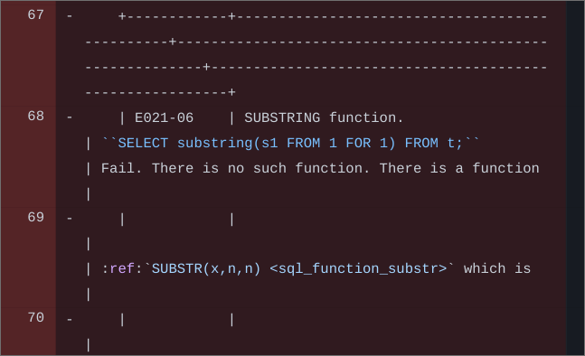

Test image path
===============

Bad example 1:

..  image:: images/dont.png
    :width: 400
    :alt: Don't "draw" tables with ASCII characters

Bad example 2:

..  image:: /images/dont.png
    :width: 400
    :alt: Don't "draw" tables with ASCII characters

Bad example 3:

..  image:: ./images/dont.png
    :width: 400
    :alt: Don't "draw" tables with ASCII characters

Good example 1:

Good example 2:

