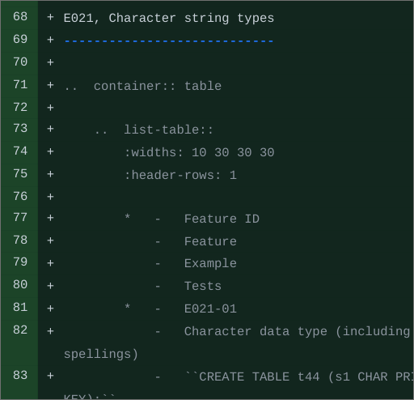

Language and style
==================

General style
-------------

Concise is good
~~~~~~~~~~~~~~~

People usually read technical documentation because they want something
up and running quickly. Write simpler, more concise sentences.

Split the content into smaller paragraphs to improve readability.
This will also eliminate the need for using ``|br|`` and help us translate content faster.
Any paragraph over 6 sentences is large.

Keep your audience in mind
~~~~~~~~~~~~~~~~~~~~~~~~~~

Consider your audience's level. A getting started guide should be written
in simpler terms than an advanced internals description.

If you choose to use metaphors to clarify a concept, make sure they are relatable
for an international audience of IT professionals. 

Don't say "we"
~~~~~~~~~~~~~~

Only use the pronoun "we" in entry-level texts like getting started guides.
In other cases, avoid using "we", because it is unclear who that is exactly.
`Consider how Gentoo does it <https://wiki.gentoo.org/wiki/Gentoo_Wiki:Guidelines#Avoid_first_and_second_person_writing>`__.

Express one idea in a sentence
~~~~~~~~~~~~~~~~~~~~~~~~~~~~~~

Say exactly one thing in a sentence.
If you want to define or clarify something, do it in a separate sentence.
Simple sentences are easier to read, understand and translate.

..  rst-class:: table-example
..  container:: table

    ..  rst-class:: left-align-column-1
    ..  rst-class:: left-align-column-2

    ..  list-table::
        :header-rows: 1

        *   -   Don't
            -   Do

        *   -   Dogs (I have three of them) are my favorite animals.
                Their names are Ace, Bingo and Charm; Charm is the youngest one.

            -   Dogs are my favorite animals.
                I have three of them.
                Their names are Ace, Bingo and Charm.
                Charm is the youngest one.

        *   -   memtx (the in-memory storage engine) is the default and was the first to arrive.
            -   memtx is an in-memory storage engine.
                It is the default and was the first to arrive.

        *   -   The replica set from where the bucket is being migrated is called the source;
                the target replica set where the bucket is being migrated to is called the destination.
            -   The replica set from where the bucket is being migrated is called the source.
                The target replica set where the bucket is being migrated to is called the destination.

Put examples next to theory
~~~~~~~~~~~~~~~~~~~~~~~~~~~

It's best if examples immediately follow the concept they illustrate.
The readers wouldn't want to look for the examples in a different part of the article.

Specify link text
~~~~~~~~~~~~~~~~~

When you provide a :doc:`link </contributing/docs/markup/links>`, clearly specify
where it leads. In this way, you will not mislead the reader.

Bad example:

    For more details, click :doc:`here </contributing/docs/markup/links>`.

    Use :doc:`this </contributing/docs/markup/links>`.

Good example:

    For more details, refer to the documentation on
    :doc:`making links </contributing/docs/markup/links>`.

    Use full :doc:`link names </contributing/docs/markup/links>`.

Formatting
----------

Use lists and tables
~~~~~~~~~~~~~~~~~~~~

Lists and tables help split heavy content into manageable chunks.

To make tables maintainable and easy to translate,
use the ``list-table`` directive, as described in the Tarantool
:doc:`table markup reference </contributing/docs/markup/tables>`.

Translators find it hard to work with content "drawn" with ASCII characters,
because it requires adjusting the number of spaces and manually counting characters.

Bad example:

..  image:: images/dont.png
    :width: 400
    :alt: Don't "draw" tables with ASCII characters

Good example:

Format code as code
~~~~~~~~~~~~~~~~~~~

Format large code fragments using the ``code-block`` directive, indicating the language.
For ``shorter code snippets``, make sure that only code goes in the backticks.
Non-code shouldn't be formatted as code, because this confuses users (and translators, too).
Check our guidelines on
:doc:`writing about code </contributing/docs/markup/code/>`.

For more about formatting, check out the Tarantool
:doc:`markup reference </contributing/docs/markup/>`.

Word choice
-----------

Instance vs server
~~~~~~~~~~~~~~~~~~

We say "instance" rather than "server" to refer to a Tarantool
server instance. This keeps the manual terminology consistent with names like
``/etc/tarantool/instances.enabled`` in the Tarantool environment.

Wrong usage: "Replication allows multiple Tarantool *servers* to work with copies
of the same database."

Correct usage: "Replication allows multiple Tarantool *instances* to work with
copies of the same database."

Don't use i.e. and e.g.
~~~~~~~~~~~~~~~~~~~~~~~

Don't use the following contractions:

*   `"i.e." <https://www.merriam-webster.com/dictionary/i.e.>`_---from
    the Latin "id est". Use "that is" or "which means" instead.
*   `"e.g." <https://www.merriam-webster.com/dictionary/e.g.>`_---from
    the Latin "exempli gratia". Use "for example" or "such as" instead.

Many people, especially non-native English speakers,
aren't familiar with the
`"i.e." and "e.g." contractions
<https://www.merriam-webster.com/words-at-play/ie-vs-eg-abbreviation-meaning-usage-difference>`_
or don't know the difference between them.
For this reason, it's best to avoid using them.

    
Spelling and punctuation
------------------------

Tarantool capitalization
~~~~~~~~~~~~~~~~~~~~~~~~

The word "Tarantool" is capitalized because it's a product name.
The only context where it can start with a lowercase "t" is code.
Learn more about :doc:`code formatting in Tarantool documentation </contributing/docs/markup/code>`.

US vs British spelling
~~~~~~~~~~~~~~~~~~~~~~

Use the US English spelling.

Check your spelling and punctuation
~~~~~~~~~~~~~~~~~~~~~~~~~~~~~~~~~~~

Consider checking spelling, grammar, and punctuation with special tools.

Dashes
~~~~~~

Special symbols like dashes, quotation marks, and apostrophes look the same
across all Tarantool documentation in a single language.
This is because the documentation :doc:`builder </contributing/docs/build/>`
renders specific character sequences in the source into correct typographic characters.

Tarantool documentarians are recommended to use the **en dash** (--) only.
Type two hyphens to insert it: ``--``. Add spaces on both sides of the dash.
Don't use a single hyphen as a dash.

Use the dash for the following purposes:

*   To separate extra information.
*   To mark a break in a sentence.
*   To mark ranges like 4--16 GB (don't surround the dash with spaces in this case).

When indicating a range like ``code element 1``\--``code element 2``, escape the series of hyphens using
`character-level inline markup <https://docutils.sourceforge.io/docs/ref/rst/restructuredtext.html#character-level-inline-markup-1>`_. 
Otherwise, the RST interpreter will perceive the dash as part of the RST syntax:

..  code-block:: rst

    ``box.begin()``\--``box.commit()``

Ending punctuation in lists and tables
~~~~~~~~~~~~~~~~~~~~~~~~~~~~~~~~~~~~~~

The following recommendations are *for the English language only.*
You can find similar guidelines for the Russian language in the
`external reference for Russian proofreaders <http://new.gramota.ru/spravka/letters/83-rubric-77>`__.

Lists
^^^^^

There are two kinds of lists:

*   Where each item forms a complete sentence.
*   Where each item is a phrase of three or less words or a term.

In the former case, start each item with a capital letter and end with a period.
In the latter case, start it with a lowercase letter and
add no ending punctuation (no period, no comma, no semicolon).

A list should be formatted uniformly:
choose the first or second rule for all items in a list.

The above rules are adapted from the
`Microsoft style guide <https://docs.microsoft.com/en-us/style-guide/scannable-content/lists>`__.

The sentence preceding a list can end either with a semicolon or a period.

Don't add redundant conjunctions like "and"/"or" before the last list item.

General English punctuation rules still apply for text in lists.

Tables
^^^^^^

For the text in cells, use periods or other end punctuation
only if the cells contain complete sentences or a mixture of fragments and sentences.
(This is also a
`Microsoft guideline <https://docs.microsoft.com/en-us/style-guide/scannable-content/tables#punctuation>`__
for the English language.)

Besides, make sure that your table punctuation is consistent -- either
all similar list/table items end with a period or they all don't.
In the example below, *all* items in the second column don't have
ending punctuation. Meanwhile, *all* items in the fourth column end with a period,
because they are a mix of fragments and sentences:

..  image:: images/punctuation.png
    :alt: Items in one column have similar ending punctuation

To learn more about table formatting,
check the :doc:`table markup reference </contributing/docs/markup/tables>`.
