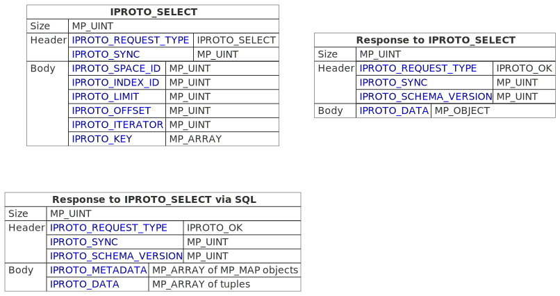
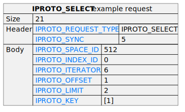
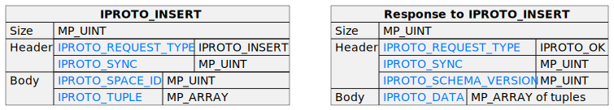
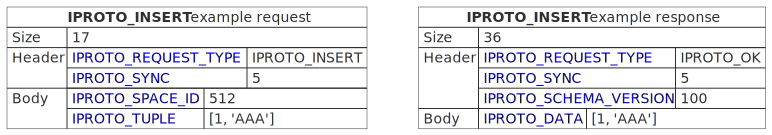

..  _internals-requests_responses:

Client-server requests and responses
====================================

This section describes client requests, their arguments, and the values returned by the server.

Some requests are described on separate pages. Those are the requests related to:

*   :ref:`stream transactions <internals-iproto-streams>`
*   :ref:`asynchronous server-client notifications <internals-events>`
*   :ref:`replication <internals-iproto-replication>`
*   :ref:`SQL <internals-iproto-sql>` --
    :ref:`IPROTO_EXECUTE <box_protocol-execute>` and :ref:`IPROTO_PREPARE <box_protocol-prepare>`.

Overview
--------

..  container:: table

    ..  list-table::
        :header-rows: 1
        :widths: 35 20 45

        *   -   Name
            -   Code
            -   Description

        *   -   :ref:`IPROTO_SELECT <box_protocol-select>`
            -   0x01
            -   :ref:`Select <box_space-select>` request

        *   -   :ref:`IPROTO_INSERT <box_protocol-insert>`
            -   0x02
            -   :ref:`Insert <box_space-insert>` request

        *   -   :ref:`IPROTO_REPLACE <box_protocol-replace>`
            -   0x03
            -   :ref:`Replace <box_space-insert>` request

        *   -   :ref:`IPROTO_UPDATE <box_protocol-update>`
            -   0x04
            -   :ref:`Update <box_space-update>` request

        *   -   :ref:`IPROTO_UPSERT <box_protocol-upsert>`
            -   0x09
            -   :ref:`Upsert <box_space-upsert>` request

        *   -   :ref:`IPROTO_DELETE <box_protocol-delete>`
            -   0x05
            -   :ref:`Delete <box_space-delete>` request

        *   -   :ref:`IPROTO_CALL <box_protocol-call>`
            -   0x0a 
            -   Function remote call (:ref:`conn:call() <net_box-call>`)
        
        *   -   :ref:`IPROTO_AUTH <box_protocol-auth>`
            -   0x07
            -   Authentication request

        *   -   :ref:`IPROTO_EVAL <box_protocol-eval>`
            -   0x08
            -   Evaluate a Lua expression (:ref:`conn:eval() <net_box-eval>`)

        *   -   :ref:`IPROTO_NOP <box_protocol-nop>`
            -   0x0c
            -   Increment the LSN and do nothing else

        *   -   :ref:`IPROTO_PING <box_protocol-ping>`
            -   0x40
            -   Ping (:ref:`conn:ping() <conn-ping>`)

        *   -   :ref:`IPROTO_ID <box_protocol-id>`
            -   0x49
            -   Share iproto version and supported features

..  _box_protocol-select:

IPROTO_SELECT = 0x01
--------------------

See :ref:`space_object:select() <box_space-select>`.
The body is a 6-item map.

Example
~~~~~~~

If the id of 'tspace' is 512 and this is the fifth message, |br|
:samp:`{conn}.`:code:`space.tspace:select({0},{iterator='GT',offset=1,limit=2})` will cause:

In the :ref:`examples <box_protocol-illustration>`,
you can find actual byte codes of an IPROTO_SELECT message.

..  _box_protocol-insert:

IPROTO_INSERT = 0x02
--------------------

See :ref:`space_object:insert()  <box_space-insert>`.
The body is a 2-item map:

For example, if the request is
:samp:`INSERT INTO {table-name} VALUES (1), (2), (3)`, then the response body
contains an :samp:`IPROTO_SQL_INFO` map with :samp:`SQL_INFO_ROW_COUNT = 3`.
:samp:`SQL_INFO_ROW_COUNT` can be 0 for statements that do not change rows,
but can be 1 for statements that create new objects.

Example
~~~~~~~

If the id of 'tspace' is 512 and this is the fifth message, |br|
:samp:`{conn}.`:code:`space.tspace:insert{1, 'AAA'}` will produce the following request and response packets:

The tutorial :ref:`Understanding the binary protocol <box_protocol-illustration>`
shows actual byte codes of the response to the IPROTO_INSERT message.

..  _box_protocol-replace:

IPROTO_REPLACE = 0x03
---------------------

See :ref:`space_object:replace()  <box_space-replace>`.
The body is a 2-item map, the same as for IPROTO_INSERT:

..  cssclass:: highlight
..  parsed-literal::

    # <size>
    msgpack(:samp:`{{MP_UINT unsigned integer = size(<header>) + size(<body>)}}`)
    # <header>
    msgpack({
        IPROTO_REQUEST_TYPE: IPROTO_REPLACE,
        IPROTO_SYNC: :samp:`{{MP_UINT unsigned integer}}`
    })
    # <body>
    msgpack({
        IPROTO_SPACE_ID: :samp:`{{MP_UINT unsigned integer}}`,
        IPROTO_TUPLE: :samp:`{{MP_ARRAY array of field values}}`
    })

Response:

..  cssclass:: highlight
..  parsed-literal::

    # <size>
    msgpack(:samp:`{{MP_UINT unsigned integer = size(<header>) + size(<body>)}}`)
    # <header>
    msgpack({
        Response-Code-Indicator: IPROTO_OK,
        IPROTO_SYNC: :samp:`{{MP_UINT unsigned integer, may be 64-bit}}`,
        IPROTO_SCHEMA_VERSION: :samp:`{{MP_UINT unsigned integer}}`
    })
    # <body>
    msgpack({
        IPROTO_DATA: :samp:`{{any type}}`
    })

For most data-access requests (:ref:`IPROTO_SELECT <box_protocol-select>`,
:ref:`IPROTO_INSERT <box_protocol-insert>`, :ref:`IPROTO_DELETE <box_protocol-delete>`, etc.)
the body is an IPROTO_DATA map with an array of tuples that contain an array of fields.

Response for SQL -- ??? (VALUES or no VALUES? Come up with a REPLACE request and see how it's encoded/decoded)

..  _box_protocol-update:

IPROTO_UPDATE = 0x04
~~~~~~~~~~~~~~~~~~~~

See :ref:`space_object:update()  <box_space-update>`.

The body is usually a 4-item map:

..  cssclass:: highlight
..  parsed-literal::

    # <size>
    msgpack(:samp:`{{MP_UINT unsigned integer = size(<header>) + size(<body>)}}`)
    # <header>
    msgpack({
        IPROTO_REQUEST_TYPE: IPROTO_UPDATE,
        IPROTO_SYNC: :samp:`{{MP_UINT unsigned integer}}`
    })
    # <body>
    msgpack({
        IPROTO_SPACE_ID: :samp:`{{MP_UINT unsigned integer}}`,
        IPROTO_INDEX_ID: :samp:`{{MP_UINT unsigned integer}}`,
        IPROTO_KEY: :samp:`{{MP_ARRAY array of index keys}}`,
        IPROTO_TUPLE: :samp:`{{MP_ARRAY array of update operations}}`
    })

If the operation specifies no values, then IPROTO_TUPLE is a 2-item array: |br|
:samp:`[{MP_STR OPERATOR = '#', {MP_INT FIELD_NO = field number starting with 1}]`.
Normally field numbers start with 1.

If the operation specifies one value, then IPROTO_TUPLE is a 3-item array: |br|
:samp:`[{MP_STR string OPERATOR = '+' or '-' or '^' or '^' or '|' or '!' or '='}, {MP_INT FIELD_NO}, {MP_OBJECT VALUE}]`. |br|

Otherwise IPROTO_TUPLE is a 5-item array: |br|
:samp:`[{MP_STR string OPERATOR = ':'}, {MP_INT integer FIELD_NO}, {MP_INT POSITION}, {MP_INT OFFSET}, {MP_STR VALUE}]`. |br|

Response:

..  cssclass:: highlight
..  parsed-literal::

    # <size>
    msgpack(:samp:`{{MP_UINT unsigned integer = size(<header>) + size(<body>)}}`)
    # <header>
    msgpack({
        Response-Code-Indicator: IPROTO_OK,
        IPROTO_SYNC: :samp:`{{MP_UINT unsigned integer, may be 64-bit}}`,
        IPROTO_SCHEMA_VERSION: :samp:`{{MP_UINT unsigned integer}}`
    })
    # <body>
    msgpack({
        IPROTO_DATA: :samp:`{{any type}}`
    })

For most data-access requests (:ref:`IPROTO_SELECT <box_protocol-select>`,
:ref:`IPROTO_INSERT <box_protocol-insert>`, :ref:`IPROTO_DELETE <box_protocol-delete>`, etc.)
the body is an IPROTO_DATA map with an array of tuples that contain an array of fields.

Response for SQL -- ??? (VALUES or no VALUES? Come up with an UPDATE request and see how it's encoded/decoded)

Example
~~~~~~~

If the id of 'tspace' is 512 and this is the fifth message, |br|
:samp:`{conn}.`:code:`space.tspace:update(999, {{'=', 2, 'B'}})` will cause:

..  code-block:: none

    # <size>
    msgpack(17)
    # <header>
    msgpack({
        IPROTO_REQUEST_TYPE: IPROTO_UPDATE,
        IPROTO_SYNC: 5
    })
    # <body> ... the map-item IPROTO_INDEX_BASE is optional
    msgpack({
        IPROTO_SPACE_ID: 512,
        IPROTO_INDEX_ID: 0,
        IPROTO_INDEX_BASE: 1,
        IPROTO_TUPLE: [['=',2,'B']],
        IPROTO_KEY: [999]
    })

Later in :ref:`Binary protocol -- illustration <box_protocol-illustration>`
we will show actual byte codes of an IPROTO_UPDATE message.

..  _box_protocol-upsert:

IPROTO_UPSERT = 0x09
~~~~~~~~~~~~~~~~~~~~

See :ref:`space_object:upsert()  <box_space-upsert>`.

The body is usually a 4-item map:

..  cssclass:: highlight
..  parsed-literal::

    # <size>
    msgpack(:samp:`{{MP_UINT unsigned integer = size(<header>) + size(<body>)}}`)
    # <header>
    msgpack({
        IPROTO_REQUEST_TYPE: IPROTO_UPSERT,
        IPROTO_SYNC: :samp:`{{MP_UINT unsigned integer}}`
    })
    # <body>
    msgpack({
        IPROTO_SPACE_ID: :samp:`{{MP_UINT unsigned integer}}`,
        IPROTO_INDEX_BASE: :samp:`{{MP_UINT unsigned integer}}`,
        IPROTO_OPS: :samp:`{{MP_ARRAY array of update operations}}`,
        IPROTO_TUPLE: :samp:`{{MP_ARRAY array of primary-key field values}}`
    })

The IPROTO_OPS is the same as the IPROTO_TUPLE of :ref:`IPROTO_UPDATE <box_protocol-update>`.

Response:

..  cssclass:: highlight
..  parsed-literal::

    # <size>
    msgpack(:samp:`{{MP_UINT unsigned integer = size(<header>) + size(<body>)}}`)
    # <header>
    msgpack({
        Response-Code-Indicator: IPROTO_OK,
        IPROTO_SYNC: :samp:`{{MP_UINT unsigned integer, may be 64-bit}}`,
        IPROTO_SCHEMA_VERSION: :samp:`{{MP_UINT unsigned integer}}`
    })
    # <body>
    msgpack({
        IPROTO_DATA: :samp:`{{any type}}`
    })

For most data-access requests (:ref:`IPROTO_SELECT <box_protocol-select>`,
:ref:`IPROTO_INSERT <box_protocol-insert>`, :ref:`IPROTO_DELETE <box_protocol-delete>`, etc.)
the body is an IPROTO_DATA map with an array of tuples that contain an array of fields.

Response for SQL -- ??? (VALUES or no VALUES? Come up with an UPSERT request and see how it's encoded/decoded)

..  _box_protocol-delete:

IPROTO_DELETE = 0x05
~~~~~~~~~~~~~~~~~~~~

See :ref:`space_object:delete()  <box_space-delete>`.
The body is a 3-item map:

..  cssclass:: highlight
..  parsed-literal::

    # <size>
    msgpack(:samp:`{{MP_UINT unsigned integer = size(<header>) + size(<body>)}}`)
    # <header>
    msgpack({
        IPROTO_REQUEST_TYPE: IPROTO_DELETE,
        IPROTO_SYNC: :samp:`{{MP_UINT unsigned integer}}`
    })
    # <body>
    msgpack({
        IPROTO_SPACE_ID: :samp:`{{MP_UINT unsigned integer}}`,
        IPROTO_INDEX_ID: :samp:`{{MP_UINT unsigned integer}}`,
        IPROTO_KEY: :samp:`{{MP_ARRAY array of key values}}`
    })

Response:

..  cssclass:: highlight
..  parsed-literal::

    # <size>
    msgpack(:samp:`{{MP_UINT unsigned integer = size(<header>) + size(<body>)}}`)
    # <header>
    msgpack({
        Response-Code-Indicator: IPROTO_OK,
        IPROTO_SYNC: :samp:`{{MP_UINT unsigned integer, may be 64-bit}}`,
        IPROTO_SCHEMA_VERSION: :samp:`{{MP_UINT unsigned integer}}`
    })
    # <body>
    msgpack({
        IPROTO_DATA: :samp:`{{any type}}`
    })

For most data-access requests (:ref:`IPROTO_SELECT <box_protocol-select>`,
:ref:`IPROTO_INSERT <box_protocol-insert>`, :ref:`IPROTO_DELETE <box_protocol-delete>`, etc.)
the body is an IPROTO_DATA map with an array of tuples that contain an array of fields.

Response for SQL:

Response for SQL:

..  cssclass:: highlight
..  parsed-literal::

    # <size>
    msgpack(32)
    # <header>
    msgpack({
        Response-Code-Indicator: IPROTO_OK,
        IPROTO_SYNC: :samp:`{{MP_UINT unsigned integer, may be 64-bit}}`,
        IPROTO_SCHEMA_VERSION: :samp:`{{MP_UINT unsigned integer}}`
    })
    # <body>
    msgpack({
        IPROTO_METADATA: :samp:`{{array of column maps}}`,
        IPROTO_DATA: :samp:`{{array of tuples}}`
    })

..  _box_protocol-eval:

IPROTO_EVAL = 0x08
------------------

See :ref:`conn:eval() <net_box-eval>`.
Since the argument is a Lua expression, this is
Tarantool's way to handle non-binary with the
binary protocol. Any request that does not have
its own code, for example :samp:`box.space.{space-name}:drop()`,
will be handled either with :ref:`IPROTO_CALL <box_protocol-call>`
or IPROTO_EVAL.
The :ref:`tarantoolctl <tarantoolctl>` administrative utility
makes extensive use of ``eval``.
The body is a 2-item map:

..  cssclass:: highlight
..  parsed-literal::

    # <size>
    msgpack(:samp:`{{MP_UINT unsigned integer = size(<header>) + size(<body>)}}`)
    # <header>
    msgpack({
        IPROTO_REQUEST_TYPE: IPROTO_EVAL,
        IPROTO_SYNC: :samp:`{{MP_UINT unsigned integer}}`
    })
    # <body>
    msgpack({
        IPROTO_EXPR: :samp:`{{MP_STR string}}`,
        IPROTO_TUPLE: :samp:`{{MP_ARRAY array of arguments}}`
    })

Response:

..  cssclass:: highlight
..  parsed-literal::

    # <size>
    msgpack(:samp:`{{MP_UINT unsigned integer = size(<header>) + size(<body>)}}`)
    # <header>
    msgpack({
        Response-Code-Indicator: IPROTO_OK,
        IPROTO_SYNC: :samp:`{{MP_UINT unsigned integer, may be 64-bit}}`,
        IPROTO_SCHEMA_VERSION: :samp:`{{MP_UINT unsigned integer}}`
    })
    # <body>
    msgpack({
        IPROTO_DATA: :samp:`{{any type}}`
    })

- For :ref:`IPROTO_EVAL <box_protocol-eval>` and :ref:`IPROTO_CALL <box_protocol-call>`
  the response body will usually be an array but, since Lua requests can result in a wide variety
  of structures, bodies can have a wide variety of structures.

Response for SQL: ??? (fiure out why CALL and EVAL are the best place for SQL responses, according to locker)

Example
~~~~~~~

If this is the fifth message, :samp:`conn:eval('return 5;')` will cause:

..  code-block:: none

    # <size>
    msgpack(19)
    # <header>
    msgpack({
        IPROTO_SYNC: 5
        IPROTO_REQUEST_TYPE: IPROTO_EVAL
    })
    # <body>
    msgpack({
        IPROTO_EXPR: 'return 5;',
        IPROTO_TUPLE: []
    })

..  _box_protocol-call:

IPROTO_CALL = 0x0a
------------------

See :ref:`conn:call() <net_box-call>`.
This is a remote stored-procedure call. 

The body is a 2-item map:

..  cssclass:: highlight
..  parsed-literal::

    # <size>
    msgpack(:samp:`{{MP_UINT unsigned integer = size(<header>) + size(<body>)}}`)
    # <header>
    msgpack({
        IPROTO_REQUEST_TYPE: IPROTO_CALL,
        IPROTO_SYNC: :samp:`{{MP_UINT unsigned integer}}`
    })
    # <body>
    msgpack({
        IPROTO_FUNCTION_NAME: :samp:`{{MP_STR string}}`,
        IPROTO_TUPLE: :samp:`{{MP_ARRAY array of arguments}}`
    })

The return from conn:call is whatever the function returns.

The response will be a list of values, similar to the
:ref:`IPROTO_EVAL <box_protocol-eval>` response.

Response for SQL: ??? (fiure out why CALL and EVAL are the best place for SQL responses, according to locker)

IPROTO_CALL_16=0x06 Deprecated, use IPROTO_CALL (0x0a) instead

..  _box_protocol-auth:

IPROTO_AUTH = 0x07
------------------

For general information, see the :ref:`Access control <authentication-users>` section in the administrator's guide.

For more on how authentication is handled in the binary protocol,
see the :ref:`Authentication <box_protocol-authentication>` section of this document.

The client sends an authentication packet as an IPROTO_AUTH message:

..  cssclass:: highlight
..  parsed-literal::

    # <size>
    msgpack(:samp:`{{MP_UINT unsigned integer = size(<header>) + size(<body>)}}`)
    # <header>
    msgpack({
        IPROTO_REQUEST_TYPE: IPROTO_AUTH,
        IPROTO_SYNC: :samp:`{{MP_UINT unsigned integer, usually = 1}}`
    })
    # <body>
    msgpack({
        IPROTO_USER_NAME: :samp:`{{MP_STRING string <key>}}`,
        IPROTO_TUPLE: ['chap-sha1', :samp:`{{MP_STRING 20-byte string}}`]
    })

:code:`<key>` holds the user name. :code:`<tuple>` must be an array of 2 fields:
authentication mechanism ("chap-sha1" is the only supported mechanism right now)
and scramble, encrypted according to the specified mechanism.

The server instance responds to an authentication packet with a standard response with 0 tuples.

To see how Tarantool handles this, look at
`net_box.c <https://github.com/tarantool/tarantool/blob/master/src/box/lua/net_box.c>`_
function ``netbox_encode_auth``.

..  _box_protocol-nop:

IPROTO_NOP = 0x0c
-----------------

There is no Lua request exactly equivalent to IPROTO_NOP.
It causes the LSN to be incremented.
It could be sometimes used for updates where the old and new values
are the same, but the LSN must be increased because a data-change
must be recorded.
The body is: nothing.

..  _box_protocol-ping:

IPROTO_PING = 0x40
------------------

See :ref:`conn:ping() <conn-ping>`. The body will be an empty map because IPROTO_PING
in the header contains all the information that the server instance needs.

..  cssclass:: highlight
..  parsed-literal::

    # <size>
    msgpack(5)
    # <header>
    msgpack({
        IPROTO_REQUEST_TYPE: IPROTO_PING,
        IPROTO_SYNC: :samp:`{{MP_UINT unsigned integer}}`
    })

Response:

..  cssclass:: highlight
..  parsed-literal::

    # <size>
    msgpack(:samp:`{{MP_UINT unsigned integer = size(<header>) + size(<body>)}}`)
    # <header>
    msgpack({
        Response-Code-Indicator: IPROTO_OK,
        IPROTO_SYNC: :samp:`{{MP_UINT unsigned integer, may be 64-bit}}`,
        IPROTO_SCHEMA_VERSION: :samp:`{{MP_UINT unsigned integer}}`
    })
    # <body>
    msgpack({
        IPROTO_DATA: :samp:`{{}}`
    })

- For :ref:`IPROTO_PING <box_protocol-ping>` the body will be an empty map.

..  _box_protocol-id:

IPROTO_ID = 0x49
----------------

Clients send this message to inform the server about the protocol version and
features they support. Based on this information, the server can enable or
disable certain features in interacting with these clients.

The body is a 2-item map:

..  cssclass:: highlight
..  parsed-literal::

    # <size>
    msgpack(:samp:`{{MP_UINT unsigned integer = size(<header>) + size(<body>)}}`)
    # <header>
    msgpack({
        IPROTO_REQUEST_TYPE: IPROTO_ID,
        IPROTO_SYNC: :samp:`{{MP_UINT unsigned integer}}`
    })
    # <body>
    msgpack({
        IPROTO_VERSION: :samp:`{{MP_UINT unsigned integer}}}`,
        IPROTO_FEATURES: :samp:`{{MP_ARRAY array of unsigned integers}}}`
    })

IPROTO_ID requests can be processed without authentication.

Response:

- For :ref:`IPROTO_ID <box_protocol-id>`, the response body has the same structure as
  the request body. It informs the client about the protocol version and features
  that the server supports.

