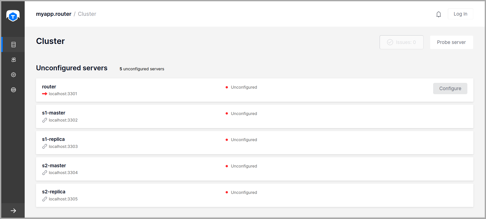
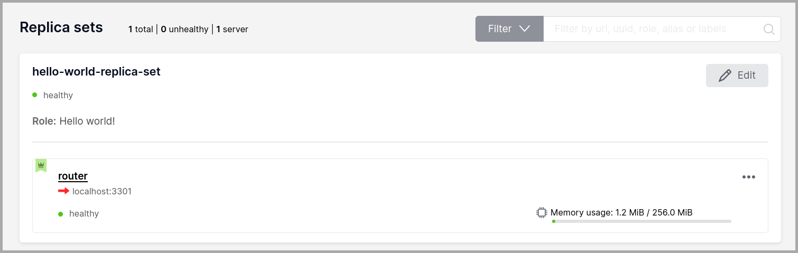
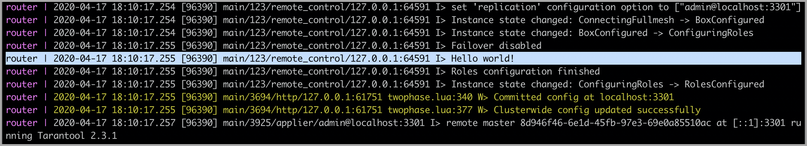

.. _getting_started_cartridge:

================================================================================
Creating your first Tarantool Cartridge application
================================================================================

Here we'll walk you through developing a simple cluster application.

First,
`set up the development environment <https://github.com/tarantool/cartridge-cli#installation>`_.

Next, create an application named ``myapp``. Say:

.. code-block:: console

    $ cartridge create --name myapp

This will create a Tarantool Cartridge application in the ``./myapp`` directory,
with a handful of
:ref:`template files and directories <creating-an-application-from-template>`
inside.

Go inside and make a dry run:

.. code-block:: console

    $ cd ./myapp
    $ cartridge build
    $ cartridge start

This will build the application locally, start 5 instances of Tarantool, and
run the application as it is, with no business logic yet.

Why 5 instances? See the ``instances.yml`` file in your application directory.
It contains the :ref:`configuration <cartridge-deployment>` of all instances
that you can use in the cluster. By default, it defines configuration for 5
Tarantool instances.

.. code-block:: yaml

    myapp.router:
      workdir: ./tmp/db_dev/3301
      advertise_uri: localhost:3301
      http_port: 8081

    myapp.s1-master:
      workdir: ./tmp/db_dev/3302
      advertise_uri: localhost:3302
      http_port: 8082

    myapp.s1-replica:
      workdir: ./tmp/db_dev/3303
      advertise_uri: localhost:3303
      http_port: 8083

    myapp.s2-master:
      workdir: ./tmp/db_dev/3304
      advertise_uri: localhost:3304
      http_port: 8084

    myapp.s2-replica:
      workdir: ./tmp/db_dev/3305
      advertise_uri: localhost:3305
      http_port: 8085

You can already see these instances in the cluster management web interface at
http://localhost:8081 (here 8081 is the HTTP port of the first instance
specified in ``instances.yml``).

Okay, press ``Ctrl + C`` to stop the cluster for a while.

Now it’s time to add some business logic to your application.
This will be an evergreen "Hello world!"" -- just to keep things simple.

Rename the template file ``app/roles/custom.lua`` to ``hello-world.lua``.

.. code-block:: console

    $ mv app/roles/custom.lua app/roles/hello-world.lua

This will be your *role*. In Tarantool Cartridge, a role is a Lua module that
implements some instance-specific functions and/or logic.
Further on we'll show how to add code to a role, build it, enable and test.

There is already some code in the role's ``init()`` function.

.. code-block:: lua
   :emphasize-lines: 5-7

    local function init(opts) -- luacheck: no unused args
        -- if opts.is_master then
        -- end

        local httpd = cartridge.service_get('httpd')
        httpd:route({method = 'GET', path = '/hello'}, function()
            return {body = 'Hello world!'}
        end)

        return true
    end

This exports an HTTP endpoint ``/hello``. For example, http://localhost:8081/hello
if you address the first instance from the ``instances.yml`` file.
If you open it in a browser after enabling the role (we'll do it here a bit later),
you'll see "Hello world!" on the page.

Let's add some more code there.

.. code-block:: lua
   :emphasize-lines: 9-10

    local function init(opts) -- luacheck: no unused args
        -- if opts.is_master then
        -- end

        local httpd = cartridge.service_get('httpd')
        httpd:route({method = 'GET', path = '/hello'}, function()
            return {body = 'Hello world!'}
        end)

        local log = require('log')
        log.info('Hello world!')

        return true
    end

This writes "Hello, world!" to the console when the role gets enabled,
so you'll have a chance to spot this. No rocket science.

Next, amend ``role_name`` in the "return" section of the ``hello-world.lua`` file.
This text will be displayed as a label for your role in the cluster management
web interface.

.. code-block:: lua
   :emphasize-lines: 2

    return {
        role_name = 'Hello world!',
        init = init,
        stop = stop,
        validate_config = validate_config,
        apply_config = apply_config,
    }

The final thing to do before you can run the application is to add your role to
the list of available cluster roles in the ``init.lua`` file.

.. code-block:: lua
   :emphasize-lines: 6

    local ok, err = cartridge.cfg({
        workdir = 'tmp/db',
        roles = {
            'cartridge.roles.vshard-storage',
            'cartridge.roles.vshard-router',
            'app.roles.hello-world'
        },
        cluster_cookie = 'myapp-cluster-cookie',
    })

Now the cluster will be aware of your role.

Why ``app.roles.hello-world``? By default, the role name here should match the
path from the application root (``./myapp``) to the role file
(``app/roles/hello-world.lua``).

Fine! Your role is ready. Re-build the application and re-start the cluster now:

.. code-block:: console

    $ cartridge build
    $ cartridge start

Now all instances are up, but idle, waiting for you to enable roles for them.

Instances (replicas) in a Tarantool Cartridge cluster are organized into
*replica sets*. Roles are enabled per replica set, so all instances in a
replica set have the same roles enabled.

Let's create a replica set containing just one instance and enable your role:

#. Open the cluster management web interface at http://localhost:8081.
#. Click **Configure**.
#. Check the role ``Hello world!`` to enable it. Notice that the role name here
   matches the label text that you specified in the ``role_name`` parameter in
   the ``hello-world.lua`` file.
#. (Optionally) Specify the replica set name, for example
   "hello-world-replica-set".

   .. image:: images/cluster_create_replica_set-border-5px.png
      :align: center
      :scale: 40%

#. Click **Create replica set** and see the newly-created replica set
   in the web interface.

Your custom role got enabled. Find the "Hello world!" message in console,
like this:

Finally, open the HTTP endpoint of this instance at
http://localhost:8081/hello and see the reply to your GET request.

.. image:: images/cluster_hello_http-border-5px.png
   :align: center
   :scale: 40%

Everything is up and running! What's next?

* Follow :ref:`this guide <cartridge-deployment>` to set up the rest of the
  cluster and try some cool cluster management features.
* Get inspired with `these examples <https://github.com/tarantool/examples/>`_
  and implement more sophisticated business logic for your role.
* :ref:`Pack <packing-an-application>` your application for easy distribution.
  Choose what you like: a DEB or RPM package, a TGZ archive, or a Docker image.
