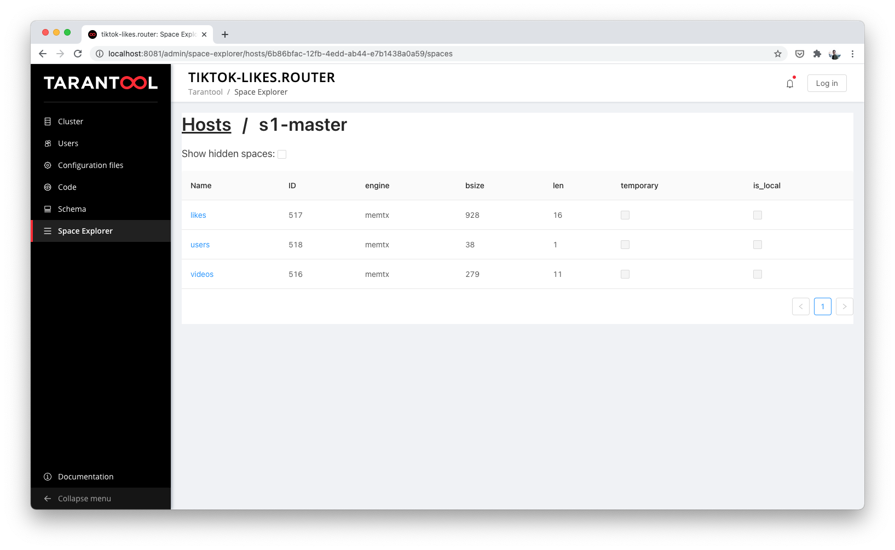

.. _getting_started-imcp:

=================================================================================
Getting started
=================================================================================

This is the recommended guide for getting to know the product.

.. NOTE::
    For some reason you may want :ref:`basic tutorial for Tarantool <getting_started_db>`.
    It launches one Tarantool instance, creates a space, an index, and writes data.

    We advise beginners to go through the current tutorial first and then go back to basic for more in-depth immersion in the product.

If you want to quickly run the finished code from the article, read
:ref:`this section <app_server-launching_app>`.

Installation
~~~~~~~~~~~~

**Launch in the cloud**

This tutorial is available in the cloud. It's free and fastest way to start.
Go to the site `try.tarantool.io <https://try.tarantool.io>`__ and go through this tutorial in the cloud.

However, you will still have to install Tarantool in the future. This is necessary for further acquaintance.

**Run locally**

**For Linux/macOS users:**

- install Tarantool `from the page Download <https://tarantool.io/ru/download>`__
- install the ``cartridge-cli`` utility through your package manager

.. code:: bash

    sudo yum install cartridge-cli

.. code:: bash

    brew install cartridge-cli

Read more about installing the ``cartridge-cli`` utility.
`here <https://github.com/tarantool/cartridge-cli>`__.

- clone the repository `https://github.com/tarantool/getting-started <https://github.com/tarantool/getting-started>`__

In this repository, everything is ready to work - in the folder with the cloned
with an example run:

.. code:: bash

    cartridge build
    cartridge start

Ready! At http://localhost:8081 you will see the Tarantool UI
Cartridge.

**Running in Docker:**

.. code:: bash

    docker run -p 3301:3301 -p 8081:8081 tarantool/getting-started

Ready! At http://localhost:8081 you will see the Tarantool UI.

**For Windows users:**

Use the Docker way to get started.

Where do we start our acquaintance
~~~~~~~~~~~~~~~~~~~~~~~~~~~~~~~~~~

Today we will solve a high-load task for the Tiktok service using
Tarantool.

Usually the most loaded part of such a service is saving likes.
under the video. You will need to create base tables, indexes for searches and in
the end to raise the HTTP API for mobile clients.

You don't need to write additional code. Everything will be implemented on
the Tarantool platform.

If you accidentally did something wrong while following the instructions,
there is a magic button to help you reset all changes.

It is called **"Reset Configuration".** It is located at the top, in
the "Cluster" tab.

Configuring a cluster
~~~~~~~~~~~~~~~~~~~~~

**Everything you need to know to get started:**

The Tarantool cluster has two service roles: router, storage.

- Storage is a data store
- Router is an intermediary between clients and Storage. He accepts
   requests from clients, goes to the required Storage for data and returns
   their client.

On the "Cluster" tab, we see that we have 5
unconfigured instances.

.. figure:: images/hosts-list.png
   :alt: List of all nodes

   List of all nodes

Let's create one Router and one Storage to start.

First, click the “Configure” button on the “router” instance and configure
its like in the screenshot below:

.. figure:: images/router-configuration.png
   :alt: Configuring router

   Configuring router

Next, we configure the “s1-master” instance:

.. figure:: images/storage-configuration.png
   :alt: Configuring s1-master

   Configuring s1-master

It will look something like this:

.. figure:: images/first-configuration-result.png
   :alt: Cluster view after first setup

   Cluster view after first setup

Let's enable sharding in the cluster using the “Bootstrap vshard” button. She
located on the top right.

Create a data schema
~~~~~~~~~~~~~~~~~~~~

Let's start with the data schema: take a look at the "Code" tab. She is situated
left.

Here we can create a file called schema.yml. In it you can
describe the data schema for the entire cluster, edit the current schema,
validate it for correctness and apply it to the entire cluster.

Let's create the required tables. Tarantool calls them spaces.
(space).

We need to store:

- users
- video with their descriptions
- likes for each video

**To load the schema into the cluster, create a file `` schema.yml``.
Copy and paste the schematic into this file. Click on the “Apply” button.
After that, the data schema will be described in the cluster.**

This is how our data schema will look like:

   .. code:: yaml

      spaces:
        users:
          engine: memtx
          is_local: false
          temporary: false
          sharding_key:
          - "user_id"
          format:
          - {name: bucket_id, type: unsigned, is_nullable: false}
          - {name: user_id, type: uuid, is_nullable: false}
          - {name: fullname, type: string, is_nullable: false}
          indexes:
          - name: user_id
            unique: true
            parts: [{path: user_id, type: uuid, is_nullable: false}]
            type: HASH
          - name: bucket_id
            unique: false
            parts: [{path: bucket_id, type: unsigned, is_nullable: false}]
            type: TREE
        videos:
          engine: memtx
          is_local: false
          temporary: false
          sharding_key:
          - "video_id"
          format:
          - {name: bucket_id, type: unsigned, is_nullable: false}
          - {name: video_id, type: uuid, is_nullable: false}
          - {name: description, type: string, is_nullable: true}
          indexes:
          - name: video_id
            unique: true
            parts: [{path: video_id, type: uuid, is_nullable: false}]
            type: HASH
          - name: bucket_id
            unique: false
            parts: [{path: bucket_id, type: unsigned, is_nullable: false}]
            type: TREE

        likes:
          engine: memtx
          is_local: false
          temporary: false
          sharding_key:
          - "video_id"
          format:
          - {name: bucket_id, type: unsigned, is_nullable: false}
          - {name: like_id, type: uuid, is_nullable: false}
          - {name: user_id, type: uuid, is_nullable: false}
          - {name: video_id, type: uuid, is_nullable: false}
          - {name: timestamp, type: string, is_nullable: true}
          indexes:
          - name: like_id
            unique: true
            parts: [{path: like_id, type: uuid, is_nullable: false}]
            type: HASH
          - name: bucket_id
            unique: false
            parts: [{path: bucket_id, type: unsigned, is_nullable: false}]
            type: TREE

Everything is simple here. Consider the important points.

Tarantool has two built-in storage engines: memtx and vinyl. First
stores all data in RAM, while writing asynchronously to
disk so nothing gets lost.

The second Vinyl engine is a classic engine for storing data on
hard drive. It is optimized for a lot of write operations
data.

For the Tiktok service, a large number of simultaneous readings and
posts: users watch videos, like and comment on them.
Therefore, we use memtx.

We have specified in the configuration three spaces (tables) in memtx and for each of
spaces indicated the required indices.

There are two of them for each space:

- the first is the primary key. Required to read/write
   data
- the second is the index for the bucket_id field. This field is service and
   used for sharding.

**Important:**The name ``bucket_id`` is reserved. If you choose
another name, then sharding will not work for this space.
If sharding is not used in the project, then it can be removed.

To understand which field to shard data by, Tarantool uses
``sharding_key``. ``sharding_key`` points to fields in the space, by
to which the records will be sharded. There may be several of them. In this example
we will only use one field. Tarantool will take a hash from this field
upon insertion, it will calculate the bucket number and select the required Storage for recording.

Yes, buckets can be repeated, and each Storage stores a specific
range of buckets.

A couple more little things for the curious:

- The ``parts`` field in the index description can contain several fields for
   in order to build a composite index. In this task, he does not
   required.
- Tarantool does not support Foreign key or "foreign key", so in
   the space ``likes`` needs to manually check when inserting that such
   ``video_id`` and ``user_id`` exist.

We write the data [5 minutes]
~~~~~~~~~~~~~~~~~~~~~~~~~~~

We will write data to the Tarantool cluster using the CRUD module. This
the module itself determines from which shard to read and to which shard to write and
does it for you.

Important: all operations on the cluster must be performed only on the router.
and using the CRUD module.

Let's connect the CRUD module in code and write three procedures:

- user creation
- adding video
- like video

**The procedures must be described in a special file. To do this, go to
the “Code” tab. Create a new directory called “extensions”. AND
in this directory create a file “api.lua”.**

Paste the code described below into this file and click on the “Apply” button.

.. code:: lua

   local cartridge = require('cartridge')
   local crud = require('crud')
   local uuid = require('uuid')
   local json = require('json')

   function add_user(request)
       local fullname = request:post_param("fullname")
       local result, err = crud.insert_object('users', {user_id = uuid.new(), fullname = fullname})
       if err ~ = nil then
           return {body = json.encode({status = "Error!", error = err}), status = 500}
       end

       return {body = json.encode({status = "Success!", result = result}), status = 200}
   end

   function add_video(request)
       local description = request:post_param("description")
       local result, err = crud.insert_object('videos', {video_id = uuid.new(), description = description})
       if err ~= nil then
           return {body = json.encode({status = "Error!", error = err}), status = 500}
       end

       return {body = json.encode({status = "Success!", result = result}), status = 200}
   end

   function like_video(request)
       local video_id = request: post_param("video_id")
       local user_id = request: post_param("user_id")

       local result, err = crud.insert_object('likes', {like_id = uuid.new(),
                                                   video_id = uuid.fromstr(video_id),
                                                   user_id = uuid.fromstr(user_id)})
       if err ~= nil then
           return {body = json.encode({status = "Error!", error = err}), status = 500}
       end

       return {body = json.encode({status = "Success!", result = result}), status = 200}
   end

   return {
       add_user = add_user,
       add_video = add_video,
       like_video = like_video,
   }

Raising the HTTP API
~~~~~~~~~~~~~~~~~~~~

Clients will visit the Tarantool cluster using the HTTP protocol. In the cluster
already has its own built-in HTTP server.

**To configure HTTP paths, you need to write a configuration
file. To do this, go to the “Code” tab. Create file “config.yml”
in the "extensions" directory. You created it in the last step.**

Paste the configuration example described below into this file and click on
the “Apply” button.

.. code:: yaml

   ---
    functions:

      customer_add:
        module: extensions.api
        handler: add_user
        events:
        - http: {path: "/add_user", method: POST}

      account_add:
        module: extensions.api
        handler: add_video
        events:
        - http: {path: "/add_video", method: POST}

      transfer_money:
        module: extensions.api
        handler: like_video
        events:
        - http: {path: "/like_video", method: POST}
   ...

Ready! Let's make test requests from the console:

.. code:: bash

   curl -X POST --data "fullname = Taran Tool" <ip:port>/add_user

Created a user and got its UUID. Let's remember it.

.. code:: bash

   curl -X POST --data "description = My first tiktok" <ip:port>/add_video

Let's say a user has added their first video with a description. Also
got the UUID of the video clip. Let's remember it too.

In order to "like" the video, you need to specify the user UUID and UUID
video. Let's substitute it from the first two steps for the place of the trotting below.

.. code:: bash

   curl -X POST --data "video_id = ... & user_id = ..." <ip: port>/like_video

It will turn out something like this:

.. figure:: images/console.png
   :alt: Test queries in the console

   Test queries in the console

In our example, you can "like" the video as many times as you like. At least in
in real life it makes no sense, but it will help us understand how
sharding works. More precisely, the ``sharding_key`` parameter.

For the ``likes`` space, we specified ``sharding_key`` - ``video_id``. Such
we also specified ``sharding_key`` for the ``videos`` space. It means,
that likes will be stored on the same Storage where they are stored and
video. This ensures data locality during storage and allows
get the information you need in one network trip to Storage.

More details are described in the next step.

Looking at the data
~~~~~~~~~~~~~~~~~~~

Go to the "Space-Explorer" tab and see all the nodes in the cluster. Because
we have only one Storage and one Router raised so far, then the data is stored
on only one node.

Go to the node ``s1-master``: click "Connect" and select the desired
space for us.

We look that everything is in place and move on.

.. figure:: images/hosts.png
   :alt: Space Explorer, host list

   Space Explorer, host list

.. figure:: images/likes.png
   :alt: Space Explorer, view likes

   Space Explorer, viewing likes

Please note: the space-explorer tool is only available in
Enterprise version of the product and in the cloud Try service.
In the open-source version, the data can be viewed through the console.

Read more in `data viewing documentation <https://www.tarantool.io/ru/doc/latest/reference/reference_lua/box_space/select/>`__.
And about connecting to a Tarantool instance :ref:`read in the basic Tarantool manual <getting_started_db>`.

Scaling the cluster
~~~~~~~~~~~~~~~~~~~

Let's create a second shard. Click on the "Cluster" tab, select
``s2-master`` and click "Configure". We choose the roles as in the picture:

   Space Explorer host s1-master

.. figure:: images/configuring-server.png
   :alt: Cluster, new shard configuration screen

   Cluster, new shard configuration screen

We silk on the necessary roles and create a shard (replica set).

The nodes `` s1-replica``, ``s2-replica`` are added as replicas to the first and
the second shard corresponds responsibly.

Watching how sharding works
~~~~~~~~~~~~~~~~~~~~~~~~~~~

Now we have two shards - two logical nodes that will
share data among themselves. The router itself decides which data on which
put the shard. By default, it just uses the hash function from the field
the ``sharding_key`` we specified in the DDL.

To use a new shard, you need to set its weight to one.
Go back to the "Cluster" tab and go to the ``s2-master`` settings
and set the Replica set weight to 1 and apply.

Something has already happened. Let's go to space-explorer and go to the node
``s2-master``. It turns out that some of the data from the first shard moved here
automatically! Scaling is automatic.

Now let's try to add more new data to the cluster via the HTTP API.
We can check and make sure that the new data is also evenly
distributed over two shards.

One shard must be turned off for a while
~~~~~~~~~~~~~~~~~~~~~~~~~~~~~~~~~~~~~~~~

In the ``s1-master`` settings, set Replica set weight to 0 and
we apply. Let's wait a couple of seconds and go to space-explorer and look at
data in ``s2-master``: all data automatically migrated to
remaining shard.

Now we can safely disable the first shard if you need it
to carry out official work.

Read also
~~~~~~~~~

- README module `DDL <https://github.com/tarantool/ddl>`__ to create
   its data schema
- README of the module `CRUD <https://github.com/tarantool/crud>`__ to
   learn more about the API and implement your own requests for the cluster

Continue to the next steps of the tutorial: the button is located on the bottom right or in the table of contents on the left.