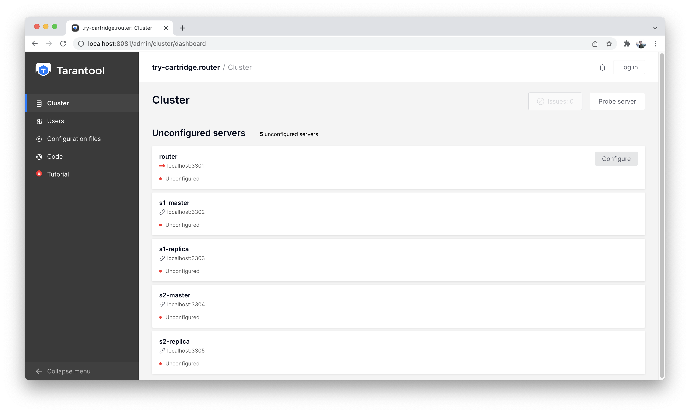
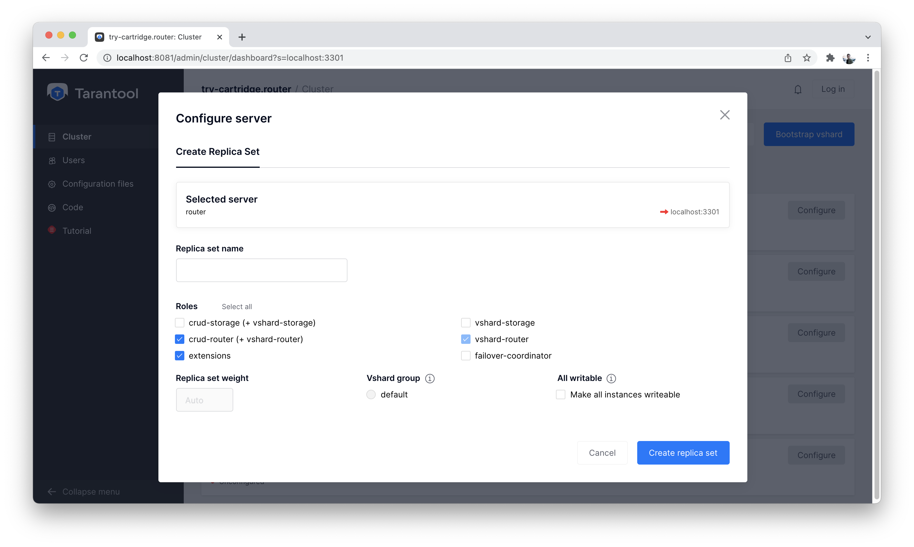
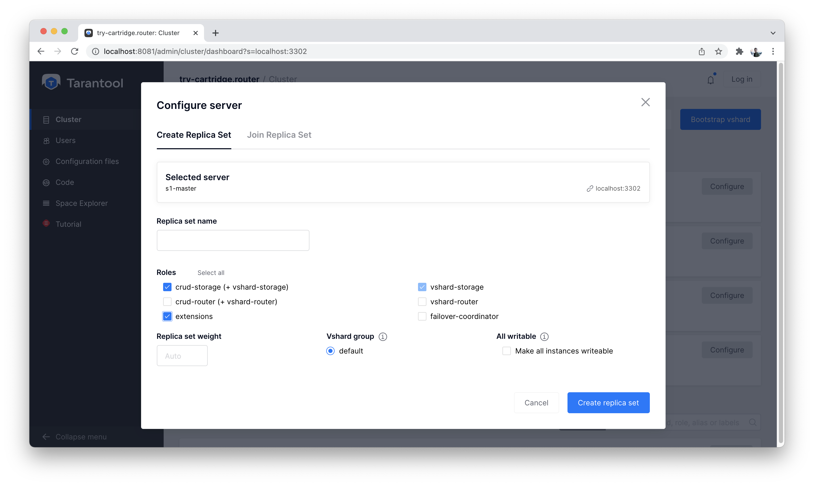
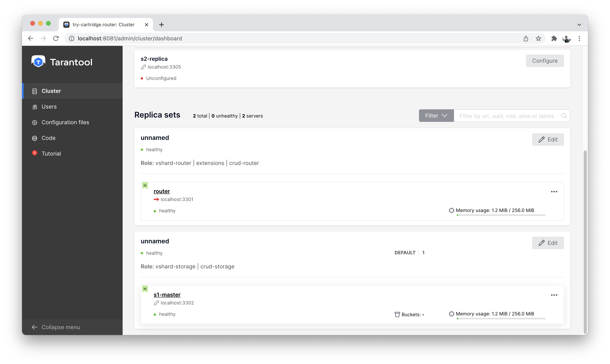
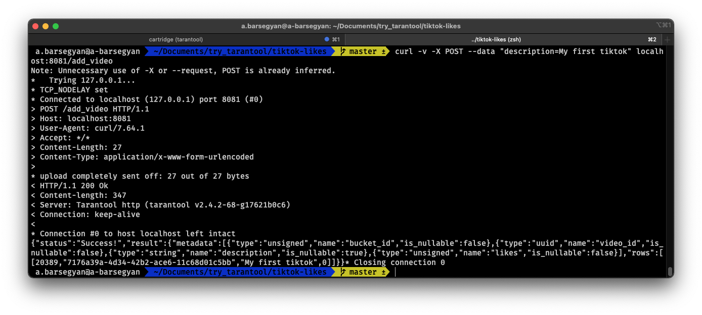
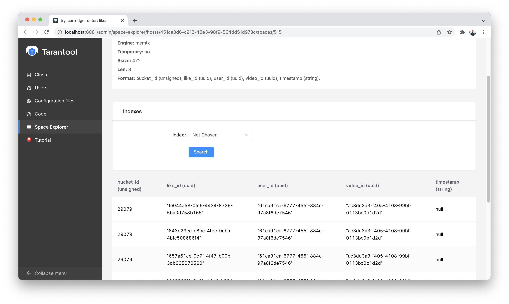
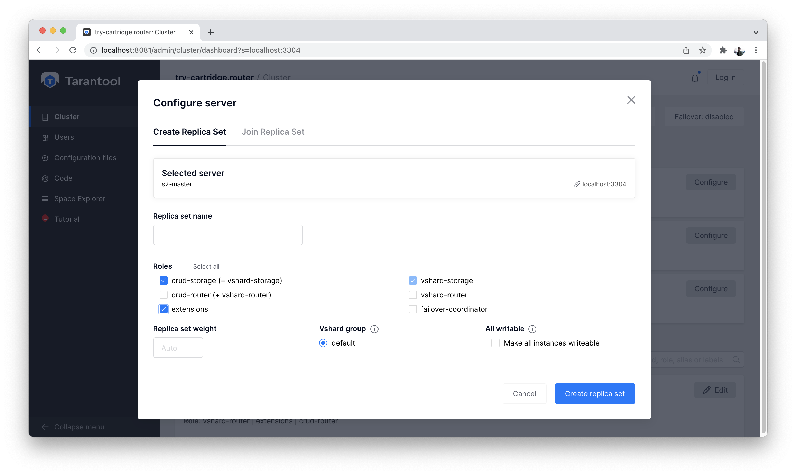

.. _getting_started-imcp:

First steps
===========

This is the recommended guide for getting to know the product.

..  note::

    You also might want to check out our
    :ref:`basic Tarantool tutorial <getting_started_db>`.
    It shows how to launch one Tarantool instance,
    create a space, build an index, and write data.

    We recommend that beginners go through the current tutorial first
    and then see the basic tutorial to dive deeper into the product.

If you just want to run the complete tutorial code quickly, go to
:ref:`Launching an application <app_server-launching_app>`.

Installation
~~~~~~~~~~~~

**Launch in the cloud**

This tutorial is also available in the cloud. It's free, and it's the fastest way to start.
To follow this tutorial in the cloud, go to `try.tarantool.io <https://try.tarantool.io>`__.

However, you will still need to install Tarantool
if you want to get better acquainted with it.

**Run locally**

**For Linux/macOS users:**

*  Install Tarantool from the `Download page <https://tarantool.io/ru/download>`__.
*  Install the ``cartridge-cli`` utility through your package manager:

   ..  code-block:: bash

      sudo yum install cartridge-cli

   ..  code-block:: bash

      brew install cartridge-cli

   To learn more, check the ``cartridge-cli``
   :doc:`installation guide </book/cartridge/cartridge_cli/installation/>`.

* Clone the `Getting Started tutorial repository <https://github.com/tarantool/getting-started>`__.

   Everything is ready and organized in this repository.
   In the cloned directory, run the following:

   ..  code-block:: bash

       cartridge build
       cartridge start

You're all set! At http://localhost:8081, you will see the Tarantool Cartridge UI.

**Running in Docker:**

..  code-block:: bash

    docker run -p 3301:3301 -p 8081:8081 tarantool/getting-started

That's it! At http://localhost:8081, you will see the Tarantool Cartridge UI.

**For Windows users:**

Use Docker to get started.

Getting to know Tarantool
~~~~~~~~~~~~~~~~~~~~~~~~~

Today, we will solve a high-performance challenge for TikTok using
Tarantool.

You will implement a counter of likes for videos.
First, you will create base tables and search indexes.
Then you will set up an HTTP API for mobile clients.

The challenge doesn't require you to write any additional code.
Everything will be implemented on the Tarantool platform.

If you accidentally do something wrong while following the instructions,
there is a magic button to help you reset all changes.
It is called **"Reset Configuration"**.  You can find it at the top of the "Cluster" page.

Configuring a cluster [1 minute]
~~~~~~~~~~~~~~~~~~~~~~~~~~~~~~~~

**Everything you need to know to get started:**

A Tarantool cluster has two service roles: router and storage.

*  Storage is used to store data.
*  Router is an intermediary between clients and storages.
   It accepts a client's request, takes data from the proper storage,
   and returns it to the client.

We see that we have 5 unconfigured instances on the "Cluster" tab.

    List of all nodes

Let's create one router and one storage for a start.

First, click the "Configure" button on the "router" instance and configure
it as in the screenshot below:

    Configuring a router

Next, we configure the "s1-master" instance:

    Configuring s1-master

It will look something like this:

    Cluster view after first setup

Let's enable sharding in the cluster using the "Bootstrap vshard" button. It is
located in the top right corner.

Creating a data schema [2 minutes]
~~~~~~~~~~~~~~~~~~~~~~~~~~~~~~~~~~

Let's start with the data schema---take a look at the "Code" tab on the left.

Here we can create a file called ``schema.yml``. In this file, you can
describe the entire cluster's data schema, edit the current schema,
validate its correctness, and apply it to the whole cluster.

First, let's create the necessary tables. In Tarantool, they are called spaces.

We need to store:

*  Users
*  Videos with descriptions
*  Likes for each video

Create a ``schema.yml`` file to load the schema into the cluster.
Copy and paste schema to this file. Click the "Apply" button.
After that, the data schema will be described in the cluster.

This is what our data schema will look like:

   ..  code-block:: yaml

       spaces:
         users:
           engine: memtx
           is_local: false
           temporary: false
           sharding_key:
           - "user_id"
           format:
           - {name: bucket_id, type: unsigned, is_nullable: false}
           - {name: user_id, type: uuid, is_nullable: false}
           - {name: fullname, type: string, is_nullable: false}
           indexes:
           - name: user_id
             unique: true
             parts: [{path: user_id, type: uuid, is_nullable: false}]
             type: HASH
           - name: bucket_id
             unique: false
             parts: [{path: bucket_id, type: unsigned, is_nullable: false}]
             type: TREE
         videos:
           engine: memtx
           is_local: false
           temporary: false
           sharding_key:
           - "video_id"
           format:
           - {name: bucket_id, type: unsigned, is_nullable: false}
           - {name: video_id, type: uuid, is_nullable: false}
           - {name: description, type: string, is_nullable: true}
           indexes:
           - name: video_id
             unique: true
             parts: [{path: video_id, type: uuid, is_nullable: false}]
             type: HASH
           - name: bucket_id
             unique: false
             parts: [{path: bucket_id, type: unsigned, is_nullable: false}]
             type: TREE

         likes:
           engine: memtx
           is_local: false
           temporary: false
           sharding_key:
           - "video_id"
           format:
           - {name: bucket_id, type: unsigned, is_nullable: false}
           - {name: like_id, type: uuid, is_nullable: false}
           - {name: user_id, type: uuid, is_nullable: false}
           - {name: video_id, type: uuid, is_nullable: false}
           - {name: timestamp, type: string, is_nullable: true}
           indexes:
           - name: like_id
             unique: true
             parts: [{path: like_id, type: uuid, is_nullable: false}]
             type: HASH
           - name: bucket_id
             unique: false
             parts: [{path: bucket_id, type: unsigned, is_nullable: false}]
             type: TREE

It's simple. Let's take a closer look at the essential points.

Tarantool has two built-in storage engines: memtx and vinyl.
memtx stores all data in RAM while asynchronously writing to
disk so that nothing gets lost.

Vinyl is a classic engine for storing data on the
hard drive. It is optimized for write-intensive scenarios.

In TikTok, there are a lot of simultaneous readings and
posts: users watch videos, like them, and comment on them.
Therefore, let's use memtx.

The configuration above describes three memtx spaces (tables)
and the necessary indexes for each of the spaces.

Each space has two indexes:

*  The primary key, which is required to read/write data.
*  An index on the bucket_id field, which is a service field used for sharding.

**Important:** The name ``bucket_id`` is reserved. If you choose
another name, sharding won't work for this space.
If you don't use sharding in your project, you can remove the second index.

To understand which field to shard data by, Tarantool uses
``sharding_key``. ``sharding_key`` points to fields in the space by
which database records will be sharded. There can be more than one such field, but
in this example, we will only use one. When some data is inserted,
Tarantool forms a hash from this field, calculates the bucket number,
and selects the storage to record the data into.

Yes, buckets can repeat, and each storage stores a specific range of buckets.

Here are a couple more interesting facts:

*   The ``parts`` field in the index description can contain several fields,
    which allows building a composite index. You won't need it in this tutorial.
*   Tarantool does not support foreign keys, so you have to check manually
    upon insertion
    that ``video_id`` and ``user_id`` exist in the ``likes`` space.

Writing data [5 minutes]
~~~~~~~~~~~~~~~~~~~~~~~~

We will write data to the Tarantool cluster using the CRUD module.
You don't have to specify the shard you want to read from or write to---the module
does it for you.

**Important:** All cluster operations must be performed only on the router
and using the CRUD module.

Let's connect the CRUD module in the code and write three procedures:

*   User creation
*   Adding a video
*   Liking a video

The procedures must be described in a special file. To do this, go to
the "Code" tab. Create a new directory called ``extensions``, and
in this directory, create the file ``api.lua``.

Paste the code below into ``api.lua`` and click "Apply".

..  code-block:: lua

    local cartridge = require('cartridge')
    local crud = require('crud')
    local uuid = require('uuid')
    local json = require('json')

    function add_user(request)
        local fullname = request:post_param("fullname")
        local result, err = crud.insert_object('users', {user_id = uuid.new(), fullname = fullname})
        if err ~= nil then
            return {body = json.encode({status = "Error!", error = err}), status = 500}
        end

        return {body = json.encode({status = "Success!", result = result}), status = 200}
    end

    function add_video(request)
        local description = request:post_param("description")
        local result, err = crud.insert_object('videos', {video_id = uuid.new(), description = description})
        if err ~= nil then
            return {body = json.encode({status = "Error!", error = err}), status = 500}
        end

        return {body = json.encode({status = "Success!", result = result}), status = 200}
    end

    function like_video(request)
        local video_id = request:post_param("video_id")
        local user_id = request:post_param("user_id")
 
        local result, err = crud.insert_object('likes', {like_id = uuid.new(),
                                                    video_id = uuid.fromstr(video_id),
                                                    user_id = uuid.fromstr(user_id)})
        if err ~= nil then
            return {body = json.encode({status = "Error!", error = err}), status = 500}
        end
 
        return {body = json.encode({status = "Success!", result = result}), status = 200}
    end

    return {
        add_user = add_user,
        add_video = add_video,
        like_video = like_video,
    }

Setting up HTTP API [2 minutes]
~~~~~~~~~~~~~~~~~~~~~~~~~~~~~~~

Clients will visit the Tarantool cluster using the HTTP protocol.
The cluster already has a built-in HTTP server.

To configure HTTP paths, you need to write a configuration
file. Go to the "Code" tab. Create the file ``config.yml``
in the ``extensions`` directory, which you created on the last step.

Paste the configuration example below into ``config.yml`` and click "Apply".

..  code-block:: yaml

    ---
     functions:
  
       add_user:
         module: extensions.api
         handler: add_user
         events:
         - http: {path: "/add_user", method: POST}

       add_video:
         module: extensions.api
         handler: add_video
         events:
         - http: {path: "/add_video", method: POST}

       like_video:
         module: extensions.api
         handler: like_video
         events:
         - http: {path: "/like_video", method: POST}
    ...

Done! Let's make test requests from the console.

..  code-block:: bash

    curl -X POST --data "fullname=Taran Tool" url/add_user

..  note::
    
    In the requests, substitute ``url`` with the address of your sandbox.
    The protocol must be strictly HTTP.

    For example, if you're following this tutorial with Try Tarantool, this request will look something like this
    (note that your hash is different):

    ..  code-block:: bash

        curl -X POST --data "fullname=Taran Tool" http://artpjcvnmwctc4qppejgf57.try.tarantool.io/add_user

    But if you've bootstrapped Tarantool locally, the request will look as follows:

    ..  code-block:: bash

        curl -X POST --data "fullname=Taran Tool" http://localhost:8081/add_user

We've just created a user and got their UUID. Let's remember it.

..  code-block:: bash

    curl -X POST --data "description=My first tiktok" url/add_video

Let's say a user has added their first video with a description.
The video clip also has a UUID. Let's remember it, too.

In order to "like" the video, you need to specify the user UUID and the video UUID from the previous steps.
Substitute the ellipses in the command below with the corresponding UUIDs:

..  code-block:: bash

    curl -X POST --data "video_id=...&user_id=..." url/like_video

The result will be something like this:

    Test queries in the console

In our example, you can "like" the video as many times as you want.
It makes no sense in the real life, but it will help us understand how
sharding works---more precisely, the ``sharding_key`` parameter.

Our ``sharding_key`` for the ``likes`` is ``video_id``.
We also specified a ``sharding_key`` for the ``videos`` space. It means
that likes will be stored on the same storage as videos.
This ensures data locality with regard to storage and allows
getting all the information you need in one network trip to Storage.

More details are described on the next step.

Looking at the data [1 minute]
~~~~~~~~~~~~~~~~~~~~~~~~~~~~~~

..  note::
    
    The following instructions are for Tarantool Enterprise Edition and the Try Tarantool cloud service.

    The Space-Explorer tool is unavailable in the open-source version. Use the console to view data.

    Check our documentation to learn more about :doc:`data viewing </reference/reference_lua/box_space/select/>`.
    To learn how to connect to a Tarantool instance, :ref:`read the basic Tarantool manual <getting_started_db>`.

Go to the "Space-Explorer" tab to see all the nodes in the cluster.
As we have only one storage and one router started so far, the data is stored
on only one node.

Let's go to the node ``s1-master``: click "Connect" and select the necessary space.
Check that everything is in place and move on.

..  figure:: images/hosts.png
    :alt: Space Explorer, host list

    Space Explorer, host list

    Space Explorer, viewing likes

Scaling the cluster [1 minute]
~~~~~~~~~~~~~~~~~~~~~~~~~~~~~~

Let's create a second shard. Click on the "Cluster" tab, select
``s2-master``, and click "Configure". Select the roles as shown in the picture:

    Cluster, new shard configuration screen

Click on the necessary roles and create a shard (replica set).

Checking how sharding works [1 minute]
~~~~~~~~~~~~~~~~~~~~~~~~~~~~~~~~~~~~~~

Now we have two shards---two logical nodes that
share data among themselves. The router decides what piece of data goes to what shard.
By default, the router uses the hash function from the field ``sharding_key``
we've specified in the DDL.

To enable a new shard, you need to set its weight to one.
Go back to the "Cluster" tab, open the ``s2-master`` settings,
set the Replica set weight to 1, and apply.

Something has already happened. Let's go to Space-Explorer and check the node
``s2-master``. It turns out that some of the data from the first shard
has already migrated here! The scaling is done automatically.

Now let's try adding more data to the cluster via the HTTP API.
We can check back later and make sure that the new data is also evenly
distributed across the two shards.

Disconnecting a shard for a while [1 minute]
~~~~~~~~~~~~~~~~~~~~~~~~~~~~~~~~~~~~~~~~~~~~

In the ``s1-master`` settings, set Replica set weight to 0 and
apply. Wait for a few seconds, then go to Space-Explorer and look at the
data in ``s2-master``. You will see that all the data has been migrated to
the remaining shard automatically.

Now we can safely disable the first shard for maintenance.

See also
~~~~~~~~

*   README of the `DDL <https://github.com/tarantool/ddl>`__ module to create
    your own data schema.
*   README of the `CRUD <https://github.com/tarantool/crud>`__ module to
    learn more about the API and create your own cluster queries.

To continue to the next steps of the tutorial,
click the button in the bottom right corner
or select the section in the table of contents on the left.
