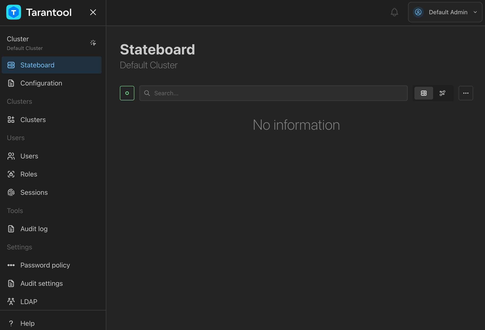
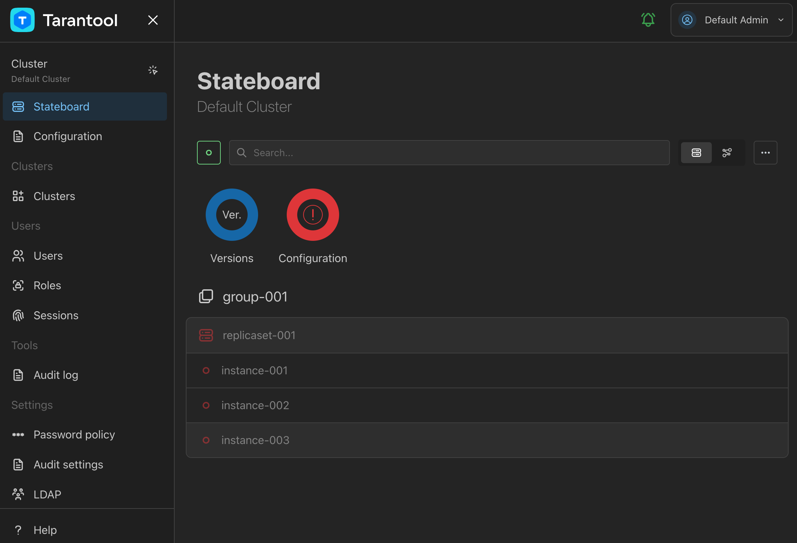
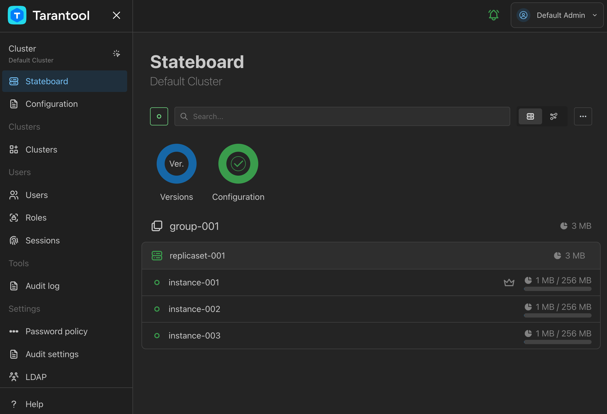
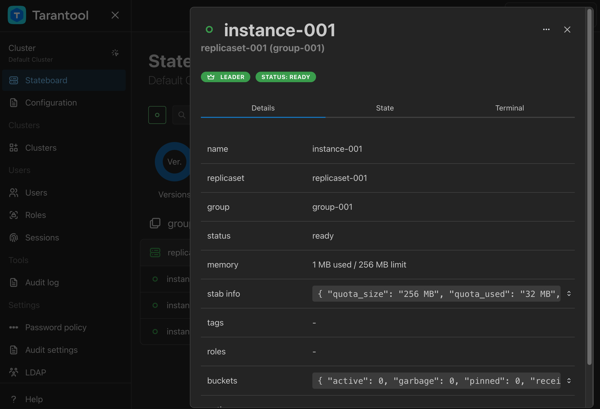
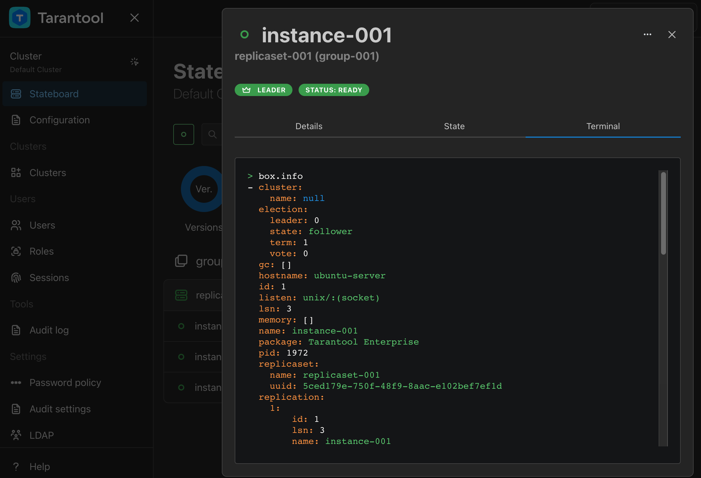
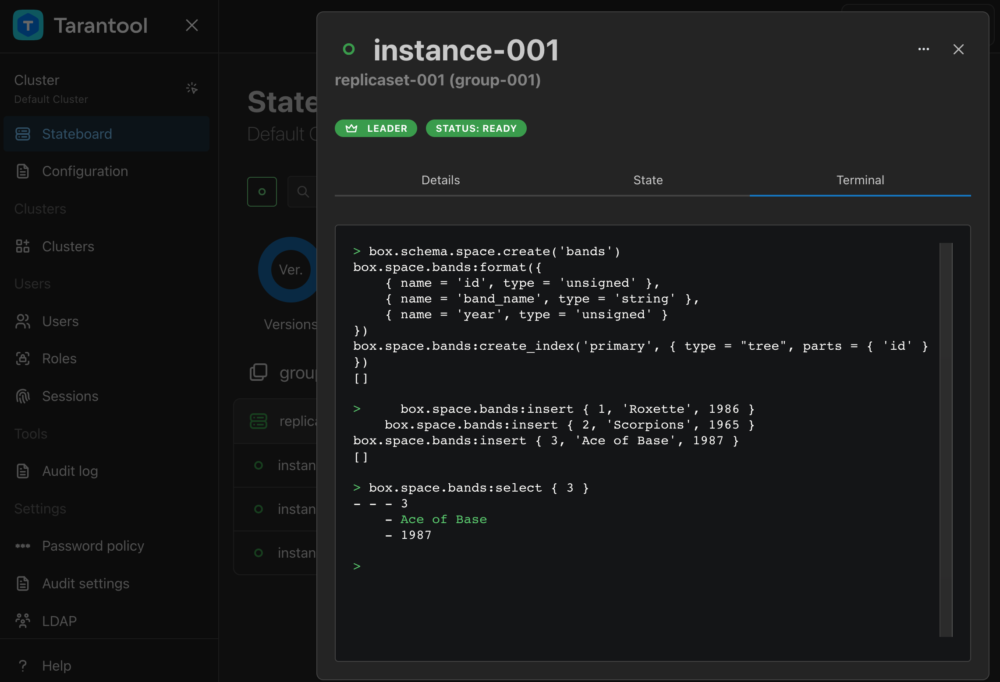
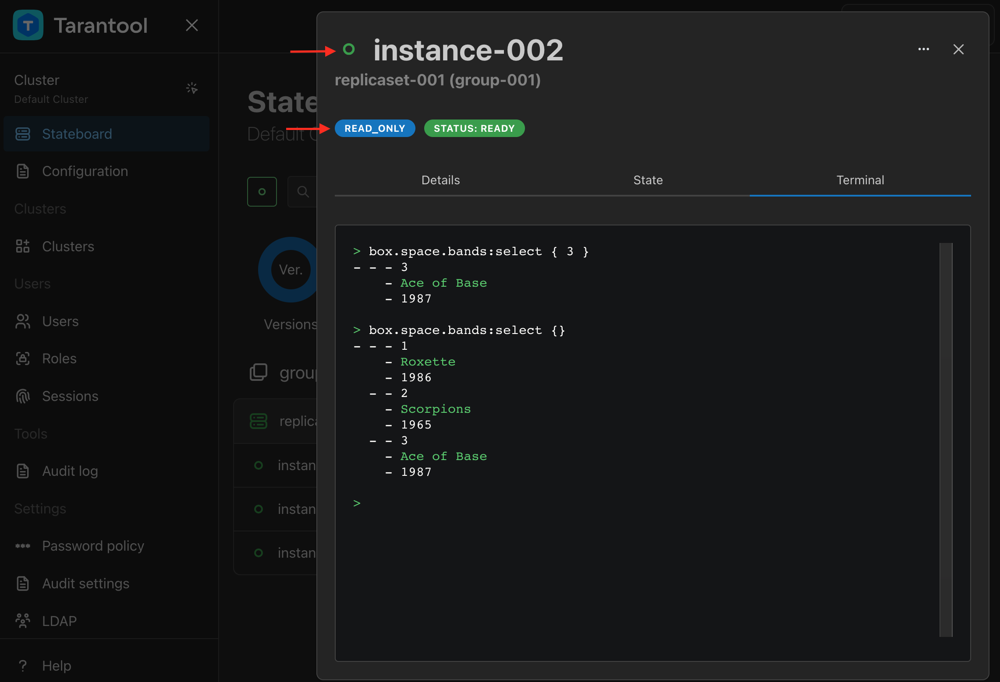

..  _getting_started_tcm:

Getting started with Tarantool Cluster Manager
==============================================

..  admonition:: Enterprise Edition
    :class: fact

    This tutorial uses `Tarantool Enterprise Edition <https://www.tarantool.io/compare/>`_.

**Example on GitHub**: `tcm_get_started <https://github.com/tarantool/doc/tree/latest/doc/code_snippets/snippets/config/instances.enabled/tcm_get_started>`_

In this tutorial, you get :ref:`tcm` up and running on your local system, deploy
a local Tarantool EE cluster, and learn to manage the cluster from the |tcm| web UI.

To complete this tutorial, you need:

*   A Linux machine with glibc 2.17 or later.
*   A web browser: Chromium-based (Chromium version 108 or later), Mozilla Firefox 101 or later, or another up-to-date browser.
*   The Tarantool Enterprise Edition SDK 3.0 or later in the ``tar.gz`` archive.
    See :ref:`enterprise-setup` for information about getting the archive.

For more detailed information about using |tcm|, refer to :ref:`tcm`.

..  _getting_started_tcm_setup:

Setting up Tarantool EE
-----------------------

#.  Extract the Tarantool EE SDK archive:

    .. code-block:: console

        $ tar -xvzf tarantool-enterprise-sdk-gc64-<VERSION>-<HASH>-r<REVISION>.linux.x86_64.tar.gz

    This creates the ``tarantool-enterprise`` directory beside the archive.
    The directory contains three executables for key Tarantool EE components:

    *   ``tarantool`` -- Tarantool Enterprise Edition.
    *   ``tt`` -- the :ref:`tt <tt-cli>` command-line utility.
    *   ``tcm`` -- :ref:`tcm`.

#.  Add the Tarantool EE components to the executable path by executing the ``env.sh``
    script included in the distribution:

    .. code-block:: console

        $ source tarantool-enterprise/env.sh

#.  To check that the Tarantool EE executables ``tarantool``, ``tt``,
    and ``tcm`` are available in the system, print their versions:

    .. code-block:: console

        $ tarantool --version
        Tarantool Enterprise 3.0.0-0-gf58f7d82a-r23-gc64
        Target: Linux-x86_64-RelWithDebInfo
        Build options: cmake . -DCMAKE_INSTALL_PREFIX=/home/centos/release/sdk/tarantool/static-build/tarantool-prefix -DENABLE_BACKTRACE=TRUE
        Compiler: GNU-9.3.1
        C_FLAGS: -fexceptions -funwind-tables -fasynchronous-unwind-tables -static-libstdc++ -fno-common -msse2  -fmacro-prefix-map=/home/centos/release/sdk/tarantool=. -std=c11 -Wall -Wextra -Wno-gnu-alignof-expression -fno-gnu89-inline -Wno-cast-function-type -O2 -g -DNDEBUG -ggdb -O2
        CXX_FLAGS: -fexceptions -funwind-tables -fasynchronous-unwind-tables -static-libstdc++ -fno-common -msse2  -fmacro-prefix-map=/home/centos/release/sdk/tarantool=. -std=c++11 -Wall -Wextra -Wno-invalid-offsetof -Wno-gnu-alignof-expression -Wno-cast-function-type -O2 -g -DNDEBUG -ggdb -O2
        $ tt version
        Tarantool CLI EE 2.1.0, linux/amd64. commit: d80c2e3
        $ tcm version
        1.0.0-0-gd38b12c2

..  _getting_started_tcm_start:

Starting TCM
------------

|tcm_full_name| is ready to run out of the box. To start |tcm| run the following command:

..  code-block:: console

    $ tcm --storage.etcd.embed.enabled

.. important::

    The |tcm| bootstrap log in the terminal includes a message with the credentials
    to use for the first login. Make sure to save them somewhere.

    ..  code-block:: text

        Jan 24 05:51:28.443 WRN Generated super admin credentials login=admin password=qF3A5rjGurjAwmlYccJ7JrL5XqjbIHY6

The :ref:`--storage.etcd.embed.enabled <tcm_configuration_reference_storage_etcd_embed>`
option makes |tcm| start its own instance of `etcd <https://etcd.io/>`__ on bootstrap.
This ``etcd`` instance is used for storing the :ref:`TCM configuration <tcm_configuration>`.

.. note::

    During the development, it is also convenient to use the TCM-embedded etcd
    as a configuration storage for Tarantool EE clusters connected to TCM.
    Learn more in :ref:`configuration_etcd`.

..  _getting_started_tcm_login:

Logging into TCM
----------------

#.  Open a web browser and go to ``http://127.0.0.1:8080/``.
#.  Enter the username and the password you got from the |tcm| bootstrap log in the previous step.
#.  Click **Log in**.

After a successful login, you see the |tcm| web UI:

..  _getting_started_tcm_cluster:

Setting up a Tarantool EE cluster
---------------------------------

To prepare a Tarantool EE cluster, complete the following steps:

#.  Define the cluster connection settings in |tcm|.
#.  Configure the cluster in |tcm|.
#.  Start the cluster instances locally using the :ref:`tt <tt-cli>` utility.

..  _getting_started_tcm_cluster_connection:

Defining the cluster's connection settings in TCM
~~~~~~~~~~~~~~~~~~~~~~~~~~~~~~~~~~~~~~~~~~~~~~~~~

A freshly installed |TCM| has a predefined cluster named **Default cluster**. It
doesn't have any configuration or topology out of the box. Its initial properties
include the etcd and Tarantool connection parameters. Check these properties
to find out where TCM sends the cluster configuration that you write.

To view the **Default cluster**'s properties:

#.  Go to **Clusters** and click **Edit** in the **Actions** menu opposite the cluster name.

    .. image:: images/tcm_start_cluster_edit.png
        :width: 700
        :align: center
        :alt: TCM edit cluster

#.  Click **Next** on the **General** tab.

    .. image:: images/tcm_start_cluster_general.png
        :width: 700
        :align: center
        :alt: General cluster settings

#.  Find the connection properties of the configuration storage that the cluster uses.
    By default, it's an etcd running on port ``2379`` (default etcd port) on the same host.
    The key prefix used for the cluster configuration is ``/default``. Click **Next**.

    .. image:: images/tcm_start_cluster_storage.png
        :width: 700
        :align: center
        :alt: Cluster configuration storage settings

#.  Check the Tarantool user that |tcm| uses to connect to the cluster instances.
    It's ``guest`` by default.

    .. image:: images/tcm_start_cluster_tarantool.png
        :width: 700
        :align: center
        :alt: Cluster Tarantool connection settings

..  _getting_started_tcm_cluster_config:

Configuring a cluster in TCM
~~~~~~~~~~~~~~~~~~~~~~~~~~~~

|tcm| provides a web-based editor for writing cluster configurations. It is connected
to the configuration storage (etcd in this case): all changes you make in the browser
are sent to etcd in one click.

To write the cluster configuration and upload it to the etcd storage:

#.  Go to **Configuration**.
#.  Click **+** and provide an arbitrary name for the configuration file, for example, ``all``.
#.  Paste the following :ref:`YAML configuration <configuration_overview>` into the editor:

    ..  literalinclude:: /code_snippets/snippets/config/instances.enabled/tcm_get_started/cluster.yaml
        :language: yaml
        :dedent:

    This configuration sets up a cluster of three nodes in one replica set:
    one leader and two followers.

#. Click **Apply** to send the configuration to etcd.

    .. image:: images/tcm_start_cluster_config.png
        :width: 700
        :align: center
        :alt: Cluster configuration in TCM

When the cluster configuration is saved, you can see the cluster topology on the **Stateboard** page:

However, the cluster instances are offline because they aren't deployed yet.

..  _getting_started_tcm_cluster_deploy:

Deploying the cluster locally
~~~~~~~~~~~~~~~~~~~~~~~~~~~~~

To deploy a local cluster based on the configuration from etcd:

#.  Go to the system terminal you used when setting up Tarantool.
#.  Create a new ``tt`` environment in a directory of your choice:

    .. code-block:: console

        $ mkdir cluster-env
        $ cd cluster-env/
        $ tt init

#.  Inside the ``instances.enabled`` directory of the created tt environment, create the ``cluster`` directory.

    .. code-block:: console

        $ mkdir instances.enabled/cluster
        $ cd instances.enabled/cluster/

#.  Inside ``instances.enabled/cluster``, create the ``instances.yml`` and ``config.yaml`` files:

    *   ``instances.yml`` specifies instances to run in the current environment. In this example, there are three instances:

        ..  literalinclude:: /code_snippets/snippets/config/instances.enabled/tcm_get_started/instances.yml
            :language: yaml
            :dedent:

    *   ``config.yaml`` instructs ``tt`` to load the cluster configuration from etcd.
        The specified etcd location matches the configuration storage of the **Default cluster** in TCM:

        ..  literalinclude:: /code_snippets/snippets/config/instances.enabled/tcm_get_started/config.yaml
            :language: yaml
            :dedent:

#.  Start the cluster from the ``tt`` environment root (the ``cluster-env`` directory):

    .. code-block:: console

        $ tt start cluster

    To check how the cluster started, run ``tt status``. This output should look like this:

    .. code-block:: console

        $ tt status cluster
        INSTANCE                 STATUS      PID   MODE
        cluster:instance-001     RUNNING     2058  RW
        cluster:instance-002     RUNNING     2059  RO
        cluster:instance-003     RUNNING     2060  RO

..  _getting_started_tcm_manage:

Managing the cluster in TCM
---------------------------

To learn to interact with a cluster in |tcm|, complete typical database tasks such as:

*   Checking the cluster state.
*   Creating a space.
*   Writing data.
*   Viewing data.

..  _getting_started_tcm_manage_check:

Checking cluster state
~~~~~~~~~~~~~~~~~~~~~~

To check the cluster state in |tcm|, go to **Stateboard**. Here you see the overview
of the cluster topology, health, memory consumption, and other information.

..  _getting_started_tcm_manage_connect:

Connecting to an instance
~~~~~~~~~~~~~~~~~~~~~~~~~

To view detailed information about an instance, click its name in the instances list
on the **Stateboard** page.

To connect to the instance interactively and execute code on it, go to the **Terminal** tab.

..  _getting_started_tcm_manage_space:

Creating a space
~~~~~~~~~~~~~~~~

Go to the terminal of ``instance-001`` (the leader instance) and run the following code to
create a formatted space with a primary index in the cluster:

    ..  literalinclude:: /code_snippets/snippets/config/instances.enabled/tcm_get_started/myapp.lua
        :language: lua
        :start-at: box.schema.space.create
        :end-at: box.space.bands:create_index
        :dedent:

..  _getting_started_tcm_manage_write:

Writing data
~~~~~~~~~~~~

Since ``instance-001`` is a read-write instance (its ``box.info.ro`` is ``false``),
the write requests must be executed on it. Run the following code in the ``instance-001``
terminal to write tuples in the space:

    ..  literalinclude:: /code_snippets/snippets/config/instances.enabled/tcm_get_started/myapp.lua
        :language: lua
        :start-at: 'Roxette'
        :end-at: 'Ace of Base'
        :dedent:

..  _getting_started_tcm_manage_read:

Reading data
~~~~~~~~~~~~

Check the space's tuples by running a read request on ``instance-001``:

    ..  literalinclude:: /code_snippets/snippets/config/instances.enabled/tcm_get_started/myapp.lua
        :language: lua
        :start-at: box.space.bands:select
        :end-at: box.space.bands:select
        :dedent:

This is how it looks in |tcm|:

..  _getting_started_tcm_manage_replication:

Checking replication
~~~~~~~~~~~~~~~~~~~~

To check that the data is replicated across instances, run the read request on any
other instance -- ``instance-002`` or ``instance-003``. The result is the same as on ``instance-001``.

.. note::

    If you try to execute a write request on any instance but ``instance-001``,
    you get an error because these instances are configured to be read-only.

..  _getting_started_tcm_manage_view:

Viewing data in TCM
~~~~~~~~~~~~~~~~~~~

|tcm| web UI includes a tool for viewing data stored in the cluster. To view
the space tuples in |tcm|:

#.  Click an instance name on the **Stateboard** page.
#.  Open the **Actions** menu in the top-right corner and click **Explorer**.

    .. image:: images/tcm_start_explorer.png
        :width: 700
        :align: center
        :alt: Opening Explorer in TCM

    This opens the page that lists user-created spaces on the instance.

    .. image:: images/tcm_start_explorer_spaces.png
        :width: 700
        :align: center
        :alt:  TCM Explorer: spaces

#.  Click **View** in the **Actions** menu of the space you want to see. The page
    shows all the tuples added previously.

    .. image:: images/tcm_start_explorer_tuples.png
        :width: 700
        :align: center
        :alt:  TCM Explorer: space tuples
