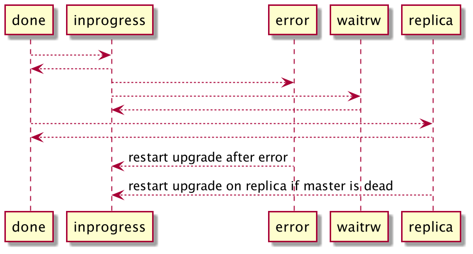

..  _enterprise-space_upgrade:
.. _box_space-upgrade:

Upgrading space schema
======================

..  admonition:: Enterprise Edition
    :class: fact

    ``space:upgrade()`` is available in the `Enterprise Edition <https://www.tarantool.io/compare/>`_ only.

In Tarantool, :ref:`migration <migrations>` refers to any change in a data schema, for example,
creating an index, adding a field, or changing a field format.
If you need to change a data schema, there are several possible cases:

*   Schema migration does not require data migration: adding a field with the ``is_nullable`` parameter to the end
    of the space, creating an index.

*   Schema migration requires data migration. For example, it is necessary when you have to iterate
    over the entire space to convert columns to a new format or remove the column completely.

To solve the task of migrating the data, you can:

*   :ref:`Migrate data <migrations>` to a new space manually.

*   Use the ``space:upgrade()`` feature.

Space upgrade overview
----------------------

The ``space:upgrade()`` feature allows users to upgrade the format of a space and the tuples stored in it without
blocking the database.

..  _space_upgrade-requirements:

How to apply space upgrade
~~~~~~~~~~~~~~~~~~~~~~~~~~

First, specify an upgrade function -- a function that will convert the tuples in the space to a new format.
The requirements for this function are listed below.

*   The upgrade function takes two arguments. The first argument is a tuple to be upgraded.
    The second one is optional. It contains some additional information stored in plain Lua object.
    If omitted, the second argument is ``nil``.

*   The function returns a new tuple or a Lua table. For example, it can add a new field to the tuple.
    The new tuple must conform to the new space format set by the upgrade operation.

*   The function should be registered with
    :doc:`box.schema.func.create </reference/reference_lua/box_schema/func_create>`.
    It should also be stored, deterministic, and written in Lua.

*   The function should not change the primary key of the tuple.

*   The function should be idempotent: ``f(f(t)) = f(t)``. This is necessary because the function
    is applied to all tuples returned to the user, and some of them may have already been upgraded in the background.

Then define a new space format. This step is optional.
However, it could be useful if, for example, you want to add a new column with data.
For details, check the :ref:`Usage Example <space_upgrade-example>` section.

The next optional step is to choose an upgrade mode.
There are three modes: ``upgrade``, ``dryrun``, and ``dryrun+upgrade``.
The default value is ``upgrade``.
To check an upgrade function without applying any changes, choose the ``dryrun`` mode.
To run a space upgrade without testing the function, pick the ``upgrade`` mode.
If you want to apply both the test and the actual upgrade, use the ``dryrun+upgrade`` option.
For details, see the :ref:`Upgrade Modes <space_upgrade-modes>` section.

How the upgrade works
~~~~~~~~~~~~~~~~~~~~~

The user defines an upgrade function.
Each tuple of the chosen space is passed through the function.
The function converts the tuple from the old format to a new one.
The function is applied to all tuples stored in the space in the background.
Besides, the function is applied to all tuples returned to the user via the box API (for example, ``select``, ``get``).
Therefore, it appears that the space upgrades instantly.

Keep in mind that ``space:upgrade`` differs from
the :doc:`space_object:format() </reference/reference_lua/box_space/format>` in the following ways:

..  container:: table

    ..  list-table::
        :widths: 20 40 40
        :header-rows: 1

        *   -   Difference
            -   ``space:upgrade()``
            -   ``space:format()``

        *   -   Non-blocking
            -   Yes. It returns tuples in the new format, whether or not they have already been converted.
            -   Yes.

        *   -   Set a format incompatible with the current one
            -   Yes. Works for non-indexed field types only.
            -   No, only expand the format in a compatible way.

        *   -   Visibility of changes
            -   Immediately. All changes are visible and replicated immediately.
                New data should conform to the new format immediately after the call.
            -   After data validation.
                Data validation starts in the background, it does not block the database.
                Inserting data incompatible with the new format is allowed before
                validation is completed -- in this case ``space.format`` fails.

        *   -   Cancel (error/restart)
            -   Writes the state to the system table.
                Restart: the operation continues.
                Error: the operation should be restarted manually, any other attempt to change the table fails.
            -   Leaves no traces.

        *   -   Set the upgrade function
            -   Yes. The upgrade may take a while to traverse the space and transform tuples.
            -   No.

..  note::

    At the moment, the feature is not supported
    for :ref:`vinyl <engines-vinyl>` spaces.

User API
--------

The ``space:upgrade()`` method is added to the :doc:`space object </reference/reference_lua/box_space>`:

..  function:: space:upgrade({func[, arg, format, mode, is_async]})

    :param string/integer func: upgrade function name (string) or ID (integer). For details, see the
                               :ref:`upgrade function requirements <space_upgrade-requirements>` section.

    :param arg: additional information passed to the upgrade function in the second argument.
                The option accepts any Lua value that can be encoded in MsgPack, which means that
                the :doc:`msgpack.encode(arg) </reference/reference_lua/msgpack>` should succeed.
                For example, one can pass a scalar or a Lua table.
                The default value is ``nil``.

    :param map format: new space format. The requirements for this are the same as for any other
                       :doc:`space:format() </reference/reference_lua/box_space/format>`.
                       If the field is omitted, the space format will remain the same as before the upgrade.

    :param string mode: :ref:`upgrade mode <space_upgrade-modes>`. Possible values: ``upgrade``, ``dryrun``,
                        ``dryrun+upgrade``. The default value is ``upgrade``.

    :param boolean is_async: the flag indicates whether to wait until the upgrade operation is complete
                             before exiting the function.
                             The default value is ``false`` -- the function is blocked
                             until the upgrade operation is finished.

    :Return: object describing the status of the operation (also known as ``future``).
             The methods of the object are described below.

..  class:: future_object

    ..  method:: info(dryrun, status, func, arg, owner, error, progress)

        Shows information about the state of the upgrade operation.

        :param boolean dryrun: dry run mode flag. Possible values:
                               ``true`` for a dry run, ``nil`` for an actual upgrade.

        :param string status: :ref:`upgrade status <space_upgrade-states>`. Possible values:
                              ``inprogress``, ``waitrw``, ``error``, ``replica``, ``done``.

        :param string/integer func: name of the upgrade function.
                                    It is the same as passed to the ``space:upgrade`` method.
                                    The field is ``nil`` if the ``status`` is ``done``.

        :param arg: additional information passed to the upgrade function.
                    It is the same as for the ``space:upgrade`` method.
                    The field is ``nil`` if it is omitted in the ``space:upgrade``.

        :param string owner: UUID of the instance running the upgrade
                             (see :doc:`box.info.uuid </reference/reference_lua/box_info>`).
                             The field is ``nil`` if the ``status`` is ``done``.

        :param string error: error message if the ``status`` is ``error``, otherwise ``nil``.

        :param string progress: completion percentage if the ``status`` is ``inprogress``/``waitrw``,
                                otherwise ``nil``.

        :return: a table with information about the state of the upgrade operation
        :rtype:  table

        The fields can also be accessed directly, without calling the ``info()`` method.
        For example, ``future.status`` is the same as ``future:info().status``.

    ..  method:: wait([timeout])

        Waits until the upgrade operation is completed or a timeout occurs.
        An operation is considered completed if its status is ``done`` or ``error``.

        :param double timeout: if the ``timeout`` argument is omitted, the method waits as long as it takes.

        :return: returns ``true`` if the operation has been completed, ``false`` on timeout
        :rtype:  boolean

    ..  method:: cancel()

        Cancels the upgrade operation if it is currently running. Otherwise, an exception is thrown.
        A canceled upgrade operation completes with an error.

        :return: none
        :rtype:  void

Running ``space:upgrade()`` with ``is_async = false`` or the ``is_async`` field not set is equal to:

..  code-block:: lua

    local future = space:upgrade({func = 'my_func', is_async = true})
    future:wait()
    return future

If called without arguments, ``space:upgrade()`` returns a future object for the active upgrade operation.
If there is none, it returns ``nil``.

..  _space_upgrade-modes:

Upgrade modes
-------------

There are three upgrade modes: ``dryrun``, ``dryrun+upgrade``, and ``upgrade``.
Regardless of the mode selected, the upgrade does not block execution.
Once in a while, the background fiber commits the upgraded tuples and yields.

Calling ``space:upgrade`` without arguments always returns the current state of the space upgrade,
never the state of a dry run. If there is a dry run working in the background, ``space:upgrade`` will still return ``nil``.
Unlike an actual space upgrade, the future object returned by a dry run upgrade can't be recovered if it is lost.
So a dry run is aborted if it is garbage collected.

..  warning::

    In ``dryrun+upgrade`` mode: if the future object is garbage collected by Lua
    before the end of the dry run and the start of the upgrade,
    then the dry run will be canceled, and no upgrade will be started.

Upgrade modes:

*   ``upgrade`` mode: the background fiber iterates over the
    space, applies the upgrade function, checks that obtained tuples fit the new space format,
    and updates the tuples. This mode prevents the space from being altered.
    The mode can only be performed on the master instance.

*   ``dryrun`` mode: the dry-run mode is used to check the upgrade function. The mode does not apply any changes
    to the target space. It starts a background fiber. The fiber:

    *   Iterates over the target space.
    *   Attempts to apply the upgrade function to each tuple stored in the space.
    *   Checks if the returned tuple matches the new format.
    *   Checks if the function is idempotent.
    *   Checks that the function does not modify the primary key.

    For details, see the :ref:`upgrade function requirements <space_upgrade-requirements>` section.

    To start a dry run, pass ``mode='dryrun'`` to the ``space:upgrade`` method.
    In this case, the future object has the ``dryrun`` field set to ``true``.
    The possible statuses are ``inprogress`` and ``dryrun``. ``replica`` and ``waitrw`` states are never set
    for a dry run future object.

    The ``dryrun`` mode is not persisted. Restarting the instance does not restart a dry run.
    A dry run only works on the original instance, never on replicas.
    Unlike a real upgrade, a dry run does not prevent the space from being altered.
    The space can even be dropped. In this case, the dry run will complete with an error.

*   ``dryrun+upgrade`` mode: it starts a dry run, which, if completed successfully, triggers an actual upgrade.
    The future object returned by ``space:upgrade`` remains valid throughout the process.
    It starts as the future object of the dry run. Then, under the hood, it is converted into an upgrade future object.
    Waiting on it would wait for both the dry run and the upgrade to complete.
    During the dry run, the future object has the ``dryrun`` field set to ``true``.
    When the actual upgrade starts, the ``dryrun`` field is set to ``nil``.
    The mode can only be performed on the master instance.

..  _space_upgrade-states:

States
------

An upgrade operation has one of the following upgrade states:

*   ``inprogress`` -- the upgrade operation is running in the background.
    The function is applied to all tuples returned to the user.

*   ``waitrw`` -- the instance was switched to the read-only mode
    (for example, by using ``box.cfg.read_only``), so the upgrade couldn't proceed.
    The upgrade process will resume as soon as the instance switches back to read-write mode.
    Nevertheless, the upgrade function is applied to all tuples returned to the user.

*   ``error`` -- the upgrade operation failed with an error. See the ``error`` field for the error message.
    See the log for the tuple that caused the error. No alter operation is allowed, except for another upgrade,
    supposed to fix the problem.
    Nevertheless, the upgrade function is applied to all tuples returned to the user. The space is writable.

*   ``done`` -- the upgrade operation is successfully completed. The upgrade function is not applied to tuples returned
    to the user anymore. The function can be deleted.

*   ``replica`` -- the upgrade operation is either running or completed with an error on another instance.
    See the ``owner`` field for the UUID of the instance running the upgrade.
    Nevertheless, the upgrade function is applied to all tuples returned to the user.

Interaction with alter
----------------------

While a space upgrade is in progress, the space can't be altered or dropped.
The attempt to do that will throw an exception.
Restarting an upgrade is allowed in case the currently running upgrade is canceled or completed with an error.
It means the manual restart is possible if the upgrade operation is in the :ref:`error state <space_upgrade-states>`.

If a space upgrade was canceled or failed with an error, the space can't be altered or dropped.
The only option is to restart the upgrade using a different upgrade function or format.

Interaction with recovery
-------------------------

The space upgrade state is persisted. It is stored in the ``_space`` system table. If an instance with
a space upgrade in progress (``inprogress`` state) is shut down, it restarts the space upgrade after recovery.
If a space upgrade fails (switches to the ``error`` state), it remains in the error state after recovery.

Interaction with replication
----------------------------

The changes made to a space by a space upgrade are replicated.
Just as on the instance where the upgrade is performed, the upgrade function is applied to all tuples returned
to the user on the replicas. However, the upgrade operation is not performed on the replicas in the background.
The replicas wait for the upgrade operation to complete on the master.
They can't alter or drop the space. Normally, they can't cancel or restart the upgrade operation either.

There is an emergency exception when the master is permanently dead.
It is possible to restart a space upgrade that started on another instance.
The restart is possible if the upgrade owner UUID (see the ``owner`` field) has been deleted
from the ``_cluster`` system table.

..  note::

    Except the ``dryrun`` mode, the upgrade can only be performed on the master.
    If the instance is no longer the master, the upgrade is suspended until the instance is master again.
    Restarting the upgrade on a new master works only if the old one has been removed from the replica set
    (``_cluster`` system space).

..  _space_upgrade-example:

Usage example
-------------

Suppose there are two columns in the space `test` -- ``id`` (unsigned) and ``data`` (string).
The example shows how to upgrade the schema and add another column to the space using ``space:upgrade()``.
The new column contains the ``id`` values converted to string. Each step takes a while.

The test space is generated with the following script:

    ..  code-block:: lua

        local log = require('log')
        box.cfg{
            checkpoint_count = 1,
            memtx_memory = 5 * 1024 * 1024 * 1024,
        }
        box.schema.space.create('test')
        box.space.test:format{
            {name = 'id', type = 'unsigned'},
            {name = 'data', type = 'string'},
        }
        box.space.test:create_index('pk')
        local count = 20 * 1000 * 1000
        local progress = 0
        box.begin()
        for i = 1, count do
            box.space.test:insert{i, 'data' .. i}

            if i % 1000 == 0 then
                box.commit()
                local p = math.floor(i / count * 100)
                if progress ~= p then
                    progress = p
                    log.info('Generating test data set... %d%% done', p)
                end
                box.begin()
            end
        end
        box.commit()
        box.snapshot()
        os.exit(0)

To upgrade the space, connect to the server and then run the commands below:

    ..  code-block:: tarantoolsession

        localhost:3301> box.schema.func.create('convert', {
                      >     language = 'lua',
                      >     is_deterministic = true,
                      >     body = [[function(t)
                      >         if #t == 2 then
                      >             return t:update({{'!', 2, tostring(t.id)}})
                      >         else
                      >             return t
                      >         end
                      >     end]],
                      > })
        localhost:3301> box.space.test:upgrade({
                      >     func = 'convert',
                      >     format = {
                      >         {name = 'id', type = 'unsigned'},
                      >         {name = 'id_string', type = 'string'},
                      >         {name = 'data', type = 'string'},
                      >     },
                      > })

While the upgrade is in progress, you can track the state of the upgrade.
To check the status, connect to Tarantool from another console and run the following commands:

    ..  code-block:: tarantoolsession

        localhost:3311> box.space.test:upgrade()
        ---
        - status: inprogress
          progress: 8%
          owner: 579a9e99-427e-4e99-9e2e-216bbd3098a7
          func: convert
        ...

Even though the upgrade is only 8% complete, selecting the data from the space returns the converted tuples:

    ..  code-block:: tarantoolsession

        localhost:3311> box.space.test:select({}, {iterator = 'req', limit = 5})
        ---
        - - [20000000, '20000000', 'data20000000']
          - [19999999, '19999999', 'data19999999']
          - [19999998, '19999998', 'data19999998']
          - [19999997, '19999997', 'data19999997']
          - [19999996, '19999996', 'data19999996']
        ...

    ..  note::

        The tuples contain the new field even though the space upgrade is still running.

Wait for the space upgrade to complete using the command below:

    ..  code-block:: tarantoolsession

        localhost:3311> box.space.test:upgrade():wait()

