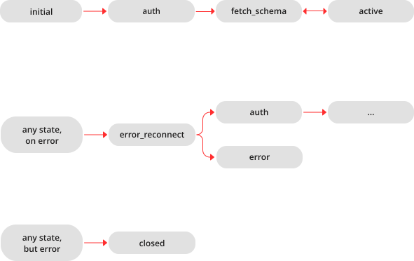

.. _net_box-module:

--------------------------------------------------------------------------------
Module `net.box`
--------------------------------------------------------------------------------

The ``net.box`` module contains connectors to remote database systems. One
variant, to be discussed later, is connecting to MySQL or MariaDB or PostgreSQL
(see :ref:`SQL DBMS modules <dbms_modules>` reference).
The other variant, which is discussed in this section, is connecting to Tarantool
servers via a network using the built-in ``net.box`` module.

You can call the following methods:

* ``require('net.box')`` to get a ``net.box`` object
  (named ``net_box`` for examples in this section),
* ``net_box.new()`` to connect and get a connection object
  (named ``conn`` for examples in this section),
* other ``net.box()`` routines, passing ``conn:``, to execute requests on
  a remote box,
* :ref:`conn:close <socket-close>` to disconnect.

All ``net.box`` methods are fiber-safe, that is, it is safe to share and use the
same connection object across multiple concurrent fibers. In fact, it's perhaps
the best programming practice with Tarantool. When multiple fibers use the same
connection, all requests are pipelined through the same network socket, but each
fiber gets back a correct response. Reducing the number of active sockets lowers
the overhead of system calls and increases the overall server performance. There
are, however, cases when a single connection is not enough — for example, when it's
necessary to prioritize requests or to use different authentication IDs.

Since Tarantool 1.7.2, support for the Lua console protocol in ``net.box`` was
dropped. Now only the binary protocol is supported.

The diagram below shows possible connection states and transitions:

.. module:: net_box

.. function:: new(URI [, {option[s]}])

    Create a new connection. The connection is established on demand, at the
    time of the first request. It can be re-established automatically after a
    disconnect (see ``reconnect_after`` option below).
    The returned ``conn`` object supports methods for making remote requests,
    such as select, update or delete.

    For a local Tarantool server, there is a pre-created always-established
    connection object named :samp:`{net_box}.self`. Its purpose is to make polymorphic
    use of the ``net_box`` API easier. Therefore :samp:`conn = {net_box}.new('localhost:3301')`
    can be replaced by :samp:`conn = {net_box}.self`. However, there is an important
    difference between the embedded connection and a remote one. With the
    embedded connection, requests which do not modify data do not yield.
    When using a remote connection, due to :ref:`the implicit rules <atomic-the_implicit_yield_rules>`
    any request can yield, and database state may have changed by the time it regains control.
    
    Possible options:
    
    * `wait_connected`: by default, connection creation is blocked until the connection is established,
      but passing ``wait_connected=false`` makes it return immediately. Also, passing a timeout
      makes it wait before returning (e.g. ``wait_connected=1.5`` makes it wait at most 1.5 secs). |br|
      Note: In the presence of ``reconnect_after``, ``wait_connected`` ignores transient failures.
      The wait completes once the connection is established or is closed explicitly.
      
    * `reconnect_after`: a ``net.box`` instance automatically reconnects
      any time the connection is broken or if a connection attempt fails.
      This makes transient network failures become transparent to the application.
      Reconnect happens automatically in the background, so queries/requests that
      suffered due to connectivity loss are transparently retried.
      The number of retries is unlimited, connection attempts are done over the
      specified timeout (e.g. ``reconnect_after=5`` for 5 secs).
      Once a connection is explicitly closed (or garbage-collected), reconnects stop.
      
    * `call_16`: [since 1.7.2] by default, ``net.box`` connections comply with a new 
      binary protocol command for CALL, which is not backward compatible with previous versions.
      The new CALL no longer restricts a function to returning an array of tuples
      and allows returning an arbitrary MsgPack/JSON result, including scalars, nil and void (nothing).
      The old CALL is left intact for backward compatibility.
      It will be removed in the next major release.
      All programming language drivers will be gradually changed to use the new CALL.
      To connect to a Tarantool instance that uses the old CALL, specify ``call_16=true``.

    :param string URI: the :ref:`URI <index-uri>` of the target for the connection
    :param options: possible options are `wait_connected`, `reconnect_after` and `call_16`
    :return: conn object
    :rtype:  userdata

    **Example:**

    .. code-block:: lua

        conn = net_box.new('localhost:3301')
        conn = net_box.new('127.0.0.1:3302', {wait_connected = false})
        conn = net_box.new('127.0.0.1:3303', {reconnect_after = 5, call_16 = true})
        
.. class:: conn

    .. method:: ping()

        Execute a PING command.

        :return: true on success, false on error
        :rtype:  boolean

        **Example:**

        .. code-block:: lua

            net_box.self:ping()

    .. method:: wait_connected([timeout])

        Wait for connection to be active or closed.

        :param number timeout: in seconds
        :return: true when connected, false on failure.
        :rtype:  boolean

        **Example:**

        .. code-block:: lua

            net_box.self:wait_connected()

    .. method:: is_connected()

        Show whether connection is active or closed.

        :return: true if connected, false on failure.
        :rtype:  boolean

        **Example:**

        .. code-block:: lua

            net_box.self:is_connected()

    .. method:: wait_state(state[s][, timeout])

        [since 1.7.2] Wait for a target state.

        :param string states: target states
        :param number timeout: in seconds
        :return: true when a target state is reached, false on timeout or connection closure
        :rtype:  boolean

        **Example:**

        .. code-block:: lua

            -- wait infinitely for 'active' state:
            conn:wait_state('active')
            
            -- wait for 1.5 secs at most:
            conn:wait_state('active', 1.5)
            
            -- wait infinitely for either `active` or `fetch_schema` state:
            conn:wait_state({active=true, fetch_schema=true})

    .. method:: close()

        Close a connection.

        Connection objects are garbage collected just like any other objects in Lua, so
        an explicit destruction is not mandatory. However, since close() is a system
        call, it is good programming practice to close a connection explicitly when it
        is no longer needed, to avoid lengthy stalls of the garbage collector.

        **Example:**

        .. code-block:: lua

            conn:close()

    .. method:: conn.space.<space-name>:select{field-value, ...}

        :samp:`conn.space.{space-name}:select`:code:`{...}` is the remote-call equivalent
        of the local call :samp:`box.space.{space-name}:select`:code:`{...}`.

        .. NOTE::

            Due to :ref:`the implicit yield rules <atomic-the_implicit_yield_rules>`
            a local :samp:`box.space.{space-name}:select`:code:`{...}` does
            not yield, but a remote :samp:`conn.space.{space-name}:select`:code:`{...}`
            call does yield, so global variables or database tuples data may
            change when a remote :samp:`conn.space.{space-name}:select`:code:`{...}`
            occurs.

    .. method:: conn.space.<space-name>:get{field-value, ...}

        :samp:`conn.space.{space-name}:get(...)` is the remote-call equivalent
        of the local call :samp:`box.space.{space-name}:get(...)`.

    .. method:: conn.space.<space-name>:insert{field-value, ...}

        :samp:`conn.space.{space-name}:insert(...)` is the remote-call equivalent
        of the local call :samp:`box.space.{space-name}:insert(...)`.

    .. method:: conn.space.<space-name>:replace{field-value, ...}

        :samp:`conn.space.{space-name}:replace(...)` is the remote-call equivalent
        of the local call :samp:`box.space.{space-name}:replace(...)`.

    .. method:: conn.space.<space-name>:update{field-value, ...}

        :samp:`conn.space.{space-name}:update(...)` is the remote-call equivalent
        of the local call :samp:`box.space.{space-name}:update(...)`.

    .. method:: conn.space.<space-name>:upsert{field-value, ...}

        :samp:`conn.space.{space-name}:upsert(...)` is the remote-call equivalent
        of the local call :samp:`box.space.{space-name}:upsert(...)`.

    .. method:: conn.space.<space-name>:delete{field-value, ...}

        :samp:`conn.space.{space-name}:delete(...)` is the remote-call equivalent
        of the local call :samp:`box.space.{space-name}:delete(...)`.

    .. _net_box-call:

    .. method:: call(function-name [, arguments])

        ``conn:call('func', '1', '2', '3')`` is the remote-call equivalent of
        ``func('1', '2', '3')``. That is, ``conn:call`` is a remote
        stored-procedure call.

        **Example:**

        .. code-block:: lua

            conn:call('function5')

    .. _net_box-eval:

    .. method:: eval(Lua-string)

        :samp:`conn:eval({Lua-string})` evaluates and executes the expression
        in Lua-string, which may be any statement or series of statements.
        An :ref:`execute privilege <authentication-privileges>` is required; if
        the user does not have it, an administrator may grant it with
        :samp:`box.schema.user.grant({username}, 'execute', 'universe')`.

        **Example:**

        .. code-block:: lua

            conn:eval('return 5+5')

    .. method:: timeout(timeout)

        ``timeout(...)`` is a wrapper which sets a timeout for the request that
        follows it.

        **Example:**

        .. code-block:: lua

            conn:timeout(0.5).space.tester:update({1}, {{'=', 2, 15}})

        All remote calls support execution timeouts. Using a wrapper object makes
        the remote connection API compatible with the local one, removing the need
        for a separate ``timeout`` argument, which the local version would ignore. Once
        a request is sent, it cannot be revoked from the remote server even if a
        timeout expires: the timeout expiration only aborts the wait for the remote
        server response, not the request itself.

============================================================================
Example
============================================================================

This example shows the use of most of the ``net.box`` methods.

The sandbox configuration for this example assumes that:

* the Tarantool server is running on ``localhost 127.0.0.1:3301``,
* there is a space named ``tester`` with a numeric primary key and with a tuple
  that contains a key value = 800,
* the current user has read, write and execute privileges.

Here are commands for a quick sandbox setup:

.. cssclass:: highlight
.. parsed-literal::

    box.cfg{listen = 3301}
    s = box.schema.space.create('tester')
    s:create_index('primary', {type = 'hash', parts = {1, 'unsigned'}})
    t = s:insert({800, 'TEST'})
    box.schema.user.grant('guest', 'read,write,execute', 'universe')

And here starts the example:

.. code-block:: tarantoolsession

    tarantool> net_box = require('net.box')
    ---
    ...
    tarantool> function example()
             >   local conn, wtuple
             >   if net_box.self:ping() then
             >     table.insert(ta, 'self:ping() succeeded')
             >     table.insert(ta, '  (no surprise -- self connection is pre-established)')
             >   end
             >   if box.cfg.listen == '3301' then
             >     table.insert(ta,'The local server listen address = 3301')
             >   else
             >     table.insert(ta, 'The local server listen address is not 3301')
             >     table.insert(ta, '(  (maybe box.cfg{...listen="3301"...} was not stated)')
             >     table.insert(ta, '(  (so connect will fail)')
             >   end
             >   conn = net_box.new('127.0.0.1:3301')
             >   conn.space.tester:delete{800}
             >   table.insert(ta, 'conn delete done on tester.')
             >   conn.space.tester:insert{800, 'data'}
             >   table.insert(ta, 'conn insert done on tester, index 0')
             >   table.insert(ta, '  primary key value = 800.')
             >   wtuple = conn.space.tester:select{800}
             >   table.insert(ta, 'conn select done on tester, index 0')
             >   table.insert(ta, '  number of fields = ' .. #wtuple)
             >   conn.space.tester:delete{800}
             >   table.insert(ta, 'conn delete done on tester')
             >   conn.space.tester:replace{800, 'New data', 'Extra data'}
             >   table.insert(ta, 'conn:replace done on tester')
             >   conn:timeout(0.5).space.tester:update({800}, {{'=', 2, 'Fld#1'}})
             >   table.insert(ta, 'conn update done on tester')
             >   conn:close()
             >   table.insert(ta, 'conn close done')
             > end
    ---
    ...
    tarantool> ta = {}
    ---
    ...
    tarantool> example()
    ---
    ...
    tarantool> ta
    ---
    - - self:ping() succeeded
      - '  (no surprise -- self connection is pre-established)'
      - The local server listen address = 3301
      - conn delete done on tester.
      - conn insert done on tester, index 0
      - '  primary key value = 800.'
      - conn select done on tester, index 0
      - '  number of fields = 1'
      - conn delete done on tester
      - conn:replace done on tester
      - conn update done on tester
      - conn close done
    ...
