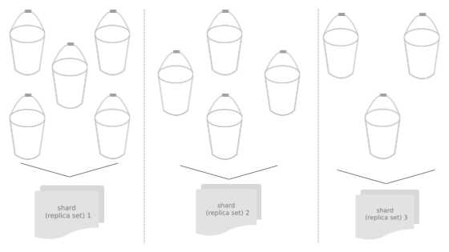

.. _vshard-architecture:

===============================================================================
Architecture
===============================================================================

.. _vshard-architecture-overview:

------------------------------------------------------------------------------
Overview
------------------------------------------------------------------------------

Consider a distributed Tarantool cluster that consists of subclusters called
**shards**, each storing some part of data. Each shard, in its turn, constitutes
a **replica set** consisting of several **replicas**, one of which serves as a master
node that processes all read and write requests.

The whole dataset is logically partitioned into a predefined number of :ref:`virtual
buckets <vshard-vbuckets>` (further just **buckets**), each assigned a unique number
ranging from 1 to N, where N is the total number of buckets.
The number of buckets is specifically chosen
to be several orders of magnitude larger than the potential number of cluster
nodes, even given future cluster scaling. For example, with M projected nodes
the dataset may be split into 100 * M or even 1,000 * M buckets. Care should
be taken when picking the number of buckets: if too large, it may require extra
memory for storing the routing information; if too small, it may decrease
the granularity of rebalancing.

Each shard stores a unique subset of buckets, which means that a bucket cannot
belong to several shards at once, as illustrated below:

This shard-to-bucket mapping is stored in a table in one of Tarantool’s system
spaces, with each shard holding only a specific part of the mapping that covers
those buckets that were assigned to this shard.

Apart from the mapping table, the **bucket id** is also stored in a special field of
every tuple of every table participating in sharding.

Once a shard receives any request (except for SELECT) from an
application, this shard checks the bucket id specified in the request
against the table of bucket ids that belong to a given node. If the
specified bucket id is invalid, the request gets terminated with the
following error: “wrong bucket”. Otherwise the request is executed, and
all the data created in the process is assigned the bucket id specified
in the request. Note that the request should only modify the data that
has the same bucket id as the request itself.

Storing bucket ids both in the data itself and the mapping table ensures data
consistency regardless of the application logic and makes rebalancing
transparent for the application. Storing the mapping table in a system space
ensures sharding is performed consistently in case of a failover, as all the
replicas in a shard share a common table state.

.. _vshard-vbuckets:

++++++++++++++++++++++++++++++++++++++++++++++++++++++++
Virtual buckets
++++++++++++++++++++++++++++++++++++++++++++++++++++++++

The sharded dataset is partitioned into a large number of abstract nodes called
**virtual buckets** (further just **buckets**).

The dataset is partitioned using the sharding key (or **bucket id**, in Tarantool
terminology). Bucket id is a number from 1 to N, where N is the total number of
buckets.

.. image:: buckets.svg
    :align: center

Each replica set stores a unique subset of buckets. One bucket cannot belong to
multiple replica sets at a time.

The total number of buckets is determined by the administrator who sets up the
initial cluster configuration.

Every space you plan to shard must have a numeric field containing bucket id-s.
This field must comply with the following requirements:

* The field's data type can be: unsigned, number or integer.
* The field must be not nullable.
* The field must be indexed by the :ref:`shard_index <cfg_basic-shard_index>`.
  The default name for this index is ``bucket_id``.

See the :ref:`configuration example <vshard-define-spaces>`.

.. _vshard-structure:

------------------------------------------------------------------------------
Structure
------------------------------------------------------------------------------

A sharded cluster in Tarantool consists of:

* storages,
* routers,
* and a rebalancer.

.. image:: schema.svg
    :align: center

.. _vshard-storage:

++++++++++++++++++++++++++++++++++++++++++++++++++++++++
Storage
++++++++++++++++++++++++++++++++++++++++++++++++++++++++

**Storage** is a node storing a subset of the dataset. Multiple replicated (for
redundancy) storages comprise a **replica set** (also called **shard**).

Each storage in a replica set has a role, **master** or **replica**. A master
processes read and write requests. A replica processes read requests but cannot
process write requests.

.. image:: master_replica.svg
    :align: center

.. _vshard-router:

++++++++++++++++++++++++++++++++++++++++++++++++++++++++
Router
++++++++++++++++++++++++++++++++++++++++++++++++++++++++

**Router** is a standalone software component that routes read and write requests
from the client application to shards.

All requests from the application come to the sharded cluster through a ``router``.
The ``router`` keeps the topology of a sharded cluster transparent for the application,
thus keeping the application unaware of:

* the number and location of shards,
* data rebalancing process,
* the fact and the process of a failover that occurred after a replica's failure.

A router can also calculate a bucket id on its own provided that the application
clearly defines rules for calculating a bucket id based on the request data.
To do it, a router needs to be aware of the data schema.

The ``router`` does not have a persistent state, nor does it store the cluster topology
or balance the data. The ``router`` is a standalone software component that can run
in the storage layer or application layer depending on the application features.

A router maintains a constant pool of connections to all the storages that is
created at startup. Creating it this way helps avoid configuration errors. Once
a pool is created, a router caches the current state of the ``_vbucket`` table to
speed up the routing. In case a bucket id is moved to another storage as
a result of data rebalancing, or one of the shards fails over to a replica,
a router updates the routing table in a way that's transparent for the application.

Sharding is not integrated into any centralized configuration storage system.
It is assumed that the application itself handles all the interactions with such
systems and passes sharding parameters. That said, the configuration can be
changed dynamically - for example, when adding or deleting one or several shards:

#. To add a new shard to the cluster, a system administrator first changes the
   configuration of all the routers and then the configuration of all the storages.
#. The new shard becomes available to the storage layer for rebalancing.
#. As a result of rebalancing, one of the vbuckets is moved to the new shard.
#. When trying to access the vbucket, a router receives a special error code
   that specifies the new vbucket location.

~~~~~~~~~~~~~~~~~~~~~~~~~~~~~~~~~~~~~~~~~~~~~~~~~~~~~~~~~~~~~~~~~~~~
CRUD (create, replace, update, delete) operations
~~~~~~~~~~~~~~~~~~~~~~~~~~~~~~~~~~~~~~~~~~~~~~~~~~~~~~~~~~~~~~~~~~~~

CRUD operations can be:

* executed in a stored procedure inside a storage, or
* initialized by the application.

In any case, the application must include the operation bucket id in a request.
When executing an INSERT request, the operation bucket id is stored in a newly
created tuple. In other cases, it is checked if the specified operation
bucket id matches the bucket id of a tuple being modified.

~~~~~~~~~~~~~~~~~~~~~~~~~~~~~~~~~~~~~~~~~~~~~~~~~~~~~~~~~~~~~~~~~~~~
SELECT requests
~~~~~~~~~~~~~~~~~~~~~~~~~~~~~~~~~~~~~~~~~~~~~~~~~~~~~~~~~~~~~~~~~~~~

Since a storage is not aware of the mapping between a bucket id and a primary
key, all the SELECT requests executed in stored procedures inside a storage are
only executed locally. Those SELECT requests that were initialized by the
application are forwarded to a router. Then, if the application has passed
a bucket id, a router uses it for shard calculation.

~~~~~~~~~~~~~~~~~~~~~~~~~~~~~~~~~~~~~~~~~~~~~~~~~~~~~~~~~~~~~~~~~~~~
Calling stored procedures
~~~~~~~~~~~~~~~~~~~~~~~~~~~~~~~~~~~~~~~~~~~~~~~~~~~~~~~~~~~~~~~~~~~~

There are several ways of calling stored procedures in cluster replica sets.
Stored procedures can be called:

* on a specific vbucket located in a replica set (in this case, it is necessary
  to differentiate between read and write procedures, as write procedures are not
  applicable to vbuckets that are being migrated), or
* without specifying any particular vbucket.

All the routing validity checks performed for sharded DML operations hold true
for vbucket-bound stored procedures as well.

.. _vshard-rebalancer:

++++++++++++++++++++++++++++++++++++++++++++++++++++++++
Rebalancer
++++++++++++++++++++++++++++++++++++++++++++++++++++++++

**Rebalancer** is a background rebalancing process that ensures an even
distribution of buckets across the shards. During rebalancing, buckets are being
migrated among replica sets.

The rebalancer "wakes up" periodically and redistributes data from the most
loaded nodes to less loaded nodes. Rebalancing starts if the **disbalance threshold**
of a replica set exceeds a disbalance threshold specified in the configuration.

The disbalance threshold is calculated as follows:

.. code-block:: none

    |etalon_bucket_number - real_bucket_number| / etalon_bucket_number * 100

.. _vshard-migrate-buckets:

------------------------------------------------------------------------------
Migration of buckets
------------------------------------------------------------------------------

A replica set from which the bucket is being migrated is called a **source** ; a
target replica set to which the bucket is being migrated is called a **destination**.

A **replica set lock** makes a replica set invisible to the rebalancer. A locked
replica set can neither receive new buckets nor migrate its own buckets.

While a bucket is being migrated, it can have different states:

* ACTIVE – the bucket is available for read and write requests.
* PINNED – the bucket is locked for migrating to another replica set. Otherwise
  pinned buckets are similar to buckets in the ACTIVE state.
* SENDING – the bucket is currently being copied to the destination replica set;
  read requests to the source replica set are still processed.
* RECEIVING – the bucket is currently being filled; all requests to it are rejected.
* SENT – the bucket was migrated to the destination replica set. The `router`
  uses the SENT state to calculate the new location of the bucket. A bucket in
  the SENT state goes to the GARBAGE state automatically after BUCKET_SENT_GARBAGE_DELAY
  seconds, which by default is :ref:`0.5 seconds <cfg_basic-collect_bucket_garbage_interval>`.
* GARBAGE – the bucket was already migrated to the destination replica set during
  rebalancing; or the bucket was initially in the RECEIVING state, but some error
  occurred during the migration.

Buckets in the GARBAGE state are deleted by the garbage collector.

.. image:: states.svg
    :align: center

Migration is performed as follows:

1. At the destination replica set, a new bucket is created and assigned the RECEIVING
   state, the data copying starts, and the bucket rejects all requests.
2. The source bucket in the source replica set is assigned the SENDING state, and
   the bucket continues to process read requests.
3. Once the data is copied, the bucket on the source replica set is assigned the SENT
   and it starts rejecting all requests.
4. The bucket on the destination replica set is assigned the ACTIVE state and starts
   accepting all requests.

.. NOTE::

    There is a specific error ``vshard.error.code.TRANSFER_IS_IN_PROGRESS`` that
    returns in case a request tries to perform an action not applicable to a bucket
    which is being relocated. You need to retry the request in this case.

.. _vshard-bucket-space:

++++++++++++++++++++++++++++++++++++++++++++++++++++++++
The `_bucket` system space
++++++++++++++++++++++++++++++++++++++++++++++++++++++++

The ``_bucket`` system space of each replica set stores the ids of buckets present
in the replica set. The space contains the following fields:

* ``bucket`` – bucket id
* ``status`` – state of the bucket
* ``destination`` – UUID of the destination replica set

An example of ``_bucket.select{}``:

.. code-block:: tarantoolsession

    ---
    - - [1, ACTIVE, abfe2ef6-9d11-4756-b668-7f5bc5108e2a]
      - [2, SENT, 19f83dcb-9a01-45bc-a0cf-b0c5060ff82c]
    ...

Once the bucket is migrated, the destination replica set identified by UUID is filled in the
table. While the bucket is still located on the source replica set, the value of
the destination replica set UUID is equal to ``NULL``.

.. _vshard-routing-table:

++++++++++++++++++++++++++++++++++++++++++++++++++++++++
The routing table
++++++++++++++++++++++++++++++++++++++++++++++++++++++++

А routing table on the ``router`` stores the map of all bucket ids to replica sets.
It ensures the consistency of sharding in case of failover.

The ``router`` keeps a persistent pool of connections to all the storages that
are created at startup. This helps prevent configuration errors. Once the connection
pool is created, the ``router`` caches the current state of the routing table in order
to speed up routing. If a bucket migrated to another ``storage`` after rebalancing,
or a failover occurred and caused one of the shards switching to another replica,
the ``discovery fiber`` on the ``router`` updates the routing table automatically.

As the bucket id is explicitly indicated both in the data and in the mapping table
on the ``router``, the data is consistent regardless of the application logic. It also
makes rebalancing transparent for the application.

.. _vshard-process-requests:

------------------------------------------------------------------------------
Processing requests
------------------------------------------------------------------------------

Requests to the database can be performed by the application or using stored
procedures. Either way, the bucket id should be explicitly specified in the request.

All requests are forwarded to the ``router`` first. The only operation supported
by the ``router`` is ``call``. The operation is performed via the ``vshard.router.call()``
function:

.. code-block:: lua

    result = vshard.router.call(<bucket_id>, <mode>, <function_name>, {<argument_list>}, {<opts>})

Requests are processed as follows:

1. The ``router`` uses the bucket id to search for a replica set with the
   corresponding bucket in the routing table.

   If the map of the bucket id to the replica set is not known to the ``router``
   (the discovery fiber hasn’t filled the table yet), the ``router`` makes requests
   to all ``storages`` to find out where the bucket is located.
2. Once the bucket is located, the shard checks:

   * whether the bucket is stored in the ``_bucket`` system space of the replica set;
   * whether the bucket is ACTIVE or PINNED (for a read request, it can also be SENDING).

3. If all the checks succeed, the request is executed. Otherwise, it is terminated
   with the error: ``“wrong bucket”``.

.. _vshard-glossary:

-------------------------------------------------------------------------------
Glossary
-------------------------------------------------------------------------------

.. glossary::

    .. vshard-vertical_scaling:

    **Vertical scaling**
        Adding more power to a single server: using a more powerful CPU, adding
        more capacity to RAM, adding more storage space, etc.

    .. vshard-horizontal_scaling:

    **Horizontal scaling**
        Adding more servers to the pool of resources, then partitioning and
        distributing a dataset across the servers.

    .. vshard-sharding:

    **Sharding**
        A database architecture that allows partitioning a dataset using a sharding
        key and distributing a dataset across multiple servers. Sharding is a
        special case of horizontal scaling.

    .. vshard-node:

    **Node**
        A virtual or physical server instance.

    .. vshard-cluster:

    **Cluster**
        A set of nodes that make up a single group.

    .. vshard-storage:

    **Storage**
        A node storing a subset of a dataset.

    .. vshard-replica_set:

    **Replica set**
        A set of storage nodes storing copies of a dataset. Each storage in a
        replica set has a role, master or replica.

    .. vshard-master:

    **Master**
        A storage in a replica set processing read and write requests.

    .. vshard-replica:

    **Replica**
        A storage in a replica set processing only read requests.

    .. vshard-read_requests:

    **Read requests**
        Read-only requests, that is, select requests.

    .. vshard-write_requests:

    **Write requests**
        Data-change operations, that is create, replace, update, delete requests.

    .. vshard-bucket:

    **Buckets (virtual buckets)**
        The abstract virtual nodes into which the dataset is partitioned by the
        sharding key (bucket id).

    .. vshard-bucket-id:

    **Bucket id**
        A sharding key defining which bucket belongs to which replica set.
        A bucket id may be calculated from a :ref:`hash key <router_api-bucket_id_strcrc32>`.

    .. vshard-router:

    **Router**
        A proxy server responsible for routing requests from an application to
        nodes in a cluster.
