.. _sql_statements_and_clauses:

--------------------------------------------------------------------------------
SQL statements and clauses
--------------------------------------------------------------------------------

The Statements and Clauses guide shows all Tarantool/SQL statements' syntax and use.

.. list-table::
   :widths: 50 50
   :header-rows: 1
   :align: left

   * - Heading
     - Summary
   * - :ref:`Statements that change data definition <sql_statements_change_definition>`
     - :ref:`ALTER TABLE <sql_alter_table>`, :ref:`CREATE TABLE <sql_create_table>`, :ref:`DROP TABLE <sql_drop_table>`,
       :ref:`CREATE VIEW <sql_create_view>`, :ref:`DROP VIEW <sql_drop_view>`, :ref:`CREATE INDEX <sql_create_index>`,
       :ref:`DROP INDEX <sql_drop_index>`, :ref:`CREATE TRIGGER <sql_create_trigger>`, :ref:`DROP TRIGGER <sql_drop_trigger>`
   * - :ref:`Statements that change data <sql_statements_change_data>`
     - :ref:`INSERT <sql_insert>`, :ref:`UPDATE <sql_update>`,  :ref:`DELETE <sql_delete>`, :ref:`REPLACE <sql_replace>`,
       :ref:`TRUNCATE <sql_truncate>`, :ref:`SET <sql_set>`
   * - :ref:`Statements that retrieve data <sql_statements_retrieve_data>`
     - :ref:`SELECT <sql_select>`, :ref:`VALUES <sql_values>`, :ref:`PRAGMA <sql_pragma>`, :ref:`EXPLAIN <sql_explain>`
   * - :ref:`Statements for transactions <sql_transactions>`
     - :ref:`START TRANSACTION <sql_start_transaction>`, :ref:`COMMIT <sql_commit>`, :ref:`SAVEPOINT <sql_savepoint>`,
       :ref:`RELEASE SAVEPOINT <sql_release_savepoint>`, :ref:`ROLLBACK <sql_rollback>`
   * - :ref:`Functions <sql_functions>`
     - For example :ref:`CAST(...) <sql_function_cast>`, :ref:`LENGTH(...) <sql_function_length>`,
       :ref:`VERSION() <sql_function_version>`

.. _sql_statements_change_definition:

~~~~~~~~~~~~~~~~~~~~~~~~~~~~~~~~~~~~~~~~~~~~~~~~~~~~~~~~~~~~~~~~~~~~~~~~~~~~~~~~
Statements that change data definition
~~~~~~~~~~~~~~~~~~~~~~~~~~~~~~~~~~~~~~~~~~~~~~~~~~~~~~~~~~~~~~~~~~~~~~~~~~~~~~~~

.. _sql_alter_table:

********************************************************************************
ALTER TABLE
********************************************************************************

Syntax:

* :samp:`ALTER TABLE {table-name} RENAME TO {new-table-name};`
* :samp:`ALTER TABLE {table-name} ADD COLUMN {column-name} {column-definition};`
* :samp:`ALTER TABLE {table-name} ADD CONSTRAINT {constraint-name} {constraint-definition};`
* :samp:`ALTER TABLE {table-name} DROP CONSTRAINT {constraint-name};`
* :samp:`ALTER TABLE {table-name} ENABLE|DISABLE CHECK CONSTRAINT {constraint-name};`

|br|

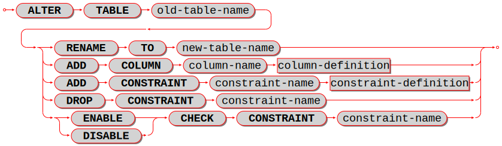

|br|

ALTER is used to change a table's name or a table's elements.

**Examples:**

For renaming a table with ``ALTER ... RENAME``, the *old-table* must exist, the *new-table* must not
exist. Example: |br|
``-- renaming a table:``
``ALTER TABLE t1 RENAME TO t2;``

For adding a :ref:`column <sql_column_def>` with ``ADD COLUMN``,
the table must exist, the table must be empty,
the column name must be unique within the table.
Example with a STRING column that must start with X:

..  code-block:: sql

    ALTER TABLE t1 ADD COLUMN s4 STRING CHECK (s4 LIKE 'X%');

``ALTER TABLE ... ADD COLUMN`` support was added in version :doc:`2.7.1 </release/2.7.1>`.

For adding a :ref:`table constraint <sql_table_constraint_def>` with ``ADD CONSTRAINT``,
the table must exist, the table must be empty,
the constraint name must be unique within the table.
Example with a :ref:`foreign-key constraint definition <sql_foreign_key>`: |br|
``ALTER TABLE t1 ADD CONSTRAINT fk_s1_t1_1 FOREIGN KEY (s1) REFERENCES t1;`` |br|

It is not possible to say ``CREATE TABLE table_a ... REFERENCES table_b ...``
if table ``b`` does not exist yet. This is a situation where ``ALTER TABLE`` is
handy -- users can ``CREATE TABLE table_a`` without the foreign key, then
``CREATE TABLE table_b``, then ``ALTER TABLE table_a ... REFERENCES table_b ...``.

.. code-block:: sql

   -- adding a primary-key constraint definition:
   -- This is unusual because primary keys are created automatically
   -- and it is illegal to have two primary keys for the same table.
   -- However, it is possible to drop a primary-key index, and this
   -- is a way to restore the primary key if that happens.
   ALTER TABLE t1 ADD CONSTRAINT "pk_unnamed_T1_1" PRIMARY KEY (s1);

   -- adding a unique-constraint definition:
   -- Alternatively, you can say CREATE UNIQUE INDEX unique_key ON t1 (s1);
   ALTER TABLE t1 ADD CONSTRAINT "unique_unnamed_T1_2" UNIQUE (s1);

   -- Adding a check-constraint definition:
   ALTER TABLE t1 ADD CONSTRAINT "ck_unnamed_T1_1" CHECK (s1 > 0);

.. _sql_alter_table_drop_constraint:

For ``ALTER ... DROP CONSTRAINT``, it is only legal to drop a named constraint.
(Tarantool generates the
constraint names automatically if the user does not provide them.)
Since version :doc:`2.4.1 </release/2.4.1>`, it is possible to drop
any of the named table constraints, namely, PRIMARY KEY, UNIQUE, FOREIGN KEY,
and CHECK.

To remove a unique constraint, use either ``ALTER ... DROP CONSTRAINT`` or
:ref:`DROP INDEX <sql_drop_index>`, which will drop the constraint
as well.

.. code-block:: sql

   -- dropping a constraint:
   ALTER TABLE t1 DROP CONSTRAINT "fk_unnamed_JJ2_1";

For ``ALTER ... ENABLE|DISABLE CHECK CONSTRAINT``, it is only legal to enable or disable a named constraint,
and Tarantool only looks for names of check constraints.
By default a constraint is enabled.
If a constraint is disabled, then the check will not be performed.

.. code-block:: sql

   -- disabling and re-enabling a constraint:
   ALTER TABLE t1 DISABLE CHECK CONSTRAINT c;
   ALTER TABLE t1 ENABLE CHECK CONSTRAINT c;

Limitations:

* It is not possible to drop a column.
* It is not possible to modify NOT NULL constraints or column properties DEFAULT
  and :ref:`data type <sql_column_def_data_type>`.
  However, it is possible to modify them with Tarantool/NOSQL, for example by
  calling :ref:`space_object:format() <box_space-format>` with a different
  ``is_nullable`` value.

.. _sql_create_table:

********************************************************************************
CREATE TABLE
********************************************************************************

Syntax:

:samp:`CREATE TABLE [IF NOT EXISTS] {table-name} (column-definition or table-constraint list)`
:samp:`[WITH ENGINE = {string}];`

|br|

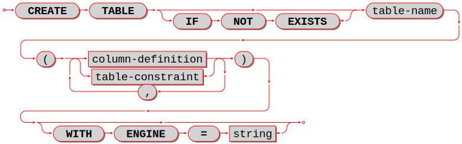

|br|

Create a new base table, usually called a "table".

.. NOTE::

   A table is a *base table* if it is created with CREATE TABLE and contains
   data in persistent storage.

   A table is a *viewed table*, or just "view", if it is created with
   :ref:`CREATE VIEW <sql_create_view>` and gets its data from other views or from base tables.

The *table-name* must be an identifier which is valid according to the rules for
identifiers, and must not be the name of an already existing base table or view.

The *column-definition* or *table-constraint* list is a comma-separated list
of :ref:`column definitions <sql_column_def>`
or :ref:`table constraint definitions <sql_table_constraint_def>`.
Column definitions and table constraint definitions are sometimes called *table elements*.

Rules:

* A primary key is necessary; it can be specified with a table constraint
  PRIMARY KEY.
* There must be at least one column.
* When IF NOT EXISTS is specified, and there is already a table with the same
  name, the statement is ignored.
* When :samp:`WITH ENGINE = {string}` is specified,
  where :samp:`{string}` must be either 'memtx' or 'vinyl',
  the table is created with that :ref:`storage engine <engines-chapter>`.
  When this clause is not specified,
  the table is created with the default engine,
  which is ordinarily 'memtx' but may be changed
  by updating the :ref:`box.space._session_settings <box_space-session_settings>` system table..

Actions:

#. Tarantool evaluates each column definition and table-constraint,
   and returns an error if any of the rules is violated.
#. Tarantool makes a new definition in the schema.
#. Tarantool makes new indexes for PRIMARY KEY or UNIQUE constraints.
   A unique index name is created automatically.
#. Usually Tarantool effectively executes a :ref:`COMMIT <sql_commit>` statement.

Examples:

.. code-block:: sql

   -- the simplest form, with one column and one constraint:
   CREATE TABLE t1 (s1 INTEGER, PRIMARY KEY (s1));

   -- you can see the effect of the statement by querying
   -- Tarantool system spaces:
   SELECT * FROM "_space" WHERE "name" = 'T1';
   SELECT * FROM "_index" JOIN "_space" ON "_index"."id" = "_space"."id"
            WHERE "_space"."name" = 'T1';

   -- variation of the simplest form, with delimited identifiers
   -- and a bracketed comment:
   CREATE TABLE "T1" ("S1" INT /* synonym of INTEGER */, PRIMARY KEY ("S1"));

   -- two columns, one named constraint
   CREATE TABLE t1 (s1 INTEGER, s2 STRING, CONSTRAINT pk_s1s2_t1_1 PRIMARY KEY (s1, s2));

Limitations:

* The maximum number of columns is 2000.
* The maximum length of a row depends on the
  :ref:`memtx_max_tuple_size <cfg_storage-memtx_max_tuple_size>` or
  :ref:`vinyl_max_tuple_size  <cfg_storage-memtx_max_tuple_size>`
  configuration option.

.. _sql_column_def:

++++++++++++++++++++++++++++++++++++++++++++++++++++++++++++++++++++++++++++++++
Column definition
++++++++++++++++++++++++++++++++++++++++++++++++++++++++++++++++++++++++++++++++

Syntax:

:samp:`column-name data-type [, column-constraint]`

Define a column, which is a table-element used in a :ref:`CREATE TABLE <sql_create_table>` statement.

The ``column-name`` must be an identifier which is valid according to the rules
for identifiers.

Each ``column-name`` must be unique within a table.

.. _sql_column_def_data_type:

^^^^^^^^^^^^^^^^^^^^^^^^^^^^^^^^^^^^^^^^^^^^^^^^^^^^^^^^^^^^^^^^^^^^^^^^^^^^^^^^
Column definition -- data type
^^^^^^^^^^^^^^^^^^^^^^^^^^^^^^^^^^^^^^^^^^^^^^^^^^^^^^^^^^^^^^^^^^^^^^^^^^^^^^^^

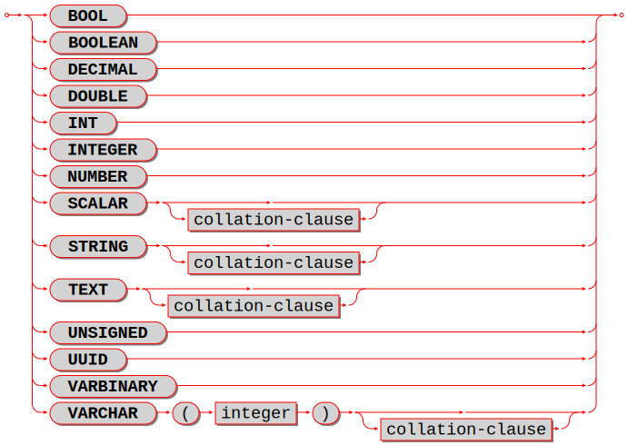

|br|

Every column has a data type:
ANY or ARRAY or BOOLEAN or DECIMAL or DOUBLE or INTEGER or MAP or NUMBER
or SCALAR or STRING or UNSIGNED or UUID or VARBINARY.
The detailed description of data types is in the section
:ref:`Operands <sql_operands>`.

.. _sql_column_def_scalar:

^^^^^^^^^^^^^^^^^^^^^^^^^^^^^^^^^^^^^^^^^^^^^^^^^^^^^^^^^^^^^^^^^^^^^^^^^^^^^^^^
Column definition -- the rules for the SCALAR data type
^^^^^^^^^^^^^^^^^^^^^^^^^^^^^^^^^^^^^^^^^^^^^^^^^^^^^^^^^^^^^^^^^^^^^^^^^^^^^^^^

The rules for the SCALAR data type were significantly changed in Tarantool version
:tarantool-release:`2.10.0`.

SCALAR is a "complex" data type, unlike all the other data types which are "primitive".
Two column values in a SCALAR column can have two different primitive data types.

#. Any item defined as SCALAR has an underlying primitive type. For example, here:

   .. code-block:: sql

      CREATE TABLE t (s1 SCALAR PRIMARY KEY);
      INSERT INTO t VALUES (55), ('41');

   the underlying primitive type of the item in the first row is INTEGER
   because literal 55 has data type INTEGER, and the underlying primitive type
   in the second row is STRING (the data type of a literal is always clear from
   its format).

   An item's primitive type is far less important than its defined type.
   Incidentally Tarantool might find the primitive type by looking at the way
   MsgPack stores it, but that is an implementation detail.

#. A SCALAR definition may not include a maximum length, as there is no suggested
   restriction.
#. A SCALAR definition may include a :ref:`COLLATE clause <sql_collate_clause>`, which affects any items
   whose primitive data type is STRING. The default collation is "binary".
#. Some assignments are illegal when data types differ, but legal when the
   target is a SCALAR item. For example ``UPDATE ... SET column1 = 'a'``
   is illegal if ``column1`` is defined as INTEGER, but is legal if ``column1``
   is defined as SCALAR -- values which happen to be INTEGER will be changed
   so their data type is SCALAR.
#. There is no literal syntax which implies data type SCALAR.
#. TYPEOF(x) is always 'scalar' or 'NULL', it is never the underlying data type.
   In fact there is no function that is guaranteed to return the underlying data type.
   For example, ``TYPEOF(CAST(1 AS SCALAR));`` returns 'scalar', not 'integer'.
#. For any operation that requires implicit casting from an item defined as SCALAR,
   the operation will fail at runtime.
   For example, if a definition is:

   .. code-block:: sql

      CREATE TABLE t (s1 SCALAR PRIMARY KEY, s2 INTEGER);

   and the only row in table T has s1 = 1, that is, its underlying primitive type is
   INTEGER, then ``UPDATE t SET s2 = s1;`` is illegal.
#. For any dyadic operation that requires implicit casting for comparison, the
   syntax is legal and the operation will not fail at runtime.
   Take this situation: comparison with a primitive type VARBINARY and
   a primitive type STRING.

   .. code-block:: sql

      CREATE TABLE t (s1 SCALAR PRIMARY KEY);
      INSERT INTO t VALUES (X'41');
      SELECT * FROM t WHERE s1 > 'a';

   The comparison is valid, because Tarantool knows the ordering of X'41' and 'a'
   in Tarantool/NoSQL 'scalar' -- this is a case where the primitive type matters.
#. The result data type of :ref:`min/max <sql_aggregate>` operation on a column defined as SCALAR
   is SCALAR.
   Users will need to know the underlying primitive type of the result in advance. For example:

   .. code-block:: sql

      CREATE TABLE t (s1 INTEGER, s2 SCALAR PRIMARY KEY);
      INSERT INTO t VALUES (1, X'44'), (2, 11), (3, 1E4), (4, 'a');
      SELECT cast(min(s2) AS INTEGER), hex(cast(max(s2) as VARBINARY)) FROM t;

   The result is: ``- - [11, '44',]``

   That is only possible with Tarantool/NoSQL scalar rules, but ``SELECT SUM(s2)``
   would not be legal because addition would in this case require implicit casting
   from VARBINARY to a numeric, which is not sensible.
#. The result data type of a primitive combination is sometimes SCALAR although Tarantool
   in effect uses the primitive data type not the defined data type.
   (Here the word "combination" is used in the way that the standard document
   uses it for section "Result of data type combinations".) Therefore for
   ``greatest(1E308, 'a', 0, X'00')`` the result is X'00' but
   ``typeof(greatest(1E308, 'a', 0, X'00')`` is 'scalar'.
#. The union of two SCALARs is sometimes the primitive type.
   For example, ``SELECT TYPEOF((SELECT CAST('a' AS SCALAR) UNION SELECT CAST('a' AS SCALAR)));``
   returns 'string'.

^^^^^^^^^^^^^^^^^^^^^^^^^^^^^^^^^^^^^^^^^^^^^^^^^^^^^^^^^^^^^^^^^^^^^^^^^^^^^^^^
Column definition -- relation to NoSQL
^^^^^^^^^^^^^^^^^^^^^^^^^^^^^^^^^^^^^^^^^^^^^^^^^^^^^^^^^^^^^^^^^^^^^^^^^^^^^^^^

All of the SQL data types except SCALAR correspond to
:ref:`Tarantool/NoSQL types with the same name <index-box_indexed-field-types>`.
For example an SQL STRING is stored in a NoSQL space as type = 'string'.

Therefore specifying an SQL data type X determines that the storage will be
in a space with a format column saying that the NoSQL type is 'x'.

The rules for that NoSQL type are applicable to the SQL data type.

If two items have SQL data types that have the same underlying type, then they
are compatible for all assignment or comparison purposes.

If two items have SQL data types that have different underlying types, then the
rules for explicit casts, or implicit (assignment) casts, or implicit (comparison)
casts, apply.

There is one floating-point value which is not handled by SQL: -nan is seen as NULL
although its data type is 'double'.

Before Tarantool :tarantool-release:`2.10.0`, there were also some Tarantool/NoSQL data types which had no corresponding
SQL data types. For example, ``SELECT "flags" FROM "_vspace";`` would return
a column whose SQL data type is VARBINARY rather than MAP. Such columns can only be manipulated in SQL
by :ref:`invoking Lua functions <sql_calling_lua>`.

.. _sql_column_def_constraint:

^^^^^^^^^^^^^^^^^^^^^^^^^^^^^^^^^^^^^^^^^^^^^^^^^^^^^^^^^^^^^^^^^^^^^^^^^^^^^^^^
Column definition -- column-constraint or default clause
^^^^^^^^^^^^^^^^^^^^^^^^^^^^^^^^^^^^^^^^^^^^^^^^^^^^^^^^^^^^^^^^^^^^^^^^^^^^^^^^

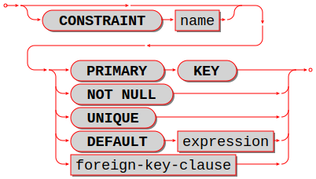

The column-constraint or default clause may be as follows:

.. list-table::
   :widths: 33 67
   :header-rows: 1
   :align: left

   * - Type
     - Comment
   * - NOT NULL
     - means "it is illegal to assign a NULL to this column"
   * -  PRIMARY KEY
     - explained in the later section
       :ref:`"Table Constraint Definition" <sql_table_constraint_def>`
   * - UNIQUE
     - explained in the later section
       "Table Constraint Definition"
   * - CHECK (expression)
     - explained in the later section
       "Table Constraint Definition"
   * - foreign-key-clause
     - explained in the later section
       :ref:`"Table Constraint Definition for foreign keys"
       <sql_foreign_key>`
   * - DEFAULT expression
     - means
       "if INSERT does not assign to this column
       then assign expression result to this column" --
       if there is no DEFAULT clause then DEFAULT NULL
       is assumed

If column-constraint is PRIMARY KEY, this is a shorthand for a separate
:ref:`table-constraint definition <sql_table_constraint_def>`: "PRIMARY KEY (column-name)".

If column-constraint is UNIQUE, this is a shorthand for a separate
:ref:`table-constraint definition <sql_table_constraint_def>`: "UNIQUE (column-name)".

If column-constraint is CHECK, this is a shorthand for a separate
:ref:`table-constraint definition <sql_table_constraint_def>`: "CHECK (expression)".

Columns defined with PRIMARY KEY are automatically NOT NULL.

To enforce some restrictions that Tarantool does not enforce automatically,
add CHECK clauses, like these:

.. code-block:: sql

   CREATE TABLE t ("smallint" INTEGER PRIMARY KEY CHECK ("smallint" <= 32767 AND "smallint" >= -32768));
   CREATE TABLE t ("shorttext" STRING PRIMARY KEY CHECK (length("shorttext") <= 10));

but this may cause inserts or updates to be slow.

^^^^^^^^^^^^^^^^^^^^^^^^^^^^^^^^^^^^^^^^^^^^^^^^^^^^^^^^^^^^^^^^^^^^^^^^^^^^^^^^
Column definition -- examples
^^^^^^^^^^^^^^^^^^^^^^^^^^^^^^^^^^^^^^^^^^^^^^^^^^^^^^^^^^^^^^^^^^^^^^^^^^^^^^^^

These are shown within :ref:`CREATE TABLE <sql_create_table>` statements.
Data types may also appear in :ref:`CAST <sql_function_cast>` functions.

.. code-block:: sql

   -- the simple form with column-name and data-type
   CREATE TABLE t (column1 INTEGER ...);
   -- with column-name and data-type and column-constraint
   CREATE TABLE t (column1 STRING PRIMARY KEY ...);
   -- with column-name and data-type and collate-clause
   CREATE TABLE t (column1 SCALAR COLLATE "unicode" ...);

.. code-block:: sql

   -- with all possible data types and aliases
   CREATE TABLE t
   (column1 BOOLEAN, column2 BOOL,
    column3 INT PRIMARY KEY, column4 INTEGER,
    column5 DOUBLE,
    column6 NUMBER,
    column7 STRING, column8 STRING COLLATE "unicode",
    column9 TEXT, columna TEXT COLLATE "unicode_sv_s1",
    columnb VARCHAR(0), columnc VARCHAR(100000) COLLATE "binary",
    columnd UUID,
    columne VARBINARY,
    columnf SCALAR, columng SCALAR COLLATE "unicode_uk_s2",
    columnh DECIMAL,
    columni ARRAY,
    columnj MAP,
    columnk ANY);

.. code-block:: sql

   -- with all possible column constraints and a default clause
   CREATE TABLE t
   (column1 INTEGER NOT NULL,
    column2 INTEGER PRIMARY KEY,
    column3 INTEGER UNIQUE,
    column4 INTEGER CHECK (column3 > column2),
    column5 INTEGER REFERENCES t,
    column6 INTEGER DEFAULT NULL);

.. _sql_table_constraint_def:

++++++++++++++++++++++++++++++++++++++++++++++++++++++++++++++++++++++++++++++++
Table Constraint Definition
++++++++++++++++++++++++++++++++++++++++++++++++++++++++++++++++++++++++++++++++

Syntax:

:samp:`[CONSTRAINT {constraint-name}] primary-key-constraint | unique-constraint | check-constraint | foreign-key-constraint`

|br|

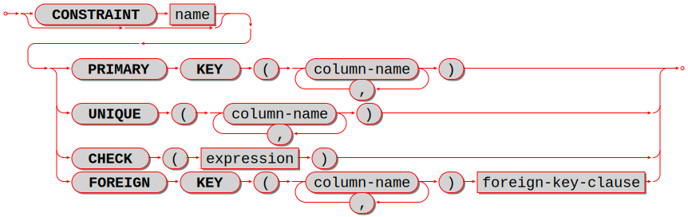

|br|

Define a constraint, which is a table-element used in a CREATE TABLE statement.

The constraint-name must be an identifier which is valid according to the rules for identifiers.
The constraint-name must be unique within the table.

PRIMARY KEY constraints look like this: |br|
:samp:`PRIMARY KEY ({column-name} [, {column-name}...])`

There is a shorthand: specifying PRIMARY KEY in a :ref:`column definition <sql_column_def_constraint>`.

Every table must have one and only one primary key. |br|
Primary-key columns are automatically NOT NULL. |br|
Primary-key columns are automatically indexed. |br|
Primary-key columns are unique, that is, it is illegal to have two rows which
have the same values for the columns specified in the constraint.

Examples:

.. code-block:: sql

    -- this is a table with a one-column primary-key constraint
    CREATE TABLE t1 (s1 INTEGER, PRIMARY KEY (s1));
    -- this is the column-definition shorthand for the same thing:
    CREATE TABLE t1 (s1 INTEGER PRIMARY KEY);
    -- this is a table with a two-column primary-key constraint
    CREATE TABLE t2 (s1 INTEGER, s2 INTEGER, PRIMARY KEY (s1, s2));
    -- this is an example of an attempted primary-key violation
    -- (the third INSERT will fail because 55, 'a' is a duplicate)
    CREATE TABLE t3 (s1 INTEGER, s2 STRING, PRIMARY KEY (s1, s2));
    INSERT INTO t3 VALUES (55, 'a');
    INSERT INTO t3 VALUES (55, 'b');
    INSERT INTO t3 VALUES (55, 'a');

PRIMARY KEY plus AUTOINCREMENT modifier may be specified in one of two ways: |br|
- In a column definition after the words PRIMARY KEY, as in ``CREATE TABLE t (c INTEGER PRIMARY KEY AUTOINCREMENT);`` |br|
- In a PRIMARY KEY (column-list) after a column name, as in ``CREATE TABLE t (c INTEGER, PRIMARY KEY (c AUTOINCREMENT));`` |br|
When AUTOINCREMENT is specified, the column must be a primary-key column and it must be INTEGER or UNSIGNED. |br|
Only one column in the table may be autoincrement.
However, it is legal to say ``PRIMARY KEY (a, b, c AUTOINCREMENT)`` -- in that case, there
are three columns in the primary key but only the first column (``a``) is AUTOINCREMENT.

As the name suggests, values in an autoincrement column are automatically incremented.
That is: if a user inserts NULL in the column, then the stored value will be the smallest
non-negative integer that has not already been used.
This occurs because autoincrement columns are associated with :doc:`sequences </reference/reference_lua/box_schema_sequence/create_index>`.

UNIQUE constraints look like this: |br|
:samp:`UNIQUE ({column-name} [, {column-name}...])`

There is a shorthand: specifying UNIQUE in a :ref:`column definition <sql_column_def_constraint>`.

Unique constraints are similar to primary-key constraints, except that:
a table may have any number of unique keys, and unique keys are not automatically NOT NULL. |br|
Unique columns are automatically indexed. |br|
Unique columns are unique, that is, it is illegal to have two rows with the same values in the unique-key columns.

Examples:

.. code-block:: sql

    -- this is a table with a one-column primary-key constraint
    -- and a one-column unique constraint
    CREATE TABLE t1 (s1 INTEGER, s2 INTEGER, PRIMARY KEY (s1), UNIQUE (s2));
    -- this is the column-definition shorthand for the same thing:
    CREATE TABLE t1 (s1 INTEGER PRIMARY KEY, s2 INTEGER UNIQUE);
    -- this is a table with a two-column unique constraint
    CREATE TABLE t2 (s1 INTEGER PRIMARY KEY, s2 INTEGER, UNIQUE (s2, s1));
    -- this is an example of an attempted unique-key violation
    -- (the third INSERT will not fail because NULL is not a duplicate)
    -- (the fourth INSERT will fail because 'a' is a duplicate)
    CREATE TABLE t3 (s1 INTEGER PRIMARY KEY, s2 STRING, UNIQUE (s2));
    INSERT INTO t3 VALUES (1, 'a');
    INSERT INTO t3 VALUES (2, NULL);
    INSERT INTO t3 VALUES (3, NULL);
    INSERT INTO t3 VALUES (4, 'a');

CHECK constraints look like this: |br|
:samp:`CHECK ({expression})`

There is a shorthand: specifying CHECK in a :ref:`column definition <sql_column_def_constraint>`.

The expression may be anything that returns a BOOLEAN result = TRUE or FALSE or UNKNOWN. |br|
The expression may not contain a :ref:`subquery <sql_subquery>`. |br|
If the expression contains a column name, the column must exist in the table. |br|
If a CHECK constraint is specified, the table must not contain rows where the expression is FALSE.
(The table may contain rows where the expression is either TRUE or UNKNOWN.) |br|
Constraint checking may be stopped with :ref:`ALTER TABLE ... DISABLE CHECK CONSTRAINT <sql_alter_table>`
and restarted with ALTER TABLE ... ENABLE CHECK CONSTRAINT.

Examples:

.. code-block:: sql

    -- this is a table with a one-column primary-key constraint
    -- and a check constraint
    CREATE TABLE t1 (s1 INTEGER PRIMARY KEY, s2 INTEGER, CHECK (s2 <> s1));
    -- this is an attempt to violate the constraint, it will fail
    INSERT INTO t1 VALUES (1, 1);
    -- this is okay because comparison with NULL will not return FALSE
    INSERT INTO t1 VALUES (1, NULL);
    -- a constraint that makes it difficult to insert lower case
    CHECK (s1 = UPPER(s1))

Limitations: (`Issue#3503 <https://github.com/tarantool/tarantool/issues/3503>`_): |br|
* ``CREATE TABLE t99 (s1 INTEGER, UNIQUE(s1, s1),PRIMARY KEY(s1));``
causes no error message, although (s1, s1) is probably a user error.

.. _sql_foreign_key:

++++++++++++++++++++++++++++++++++++++++++++++++++++++++++++++++++++++++++++++++
Table Constraint Definition for foreign keys
++++++++++++++++++++++++++++++++++++++++++++++++++++++++++++++++++++++++++++++++

FOREIGN KEY constraints look like this: |br|
:samp:`FOREIGN KEY ({referencing-column-name} [, {referencing-column-name}...]) REFERENCES {referenced-table-name} [({referenced-column-name} [, {referenced-column-name}...]]) [MATCH FULL] [update-or-delete-rules]`

There is a shorthand: specifying REFERENCES in a :ref:`column definition <sql_column_def_constraint>`.

The referencing column names must be defined in the table that is being created.
The referenced table name must refer to a table that already exists,
or to the table that is being created.
The referenced column names must be defined in the referenced table,
and have similar data types.
There must be a PRIMARY KEY or UNIQUE constraint or UNIQUE index on the referenced column names.

The words MATCH FULL are optional and have no effect.

If a foreign-key constraint exists, then the values in the referencing columns
must equal values in the referenced columns of the referenced table,
or at least one of the referencing columns must contain NULL.

Examples:

.. code-block:: sql

    -- A foreign key referencing a primary key in the same table
    CREATE TABLE t1 (s1 INTEGER PRIMARY KEY, s2 INTEGER, FOREIGN KEY (s2) REFERENCES t1 (s1));
    -- The same thing with column shorthand
    CREATE TABLE t1 (s1 INTEGER PRIMARY KEY, s2 INTEGER REFERENCES t1(s1));
    -- An attempt to violate the constraint -- this will fail
    INSERT INTO t1 VALUES (1, 2);
    -- A NULL in the referencing column -- this will succeed
    INSERT INTO t1 VALUES (1, NULL);
    -- A reference to a primary key that now exists -- this will succeed
    INSERT INTO t1 VALUES (2, 1);

The optional update-or-delete rules look like this: |br|
``ON {UPDATE|DELETE} { CASCADE | SET DEFAULT | SET NULL | RESTRICT | NO ACTION}`` |br|
and the idea is: if something changes the referenced key, then one of these possible "referential actions" takes place: |br|
``CASCADE``: the change that is applied for the referenced key is applied for the referencing key. |br|
``SET DEFAULT``: the referencing key is set to its default value. |br|
``SET NULL``: the referencing key is set to NULL. |br|
``RESTRICT``: the UPDATE or DELETE fails if a referencing key exists; checked immediately. |br|
``NO ACTION``: the UPDATE or DELETE fails if a referencing key exists; checked at statement end. |br|
The default is ``NO ACTION``.

For example:

.. code-block:: sql

    CREATE TABLE f1 (ordinal INTEGER PRIMARY KEY,
                 referenced_planet STRING UNIQUE NOT NULL);
    CREATE TABLE f2 (
        ordinal INTEGER PRIMARY KEY,
        referring_planet STRING DEFAULT 'Earth',
        FOREIGN KEY (referring_planet) REFERENCES f1 (referenced_planet)
            ON UPDATE SET DEFAULT
            ON DELETE CASCADE);
    INSERT INTO f1 VALUES (1, 'Mercury'), (2,' Venus'), (3, 'Earth');
    INSERT INTO f2 VALUES (1, 'Mercury'), (2, 'Mercury');
    UPDATE f1 SET referenced_planet = 'Mars'
        WHERE referenced_planet = 'Mercury';
    SELECT * FROM f2;
    DELETE FROM f1 WHERE referenced_planet = 'Earth';
    SELECT * FROM f2;
    ... In this example, the UPDATE statement changes the referenced key,
        and the clause is ON UPDATE SET DEFAULT, therefore both of the
        rows in f2 have referring_planet set to their default value,
        which is 'Earth'. The DELETE statement deletes the row that
        has 'Earth', and the clause is ON DELETE CASCADE,
        therefore both of the rows in f2 are deleted.

Limitations: |br|
* Foreign keys can have a MATCH clause (`Issue#3455 <https://github.com/tarantool/tarantool/issues/3455>`_).

.. COMMENT
   Constraint Conflict Clauses are temporarily disabled.
   However, the description is here, as a big comment.

   Constraint Conflict Clauses

   In a CREATE TABLE statement:
   CREATE TABLE ... constraint-definition ON CONFLICT {ABORT | FAIL | IGNORE | REPLACE | ROLLBACK} ...;

   In an INSERT or UPDATE statement:
   {INSERT|UPDATE} OR {ABORT | FAIL | IGNORE | REPLACE | ROLLBACK} ...;

   The standard way to handle a constraint violation is "statement rollback" -- all rows affected by the statement are restored to their original values -- and an error is returned. However, Tarantool allows the user to specify non-standard ways to handle PRIMARY KEY, UNIQUE, CHECK, and NOT NULL constraint violations.

   ABORT -- do statement rollback and return an error. This is the default and is recommended, so a user's best strategy is to never use constraint conflict clauses.

   FAIL -- return an error but do not do statement rollback.

   IGNORE -- do not insert or update the row whose update would cause an error, but do not do statement rollback and do not return an error. Due to optimizations related to NoSQL, handling with IGNORE may be slightly faster than handling with ABORT.

   REPLACE -- (for a UNIQUE or PRIMARY KEY constraint) --  instead of inserting a new row, delete the old row before putting in the new one;  (for a NOT NULL constraint for a column that has a non-NULL default value) replace the NULL value with the column's default value; (for a NOT NULL constraint for a column that has a NULL default value) do statement rollback and return an error; (for a CHECK constraint) -- do statement rollback and return an error. If REPLACE action causes a row to be deleted, and if PRAGMA recursive_triggers was specified earlier, then delete triggers (if any) are activated.

   ROLLBACK -- do transaction rollback and return an error.

   The order of constraint evaluation is described in section Order of Execution in Data-Change Statements.

   For example, suppose a new table  t has one column and the column has a unique constraint.
   A transaction starts with START TRANSACTION.
   The first statement in the transaction is INSERT INTO t VALUES (1), (2);
   that is, "insert 1, then insert 2" -- Tarantool processes the new rows in order.
   This statement always succeeds, there are no constraint violations.
   The second SQL statement is INSERT INTO t VALUES (3), (2), (5);
   that is, "insert 3, then insert 2".
   Inserting 3 is not a problem, but inserting 2 is a problem -- it would violate the UNIQUE constraint.

   If behavior is ABORT: the second statement is rolled back, there is an error message. The table now contains (1), (2).

   If behavior is FAIL: the second statement is not rolled back, there is an error message. The table now contains (1), (2), (3).

   If behavior is IGNORE: the second statement is not rolled back, the (2) is not inserted, there is no error message. The table now contains (1), (2), (3), (5).

   If behavior is REPLACE: the second statement is not rolled back, the first (2) is replaced by the second (2), there is no error message. The table now contains (1), (2), (3), (5).

   If behavior is ROLLBACK: the statement is rolled back, and the first statement is rolled back,
   and there is an error message. The table now contains nothing.

   There are two ways to specify the behavior: at the end of the CREATE TABLE statement constraint clause, or as an extra clause in an INSERT or UPDATE statement. Specification in the INSERT or UPDATE statement takes precedence.

   Another example:
   DROP TABLE t1;
   CREATE TABLE t1 (s1 INTEGER PRIMARY KEY ON CONFLICT REPLACE, s2 INTEGER);
   INSERT INTO t1 VALUES (1, NULL);      -- now t1 contains (1,NULL)
   INSERT INTO t1 VALUES (1, 1);         -- now t1 contains (1, 1)
   INSERT OR ABORT INTO t1 VALUES (1, 2); -- now t1 contains (1, 1)
   INSERT OR IGNORE INTO t1 VALUES (1, 2), (3, 4); -- now t1 contains (1, 1), (3, 4)
   PRAGMA recursive_triggers(true);
   CREATE TRIGGER t1d
     AFTER DELETE ON t1 FOR EACH ROW
     BEGIN
     INSERT INTO t1 VALUES (18, 25);
     END;
   INSERT INTO t1 VALUES (1, 4); -- now t1 contains (1, 4), (3, 4), (18, 35)

.. _sql_drop_table:

********************************************************************************
DROP TABLE
********************************************************************************

Syntax:

:samp:`DROP TABLE [IF EXISTS] {table-name};`

|br|

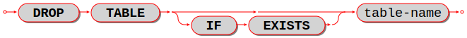

|br|

Drop a table.

The *table-name* must identify a table that was created earlier with the
:ref:`CREATE TABLE statement <sql_create_table>`.

Rules:

* If there is a view that references the table, the drop will fail.
  Please drop the referencing view with :ref:`DROP VIEW <sql_drop_view>` first.
* If there is a foreign key that references the table, the drop will fail.
  Please drop the referencing constraint with
  :ref:`ALTER TABLE ... DROP <sql_alter_table_drop_constraint>` first.

Actions:

#. Tarantool returns an error if the table does not exist and there is no ``IF EXISTS`` clause.
#. The table and all its data are dropped.
#. All indexes for the table are dropped.
#. All triggers for the table are dropped.
#. Usually Tarantool effectively executes a :ref:`COMMIT <sql_commit>` statement.

Examples:

.. code-block:: sql

   -- the simple case:
   DROP TABLE t31;
   -- with an IF EXISTS clause:
   DROP TABLE IF EXISTS t31;

See also: :ref:`DROP VIEW <sql_drop_view>`.

.. _sql_create_view:

********************************************************************************
CREATE VIEW
********************************************************************************

Syntax:

:samp:`CREATE VIEW [IF NOT EXISTS] {view-name} [(column-list)] AS subquery;`

|br|

.. image:: create_view.svg
    :align: left

|br|

Create a new viewed table, usually called a "view".

The *view-name* must be valid according to the rules for identifiers.

The optional *column-list* must be a comma-separated list of names of columns
in the view.

The syntax of the subquery must be the same as the syntax of a
:ref:`SELECT statement <sql_select>`,
or of a VALUES clause.

Rules:

* There must not already be a base table or view with the same name as
  *view-name*.
* If *column-list* is specified, the number of columns in *column-list* must be
  the same as the number of columns in the :ref:`select list <sql_select_list>` of the subquery.

Actions:

#. Tarantool will throw an error if a rule is violated.
#. Tarantool will create a new persistent object with *column-names* equal to
   the names in the *column-list* or the names in the subquery's *select list*.
#. Usually Tarantool effectively executes a :ref:`COMMIT <sql_commit>` statement.

Examples:

.. code-block:: sql

   -- the simple case:
   CREATE VIEW v AS SELECT column1, column2 FROM t;
   -- with a column-list:
   CREATE VIEW v (a,b) AS SELECT column1, column2 FROM t;

Limitations:

* It is not possible to insert or update or delete from a view, although
  sometimes a possible substitution is to
  :ref:`create an INSTEAD OF trigger <sql_create_trigger>`.

.. _sql_drop_view:

********************************************************************************
DROP VIEW
********************************************************************************

Syntax:

:samp:`DROP VIEW [IF EXISTS] {view-name};`

|br|

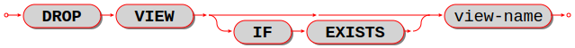

|br|

Drop a view.

The *view-name* must identify a view that was created earlier with the
:ref:`CREATE VIEW statement <sql_create_view>`.

Rules: none

Actions:

#. Tarantool returns an error if the view does not exist and there is no ``IF EXISTS`` clause.
#. The view is dropped.
#. All triggers for the view are dropped.
#. Usually Tarantool effectively executes a :ref:`COMMIT <sql_commit>` statement.

Examples:

.. code-block:: sql

   -- the simple case:
   DROP VIEW v31;
   -- with an IF EXISTS clause:
   DROP VIEW IF EXISTS v31;

See also: :ref:`DROP TABLE <sql_drop_table>`.

.. _sql_create_index:

********************************************************************************
CREATE INDEX
********************************************************************************

Syntax:

:samp:`CREATE [UNIQUE] INDEX [IF NOT EXISTS] {index-name} ON {table-name} (column-list);`

|br|

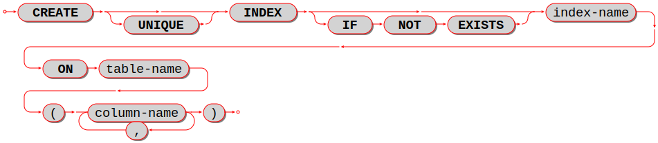

|br|

Create an index.

The *index-name* must be valid according to the rules for identifiers.

The *table-name* must refer to an existing table.

The *column-list* must be a comma-separated list of names of columns in the
table.

Rules:

* There must not already be, for the same table, an index with the same name as
  *index-name*.
  But there may already be, for a different table, an index with the same name as
  *index-name*.
* The maximum number of indexes per table is 128.

Actions:

#. Tarantool will throw an error if a rule is violated.
#. If the new index is UNIQUE, Tarantool will throw an error if any row exists
   with columns that have duplicate values.
#. Tarantool will create a new index.
#. Usually Tarantool effectively executes a :ref:`COMMIT <sql_commit>` statement.

Automatic indexes:

Indexes may be created automatically for columns mentioned in the PRIMARY KEY
or UNIQUE clauses of a CREATE TABLE statement.
If an index was created automatically, then the *index-name* has four parts:

#. ``pk`` if this is for a PRIMARY KEY clause, ``unique`` if this is for
   a UNIQUE clause;
#. ``_unnamed_``;
#. the name of the table;
#. ``_`` and an ordinal number; the first index is 1, the second index is 2,
   and so on.

For example, after ``CREATE TABLE t (s1 INTEGER PRIMARY KEY, s2 INTEGER, UNIQUE (s2));``
there are two indexes named ``pk_unnamed_T_1`` and ``unique_unnamed_T_2``.
You can confirm this by saying ``SELECT * FROM "_index";`` which will list all
indexes on all tables.
There is no need to say ``CREATE INDEX`` for columns that already have
automatic indexes.

Examples:

.. code-block:: sql

   -- the simple case
   CREATE INDEX idx_column1_t_1 ON t (column1);
   -- with IF NOT EXISTS clause
   CREATE INDEX IF NOT EXISTS idx_column1_t_1 ON t (column1);
   -- with UNIQUE specifier and more than one column
   CREATE UNIQUE INDEX idx_unnamed_t_1 ON t (column1, column2);

Dropping an automatic index created for a unique constraint will drop
the unique constraint as well.

.. _sql_drop_index:

********************************************************************************
DROP INDEX
********************************************************************************

Syntax:

:samp:`DROP INDEX [IF EXISTS] index-name ON {table-name};`

|br|

.. image:: drop_index.svg
    :align: left

|br|

The *index-name* must be the name of an existing index, which was created with
:ref:`CREATE INDEX <sql_create_index>`.
Or, the *index-name* must be the name of an index that was created automatically
due to a PRIMARY KEY or UNIQUE clause in the :ref:`CREATE TABLE <sql_create_table>` statement.
To see what a table's indexes are, use :ref:`PRAGMA index_list(table-name); <sql_pragma>`.

Rules: none

Actions:

#. Tarantool throws an error if the index does not exist, or is an automatically
   created index.
#. Tarantool will drop the index.
#. Usually Tarantool effectively executes a :ref:`COMMIT <sql_commit>` statement.

Example:

.. code-block:: sql

   -- the simplest form:
   DROP INDEX idx_unnamed_t_1 ON t;

.. _sql_create_trigger:

********************************************************************************
CREATE TRIGGER
********************************************************************************

Syntax:

:samp:`CREATE TRIGGER [IF NOT EXISTS] {trigger-name}` |br|
:samp:`BEFORE|AFTER|INSTEAD OF` |br|
:samp:`DELETE|INSERT|UPDATE ON {table-name}` |br|
:samp:`FOR EACH ROW` |br|
:samp:`[WHEN search-condition]` |br|
:samp:`BEGIN` |br|
:samp:`delete-statement | insert-statement | replace-statement | select-statement | update-statement;` |br|
:samp:`[delete-statement | insert-statement | replace-statement | select-statement | update-statement; ...]` |br|
:samp:`END;`

|br|

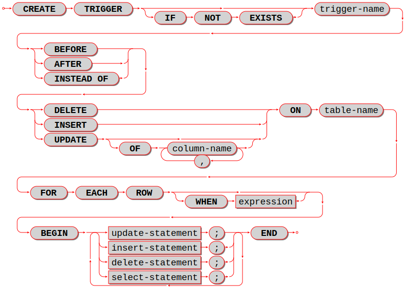

|br|

The *trigger-name* must be valid according to the rules for identifiers.

If the trigger action time is BEFORE or AFTER, then the *table-name* must refer
to an existing base table.

If the trigger action time is INSTEAD OF, then the *table-name* must refer to an
existing view.

Rules:

* There must not already be a trigger with the same name as *trigger-name*.
* Triggers on different tables or views share the same namespace.
* The statements between BEGIN and END should not refer to the *table-name*
  mentioned in the ON clause.
* The statements between BEGIN and END should not contain an
  :ref:`INDEXED BY <sql_indexed_by>` clause.

SQL triggers are not activated by Tarantool/NoSQL requests.
This will change in a future version.

On a :ref:`replica <Replication>`, effects of trigger execution are applied, and the SQL triggers
themselves are not activated upon replication events.

NoSQL triggers are activated both on replica and master, thus if you have a
:ref:`NoSQL trigger <triggers>` on a replica, it is activated when applying effects of an SQL trigger.

Actions:

#. Tarantool will throw an error if a rule is violated.
#. Tarantool will create a new trigger.
#. Usually Tarantool effectively executes a :ref:`COMMIT <sql_commit>` statement.

Examples:

.. code-block:: sql

   -- the simple case:
   CREATE TRIGGER stores_before_insert BEFORE INSERT ON stores FOR EACH ROW
     BEGIN DELETE FROM warehouses; END;
   -- with IF NOT EXISTS clause:
   CREATE TRIGGER IF NOT EXISTS stores_before_insert BEFORE INSERT ON stores FOR EACH ROW
     BEGIN DELETE FROM warehouses; END;
   -- with FOR EACH ROW and WHEN clauses:
   CREATE TRIGGER stores_before_insert BEFORE INSERT ON stores FOR EACH ROW WHEN a=5
     BEGIN DELETE FROM warehouses; END;
   -- with multiple statements between BEGIN and END:
   CREATE TRIGGER stores_before_insert BEFORE INSERT ON stores FOR EACH ROW
     BEGIN DELETE FROM warehouses; INSERT INTO inventories VALUES (1); END;

.. _sql_trigger_extra:

++++++++++++++++++++++++++++++++++++++++++++++++++++++++++++++++++++++++++++++++
Trigger extra clauses
++++++++++++++++++++++++++++++++++++++++++++++++++++++++++++++++++++++++++++++++

* :samp:`UPDATE OF column-list`

  After BEFORE|AFTER UPDATE it is optional to add ``OF column-list``.
  If any of the columns in *column-list* is affected at the time the row is
  processed, then the trigger will be activated for that row. For example:

  .. code-block:: sql

     CREATE TRIGGER table1_before_update
      BEFORE UPDATE  OF column1, column2 ON table1
      FOR EACH ROW
      BEGIN UPDATE table2 SET column1 = column1 + 1; END;
     UPDATE table1 SET column3 = column3 + 1; -- Trigger will not be activated
     UPDATE table1 SET column2 = column2 + 0; -- Trigger will be activated

* :samp:`WHEN`

  After *table-name* FOR EACH ROW it is optional to add [``WHEN expression``].
  If the expression is true at the time the row is processed, only then will the
  trigger will be activated for that row. For example:

  .. code-block:: sql

     CREATE TRIGGER table1_before_update BEFORE UPDATE ON table1 FOR EACH ROW
      WHEN (SELECT COUNT(*) FROM table1) > 1
      BEGIN UPDATE table2 SET column1 = column1 + 1; END;

  This trigger will not be activated unless there is more than one row in
  ``table1``.

* :samp:`OLD and NEW`

  The keywords OLD and NEW have special meaning in the context of trigger action:

  * OLD.column-name refers to the value of *column-name* before the change.
  * NEW.column-name refers to the value of *column-name* after the change.

  For example:

  .. code-block:: sql

     CREATE TABLE table1 (column1 STRING, column2 INTEGER PRIMARY KEY);
     CREATE TABLE table2 (column1 STRING, column2 STRING, column3 INTEGER PRIMARY KEY);
     INSERT INTO table1 VALUES ('old value', 1);
     INSERT INTO table2 VALUES ('', '', 1);
     CREATE TRIGGER table1_before_update BEFORE UPDATE ON table1 FOR EACH ROW
      BEGIN UPDATE table2 SET column1 = old.column1, column2 = new.column1; END;
     UPDATE table1 SET column1 = 'new value';
     SELECT * FROM table2;

  At the beginning of the UPDATE for the single row of ``table1``, the value in
  ``column1`` is 'old value' -- so that is what is seen as ``old.column1``.

  At the end of the UPDATE for the single row of ``table1``, the value in
  ``column1`` is 'new value' -- so that is what is seen as ``new.column1``.
  (OLD and NEW are qualifiers for ``table1``, not ``table2.``)

  Therefore, ``SELECT * FROM table2;`` returns ``['old value', 'new value']``.

  ``OLD.column-name`` does not exist for an INSERT trigger.

  ``NEW.column-name`` does not exist for a DELETE trigger.

  OLD and NEW are read-only; you cannot change their values.

* Deprecated or illegal statements:

  It is illegal for the trigger action to include a qualified column reference
  other than ``OLD.column-name`` or ``NEW.column-name``. For example,
  ``CREATE TRIGGER ... BEGIN UPDATE table1 SET table1.column1 = 5; END;``
  is illegal.

  It is illegal for the trigger action to include statements that include a
  :ref:`WITH clause <sql_with>`,
  a DEFAULT VALUES clause, or an :ref:`INDEXED BY <sql_indexed_by>` clause.

  It is usually not a good idea to have a trigger on ``table1`` which causes
  a change on ``table2``, and at the same time have a trigger on ``table2``
  which causes a change on ``table1``. For example:

  .. code-block:: sql

     CREATE TRIGGER table1_before_update
      BEFORE UPDATE ON table1
      FOR EACH ROW
      BEGIN UPDATE table2 SET column1 = column1 + 1; END;
     CREATE TRIGGER table2_before_update
      BEFORE UPDATE ON table2
      FOR EACH ROW
      BEGIN UPDATE table1 SET column1 = column1 + 1; END;

  Luckily ``UPDATE table1 ...`` will not cause an infinite loop, because
  Tarantool recognizes when it has already updated so it will stop.
  However, not every DBMS acts this way.

.. _sql_trigger_activation:

++++++++++++++++++++++++++++++++++++++++++++++++++++++++++++++++++++++++++++++++
Trigger activation
++++++++++++++++++++++++++++++++++++++++++++++++++++++++++++++++++++++++++++++++

These are remarks concerning trigger activation.

Standard terminology:

* "trigger action time" = BEFORE or AFTER or INSTEAD OF
* "trigger event" = INSERT or DELETE or UPDATE
* "triggered statement" = BEGIN ... DELETE|INSERT|REPLACE|SELECT|UPDATE ... END
* "triggered when clause" = WHEN search-condition
* "activate" = execute a triggered statement
* some vendors use the word "fire" instead of "activate"

If there is more than one trigger for the same trigger event, Tarantool may
execute the triggers in any order.

It is possible for a triggered statement to cause activation of another
triggered statement. For example, this is legal:

.. code-block:: sql

   CREATE TRIGGER t1_before_delete BEFORE DELETE ON t1 FOR EACH ROW BEGIN DELETE FROM t2; END;
   CREATE TRIGGER t2_before_delete BEFORE DELETE ON t2 FOR EACH ROW BEGIN DELETE FROM t3; END;

Activation occurs FOR EACH ROW, not FOR EACH STATEMENT. Therefore, if no rows
are candidates for insert or update or delete, then no triggers are activated.

The BEFORE trigger is activated even if the trigger event fails.

If an UPDATE trigger event does not make a change, the trigger is activated
anyway. For example, if row 1 ``column1`` contains ``'a'``, and the trigger event
is ``UPDATE ... SET column1 = 'a';``, the trigger is activated.

The triggered statement may refer to a function:
``RAISE(FAIL, error-message)``.
If a triggered statement invokes a ``RAISE(FAIL, error-message)`` function, or
if a triggered statement causes an error, then statement execution stops
immediately.

The triggered statement may refer to column values within the rows being changed.
in this case:

* The row "as of before" the change is called the "old" row (which makes sense
  only for UPDATE and DELETE statements).
* The row "as of after" the change is called the "new" row (which makes sense
  only for UPDATE and INSERT statements).

This example shows how an INSERT can be done to a view by referring to the
"new" row:

.. code-block:: sql

   CREATE TABLE t (s1 INTEGER PRIMARY KEY, s2 INTEGER);
   CREATE VIEW v AS SELECT s1, s2 FROM t;
   CREATE TRIGGER v_instead_of INSTEAD OF INSERT ON v
     FOR EACH ROW
     BEGIN INSERT INTO t VALUES (new.s1, new.s2); END;
   INSERT INTO v VALUES (1, 2);

Ordinarily saying ``INSERT INTO view_name ...`` is illegal in Tarantool,
so this is a workaround.

It is possible to generalize this so that all data-change statements
on views will change the base tables, provided that the view contains
all the columns of the base table, and provided that the triggers
refer to those columns when necessary, as in this example:

.. code-block:: sql

   CREATE TABLE base_table (primary_key_column INTEGER PRIMARY KEY, value_column INTEGER);
   CREATE VIEW viewed_table AS SELECT primary_key_column, value_column FROM base_table;
   CREATE TRIGGER viewed_table_instead_of_insert INSTEAD OF INSERT ON viewed_table FOR EACH ROW
     BEGIN
       INSERT INTO base_table VALUES (new.primary_key_column, new.value_column); END;
   CREATE TRIGGER viewed_table_instead_of_update INSTEAD OF UPDATE ON viewed_table FOR EACH ROW
     BEGIN
       UPDATE base_table
       SET primary_key_column = new.primary_key_column, value_column = new.value_column
       WHERE primary_key_column = old.primary_key_column; END;
   CREATE TRIGGER viewed_table_instead_of_delete INSTEAD OF DELETE ON viewed_table FOR EACH ROW
     BEGIN
       DELETE FROM base_table WHERE primary_key_column = old.primary_key_column; END;

When INSERT or UPDATE or DELETE occurs for table ``X``, Tarantool usually
operates in this order (a basic scheme):

.. code-block:: none

   For each row
     Perform constraint checks
     For each BEFORE trigger that refers to table X
       Check that the trigger's WHEN condition is true.
       Execute what is in the triggered statement.
     Insert or update or delete the row in table X.
     Perform more constraint checks
     For each AFTER trigger that refers to table X
       Check that the trigger's WHEN condition is true.
       Execute what is in the triggered statement.

.. // For details, see "Order of Execution in Data-change statements".

However, Tarantool does not guarantee execution order when there are multiple
constraints, or multiple triggers for the same event (including NoSQL
:ref:`on_replace triggers <box_space-on_replace>`
or SQL
:ref:`INSTEAD OF triggers <sql_instead_of_triggers>` that affect a view of table
``X``).

The maximum number of trigger activations per statement is 32.

.. _sql_instead_of_triggers:

++++++++++++++++++++++++++++++++++++++++++++++++++++++++++++++++++++++++++++++++
INSTEAD OF triggers
++++++++++++++++++++++++++++++++++++++++++++++++++++++++++++++++++++++++++++++++

A trigger which is created with the clause |br|
:samp:`INSTEAD OF {INSERT|UPDATE|DELETE} ON {view-name}` |br|
is an INSTEAD OF trigger. For each affected row, the trigger action is performed
"instead of" the INSERT or UPDATE or DELETE statement that causes trigger
activation.

For example, ordinarily it is illegal to INSERT rows in a view, but it is legal
to create a trigger which intercepts attempts to INSERT, and puts rows in the
underlying base table:

.. code-block:: sql

   CREATE TABLE t1 (column1 INTEGER PRIMARY KEY, column2 INTEGER);
   CREATE VIEW v1 AS SELECT column1, column2 FROM t1;
   CREATE TRIGGER v1_instead_of INSTEAD OF INSERT ON v1 FOR EACH ROW BEGIN
    INSERT INTO t1 VALUES (NEW.column1, NEW.column2); END;
   INSERT INTO v1 VALUES (1, 1);
   -- ... The result will be: table t1 will contain a new row.

INSTEAD OF triggers are only legal for views, while
BEFORE or AFTER triggers are only legal for base tables.

It is legal to create INSTEAD OF triggers with triggered WHEN clauses.

Limitations:

* It is legal to create INSTEAD OF triggers with UPDATE OF *column-list* clauses,
  but they are not standard SQL.

Example:

.. code-block:: sql

   CREATE TRIGGER ev1_instead_of_update
     INSTEAD OF UPDATE OF column2,column1 ON ev1
     FOR EACH ROW BEGIN
     INSERT INTO et2 VALUES (NEW.column1, NEW.column2); END;

.. _sql_drop_trigger:

********************************************************************************
DROP TRIGGER
********************************************************************************

Syntax:

:samp:`DROP TRIGGER [IF EXISTS] {trigger-name};`

|br|

.. image:: drop_trigger.svg
    :align: left

|br|

Drop a trigger.

The *trigger-name* must identify a trigger that was created earlier with the
:ref:`CREATE TRIGGER <sql_create_trigger>` statement.

Rules: none

Actions:

#. Tarantool returns an error if the trigger does not exist and there is no ``IF EXISTS`` clause.
#. The trigger is dropped.
#. Usually Tarantool effectively executes a :ref:`COMMIT <sql_commit>` statement.

Examples:

.. code-block:: sql

   -- the simple case:
   DROP TRIGGER table1_before_insert;
   -- with an IF EXISTS clause:
   DROP TRIGGER IF EXISTS table1_before_insert;

.. _sql_statements_change_data:

~~~~~~~~~~~~~~~~~~~~~~~~~~~~~~~~~~~~~~~~~~~~~~~~~~~~~~~~~~~~~~~~~~~~~~~~~~~~~~~~
Statements that change data
~~~~~~~~~~~~~~~~~~~~~~~~~~~~~~~~~~~~~~~~~~~~~~~~~~~~~~~~~~~~~~~~~~~~~~~~~~~~~~~~

.. _sql_insert:

********************************************************************************
INSERT
********************************************************************************

Syntax:

* :samp:`INSERT INTO {table-name} [(column-list)] VALUES (expression-list) [, (expression-list)];`
* :samp:`INSERT INTO {table-name} [(column-list)]  select-statement;`
* :samp:`INSERT INTO {table-name} DEFAULT VALUES;`

|br|

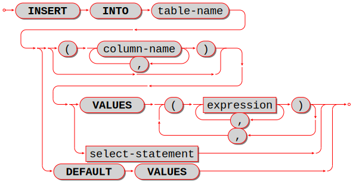

|br|

Insert one or more new rows into a table.

The *table-name* must be a name of a table defined earlier with :ref:`CREATE TABLE <sql_create_table>`.

The optional *column-list* must be a comma-separated list of names of columns
in the table.

The *expression-list* must be a comma-separated list of expressions; each
expression may contain literals and operators and subqueries and function invocations.

Rules:

* The values in the *expression-list* are evaluated from left to right.
* The order of the values in the *expression-list* must correspond to the order
  of the columns in the table, or (if a *column-list* is specified) to the order
  of the columns in the *column-list*.
* The data type of the value should correspond to the
  :ref:`data type of the column <sql_column_def_data_type>`,
  that is, the data type that was specified with CREATE TABLE.
* If a *column-list* is not specified, then the number of expressions must be
  the same as the number of columns in the table.
* If a *column-list* is specified, then some columns may be omitted; omitted
  columns will get default values.
* The parenthesized *expression-list* may be repeated --
  ``(expression-list),(expression-list),...`` -- for multiple rows.

Actions:

#. Tarantool evaluates each expression in *expression-list*, and returns an
   error if any of the rules is violated.
#. Tarantool creates zero or more new rows containing values based on the values
   in the VALUES list or based on the results of the *select-expression* or
   based on the default values.
#. Tarantool executes constraint checks and trigger actions and the actual insertion.

.. //  append to 3: in the order described by section "Order of Execution in Data-Change Statements"

Examples:

.. code-block:: sql

   -- the simplest form:
   INSERT INTO table1 VALUES (1, 'A');
   -- with a column list:
   INSERT INTO table1 (column1, column2) VALUES (2, 'B');
   -- with an arithmetic operator in the first expression:
   INSERT INTO table1 VALUES (2 + 1, 'C');
   -- put two rows in the table:
   INSERT INTO table1 VALUES (4, 'D'), (5, 'E');

See also: :ref:`REPLACE statement <sql_replace>`.

.. _sql_update:

********************************************************************************
UPDATE
********************************************************************************

Syntax:

:samp:`UPDATE {table-name}
SET column-name = expression [, column-name = expression ...]
[WHERE search-condition];`

|br|

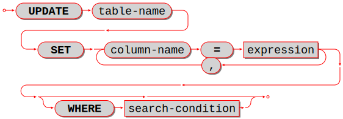

|br|

Update zero or more existing rows in a table.

The *table-name* must be a name of a table defined earlier with
:ref:`CREATE TABLE <sql_create_table>` or :ref:`CREATE VIEW <sql_create_view>`.

The *column-name* must be an updatable column in the table.

The *expression* may contain literals and operators and subqueries and function
invocations and column names.

Rules:

* The values in the SET clause are evaluated from left to right.
* The data type of the value should correspond to the
  :ref:`data type of the column <sql_column_def_data_type>`,
  that is, the data type that was specified with CREATE TABLE.
* If a *search-condition* is not specified, then all rows in the table will be
  updated; otherwise only those rows which match the *search-condition* will be
  updated.

Actions:

#. Tarantool evaluates each expression in the SET clause, and returns an error
   if any of the rules is violated.
   For each row that is found by the WHERE clause, a temporary new row is formed
   based on the original contents and the modifications caused by the SET clause.
#. Tarantool executes constraint checks and trigger actions and the actual update.

.. // append to 2: in the order described by section Order of Execution in Data-Change Statements.

Examples:

.. code-block:: sql

   -- the simplest form:
   UPDATE t SET column1 = 1;
   -- with more than one assignment in the SET clause:
   UPDATE t SET column1 = 1, column2 = 2;
   -- with a WHERE clause:
   UPDATE t SET column1 = 5 WHERE column2 = 6;

Special cases:

It is legal to say SET (list of columns) = (list of values). For example:

.. code-block:: sql

   UPDATE t SET (column1, column2, column3) = (1, 2, 3);

It is not legal to assign to a column more than once. For example:

.. code-block:: sql

   INSERT INTO t (column1) VALUES (0);
   UPDATE t SET column1 = column1 + 1, column1 = column1 + 1;

The result is an error: "duplicate column name".

It is not legal to assign to a primary-key column.

.. _sql_delete:

********************************************************************************
DELETE
********************************************************************************

Syntax:

:samp:`DELETE FROM {table-name} [WHERE search-condition];`

|br|

.. image:: delete.svg
    :align: left

|br|

Delete zero or more existing rows in a table.

The *table-name* must be a name of a table defined earlier with
:ref:`CREATE TABLE <sql_create_table>` or :ref:`CREATE VIEW <sql_create_view>`.

The *search-condition* may contain literals and operators and subqueries and
function invocations and column names.

Rules:

* If a search-condition is not specified, then all rows in the table will be
  deleted; otherwise only those rows which match the *search-condition* will be
  deleted.

Actions:

#. Tarantool evaluates each expression in the *search-condition*, and returns
   an error if any of the rules is violated.
#. Tarantool finds the set of rows that are to be deleted.
#. Tarantool executes constraint checks and trigger actions and the actual deletion.

.. // append to 3: in the order described by section Order of Execution in Data-Change Statements.

Examples:

.. code-block:: sql

   -- the simplest form:
   DELETE FROM t;
   -- with a WHERE clause:
   DELETE FROM t WHERE column2 = 6;

.. _sql_replace:

********************************************************************************
REPLACE
********************************************************************************

Syntax:

* :samp:`REPLACE INTO {table-name} [(column-list)] VALUES (expression-list) [, (expression-list)];`
* :samp:`REPLACE INTO {table-name} [(column-list)] select-statement;`
* :samp:`REPLACE INTO {table-name} DEFAULT VALUES;`

|br|

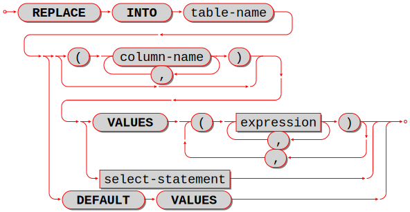

|br|

Insert one or more new rows into a table, or update existing rows.

If a row already exists (as determined by the primary key or any unique key),
then the action is delete + insert, and the rules are the same as for a
:ref:`DELETE statement <sql_delete>` followed by an :ref:`INSERT statement <sql_insert>`.
Otherwise the action is insert, and the rules are the same as for the
INSERT statement.

Examples:

.. code-block:: sql

   -- the simplest form:
   REPLACE INTO table1 VALUES (1, 'A');
   -- with a column list:
   REPLACE INTO table1 (column1, column2) VALUES (2, 'B');
   -- with an arithmetic operator in the first expression:
   REPLACE INTO table1 VALUES (2 + 1, 'C');
   -- put two rows in the table:
   REPLACE INTO table1 VALUES (4, 'D'), (5, 'E');

See also: :ref:`INSERT Statement <sql_insert>`, :ref:`UPDATE Statement <sql_update>`.

.. // and Order of Execution in Data-Change Statements.

.. _sql_truncate:

********************************************************************************
TRUNCATE
********************************************************************************

Syntax:

:samp:`TRUNCATE TABLE {table-name};`

|br|

.. image:: truncate.svg
    :align: left

|br|

Remove all rows in the table.

TRUNCATE is considered to be a schema-change rather than a data-change statement,
so it does not work within transactions (it cannot be
:ref:`rolled back <sql_rollback>`).

Rules:

* It is illegal to truncate a table which is referenced by a foreign key.
* It is illegal to truncate a table which is also a system space, such as
  ``_space``.
* The table must be a base table rather than a view.

Actions:

#. All rows in the table are removed. Usually this is faster than
   :samp:`DELETE FROM {table-name};`.
#. If the table has an autoincrement primary key, its
   :doc:`sequence </reference/reference_lua/box_schema_sequence/create_index>`
   is not reset to zero,
   but that may occur in a future Tarantool version.
#. There is no effect for any triggers associated with the table.
#. There is no effect on the counts for the ``ROW_COUNT()`` function.
#. Only one action is written to the
   :ref:`write-ahead log <internals-wal>`
   (with :samp:`DELETE FROM {table-name};` there would be one action for each deleted
   row).

Example:

.. code-block:: sql

   TRUNCATE TABLE t;

.. _sql_set:

********************************************************************************
SET
********************************************************************************

Syntax:

*:samp:`SET SESSION {setting-name} = {setting-value};`

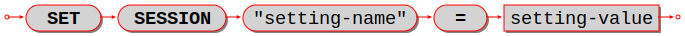

``SET SESSION`` is a shorthand way
to update the
:ref:`box.space._session_settings <box_space-session_settings>`
temporary system space.

``setting-name`` can have the following values:

*   ``"sql_default_engine"``
*   ``"sql_full_column_names"``
*   ``"sql_full_metadata"``
*   ``"sql_parser_debug"``
*   ``"sql_recursive_triggers"``
*   ``"sql_reverse_unordered_selects"``
*   ``"sql_select_debug"``
*   ``"sql_vdbe_debug"``
*   ``"sql_defer_foreign_keys"`` (removed in :doc:`2.11.0 </release/2.11.0>`)
*   ``"error_marshaling_enabled"`` (removed in :doc:`2.10.0 </release/2.10.0>`)

The quote marks are necessary.

If ``setting-name`` is ``"sql_default_engine"``, then
``setting-value`` can be either 'vinyl' or 'memtx'.
Otherwise, ``setting-value`` can be either TRUE or FALSE.

Example: ``SET SESSION "sql_default_engine" = 'vinyl';``
changes the default engine to 'vinyl' instead of 'memtx',
and returns:

.. code-block:: none

    ---
    - row_count: 1
    ...

It is functionally the same thing as an :ref:`UPDATE Statement <sql_update>`:

.. code-block:: none

    UPDATE "_session_settings"
    SET "value" = 'vinyl'
    WHERE "name" = 'sql_default_engine';

.. _sql_statements_retrieve_data:

~~~~~~~~~~~~~~~~~~~~~~~~~~~~~~~~~~~~~~~~~~~~~~~~~~~~~~~~~~~~~~~~~~~~~~~~~~~~~~~~
Statements that retrieve data
~~~~~~~~~~~~~~~~~~~~~~~~~~~~~~~~~~~~~~~~~~~~~~~~~~~~~~~~~~~~~~~~~~~~~~~~~~~~~~~~

.. _sql_select:

********************************************************************************
SELECT
********************************************************************************

Syntax:

:samp:`SELECT [ALL|DISTINCT]
select list
[from clause]
[where clause]
[group-by clause] [having clause]
[order-by clause];`

|br|

.. image:: select.svg
    :align: left

|br|

Select zero or more rows.

The clauses of the SELECT statement are discussed in the following five sections.

.. _sql_select_list:

++++++++++++++++++++++++++++++++++++++++++++++++++++++++++++++++++++++++++++++++
Select list
++++++++++++++++++++++++++++++++++++++++++++++++++++++++++++++++++++++++++++++++

Syntax:

:samp:`select-list-column [, select-list-column ...]`

select-list-column:

.. image:: select_list.svg
    :align: left

|br|

Define what will be in a result set; this is a clause in a :ref:`SELECT statement <sql_select>`.

The *select list* is a comma-delimited list of expressions, or ``*`` (asterisk).
An expression can have an alias provided with an ``[[AS] column-name]`` clause.

The ``*`` "asterisk" shorthand is valid if and only if the SELECT statement also
contains a :ref:`FROM clause <sql_from>` which specifies the table or tables
(details about the FROM clause are in the next section). The simple form is
``*``
which means "all columns" -- for example, if the select is done for a table
which contains three columns ``s1`` ``s2`` ``s3``, then ``SELECT * ...``
is equivalent to ``SELECT s1, s2, s3 ...``.
The qualified form is ``table-name.*`` which means "all columns in the specified
table", which again must be a result of the FROM clause -- for example, if the
table is named ``table1``, then ``table1.*`` is equivalent to a list of the
columns of ``table1``.

The ``[[AS] column-name]`` clause determines the column name.
The column name is useful for two reasons:

* in a tabular display, the column names are the headings
* if the results of the SELECT are used when creating a new table (such as a view),
  then
  the column names in the new table will be the column names in the *select list*.

If ``[[AS] column-name]`` is missing, and the expression is not simply
the name of a column in the table, then Tarantool makes a name
:samp:`COLUMN_{n}` where :samp:`{n}` is the number of the non-simple
expression within the select list, for example
``SELECT 5.88, table1.x, 'b' COLLATE "unicode_ci" FROM table1;``
will cause the column names to be COLUMN_1, X, COLUMN_2.
This is a behavior change since version :doc:`2.5.1 </release/2.5.1>`.
In earlier versions, the name would be equal to the expression;
see `Issue#3962 <https://github.com/tarantool/tarantool/issues/3962>`_.
It is still legal to define tables with column names like ``COLUMN_1`` but not recommended.

Examples:

.. code-block:: sql

   -- the simple form:
   SELECT 5;
   -- with multiple expressions including operators:
   SELECT 1, 2 * 2, 'Three' || 'Four';
   -- with [[AS] column-name] clause:
   SELECT 5 AS column1;
   -- * which must be eventually followed by a FROM clause:
   SELECT * FROM table1;
   -- as a list:
   SELECT 1 AS a, 2 AS b, table1.* FROM table1;

.. _sql_from:

++++++++++++++++++++++++++++++++++++++++++++++++++++++++++++++++++++++++++++++++
FROM clause
++++++++++++++++++++++++++++++++++++++++++++++++++++++++++++++++++++++++++++++++

Syntax:

:samp:`FROM [SEQSCAN] table-reference [, table-reference ...]`

|br|

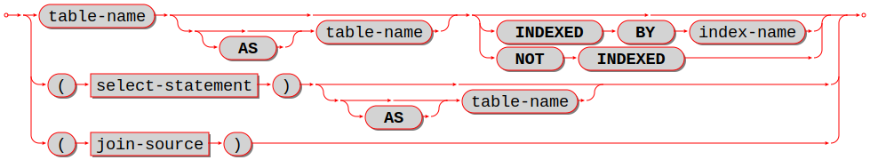

|br|

Specify the table or tables for the source of a :ref:`SELECT statement <sql_select>`.

The *table-reference* must be a name of an existing table, or a subquery, or
a joined table.

A joined table looks like this:

:samp:`table-reference-or-joined-table join-operator table-reference-or-joined-table [join-specification]`

A *join-operator* must be any of
`the standard types <https://en.wikipedia.org/wiki/Join_(SQL)>`_:

* [NATURAL] LEFT [OUTER] JOIN,
* [NATURAL] INNER JOIN, or
* CROSS JOIN

A *join-specification* must be any of:

* ON expression, or
* USING (column-name [, column-name ...])

Parentheses are allowed, and ``[[AS] correlation-name]`` is allowed.

The maximum number of joins in a FROM clause is 64.

The ``SEQSCAN`` keyword (since :doc:`2.11 </release/2.11.0>`) marks the queries that
perform sequential scans during the execution. It happens if the query can't use indexes,
and goes through all the table rows one by one, sometimes causing a heavy load.
Such queries are called *scan queries*. If a scan query doesn't have the
``SEQSCAN`` keyword, Tarantool raises an error. ``SEQSCAN`` must precede all
names of the tables that the query scans.

To find out if a query performs a sequential scan, use ``EXPLAIN QUERY PLAN``.
For scan queries, the result contains ``SCAN_TABLE``.

..  note::

    For backward compatibility, the scan queries without the ``SEQSCAN`` keyword
    are allowed in Tarantool 2.11. The errors on scan queries will be the default
    behavior starting from 3.0. You can change the default behavior of scan queries
    using the :ref:`compat option sql_seq_scan <compat-option-sql-scan>`.

Examples:

.. code-block:: sql

   -- the simplest form:
   SELECT * FROM SEQSCAN t;
   -- with two tables, making a Cartesian join:
   SELECT * FROM SEQSCAN t1, SEQSCAN t2;
   -- with one table joined to itself, requiring correlation names:
   SELECT a.*, b.* FROM SEQSCAN t1 AS a, SEQSCAN t1 AS b;
   -- with a left outer join:
   SELECT * FROM SEQSCAN t1 LEFT JOIN SEQSCAN t2;

.. _sql_where:

++++++++++++++++++++++++++++++++++++++++++++++++++++++++++++++++++++++++++++++++
WHERE clause
++++++++++++++++++++++++++++++++++++++++++++++++++++++++++++++++++++++++++++++++

Syntax:

:samp:`WHERE condition;`

|br|

.. image:: where.svg
    :align: left

|br|

Specify the condition for filtering rows from a table; this is a clause in
a :ref:`SELECT <sql_select>` or :ref:`UPDATE <sql_update>` or :ref:`DELETE <sql_delete>` statement.

The condition may contain any expression that returns a BOOLEAN
(TRUE or FALSE or UNKNOWN) value.

For each row in the table:

* if the condition is true, then the row is kept;
* if the condition is false or unknown, then the row is ignored.

In effect, WHERE condition takes a table with n rows and returns a table with
n or fewer rows.

Examples:

.. code-block:: sql

   -- with a simple condition:
   SELECT 1 FROM t WHERE column1 = 5;
   -- with a condition that contains AND and OR and parentheses:
   SELECT 1 FROM t WHERE column1 = 5 AND (x > 1 OR y < 1);

.. _sql_group_by:

++++++++++++++++++++++++++++++++++++++++++++++++++++++++++++++++++++++++++++++++
GROUP BY clause
++++++++++++++++++++++++++++++++++++++++++++++++++++++++++++++++++++++++++++++++

Syntax:

:samp:`GROUP BY expression [, expression ...]`

|br|

.. image:: group_by.svg
    :align: left

|br|

Make a grouped table; this is a clause in a :ref:`SELECT statement <sql_select>`.

The expressions should be column names in the table, and each column should be
specified only once.

In effect, the GROUP BY clause takes a table with rows that may have matching values,
combines rows that have matching values into single rows,
and returns a table which, because it is the result of GROUP BY,
is called a grouped table.

Thus, if the input is a table:

.. code-block:: none

   a    b      c
   -    -      -
   1    'a'   'b
   1    'b'   'b'
   2    'a'   'b'
   3    'a'   'b'
   1    'b'   'b'

then ``GROUP BY a, b`` will produce a grouped table:

.. code-block:: none

   a    b      c
   -    -      -
   1    'a'   'b'
   1    'b'   'b'
   2    'a'   'b'
   3    'a'   'b'

The rows where column ``a`` and column ``b`` have the same value have been
merged; column ``c`` has been preserved but its value should not be depended
on -- if the rows were not all 'b', Tarantool could pick any value.

It is useful to envisage a grouped table as having hidden extra columns for
the aggregation of the values, for example:

.. code-block:: none

   a    b      c    COUNT(a) SUM(a) MIN(c)
   -    -      -    -------- ------ ------
   1    'a'    'b'         2      2    'b'
   1    'b'    'b'         1      1    'b'
   2    'a'    'b'         1      2    'b'
        'a'    'b'         1      3    'b'

These extra columns are what :ref:`aggregate functions <sql_aggregate>` are for.

Examples:

.. code-block:: sql

   -- with a single column:
   SELECT 1 FROM t GROUP BY column1;
   -- with two columns:
   SELECT 1 FROM t GROUP BY column1, column2;

Limitations:

* ``SELECT s1, s2 FROM t GROUP BY s1;`` is legal.
* ``SELECT s1 AS q FROM t GROUP BY q;`` is legal.
* ``SELECT s1 FROM t GROUP by 1;`` is legal.

.. // (Issue#2364)

.. _sql_aggregate:

++++++++++++++++++++++++++++++++++++++++++++++++++++++++++++++++++++++++++++++++
Aggregate functions
++++++++++++++++++++++++++++++++++++++++++++++++++++++++++++++++++++++++++++++++

Syntax:

:samp:`function-name (one or more expressions)`

Apply a built-in aggregate function to one or more expressions and return
a scalar value.

Aggregate functions are only legal in certain clauses
of a :ref:`SELECT statement <sql_select>` for grouped tables. (A table is a grouped
table if a GROUP BY clause is present.) Also, if
an aggregate function is used in a :ref:`select list <sql_select_list>` and the
GROUP BY clause is omitted, then Tarantool assumes
``SELECT ... GROUP BY [all columns];``.

NULLs are ignored for all aggregate functions except COUNT(*).

.. _sql_aggregate_avg:

``AVG([DISTINCT] expression)``
             Return the average value of expression.

             Example: :samp:`AVG({column1})`

.. _sql_aggregate_count_row:

``COUNT([DISTINCT] expression)``
             Return the number of occurrences of expression.

             Example: :samp:`COUNT({column1})`

``COUNT(*)``
             Return the number of occurrences of a row.

             Example: :samp:`COUNT(*)`

``GROUP_CONCAT(expression-1 [, expression-2])`` or ``GROUP_CONCAT(DISTINCT expression-1)``
             Return a list of *expression-1* values, separated
             by commas if *expression-2* is omitted, or separated
             by the *expression-2* value if *expression-2* is not omitted.

             Example: :samp:`GROUP_CONCAT({column1})`

.. _sql_aggregate_max:

``MAX([DISTINCT] expression)``
             Return the maximum value of expression.

             Example: :samp:`MAX({column1})`

.. _sql_aggregate_min:

``MIN([DISTINCT] expression)``
             Return the minimum value of expression.

             Example: :samp:`MIN({column1})`

.. _sql_aggregate_sum:

``SUM([DISTINCT] expression)``
             Return the sum of values of expression, or NULL if there are no rows.

             Example: :samp:`SUM({column1})`

``TOTAL([DISTINCT] expression)``
             Return the sum of values of expression, or zero if there are no rows.

             Example: :samp:`TOTAL({column1})`

.. // See also: :ref:`Functions <sql_functions>`.

.. _sql_having:

++++++++++++++++++++++++++++++++++++++++++++++++++++++++++++++++++++++++++++++++
HAVING clause
++++++++++++++++++++++++++++++++++++++++++++++++++++++++++++++++++++++++++++++++

Syntax:

:samp:`HAVING condition;`

|br|

.. image:: having.svg
    :align: left

|br|

Specify the condition for filtering rows from a grouped table;
this is a clause in a :ref:`SELECT statement <sql_select>`.

The clause preceding the HAVING clause may be a GROUP BY clause.
HAVING operates on the table that the GROUP BY produces,
which may contain grouped columns and aggregates.

If the preceding clause is not a GROUP BY clause,
then there is only one group and the HAVING clause may only contain
aggregate functions or literals.

For each row in the table:

* if the condition is true, then the row is kept;
* if the condition is false or unknown, then the row is ignored.

In effect, HAVING condition takes a table with n rows and returns a table
with n or fewer rows.

Examples:

.. code-block:: sql

   -- with a simple condition:
   SELECT 1 FROM t GROUP BY column1 HAVING column2 > 5;
   -- with a more complicated condition:
   SELECT 1 FROM t GROUP BY column1 HAVING column2 > 5 OR column2 < 5;
   -- with an aggregate:
   SELECT x, SUM(y) FROM t GROUP BY x HAVING SUM(y) > 0;
   -- with no GROUP BY and an aggregate:
   SELECT SUM(y) FROM t GROUP BY x HAVING MIN(y) < MAX(y);

Limitations:

* HAVING without GROUP BY is not supported for multiple tables.

.. _sql_order_by:

++++++++++++++++++++++++++++++++++++++++++++++++++++++++++++++++++++++++++++++++
ORDER BY clause
++++++++++++++++++++++++++++++++++++++++++++++++++++++++++++++++++++++++++++++++

Syntax:

:samp:`ORDER BY expression [ASC|DESC] [, expression [ASC|DESC] ...]`

|br|

.. image:: order_by.svg
    :align: left

|br|

Put rows in order; this is a clause in a :ref:`SELECT statement <sql_select>`.

An ORDER BY expression has one of three types which are checked in order:

#. Expression is a positive integer, representing the ordinal position of the
   column in the :ref:`select list <sql_select_list>`. For example, in the statement |br|
   ``SELECT x, y, z FROM t ORDER BY 2;`` |br|
   ``ORDER BY 2`` means "order by the second column in the select list",
   which is ``y``.
#. Expression is a name of a column in the select list, which is determined
   by an AS clause. For example, in the statement |br|
   ``SELECT x, y AS x, z FROM t ORDER BY x;`` |br|
   ``ORDER BY x`` means "order by the column explicitly named ``x`` in the
   select list", which is the second column.
#. Expression contains a name of a column in a table of the FROM clause.
   For example, in the statement |br|
   ``SELECT x, y FROM t1 JOIN t2 ORDER BY z;`` |br|
   ``ORDER BY z`` means "order by a column named ``z`` which is expected to be
   in table ``t1`` or table ``t2``".

If both tables contain a column named ``z``, then Tarantool will choose
the first column that it finds.

The expression may also contain operators and function names and literals.
For example, in the statement |br|
``SELECT x, y FROM t ORDER BY UPPER(z);`` |br|
``ORDER BY UPPER(z)`` means "order by the uppercase form of column ``t.z``",
which may be similar to doing ordering with one of Tarantool's case-insensitive collations.

Type 3 is illegal if the SELECT statement contains
:ref:`UNION or EXCEPT or INTERSECT <sql_union>`.

If an ORDER BY clause contains multiple expressions, then expressions on the
left are processed first and expressions on the right are processed only if
necessary for tie-breaking.
For example, in the statement |br|
``SELECT x, y FROM t ORDER BY x, y;``
if there are two rows which both have the same values for column ``x``,
then an additional check is made to see which row has a greater value
for column ``y``.

In effect, ORDER BY clause takes a table with rows that may be out of order,
and returns a table with rows in order.

Sorting order:

* The default order is ASC (ascending), the optional order is DESC (descending).
* NULLs come first, then BOOLEANs, then numerics, then STRINGs, then VARBINARYs, then UUIDs.
* Ordering does not matter for ARRAYs or MAPs or ANYs because they are not legal for comparisons.
* Within STRINGs, ordering is according to collation.
* Collation may be specified with a :ref:`COLLATE clause <sql_collate_clause>` within the ORDER BY column-list, or may be default.

Examples:

.. code-block:: sql

   -- with a single column:
   SELECT 1 FROM t ORDER BY column1;
   -- with two columns:
   SELECT 1 FROM t ORDER BY column1, column2;
   -- with a variety of data:
   CREATE TABLE h (s1 NUMBER PRIMARY KEY, s2 SCALAR);
   INSERT INTO h VALUES (7, 'A'), (4, 'a'), (-4, 'AZ'), (17, 17), (23, NULL);
   INSERT INTO h VALUES (17.5, 'Д'), (1e+300, 'A'), (0, ''), (-1, '');
   SELECT * FROM h ORDER BY s2 COLLATE "unicode_ci", s1;
   -- The result of the above SELECT will be:
   - - [23, null]
     - [17, 17]
     - [-1, '']
     - [0, '']
     - [4, 'a']
     - [7, 'A']
     - [1e+300, 'A']
     - [-4, 'AZ']
     - [17.5, 'Д']
   ...

Limitations:

* ORDER BY 1 is legal. This is common but is not standard SQL nowadays.

.. // (Issue#2365)

.. _sql_limit:

++++++++++++++++++++++++++++++++++++++++++++++++++++++++++++++++++++++++++++++++
LIMIT clause
++++++++++++++++++++++++++++++++++++++++++++++++++++++++++++++++++++++++++++++++

Syntax:

* :samp:`LIMIT limit-expression [OFFSET offset-expression]`
* :samp:`LIMIT offset-expression, limit-expression`

.. NOTE::

   The above is not a typo: *offset-expression* and *limit-expression* are
   in reverse order if a comma is used.

|br|

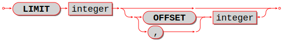

|br|

Specify a maximum number of rows and a start row; this is a clause in
a :ref:`SELECT statement <sql_select>`.

Expressions may contain integers and arithmetic operators or functions,
for example ``ABS(-3 / 1)``.
However, the result must be an integer value greater than or equal to zero.

Usually the LIMIT clause follows an :ref:`ORDER BY clause <sql_order_by>`, because otherwise
Tarantool does not guarantee that rows are in order.

Examples:

.. code-block:: sql

   -- simple case:
   SELECT * FROM t LIMIT 3;
   -- both limit and order:
   SELECT * FROM t LIMIT 3 OFFSET 1;
   -- applied to a UNIONed result (LIMIT clause must be the final clause):
   SELECT column1 FROM table1 UNION SELECT column1 FROM table2 ORDER BY 1 LIMIT 1;

Limitations:

* If ORDER BY ... LIMIT is used, then all order-by columns must be
  ASC or all must be DESC.

.. // (Issue#4038)

.. _sql_subquery:

++++++++++++++++++++++++++++++++++++++++++++++++++++++++++++++++++++++++++++++++
Subquery
++++++++++++++++++++++++++++++++++++++++++++++++++++++++++++++++++++++++++++++++

Syntax:

* :ref:`SELECT-statement <sql_select>` syntax
* :ref:`VALUES-statement <sql_values>` syntax

A subquery has the same syntax as a :ref:`SELECT statement <sql_select>`
or :ref:`VALUES statement <sql_values>`
embedded inside a main statement.

.. NOTE::

   The SELECT and VALUES statements are called "queries" because they
   return answers, in the form of result sets.

Subqueries may be the second part of :ref:`INSERT statements <sql_insert>`. For example:

.. code-block:: sql

   INSERT INTO t2 SELECT a, b, c FROM t1;

Subqueries may be in the :ref:`FROM clause <sql_from>` of SELECT statements.

Subqueries may be expressions, or be inside expressions.
In this case they must be parenthesized, and usually the number of rows
must be 1. For example:

.. code-block:: sql

   SELECT 1, (SELECT 5), 3 FROM t WHERE c1 * (SELECT COUNT(*) FROM t2) > 5;

Subqueries may be expressions on the right side of certain comparison operators,
and in this unusual case the number of rows may be greater than 1.
The comparison operators are: [NOT] EXISTS and [NOT] IN. For example:

.. code-block:: sql

   DELETE FROM t WHERE s1 NOT IN (SELECT s2 FROM t);

Subqueries may refer to values in the outer query.
In this case, the subquery is called a "correlated subquery".

Subqueries may refer to rows which are being updated or deleted by the main query.
In that case, the subquery finds the matching rows first, before starting to
update or delete. For example, after:

.. code-block:: sql

   CREATE TABLE t (s1 INTEGER PRIMARY KEY, s2 INTEGER);
   INSERT INTO t VALUES (1, 3), (2, 1);
   DELETE FROM t WHERE s2 NOT IN (SELECT s1 FROM t);

only one of the rows is deleted, not both rows.

.. _sql_with:

++++++++++++++++++++++++++++++++++++++++++++++++++++++++++++++++++++++++++++++++
WITH clause
++++++++++++++++++++++++++++++++++++++++++++++++++++++++++++++++++++++++++++++++

**WITH clause (common table expression)**

Syntax:

:samp:`WITH {temporary-table-name} AS (subquery)` |br|
:samp:`[, {temporary-table-name} AS (subquery)]` |br|
:samp:`SELECT statement | INSERT statement | DELETE statement | UPDATE statement | REPLACE statement;`

|br|

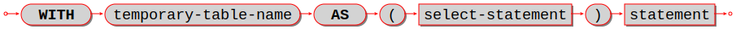

|br|

.. code-block:: sql

   WITH v AS (SELECT * FROM t) SELECT * FROM v;

is equivalent to :ref:`creating a view <sql_create_view>` and selecting from it:

.. code-block:: sql

   CREATE VIEW v AS SELECT * FROM t;
   SELECT * FROM v;

The difference is that a WITH-clause "view" is temporary and only
useful within the same statement. No CREATE privilege is required.

The WITH-clause can also be thought of as a :ref:`subquery <sql_subquery>` that has a name.
This is useful when the same subquery is being repeated. For example:

.. code-block:: sql

   SELECT * FROM t WHERE a < (SELECT s1 FROM x) AND b < (SELECT s1 FROM x);

can be replaced with:

.. code-block:: sql

   WITH s AS (SELECT s1 FROM x) SELECT * FROM t,s WHERE a < s.s1 AND b < s.s1;

This "factoring out" of a repeated expression is regarded as good practice.

Examples:

.. code-block:: sql

   WITH cte AS (VALUES (7, '') INSERT INTO j SELECT * FROM cte;
   WITH cte AS (SELECT s1 AS x FROM k) SELECT * FROM cte;
   WITH cte AS (SELECT COUNT(*) FROM k WHERE s2 < 'x' GROUP BY s3)
     UPDATE j SET s2 = 5
     WHERE s1 = (SELECT s1 FROM cte) OR s3 = (SELECT s1 FROM cte);

WITH can only be used at the beginning of a statement, therefore it cannot
be used at the beginning of a subquery or after a :ref:`set operator <sql_union>` or inside
a CREATE statement.

A WITH-clause "view" is read-only because Tarantool does not support
updatable views.

.. _sql_with_recursive:

++++++++++++++++++++++++++++++++++++++++++++++++++++++++++++++++++++++++++++++++
WITH RECURSIVE
++++++++++++++++++++++++++++++++++++++++++++++++++++++++++++++++++++++++++++++++

**WITH RECURSIVE clause (iterative common table expression)**

The real power of WITH lies in the WITH RECURSIVE clause, which is useful when
it is combined with :ref:`UNION or UNION ALL <sql_union>`:

:samp:`WITH RECURSIVE recursive-table-name AS` |br|
:samp:`(SELECT ... FROM non-recursive-table-name ...` |br|
:samp:`UNION [ALL]` |br|
:samp:`SELECT ... FROM recursive-table-name ...)` |br|
:samp:`statement-that-uses-recursive-table-name;` |br|

|br|

.. image:: with_recursive.svg
    :align: left

|br|

In non-SQL this can be read as: starting with a seed value from
a non-recursive table, produce a recursive viewed table, UNION that with itself,
UNION that with itself, UNION that with itself ... forever, or until a condition
in the WHERE clause says "stop".

For example:

.. code-block:: sql

   CREATE TABLE ts (s1 INTEGER PRIMARY KEY);
   INSERT INTO ts VALUES (1);
   WITH RECURSIVE w AS (
     SELECT s1 FROM ts
     UNION ALL
     SELECT s1 + 1 FROM w WHERE s1 < 4)
   SELECT * FROM w;

First, table ``w`` is seeded from ``t1``, so it has one row: [1].

Then, ``UNION ALL (SELECT s1 + 1 FROM w)`` takes the row from ``w`` -- which
contains [1] -- adds 1 because the select list says "s1+1", and so it has
one row: [2].

Then, ``UNION ALL (SELECT s1 + 1 FROM w)`` takes the row from ``w`` -- which
contains [2] -- adds 1 because the select list says "s1+1", and so it has
one row: [3].

Then, ``UNION ALL (SELECT s1 + 1 FROM w)`` takes the row from ``w`` -- which
contains [3] -- adds 1 because the select list says "s1+1", and so it has
one row: [4].

Then, ``UNION ALL (SELECT s1 + 1 FROM w)`` takes the row from ``w`` -- which
contains [4] -- and now the importance of the WHERE clause becomes evident,
because "s1 < 4" is false for this row, and therefore the
"stop" condition has been reached.

So, before the "stop", table ``w`` got 4 rows -- [1], [2], [3], [4] -- and
the result of the statement looks like:

.. code-block:: tarantoolsession

   tarantool> WITH RECURSIVE w AS (
            >   SELECT s1 FROM ts
            >   UNION ALL
            >   SELECT s1 + 1 FROM w WHERE s1 < 4)
            > SELECT * FROM w;
   ---
   - - [1]
     - [2]
     - [3]
     - [4]
   ...

In other words, this ``WITH RECURSIVE ... SELECT`` produces a table of
auto-incrementing values.

.. _sql_union:

++++++++++++++++++++++++++++++++++++++++++++++++++++++++++++++++++++++++++++++++
UNION, EXCEPT, and INTERSECT clauses
++++++++++++++++++++++++++++++++++++++++++++++++++++++++++++++++++++++++++++++++

Syntax:

* :samp:`select-statement UNION [ALL] select-statement [ORDER BY clause] [LIMIT clause];`
* :samp:`select-statement EXCEPT select-statement [ORDER BY clause] [LIMIT clause];`
* :samp:`select-statement INTERSECT select-statement [ORDER BY clause] [LIMIT clause];`

|br|

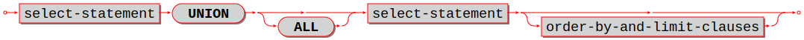

|br|

.. image:: except.svg
    :align: left

|br|

.. image:: intersect.svg
    :align: left

|br|

UNION, EXCEPT, and INTERSECT are collectively called "set operators" or "table operators".
In particular:

* ``a UNION b`` means "take rows which occur in a OR b".
* ``a EXCEPT b`` means "take rows which occur in a AND NOT b".
* ``a INTERSECT b`` means "take rows which occur in a AND b".

Duplicate rows are eliminated unless ALL is specified.

The *select-statements* may be chained: ``SELECT ... SELECT ... SELECT ...;``

Each *select-statement* must result in the same number of columns.

The *select-statements* may be replaced with :ref:`VALUES statements <sql_values>`.

The maximum number of set operations is 50.

Example:

.. code-block:: sql

   CREATE TABLE t1 (s1 INTEGER PRIMARY KEY, s2 STRING);
   CREATE TABLE t2 (s1 INTEGER PRIMARY KEY, s2 STRING);
   INSERT INTO t1 VALUES (1, 'A'), (2, 'B'), (3, NULL);
   INSERT INTO t2 VALUES (1, 'A'), (2, 'C'), (3,NULL);
   SELECT s2 FROM t1 UNION SELECT s2 FROM t2;
   SELECT s2 FROM t1 UNION ALL SELECT s2 FROM t2 ORDER BY s2;
   SELECT s2 FROM t1 EXCEPT SELECT s2 FROM t2;
   SELECT s2 FROM t1 INTERSECT SELECT s2 FROM t2;

In this example:

* The UNION query returns 4 rows: NULL, 'A', 'B', 'C'.
* The UNION ALL query returns 6 rows: NULL, NULL, 'A', 'A', 'B', 'C'.
* The EXCEPT query returns 1 row: 'B'.
* The INTERSECT query returns 2 rows: NULL, 'A'.

Limitations:

* Parentheses are not allowed.
* Evaluation is left to right, INTERSECT does not have precedence.

Example:

.. code-block:: sql

   CREATE TABLE t01 (s1 INTEGER PRIMARY KEY, s2 STRING);
   CREATE TABLE t02 (s1 INTEGER PRIMARY KEY, s2 STRING);
   CREATE TABLE t03 (s1 INTEGER PRIMARY KEY, s2 STRING);
   INSERT INTO t01 VALUES (1, 'A');
   INSERT INTO t02 VALUES (1, 'B');
   INSERT INTO t03 VALUES (1, 'A');
   SELECT s2 FROM t01 INTERSECT SELECT s2 FROM t03 UNION SELECT s2 FROM t02;
   SELECT s2 FROM t03 UNION SELECT s2 FROM t02 INTERSECT SELECT s2 FROM t03;
   -- ... results are different.

.. _sql_indexed_by:

++++++++++++++++++++++++++++++++++++++++++++++++++++++++++++++++++++++++++++++++
INDEXED BY clause
++++++++++++++++++++++++++++++++++++++++++++++++++++++++++++++++++++++++++++++++

Syntax:

:samp:`INDEXED BY {index-name}`

|br|

.. image:: indexed_by.svg
    :align: left

|br|

The INDEXED BY clause may be used in a
:ref:`SELECT <sql_select>`, :ref:`DELETE <sql_delete>`, or :ref:`UPDATE <sql_update>` statement,
immediately after the *table-name*. For example:

.. code-block:: sql

   DELETE FROM table7 INDEXED BY index7 WHERE column1 = 'a';

In this case the search for 'a' will take place within ``index7``. For example:

.. code-block:: sql

   SELECT * FROM table7 NOT INDEXED WHERE column1 = 'a';

In this case the search for 'a' will be done via a search of the whole table,
what is sometimes called a "full table scan", even if there is an index for
``column1``.

Ordinarily Tarantool chooses the appropriate index or lookup method depending
on a complex set of "optimizer" rules; the INDEXED BY clause overrides the
optimizer choice. If the index was defined with the
:ref:`exclude_null <key_part_exclude_null>` parts option,
it will only be used if the user specifies it.

Example:

Suppose a table has two columns:

* The first column is the primary key and
  therefore it has an automatic index named ``pk_unnamed_T_1``.
* The second column has an index created by the user.

The user selects with ``INDEXED BY the-index-on-column1``,
then selects with ``INDEXED BY the-index-on-column-2``.

.. code-block:: sql

   CREATE TABLE t (column1 INTEGER PRIMARY KEY, column2 INTEGER);
   CREATE INDEX idx_column2_t_1 ON t (column2);
   INSERT INTO t VALUES (1, 2), (2, 1);
   SELECT * FROM t INDEXED BY "pk_unnamed_T_1";
   SELECT * FROM t INDEXED BY idx_column2_t_1;
   -- Result for the first select: (1, 2), (2, 1)
   -- Result for the second select: (2, 1), (1, 2).

Limitations: |br|
Often INDEXED BY has no effect. |br|
Often INDEXED BY affects a choice of covering index, but not a WHERE clause.

.. _sql_values:

********************************************************************************
VALUES
********************************************************************************

Syntax:

:samp:`VALUES (expression [, expression ...]) [, (expression [, expression ...])`

|br|

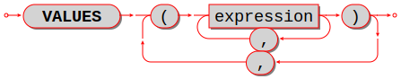

|br|

Select one or more rows.

VALUES has the same effect as :ref:`SELECT <sql_select>`, that is, it returns a result set,
but VALUES statements may not have FROM or GROUP or ORDER BY or LIMIT clauses.

VALUES may be used wherever SELECT may be used, for example in :ref:`subqueries <sql_subquery>`.

Examples:

.. code-block:: sql

   -- simple case:
   VALUES (1);
   -- equivalent to SELECT 1, 2, 3:
   VALUES (1, 2, 3);
   -- two rows:
   VALUES (1, 2, 3), (4, 5, 6);

.. _sql_pragma:

********************************************************************************
PRAGMA
********************************************************************************

Syntax:

* :samp:`PRAGMA {pragma-name} (pragma-value);`
* or :samp:`PRAGMA {pragma-name};`

.. image:: pragma.svg
    :align: left

PRAGMA statements will give rudimentary information about database 'metadata' or
server performance,
although it is better to get metadata via :ref:`system tables <sql_system_tables>`.

For PRAGMA statements that include (``pragma-value``),
pragma values are strings and can be specified inside ``""`` double quotes,
or without quotes.
When a string is used for searching, results must match according to a
binary collation. If the object being searched has a lower-case name,
use double quotes.

In an earlier version, there were some PRAGMA statements that determined behavior.
Now that does not happen. Behavior change is done by updating the
:ref:`box.space._session_settings <box_space-session_settings>` system table.

.. list-table::
   :widths: auto
   :header-rows: 1
   :align: left

   * - Pragma
     - Parameter
     - Effect
   * - foreign_key_list
     - string |br| table-name
     - Return a
       :ref:`result set <box-sql_result_sets>`
       with one row for each foreign key of
       "table-name". Each row contains: |br|
       (INTEGER) id -- identification number |br|
       (INTEGER) seq -- sequential number |br|
       (STRING) table -- name of table |br|
       (STRING) from  -- referencing key |br|
       (STRING) to -- referenced key |br|
       (STRING) on_update -- ON UPDATE clause |br|
       (STRING) on_delete -- ON DELETE clause |br|
       (STRING) match -- MATCH clause |br|
       The system table is ``"_fk_constraint"``.
   * - collation_list
     -
     - Return a result set with one row for each
       supported collation. The first four collations
       are ``'none'`` and ``'unicode'`` and
       ``'unicode_ci'`` and ``'binary'``, then come
       about 270 predefined collations, the exact
       count may vary because users can add their
       own collations. |br|
       The system table is ``"_collation"``.
   * - index_info
     - string |br| table-name . index-name
     - Return a result set with one row for each
       column in "table-name.index-name".
       Each row contains: |br|
       (INTEGER) seqno -- the column's ordinal
       position in the index (first column is 0) |br|
       (INTEGER) cid -- the column's ordinal
       position in the table (first column is 0) |br|
       (STRING) name -- name of the column |br|
       (INTEGER) desc -- 0 is ASC, 1 is DESC |br|
       (STRING) collation name |br|
       (STRING) type -- data type
   * - index_list
     - string |br| table-name
     - Return a result set
       with one row for each index of "table-name".
       Each row contains: |br|
       (INTEGER) seq -- sequential number |br|
       (STRING) name -- index name |br|
       (INTEGER) unique -- whether the index is
       unique, 0 is false, 1 is true |br|
       The system table is ``"_index"``.
   * - stats
     -
     - Return a result set with
       one row for each index of each table.
       Each row contains: |br|
       (STRING) table -- name of the table |br|
       (STRING) index -- name of the index |br|
       (INTEGER) width -- arbitrary information |br|
       (INTEGER) height -- arbitrary information
   * - table_info
     - string |br| table-name
     - Return a result set
       with one row for each column
       in "table-name". Each row contains: |br|
       (INTEGER) cid -- ordinal position in the table |br|
       (first column number is 0) |br|
       (STRING) name -- column name |br|
       (STRING) type |br|
       (INTEGER) notnull -- whether the column is
       NOT NULL, 0 is
       false, 1 is true. |br|
       (STRING) dflt_value -- default value |br|
       (INTEGER) pk -- whether the column is
       a PRIMARY KEY column, 0 is false, 1 is true.

Example: (not showing result set metadata)

.. code-block:: none

   PRAGMA table_info(T);
   ---
   - - [0, 's1', 'integer', 1, null, 1]
     - [1, 's2', 'integer', 0, null, 0]
   ...

.. _sql_explain:

********************************************************************************
EXPLAIN
********************************************************************************

Syntax:

*:samp:`EXPLAIN explainable-statement;`

.. image:: explain.svg
    :align: left

EXPLAIN will show what steps Tarantool would take if it executed explainable-statement.
This is primarily a debugging and optimization aid for the Tarantool team.

Example: ``EXPLAIN DELETE FROM m;`` returns:

.. code-block:: none

    - - [0, 'Init', 0, 3, 0, '', '00', 'Start at 3']
      - [1, 'Clear', 16416, 0, 0, '', '00', '']
      - [2, 'Halt', 0, 0, 0, '', '00', '']
      - [3, 'Transaction', 0, 1, 1, '0', '01', 'usesStmtJournal=0']
      - [4, 'Goto', 0, 1, 0, '', '00', '']

Variation: ``EXPLAIN QUERY PLAN statement;`` shows the steps of a search.

.. COMMENT
   ANALYZE is currently disabled.

   ANALYZE [table_name]

   ANALYZE will collect statistics about a table and put the results in system tables named _sql_stat1 and _sql_stat4.

   Example:

   ANALYZE t;
   SELECT * FROM "_sql_stat1", "_sql_stat4";
   +-----+-----+------+-----+-----+-----+-----+------+
   | tbl | idx | stat | tbl | idx | neq | nlt | ndlt |
   +-----+-----+------+-----+-----+-----+-----+------+
   | T   | T   | 2 1  | T   | T   | 1   | 0   | 0    |
   | T   | T   | 2 1  | T   | T   | 1   | 1   | 1    |
   +-----+-----+------+-----+-----+-----+-----+------+

   Limitations:
   Issue#4069 ANALYZE is temporarily disabled in the current version

.. COMMENT
   This section should exist but changes have happened, it is probably obsolete.
   So it is all commented out.

   Order of Execution In Data-Change Statements

   This is the general order in which Tarantool performs checks and triggered actions for data-change (INSERT or UPDATE or DELETE) statements, Notice that one action can cause another action, as is the case for triggers (see "CREATE TRIGGER Statement"), or as is the case for REPLACE (which can cause either INSERT or DELETE plus INSERT).

   In this description, the words "constraint ... would be violated" mean "table would contain a value that would not be allowed (due to the constraint) if the operation was permitted to continue"..The word "behavior" refers to one of the possible behaviors described in section "Constraint Conflict Clauses".  If two or more constraints are relevant at the same time, for example UNIQUE (s2), CHECK (s2 <> 5), Tarantool may elect to check them in any order. If Tarantool determines that a step is not necessary, it does not perform it.

   Limitation(documentation only): The description here is not currently correct.

   For each row ...

   If statement is INSERT|UPDATE: If a value was not specified or is NULL for a column defined with AUTOINCREMENT,  set the value to the next available integer.
   If statement is INSERT|UPDATE: for each NOT NULL constraint that would be violated:... If behavior is "REPLACE  (for a NOT NULL constraint for a column that has a non-NULL default value)", then replace NULL with the default value.
   If statement is INSERT|UPDATE: for each  UNIQUE or PRIMARY KEY constraint that would be violated ...  If behavior is "REPLACE", then delete the old row and insert the new row.
   For each FOREIGN KEY constraint that would be violated ... do statement rollback and return an error.
   If statement is INSERT, then activate the table's BEFORE INSERT triggers.If statement is UPDATE, then activate the table's BEFORE UPDATE triggers. If statement is DELETE, then activate the table's BEFORE DELETE triggers.
   If statement is INSERT|UPDATE: for each NOT NULL constraint that would be violated ... If behavior is "ABORT" or "REPLACE (for a NOT NULL constraint that has a NULL default value)", do statement rollback and return an error.  If behavior is "IGNORE", then skip this and all following steps (that is, skip this row). If behavior is "FAIL", then return an error. If behavior is "ROLLBACK", then do transaction rollback and return an error.
   If statement is INSERT|UPDATE: for each CHECK or UNIQUE or PRIMARY KEY constraint that would be violated ... If behavior is "IGNORE", then skip this row.  If behavior is "FAIL", return an error. If behavior is "ROLLBACK", then do transaction rollback and return an error. If behavior is "ABORT" or "REPLACE": do statement rollback and return an error. This means that UNIQUE or PRIMARY KEY constraints are checked twice, in step 2 and in this step. This is necessary because execution of an earlier step might cause a new conflict.
   If statement is INSERT, then activate the table's AFTER INSERT triggers.If statement is UPDATE, then activate the table's AFTER UPDATE triggers. If statement is DELETE, then activate the table's AFTER DELETE triggers.

   If all rows were processed without an error that caused statement rollback or transaction rollback, the data-change can be committed. Ordinarily, unless processing is within a transaction that began with START TRANSACTION, there will be an automatic COMMIT.

   Finish the data-change by calling the low-level Tarantool routines. Thus new rows (new "tuples" in Tarantool's NoSQL terminology) are added to the table (the "space" in Tarantool's NoSQL terminology), or rows are removed from the table,  and indexes are updated.

.. _sql_transactions:

~~~~~~~~~~~~~~~~~~~~~~~~~~~~~~~~~~~~~~~~~~~~~~~~~~~~~~~~~~~~~~~~~~~~~~~~~~~~~~~~
Statements for transactions
~~~~~~~~~~~~~~~~~~~~~~~~~~~~~~~~~~~~~~~~~~~~~~~~~~~~~~~~~~~~~~~~~~~~~~~~~~~~~~~~

.. _sql_start_transaction:

********************************************************************************
START TRANSACTION
********************************************************************************

Syntax:

:samp:`START TRANSACTION;`

|br|

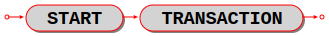

|br|

Start a transaction. After ``START TRANSACTION;``, a transaction is "active".
If a transaction is already active, then ``START TRANSACTION;`` is illegal.

Transactions should be active for fairly short periods of time, to avoid
concurrency issues. To end a transaction, say :ref:`COMMIT; <sql_commit>` or :ref:`ROLLBACK; <sql_rollback>`.

Just as in NoSQL, transaction control statements are subject to limitations
set by the :ref:`storage engine <engines-chapter>` involved: |br|
* For the memtx storage engine, if a yield happens within an active transaction, the transaction is rolled back. |br|
* For the vinyl engine, yields are allowed. |br|
Also, although CREATE AND DROP and ALTER statements are legal in transactions,
there are a few exceptions. For example, :samp:`CREATE INDEX ON {table_name} ...` will fail within a
multi-statement transaction if the table is not empty.

However, transaction control statements still may not work as you expect when
run over a network connection:
a transaction is associated with a fiber, not a network connection, and
different transaction control statements sent via the same network connection
may be executed by different fibers from the fiber pool.

In order to ensure that all statements are part of the intended transaction,
put all of them between ``START TRANSACTION;`` and ``COMMIT;`` or ``ROLLBACK;``
then send as a single batch. For example:

* Enclose each separate SQL statement in a
  :ref:`box.execute() <box-sql_box_execute>` function.
* Pass all the ``box.execute()`` functions to the server in a single message.

  If you are using a console, you can do this by writing everything on a single
  line.

  If you are using :ref:`net.box <net_box-module>`, you can do this by putting
  all the function calls in a single string and calling
  :ref:`eval(string) <net_box-eval>`.

Example:

.. code-block:: sql

   START TRANSACTION;

Example of a whole transaction sent to a server on ``localhost:3301`` with
``eval(string)``:

.. code-block:: lua

   net_box = require('net.box')
   conn = net_box.new('localhost', 3301)
   s = 'box.execute([[START TRANSACTION;]]) '
   s = s .. 'box.execute([[INSERT INTO t VALUES (1);]]) '
   s = s .. 'box.execute([[ROLLBACK;]]) '
   conn:eval(s)

.. _sql_commit:

********************************************************************************
COMMIT
********************************************************************************

Syntax:

:samp:`COMMIT;`

|br|

.. image:: commit.svg
    :align: left

|br|

Commit an active transaction, so all changes are made permanent
and the transaction ends.

COMMIT is illegal unless a transaction is active.
If a transaction is not active then SQL statements are committed automatically.

Example:

.. code-block:: sql

   COMMIT;

.. _sql_savepoint:

********************************************************************************
SAVEPOINT
********************************************************************************

Syntax:

:samp:`SAVEPOINT {savepoint-name};`

|br|

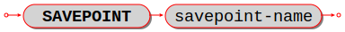

|br|

Set a savepoint, so that :ref:`ROLLBACK TO savepoint-name <sql_rollback>` is possible.

SAVEPOINT is illegal unless a transaction is active.

If a savepoint with the same name already exists, it is released
before the new savepoint is set.

Example:

.. code-block:: sql

   SAVEPOINT x;

.. _sql_release_savepoint:

********************************************************************************
RELEASE SAVEPOINT
********************************************************************************

Syntax:

:samp:`RELEASE SAVEPOINT {savepoint-name};`

|br|

.. image:: release.svg
    :align: left

|br|

Release (destroy) a savepoint created by a :ref:`SAVEPOINT statement <sql_savepoint>`.

RELEASE is illegal unless a transaction is active.

Savepoints are released automatically when a transaction ends.

Example:

.. code-block:: sql

   RELEASE SAVEPOINT x;

.. _sql_rollback:

********************************************************************************
ROLLBACK
********************************************************************************

Syntax:

:samp:`ROLLBACK [TO [SAVEPOINT] {savepoint-name}];`

|br|

.. image:: rollback.svg
    :align: left

|br|

If ROLLBACK does not specify a *savepoint-name*,
rollback an active transaction, so all changes
since :ref:`START TRANSACTION <sql_start_transaction>` are cancelled,
and the transaction ends.

If ROLLBACK does specify a *savepoint-name*,
rollback an active transaction, so all changes
since :ref:`SAVEPOINT savepoint-name <sql_savepoint>` are cancelled,
and the transaction does not end.

ROLLBACK is illegal unless a transaction is active.

Examples:

.. code-block:: none

   -- the simple form:
   ROLLBACK;
   -- the form so changes before a savepoint are not cancelled:
   ROLLBACK TO SAVEPOINT x;

.. code-block:: lua

   -- An example of a Lua function that will do a transaction
   -- containing savepoint and rollback to savepoint.
   function f()
   box.execute([[DROP TABLE IF EXISTS t;]]) -- commits automatically
   box.execute([[CREATE TABLE t (s1 STRING PRIMARY KEY);]]) -- commits automatically
   box.execute([[START TRANSACTION;]]) -- after this succeeds, a transaction is active
   box.execute([[INSERT INTO t VALUES ('Data change #1');]])
   box.execute([[SAVEPOINT "1";]])
   box.execute([[INSERT INTO t VALUES ('Data change #2');]])
   box.execute([[ROLLBACK TO SAVEPOINT "1";]]) -- rollback Data change #2
   box.execute([[ROLLBACK TO SAVEPOINT "1";]]) -- this is legal but does nothing
   box.execute([[COMMIT;]]) -- make Data change #1 permanent, end the transaction
   end

.. _sql_functions:

~~~~~~~~~~~~~~~~~~~~~~~~~~~~~~~~~~~~~~~~~~~~~~~~~~~~~~~~~~~~~~~~~~~~~~~~~~~~~~~~
Functions
~~~~~~~~~~~~~~~~~~~~~~~~~~~~~~~~~~~~~~~~~~~~~~~~~~~~~~~~~~~~~~~~~~~~~~~~~~~~~~~~

********************************************************************************
Explanation of functions
********************************************************************************

Syntax:

:samp:`function-name (one or more expressions)`

Apply a built-in function to one or more expressions and return a scalar value.

Tarantool supports 33 built-in functions.

The maximum number of operands for any function is 127.

The required privileges for built-in functions will likely change in a future version.

.. _sql_function_list:

********************************************************************************
List of functions
********************************************************************************

These are Tarantool/SQL's built-in functions.
Starting with Tarantool 2.10, for functions that require numeric arguments,
function arguments with NUMBER data type are illegal.

.. _sql_function_abs:

++++++++++++++++++++++++++++++++++++++++++++++++++++++++++++++++++++++++++++++++
ABS
++++++++++++++++++++++++++++++++++++++++++++++++++++++++++++++++++++++++++++++++

Syntax:

:samp:`ABS({numeric-expression})`

Return the absolute value of numeric-expression, which can be any numeric type.

Example: ``ABS(-1)`` is 1.

.. _sql_function_cast:

++++++++++++++++++++++++++++++++++++++++++++++++++++++++++++++++++++++++++++++++
CAST
++++++++++++++++++++++++++++++++++++++++++++++++++++++++++++++++++++++++++++++++

Syntax:

:samp:`CAST({expression} AS {data-type})`

Return the expression value after casting to the specified
:ref:`data type <sql_column_def_data_type>`.

CAST to/from UUID may change some components to/from little-endian.

Examples: ``CAST('AB' AS VARBINARY)``, ``CAST(X'4142' AS STRING)``

.. _sql_function_char:

++++++++++++++++++++++++++++++++++++++++++++++++++++++++++++++++++++++++++++++++
CHAR
++++++++++++++++++++++++++++++++++++++++++++++++++++++++++++++++++++++++++++++++

Syntax:

:samp:`CHAR([numeric-expression [,numeric-expression...])`

Return the characters whose Unicode code point values are equal
to the numeric expressions.

Short example:

The first 128 Unicode characters are the "ASCII" characters,
so CHAR(65, 66, 67) is 'ABC'.

Long example:

For the current list of Unicode characters,
in order by code point, see
`www.unicode.org/Public/UCD/latest/ucd/UnicodeData.txt
<http://www.unicode.org/Public/UCD/latest/ucd/UnicodeData.txt>`_.
In that list, there is a line for a Linear B ideogram

``100CC;LINEAR B IDEOGRAM B240 WHEELED CHARIOT ...``

Therefore, for a string with a chariot in the middle,
use the concatenation operator ``||`` and the CHAR function

``'start of string ' || CHAR(0X100CC) || ' end of string'``.

.. _sql_function_coalesce:

++++++++++++++++++++++++++++++++++++++++++++++++++++++++++++++++++++++++++++++++
COALESCE
++++++++++++++++++++++++++++++++++++++++++++++++++++++++++++++++++++++++++++++++

Syntax:

:samp:`COALESCE(expression, expression [, expression ...])`

Return the value of the first non-NULL expression, or, if all
expression values are NULL, return NULL.

Example:
  ``COALESCE(NULL, 17, 32)`` is 17.

.. _sql_function_datepart:

DATE_PART
+++++++++

Syntax:

:samp:`DATE_PART(value_requested , datetime)`

Since :doc:`2.10.0 </release/2.10.0>`.

The ``DATE_PART()`` function returns the requested information from a DATETIME value.
It takes two arguments: the first one tells us what information is requested, the second is a DATETIME value.

Below is a list of supported values of the first argument and what information is returned:

*   ``millennium`` -- millennium
*   ``century`` -- century
*   ``decade`` -- decade
*   ``year`` -- year
*   ``quarter`` -- quarter of year
*   ``month`` -- month of year
*   ``week`` -- week of year
*   ``day`` -- day of month
*   ``dow`` -- day of week
*   ``doy`` -- day of year
*   ``hour`` -- hour of day
*   ``minute`` -- minute of hour
*   ``second`` -- second of minute
*   ``millisecond`` -- millisecond of second
*   ``microsecond`` -- microsecond of second
*   ``nanosecond`` -- nanosecond of second
*   ``epoch`` -- epoch
*   ``timezone_offset`` -- time zone offset from the UTC, in minutes.

Examples:

..  code-block:: tarantoolsession

    tarantool> select date_part('millennium', cast({'year': 2000, 'month': 4, 'day': 5, 'hour': 6, 'min': 33, 'sec': 22, 'nsec': 523999111} as datetime));
    ---
    - metadata:
      - name: COLUMN_1
        type: integer
      rows:
      - [2]
    ...

    tarantool> select date_part('day', cast({'year': 2000, 'month': 4, 'day': 5, 'hour': 6, 'min': 33, 'sec': 22, 'nsec': 523999111} as datetime));
    ---
    - metadata:
      - name: COLUMN_1
        type: integer
      rows:
      - [5]
    ...

    tarantool> select date_part('nanosecond', cast({'year': 2000, 'month': 4, 'day': 5, 'hour': 6, 'min': 33, 'sec': 22, 'nsec': 523999111} as datetime));
    ---
    - metadata:
      - name: COLUMN_1
        type: integer
      rows:
      - [523999111]
    ...

.. _sql_function_greatest:

++++++++++++++++++++++++++++++++++++++++++++++++++++++++++++++++++++++++++++++++
GREATEST
++++++++++++++++++++++++++++++++++++++++++++++++++++++++++++++++++++++++++++++++

Syntax:

:samp:`GREATEST({expression-1}, {expression-2}, [{expression-3} ...])`

Return the greatest value of the supplied expressions, or, if any expression
is NULL, return NULL.
The reverse of ``GREATEST`` is :ref:`LEAST <sql_function_least>`.

Examples: ``GREATEST(7, 44, -1)`` is 44;
``GREATEST(1E308, 'a', 0, X'00')`` is '\0' = the nul character;
``GREATEST(3, NULL, 2)`` is NULL

.. _sql_function_hex:

++++++++++++++++++++++++++++++++++++++++++++++++++++++++++++++++++++++++++++++++
HEX
++++++++++++++++++++++++++++++++++++++++++++++++++++++++++++++++++++++++++++++++

Syntax:

:samp:`HEX(expression)`

Return the hexadecimal code for each byte in **expression**.

Starting with Tarantool version 2.10.0, the expression must be a byte sequence
(data type VARBINARY).

In earlier versions of Tarantool, the expression could be either a string or a byte sequence.
For ASCII characters, this
was straightforward because the encoding is
the same as the code point value. For
non-ASCII characters, since character strings
are usually encoded in UTF-8, each character
will require two or more bytes.

Examples:

* ``HEX(X'41')`` will return ``41``.
* ``HEX(CAST('Д' AS VARBINARY))`` will return ``D094``.

.. _sql_function_ifnull:

++++++++++++++++++++++++++++++++++++++++++++++++++++++++++++++++++++++++++++++++
IFNULL
++++++++++++++++++++++++++++++++++++++++++++++++++++++++++++++++++++++++++++++++

Syntax:

:samp:`IFNULL(expression, expression)`

Return the value of the first non-NULL expression, or, if both
expression values are NULL, return NULL. Thus
``IFNULL(expression, expression)`` is the same as
:ref:`COALESCE(expression, expression) <sql_function_coalesce>`.

Example:
  ``IFNULL(NULL, 17)`` is 17

.. _sql_function_least:

++++++++++++++++++++++++++++++++++++++++++++++++++++++++++++++++++++++++++++++++
LEAST
++++++++++++++++++++++++++++++++++++++++++++++++++++++++++++++++++++++++++++++++

Syntax:

:samp:`LEAST({expression-1}, {expression-2}, [{expression-3} ...])`

Return the least value of the supplied expressions, or, if any expression
is NULL, return NULL.
The reverse of ``LEAST`` is :ref:`GREATEST <sql_function_greatest>`.

Examples: ``LEAST(7, 44, -1)`` is -1;
``LEAST(1E308, 'a', 0, X'00')`` is 0;
``LEAST(3, NULL, 2)`` is NULL.

.. _sql_function_length:

++++++++++++++++++++++++++++++++++++++++++++++++++++++++++++++++++++++++++++++++
LENGTH
++++++++++++++++++++++++++++++++++++++++++++++++++++++++++++++++++++++++++++++++

Syntax:

:samp:`LENGTH(expression)`

Return the number of characters in the **expression**,
or the number of bytes in the **expression**.
It depends on the data type:
strings with data type STRING are counted in characters,
byte sequences with data type VARBINARY
are counted in bytes and are not ended by the nul character.
There are two aliases for ``LENGTH(expression)`` -- ``CHAR_LENGTH(expression)``
and ``CHARACTER_LENGTH(expression)`` do the same thing.

Examples:

* ``LENGTH('ДД')`` is 2, the string has 2 characters.
* ``LENGTH(CAST('ДД' AS VARBINARY))`` is 4, the string has 4 bytes.
* ``LENGTH(CHAR(0, 65))`` is 2, '\0' does not mean 'end of string'.
* ``LENGTH(X'410041')`` is 3, X'...' byte sequences have type VARBINARY.

.. _sql_function_likelihood:

++++++++++++++++++++++++++++++++++++++++++++++++++++++++++++++++++++++++++++++++
LIKELIHOOD
++++++++++++++++++++++++++++++++++++++++++++++++++++++++++++++++++++++++++++++++

Syntax:

:samp:`LIKELIHOOD({expression}, {DOUBLE literal})`

Return the expression without change, provided that the numeric literal is between 0.0 and 1.0.

Example: ``LIKELIHOOD('a' = 'b', .0)`` is FALSE

.. _sql_function_likely:

++++++++++++++++++++++++++++++++++++++++++++++++++++++++++++++++++++++++++++++++
LIKELY
++++++++++++++++++++++++++++++++++++++++++++++++++++++++++++++++++++++++++++++++

Syntax:

:samp:`LIKELY({expression})`

Return TRUE if the expression is probably true.

Example: ``LIKELY('a' <= 'b')`` is TRUE

.. _sql_function_lower:

++++++++++++++++++++++++++++++++++++++++++++++++++++++++++++++++++++++++++++++++
LOWER
++++++++++++++++++++++++++++++++++++++++++++++++++++++++++++++++++++++++++++++++

Syntax:

:samp:`LOWER({string-expression})`

Return the expression, with upper-case characters converted to lower case.
The reverse of ``LOWER`` is :ref:`UPPER <sql_function_upper>`.

Example: ``LOWER('ДA')`` is 'дa'

.. _sql_function_now:

NOW
+++

Syntax:

:samp:`NOW()`

Since :doc:`2.10.0 </release/2.10.0>`.

The NOW() function returns the current date and time as a DATETIME
value.

If the function is called more than once in a query, it returns
the same result until the query completes, unless a yield has occurred.
On yield, the value returned by NOW() is changing.

Examples:

..  code-block:: tarantoolsession

    tarantool> select now(), now(), now()
    ---
    - metadata:
      - name: COLUMN_1
        type: datetime
      - name: COLUMN_2
        type: datetime
      - name: COLUMN_3
        type: datetime
      rows:
      - ['2022-07-20T19:02:02.010812282+0300', '2022-07-20T19:02:02.010812282+0300', '2022-07-20T19:02:02.010812282+0300']
    ...

.. _sql_function_nullif:

++++++++++++++++++++++++++++++++++++++++++++++++++++++++++++++++++++++++++++++++
NULLIF
++++++++++++++++++++++++++++++++++++++++++++++++++++++++++++++++++++++++++++++++

Syntax:

:samp:`NULLIF(expression-1, expression-2)`

Return *expression-1* if *expression-1* <> *expression-2*,
otherwise return NULL.

Examples:

* ``NULLIF('a', 'A')`` is 'a'.
* ``NULLIF(1.00, 1)`` is NULL.

..  note::

    Before :doc:`/release/2.10.4`, the type of the result was always ``SCALAR``.
    Since :doc:`/release/2.10.4`, the result of ``NULLIF`` matches the type of the first argument.
    If the first argument is the ``NULL`` literal, then the result has the ``SCALAR`` type.

.. _sql_function_position:

++++++++++++++++++++++++++++++++++++++++++++++++++++++++++++++++++++++++++++++++
POSITION
++++++++++++++++++++++++++++++++++++++++++++++++++++++++++++++++++++++++++++++++

Syntax:

:samp:`POSITION({expression-1}, {expression-2})`

Return the position of expression-1 within expression-2,
or return 0 if expression-1 does not appear
within expression-2.
The data types of the expressions must be either STRING or VARBINARY.
If the expressions have data type STRING, then the result is the character position.
If the expressions have data type VARBINARY, then the result is the
byte position.

Short example:
``POSITION('C', 'ABC')`` is 3

Long example: The UTF-8 encoding for the Latin letter A
is hexadecimal 41; the UTF-8 encoding for the
Cyrillic letter Д is hexadecimal D094 -- you can confirm this
by saying SELECT HEX('ДA'); and seeing that the
result is 'D09441'. If you now execute
``SELECT POSITION('A', 'ДA');``
the result will be 2,
because 'A' is the second character in the string.
However, if you now execute
``SELECT POSITION(X'41', X'D09441');``
the result will be 3,
because X'41' is the third byte in the byte sequence.

.. _sql_function_printf:

++++++++++++++++++++++++++++++++++++++++++++++++++++++++++++++++++++++++++++++++
PRINTF
++++++++++++++++++++++++++++++++++++++++++++++++++++++++++++++++++++++++++++++++

Syntax:

:samp:`PRINTF(string-expression [, expression ...])`

Return a string formatted according to the rules of the C
``sprintf()`` function, where ``%d%s`` means the next two arguments
are a numeric and a string, and so on.

If an argument is missing or is NULL, it becomes:

* '0' if the format requires an integer,
* '0.0' if the format requires a numeric with a decimal point,
* '' if the format requires a string.

Example: ``PRINTF('%da', 5)`` is '5a'.

.. _sql_function_quote:

++++++++++++++++++++++++++++++++++++++++++++++++++++++++++++++++++++++++++++++++
QUOTE
++++++++++++++++++++++++++++++++++++++++++++++++++++++++++++++++++++++++++++++++

Syntax:

:samp:`QUOTE(string-argument)`

Return a string with enclosing quotes if necessary,
and with quotes inside the enclosing quotes if necessary.
This function is useful for creating strings
which are part of SQL statements, because of SQL's rules that
string literals are enclosed by single quotes, and single quotes
inside such strings are shown as two single quotes in a row.

Starting with Tarantool version 2.10, arguments with numeric
data types are returned without change.

Example: ``QUOTE('a')`` is ``'a'``. ``QUOTE(5)`` is ``5``.

.. _sql_function_raise:

++++++++++++++++++++++++++++++++++++++++++++++++++++++++++++++++++++++++++++++++
RAISE
++++++++++++++++++++++++++++++++++++++++++++++++++++++++++++++++++++++++++++++++

Syntax:

:samp:`RAISE(FAIL, {error-message})`

This may only be used within a triggered statement. See also :ref:`Trigger Activation <sql_trigger_activation>`.

.. _sql_function_random:

++++++++++++++++++++++++++++++++++++++++++++++++++++++++++++++++++++++++++++++++
RANDOM
++++++++++++++++++++++++++++++++++++++++++++++++++++++++++++++++++++++++++++++++

Syntax: :samp:`RANDOM()`

Return a 19-digit integer which is generated by a pseudo-random number generator,

Example: ``RANDOM()`` is 6832175749978026034, or it is any other integer

.. _sql_function_randomblob:

++++++++++++++++++++++++++++++++++++++++++++++++++++++++++++++++++++++++++++++++
RANDOMBLOB
++++++++++++++++++++++++++++++++++++++++++++++++++++++++++++++++++++++++++++++++

Syntax:

:samp:`RANDOMBLOB({n})`

Return a byte sequence, n bytes long, data type = VARBINARY, containing bytes generated by a
pseudo-random byte generator. The result can be translated to hexadecimal.
If n is less than 1 or is NULL or is infinity, then NULL is returned.

Example: ``HEX(RANDOMBLOB(3))`` is '9EAAA8', or it is the hex value for any other
three-byte string

.. _sql_function_replace:

++++++++++++++++++++++++++++++++++++++++++++++++++++++++++++++++++++++++++++++++
REPLACE
++++++++++++++++++++++++++++++++++++++++++++++++++++++++++++++++++++++++++++++++

Syntax:

:samp:`REPLACE({expression-1}, {expression-2}, {expression-3})`

Return expression-1, except that wherever expression-1
contains expression-2, replace expression-2 with
expression-3.
The expressions should all have data type STRING or VARBINARY.

Example: ``REPLACE('AAABCCCBD', 'B', '!')`` is 'AAA!CCC!D'

.. _sql_function_round:

++++++++++++++++++++++++++++++++++++++++++++++++++++++++++++++++++++++++++++++++
ROUND
++++++++++++++++++++++++++++++++++++++++++++++++++++++++++++++++++++++++++++++++

Syntax:

:samp:`ROUND({numeric-expression-1} [, {numeric-expression-2}])`

Return the rounded value of numeric-expression-1, always rounding
.5 upward for positive numerics or downward for negative numerics.
If numeric-expression-2 is supplied then rounding is to the nearest
numeric-expression-2 digits after the decimal point;
if numeric-expression-2 is not supplied then rounding is to the nearest integer.

Example: ``ROUND(-1.5)`` is -2, ``ROUND(1.7766E1,2)`` is 17.77.

.. _sql_function_row_count:

++++++++++++++++++++++++++++++++++++++++++++++++++++++++++++++++++++++++++++++++
ROW_COUNT
++++++++++++++++++++++++++++++++++++++++++++++++++++++++++++++++++++++++++++++++

:samp:`ROW_COUNT()`

Return the number of rows that were inserted / updated / deleted
by the last :ref:`INSERT <sql_insert>` or
:ref:`UPDATE <sql_update>` or
:ref:`DELETE <sql_delete>` or
:ref:`REPLACE <sql_replace>` statement.
Rows which were updated by an UPDATE statement are counted even if there was no change.
Rows which were inserted / updated / deleted due to foreign-key action are not counted.
Rows which were inserted / updated / deleted due to a view's
:ref:`INSTEAD OF triggers <sql_instead_of_triggers>` are  not counted.
After a CREATE or DROP statement, ROW_COUNT() is 1.
After other statements,  ROW_COUNT() is 0.

Example: ``ROW_COUNT()`` is 1 after a successful INSERT of a single row.

Special rule if there are BEFORE or AFTER triggers: In effect the ROW_COUNT()
counter is pushed at the beginning of a series of triggered statements,
and popped at the end. Therefore, after the following statements:

.. code-block:: sql

             CREATE TABLE t1 (s1 INTEGER PRIMARY KEY);
             CREATE TABLE t2 (s1 INTEGER, s2 STRING, s3 INTEGER, PRIMARY KEY (s1, s2, s3));
             CREATE TRIGGER tt1 BEFORE DELETE ON t1 FOR EACH ROW BEGIN
               INSERT INTO t2 VALUES (old.s1, '#2 Triggered', ROW_COUNT());
               INSERT INTO t2 VALUES (old.s1, '#3 Triggered', ROW_COUNT());
               END;
             INSERT INTO t1 VALUES (1),(2),(3);
             DELETE FROM t1;
             INSERT INTO t2 VALUES (4, '#4 Untriggered', ROW_COUNT());
             SELECT * FROM t2;

The result is:

.. code-block:: none

             ---
             - - [1, '#2 Triggered', 3]
               - [1, '#3 Triggered', 1]
               - [2, '#2 Triggered', 3]
               - [2, '#3 Triggered', 1]
               - [3, '#2 Triggered', 3]
               - [3, '#3 Triggered', 1]
               - [4, '#4 Untriggered', 3]
             ...

.. _sql_function_soundex:

++++++++++++++++++++++++++++++++++++++++++++++++++++++++++++++++++++++++++++++++
SOUNDEX
++++++++++++++++++++++++++++++++++++++++++++++++++++++++++++++++++++++++++++++++

Syntax:

:samp:`SOUNDEX(string-expression)`

Return a four-character string which represents the sound
of ``string-expression``. Often words and names which have
different spellings will have the same Soundex representation
if they are pronounced similarly,
so it is possible to search by what they sound like.
The algorithm works with characters in the Latin alphabet
and works best with English words.

Example: ``SOUNDEX('Crater')`` and ``SOUNDEX('Creature')`` both return ``C636``.

.. _sql_function_substr:

++++++++++++++++++++++++++++++++++++++++++++++++++++++++++++++++++++++++++++++++
SUBSTR
++++++++++++++++++++++++++++++++++++++++++++++++++++++++++++++++++++++++++++++++

Syntax:

:samp:`SUBSTR({string-or-varbinary-value}, {numeric-start-position} [, {numeric-length}])`

If string-or-varbinary-value has data type STRING, then return the substring
which begins
at character position numeric-start-position and continues for
numeric-length characters (if numeric-length is
supplied), or continues till the end of string-or-varbinary-value
(if numeric-length is not supplied).

If numeric-start-position is less than 1, or if numeric-start-position
+ numeric-length is greater than the length of string-or-varbinary-value,
then the result is not an error, anything which would be before the start
or after the end is ignored. There are no symbols with index <= 0
or with index greater than the length of the first argument.

If numeric-length is less than 0, then the result is an error.

If string-or-varbinary-value has data type VARBINARY rather than data
type STRING, then positioning and counting is by bytes
rather than by characters.

Examples: ``SUBSTR('ABCDEF', 3, 2)`` is 'CD', ``SUBSTR('абвгде', -1, 4)`` is 'аб'

.. _sql_function_trim:

++++++++++++++++++++++++++++++++++++++++++++++++++++++++++++++++++++++++++++++++
TRIM
++++++++++++++++++++++++++++++++++++++++++++++++++++++++++++++++++++++++++++++++

Syntax:

:samp:`TRIM([[LEADING|TRAILING|BOTH] [{expression-1}] FROM] {expression-2})`

Return expression-2 after removing all leading and/or trailing characters or bytes.
The expressions should have data type STRING or VARBINARY.
If LEADING|TRAILING|BOTH is omitted, the default is BOTH.
If expression-1 is omitted, the default is ' ' (space) for data type STRING
or X'00' (nul) for data type VARBINARY.

Examples:

``TRIM('a' FROM 'abaaaaa')`` is 'b' -- all repetitions of 'a' are removed on both sides;
``TRIM(TRAILING 'ב' FROM 'אב')`` is 'א' -- if all characters are Hebrew, TRAILING means "left";
``TRIM(X'004400')`` is X'44' -- the default byte sequence to trim is X'00' when data type is VARBINARY;
``TRIM(LEADING 'abc' FROM 'abcd')`` is 'd' -- expression-1 can have more than 1 character.

.. _sql_function_typeof:

++++++++++++++++++++++++++++++++++++++++++++++++++++++++++++++++++++++++++++++++
TYPEOF
++++++++++++++++++++++++++++++++++++++++++++++++++++++++++++++++++++++++++++++++

Syntax:

:samp:`TYPEOF({expression})`

Return 'NULL' if the expression is NULL,
or return 'scalar' if the expression is the name of a column defined as SCALAR,
or return the :ref:`data type <sql_column_def_data_type>` of the expression.

Examples:

``TYPEOF('A')`` returns 'string';
``TYPEOF(RANDOMBLOB(1))`` returns 'varbinary';
``TYPEOF(1e44)`` returns 'double' or 'number';
``TYPEOF(-44)`` returns 'integer';
``TYPEOF(NULL)`` returns 'NULL'

Prior to Tarantool version 2.10, ``TYPEOF(expression)`` simply returned
the data type of the expression for all cases.

.. _sql_function_unicode:

++++++++++++++++++++++++++++++++++++++++++++++++++++++++++++++++++++++++++++++++
UNICODE
++++++++++++++++++++++++++++++++++++++++++++++++++++++++++++++++++++++++++++++++

Syntax:

:samp:`UNICODE(string-expression)`

Return the Unicode code point value of the first character of **string-expression**.
If *string-expression* is empty, the return is NULL.
This is the reverse of :ref:`CHAR(integer) <sql_function_char>`.

Example: ``UNICODE('Щ')`` is 1065 (hexadecimal 0429).

.. _sql_function_unlikely:

++++++++++++++++++++++++++++++++++++++++++++++++++++++++++++++++++++++++++++++++
UNLIKELY
++++++++++++++++++++++++++++++++++++++++++++++++++++++++++++++++++++++++++++++++

Syntax:

:samp:`UNLIKELY({expression})`

Return TRUE if the expression is probably false.
Limitation: in fact ``UNLIKELY`` may return the same thing as :ref:`LIKELY <sql_function_likely>`.

Example: ``UNLIKELY('a' <= 'b')`` is TRUE.

.. _sql_function_upper:

++++++++++++++++++++++++++++++++++++++++++++++++++++++++++++++++++++++++++++++++
UPPER
++++++++++++++++++++++++++++++++++++++++++++++++++++++++++++++++++++++++++++++++

Syntax:

:samp:`UPPER(string-expression)`

Return the expression, with lower-case characters converted to upper case.
The reverse of ``UPPER`` is :ref:`LOWER <sql_function_lower>`.

Example: ``UPPER('-4щl')`` is '-4ЩL'.

.. _sql_function_uuid:

++++++++++++++++++++++++++++++++++++++++++++++++++++++++++++++++++++++++++++++++
UUID
++++++++++++++++++++++++++++++++++++++++++++++++++++++++++++++++++++++++++++++++

Syntax:

:samp:`UUID([integer])`

Return a Universal Unique Identifier, data type UUID.
Optionally one can specify a version number; however, at this time the
only allowed version is 4, which is the default.
UUID support in SQL was added in Tarantool version 2.9.1.

Example: ``UUID()`` or ``UUID(4)``

.. _sql_function_version:

++++++++++++++++++++++++++++++++++++++++++++++++++++++++++++++++++++++++++++++++
VERSION
++++++++++++++++++++++++++++++++++++++++++++++++++++++++++++++++++++++++++++++++

Syntax:

:samp:`VERSION()`

Return the Tarantool version.

Example: for a February 2020 build VERSION() is ``'2.4.0-35-g57f6fc932'``.

.. _sql_function_zeroblob:

++++++++++++++++++++++++++++++++++++++++++++++++++++++++++++++++++++++++++++++++
ZEROBLOB
++++++++++++++++++++++++++++++++++++++++++++++++++++++++++++++++++++++++++++++++

Syntax:

:samp:`ZEROBLOB({n})`

Return a byte sequence, data type = VARBINARY, n bytes long.

.. _sql_collate_clause:

++++++++++++++++++++++++++++++++++++++++++++++++++++++++++++++++++++++++++++++++
COLLATE clause
++++++++++++++++++++++++++++++++++++++++++++++++++++++++++++++++++++++++++++++++

:samp:`COLLATE collation-name`

The collation-name must identify an existing collation.

The COLLATE clause is allowed for STRING or SCALAR items: |br|
() in :ref:`CREATE INDEX <sql_create_index>` |br|
() in :ref:`CREATE TABLE <sql_create_table>` as part of :ref:`column definition <sql_column_def>` |br|
() in CREATE TABLE as part of :ref:`UNIQUE definition <sql_table_constraint_def>` |br|
() in string expressions |br|

Examples:

.. code-block:: sql

    -- In CREATE INDEX
    CREATE INDEX idx_unicode_mb_1 ON mb (s1 COLLATE "unicode");
    -- In CREATE TABLE
    CREATE TABLE t1 (s1 INTEGER PRIMARY KEY, s2 STRING COLLATE "unicode_ci");
    -- In CREATE TABLE ... UNIQUE
    CREATE TABLE mb (a STRING, b STRING, PRIMARY KEY(a), UNIQUE(b COLLATE "unicode_ci" DESC));
    -- In string expressions
    SELECT 'a' = 'b' COLLATE "unicode"
        FROM t
        WHERE s1 = 'b' COLLATE "unicode"
        ORDER BY s1 COLLATE "unicode";

The list of collations can be seen with: :ref:`PRAGMA collation_list; <sql_pragma>`

The collation rules comply completely with the Unicode Technical Standard #10
(`"Unicode Collation Algorithm" <http://unicode.org/reports/tr10/>`_)
and the default character order is as in the
`Default Unicode Collation Element Table (DUCET) <https://www.unicode.org/Public/UCA/8.0.0/allkeys.txt>`_.
There are many permanent collations; the commonly used ones include: |br|
|nbsp| |nbsp| ``"none"`` (not applicable) |br|
|nbsp| |nbsp| ``"unicode"`` (characters are in DUCET order with strength = 'tertiary') |br|
|nbsp| |nbsp| ``"unicode_ci"`` (characters are in DUCET order with strength = 'primary') |br|
|nbsp| |nbsp| ``"binary"`` (characters are in code point order) |br|
These identifiers must be quoted and in lower case because they are in lower case in
:ref:`Tarantool/NoSQL collations <index-collation>`.

If one says ``COLLATE "binary"``, this is equivalent to asking for what is sometimes called
"code point order" because, if the contents are in the UTF-8 character set,
characters with larger code points will appear after characters with lower code points.

In an expression, ``COLLATE`` is an operator with higher precedence than anything except
``~``. This is fine because there are no other useful operators except ``||`` and comparison.
After ``||``, collation is preserved.

In an expression with more than one ``COLLATE`` clause, if the collation names differ,
there is an error: "Illegal mix of collations".
In an expression with no ``COLLATE`` clauses, literals have collation ``"binary"``,
columns have the collation specified by ``CREATE TABLE``.

In other words, to pick a collation, Tarantool uses: |br|
the first ``COLLATE`` clause in an expression if it was specified, |br|
else the column's ``COLLATE`` clause if it was specified, |br|
else ``"binary"``.

However, for searches and sometimes for sorting, the collation may be an index's collation,
so all non-index ``COLLATE`` clauses are ignored.

:ref:`EXPLAIN <sql_explain>` will not show the name of what collation was used, but will show the collation's characteristics.

Example with Swedish collation: |br|
Knowing that "sv" is the two-letter code for Swedish, |br|
and knowing that "s1" means strength = 1, |br|
and seeing with ``PRAGMA collation_list;`` that there is a collation named unicode_sv_s1, |br|
check whether two strings are equal according to Swedish rules (yes they are): |br|
``SELECT 'ÄÄ' = 'ĘĘ' COLLATE "unicode_sv_s1";``

Example with Russian and Ukrainian and Kyrgyz collations: |br|
Knowing that Russian collation is practically the same as Unicode default, |br|
and knowing that the two-letter codes for Ukrainian and Kyrgyz are 'uk' and 'ky', |br|
and knowing that in Russian (but not Ukrainian) 'Г' = 'Ґ' with strength=primary, |br|
and knowing that in Russian (but not Kyrgyz) 'Е' = 'Ё' with strength=primary, |br|
the three SELECT statements here will return results in three different orders: |br|
``CREATE TABLE things (remark STRING PRIMARY KEY);`` |br|
``INSERT INTO things VALUES ('Е2'), ('Ё1');`` |br|
``INSERT INTO things VALUES ('Г2'), ('Ґ1');`` |br|
``SELECT remark FROM things ORDER BY remark COLLATE "unicode";`` |br|
``SELECT remark FROM things ORDER BY remark COLLATE "unicode_uk_s1";`` |br|
``SELECT remark FROM things ORDER BY remark COLLATE "unicode_ky_s1";``

********************************************************************************
Default function parameters
********************************************************************************

Starting in Tarantool 2.10, if a parameter for an :ref:`aggregate function <sql_aggregate>`
or a :ref:`built-in scalar SQL function <sql_functions>` is one of the ``extra-parameters``
that can appear in :ref:`box.execute(...[,extra-parameters]) <box-sql_box_execute>`
requests,
default data type is calculated thus: |br|
* When there is only one possible data type, it is default. |br|
Example: ``box.execute([[SELECT TYPEOF(LOWER(?));]],{x})`` is 'string'. |br|
* When possible data types are INTEGER or DOUBLE or DECIMAL, DECIMAL is default. |br|
Example: ``box.execute([[SELECT TYPEOF(AVG(?));]],{x})`` is 'decimal'. |br|
* When possible data types are STRING or VARBINARY, STRING is default. |br|
Example: ``box.execute([[SELECT TYPEOF(LENGTH(?));]],{x})`` is 'string'. |br|
* When possible data types are any other scalar data type, SCALAR is default. |br|
Example: ``box.execute([[SELECT TYPEOF(GREATEST(?,5));]],{x})`` is 'scalar'. |br|
* When possible data type is a non-scalar data type, such as ARRAY, result is undefined. |br|
* Otherwise, there is no default. |br|
Example: ``box.execute([[SELECT TYPEOF(LIKELY(?));]],{x})`` is the name of one of the primitive data types.

