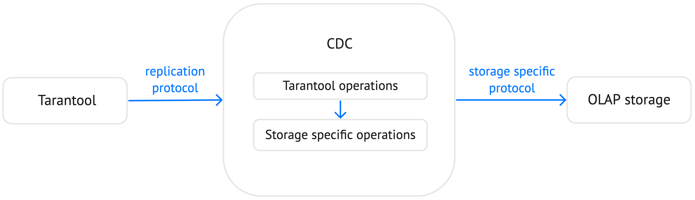

Tarantool 2.11 (LTS)
====================

Release date: May 24, 2023

Releases on GitHub: :tarantool-release:`2.11.1`, :tarantool-release:`2.11.0`

The 2.11 release of Tarantool includes many new features and fixes.
This document provides an overview of the most important features for Enterprise and Community versions.

2.11 is the long-term support (LTS) release with four years of maintenance.
This means that you will continue to receive all the necessary security fixes and bug fixes throughout this period.
You can learn more about the Tarantool release policy from the :doc:`corresponding document </release/policy>`.

..  container:: table

    ..  list-table::
        :widths: 50 50
        :header-rows: 1

        *   -   :ref:`Tarantool Enterprise <2-11-enterprise>`
            -   :ref:`Tarantool Community <2-11-community>`

        *   -   * :ref:`Security enhancements <2-11-security_enhancements>`
                * :ref:`Read views <2-11-read_views>`
                * :ref:`Data compression improvements <2-11-data_compression_improvements>`
                * :ref:`WAL extensions <2-11-wal_extensions>`
            -   * :ref:`Pagination <2-11-pagination>`
                * :ref:`Downgrading a database <2-11-downgrading_database>`
                * :ref:`New bootstrap strategy <2-11-new_bootstrap_strategy>`
                * :ref:`Limitation of fiber execution time <2-11-limit_fiber_execution>`
                * :ref:`Per-module logging <2-11-per_module_logging>`
                * :ref:`HTTP client enhancements <2-11-http_client>`
                * :ref:`Linearizable read <2-11-linearizable_read>`
                * :ref:`Explicit sequential scanning in SQL <2-11-sequential_scanning_sql>`
                * :ref:`Strict fencing in RAFT <2-11-strict_fencing_raft>`

.. _2-11-upgrades:

Upgrading to Tarantool 2.11
---------------------------

Tarantool provides the live upgrade mechanism that enables cluster upgrade without
downtime. In case of upgrade issues, you can roll back to the original state
without downtime as well.

To learn how to upgrade to Tarantool 2.11, see :doc:`Upgrades </book/admin/upgrades>`.

.. _2-11-enterprise:

Tarantool Enterprise
--------------------

.. _2-11-security_enhancements:

Security enhancements
~~~~~~~~~~~~~~~~~~~~~

.. _2-11-encrypted_ssl_tls_keys:

Encrypted SSL/TLS keys
**********************

Tarantool Enterprise now supports encrypted SSL/TLS private key files protected with a password.
Given that most certificate authorities generate encrypted keys, this feature simplifies the maintenance of Tarantool instances.

A password can be provided using either the new ``ssl_password`` URI parameter or in a text file specified using ``ssl_password_file``, for example:

.. code-block:: lua

    box.cfg{ listen = {
        uri = 'localhost:3301',
        params = {
            transport = 'ssl',
            ssl_key_file = '/path_to_key_file',
            ssl_cert_file = '/path_to_cert_file',
            ssl_ciphers = 'HIGH:!aNULL',
            ssl_password = 'topsecret'
        }
    }}

To learn more, see :ref:`Traffic encryption <enterprise-iproto-encryption>`.

.. _2-11-security_enforcement_options:

Security enforcement options
****************************

With 2.11, Tarantool Enterprise includes new security enforcement options.
These options enable you to enforce the use of strong passwords, set up a maximum password age, and so on.
For example, the ``password_min_length`` configuration option specifies the minimum number of characters for a password:

.. code-block:: lua

    box.cfg{ password_min_length = 10 }

To specify the maximum period of time (in days) a user can use the same password, you can use the ``password_lifetime_days`` option, which uses the system clock under the hood:

.. code-block:: lua

    box.cfg{ password_lifetime_days = 365 }

Note that by default, new options are not specified.
You can learn more about all the available options from the
:ref:`Authentication restrictions <enterprise-auth-restrictions>` and
:ref:`Password policy <enterprise-password-policy>` sections.

.. _2-11-pap_sha_256:

PAP-SHA256 authentication method
********************************

By default, Tarantool uses the CHAP protocol to authenticate users and applies SHA-1 hashing to passwords.
In this case, password hashes are stored in the ``_user`` space unsalted.
If an attacker gains access to the database, they may crack a password, for example, using a rainbow table.

With Tarantool Enterprise, you can enable PAP authentication with the SHA256 hashing algorithm.
For PAP, a password is salted with a user-unique salt before saving it in the database.

Given that PAP transmits a password as plain text, Tarantool requires configuring
:ref:`SSL/TLS <enterprise-iproto-encryption-config>`.
Then, you need to specify the ``box.cfg.auth_type`` option as follows:

.. code-block:: lua

    box.cfg{ auth_type = 'pap-sha256' }

Learn more from the :ref:`Authentication protocol <enterprise-authentication-protocol>` section.

.. _2-11-read_views:

Read views
~~~~~~~~~~

Starting with 2.11, Tarantool Enterprise provides the ability to create read views - in-memory snapshots of the entire database that aren't affected by future data modifications.
Read views can be used to make complex analytical queries.
This reduces the load on the main database and improves RPS for a single Tarantool instance.

Working with read views consists of three main steps:

1.  To create a read view, call the ``box.read_view.open()`` function:

        .. code-block:: tarantoolsession

            tarantool> read_view1 = box.read_view.open({name = 'read_view1'})

2.  After creating a read view, you can access database spaces and their indexes and get data using the familiar ``select`` and ``pairs`` data-retrieval operations, for example:

        .. code-block:: tarantoolsession

            tarantool> read_view1.space.bands:select({}, {limit = 4})
            ---
            - - [1, 'Roxette', 1986]
              - [2, 'Scorpions', 1965]
              - [3, 'Ace of Base', 1987]
              - [4, 'The Beatles', 1960]

3.  When a read view is no longer needed, close it using the ``read_view_object:close()`` method:

        .. code-block:: tarantoolsession

            tarantool> read_view1:close()

To learn more, see the :ref:`Read views <read_views>` topic.

.. _2-11-data_compression_improvements:

Data compression improvements
~~~~~~~~~~~~~~~~~~~~~~~~~~~~~

Tarantool Enterprise now includes the ``zlib`` algorithm for :ref:`tuple compression <tuple_compression>`.
This algorithm shows good performance in data decompression,
which reduces CPU usage if the volume of read operations significantly exceeds the volume of write operations.

To use the new algorithm, set the ``compression`` option to ``zlib`` when formatting a space:

.. code-block:: lua

    box.space.my_space:format{
        {name = 'id', type = 'unsigned'},
        {name = 'data', type = 'string', compression = 'zlib'},
    }

The new :ref:`compress <compress-module>` module provides an API for compressing and decompressing arbitrary data strings using the same algorithms available for tuple compression:

.. code-block:: lua

    compressor = require('compress.zlib').new()

    data = compressor:compress('Hello world!') -- returns a binary string
    compressor:decompress(data) -- returns 'Hello world!'

.. _2-11-wal_extensions:

WAL extensions
~~~~~~~~~~~~~~

Tarantool can use a write-ahead log not only to maintain data persistence and replication.
Another use case is implementing a CDC (Change Data Capture) utility that transforms a data replication stream and provides the ability to replicate data from Tarantool to an external storage.

With 2.11, Tarantool Enterprise provides WAL extensions that add auxiliary information to each write-ahead log record.
For example, you can enable storing old and new tuples for each write-ahead log record.
This is especially useful for the ``update`` operation because a write-ahead log record contains only a key value.

See the :ref:`WAL extensions <wal_extensions>` topic to learn how to enable and configure WAL extensions.

.. _2-11-community:

Tarantool Community
-------------------

.. _2-11-pagination:

Pagination
~~~~~~~~~~

With the 2.11 version, Tarantool supports pagination and enables the ability to get data in chunks.
The :ref:`index_object:select() <box_index-select>` and :ref:`index_object:pairs() <box_index-pairs>` methods now provide the ``after`` option that specifies a tuple or a tuple's position after which ``select`` starts the search.
In the example below, the ``select`` operation gets maximum 3 tuples after the specified tuple:

.. code-block:: tarantoolsession

    tarantool> bands.index.primary:select({}, {after = {4, 'The Beatles', 1960}, limit = 3})
    ---
    - - [5, 'Pink Floyd', 1965]
      - [6, 'The Rolling Stones', 1962]
      - [7, 'The Doors', 1965]
    ...

The ``after`` option also accepts the position of the tuple represented by the base64 string.
For example, you can set the ``fetch_pos`` boolean option to ``true`` to return the position of the last selected tuple as the second value:

.. code-block:: tarantoolsession

    tarantool> result, position = bands.index.primary:select({}, {limit = 3, fetch_pos = true})
    ---
    ...

Then, pass this position as the ``after`` parameter:

.. code-block:: tarantoolsession

    tarantool> bands.index.primary:select({}, {limit = 3, after = position})
    ---
    - - [4, 'The Beatles', 1960]
      - [5, 'Pink Floyd', 1965]
      - [6, 'The Rolling Stones', 1962]
    ...

The new ``after`` and ``fetch_pos`` options are also implemented by the built-in ``net.box`` connector.
For example, you can use these options to get data :ref:`asynchronously <net_box-is_async>`.

.. _2-11-downgrading_database:

Downgrading a database
~~~~~~~~~~~~~~~~~~~~~~

The 2.11 version provides the ability to downgrade a database to the specified Tarantool version using the :ref:`box.schema.downgrade() <box_schema-downgrade>` method.
This might be useful in the case of a failed upgrade.

To prepare a database for using it on an older Tarantool instance, call ``box.schema.downgrade`` and pass the desired Tarantool version:

.. code-block:: tarantoolsession

    tarantool> box.schema.downgrade('2.8.4')

To see Tarantool versions available for downgrade, call ``box.schema.downgrade_versions()``.
The earliest release available for downgrade is :doc:`2.8.2 </release/2.8.2>`.

.. _2-11-new_bootstrap_strategy:

New bootstrap strategy
~~~~~~~~~~~~~~~~~~~~~~

In previous Tarantool versions, the :ref:`replication_connect_quorum <cfg_replication-replication_connect_quorum>` option was used to specify the number of running nodes to start a replica set.
This option was designed to simplify a replica set bootstrap.
But in fact, this behavior brought some issues during a cluster lifetime and maintenance operations, for example:

*   Users who didn't change this option encountered problems with the partial cluster bootstrap.
*   Users who changed the option encountered problems during the instance restart.

With 2.11, ``replication_connect_quorum`` is deprecated in favor of :ref:`bootstrap_strategy <cfg_replication-bootstrap_strategy>`.
This option works during a replica set bootstrap and implies sensible default values for other parameters based on the replica set configuration.
Currently, ``bootstrap_strategy`` accepts two values:

*   ``auto``: a node doesn't boot if half or more of the other nodes in a replica set are not connected.
    For example, if the replication parameter contains 2 or 3 nodes, a node requires 2 connected instances.
    In the case of 4 or 5 nodes, at least 3 connected instances are required.
    Moreover, a bootstrap leader fails to boot unless every connected node has chosen it as a bootstrap leader.
*   ``legacy``: a node requires the ``replication_connect_quorum`` number of other nodes to be connected.
    This option is added to keep the compatibility with the current versions of Cartridge and might be removed in the future.

.. _2-11-limit_fiber_execution:

Limitation of fiber execution time
~~~~~~~~~~~~~~~~~~~~~~~~~~~~~~~~~~

Starting with 2.11, if a fiber works too long without yielding control, you can use a fiber slice to limit its execution time.
The :ref:`fiber_slice_default <compat-option-fiber-slice>` ``compat`` option controls the default value of the maximum fiber slice.
In future versions, this option will be set to ``true`` by default.

There are two slice types - a warning and an error slice:

*   When a warning slice is over, a warning message is logged, for example:

        .. code-block:: console

            fiber has not yielded for more than 0.500 seconds

*   When an error slice is over, the fiber is cancelled and the ``FiberSliceIsExceeded`` error is thrown:

        .. code-block:: console

            FiberSliceIsExceeded: fiber slice is exceeded

Note that these messages can point at issues in the existing application code.
These issues can cause potential problems in production.

The fiber slice is checked by all functions operating on spaces and indexes,
such as ``index_object.select()``, ``space_object.replace()``, and so on.
You can also use the ``fiber.check_slice()`` function in application code to check whether the slice for the current fiber is over.

The example below shows how to use ``fiber.set_max_slice()`` to limit the slice for all fibers.
``fiber.check_slice()`` is called inside a long-running operation to determine whether a slice for the current fiber is over.

.. code-block:: lua

    -- app.lua --
    fiber = require('fiber')
    clock = require('clock')

    fiber.set_max_slice({warn = 1.5, err = 3})
    time = clock.monotonic()
    function long_operation()
        while clock.monotonic() - time < 5 do
            fiber.check_slice()
            -- Long-running operation ⌛⌛⌛ --
        end
    end
    long_operation_fiber = fiber.create(long_operation)

The output should look as follows:

.. code-block:: console

    $ tarantool app.lua
    fiber has not yielded for more than 1.500 seconds
    FiberSliceIsExceeded: fiber slice is exceeded

To learn more about fiber slices, see the :ref:`Limit execution time <fibers_limit_execution_time>` section.

.. _2-11-per_module_logging:

Per-module logging
~~~~~~~~~~~~~~~~~~

Tarantool 2.11 adds support for modules in the :ref:`logging <log-module>` subsystem.
You can configure different log levels for each module using the ``box.cfg.log_modules`` configuration option.
The example below shows how to set the ``info`` level for ``module1`` and the ``error`` level for ``module2``:

.. code-block:: tarantoolsession

    tarantool> box.cfg{log_level = 'warn', log_modules = {module1 = 'info', module2 = 'error'}}
    ---
    ...

To create a log module, call the ``require('log').new()`` function:

.. code-block:: tarantoolsession

    tarantool> module1_log = require('log').new('module1')
    ---
    ...
    tarantool> module2_log = require('log').new('module2')
    ---
    ...

Given that ``module1_log`` has the ``info`` logging level, calling ``module1_log.info`` shows a message but ``module1_log.debug`` is swallowed:

.. code-block:: tarantoolsession

    tarantool> module1_log.info('Hello from module1!')
    2023-05-12 15:10:13.691 [39202] main/103/interactive/module1 I> Hello from module1!
    ---
    ...
    tarantool> module1_log.debug('Hello from module1!')
    ---
    ...

Similarly, ``module2_log`` swallows all events with severities below the ``error`` level:

.. code-block:: tarantoolsession

    tarantool> module2_log.info('Hello from module2!')
    ---
    ...

.. _2-11-http_client:

HTTP client enhancements
~~~~~~~~~~~~~~~~~~~~~~~~

.. _2-11-content_serialization:

Content serialization
*********************

The :ref:`HTTP client <http-module>` now automatically serializes the content in a specific format when sending a request based on the specified ``Content-Type`` header and supports all the Tarantool built-in types.
By default, the client uses the ``application/json`` content type and sends data serialized as JSON:

.. code-block:: lua

    local http_client = require('http.client').new()
    local uuid = require('uuid')
    local datetime = require('datetime')

    response = http_client:post('https://httpbin.org/anything', {
        user_uuid = uuid.new(),
        user_name = "John Smith",
        created_at = datetime.now()
    })

The body for the request above might look like this:

.. code-block:: console

    {
        "user_uuid": "70ebc08d-2a9a-4ea7-baac-e9967dd45ac7",
        "user_name": "John Smith",
        "created_at": "2023-05-15T11:18:46.160910+0300"
    }

To send data in a YAML or MsgPack format, set the ``Content-Type`` header explicitly to ``application/yaml`` or ``application/msgpack``, for example:

.. code-block:: lua

    response = http_client:post('https://httpbin.org/anything', {
        user_uuid = uuid.new(),
        user_name = "John Smith",
        created_at = datetime.now()
    }, {
        headers = {
            ['Content-Type'] = 'application/yaml',
        }
    })

.. _2-11-query_and_form_parameters:

Query and form parameters
*************************

You can now encode query and form parameters using the new ``params`` request option.
In the example below, the requested URL is ``https://httpbin.org/get?page=1``.

.. code-block:: lua

    local http_client = require('http.client').new()

    response = http_client:get('https://httpbin.org/get', {
        params = { page = 1 },
    })

Similarly, you can send form parameters using the ``application/x-www-form-urlencoded`` type as follows:

.. code-block:: lua

    local http_client = require('http.client').new()

    response = http_client:post('https://httpbin.org/anything', nil, {
        params = { user_id = 1, user_name = 'John Smith' },
    })

.. _2-11-streaming:

Streaming
*********

The HTTP client now supports chunked writing and reading of request and response data, respectively.
The example below shows how to get chunks of a JSON response sequentially instead of waiting for the entire response:

.. code-block:: lua

    local http_client = require('http.client').new()
    local json = require('json')

    local timeout = 1
    local io = http_client:get(url, nil, {chunked = true})
    for i = 1, 3 do
         local data = io:read('\r\n', timeout)
         if len(data) == 0 then
             -- End of the response.
             break
         end
         local decoded = json.decode(data)
         -- <..process decoded data..>
    end
    io:finish(timeout)

Streaming can also be useful to upload a large file to a server or to subscribe to changes in ``etcd`` using the gRPC-JSON gateway.
The example below demonstrates communication with the ``etcd`` stream interface.
The request data is written line-by-line, and each line represents an ``etcd`` command.

.. code-block:: lua

    local http_client = require('http.client').new()

    local io = http_client:post('http://localhost:2379/v3/watch', nil, {chunked = true})
    io:write('{"create_request":{"key":"Zm9v"}}')
    local res = io:read('\n')
    print(res)
    -- <..you can feed more commands here..>
    io:finish()

.. _2-11-linearizable_read:

Linearizable read
~~~~~~~~~~~~~~~~~

Linearizability of read operations implies that if a response for a write request arrived earlier than a read request was made, this read request should return the results of the write request.
Tarantool 2.11 introduces the new ``linearizable`` isolation level for :ref:`box.begin() <box-begin>`:

.. code-block:: lua

    box.begin({txn_isolation = 'linearizable', timeout = 10})
    box.space.my_space:select({1})
    box.commit()

When called with ``linearizable``, ``box.begin()`` yields until the instance receives enough data from remote peers to be sure that the transaction is linearizable.

There are several prerequisites for linearizable transactions:

*   Linearizable transactions may only perform requests to synchronous, local, or temporary memtx spaces.
*   Starting a linearizable transaction requires :ref:`box.cfg.memtx_use_mvcc_engine <cfg_basic-memtx_use_mvcc_engine>` to be set to ``true``.
*   The node is the replication source for at least ``N - Q + 1`` remote replicas.
    Here ``N`` is the count of registered nodes in the cluster and ``Q`` is :ref:`replication_synchro_quorum <cfg_replication-replication_synchro_quorum>`.
    So, for example, you can't perform a linearizable transaction on anonymous replicas.

.. _2-11-sequential_scanning_sql:

Explicit sequential scanning in SQL
~~~~~~~~~~~~~~~~~~~~~~~~~~~~~~~~~~~

Tarantool is primarily designed for OLTP workloads.
This means that data reads are supposed to be relatively small.
However, a suboptimal SQL query can cause a heavy load on a database.

The new ``sql_seq_scan`` :ref:`session setting <sql_set>` is added to explicitly cancel full table scanning.
The request below should fail with the ``Scanning is not allowed for 'T'`` error:

.. code-block:: sql

    SET SESSION "sql_seq_scan" = false;
    SELECT a FROM t WHERE a + 1 > 10;

To enable table scanning explicitly, use the new ``SEQSCAN`` keyword:

.. code-block:: sql

    SET SESSION "sql_seq_scan" = false;
    SELECT a FROM SEQSCAN t WHERE a + 1 > 10;

In future versions, ``SEQSCAN`` will be required for scanning queries with the ability to disable the check using the ``sql_seq_scan`` session setting.
The new behavior can be enabled using a :ref:`corresponding compat option <compat-option-sql-scan>`.

.. _2-11-strict_fencing_raft:

Strict fencing in RAFT
~~~~~~~~~~~~~~~~~~~~~~

Leader election is implemented in Tarantool as a modification of the Raft algorithm.
The 2.11 release adds the ability to specify the leader fencing mode that affects the leader election process.

.. NOTE::

    Currently, Cartridge does not support leader election using Raft.

You can control the fencing mode using the :ref:`election_fencing_mode <cfg_replication-election_fencing_mode>` property, which accepts the following values:

*   In ``soft`` mode, a connection is considered dead if there are no responses for ``4 * replication_timeout`` seconds both on the current leader and the followers.
*   In ``strict`` mode, a connection is considered dead if there are no responses for ``2 * replication_timeout`` seconds on the current leader and ``4 * replication_timeout`` seconds on the followers.
    This improves the chances that there is only one leader at any time.
