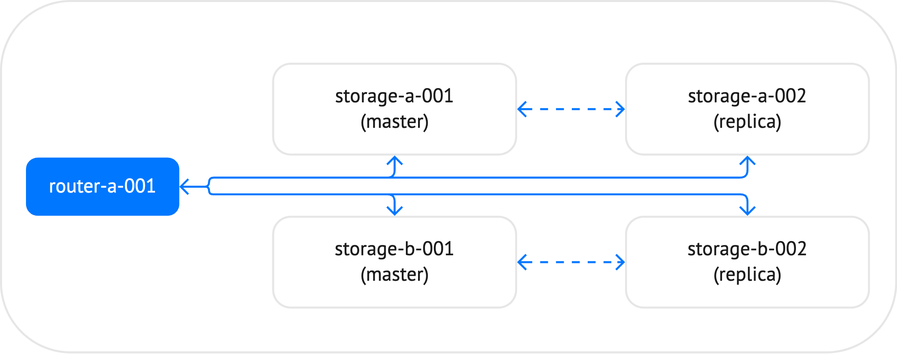
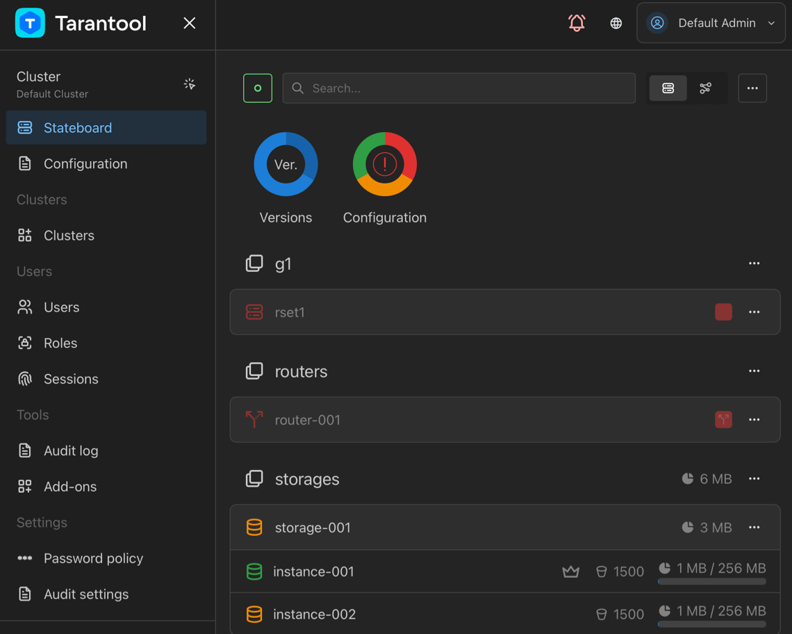
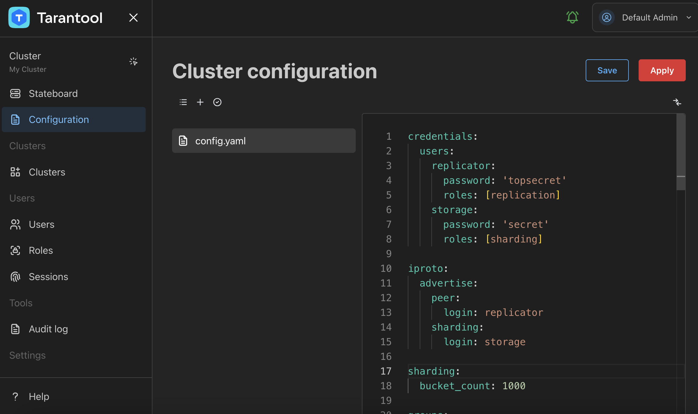
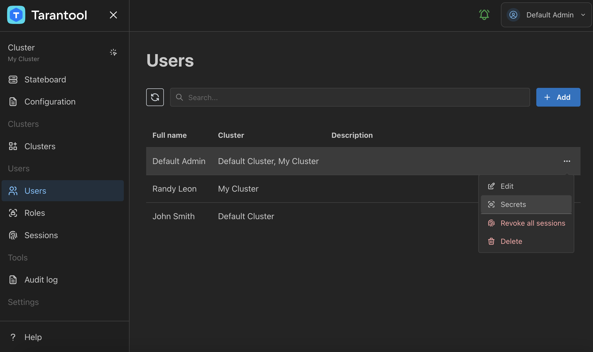
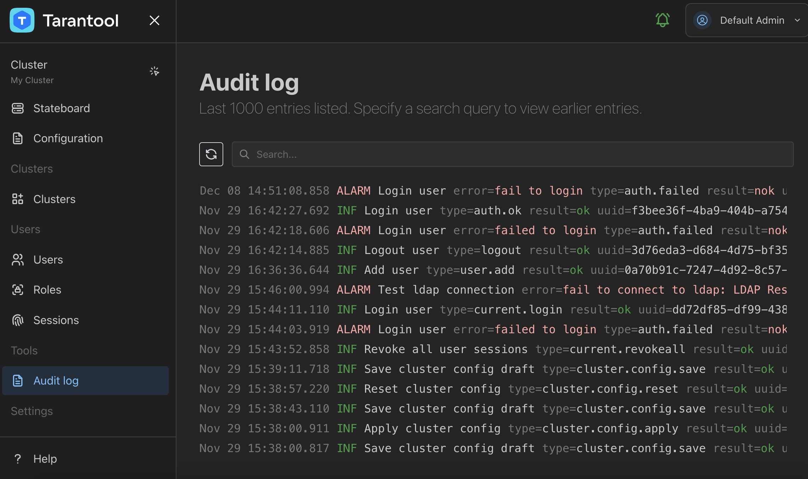

Tarantool 3.0
=============

Release date: December 26, 2023

Releases on GitHub: :tarantool-release:`3.0.1`, :tarantool-release:`3.0.0`

The 3.0 release of Tarantool introduces a new declarative approach for configuring a cluster,
a new visual tool -- Tarantool Cluster Manager,
and many other new features and fixes.
This document provides an overview of the most important features for the Community and Enterprise editions.

-   :ref:`New declarative configuration <3-0-new_declarative_configuration>`
-   :ref:`Tarantool Cluster Manager <3-0-tarantool_cluster_manager>`
-   :ref:`Administration and maintenance <3-0-enhancements_for_administration_and_maintenance>`
-   :ref:`Developing applications <3-0-features_for_developers>`
-   :ref:`Stability <3-0-stability>`

.. _3-0-new_declarative_configuration:

New declarative configuration
-----------------------------

Starting with the 3.0 version, Tarantool provides the ability to :ref:`configure the full topology of a cluster <configuration>` using a declarative YAML configuration instead of configuring each instance using a dedicated Lua script.
With a new approach, you can write a local configuration in a YAML file for each instance or store configuration data in one reliable place, for example, a Tarantool or an etcd cluster.

The example below shows how a configuration of a small sharded cluster might look.
In the diagram below, the cluster includes 5 instances: one router and 4 storages, which constitute two replica sets.
For each replica set, the master instance is specified manually.

The example below demonstrates how a topology of such a cluster might look in a YAML configuration file:

..  literalinclude:: /code_snippets/snippets/sharding/instances.enabled/sharded_cluster/config.yaml
    :start-at: groups:
    :language: yaml
    :dedent:

You can find the full sample in the GitHub documentation repository: `sharded_cluster <https://github.com/tarantool/doc/tree/latest/doc/code_snippets/snippets/sharding/instances.enabled/sharded_cluster>`_.

The latest version of the tt utility provides the ability to :ref:`manage Tarantool instances <admin-start_stop_instance>` configured using a new approach.
You can start all instances in a cluster by executing one command, check the status of instances, or stop them:

.. code-block:: console

    $ tt start sharded_cluster
       • Starting an instance [sharded_cluster:storage-a-001]...
       • Starting an instance [sharded_cluster:storage-a-002]...
       • Starting an instance [sharded_cluster:storage-b-001]...
       • Starting an instance [sharded_cluster:storage-b-002]...
       • Starting an instance [sharded_cluster:router-a-001]...

.. _3-0-centralized_configuration:

Centralized configuration (EE)
~~~~~~~~~~~~~~~~~~~~~~~~~~~~~~

Tarantool Enterprise Edition enables you to store configuration data in one reliable place, for example, an :ref:`etcd <configuration_etcd>` cluster. To achieve this, you need to configure connection options in the ``config.etcd`` section of the configuration file, for example:

..  literalinclude:: /code_snippets/snippets/centralized_config/instances.enabled/config_etcd/config.yaml
    :language: yaml
    :end-at: password: '123456'
    :dedent:

Using the configuration above, a Tarantool instance searches for a cluster configuration by the following path:

.. code-block:: none

    http://localhost:2379/myapp/config/*

.. _3-0-tarantool_cluster_manager:

Tarantool Cluster Manager (EE)
------------------------------

Tarantool 3.0 Enterprise Edition comes with a brand new visual tool – :ref:`Tarantool Cluster Manager <tcm>` (TCM).
It provides a web-based user interface for managing, configuring, and monitoring Tarantool EE clusters that use centralized configuration storage.

TCM can manage multiple clusters and covers a wide range of tasks, from writing a cluster’s configuration to executing commands interactively on specific instances.

TCM's role-based access control system lets you manage users’ access to clusters, their configurations, and stored data.

The built-in customizable audit logging mechanism and LDAP authentication make TCM a suitable solution for different enterprise security requirements.

.. _3-0-enhancements_for_administration_and_maintenance:

Administration and maintenance
------------------------------

.. _3-0-database_statistics:

Database statistics
~~~~~~~~~~~~~~~~~~~

Starting with 3.0, Tarantool provides extended statistics about memory consumption for the given space or specific tuples.

Usually, the :ref:`space_object:bsize() <box_space-bsize>` method is used to get the size of memory occupied by the specified space:

.. code-block:: console

    app:instance001> box.space.books:bsize()
    ---
    - 70348673
    ...

In addition to the actual data, the space requires additional memory to store supplementary information.
You can see the total memory usage using :ref:`box.slab.info() <box_slab_info>`:

.. code-block:: console

    app:instance001> box.slab.info().items_used
    ---
    - 75302024
    ...

A new ``space_object:stat()`` method allows you to determine how the additional 5 Mb of memory is used:

.. code-block:: console

    app:instance001> box.space.books:stat()
    ---
    - tuple:
        memtx:
          waste_size: 1744011
          data_size: 70348673
          header_size: 2154132
          field_map_size: 0
        malloc:
          waste_size: 0
          data_size: 0
          header_size: 0
          field_map_size: 0
    ...

The above report gives the following information:

-   ``header_size`` and ``field_map_size``: the size of service information.
-   ``data_size``: the actual size of data, which equals to ``space_object:bsize()``.
-   ``waste_size``: the size of memory wasted due to internal fragmentation in the `slab allocator <https://github.com/tarantool/small>`_.

To get such information about a specific tuple, use ``tuple_object:info()``:

.. code-block:: console

    app:instance001> box.space.books:get('1853260622'):info()
    ---
    - data_size: 277
      waste_size: 9
      arena: memtx
      field_map_size: 0
      header_size: 10
    ...

.. _3-0-bootstrapping_a_replica_set:

Bootstrapping a replica set
~~~~~~~~~~~~~~~~~~~~~~~~~~~

The new version includes the capability to choose a bootstrap leader for a replica set manually.
The bootstrap leader is a node that creates an initial snapshot and registers all the replicas in a replica set.

First, you need to set :ref:`replication.bootstrap_strategy <configuration_reference_replication_bootstrap_strategy>` to ``config``.
Then, use the ``<replicaset_name>.bootstrap_leader`` option to specify a bootstrap leader.

..  literalinclude:: /code_snippets/snippets/replication/instances.enabled/bootstrap_strategy/config.yaml
    :language: yaml
    :start-at: groups:
    :end-at: 127.0.0.1:3303
    :dedent:

..  NOTE::

    Note that in 3.0, the :ref:`replication_connect_quorum <cfg_replication-replication_connect_quorum>` option is removed.
    This option was used to specify the number of nodes to be up and running for starting a replica set.

.. _3-0-security:

Security (EE)
~~~~~~~~~~~~~

With the 3.0 version, Tarantool Enterprise Edition provides a set of new features that enhance :ref:`security <enterprise-security>` in your cluster:

-   Introduced the ``secure_erasing`` configuration option that forces Tarantool to overwrite a data file a few times before deletion to render recovery of a deleted file impossible.
    With the new configuration approach, you can enable this capability as follows:

    .. code-block:: yaml

        security:
          secure_erasing: true

    This option can be also set using the ``TT_SECURITY_SECURE_ERASING`` environment variable.

-   Added the ``auth_retries`` option that configures the maximum number of authentication retries before throttling is enabled.
    You can configure this option as follows:

    .. code-block:: yaml

        security:
          auth_retries: 3

-   Added the capability to use the new SSL certificate with the same name by reloading the configuration.
    To do this, use the ``reload()`` function provided by the new ``config`` module:

    .. code-block:: console

        app:instance001> require('config'):reload()
        ---
        ...

.. _3-0-audit_logging:

Audit logging (EE)
~~~~~~~~~~~~~~~~~~

Tarantool Enterprise Edition includes the following new features for :ref:`audit logging <enterprise_audit_module>`:

-   Added a unique identifier (UUID) to each audit log entry.
-   Introduced audit log severity levels.
    Each system audit event now has a severity level determined by its importance.
-   Added the ``audit_log.audit_spaces`` option that configures the list of spaces for which data operation events should be logged.
-   Added the ``audit_log.audit_extract_key`` option that forces the audit subsystem to log the primary key instead of a full tuple in DML operations.
    This might be useful for reducing audit log size in the case of large tuples.

The sample audit log configuration in the 3.0 version might look as follows, including new ``audit_spaces`` and ``audit_extract_key`` options:

..  code-block:: yaml
    :emphasize-lines: 5,6

    audit_log:
      to: file
      file: audit_tarantool.log
      filter: [ddl,dml]
      spaces: [books]
      extract_key: true

With this configuration, an audit log entry for a DELETE operation may look like below:

.. code-block:: json
    :emphasize-lines: 3,4,11

    {
      "time": "2023-12-19T10:09:44.664+0000",
      "uuid": "65901190-f8a6-45c1-b3a4-1a11cf5c7355",
      "severity": "VERBOSE",
      "remote": "unix/:(socket)",
      "session_type": "console",
      "module": "tarantool",
      "user": "admin",
      "type": "space_delete",
      "tag": "",
      "description": "Delete key [\"0671623249\"] from space books"
    }

The entry includes the new ``uuid`` and ``severity`` fields.
The last ``description`` field gives only the information about the key of the deleted tuple.

.. _3-0-flight-recorder:

Reading flight recordings (EE)
~~~~~~~~~~~~~~~~~~~~~~~~~~~~~~

The :ref:`flight recorder <enterprise-flight-recorder>` available in the Enterprise Edition is an event collection tool that gathers various information about a working Tarantool instance.
With the 3.0 version, you can read flight recordings using the API provided by the ``flightrec`` module.

To enable the flight recorder in a YAML file, set ``flightrec.enabled`` to true:

..  literalinclude:: /code_snippets/snippets/config/instances.enabled/flightrec/config.yaml
    :language: yaml
    :start-at: flightrec:
    :end-at: enabled: true
    :dedent:

Then, you can use the Lua API to open and read ``*.ttfr`` files:

.. _3-0-flight-recorder-begin:

..  code-block:: tarantoolsession

    app:instance001> flightrec = require('flightrec')
    ---
    ...

    app:instance001> flightrec_file = flightrec.open('var/lib/instance001/20231225T085435.ttfr')
    ---
    ...

    app:instance001> flightrec_file
    ---
    - sections: &0
        requests:
          size: 10485760
        metrics:
          size: 368640
        logs:
          size: 10485760
      was_closed: false
      version: 0
      pid: 1350
    ...

    app:instance001> for i, r in flightrec_file.sections.logs:pairs() do record = r; break end
    ---
    ...

    app:instance001> record
    ---
    - level: INFO
      fiber_name: interactive
      fiber_id: 103
      cord_name: main
      file: ./src/box/flightrec.c
      time: 2023-12-25 08:50:12.275
      message: 'Flight recorder: configuration has been done'
      line: 727
    ...

    app:instance001> flightrec_file:close()
    ---
    ...

.. _3-0-flight-recorder-end:

.. _3-0-deb_rpm_package:

New DEB and RPM packages
~~~~~~~~~~~~~~~~~~~~~~~~

With this release, the approach to delivering Tarantool to end users in DEB and RPM packages is slightly revised.
In the previous versions, Tarantool was built for the most popular Linux distributions and their latest version.

Starting with this release, only two sets of DEB and RPM packages are delivered.
The difference is that these packages include a statically compiled Tarantool binary.
This approach provides the ability to install DEB and RPM packages on any Linux distributions that are based on СentOS and Debian.

To ensure that Tarantool works for a wide range of different distributions and their versions, RPM and DEB packages are prepared on CentOS 7 with glibc 2.17.

.. _3-0-features_for_developers:

Developing applications
-----------------------

.. _3-0-varbinary_data_type:

varbinary in Lua
~~~~~~~~~~~~~~~~

In the previous versions, Tarantool already supported the ``varbinary`` type for :ref:`storing data <index_box_field_type_details>`.
But working with ``varbinary`` database fields required workarounds, such as using C to process such data.

The 3.0 version includes a new ``varbinary`` module for working with varbinary objects.
The module implements the following functions:

-   ``varbinary.new()`` - constructs a varbinary object from a plain string.
-   ``varbinary.is()`` - returns true if the argument is a varbinary object.

In the example below, an object is created from a string:

..  code-block:: lua

    local varbinary = require('varbinary')
    local bin = varbinary.new('Hello world!')

The built-in decoders now decode binary data fields to a varbinary object by default:

..  code-block:: lua

    local varbinary = require('varbinary')
    local msgpack = require('msgpack')
    varbinary.is(msgpack.decode('\xC4\x02\xFF\xFE'))
    --[[
    ---
    - true
    ...
    ]]
    varbinary.is(yaml.decode('!!binary //4='))
    --[[
    ---
    - true
    ...
    ]]

This also implies that the data stored in the database under the ``varbinary`` field type is now returned to Lua not as a plain string but as a varbinary object.

It's possible to revert to the old behavior by toggling the new ``binary_data_decoding`` :ref:`compat <compat-module>` option because this change may break backward compatibility:

.. code-block:: yaml

    compat:
      binary_data_decoding: old

.. _3-0-default_field_values:

Default field values
~~~~~~~~~~~~~~~~~~~~

You can now assign the default values for specific fields when defining a :ref:`space format <box_space-format>`.
In this example, the ``isbn`` and ``title`` fields have the specified default values:

..  code-block:: lua

    box.schema.space.create('books')
    box.space.books:format({
        { name = 'id', type = 'unsigned' },
        { name = 'isbn', type = 'string', default = '9990000000000' },
        { name = 'title', type = 'string', default = 'New awesome book' },
        { name = 'year_of_publication', type = 'unsigned', default = 2023 }
    })
    box.space.books:create_index('primary', { parts = { 'isbn' } })

If you insert a tuple with missing fields, the default values are inserted:

..  code-block:: tarantoolsession

    app:instance001> box.space.books:insert({ 1000, nil, nil, nil })
    ---
    - [1000, '9990000000000', 'New awesome book', 2023]
    ...

You can also provide a custom logic for generating a default value.
To achieve this, create a function using ``box.schema.func.create``:

.. code-block:: lua

    box.schema.func.create('current_year', {
        language = 'Lua',
        body = "function() return require('datetime').now().year end"
    })

Then, assign the function name to ``default_func`` when defining a space format:

.. code-block:: lua

    box.space.books:format({
        -- ... --
        { name = 'year_of_publication', type = 'unsigned', default_func = 'current_year' }
    })

.. _3-0-triggers:

Triggers
~~~~~~~~

In the 3.0 version, the API for creating :ref:`triggers <triggers>` is completely reworked.
A new ``trigger`` module is introduced, allowing you to set handlers on both predefined and custom events.

To create the trigger, you need to:

1)  Provide an event name used to associate the trigger with.
2)  Define the trigger name.
3)  Provide a trigger handler function.

The code snippet below shows how to subscribe to changes in the ``books`` space:

.. code-block:: lua

    local trigger = require('trigger')
    trigger.set(
            'box.space.books.on_replace', -- event name
            'some-custom-trigger',        -- trigger name
            function(...)
                -- trigger handler
            end
    )

.. _3-0-pagination_for_read_views:

Pagination in read views (EE)
~~~~~~~~~~~~~~~~~~~~~~~~~~~~~

The 2.11 release introduced the following features:

-   :ref:`Read views <2-11-read_views>` are in-memory snapshots of the entire database that aren't affected by future data modifications.
-   :ref:`Pagination <2-11-pagination>` for getting data in chunks.

With the 3.0 release, a read view object supports the ``after`` and ``fetch_pos`` arguments for the ``select`` and ``pairs`` methods:

.. code-block:: tarantoolsession

    -- Select first 3 tuples and fetch a last tuple's position --
    app:instance001> result, position = read_view1.space.bands:select({}, { limit = 3, fetch_pos = true })
    ---
    ...

    app:instance001> result
    ---
    - - [1, 'Roxette', 1986]
      - [2, 'Scorpions', 1965]
      - [3, 'Ace of Base', 1987]
    ...

    app:instance001> position
    ---
    - kQM
    ...

    -- Then, you can pass this position as the 'after' parameter --
    app:instance001> read_view1.space.bands:select({}, { limit = 3, after = position })
    ---
    - - [4, 'The Beatles', 1960]
      - [5, 'Pink Floyd', 1965]
      - [6, 'The Rolling Stones', 1962]
    ...

.. _3-0-iproto_tuples:

IPROTO tuple format
~~~~~~~~~~~~~~~~~~~

Starting with the 3.0 version, the IPROTO protocol is extended to support for sending names of tuple fields in the :ref:`IPROTO_CALL <box_protocol-call>` and other IPROTO responses.
This simplifies the development of Tarantool connectors and also simplifies handling tuples received from remote procedure calls or from routers.

It's possible to revert to the old behavior by toggling the ``box_tuple_extension`` :ref:`compat <compat-module>` option:

..  code-block:: yaml

    compat:
      box_tuple_extension: old

.. _3-0-case_sensitive_sql:

SQL: case-sensitive names
~~~~~~~~~~~~~~~~~~~~~~~~~

Starting with 3.0, names in :ref:`SQL <sql_tutorial>`, for example, table, column, or constraint names are case-sensitive.
Before the 3.0 version, the query below created a ``MYTABLE`` table:

.. code-block:: sql

    CREATE TABLE MyTable (i INT  PRIMARY KEY);

To create the ``MyTable`` table, you needed to enclose the name into double quotes:

.. code-block:: sql

    CREATE TABLE "MyTable" (i INT  PRIMARY KEY);

Starting with 3.0, names are case-sensitive, and double quotes are no longer needed:

.. code-block:: sql

    CREATE TABLE MyTable (i INT  PRIMARY KEY);

For backward compatibility, the new version also supports a second lookup using an uppercase name.
This means that the query below tries to find the ``MyTable`` table and then ``MYTABLE``:

.. code-block:: sql

    SELECT * FROM MyTable;

.. _3-0-stability:

Stability
---------

.. _3-0-handling_lua_jit_compiler_errors:

Handling LuaJIT compiler errors
~~~~~~~~~~~~~~~~~~~~~~~~~~~~~~~

The 3.0 release includes a fix for the `gh-562 <https://github.com/tarantool/tarantool/issues/562>`__ LuaJIT issue related to the inability to handle internal compiler on-trace errors using ``pcall``.
The examples of such errors are:

-   An ``Out of memory`` error might occur for ``select`` queries returning a large amount of data.
-   A ``Table overflow`` error is raised when exceeding the maximum number of keys in a table.

The script below tries to fill a Lua table with a large number of keys:

.. code-block:: lua

    local function memory_payload()
        local t = {}
        for i = 1, 1e10 do
            t[ffi.new('uint64_t')] = i
        end
    end
    local res, err = pcall(memory_payload)
    print(res, err)

In the previous Tarantool version with the 32-bit Lua GC, this script causes the following error despite using ``pcall``:

.. code-block:: none

    PANIC: unprotected error in call to Lua API (not enough memory)

For Tarantool with the 64-bit Lua GC, this script causes a ``Table overflow`` error:

.. code-block:: none

    PANIC: unprotected error in call to Lua API (table overflow)

Starting with the 3.0 version, these errors are handled correctly with the following outputs:

.. code-block:: none

    false    not enough memory -- 32-bit Lua GC
    false    table overflow    -- 64-bit Lua GC

As a result, Tarantool 3.0 becomes more stable in cases when user scripts include erroneous code.
