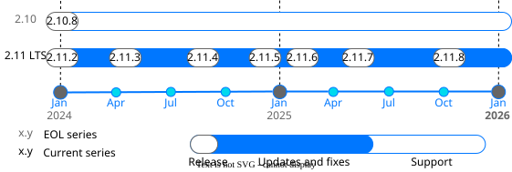

Release calendar
================

This section contains general information and links to appropriate pages containing details
about 1.x and 2.x Tarantool releases: release notes, lifecycle information, release policy, and other info.

..  _release-supported-versions:

Supported versions
------------------

Every Tarantool release series has the same :ref:`lifecycle <release-series-lifecycle>`
defined by the release policy. The following diagram visualizes the lifecycle of currently supported Tarantool 2.x versions:

.. note::

    *End of life* (*EOL*) means the release series will no longer receive any patches,
    updates, or feature improvements after the specified date.

    *End of support* (*EOS*) means that we won't provide technical support to product
    versions after the specified date.

The table below provides information about currently supported versions with links to their
*What's new* pages in the documentation and/or detailed changelogs on GitHub.
For information about earlier versions, see :doc:`eos_versions`.

To see the information about Tarantool 3.x versions,
see the corresponding `page <https://www.tarantool.io/en/doc/latest/release/>`_.

..  container:: table

    ..  list-table::

        *   -   Version
            -   Release date
            -   End of life
            -   End of support

        *   -   `2.11.7 LTS <https://github.com/tarantool/tarantool/releases/tag/2.11.7>`_
            -   May 29, 2025
            -   May 24, 2025
            -   Not planned yet

        *   -   `2.11.6 LTS <https://github.com/tarantool/tarantool/releases/tag/2.11.6>`_
            -   February 24, 2025
            -   May 24, 2025
            -   Not planned yet

        *   -   `2.11.5 LTS <https://github.com/tarantool/tarantool/releases/tag/2.11.5>`_
            -   November 22, 2024
            -   May 24, 2025
            -   Not planned yet

        *   -   `2.11.4 LTS <https://github.com/tarantool/tarantool/releases/tag/2.11.4>`_
            -   August 16, 2024
            -   May 24, 2025
            -   Not planned yet

        *   -   `2.11.3 LTS <https://github.com/tarantool/tarantool/releases/tag/2.11.3>`_
            -   April 18, 2024
            -   May 24, 2025
            -   Not planned yet

        *   -   `2.11.2 LTS <https://github.com/tarantool/tarantool/releases/tag/2.11.2>`_
            -   December 7, 2023
            -   May 24, 2025
            -   Not planned yet

        *   -   `2.11.1 LTS <https://github.com/tarantool/tarantool/releases/tag/2.11.1>`_
            -   August 17, 2023
            -   May 24, 2025
            -   Not planned yet

        *   -   :doc:`2.11.0 LTS </release/2.11.0>`
            -   May 24, 2023
            -   May 24, 2025
            -   Not planned yet

        *   -   :doc:`2.10.8 </release/2.10.8>`
            -   September 14, 2023
            -   September 14, 2023
            -   December 31, 2025

        *   -   :doc:`2.10.7 </release/2.10.7>`
            -   May 24, 2023
            -   September 14, 2023
            -   December 31, 2025

        *   -   :doc:`2.10.6 </release/2.10.6>`
            -   March 22, 2023
            -   September 14, 2023
            -   December 31, 2025

        *   -   :doc:`2.10.5 </release/2.10.5>`
            -   February 20, 2023
            -   September 14, 2023
            -   December 31, 2025

        *   -   :doc:`2.10.4 </release/2.10.4>`
            -   November 11, 2022
            -   September 14, 2023
            -   December 31, 2025

        *   -   :doc:`2.10.3 </release/2.10.3>`
            -   September 30, 2022
            -   September 14, 2023
            -   December 31, 2025

        *   -   :doc:`2.10.2 </release/2.10.2>`
            -   September 1, 2022
            -   September 14, 2023
            -   December 31, 2025

        *   -   :doc:`2.10.1 </release/2.10.1>`
            -   August 8, 2022
            -   September 14, 2023
            -   December 31, 2025

        *   -   :doc:`2.10.0 </release/2.10.0>`
            -   May 22, 2022
            -   September 14, 2023
            -   December 31, 2025