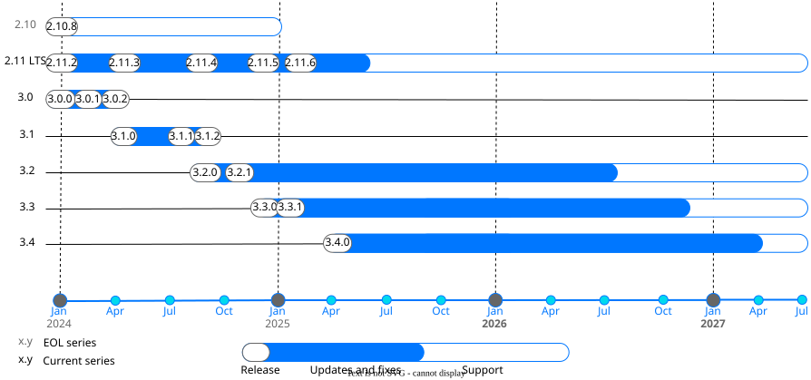

:noindex:
:fullwidth:

..  _release:

Releases
========

This section contains information about 3.x Tarantool releases: release notes, lifecycle
information, release policy, and other documents.
To download Tarantool releases, check the `Download <https://www.tarantool.io/en/download/>`_ page.
To see information about earlier Tarantool versions, see the
`Releases <https://www.tarantool.io/en/doc/2.11/release/>`_ page of the corresponding documentation.

All currently supported versions are listed on this page :ref:`below <release-supported-versions>`.
Information about earlier versions is provided in :ref:`release-eos-versions`.

The Enterprise Edition of Tarantool is distributed in the form of an SDK that has
its own versioning. See the :ref:`release-enterprise-changelog` to learn about
SDK version numbering and changes.

The detailed information about Tarantool version numbering and release lifecycle
is available in :ref:`release-policy`.

Backward compatibility is guaranteed between all versions in the same :term:`release series`.
It is also appreciated but not guaranteed between different release series (major number changes).
To learn more, read the :doc:`Compatibility guarantees <compatibility>` article.

..  _release-supported-versions:

Supported versions
------------------

Every Tarantool release series has :ref:`the same lifecycle <release-series-lifecycle>`
defined by the release policy. The following diagram visualizes the lifecycle of currently
supported Tarantool versions:

The table below provides information about supported versions with links to their
*What's new* pages in the documentation and detailed changelogs on GitHub.
For information about earlier versions, see :doc:`eos_versions`.

.. note::

    *End of life* (*EOL*) means the release series will no longer receive any patches,
    updates, or feature improvements after the specified date.

    *End of support* (*EOS*) means that we won't provide technical support to product
    versions after the specified date. Versions that haven't
    reached their end of life yet are shown in **bold**.

..  container:: table

    ..  list-table::
        :header-rows: 1

        *   -   Series
            -   First release date
            -   End of life
            -   End of support
            -   Versions

        *   -   :doc:`3.6 </release/3.6.0>`
            -   **December 12, 2025**
            -   **Not planned yet**
            -   **Not planned yet**
            -   | :tarantool-release:`3.6.0`

        *   -   :doc:`3.5 </release/3.5.0>`
            -   **August 27, 2025**
            -   **Not planned yet**
            -   **Not planned yet**
            -   | :tarantool-release:`3.5.0`

        *   -   :doc:`3.4 </release/3.4.0>`
            -   **April 14, 2025**
            -   **April 14, 2027**
            -   **Not planned yet**
            -   | :tarantool-release:`3.4.0`

        *   -   :doc:`3.3 </release/3.3.0>`
            -   **November 29, 2024**
            -   **November 29, 2026**
            -   **Not planned yet**
            -   | :tarantool-release:`3.3.1`
                | :tarantool-release:`3.3.0`

        *   -   :doc:`3.2 </release/3.2.0>`
            -   **August 26, 2024**
            -   **August 26, 2026**
            -   **Not planned yet**
            -   | :tarantool-release:`3.2.1`
                | :tarantool-release:`3.2.0`

..  toctree::
    :maxdepth: 1

    policy
    3.6.0
    3.5.0
    3.4.0
    3.3.0
    3.2.0
    eos_versions
    enterprise-changelog
    compatibility
