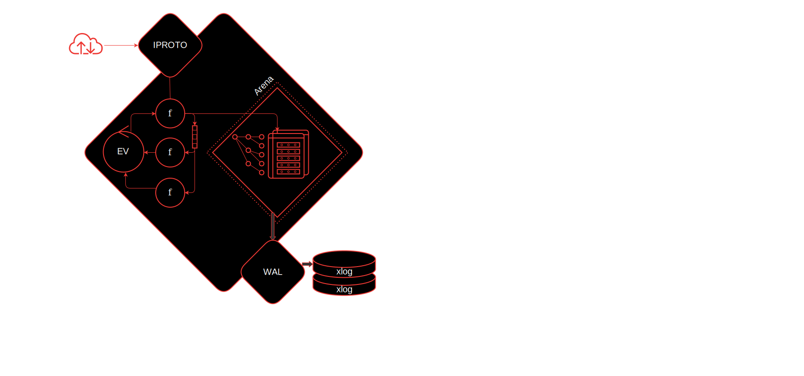
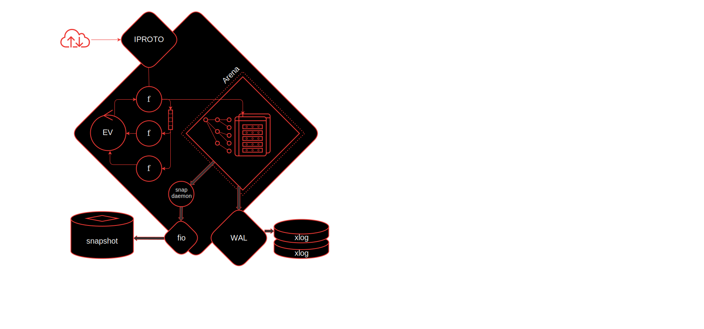
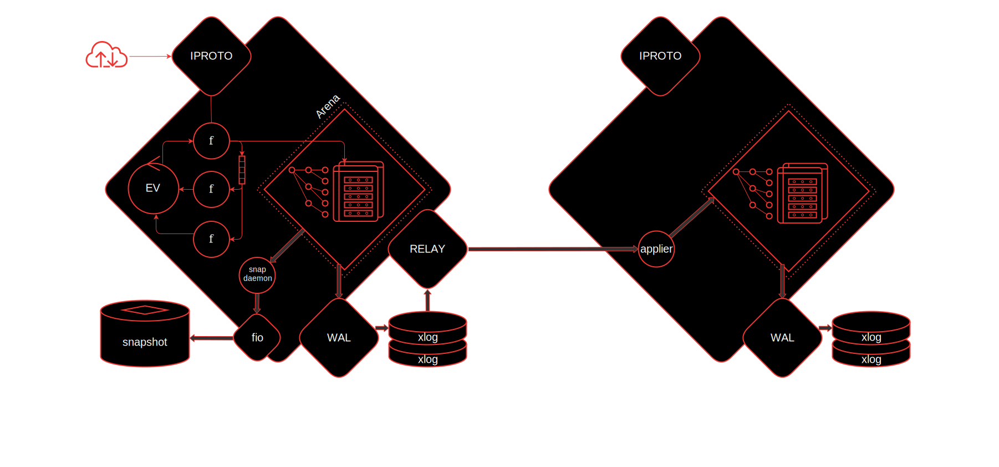

.. _engines-memtx:

Storing data with memtx
=======================

The ``memtx`` storage engine is used in Tarantool by default.
The engine keeps all data in random-access memory (RAM), and therefore has a low read latency.

Tarantool prevents the data loss in case of emergency, such as outage or Tarantool instance failure, in the following ways:

*   Tarantool persists all data changes by writing requests to the :ref:`write-ahead log <internals-wal>` (WAL)
    that is stored on disk. Also, Tarantool periodically takes the entire
    :doc:`database snapshot </reference/reference_lua/box_snapshot>` and saves it on disk.
    Learn more: :ref:`Data persistence <memtx-persist>`.

*   In case of a distributed application, a synchronous replication is used to ensure keeping the data consistent on a quorum of replicas.
    Although replication is not directly a storage engine topic, it is a part of the answer regarding data safety.
    Learn more: :ref:`Replicating data <memtx-replication>`.

In this section, the following topics are discussed in brief with the references to other sections that explain the
subject matter in details.

..  contents::
    :local:
    :depth: 1

.. _memtx-memory:

Memory model
------------

There is a fixed number of independent :ref:`execution threads <thread_model>`.
The threads don't share state. Instead they exchange data using low-overhead message queues.
While this approach limits the number of cores that the instance uses,
it removes competition for the memory bus and ensures peak scalability of memory access and network throughput.

Only one thread, namely, the **transaction processor thread** (further, **TX thread**)
can access the database, and there is only one TX thread for each Tarantool instance.
In this thread, transactions are executed in a strictly consecutive order.
Multi-statement transactions exist to provide isolation:
each transaction sees a consistent database state and commits all its changes atomically.
At commit time, a yield happens and all transaction changes are written to :ref:`WAL <internals-wal>` 
in a single batch.
In case of errors during transaction execution, a transaction is rolled-back completely.
Read more in the following sections: :ref:`transaction_model`, :ref:`txn_mode_transaction-manager`.

Within the TX thread, there is a memory area allocated for Tarantool to store data. It's called **Arena**.

.. image:: memtx/arena2.svg

Data is stored in :term:`spaces <space>`. Spaces contain database records -- :term:`tuples <tuple>`.
To access and manipulate the data stored in spaces and tuples, Tarantool builds :doc:`indexes </concepts/data_model/indexes>`.

Special `allocators <https://github.com/tarantool/small>`__ manage memory allocations for spaces, tuples, and indexes within the Arena.
The slab allocator is the main allocator used to store tuples.
Tarantool has a built-in module called ``box.slab`` which provides the slab allocator statistics
that can be used to monitor the total memory usage and memory fragmentation.
For more details, see the ``box.slab`` module :doc:`reference </reference/reference_lua/box_slab>`.

Also inside the TX thread, there is an event loop. Within the event loop, there are a number of :ref:`fibers <fiber-fibers>`.
Fibers are cooperative primitives that allow interaction with spaces, that is, reading and writing the data.
Fibers can interact with the event loop and between each other directly or by using special primitives called channels.
Due to the usage of fibers and :ref:`cooperative multitasking <app-cooperative_multitasking>`, the ``memtx`` engine is lock-free in typical situations.

To interact with external users, there is a separate :ref:`network thread <thread_model>` also called the **iproto thread**.
The iproto thread receives a request from the network, parses and checks the statement,
and transforms it into a special structure—a message containing an executable statement and its options.
Then the iproto thread ships this message to the TX thread and runs the user's request in a separate fiber.

.. _memtx-persist:

Data persistence
----------------

Tarantool ensures :ref:`data persistence <index-box_persistence>` as follows:

*   After executing data change requests in memory, Tarantool writes each such request to the :ref:`write-ahead log (WAL) <internals-wal>` files (``.xlog``)
    that are stored on disk. Tarantool does this via a separate thread called the **WAL thread**.

*   Tarantool periodically takes the entire :doc:`database snapshot </reference/reference_lua/box_snapshot>` and saves it on disk.
    It is necessary for accelerating instance's restart because when there are too many WAL files, it can be difficult for Tarantool to restart quickly.

    To save a snapshot, there is a special fiber called the :ref:`snapshot daemon <configuration_persistence_checkpoint_daemon>`.
    It reads the consistent content of the entire Arena and writes it on disk into a snapshot file (``.snap``).
    Due of the cooperative multitasking, Tarantool cannot write directly on disk because it is a locking operation.
    That is why Tarantool interacts with disk via a separate pool of threads from the :doc:`fio </reference/reference_lua/fio>` library.

So, even in emergency situations such as an outage or a Tarantool instance failure,
when the in-memory database is lost, the data can be restored fully during Tarantool restart.

What happens during the restart:

1.  Tarantool finds the latest snapshot file and reads it.
2.  Tarantool finds all the WAL files created after that snapshot and reads them as well.
3.  When the snapshot and WAL files have been read, there is a fully recovered in-memory data set
    corresponding to the state when the Tarantool instance stopped.
4.  While reading the snapshot and WAL files, Tarantool is building the primary indexes.
5.  When all the data is in memory again, Tarantool is building the secondary indexes.
6.  Tarantool runs the application.

.. _memtx-indexes:

Accessing data
--------------

To access and manipulate the data stored in memory, Tarantool builds indexes.
Indexes are also stored in memory within the Arena.

Tarantool supports a number of :ref:`index types <index-types>` intended for different usage scenarios.
The possible types are TREE, HASH, BITSET, and RTREE.

Select query are possible against secondary index keys as well as primary keys.
Indexes can have multi-part keys.

For detailed information about indexes, refer to the :doc:`/concepts/data_model/indexes` page.

.. _memtx-replication:

Replicating data
----------------

Although this topic is not directly related to the ``memtx`` engine, it completes the overall picture of how Tarantool works in case of a distributed application.

Replication allows multiple Tarantool instances to work on copies of the same database.
The copies are kept in sync because each instance can communicate its changes to all the other instances.
It is implemented via WAL replication.

To send data to a replica, Tarantool runs another thread called **relay**.
Its purpose is to read the WAL files and send them to replicas.
On a replica, the fiber called **applier** is run. It receives the changes from a remote node and applies them to the replica's Arena.
All the changes are being written to WAL files via the replica's WAL thread as if they are done locally.

By default, :ref:`replication <replication-architecture>` in Tarantool is asynchronous: if a transaction
is committed locally on a master node, it does not mean it is replicated onto any
replicas.

:ref:`Synchronous replication <repl_sync>` exists to solve this problem. Synchronous transactions
are not considered committed and are not responded to a client until they are
replicated onto some number of replicas.

For more information on replication, refer to the :ref:`corresponding chapter <replication>`.

.. _memtx-summary:

Summary
-------

The main key points describing how the in-memory storage engine works can be summarized in the following way:

*   All data is in RAM.
*   Access to data is from one thread.
*   Tarantool writes all data change requests in WAL.
*   Data snapshots are taken periodically.
*   Indexes are build to access the data.
*   WAL can be replicated.
