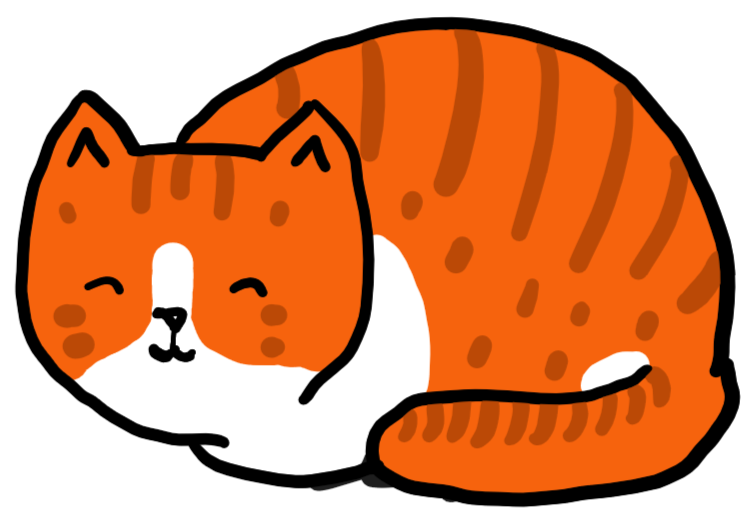
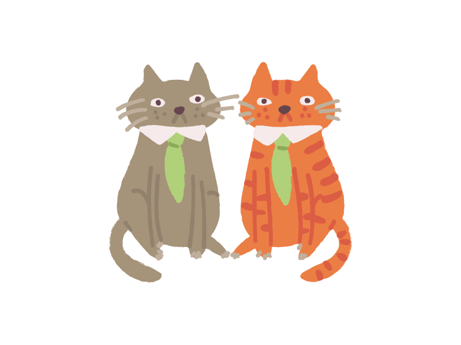

:orphan:

..  _page_example:

Заголовок 1-го уровня
=====================

Заголовок 2-го уровня
---------------------

Заголовок 3-го уровня
~~~~~~~~~~~~~~~~~~~~~

Заголовок 4-го уровня
^^^^^^^^^^^^^^^^^^^^^

Работа с кодом
--------------

Внутристрочный код
~~~~~~~~~~~~~~~~~~

    *   с бэктиками - ``echo "Hello world!"``, ``ìd==0``, ``tarantoolsession``

    *   с ролью **code** - :code:`echo "Hello world!"`, :code:`ìd==0`, :code:`tarantoolsession`.

Блок кода
~~~~~~~~~

..  code-block:: lua

    for page in paged_iter("X", 10) do
        print("New Page. Number Of Tuples = " .. #page)
        for i=1,#page,1 do print(page[i]) end
    end

..  code-block:: none

    Это блок кода без подсветки.

Подсветка переменных в коде
~~~~~~~~~~~~~~~~~~~~~~~~~~~

:samp:`{space_object}:insert(\\{ffi.cast('double', {value})\\})`

..  cssclass:: highlight
..  parsed-literal::

    :samp:`box.space.{space-name}:create_index('{index-name}')`

Директории: :file:`/usr/bin/example.py`

Guilabel
--------

Пример 1
~~~~~~~~

Кнопка :guilabel:`Старт`

Пример 2 (с &)
~~~~~~~~~~~~~~

Кнопка :guilabel:`&Старт`

Ссылки
------

Ссылки выглядят `так <https://github.com/tarantool/tarantool/issues>`__.

Ссылка с ролью **:ref:** :ref:`здесь <page_example>`

Работа с терминами
------------------

..  glossary::

    слово1
        определение

    термин2
        определение

Например, это ссылка на определение термина :term:`слово1`.
У термина в ссылке может быть :term:`кастомный текст <слово1>`.

Для акронимов и аббревиатур можно использовать соответствующую роль:

    Some text here :abbr:`PVC (persistent volume claim)`.

Адмонишены
----------

*   Заметка (note):

    ..  note::

        Это замечание. Мы используем его, чтобы выделить дополнительную информацию,
        которая может быть полезна пользователю.

*   Предупреждение (warning):

    ..  warning::

        Это блок с предупреждением. Используется, чтобы предупредить пользователей о чем-то.

*   Блок "Важно" (Important):

    .. IMPORTANT::

        Таким блоком выделяют важную информацию,
        которую пользователю обязательно нужно увидеть.

*   Факт:

    ..  admonition:: Факт
        :class: fact

        Это факт. ``fact`` --- это наш кастомный CSS класс.
        Использовать его стоит, если другие варианты не подходят.

        Этот тип адмонишена требует явно заданного заголовка.

Отступы и списки
----------------

Пример 1
~~~~~~~~

*   Это маркированный список.
*   Второй элемент маркированного списка

    -   Вложенный список.
    -   Вложенный список 2.

        Два параграфа в одном элементе списка.

*   Продолжается список первого уровня

Пример 2
~~~~~~~~

#.  Это нумерованный список.
#.  Второй элемент.

    #.  Вложенный нумерованный список.
    #.  Второй элемент.

        #.  Крайне редко бывает и третий уровень.
        #.  Второй элемент.

Пример 3
~~~~~~~~

#.  Элемент списка 1.
    Первый параграф.

    Второй параграф.

#.  Элемент списка 2.

    *   Вложенный элемент списка.

        ..  code-block:: bash

            # блок кода внутри вложенного списка

    *   Еще один вложенный элемент списка.

.. // а это комментарий

Таблицы
-------

Пример 1
~~~~~~~~

..  list-table::
    :header-rows: 1

    *   -   Тип контента
        -   Пример контента

    *   -   Текст
        -   Так выглядит в таблице текст в несколько абзацев. Вот один абзац.
            Здесь должен быть какой-то длинный текст.

            А вот и второй абзац.
            И здесь должен быть какой-то интересный текст или просто длинный параграф.

    *   -   Маркированный список
        -   *   Это маркированный список внутри таблицы.

            *   Еще один элемент маркированного списка в таблице.

            *   Третий элемент

                -   Списки могут быть вложенными.

    *   -   Нумерованный список
        -   1.  Элемент списка 1.

            2.  Элемент списка 2.

                #.  Вложенный элемент списка.

    *   -   Внутристрочный код
        -   ``echo "Hello world!"``, ``ìd==0``, ``tarantoolsession``,
            :code:`echo "Hello world!"`

    *   -   Блок кода
        -   ..  code-block:: lua

                for page in paged_iter("X", 10) do
                    print("New Page. Number Of Tuples = " .. #page)
                    for i=1,#page,1 do print(page[i]) end
                end

    *   -   Блок кода
        -   ..  code-block:: none

                Это блок кода без подсветки.

    *   -   Картинка в таблице
        -   ..  image::  test/cat4.png
                :scale: 30%

Пример 2
~~~~~~~~

..  container:: table

    ..  list-table::
        :widths: 25 75
        :header-rows: 1

        *   -   Name
            -   Use

        *   -   :doc:`/index`
            -   Link to ``index.rst``

..  _test-test_test:

Пример 3
~~~~~~~~

.. container:: table

    .. rst-class:: left-align-column-1
    .. rst-class:: left-align-column-2
    .. rst-class:: left-align-column-3
    .. rst-class:: left-align-column-4

    +-----------+------------+------------+----------------------+-------------------------+
    | SQL type  | NoSQL type | Aliases    | Minimum              | Maximum                 |
    +===========+============+============+======================+=========================+
    | BOOLEAN   | boolean    | BOOL       | FALSE                | TRUE                    |
    +-----------+------------+------------+----------------------+-------------------------+
    | INTEGER   | integer    | INT        | -9223372036854775808 | 18446744073709551615    |
    +-----------+------------+------------+----------------------+-------------------------+
    | UNSIGNED  | unsigned   | (none)     | 0                    | 18446744073709551615    |
    +-----------+------------+------------+----------------------+-------------------------+
    | DOUBLE    | double     | (none)     | -1.79769e308         | 1.79769e308             |
    +-----------+------------+------------+----------------------+-------------------------+
    | NUMBER    | number     | (none)     | -1.79769e308         | 1.79769e308             |
    +-----------+------------+------------+----------------------+-------------------------+
    | STRING    | string     | TEXT,      | ``''``               | ``'many-characters'``   |
    |           |            | VARCHAR(n) |                      |                         |
    +-----------+------------+------------+----------------------+-------------------------+
    | VARBINARY | varbinary  | (none)     | ``X''``              | ``X'many-hex-digits'``  |
    +-----------+------------+------------+----------------------+-------------------------+
    | UUID      | uuid       | (none)     | 00000000-0000-0000-  | ffffffff-ffff-ffff-     |
    |           |            |            | 0000-000000000000    | dfff-ffffffffffff       |
    +-----------+------------+------------+----------------------+-------------------------+
    | SCALAR    | scalar     | (none)     | FALSE                |  ``X'many-hex-digits'`` |
    +-----------+------------+------------+----------------------+-------------------------+

Картинки
--------

С директивой **image::**:

Еще пример:

Через **substitution**:

|image definition|

Второй пример определения картинок с помощью **substitution**:

Вот первая картинка |cat3|, а вот вторая картинка |cat4|.

..  |cat4| image:: test/cat4.png
    :height: 100
    :width: 100

Шаблоны
-------

Функция
~~~~~~~

..  module:: fiber

..  function:: create(function [, function-arguments])

    Create and start a fiber. The fiber is created and begins to run immediately.

    :param function: the function to be associated with the fiber
    :param function-arguments: what will be passed to function

    :return: created fiber object
    :rtype: userdata

    **Example:**

    ..  code-block:: none

        tarantool> fiber = require('fiber')
        ---
        ...
        tarantool> function function_name()
                 >   print("I'm a fiber")
                 > end
        ---
        ...
        tarantool> fiber_object = fiber.create(function_name); print("Fiber started")
        I'm a fiber
        Fiber started
        ---
        ...

Описание классов
~~~~~~~~~~~~~~~~

..  class:: index_object

    ..  method:: get(key)

        Search for a tuple via the given index.

        :param index_object index_object: an object reference.
        :param scalar/table      key: values to be matched against the index key

        :return: the tuple whose index-key fields are equal to the passed key values
        :rtype:  tuple

        **Possible errors:**

        * no such index;
        * wrong type;
        * more than one tuple matches.

        **Complexity factors:** Index size, Index type.

        **Example:**

        ..  code-block:: none

            tarantool> box.space.tester.index.primary:get(2)
            ---
            - [2, 'Music']
            ...

    ..  data:: unique

        True if the index is unique, false if the index is not unique.

        :rtype: boolean

        **Example:**

        ..  code-block:: none

            tarantool> box.space.tester.index.primary.unique
            ---
            - true
            ...

