..  _tcm_ui_overview:

Web interface overview
======================

..  include:: index.rst
    :start-after: ee_note_tcm_start
    :end-before: ee_note_tcm_end

The |tcm_full_name| web interface is available on the hostname and port defined by the
``http.host`` and ``http.port`` :ref:`configuration options <tcm_configuration>`.
If TLS is enabled, it uses the ``https`` protocol, otherwise the protocol is ``http``.
When started locally with the default configuration, |tcm| is available at ``http://127.0.0.1:8080``.

..  _tcm_ui_login:

Logging into TCM
----------------

To log into |tcm| after bootstrap, use the following credentials:

-   **Username**: ``admin``
-   **Password**: the initial password is shown in the |tcm| boot log in
    a message like this:

    .. code-block:: text

        Jun 11 11:24:08.900 WRN Generated super admin credentials login=admin password=jS9PsdkEJBYNhdMtSswMlxDR1vdbfc1N

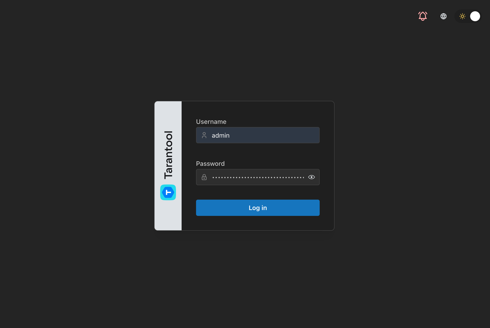

After logging in with the default password:

#.  Adjust the :ref:`password policy <tcm_access_control_password_policy>`
    in accordance to the security requirements that apply in your organization.
#.  Change the ``admin`` user's password on the :ref:`User settings <tcm_ui_user_settings>` page.

To log out of |tcm|, click the user's name in the header and click **Log out**.

..  _tcm_ui_page_structure:

Page structure
--------------

The |tcm| web interface consists of three parts:

#.  **Navigation page** on the left shows the list of pages available to the user.
    The navigation pane can be collapsed by clicking the cross icon at its top.
#.  **Header** at the top provides access to notifications and :ref:`user settings <tcm_ui_user_settings>`.
#.  **Working area** displays the contents of the selected page.

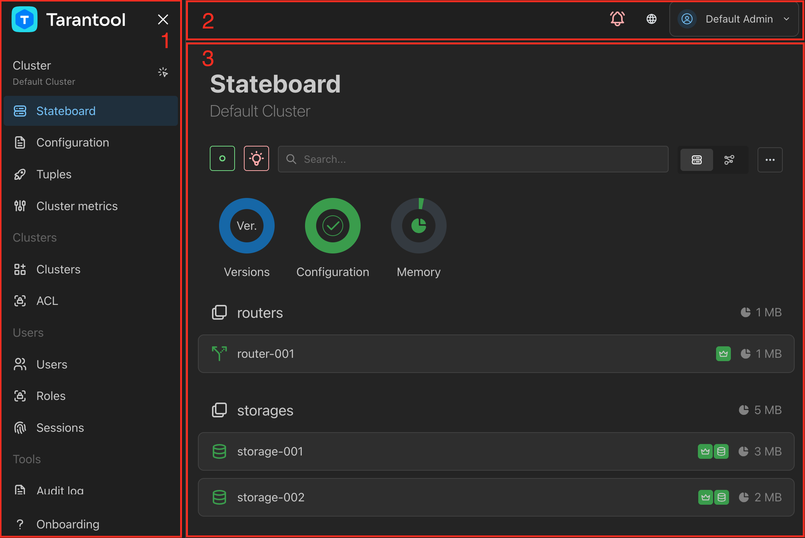

..  _tcm_ui_onboarding:

Onboarding
----------

The **Onboarding** item of the navigation pane starts the interactive onboarding
tutorial. Use it to get familiar with main |tcm| features directly in the web interface.

..  _tcm_ui_visibility:

Page visibility
---------------

This overview describes most |tcm| pages. The exact set of pages and controls available
to a particular are determined by the user's :ref:`permissions <tcm_access_control_permissions>`.

Some features, such as data schema editing, are available only in the **development** mode.
You can switch to it in the :ref:`user settings <tcm_ui_user_settings>` of the **Default Admin** user.

..  _tcm_ui_groups:

Page groups
-----------

For easier navigation, |tcm| pages are grouped in the navigation pane by their content.
There are the following page groups:

-   **Cluster**: interaction with the selected cluster.
-   **Clusters**: interaction with all connected clusters in general.
-   **Users**: access management.
-   **Tools**: |tcm| administration.
-   **Settings**: runtime management of |tcm| settings.

Read on to learn what you can do on pages of these groups.

..  _tcm_ui_cluster:

Cluster
-------

The **Cluster** group includes pages used for interaction with a particular cluster.
To switch between clusters, click the **Cluster** group name and select a connected
cluster from the drop-down list.

..  _tcm_ui_cluster_stateboard:

Stateboard
~~~~~~~~~~

The cluster **Stateboard** is a main page for monitoring the cluster state
and interacting with its instances.

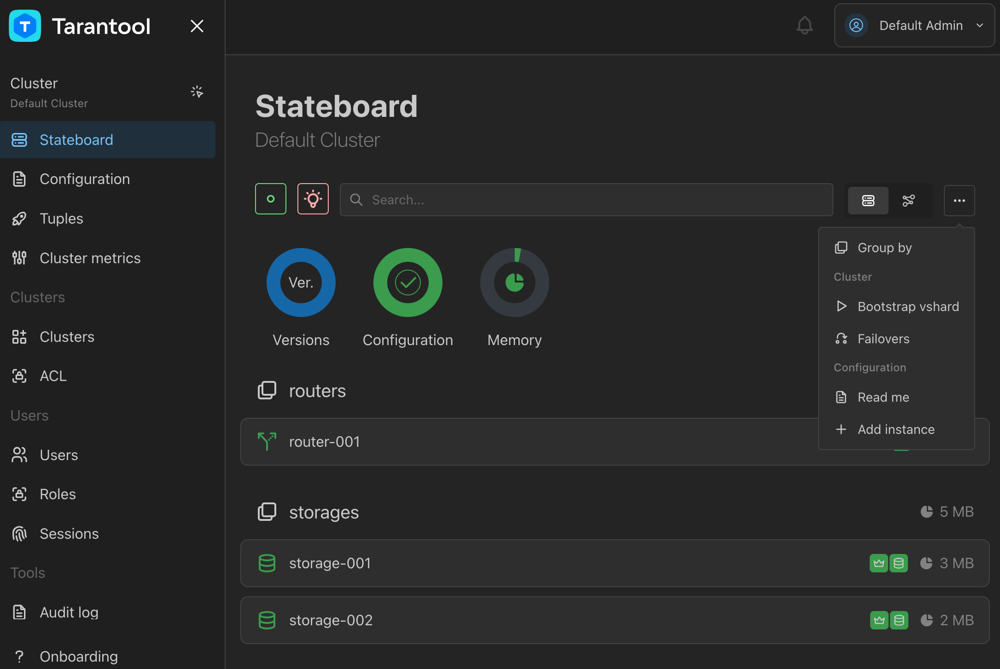

On this page, you can:

-   view and edit the cluster topology
-   group and filter instances based on various criteria
-   view memory statistics and Tarantool versions running on instances
-   navigate to :ref:`instance pages <tcm_ui_instance>`
    by clicking instance names in the cluster topology list
-   start and stop instances (in the development mode).

Learn more about using the cluster stateboard in :ref:`tcm_cluster_state`.

..  _tcm_ui_instance:

Instance page
~~~~~~~~~~~~~

The instance page opens when you click an instance name on the **Stateboard**.

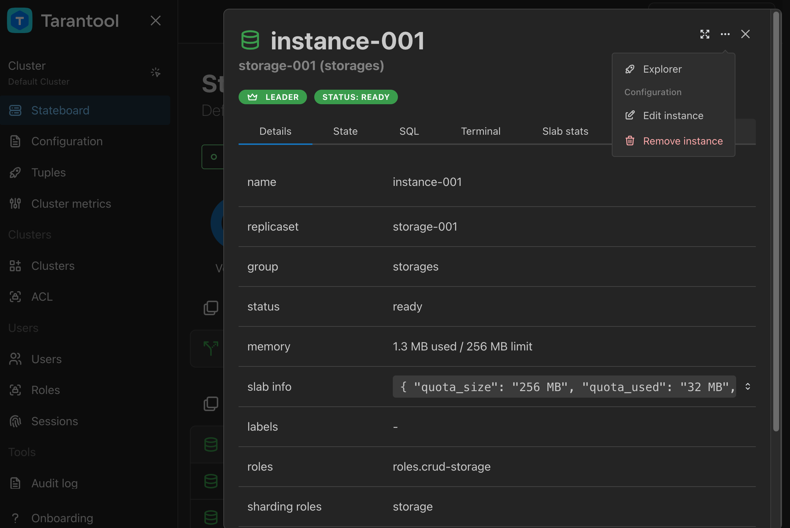

It provides a set of tabs for performing actions on the selected Tarantool instance:

-   **Details** and **State** tabs: view instance details as a human-readable table
    or as a console output of ``box.cfg``, ``box.info``, and other built-in functions
-   **SQL** and **Terminal** tabs: run SQL and Lua commands on the instance
-   **Logs** tab: view instance logs
-   **Slabs** tab: view :ref:`slab allocator <memtx-memory>` statistics
-   **Users** tab: manage Tarantool :ref:`users and roles <tcm_cluster_users>` on the instance
-   **Funcs**: manage and call stored functions
-   **Metrics**: view instance metrics

The instance page has an **Actions** menu at the top that allows you to:

-   navigate to the :ref:`instance explorer <tcm_ui_instance_explorer>`
-   edit the instance configuration
-   remove the instance

..  _tcm_ui_cluster_config:

Configuration
~~~~~~~~~~~~~

The cluster **Configuration** page provides an interactive editor for the cluster
:ref:`configuration <configuration>`. It is connected to the centralized configuration
storage that the cluster uses. All changes you make and apply on this page are
sent to this centralized storage.

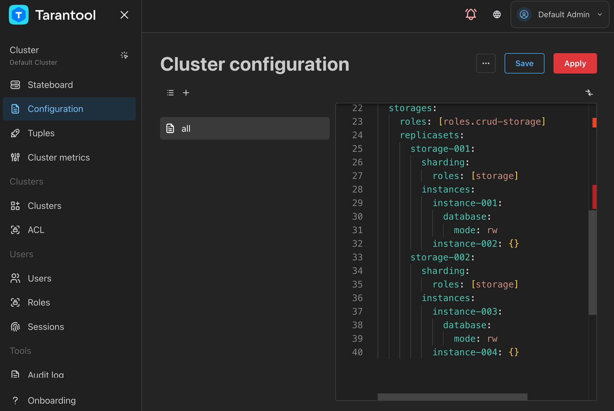

Learn more in :ref:`tcm_configuring_clusters`.

..  _tcm_ui_cluster_security:

Security
~~~~~~~~

The **Security** page provides controls for managing the cluster security settings.

.. image:: _images/tcm_ui_cluster_security.png
    :align: left
    :width: 700
    :alt: TCM cluster security page

Learn more in :ref:`tcm_cluster_security`.

..  _tcm_ui_cluster_migrations:

Migrations
~~~~~~~~~~

The **Migrations** page provides centralized migration management tools for the selected cluster.

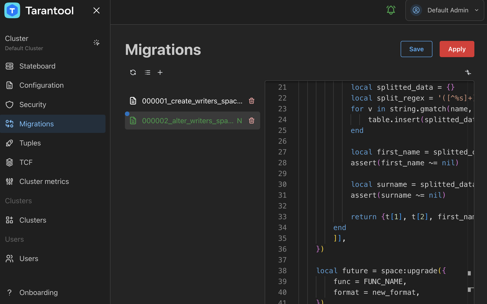

Learn more in :ref:`tcm_cluster_migrations`.
..  _tcm_ui_cluster_tuples:

Tuples
~~~~~~

.. important::

    The cluster-wide access to stored data on the **Tuples** page is supported only
    for sharded clusters that use the `CRUD <https://github.com/tarantool/crud>`__ module.

The **Tuples** page provides access to data stored in user spaces of the selected
cluster.

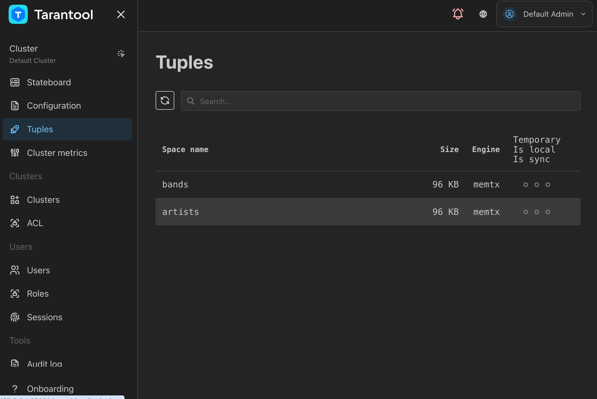

On this page, you can:

-   view the list of user spaces, their size and engines
-   view and edit tuples stored in user spaces

..  _tcm_ui_cluster_metrics:

Cluster metrics
~~~~~~~~~~~~~~~

The **Cluster metrics** page provides access to the selected cluster's :ref:`metrics <metrics-reference>`.

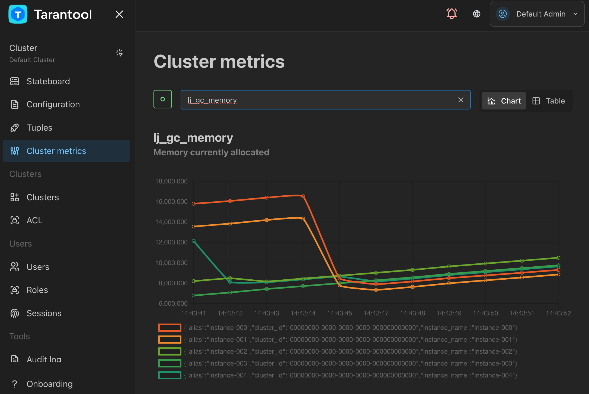

Learn more in :ref:`tcm_cluster_metrics`.

..  _tcm_ui_instance_explorer:

Instance explorer
~~~~~~~~~~~~~~~~~

The instance **Explorer** provides access to all spaces of a specific instance,
including system spaces.

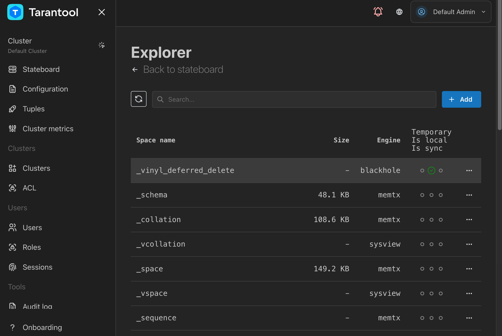

On this page, you can:

-   view and edit instance spaces, their size and engines
-   view and edit tuples stored in all spaces of the instance

..  _tcm_ui_clusters:

Clusters
--------

The **Clusters** group includes pages used for managing |tcm|'s cluster connections.

..  _tcm_ui_clusters_clusters:

Clusters
~~~~~~~~

The **Clusters** page lists Tarantool clusters that are connected to |tcm|.

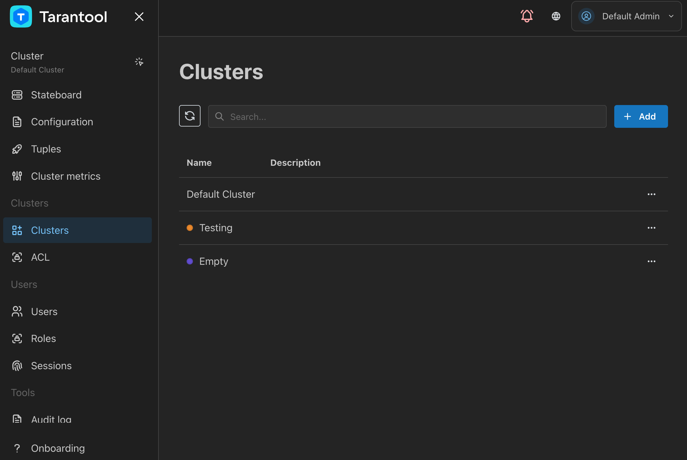

On this page, you can:

-   connect Tarantool clusters to |tcm|
-   edit cluster connections
-   disconnect clusters

Learn more in :ref:`tcm_connect_clusters`.

..  _tcm_ui_clusters_acl:

ACL
~~~

The **ACL** page displays the |tcm| access control list.

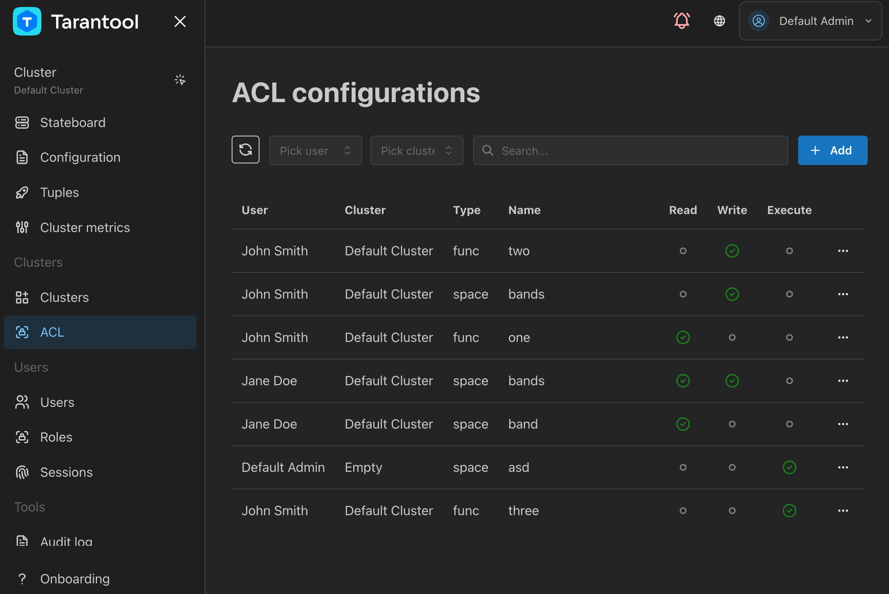

On this page, you can add and delete ACL entries. Learn more in :ref:`tcm_access_control_list`.

..  _tcm_ui_users:

Users
-----

The **Users** group includes pages related to user access to |tcm|.

..  _tcm_ui_users_users:

Users
~~~~~

The **Users** page lists |tcm| users.

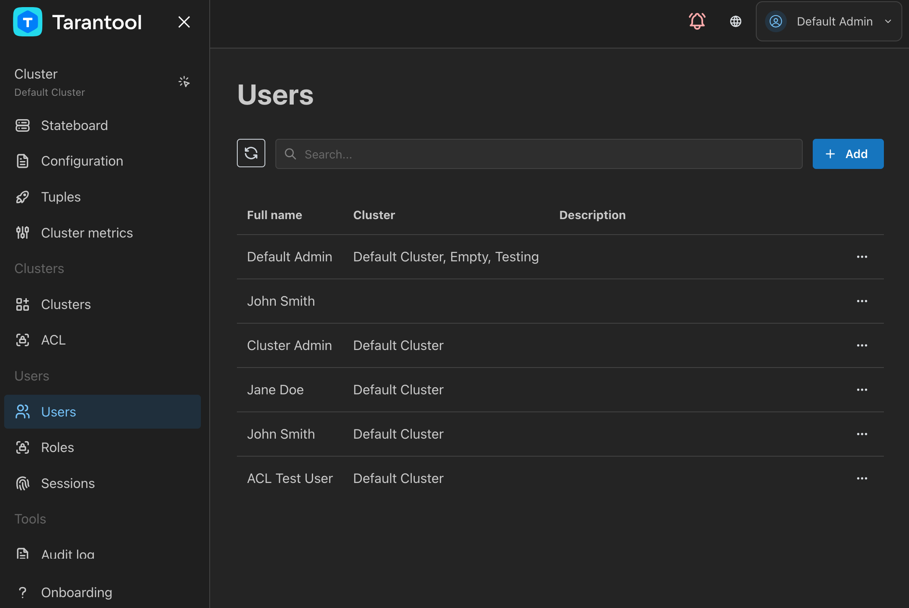

On this page, you can:

-   add, edit, and delete users
-   manage user secrets (:ref:`passwords <tcm_access_control_passwords>` and
    :ref:`API tokens <tcm_access_control_api_tokens>`)
-   revoke user sessions

Learn more in :ref:`tcm_access_control_users`.

..  _tcm_ui_users_roles:

Roles
~~~~~

The **Roles** page lists |tcm| user roles.

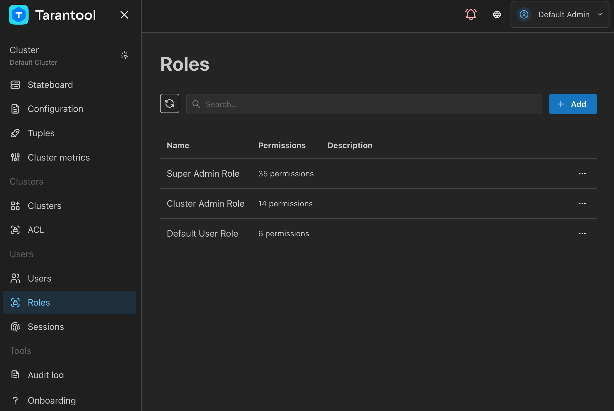

On this page, you can add, edit, and delete roles. Learn more in :ref:`tcm_access_control_roles`.

..  _tcm_ui_users_sessions:

Sessions
~~~~~~~~

The **Sessions** page lists active sessions of |tcm| users.

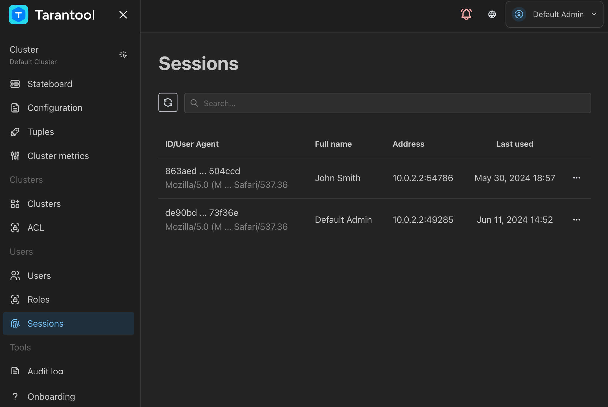

On this page, you can view and revoke sessions. Learn more in :ref:`tcm_access_control_sessions`.

..  _tcm_ui_tools:

Tools
-----

The **Tools** group includes service pages used for |tcm| maintenance and monitoring.

..  _tcm_ui_tools_audit_log:

Audit log
~~~~~~~~~

The **Audit log page** displays the |tcm| :ref:`audit log <tcm_audit_log>`.

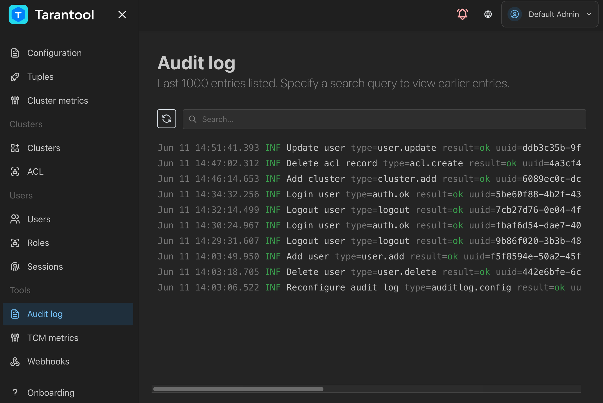

..  _tcm_ui_tools_metrics:

TCM metrics
~~~~~~~~~~~

The **TCM metrics** page provides access to the |tcm| metrics.

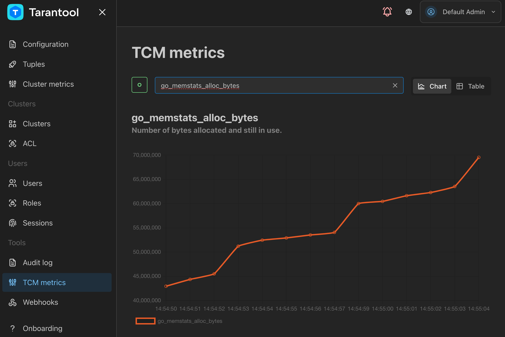

..  _tcm_ui_settings:

Settings
--------

The **Settings** group includes service pages where you can configure various |tcm| features.

..  _tcm_ui_settings_policy:

Password policy
~~~~~~~~~~~~~~~

On the **Password policy** page, you can configure the requirements to user passwords,
such as minimal length, required symbols, expiration, and other settings.
Learn more in :ref:`tcm_access_control_password_policy`.

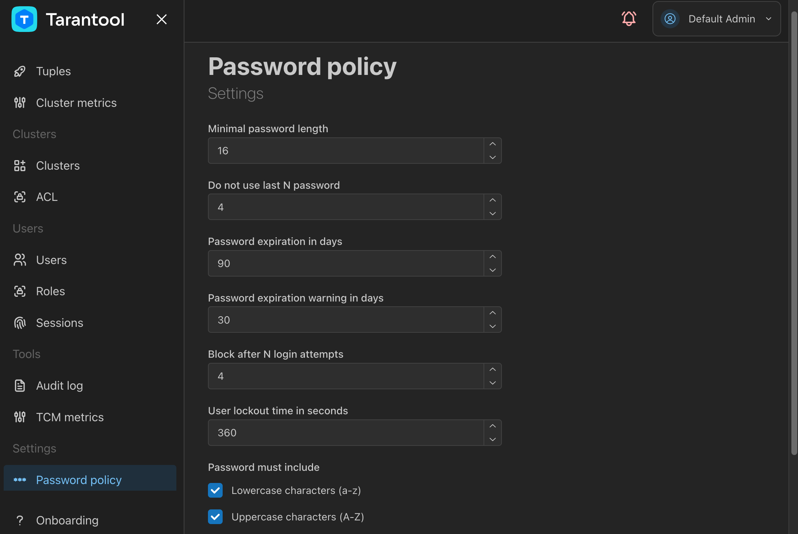

..  _tcm_ui_settings_audit:

Audit settings
~~~~~~~~~~~~~~

On the **Audit settings** page, you can configure how |tcm| records events to its
audit log: whether audit log is enabled, which events are recorded, and so on.
Learn more in :ref:`tcm_audit_log`.

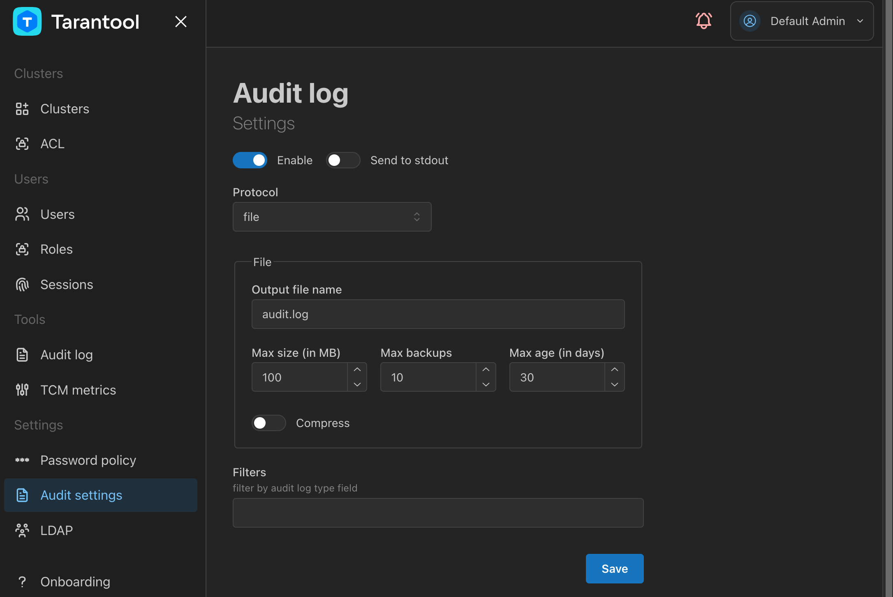

..  _tcm_ui_settings_ldap:

LDAP
~~~~

On the **LDAP** page, you can manage |tcm| LDAP configurations.

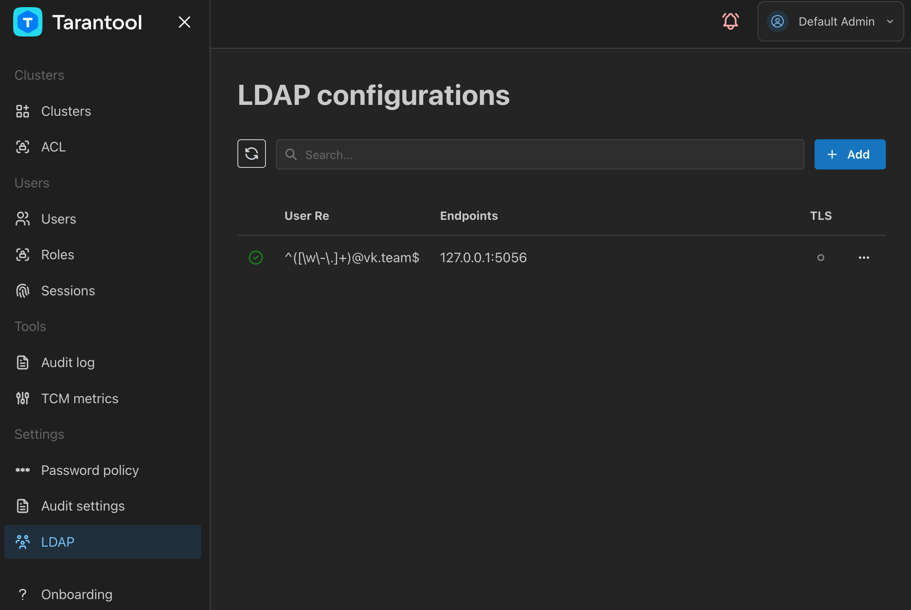

..  _tcm_ui_user_settings:

User settings
-------------

The user settings dialog opens when you click **Settings** under the user's name
in the header.

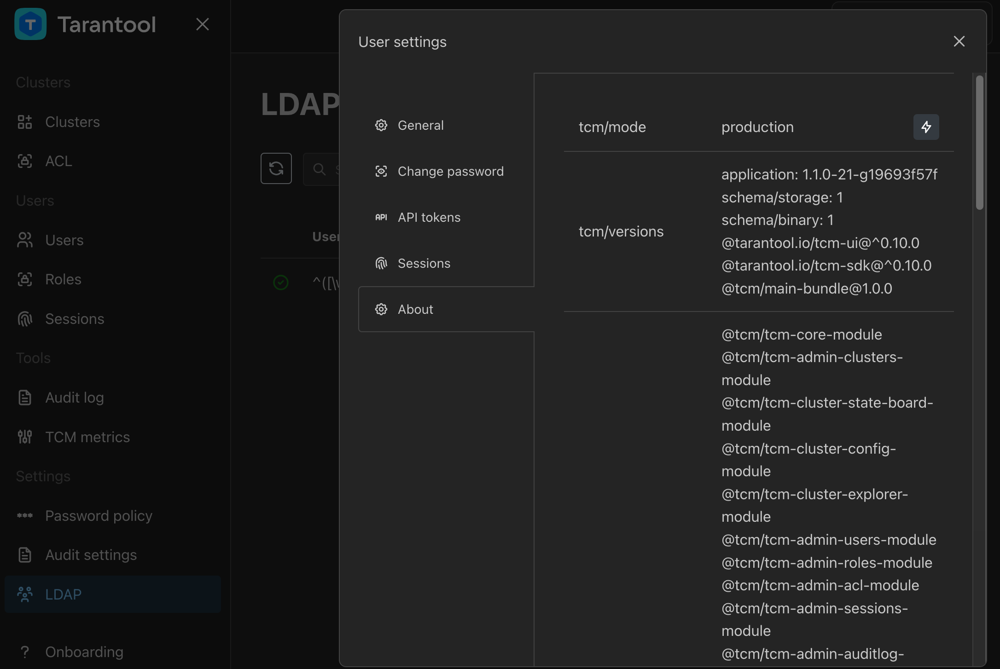

This dialog includes the following tabs:

-   **General** tab: switch the color theme
-   **Change password** tab: change your password
-   **API tokens** tab: generate and delete :ref:`API tokens <tcm_access_control_api_tokens>`
-   **Sessions** tab: view and revoke your user sessions
-   **About** tab: view |tcm| information about switch between development and production modes
