..  _tcm_ui_overview:

Web interface overview
======================

..  include:: index.rst
    :start-after: ee_note_tcm_start
    :end-before: ee_note_tcm_end

The |tcm_full_name| web interface is available on the hostname and port defined by the
``http.host`` and ``http.port`` :ref:`configuration options <tcm_configuration>`.
If TLS is enabled, it uses the ``https`` protocol, otherwise the protocol is ``http``.
When started locally with the default configuration, |tcm| is available at ``http://127.0.0.1:8080``.

..  _tcm_ui_login:

Logging into TCM
----------------

To log into |tcm| after bootstrap, use the following credentials:

-   **Username**: ``admin``
-   **Password**: the initial password is shown in the |tcm| boot log in
    a message like this:

    .. code-block:: text

        Jun 11 11:24:08.900 WRN Generated super admin credentials login=admin password=jS9PsdkEJBYNhdMtSswMlxDR1vdbfc1N

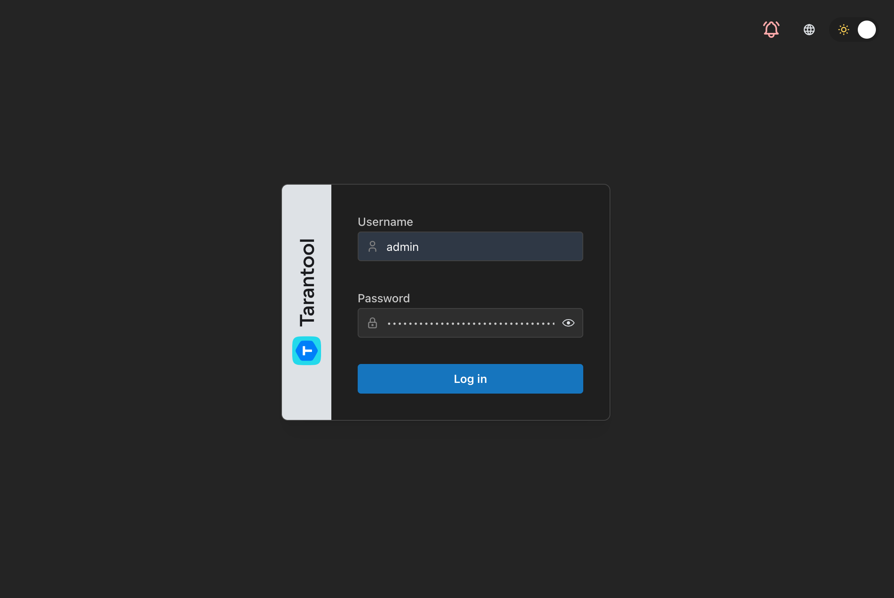

After logging in with the default password:

#.  Adjust the :ref:`password policy <tcm_access_control_password_policy>`
    in accordance with the security requirements that apply in your organization.
#.  Change the ``admin`` user's password on the :ref:`User settings <tcm_ui_user_settings>` page.

To log out of |tcm|, click the user's name in the header and click **Log out**.

..  _tcm_ui_page_structure:

Page structure
--------------

The |tcm| web interface consists of three parts:

#.  **Navigation page** on the left shows the list of pages available to the user.
    The navigation pane can be collapsed by clicking the cross icon at its top.
#.  **Header** at the top provides access to notifications and :ref:`user settings <tcm_ui_user_settings>`.
#.  **Working area** displays the contents of the selected page.

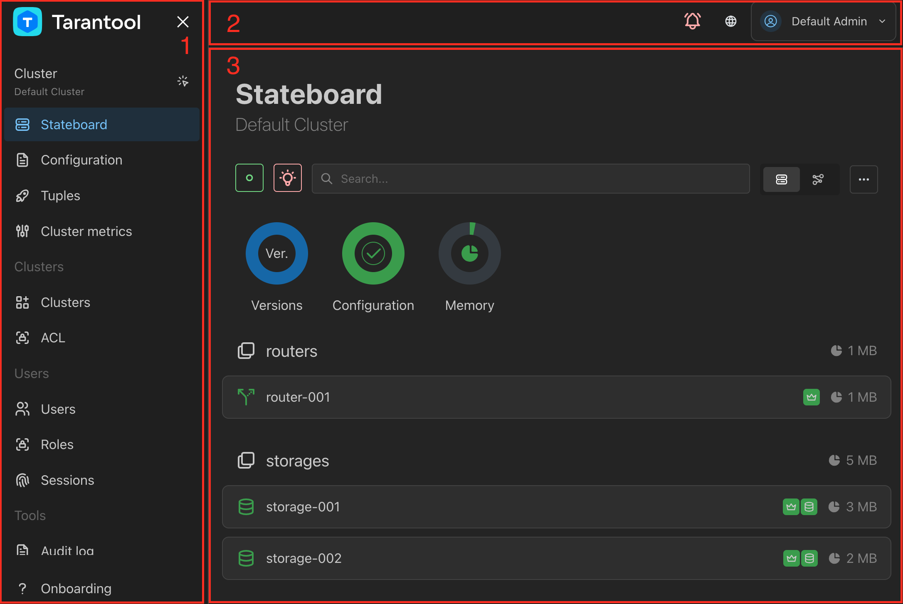

..  _tcm_ui_onboarding:

Onboarding
----------

The **Onboarding** item of the navigation pane starts the interactive onboarding
tutorial. Use it to get familiar with the main |tcm| features directly in the web interface.

..  _tcm_ui_visibility:

Page visibility
---------------

This overview describes most |tcm| pages. The exact set of pages and controls available
to a particular user is determined by the user's :ref:`permissions <tcm_access_control_permissions>`.

Some features, such as data schema editing, are available only in the **development** mode.
You can switch to it in the :ref:`user settings <tcm_ui_user_settings>` of the **Default Admin** user.
To learn more about the development mode, see :ref:`tcm_dev_mode`.

..  _tcm_ui_groups:

Page groups
-----------

For easier navigation, |tcm| pages are grouped in the navigation pane by their content.
There are the following page groups:

-   **Cluster**: interaction with the selected cluster.
-   **Clusters**: interaction with all connected clusters in general.
-   **Users**: access management.
-   **Tools**: |tcm| administration.
-   **Settings**: runtime management of |tcm| settings.

Read on to learn what you can do on the pages of these groups.

..  _tcm_ui_cluster:

Cluster
-------

The **Cluster** group includes pages used for interaction with a particular cluster.
To switch between clusters, click the **Cluster** group name and select a connected
cluster from the drop-down list.

..  _tcm_ui_cluster_stateboard:

Stateboard
~~~~~~~~~~

The cluster **Stateboard** is a main page for monitoring the cluster state
and interacting with its instances.

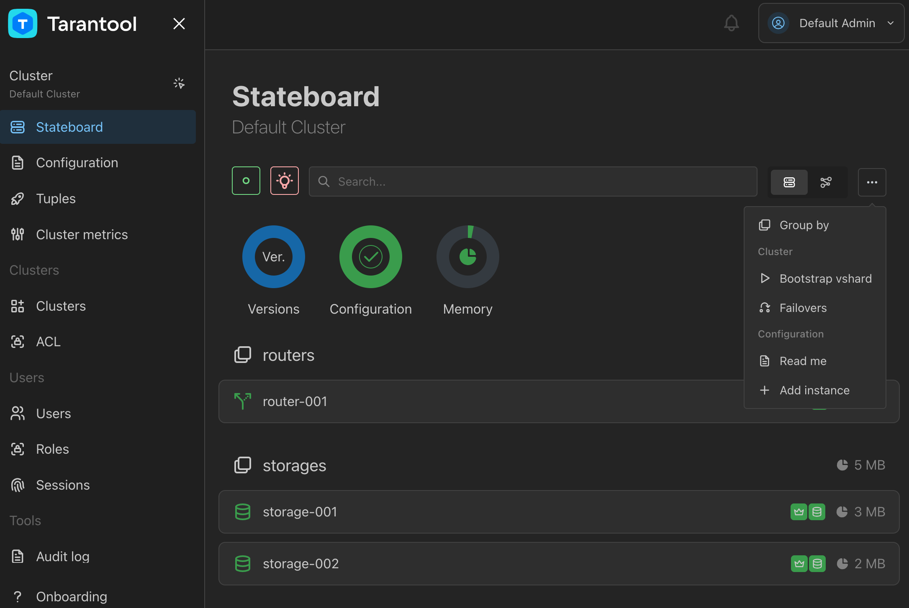

On this page, you can:

-   view and edit the cluster topology
-   group and filter instances based on various criteria
-   view memory statistics and Tarantool versions running on instances
-   navigate to :ref:`instance pages <tcm_ui_instance>`
    by clicking instance names in the cluster topology list
-   start and stop instances (in the development mode).

Learn more about using the cluster stateboard in :ref:`tcm_cluster_state`.

..  _tcm_ui_instance:

Instance page
~~~~~~~~~~~~~

The instance page opens when you click an instance name on the **Stateboard**.

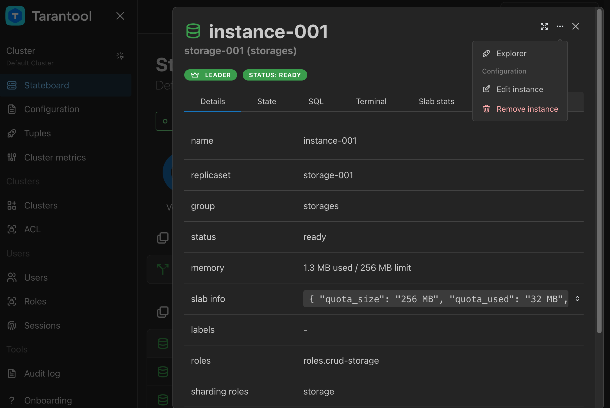

It provides a set of tabs for performing actions on the selected Tarantool instance:

-   **Details** and **State** tabs: view instance details as a human-readable table
    or as a console output of ``box.cfg``, ``box.info``, and other built-in functions
-   **SQL** and **Terminal** tabs: run SQL and Lua commands on the instance
-   **Logs** tab: view instance logs
-   **Slabs** tab: view :ref:`slab allocator <memtx-memory>` statistics
-   **Users** tab: manage Tarantool :ref:`users and roles <tcm_cluster_users>` on the instance
-   **Funcs**: manage and call stored functions
-   **Metrics**: view instance metrics

The instance page has an **Actions** menu at the top that allows you to:

-   navigate to the :ref:`instance explorer <tcm_ui_instance_explorer>`
-   edit the instance configuration
-   remove the instance

Slabs tab overview
~~~~~~~~~~~~~~~~~~

The **Slabs** tab in the TCM Web UI visualizes memory allocation within each Tarantool instance using the slab allocator.

This tab is useful for:

- identifying memory fragmentation
- analyzing slab saturation by object size
- debugging excessive memory use in real time

Data source
^^^^^^^^^^^

This visualization is based on the output of:

.. code-block:: lua

    box.slab.stats()

This function returns a Lua table with per-class (per object size) memory allocation statistics from the slab allocator.
More about :ref:`box.slab.stats() <box_slab_stats>`.

Each entry in the output contains:

- ``item_size``: object size class
- ``slab_count``: number of slab blocks
- ``slab_size``: memory size of each slab
- ``item_count``: number of allocated objects
- ``mem_used``: bytes used
- ``mem_free``: bytes free

These values are parsed and rendered as visual elements in the UI.

Slab visualization
^^^^^^^^^^^^^^^^^^

Each block represents a single slab (a fixed-size memory region). The color indicates how full the slab is:

- **Green** — the slab is less than 30% full
- **Red** — slab is full (100% usage)
- **Gradient colors between green and red** — indicate intermediate fill levels (e.g., 30%, 50%, 75%)

The color transitions smoothly, providing a quick visual way to understand which slabs are:

- actively used
- partially utilized
- potentially underused or contributing to memory fragmentation

In the example screenshot:

- Slab #17 (168 KB) — 75% full (dark red)
- Slab #18 (320 KB) — 53% full (brownish-red)
- Slab #16 (40 KB) — only 1% used (bright green)
- Slab #2 (56 B) — 60% used (intermediate gradient)

Each slab block’s size in the visualization reflects the total memory allocated for its ``item_size`` class --
the more memory allocated, the larger the visual representation.

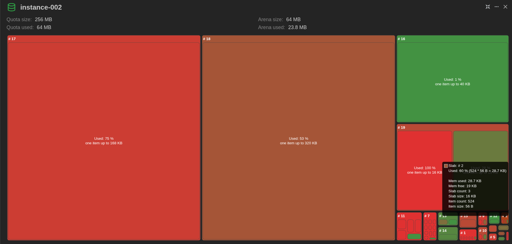

Calculating fill percentage
^^^^^^^^^^^^^^^^^^^^^^^^^^^

The overall fill percentage for a slab is calculated using:

.. code-block:: text

    fill % = (item_count * item_size) / (slab_count * slab_size)

However, each slab is visualized individually, so different fill levels across slabs will result in various colors within the same row.

Behavior across Tarantool instances
^^^^^^^^^^^^^^^^^^^^^^^^^^^^^^^^^^^

Slab allocation may vary between instances in the same replicaset due to differences in configuration, data loading order, and use of local memory.
The reasons are:

1.	Slab allocation may differ because each instance can use its own values for ``slab_alloc_factor`` and ``slab_alloc_granularity``. These parameters control how memory is divided into size classes and slabs, affecting memory layout and potential fragmentation.
2.	Differences also appear during replica join or restart. A replica allocates memory for tuples in primary index order, while on the master, allocation follows the order of incoming requests. This results in different slab structures and usually lower fragmentation on replicas after a restart.
3.	Local and temporary spaces exist only on specific instances and are not replicated. They consume memory independently and contribute to differences in slab allocation across nodes.

Slab allocator tuning
^^^^^^^^^^^^^^^^^^^^^

You can fine-tune the allocator behavior with two configuration options:

- :ref:`slab_alloc_factor <configuration_reference_memtx_slab_alloc_factor>` – multiplier for calculating object size classes. Default value: ``1.05``
- :ref:`slab_alloc_granularity <configuration_reference_memtx_slab_alloc_granularity>` – minimum allocation step (in bytes) for the small allocator. Default value: ``8``

These parameters affect how memory is allocated per object size class and can help:

- reduce internal fragmentation
- optimize memory usage
- improve slab locality and performance
- better understand memory consumption via the **Slabs** tab

Use cases and recommendations table:

.. list-table::
   :header-rows: 1
   :widths: 20 20 20 20 20

   * - Scenario / Goal
     - Parameters (`slab_alloc_factor` / `slab_alloc_granularity`)
     - Effect on memory
     - Effect on performance
     - Visualization in **Slabs** tab
   * - Reduce memory waste (small, uniform tuples)
     - ``1.05`` / ``4``
     - Many size classes – minimal internal memory waste
     - Higher overhead for managing slab pools
     - Many rows, partially filled blocks, gradient from green to red
   * - Optimize performance (mixed-size tuples)
     - ``1.3`` / ``16``
     - Fewer size classes – slightly more memory waste
     - Lower overhead – faster memory allocation
     - Fewer rows, larger blocks, color contrast: partially or filled
   * - Control fragmentation and slab count
     - Task-dependent: lower values – more classes; higher values – fewer classes
     - Balance between internal memory waste and the number of blocks
     - Balance between overhead and allocator speed
     - Balance between number of rows and block sizes; colors indicate fill level

..  _tcm_ui_cluster_config:

Configuration
~~~~~~~~~~~~~

The cluster **Configuration** page provides an interactive editor for the cluster
:ref:`configuration <configuration>`. It is connected to the centralized configuration
storage that the cluster uses. All changes you make and apply to this page are
sent to this centralized storage.

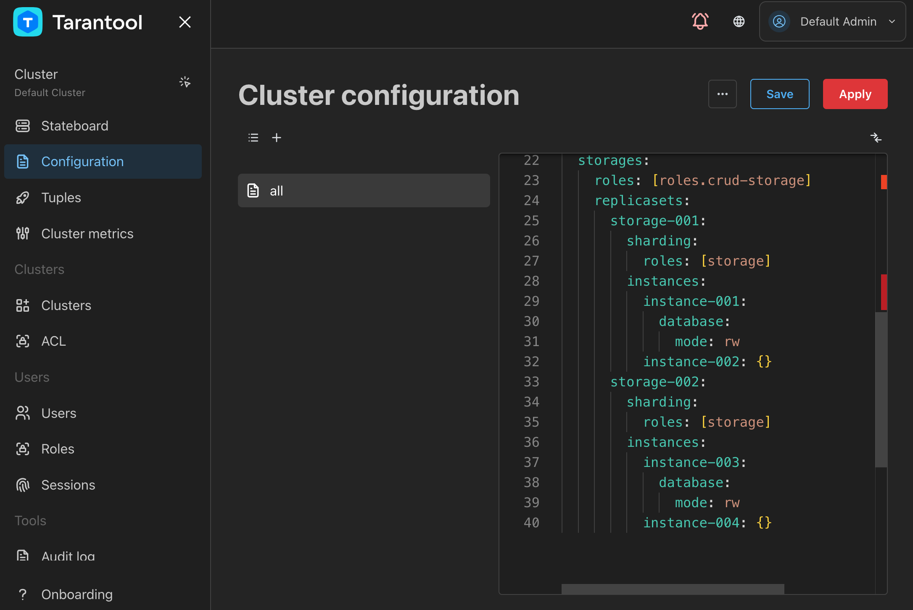

Learn more in :ref:`tcm_configuring_clusters`.

..  _tcm_ui_cluster_security:

Security
~~~~~~~~

The **Security** page provides controls for managing the cluster security settings.

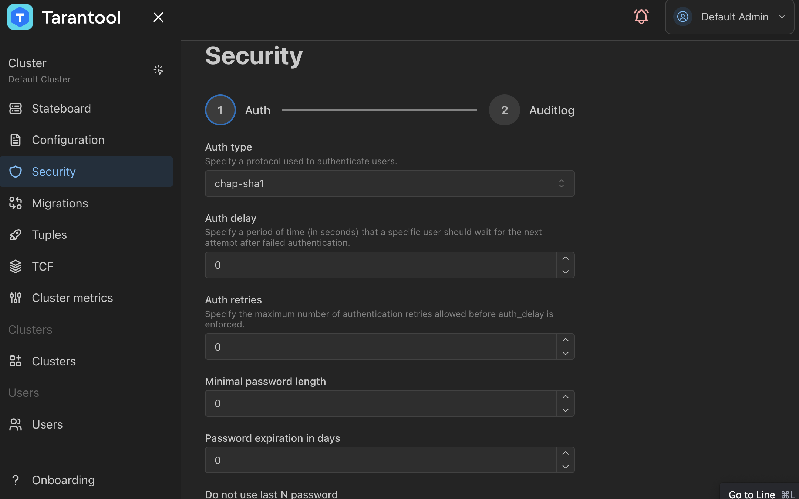

Learn more in :ref:`tcm_cluster_security`.

..  _tcm_ui_cluster_migrations:

Migrations
~~~~~~~~~~

The **Migrations** page provides centralized migration management tools for the selected cluster.

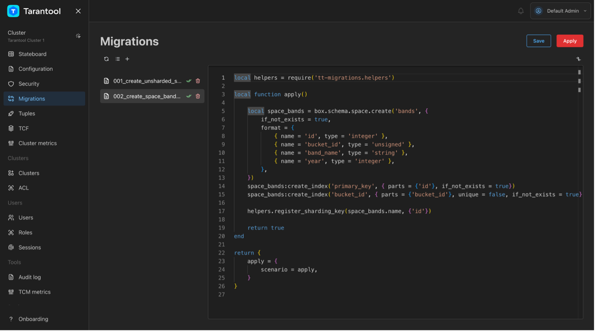

Learn more in :ref:`tcm_cluster_migrations`.

..  _tcm_ui_cluster_tuples:

Tuples
~~~~~~

.. important::

    The cluster-wide access to stored data on the **Tuples** page is supported only
    for sharded clusters that use the `CRUD <https://github.com/tarantool/crud>`__ module.

The **Tuples** page provides access to data stored in the user spaces of the selected
cluster.

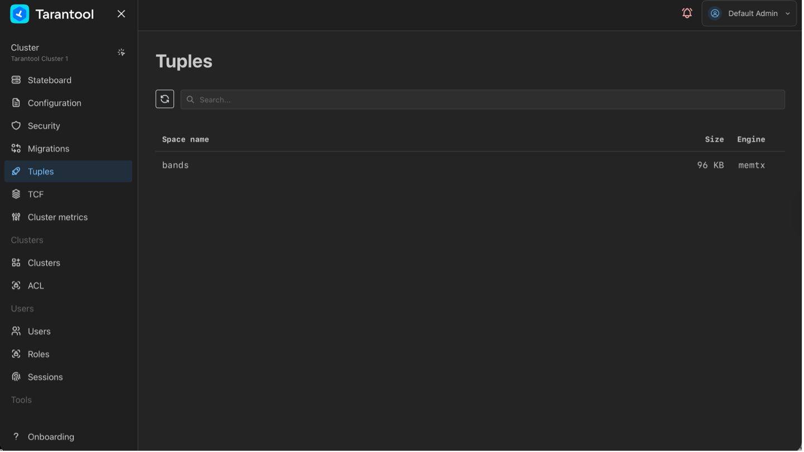

On this page, you can:

-   view the list of user spaces, their size, and engines
-   view and edit tuples stored in user spaces
-   search for tuples by entering *search condition* in the **Search** bar

Search by condition
^^^^^^^^^^^^^^^^^^^

TCM supports the following comparison operators:

- ``==`` -- equal to
- ``>`` -- greater than
- ``<`` -- less than
- ``>=`` -- greater than or equal to
- ``<=`` -- less than or equal to

Search condition has the following structure:

..  code-block:: text

    index_name comparator value

where:

- ``index_name`` -- the name of the index. This is the left-hand side of the expression.
- ``comparator`` -- a comparison operator (``>``, ``>=``, ``==``, ``<=``, ``<``). It must be separated by spaces on both sides of the expression.
- ``value`` -- a string, numeric, or boolean value. This is the right-hand side of the expression.
  String values must be enclosed in double quotes (``""``).

..  note::

    TCM does not support plain text search. For example, to search for customers named Ivan in a
    space, use the index name and a comparison operator to specify the expression:

    - correct: typing ``name == "Ivan"`` in the **Search** bar
    - incorrect: typing ``Ivan`` in the **Search** bar

**Examples**

The search expression below returns tuples with IDs greater than 9990:

..  code-block:: text

    id > 9990

In TCM, the result might look as follows:

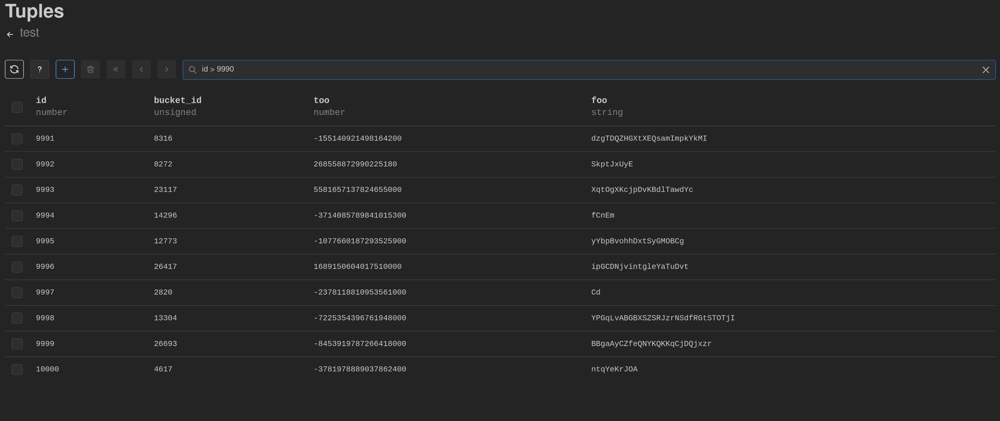

In the example below, the search returns tuples with the ``name`` index equal to ``Ivan``:

..  code-block:: text

    name == "Ivan"

..  _tcm_ui_cluster_tcf:

TCF
~~~

The **TCF** page provides an interface for clusters that run within `Tarantool Clusters Federation <https://www.tarantool.io/en/clustersfederation/>`__.

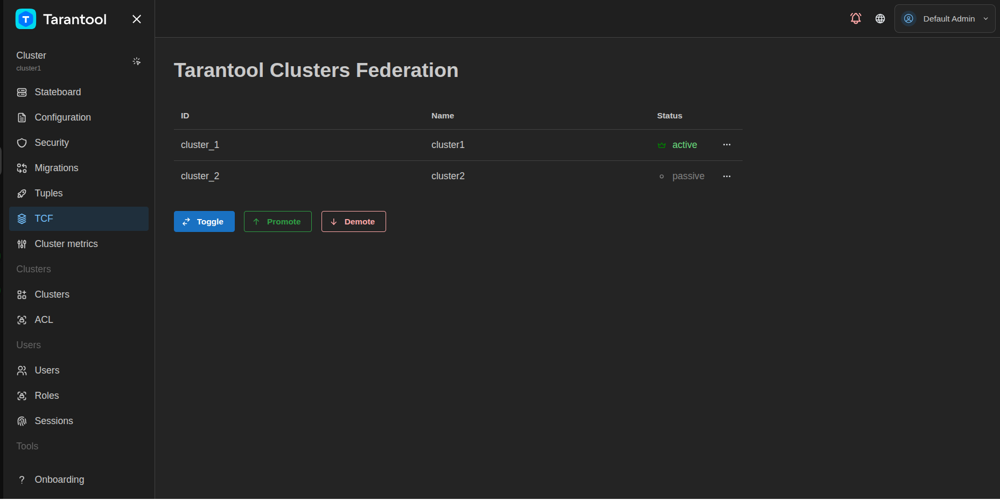

TCF page can be added via the |tcm| configuration file:

.. code-block:: yaml

    # tcm.yaml
    feature:
        tcf:True

On this page, you can:

*   view information about TCF clusters
*   toggle the state of clusters
*   promote or demote clusters
*   change key cluster parameters. To open the settings, click **Actions** (the three dots next to the cluster status) and select **Settings**. Available parameters:
  - ``dml_users``: list of DML users
  - ``cluster1``, ``cluster2``: cluster settings
  - ``replication_user``: replication username
  - ``replication_password``: password associated with the replication user
  - ``failover_timeout``: time period (in seconds) to wait before initiating failover to another cluster. Default value: ``20``
  - ``initial_status``: initial service state
  - ``max_suspect_counts``: maximum suspect counts for failover. Default value: ``3``
  - ``health_check_delay``: delay (in seconds) between health checks. Default value: ``2``
  - ``enable_system_check``: enables or disables system-level health checks. Default value: ``true``
  - ``status_ttl``: time-to-live for service status. Default value: ``4``

    .. image:: _images/tcm_tcf_settings.png
        :align: center
        :width: 700
        :alt: TCM TCF settings page

    .. image:: _images/tcm_tcf_settings_params.png
        :align: center
        :width: 700
        :alt: TCM TCF settings page

Learn more in :ref:`tcm_cluster_tcf`.

..  _tcm_ui_cluster_metrics:

Cluster metrics
~~~~~~~~~~~~~~~

The **Cluster metrics** page provides access to the selected cluster's :ref:`metrics <metrics-reference>`.

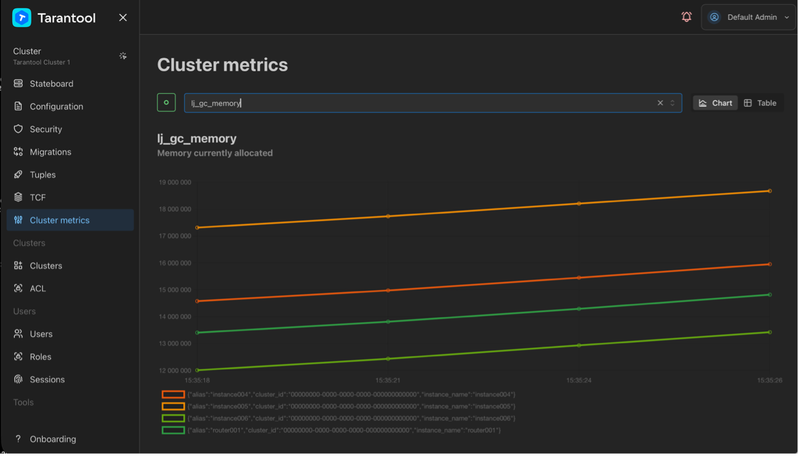

Learn more in :ref:`tcm_cluster_metrics`.

..  _tcm_ui_instance_explorer:

Instance explorer
~~~~~~~~~~~~~~~~~

The instance **Explorer** provides access to all spaces of a specific instance,
including system spaces.

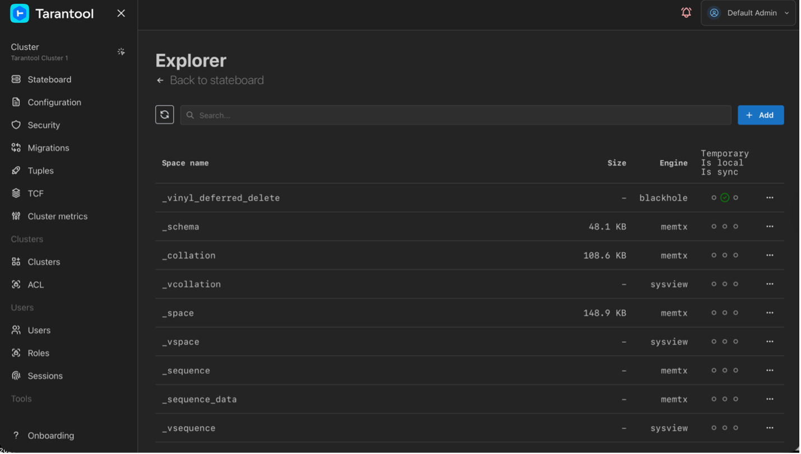

On this page, you can:

-   view and edit instance spaces, their size, and engines
-   view and edit tuples stored in all spaces of the instance

..  _tcm_ui_clusters:

Clusters
--------

The **Clusters** group includes pages used for managing |tcm|'s cluster connections.

..  _tcm_ui_clusters_clusters:

Clusters
~~~~~~~~

The **Clusters** page lists Tarantool clusters that are connected to |tcm|.

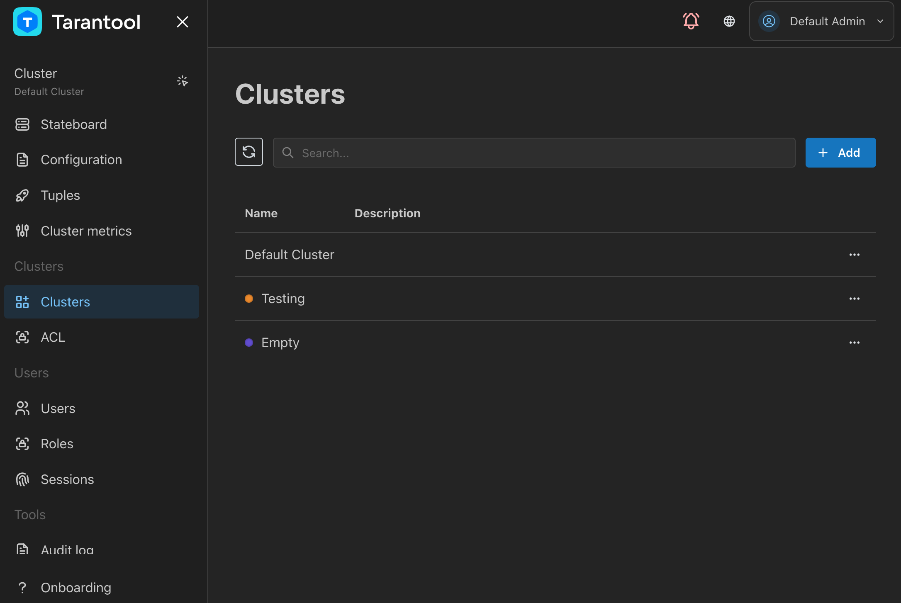

On this page, you can:

-   connect Tarantool clusters to |tcm|
-   edit cluster connections
-   disconnect clusters

Learn more in :ref:`tcm_connect_clusters`.

..  _tcm_ui_clusters_acl:

ACL
~~~

The **ACL** page displays the |tcm| access control list.

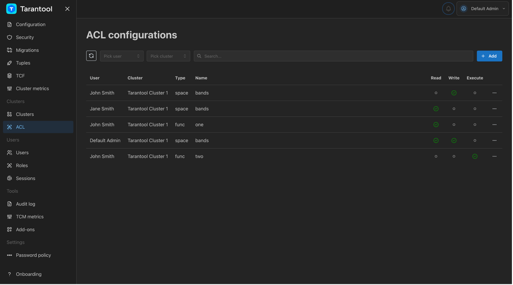

On this page, you can add and delete ACL entries. Learn more in :ref:`tcm_access_control_list`.

..  _tcm_ui_users:

Users
-----

The **Users** group includes pages related to user access to |tcm|.

..  _tcm_ui_users_users:

Users
~~~~~

The **Users** page lists |tcm| users.

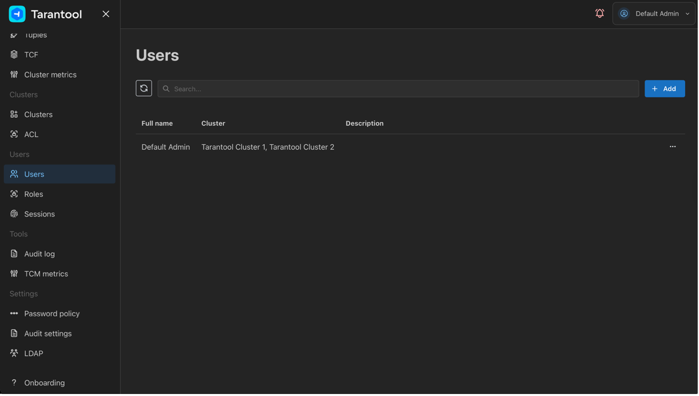

On this page, you can:

-   add, edit, and delete users
-   manage user secrets (:ref:`passwords <tcm_access_control_passwords>` and
    :ref:`API tokens <tcm_access_control_api_tokens>`)
-   revoke user sessions

Learn more in :ref:`tcm_access_control_users`.

..  _tcm_ui_users_roles:

Roles
~~~~~

The **Roles** page lists |tcm| user roles.

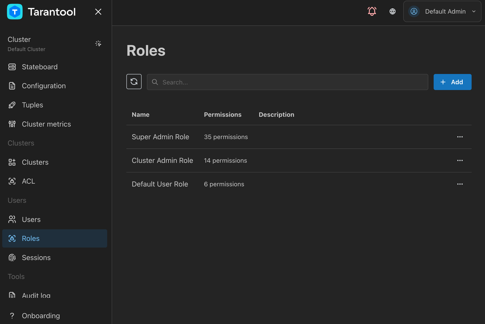

On this page, you can add, edit, and delete roles. Learn more in :ref:`tcm_access_control_roles`.

..  _tcm_ui_users_sessions:

Sessions
~~~~~~~~

The **Sessions** page lists active sessions of |tcm| users.

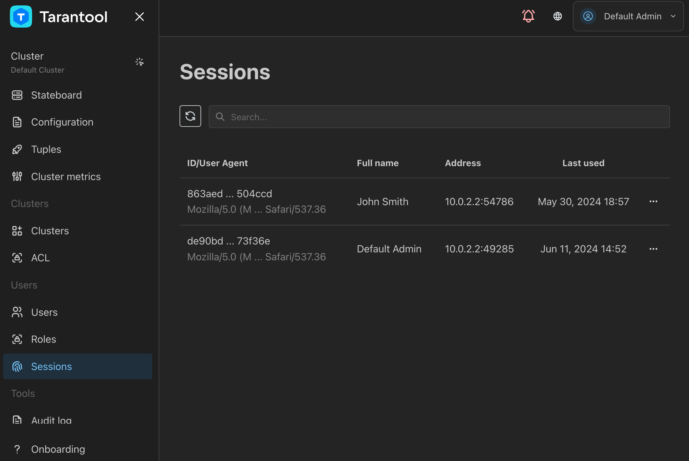

On this page, you can view and revoke sessions. Learn more in :ref:`tcm_access_control_sessions`.

..  _tcm_ui_tools:

Tools
-----

The **Tools** group includes service pages used for |tcm| maintenance and monitoring.

..  _tcm_ui_tools_audit_log:

Audit log
~~~~~~~~~

The **Audit log page** displays the |tcm| :ref:`audit log <tcm_audit_log>`.

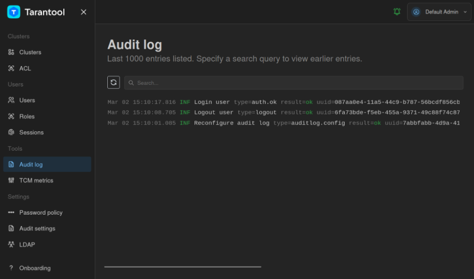

..  _tcm_ui_tools_metrics:

TCM metrics
~~~~~~~~~~~

The **TCM metrics** page provides access to the |tcm| metrics.

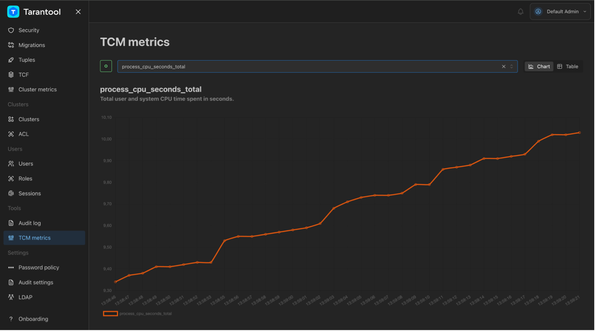

..  _tcm_ui_settings:

Settings
--------

The **Settings** group includes service pages where you can configure various |tcm| features.

..  _tcm_ui_settings_policy:

Password policy
~~~~~~~~~~~~~~~

On the **Password policy** page, you can configure the requirements to user passwords,
such as minimal length, required symbols, expiration, and other settings.
Learn more in :ref:`tcm_access_control_password_policy`.

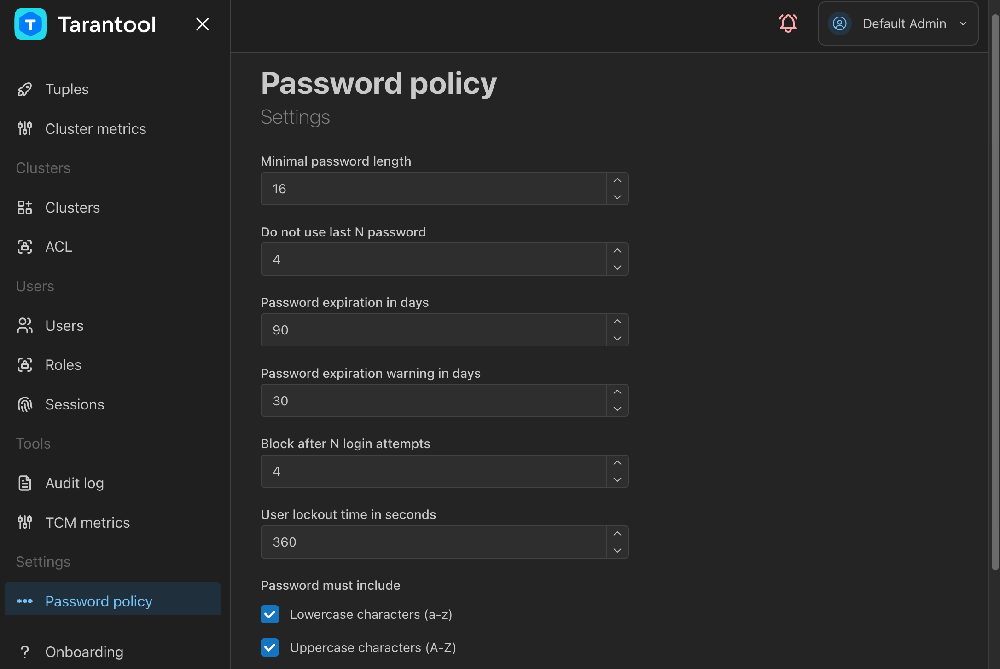

..  _tcm_ui_settings_audit:

Audit settings
~~~~~~~~~~~~~~

On the **Audit settings** page, you can configure how |tcm| records events to its
audit log: whether audit log is enabled, which events are recorded, and so on.
Learn more in :ref:`tcm_audit_log`.

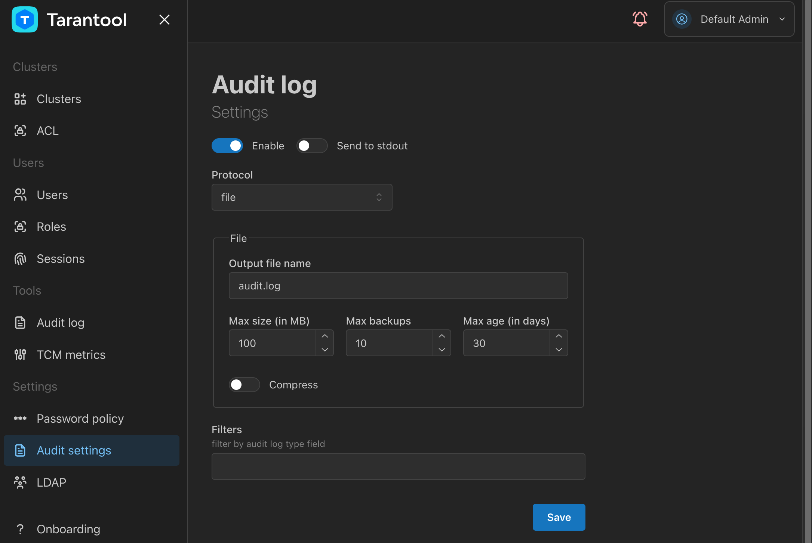

..  _tcm_ui_settings_ldap:

LDAP
~~~~

On the **LDAP** page, you can manage |tcm| LDAP configurations.

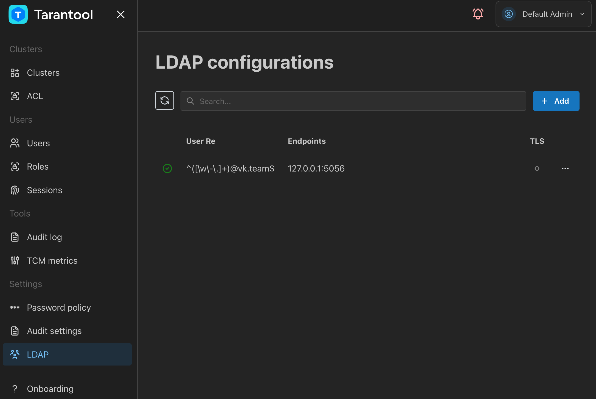

..  _tcm_ui_user_settings:

User settings
-------------

The user settings dialog opens when you click **Settings** under the user's name
in the header.

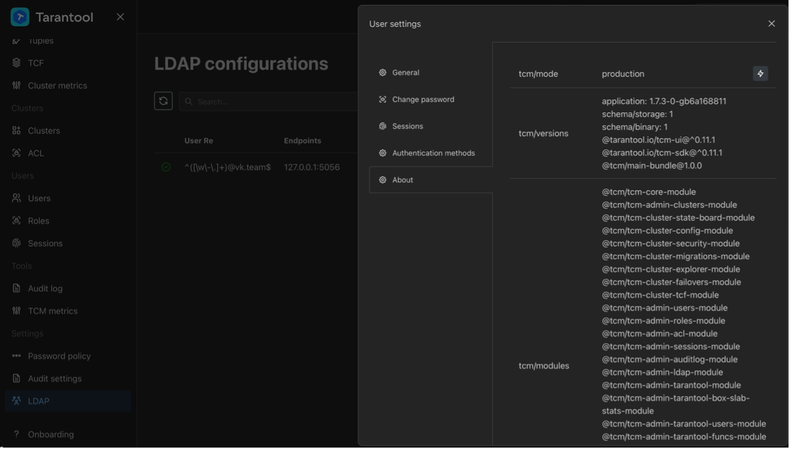

This dialog includes the following tabs:

-   **General** tab: switch the color theme
-   **Change password** tab: change your password
-   **API tokens** tab: generate and delete :ref:`API tokens <tcm_access_control_api_tokens>`
-   **Sessions** tab: view and revoke your user sessions
-   **About** tab: view |tcm| information about switch between development and production modes
